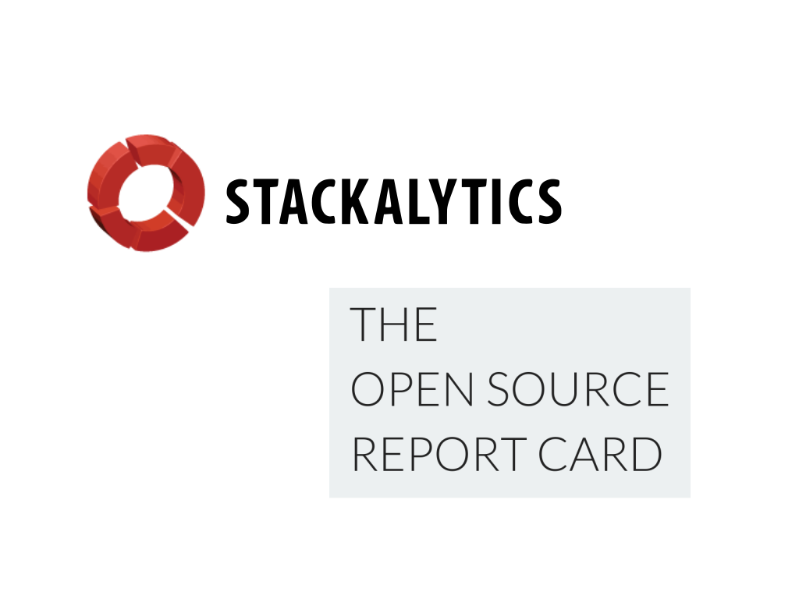
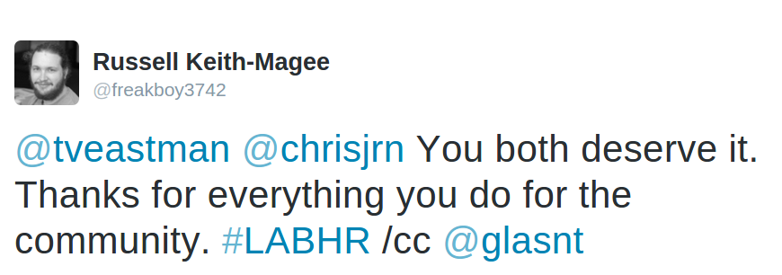
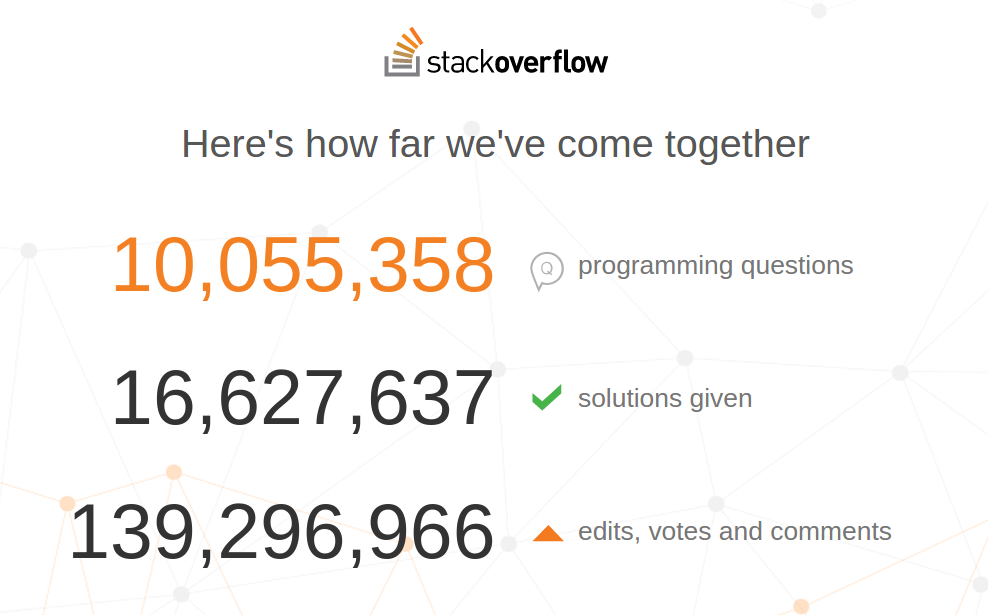
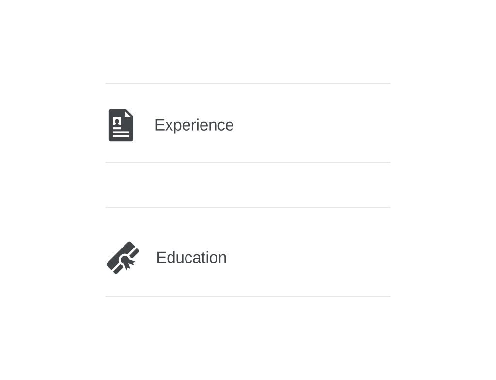
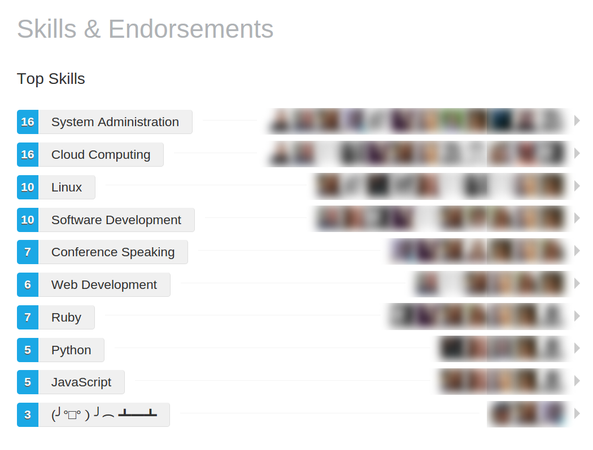

# Build a Better Hat Rack <!-- .slide: class="center" -->
## All Contributions Welcome

 

Note: These are my speaker notes.

There are many like them, but these ones are mine

---

# Hi <!-- .slide: class="center" -->

Note: Hi! I'm Katie, and I'm a software developer.

I use all the languages.

Just in the last year I've used Ruby, Perl, JavaScript, Haskell, and Python in production

---

 

Note: I do OSS contributions

Docker have paid me for my contributions

I am also an Active Technical Contributor for Open Stack

Want to know what my contribution to OpenStack was?

---

# ATC in -6+3 characters <!-- .element: style="margin-bottom: 1em" -->

 

Note: an inline documentation change. It's a Python file, yo

---

 

Note: Commit to Liberty, go to Tokyo

Incentive :D

---

 

Note: But how do we track all these contributions that we make

---

 

Note: GitHub gives us some of this functionality

Pretty graphs and the like

---

 

Note: but it's not exactly perfect

And it only include itself

---

 

Note: For OpenStack, there's context specific tools

There are tools that have come out of the GitHub data hack days.

---

 

Note: But what about everything else?

Code Review

Documentation 

Testing 

Design 

UAT 

Promotion 

User Groups

Presentations 

---

 

Note: Who here has:

used a community developed python framework?

taught that to their colleges?

volunteered at an event

spoken at a meetup?

spoken at a conference?

attendened a conference? (ALL HANDS)

---

Note: These are all contributions

Not even including all the aspects of the SDLC that go unattributed

Community, yo

---

 

Note: So, how can we track and record and acknowledge all this?

---

 

Note: Let me tell you about Leslie

Amazing human being

---

# #LABHR <!-- .slide: class="center" -->
## bit.do/LABHR

Note: She started this hashtag, and wrote a blog post about it

---

 

Note: Which I've turned into a easy to read manual to try and spread the message

---

# DÅLIGORDLEK <!-- .element: style="margin-bottom: 1em" -->
 

---

 

Note: Leslie and Deb meet over coffee

"It gives me a place to hang my hat"

---

 

Note: So Leslie + Blog = 5 steps

---

 

Note: write the list

---

 

Note: send the list

---

 

Note: GRAVY

Tweet about it

---

 

Note: GRAVY #2

Linked in Recommendations

NOT endorsements

See later

---

 

Note: GRAVY #3

Do it for someone not like you

---

 

Note: Simple! Nice! Helpful!

---

 

Note: But it didn't get that much traction

Leslie reported ~30 known LinkedIn recommendation

I've done talks for: Python, PHP, iOS, Ops

I've done talks in: Sydney, Brisbane, Melbourne, Wellington; all the major locations

It's always the same, one or two after the talk

(PyConAU exception - because I refused to get off stage until 10 tweets happened)

(This did result in some residiual activity during the sprints

Maybe y'all need a LIVE DEMO

---

# How to be nice <!-- .slide: class="center" -->
## [demo] <!-- .slide: class="center" -->

Note: Live demo, lets hope this works

Hat Rack Someone

---

# How to say thank you <!-- .slide: class="center" -->
## [demo] <!-- .slide: class="center" -->

Note: 

Ensure repeated for mic

THIS DIDNT HAPPEN LAST TIME

---

 

Note: Chris was a little bit upset last time this happened

---

 

Note: And not just him.

---

 

Note: It took a third party to actually confirm they did good.

I've seen this before, not only in the #LABHR

---

# Why can't we take a compliment? <!-- .slide: class="center" -->

---

# Minimisation <!-- .slide: class="center" -->

Note: Antonym of exagguration

"She'll be right, no worries"

---

# Tall Poppy Syndrome <!-- .slide: class="center" -->

Note: We are reluctant to allow ourselves to be elevated in front of our peers, lest we be cut down.

---

# Acknowledging our own achievements <!-- .slide: class="center" -->

Note: one way to break this is to start to acknowledge our own achievements

---

 

Note: Lara Hogan, Donut Manifesto

This donut = draft of a book

Giving ourselves a little celebration if noone else will

Tweeting the donut

Piggybacking on a picture of a donut (instagram makes this OK).

---

# Not all contributions are donuts <!-- .slide: class="center" -->

Note: sometimes it's the little things that add up onto something big

---

# Stack Overflow <!-- .slide: class="center" -->

Note: How many people go onto stackoverflow to ask

How many to answer

---

 

Note: SO recently 10 million questions.

Go on there and find your project's tag, and thank the people who are answering your things for you

You might have a standalone SO instance for your Q&A

---

 

Note: 

If a dev found a solution just half of those times, and it saved them just 30 minutes, that's nearly 1.85 billion hours saved.

It's enough to read all of Wikipedia. 12,000 times.

8 million developers come here every day.

It'd be a bigger country than more than half the world's nations.

There are about 51,000 developers on the site at any given second. This is what 51,000 people looks like.

Together, we've built a place where every 12 seconds a developer posts an answer that helps fellow coders.
---

#  <!-- .slide: class="center" -->
 

Note: Your community advocates need your thanks

You can thank them by giving them something extremely useful

---

# But why say thank you? <!-- .slide: class="center" -->

Note: Apart from it being a nice thing todo.

---

# It's nice thing to do <!-- .slide: class="center" -->

Note: Not getting acknowedgement suck

Burnout 

Plight of the organiser
---

# Encourage continued engagement <!-- .slide: class="center" -->

Note: They have done a thing once, they will do it again.

Edge case

---

# Voluntold <!-- .slide: class="center" -->

Note: I'm super encourageable. I think half the stuff i do is average until validated

Which which is why i'm here

---

# Nurture the seed <!-- .slide: class="center" -->

Note: with a bit of influence, these people can grow into awesome

Cython for distributed-multiprocess steganographic md5sum-collision generation.

---
 

Note: This is the new age resume. Publically accessible. We can thank people who would otherwise be unrecognised

---

# Recommendations vs Endorsements <!-- .slide: class="center" -->

Note: Two main ways to add content to someone's linkedin profile

---
# Recommendations <!-- .slide: class="center" -->

---

 

Note: Here's all the different sections that you can fill on your profile

---

 

Note: But here are the only ones that are able to be recommendable

---

 

---

 

Note: Running a conf, volenteering as a thing, is **experience**

LIST IT AS SUCH

---

# Endorsements <!-- .slide: class="center" -->
## possibly not as helpful <!-- .element: class="fragment" -->

---

 

---

 

---
# User Contributions <!-- .slide: class="center" -->

---

 

Note: No idea how the 'Repositories contributed to' works

I've done Rails, Rubocop, Docker, OpenStack, Pybee... they arent there

---

 

---

 

---
 
---

# What counts? <!-- .slide: class="center" -->
## Issues and Pull Requests <!-- .element: class="fragment" -->
### in the past year <!-- .element: class="fragment" -->
## Commits <!-- .element: class="fragment" -->
### 
(against <code>master</code> or <code>gh-pages</code>)
 <!-- .element: class="fragment" -->

---

# But only if... <!-- .slide: class="center" -->

## you own the repo <!-- .element: class="fragment" -->
## or, you're a collaborator <!-- .element: class="fragment" -->
## or, you're in the owner organisation <!-- .element: class="fragment" -->
## or, you forked the repo <!-- .element: class="fragment" -->
### ... but commits don't count on forks <!-- .element: class="fragment" -->

---

# What counts? <!-- .slide: class="center" -->
## Only some of your work. <!-- .element: class="fragment" -->

---

# Sound too hard? <!-- .slide: class="center" -->
## It's ok, there's a hack for that <!-- .element: class="fragment" -->

---
<pre><code style="font: 'monospace' 150%">$ pip install rockstar
$ python
>>> from RockStar import RockStar
>>> 
>>> rock_it_bro = RockStar(days=400)
>>> rock_it_bro.make_me_a_rockstar()
</code></pre> 

  <!-- .element: class="fragment" -->

---

<pre><code style="font-size: 90%">#!/usr/env/python

from rockstar import RockStar

swift_code = "println('Hello world')"
rock_it_bro = RockStar(days=1900,file_name='hello.swift',code=swift_code)
rock_it_bro.make_me_a_rockstar() 
</code></pre> 

  <!-- .element: class="fragment" -->
---

## ozh.org/contribution <!-- .slide: class="center" -->

 

---

 

---
# Project Contributions <!-- .slide: class="center" -->

---

 

Note: Looking at any github project page we can see all the contributors right?

THere's a button right at the top and everything

---

 

Note: But if we click it, then we don't actually get the contributors

We get the top ones, with a graph, ranked by lines of code

---
 

...

 

Note: And it's only the top 100

---

# This is only some of the contributions <!-- .slide: class="center" -->

---

# What about everything else? <!-- .slide: class="center" -->
## Logged Issues <!-- .element: class="fragment" -->
## Unmerged Pull Requests <!-- .element: class="fragment" -->
## Code Reviews <!-- .element: class="fragment" -->
## Feature Discussions <!-- .element: class="fragment" -->
## Feature Voting <!-- .element: class="fragment" -->

---

# Can we get this information? <!-- .slide: class="center" -->

---

# Of course! <!-- .slide: class="center" -->
## They have an API...

---

## github.com/glasnt/octohat <!-- .slide: class="center" -->
## <code>pip install octohat</code> <!-- .element: class="fragment" -->

---

# hakimel/reveal.js <!-- .slide: class="center" -->
## Code Contributors: 142 <!-- .element: class="fragment" -->
## Non-Code Contributors: 435 <!-- .element: class="fragment" -->

---

# kennethreitz/requests <!-- .slide: class="center" -->
## Code Contributors: 350 <!-- .element: class="fragment" -->
## Non-Code Contributors: 1264 <!-- .element: class="fragment" -->

---

# avinassh/rockstar <!-- .slide: class="center" -->
## Code Contributors: 30 <!-- .element: class="fragment" -->
## Non-Code Contributors: 11 <!-- .element: class="fragment" -->

Note: Non-code has gone down.

---

# glasnt/octohat <!-- .slide: class="center" -->
## Code Contributors: 3 <!-- .element: class="fragment" -->
## Non-Code Contributor: 1 <!-- .element: class="fragment" -->

Note: Code was David Besley and KrokCode with packaging and python3, respectivelyy

Noncode wa Nick Coghlan from Red Hat, a CPython Code Dev, helping me debug pip dependences

---

  
# #LABHR <!-- .slide: class="center" -->
## bit.do/LABHR
## github.com/glasnt/octohat
  

Non-code contributors to this talk:
  
 Donna&nbsp;Benjamin, Nick Coghlan, Steve Cooper, Ben Dechrai, Tom Eastman, Paul&nbsp;Fenwick, Leslie&nbsp;Hawthorn, Lindsay Holmwood, Christopher Neugebauer, Davey Shafik, Jack Skinner
  
  
Thank You <3
