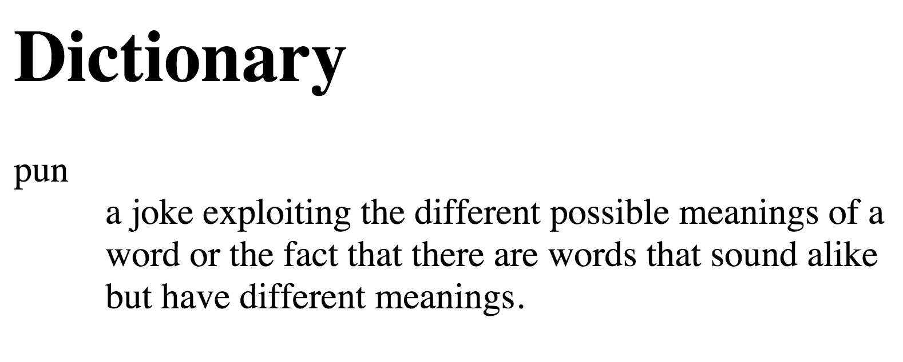
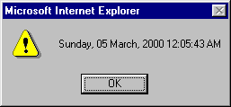

 
<pre style='margin-bottom:0px;margin-top:0px'><code style="font: 'monospace' 150%"><c>// If you can read this, yay!</code></pre>

 
<pre style='margin-bottom:0px;margin-top:0px'><code style="font: 'monospace' 150%"><s>123456789 123456789 123456789 12</s></code></pre>

 
<pre style='margin-bottom:0px;margin-top:0px'><code style="font: 'monospace' 150%">> console.log("Hello World");</code></pre>

 
<pre style='margin-bottom:0px;margin-top:0px'><code style="font: 'monospace' 150%">Hello World</code></pre>

 
<pre style='margin-bottom:0px;margin-top:0px'><code style="font: 'monospace' 150%"><h>!#/usr/bin/env ruby</h></code></pre>

 
<pre style='margin-bottom:0px;margin-top:0px'><code style="font: 'monospace' 150%">> (0..3).each {|c| puts c}</code></pre>

 
<pre style='margin-bottom:0px;margin-top:0px'><code style="font: 'monospace' 150%">0</code></pre>

 
<pre style='margin-bottom:0px;margin-top:0px'><code style="font: 'monospace' 150%">1</code></pre>

 
<pre style='margin-bottom:0px;margin-top:0px'><code style="font: 'monospace' 150%">2</code></pre>

 
<pre style='margin-bottom:0px;margin-top:0px'><code style="font: 'monospace' 150%">3</code></pre>

 
<pre style='margin-bottom:0px;margin-top:0px'><code style="font: 'monospace' 150%">=> 0..3 <c>// Console is 11x32 </c></code></pre>

---

  
  
# JavaScript is Awe-ful
  
 
---

 

Note: Tapestry and Cooking and Yelling

---

# Global Variables <!-- .slide: class="center" -->
---

 
 
<pre style='margin-bottom:0px;margin-top:0px'><code style="font: 'monospace' 150%">> ans</code></pre>

---
 
<pre style='margin-bottom:0px;margin-top:0px'><code style="font: 'monospace' 150%">> ans = "";</code></pre>

 
<pre style='margin-bottom:0px;margin-top:0px'><code style="font: 'monospace' 150%">> function question() { > &nbsp; var ans = 42; > &nbsp; return ans; > }</code></pre>
 <!-- .element: class="fragment" -->
 
<pre style='margin-bottom:0px;margin-top:0px'><code style="font: 'monospace' 150%">> console.log(ans);</code></pre>
 <!-- .element: class="fragment" -->
 
<pre style='margin-bottom:0px;margin-top:0px'><code style="font: 'monospace' 150%">""</code></pre>
 <!-- .element: class="fragment" -->
 
<pre style='margin-bottom:0px;margin-top:0px'><code style="font: 'monospace' 150%">> console.log(question());</code></pre>
 <!-- .element: class="fragment" -->
 
<pre style='margin-bottom:0px;margin-top:0px'><code style="font: 'monospace' 150%">42</code></pre>
 <!-- .element: class="fragment" -->
 
<pre style='margin-bottom:0px;margin-top:0px'><code style="font: 'monospace' 150%">> console.log(ans);</code></pre>
 <!-- .element: class="fragment" -->
 
<pre style='margin-bottom:0px;margin-top:0px'><code style="font: 'monospace' 150%">""</code></pre>
 <!-- .element: class="fragment" -->
---

 
 
<pre style='margin-bottom:0px;margin-top:0px'><code style="font: 'monospace' 150%">> ans = ""; <c>//global</c></code></pre>

 
<pre style='margin-bottom:0px;margin-top:0px'><code style="font: 'monospace' 150%">> function question() { > &nbsp; var ans = 42; <c>//local</c> > &nbsp; return ans; > }</code></pre>

 
<pre style='margin-bottom:0px;margin-top:0px'><code style="font: 'monospace' 150%">> console.log(ans);</code></pre>

 
<pre style='margin-bottom:0px;margin-top:0px'><code style="font: 'monospace' 150%">""</code></pre>

 
<pre style='margin-bottom:0px;margin-top:0px'><code style="font: 'monospace' 150%">> console.log(question());</code></pre>

 
<pre style='margin-bottom:0px;margin-top:0px'><code style="font: 'monospace' 150%">42</code></pre>

 
<pre style='margin-bottom:0px;margin-top:0px'><code style="font: 'monospace' 150%">> console.log(ans);</code></pre>

 
<pre style='margin-bottom:0px;margin-top:0px'><code style="font: 'monospace' 150%">""</code></pre>

---

 
 
<pre style='margin-bottom:0px;margin-top:0px'><code style="font: 'monospace' 150%">> ans = ""; <c>//global</c></code></pre>

 
<pre style='margin-bottom:0px;margin-top:0px'><code style="font: 'monospace' 150%">> function question() { > &nbsp; <s>var</s> ans = 42; <c>//global</c> > &nbsp; return ans; > }</code></pre>

 
<pre style='margin-bottom:0px;margin-top:0px'><code style="font: 'monospace' 150%">> console.log(ans);</code></pre>

 
<pre style='margin-bottom:0px;margin-top:0px'><code style="font: 'monospace' 150%">""</code></pre>

 
<pre style='margin-bottom:0px;margin-top:0px'><code style="font: 'monospace' 150%">> console.log(question());</code></pre>

 
<pre style='margin-bottom:0px;margin-top:0px'><code style="font: 'monospace' 150%">42</code></pre>

 
<pre style='margin-bottom:0px;margin-top:0px'><code style="font: 'monospace' 150%">> console.log(ans);</code></pre>

 
<pre style='margin-bottom:0px;margin-top:0px'><code style="font: 'monospace' 150%">42</code></pre>

---
 
<pre style='margin-bottom:0px;margin-top:0px'><code style="font: 'monospace' 150%"><c>//ruby</c></code></pre>

 
<pre style='margin-bottom:0px;margin-top:0px'><code style="font: 'monospace' 150%"><h>@</h>ans = 42;</code></pre>

 
<pre style='margin-bottom:0px;margin-top:0px'><code style="font: 'monospace' 150%"></code></pre>

 
<pre style='margin-bottom:0px;margin-top:0px'><code style="font: 'monospace' 150%"><c>//python</c></code></pre>

 
<pre style='margin-bottom:0px;margin-top:0px'><code style="font: 'monospace' 150%"><h>global</h> ans = 42;</code></pre>

 
<pre style='margin-bottom:0px;margin-top:0px'><code style="font: 'monospace' 150%"></code></pre>

 
<pre style='margin-bottom:0px;margin-top:0px'><code style="font: 'monospace' 150%"><c>//java</code></pre>

 
<pre style='margin-bottom:0px;margin-top:0px'><code style="font: 'monospace' 150%"><h>public</h> static ans = 42;</code></pre>

Note: Because every other language has locals by default
---
# Duck Typing <!-- .slide: class="center" -->
### Quack <!-- .element: class="fragment" -->

Note: if it looks like a duck and sounds like a duck, it's a duck.
---
 
<pre style='margin-bottom:0px;margin-top:0px'><code style="font: 'monospace' 150%">> 4 + 2</code></pre>

 
<pre style='margin-bottom:0px;margin-top:0px'><code style="font: 'monospace' 150%">6</code></pre>
 <!-- .element: class="fragment" -->
 
<pre style='margin-bottom:0px;margin-top:0px'><code style="font: 'monospace' 150%">> 4 - 2</code></pre>
 <!-- .element: class="fragment" -->
 
<pre style='margin-bottom:0px;margin-top:0px'><code style="font: 'monospace' 150%">2</code></pre>
 <!-- .element: class="fragment" -->
 
<pre style='margin-bottom:0px;margin-top:0px'><code style="font: 'monospace' 150%">> "4" - 2</code></pre>
 <!-- .element: class="fragment" -->
 
<pre style='margin-bottom:0px;margin-top:0px'><code style="font: 'monospace' 150%">2</code></pre>
 <!-- .element: class="fragment" -->
 
<pre style='margin-bottom:0px;margin-top:0px'><code style="font: 'monospace' 150%">> "4" + 2</code></pre>
 <!-- .element: class="fragment" -->
 
<pre style='margin-bottom:0px;margin-top:0px'><code style="font: 'monospace' 150%">"42"</code></pre>
 <!-- .element: class="fragment" -->
---

 
 
<pre style='margin-bottom:0px;margin-top:0px'><code style="font: 'monospace' 150%">> 4 + 2</code></pre>

 
<pre style='margin-bottom:0px;margin-top:0px'><code style="font: 'monospace' 150%">6</code></pre>

 
<pre style='margin-bottom:0px;margin-top:0px'><code style="font: 'monospace' 150%">> 4 - 2</code></pre>

 
<pre style='margin-bottom:0px;margin-top:0px'><code style="font: 'monospace' 150%">2</code></pre>

 
<pre style='margin-bottom:0px;margin-top:0px'><code style="font: 'monospace' 150%">> "4" - 2</code></pre>

 
<pre style='margin-bottom:0px;margin-top:0px'><code style="font: 'monospace' 150%">2 <c>&nbsp;&nbsp; // type -> integer</c></code></pre>

 
<pre style='margin-bottom:0px;margin-top:0px'><code style="font: 'monospace' 150%">> "4" + 2</code></pre>

 
<pre style='margin-bottom:0px;margin-top:0px'><code style="font: 'monospace' 150%">"42"<c> // type -> string</c></code></pre>

Note: Automatic Type Co-ersion

Higher order type wins
---
# Arrays and Objects <!-- .slide: class="center" -->
---
 
<pre style='margin-bottom:0px;margin-top:0px'><code style="font: 'monospace' 150%">> [] + []</code></pre>

 
<pre style='margin-bottom:0px;margin-top:0px'><code style="font: 'monospace' 150%">""</code></pre>
 <!-- .element: class="fragment" -->
 
<pre style='margin-bottom:0px;margin-top:0px'><code style="font: 'monospace' 150%">> [] + {}</code></pre>
 <!-- .element: class="fragment" -->
 
<pre style='margin-bottom:0px;margin-top:0px'><code style="font: 'monospace' 150%">[object Object]</code></pre>
 <!-- .element: class="fragment" -->
 
<pre style='margin-bottom:0px;margin-top:0px'><code style="font: 'monospace' 150%">> {} + []</code></pre>
 <!-- .element: class="fragment" -->
 
<pre style='margin-bottom:0px;margin-top:0px'><code style="font: 'monospace' 150%">0</code></pre>
 <!-- .element: class="fragment" -->
 
<pre style='margin-bottom:0px;margin-top:0px'><code style="font: 'monospace' 150%">> {} + {}</code></pre>
 <!-- .element: class="fragment" -->
 
<pre style='margin-bottom:0px;margin-top:0px'><code style="font: 'monospace' 150%">NaN</code></pre>
 <!-- .element: class="fragment" -->

Note: Associativity? Pfft!
---

 
 
<pre style='margin-bottom:0px;margin-top:0px'><code style="font: 'monospace' 150%">> [] + []</code></pre>

 
<pre style='margin-bottom:0px;margin-top:0px'><code style="font: 'monospace' 150%">""</code></pre>

 
<pre style='margin-bottom:0px;margin-top:0px'><code style="font: 'monospace' 150%">> [] + {}</code></pre>

 
<pre style='margin-bottom:0px;margin-top:0px'><code style="font: 'monospace' 150%">[object Object]</code></pre>

 
<pre style='margin-bottom:0px;margin-top:0px'><code style="font: 'monospace' 150%">> {} + []</code></pre>

 
<pre style='margin-bottom:0px;margin-top:0px'><code style="font: 'monospace' 150%">0</code></pre>

 
<pre style='margin-bottom:0px;margin-top:0px'><code style="font: 'monospace' 150%">> {} + {}</code></pre>

 
<pre style='margin-bottom:0px;margin-top:0px'><code style="font: 'monospace' 150%">NaN <c>// wat</c></code></pre>

---
# Arrays != Objects <!-- .slide: class="center" -->
---
 
<pre style='margin-bottom:0px;margin-top:0px'><code style="font: 'monospace' 150%">> var arr = ['a', 'b', 'c']</code></pre>

 
<pre style='margin-bottom:0px;margin-top:0px'><code style="font: 'monospace' 150%">> arr</code></pre>
 <!-- .element: class="fragment" -->
 
<pre style='margin-bottom:0px;margin-top:0px'><code style="font: 'monospace' 150%">["a", "b", "c"]</code></pre>
 <!-- .element: class="fragment" -->
 
<pre style='margin-bottom:0px;margin-top:0px'><code style="font: 'monospace' 150%">> arr.hello = "world"</code></pre>
 <!-- .element: class="fragment" -->
 
<pre style='margin-bottom:0px;margin-top:0px'><code style="font: 'monospace' 150%">"world"</code></pre>
 <!-- .element: class="fragment" -->
---
 
<pre style='margin-bottom:0px;margin-top:0px'><code style="font: 'monospace' 150%">> arr</code></pre>

 
<pre style='margin-bottom:0px;margin-top:0px'><code style="font: 'monospace' 150%">["a", "b", "c"]</code></pre>
 <!-- .element: class="fragment" -->
 
<pre style='margin-bottom:0px;margin-top:0px'><code style="font: 'monospace' 150%">> for (var k in arr) { >&nbsp;&nbsp; console.log(k); > }</code></pre>
 <!-- .element: class="fragment" -->
 
<pre style='margin-bottom:0px;margin-top:0px'><code style="font: 'monospace' 150%">0 1 2 hello</code></pre>
 <!-- .element: class="fragment" -->
---
 
<pre style='margin-bottom:0px;margin-top:0px'><code style="font: 'monospace' 150%">> arr.push("append");</code></pre>

 
<pre style='margin-bottom:0px;margin-top:0px'><code style="font: 'monospace' 150%">4</code></pre>
 <!-- .element: class="fragment" -->
 
<pre style='margin-bottom:0px;margin-top:0px'><code style="font: 'monospace' 150%">> c = 0;</code></pre>
 <!-- .element: class="fragment" -->
 
<pre style='margin-bottom:0px;margin-top:0px'><code style="font: 'monospace' 150%">> for (var k in arr) { >&nbsp; &nbsp; c = c + 1;  > }</code></pre>
 <!-- .element: class="fragment" -->
 
<pre style='margin-bottom:0px;margin-top:0px'><code style="font: 'monospace' 150%">> c</code></pre>
 <!-- .element: class="fragment" -->
 
<pre style='margin-bottom:0px;margin-top:0px'><code style="font: 'monospace' 150%">5</code></pre>
 <!-- .element: class="fragment" -->
 
<pre style='margin-bottom:0px;margin-top:0px'><code style="font: 'monospace' 150%">> arr.length</code></pre>
 <!-- .element: class="fragment" -->
 
<pre style='margin-bottom:0px;margin-top:0px'><code style="font: 'monospace' 150%">4</code></pre>
 <!-- .element: class="fragment" -->
---
# Equality <!-- .slide: class="center" -->
---
 
<pre style='margin-bottom:0px;margin-top:0px'><code style="font: 'monospace' 150%">> 0 ==&nbsp; false</code></pre>

 
<pre style='margin-bottom:0px;margin-top:0px'><code style="font: 'monospace' 150%">true</code></pre>
 <!-- .element: class="fragment" -->
 
<pre style='margin-bottom:0px;margin-top:0px'><code style="font: 'monospace' 150%">> 0 === false</code></pre>
 <!-- .element: class="fragment" -->
 
<pre style='margin-bottom:0px;margin-top:0px'><code style="font: 'monospace' 150%">false</code></pre>
 <!-- .element: class="fragment" -->
 
<pre style='margin-bottom:0px;margin-top:0px'><code style="font: 'monospace' 150%">> 1 == &nbsp;"1"</code></pre>
 <!-- .element: class="fragment" -->
 
<pre style='margin-bottom:0px;margin-top:0px'><code style="font: 'monospace' 150%">true</code></pre>
 <!-- .element: class="fragment" -->
 
<pre style='margin-bottom:0px;margin-top:0px'><code style="font: 'monospace' 150%">> 1 === "1"</code></pre>
 <!-- .element: class="fragment" -->
 
<pre style='margin-bottom:0px;margin-top:0px'><code style="font: 'monospace' 150%">false</code></pre>
 <!-- .element: class="fragment" -->
---

 
 
<pre style='margin-bottom:0px;margin-top:0px'><code style="font: 'monospace' 150%">> 0 ==&nbsp; false</code></pre>

 
<pre style='margin-bottom:0px;margin-top:0px'><code style="font: 'monospace' 150%">true</code></pre>

 
<pre style='margin-bottom:0px;margin-top:0px'><code style="font: 'monospace' 150%">> 0 === false</code></pre>

 
<pre style='margin-bottom:0px;margin-top:0px'><code style="font: 'monospace' 150%">false</code></pre>

 
<pre style='margin-bottom:0px;margin-top:0px'><code style="font: 'monospace' 150%">> 1 == &nbsp;"1" <c> // equality</c></code></pre>

 
<pre style='margin-bottom:0px;margin-top:0px'><code style="font: 'monospace' 150%">true</code></pre>

 
<pre style='margin-bottom:0px;margin-top:0px'><code style="font: 'monospace' 150%">> 1 === "1" <c>// equality without</c></code></pre>

 
<pre style='margin-bottom:0px;margin-top:0px'><code style="font: 'monospace' 150%">false &nbsp; &nbsp; &nbsp; <c>// type co-ersion</c></code></pre>

---

   
> The fact that === exists in languages like PHP and JavaScript is a sign that those languages are ridiculously broken.
> 
> -- @TheColonial

---
# But, why? <!-- .slide: class="center" -->
Note: why is javascript so awful
---

## ~~ wavey time passing lines ~~ <!-- .slide: class="center" -->
---

# 1993 <!-- .slide: class="center" -->
---
   
<pre><code> 
&nbsp; Hypertext Markup Language (HTML)&nbsp; &nbsp; &nbsp; &nbsp; &nbsp; Tim Berners-Lee, CERN
&nbsp; Internet Draft&nbsp; &nbsp; &nbsp; &nbsp; &nbsp; &nbsp; &nbsp; &nbsp; &nbsp; &nbsp; &nbsp; &nbsp; &nbsp; Daniel Connolly, Atrium
&nbsp; IIIR Working Group&nbsp; &nbsp; &nbsp; &nbsp; &nbsp; &nbsp; &nbsp; &nbsp; &nbsp; &nbsp; &nbsp; &nbsp; &nbsp; &nbsp; &nbsp; &nbsp; &nbsp; &nbsp; June 1993

&nbsp; &nbsp; &nbsp; &nbsp; &nbsp; &nbsp; &nbsp; &nbsp; &nbsp; &nbsp; Hypertext Markup Language (HTML)

&nbsp; &nbsp; &nbsp; A Representation of Textual Information and MetaInformation
&nbsp; &nbsp; &nbsp; &nbsp; &nbsp; &nbsp; &nbsp; &nbsp; &nbsp; &nbsp; &nbsp; for Retrieval and Interchange
</pre></code> 

<a href="http://www.w3.org/MarkUp/draft-ietf-iiir-html-01.txt">http://www.w3.org/MarkUp/draft-ietf-iiir-html-01.txt</a>
---
## The Original HTML
  
 
<pre style='margin-bottom:0px;margin-top:0px'><code style="font: 'monospace' 150%">&lt;HTML></code></pre>

 
<pre style='margin-bottom:0px;margin-top:0px'><code style="font: 'monospace' 150%">&lt;TITLE>My Page&lt;/TITLE></code></pre>

 
<pre style='margin-bottom:0px;margin-top:0px'><code style="font: 'monospace' 150%">&lt;BODY></code></pre>

 
<pre style='margin-bottom:0px;margin-top:0px'><code style="font: 'monospace' 150%">&nbsp; &nbsp; &lt;P>Hello World Wide Web&lt;/P></code></pre>

 
<pre style='margin-bottom:0px;margin-top:0px'><code style="font: 'monospace' 150%">&lt;/BODY></code></pre>

 
<pre style='margin-bottom:0px;margin-top:0px'><code style="font: 'monospace' 150%">&lt;/HTML></code></pre>

Note: YELLING TAGS
---
## Anchor Tags <!-- .slide: class="center" -->
  
 
<pre style='margin-bottom:0px;margin-top:0px'><code style="font: 'monospace' 150%">&lt;<h>A</h> HREF="index.html">My Page&lt;/<h>A</h>></code></pre>
 <!-- .element: class="fragment" -->
---
## Glossary or Definition List <!-- .slide: class="center" -->
<pre><code> 
&nbsp; &lt;H1>Dictionary&lt;/H1>
&nbsp; <h>&lt;DT></h>pun<h>&lt;/DT></h>
&nbsp; <h>&lt;DD></h>a joke exploiting the different possible meanings of
&nbsp; a word or the fact that there are words that sound alike
&nbsp; but have different meanings. <h>&lt;/DD></h> 
</code></pre> 
  <!-- .element: class="fragment" -->
---
  
#  <!-- .slide: class="center" -->
---
# ~~ wavey lines ~~ <!-- .slide: class="center" -->
---
# 1995 <!-- .slide: class="center" -->
Note: The year is 1995. The documentary Hackers has been released, and people are burning through the data with their 28.8K BAUD modems

---

#  <!-- .slide: class="center" -->

---
 
<pre style='margin-bottom:0px;margin-top:0px'><code style="font: 'monospace' 150%">> (define hello-world</code></pre>

 
<pre style='margin-bottom:0px;margin-top:0px'><code style="font: 'monospace' 150%">>&nbsp; (lambda ()</code></pre>

 
<pre style='margin-bottom:0px;margin-top:0px'><code style="font: 'monospace' 150%">>&nbsp; &nbsp; (begin</code></pre>

 
<pre style='margin-bottom:0px;margin-top:0px'><code style="font: 'monospace' 150%">>&nbsp; &nbsp; &nbsp; (write ‘Hello-World)</code></pre>

 
<pre style='margin-bottom:0px;margin-top:0px'><code style="font: 'monospace' 150%">>&nbsp; &nbsp; )</code></pre>

 
<pre style='margin-bottom:0px;margin-top:0px'><code style="font: 'monospace' 150%">>&nbsp; )</code></pre>

 
<pre style='margin-bottom:0px;margin-top:0px'><code style="font: 'monospace' 150%">> )</code></pre>

 
<pre style='margin-bottom:0px;margin-top:0px'><code style="font: 'monospace' 150%">></code></pre>

 
<pre style='margin-bottom:0px;margin-top:0px'><code style="font: 'monospace' 150%">> (hello-world)</code></pre>

 
<pre style='margin-bottom:0px;margin-top:0px'><code style="font: 'monospace' 150%">Hello-World</code></pre>

 
<pre style='margin-bottom:0px;margin-top:0px'><code style="font: 'monospace' 150%"></code></pre>

</pre></code> 

---
#  <!-- .slide: class="center" -->

Note: Brendan Eich wanted to do fancy things

Made JavaScript in 10 days

Only took 6 to create the world

Waterfall software development cycle estimages

---

 
 
<pre style='margin-bottom:0px;margin-top:0px'><code style="font: 'monospace' 150%">// alert based debugging</code></pre>

 
<pre style='margin-bottom:0px;margin-top:0px'><code style="font: 'monospace' 150%">alert(my_date);</code></pre>

#  <!-- .slide: class="center" -->

---

# ~~ fast forward ~~ <!-- .slide: class="center" -->
---

# 2000 <!-- .slide: class="center" -->

---

@ image.png <!-- .slide: class="center" -->

Note: big names in dotcomboom etc

---

@ bubbleburst.png <!-- .slide: class="center" -->

Note: pop

---
# ~~ fast forward ~~ <!-- .slide: class="center" -->
---
# 2005 <!-- .slide: class="center" -->
---

 

Note: Things getting back together again

---

# 2006 <!-- .slide: class="center" -->
---

@ firebug.png <!-- .slide: class="center" -->

Note: FIREBUG OMG
---

@ mootools.png <!-- .slide: class="center" -->
---

@ jquery.png <!-- .slide: class="center" -->
---

@ rise of the framworks.png <!-- .slide: class="center" -->

Note: Why write javascript when you can use nice things that other people have written?
---

# 2009 <!-- .slide: class="center" -->
---

@ node.js <!-- .slide: class="center" -->

---

## But I don't want to write JavaScript ;_; <!-- .slide: class="center" -->

---

 
## Not-shite JS -> JavaScript
---

 
## Functional* -> JavaScript

---

 
## Python -> JavaScript

---

## But I don't want to write anything *other* than JavaScript <!-- .slide: class="center" -->
---

@ crosscompiler.png <!-- .slide: class="center" -->
Note: crosscompilers

---

## Debugging
# 
 
<pre style='margin-bottom:0px;margin-top:0px'><code style="font: 'monospace' 150%">console.log()</code></pre>

---

 
<pre style='margin-bottom:0px;margin-top:0px'><code style="font: 'monospace' 150%">window.console = typeof window.console === 'undefined'</code></pre>

 
<pre style='margin-bottom:0px;margin-top:0px'><code style="font: 'monospace' 150%">&nbsp; &nbsp; ? {log:function(str){ alert(str) }}</code></pre>

 
<pre style='margin-bottom:0px;margin-top:0px'><code style="font: 'monospace' 150%">&nbsp; &nbsp; : window.console;</code></pre>

 
<pre style='margin-bottom:0px;margin-top:0px'><code style="font: 'monospace' 150%"> console.log("oh good god.");</code></pre>

Note: console.log isn't defined in any ECMA standard, therefore it doesn't have to exist.

---

facebook console css

---
# JavaScript isn't awful <!-- .slide: class="center" -->
---
# JavaScript is awe-ful <!-- .slide: class="center" -->
Note: It's amazing that we can take something so broken and made so much

The devil you know
---

# R.I.P Java Applets <!-- .slide: class="center" -->
### &nbsp;
---
# R.I.P Flash <!-- .slide: class="center" -->
### (mostly)
---
# JavaScript is awesome. <!-- .slide: class="center" -->
---
   
> ... when that's the glue of the modern day web it's minor miracle that society even functions
> 
> -- @NamTaf
---
# But just remember... <!-- .slide: class="center" -->
## other languages have wats <!-- .element: class="fragment" -->
---

# <pre>#!/usr/bin/env java</pre> <!-- .slide: class="center" -->

Note: Let's about about Java

---
 
<pre style='margin-bottom:0px;margin-top:0px'><code style="font: 'monospace' 150%"><c>/&#42;&#42; read from a file &#42;&#42;/</c></code></pre>

 
<pre style='margin-bottom:0px;margin-top:0px'><code style="font: 'monospace' 150%">filename = "myfile.txt"</code></pre>
 <!-- .element: class="fragment" -->
 
<pre style='margin-bottom:0px;margin-top:0px'><code style="font: 'monospace' 150%">f = new FileInputStream(filename);</code></pre>
 <!-- .element: class="fragment" -->
 
<pre style='margin-bottom:0px;margin-top:0px'><code style="font: 'monospace' 150%">i = new InputStreamReader(fis);</code></pre>
 <!-- .element: class="fragment" -->
 
<pre style='margin-bottom:0px;margin-top:0px'><code style="font: 'monospace' 150%">r = new BufferedReader(isr);</code></pre>
 <!-- .element: class="fragment" -->
 
<pre style='margin-bottom:0px;margin-top:0px'><code style="font: 'monospace' 150%">String line = rdr.readLine();</code></pre>
 <!-- .element: class="fragment" -->
 
<pre style='margin-bottom:0px;margin-top:0px'><code style="font: 'monospace' 150%">while(line != null){ &nbsp;&nbsp;<c>/&#42; actual processing &#42;/</c> &nbsp;&nbsp;line = rdr.readLine(); }</code></pre>
 <!-- .element: class="fragment" -->

---
# <pre>#!/usr/bin/env ruby</pre> <!-- .slide: class="center" -->
Note: Let's talk about ruby
---
 
<pre style='margin-bottom:0px;margin-top:0px'><code style="font: 'monospace' 150%">BAR = "outer"</code></pre>

 
<pre style='margin-bottom:0px;margin-top:0px'><code style="font: 'monospace' 150%">module A</code></pre>

 
<pre style='margin-bottom:0px;margin-top:0px'><code style="font: 'monospace' 150%">&nbsp; FOO = nil; BAR = "inner"</code></pre>

 
<pre style='margin-bottom:0px;margin-top:0px'><code style="font: 'monospace' 150%">&nbsp; module B</code></pre>

 
<pre style='margin-bottom:0px;margin-top:0px'><code style="font: 'monospace' 150%">&nbsp; &nbsp; puts A::FOO::BAR</code></pre>

 
<pre style='margin-bottom:0px;margin-top:0px'><code style="font: 'monospace' 150%">&nbsp; end</code></pre>

 
<pre style='margin-bottom:0px;margin-top:0px'><code style="font: 'monospace' 150%">end</code></pre>

 
<pre style='margin-bottom:0px;margin-top:0px'><code style="font: 'monospace' 150%">puts A::FOO::BAR</code></pre>

 
<pre style='margin-bottom:0px;margin-top:0px'><code style="font: 'monospace' 150%"> ???</code></pre>
 <!-- .element: class="fragment" -->

Note: https://twitter.com/charliesome/status/654190206547968000
---

 
 
<pre style='margin-bottom:0px;margin-top:0px'><code style="font: 'monospace' 150%">BAR = "outer"</code></pre>

 
<pre style='margin-bottom:0px;margin-top:0px'><code style="font: 'monospace' 150%">module A</code></pre>

 
<pre style='margin-bottom:0px;margin-top:0px'><code style="font: 'monospace' 150%">&nbsp; FOO = nil; BAR = "inner"</code></pre>

 
<pre style='margin-bottom:0px;margin-top:0px'><code style="font: 'monospace' 150%">&nbsp; module B</code></pre>

 
<pre style='margin-bottom:0px;margin-top:0px'><code style="font: 'monospace' 150%">&nbsp; &nbsp; puts A::FOO::BAR</code></pre>

 
<pre style='margin-bottom:0px;margin-top:0px'><code style="font: 'monospace' 150%">&nbsp; end</code></pre>

 
<pre style='margin-bottom:0px;margin-top:0px'><code style="font: 'monospace' 150%">end</code></pre>

 
<pre style='margin-bottom:0px;margin-top:0px'><code style="font: 'monospace' 150%">puts A::FOO::BAR</code></pre>

 
<pre style='margin-bottom:0px;margin-top:0px'><code style="font: 'monospace' 150%"> inner</code></pre>

 
<pre style='margin-bottom:0px;margin-top:0px'><code style="font: 'monospace' 150%">outer</code></pre>

---
 
<pre style='margin-bottom:0px;margin-top:0px'><code style="font: 'monospace' 150%">TODO Barewords</code></pre>

Note: Method Missing
---

# <pre>ghci</pre> <!-- .slide: class="center" -->
Note: Let's talk about Haskell
---

 
<pre style='margin-bottom:0px;margin-top:0px'><code style="font: 'monospace' 150%">λ&gt; length []</code></pre>

 
<pre style='margin-bottom:0px;margin-top:0px'><code style="font: 'monospace' 150%">0</code></pre>
 <!-- .element: class="fragment" -->
 
<pre style='margin-bottom:0px;margin-top:0px'><code style="font: 'monospace' 150%">λ&gt; length [1]</code></pre>
 <!-- .element: class="fragment" -->
 
<pre style='margin-bottom:0px;margin-top:0px'><code style="font: 'monospace' 150%">1</code></pre>
 <!-- .element: class="fragment" -->
 
<pre style='margin-bottom:0px;margin-top:0px'><code style="font: 'monospace' 150%">λ&gt; length [1,2]</code></pre>
 <!-- .element: class="fragment" -->
 
<pre style='margin-bottom:0px;margin-top:0px'><code style="font: 'monospace' 150%">2</code></pre>
 <!-- .element: class="fragment" -->
 
<pre style='margin-bottom:0px;margin-top:0px'><code style="font: 'monospace' 150%">λ> :type [1,2]</code></pre>
 <!-- .element: class="fragment" -->
 
<pre style='margin-bottom:0px;margin-top:0px'><code style="font: 'monospace' 150%">[1,2] :: Num t => [t]</code></pre>
 <!-- .element: class="fragment" -->

Note: Type of List
---

 
<pre style='margin-bottom:0px;margin-top:0px'><code style="font: 'monospace' 150%">λ> :type (1,2)</code></pre>

 
<pre style='margin-bottom:0px;margin-top:0px'><code style="font: 'monospace' 150%">(1,2) :: (Num t, Num t1)=>(t, t1)</code></pre>
 <!-- .element: class="fragment" -->
 
<pre style='margin-bottom:0px;margin-top:0px'><code style="font: 'monospace' 150%">λ> length (1,2)</code></pre>
 <!-- .element: class="fragment" -->
 
<pre style='margin-bottom:0px;margin-top:0px'><code style="font: 'monospace' 150%">1</code></pre>
 <!-- .element: class="fragment" -->

Note: because foldable, fMap fun
---

 
<pre style='margin-bottom:0px;margin-top:0px'><code style="font: 'monospace' 150%">λ> length (Left 0)</code></pre>

 
<pre style='margin-bottom:0px;margin-top:0px'><code style="font: 'monospace' 150%">0</code></pre>
 <!-- .element: class="fragment" -->
 
<pre style='margin-bottom:0px;margin-top:0px'><code style="font: 'monospace' 150%">λ> length (Right 0)</code></pre>
 <!-- .element: class="fragment" -->
 
<pre style='margin-bottom:0px;margin-top:0px'><code style="font: 'monospace' 150%">1</code></pre>
 <!-- .element: class="fragment" -->

---
 
<pre style='margin-bottom:0px;margin-top:0px'><code style="font: 'monospace' 150%">λ> let a = 2 + 2</code></pre>

 
<pre style='margin-bottom:0px;margin-top:0px'><code style="font: 'monospace' 150%">λ> a</code></pre>
 <!-- .element: class="fragment" -->
 
<pre style='margin-bottom:0px;margin-top:0px'><code style="font: 'monospace' 150%">4</code></pre>
 <!-- .element: class="fragment" -->
 
<pre style='margin-bottom:0px;margin-top:0px'><code style="font: 'monospace' 150%">λ> let b = 2 + 2 where 2 + 2 = 5</code></pre>
 <!-- .element: class="fragment" -->
 
<pre style='margin-bottom:0px;margin-top:0px'><code style="font: 'monospace' 150%">λ> wat</code></pre>
 <!-- .element: class="fragment" -->
 
<pre style='margin-bottom:0px;margin-top:0px'><code style="font: 'monospace' 150%">5</code></pre>
 <!-- .element: class="fragment" -->

---
# <pre>#!/usr/bin/env python</pre> <!-- .slide: class="center" -->
Note: Let's talk about Python
---
 
<pre style='margin-bottom:0px;margin-top:0px'><code style="font: 'monospace' 150%">>>> ans = 42</code></pre>

 
<pre style='margin-bottom:0px;margin-top:0px'><code style="font: 'monospace' 150%">>>> def question():  ... &nbsp; &nbsp; return ans</code></pre>
 <!-- .element: class="fragment" -->
 
<pre style='margin-bottom:0px;margin-top:0px'><code style="font: 'monospace' 150%">>>> question()</code></pre>
 <!-- .element: class="fragment" -->
 
<pre style='margin-bottom:0px;margin-top:0px'><code style="font: 'monospace' 150%">42</code></pre>
 <!-- .element: class="fragment" -->

Note: undefined answer within scope of the function

but it still works

---
 
<pre style='margin-bottom:0px;margin-top:0px'><code style="font: 'monospace' 150%">>>> ans = 42</code></pre>

 
<pre style='margin-bottom:0px;margin-top:0px'><code style="font: 'monospace' 150%">>>> def question():</code></pre>
 <!-- .element: class="fragment" -->
 
<pre style='margin-bottom:0px;margin-top:0px'><code style="font: 'monospace' 150%">... &nbsp; &nbsp; ans += 1</code></pre>
 <!-- .element: class="fragment" -->
 
<pre style='margin-bottom:0px;margin-top:0px'><code style="font: 'monospace' 150%">... &nbsp; &nbsp; return ans</code></pre>
 <!-- .element: class="fragment" -->
 
<pre style='margin-bottom:0px;margin-top:0px'><code style="font: 'monospace' 150%">>>> question()</code></pre>
 <!-- .element: class="fragment" -->
 
<pre style='margin-bottom:0px;margin-top:0px'><code style="font: 'monospace' 150%">Traceback (most recent call last):  &nbsp;File "<stdin>", line 1, in <module>  &nbsp;File "<stdin>", line 2, in question  UnboundLocalError: local variable 'ans' referenced before assignment</code></pre>
 <!-- .element: class="fragment" -->

Note: manipulation of variable within the scope
---
 
<pre style='margin-bottom:0px;margin-top:0px'><code style="font: 'monospace' 150%">>>> a = 256</code></pre>

 
<pre style='margin-bottom:0px;margin-top:0px'><code style="font: 'monospace' 150%">>>> b = 256</code></pre>
 <!-- .element: class="fragment" -->
 
<pre style='margin-bottom:0px;margin-top:0px'><code style="font: 'monospace' 150%">>>> a **is** b</code></pre>
 <!-- .element: class="fragment" -->
 
<pre style='margin-bottom:0px;margin-top:0px'><code style="font: 'monospace' 150%">???</code></pre>
 <!-- .element: class="fragment" -->
---

 
 
<pre style='margin-bottom:0px;margin-top:0px'><code style="font: 'monospace' 150%">>>> a = 256</code></pre>

 
<pre style='margin-bottom:0px;margin-top:0px'><code style="font: 'monospace' 150%">>>> b = 256</code></pre>

 
<pre style='margin-bottom:0px;margin-top:0px'><code style="font: 'monospace' 150%">>>> a **is** b</code></pre>

 
<pre style='margin-bottom:0px;margin-top:0px'><code style="font: 'monospace' 150%">True</code></pre>

---
 
<pre style='margin-bottom:0px;margin-top:0px'><code style="font: 'monospace' 150%">>>> a = 257</code></pre>

 
<pre style='margin-bottom:0px;margin-top:0px'><code style="font: 'monospace' 150%">>>> b = 257</code></pre>
 <!-- .element: class="fragment" -->
 
<pre style='margin-bottom:0px;margin-top:0px'><code style="font: 'monospace' 150%">>>> a **is** b</code></pre>
 <!-- .element: class="fragment" -->
 
<pre style='margin-bottom:0px;margin-top:0px'><code style="font: 'monospace' 150%">???</code></pre>
 <!-- .element: class="fragment" -->
---

 
 
<pre style='margin-bottom:0px;margin-top:0px'><code style="font: 'monospace' 150%">>>> a = 257</code></pre>

 
<pre style='margin-bottom:0px;margin-top:0px'><code style="font: 'monospace' 150%">>>> b = 257</code></pre>

 
<pre style='margin-bottom:0px;margin-top:0px'><code style="font: 'monospace' 150%">>>> a **is** b</code></pre>

 
<pre style='margin-bottom:0px;margin-top:0px'><code style="font: 'monospace' 150%">False</code></pre>

 
<pre style='margin-bottom:0px;margin-top:0px'><code style="font: 'monospace' 150%"> >>> a = 257; b = 257</code></pre>
 <!-- .element: class="fragment" -->
 
<pre style='margin-bottom:0px;margin-top:0px'><code style="font: 'monospace' 150%">>>> a **is** b</code></pre>
 <!-- .element: class="fragment" -->
 
<pre style='margin-bottom:0px;margin-top:0px'><code style="font: 'monospace' 150%">???</code></pre>
 <!-- .element: class="fragment" -->
---

 
 
<pre style='margin-bottom:0px;margin-top:0px'><code style="font: 'monospace' 150%">>>> a = 257</code></pre>

 
<pre style='margin-bottom:0px;margin-top:0px'><code style="font: 'monospace' 150%">>>> b = 257</code></pre>

 
<pre style='margin-bottom:0px;margin-top:0px'><code style="font: 'monospace' 150%">>>> a **is** b</code></pre>

 
<pre style='margin-bottom:0px;margin-top:0px'><code style="font: 'monospace' 150%">False</code></pre>

 
<pre style='margin-bottom:0px;margin-top:0px'><code style="font: 'monospace' 150%"> >>> a = 257; b = 257</code></pre>

 
<pre style='margin-bottom:0px;margin-top:0px'><code style="font: 'monospace' 150%">>>> a **is** b</code></pre>

 
<pre style='margin-bottom:0px;margin-top:0px'><code style="font: 'monospace' 150%">True</code></pre>

---
# wat <!-- .slide: class="center" -->
---
   
   
   
<h4>Sources of some wats</h4>
<h4> Wat - Gary Bernhardt, CodeMash 2012</h4>
https://github.com/puffnfresh/wat-collection 
<h4> Investigating Python Wats - Amy Hanlon, Python 2015 </h4>