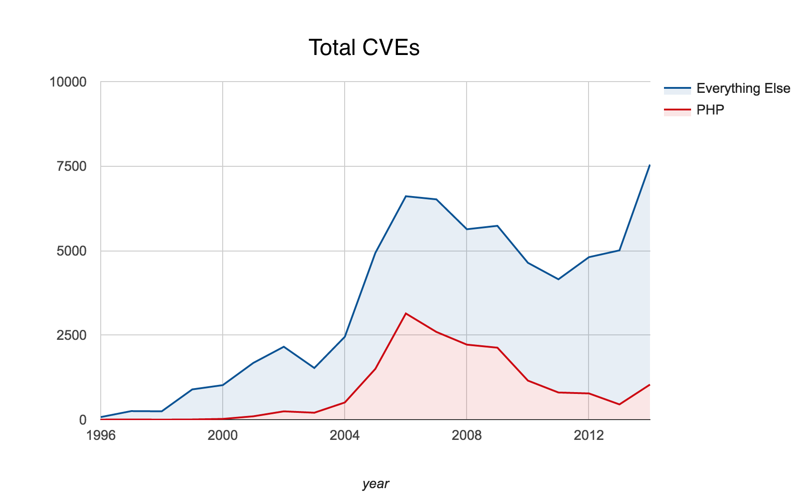

# Main Screen Turn On <!-- .slide: class="center" -->
---
# Hack The Planet <!-- .slide: class="center" -->
---
# Introductions <!-- .slide: class="center" -->
## Hi! <!-- .element: class="fragment" -->
---
# And what about you? <!-- .slide: class="center" -->
## (not your employer)
---
# What's your flavour? <!-- .slide: class="center" -->
---
# What the CVE? <!-- .slide: class="center" -->
---
# CVE
## Common Vulnerabilities and Exploits <!-- .element: class="fragment" -->
### Uniquely identified <!-- .element: class="fragment" -->
### 
<code>CVE-YYYY-NNNN</code>
 <!-- .element: class="fragment" -->
### 
<code>+NNN</code>
 <!-- .element: class="fragment" -->
Note: up to 10,000 p/a up until last year
Now 7 N's -> 10,000,000

Only when required in a calendar year

Highest CVE number so far == 76xx-ish
---
# OWASP <!-- .slide: class="center" -->
## 
Open Web Application Security Project <a href="https://owasp.org">oswap.org</a>
 <!-- .element: class="fragment" -->

Note: they make the OWASP Top 10
---
## OWASP Top 10

 Injection
 Broken Authentication and Session Management
 Cross-Site Scripting (XSS)
 Insecure Direct Object References
 Security Misconfiguration
 Sensitive Data Exposure
 Missing Function Level Access Control
 Cross-Site Request Forgery (CSRF)
 Using Components with Known Vulnerabilities
 Unvalidated Redirects and Forwards

 
---
## The Big Three

 Injection
 Broken Authentication and Session Management
 Cross-Site Scripting (XSS)
 Insecure Direct Object References
 Security Misconfiguration
 Sensitive Data Exposure
 Missing Function Level Access Control
 Cross-Site Request Forgery (CSRF)
 Using Components with Known Vulnerabilities
 Unvalidated Redirects and Forwards

 
---
## Poor Authentication

 Injection
 Broken Authentication and Session Management
 Cross-Site Scripting (XSS)
 Insecure Direct Object References
 Security Misconfiguration
 Sensitive Data Exposure
 Missing Function Level Access Control
 Cross-Site Request Forgery (CSRF)
 Using Components with Known Vulnerabilities
 Unvalidated Redirects and Forwards

 
---
## Poor Authorisation

 Injection
 Broken Authentication and Session Management
 Cross-Site Scripting (XSS)
 Insecure Direct Object References
 Security Misconfiguration
 Sensitive Data Exposure
 Missing Function Level Access Control
 Cross-Site Request Forgery (CSRF)
 Using Components with Known Vulnerabilities
 Unvalidated Redirects and Forwards

 
---
## The cause of much sadness

 Injection
 Broken Authentication and Session Management
 Cross-Site Scripting (XSS)
 Insecure Direct Object References
 Security Misconfiguration
 Sensitive Data Exposure
 Missing Function Level Access Control
 Cross-Site Request Forgery (CSRF)
 Using Components with Known Vulnerabilities
 Unvalidated Redirects and Forwards

 
---
# CVEs -> Patches <!-- .slide: class="center" -->
## Free fixes!

Note: Applying things like Windows Updates is **super important**
---
# How long has it been since you last patched? <!-- .slide: class="center" -->

Note: in the last month?

year? 

... ever?
---
# In the last 10 months...
## Content Management System CVEs
#### &nbsp;
### Wordpress - ~100* <!-- .element: class="fragment" -->
### Drupal - ~100* <!-- .element: class="fragment" -->
### Magento - 7 <!-- .element: class="fragment" -->
### Joomla - 4 <!-- .element: class="fragment" -->

<a href="https://cve.mitre.org">cve.mitre.org</a>
Note: 
Drupal/Wordpress are ESTIMATES

Wordpress probably include splugins, also Wordpress 4 within the last year, so lots of movement

Drupal the same, but they also have had Drupal 8

---
# But it's not just your CMS <!-- .slide: class="center" -->
---
# In the last 10 months...
## Framework CVEs
#### &nbsp;
### Django - 13 <!-- .element: class="fragment" -->
### Ruby on Rails - 5 <!-- .element: class="fragment" -->
### Symfony - 2 <!-- .element: class="fragment" -->
<a href="https://cve.mitre.org">cve.mitre.org</a>
---
# But it's not just your framework <!-- .slide: class="center" -->
---
# In the last 10 months...
## Language CVEs
#### &nbsp;
### Perl - 6 <!-- .element: class="fragment" -->
### Python - 8 <!-- .element: class="fragment" -->
### Ruby - 2 <!-- .element: class="fragment" -->

<a href="https://cve.mitre.org">cve.mitre.org</a>
---

# PHP <!-- .slide: class="center" -->
## ... <!-- .element: class="fragment" -->
---
 
---
 
Full analysis and caveats - <a href="http://www.coelho.net/php_cve.html">coelho.net/php_cve.html</a>
Note: Hard to get an exact number for PHP
At one time, research says it was as high as 25% of all vulns

---
# But it's not just your language <!-- .slide: class="center" -->
---
# In the last 12 months...
## Operating System CVEs
#### &nbsp;
### CVE-2014-6271 CVE-2015-0204 CVE-2015-3456 <!-- .element: class="fragment" -->
---
# CVE-2014-6271
  <!-- .element: class="fragment" -->
Note: GHOST - 27 JAN 2015 -

gethostbyname() buffer overflow - get IPv4 addr by hostname

Surcuri say PHP vuln. because of gethostbyname wrapped in function “wp_http_validate_url()” et a link

---
# CVE-2015-0204
  <!-- .element: class="fragment" -->
Note: VENOM May 2015

QEMU Virt floppy drive vuln for escaping encapsulation

---
# CVE-2015-3456
  <!-- .element: class="fragment" -->

Note: ShellShock - SEP 2014

Bash issue possibly existing since v1.03 Sept 1989

`() { :;};` - environment variable should never be exec, string tricks system

env x='() { :;}; echo vulnerable' bash -c "echo this is a test"

---
# Logos bring recognition <!-- .slide: class="center" -->
---
# &nbsp; <!-- .slide: class="center" -->
 

Note: Bufferoverflow on openSSL
---
# But it's not just your application stack <!-- .slide: class="center" -->
---
# CVEs recorded against:
## &nbsp;
## Nginx
## IIS
## Apache
<a href="https://cve.mitre.org">cve.mitre.org</a>
---
# But it's not just your entire website <!-- .slide: class="center" -->
---
# CVEs recorded against:
## JIRA
## Request Tracker
## Confluence
## SugarCRM
## and many, *many* more...
<a href="https://cve.mitre.org">cve.mitre.org</a>
---
# But wait! That's not all! <!-- .slide: class="center" -->
---
# Responsible Disclosure <!-- .slide: class="center" -->
Note: All these are things we know about.

Doesn't include bad actors
---
# And *that's* assuming you're up to date! <!-- .slide: class="center" -->
---
# Deprecated Language Versions <!-- .slide: class="center" -->
## Are you running unpatched languages?
---
# PHP <!-- .slide: class="center" -->
## What version are you running? <!-- .element: class="fragment" -->
---
# PHP < 5.0? <!-- .slide: class="center" -->
## Go upgrade. Now. <!-- .element: class="fragment" -->
<a href="http://php.net/eol">php.net/eol</a>
Note: 4.4 was EOL 2008
---
# PHP 5.0? <!-- .slide: class="center" -->
## Upgrade. Unmaintained. <!-- .element: class="fragment" -->
<a href="http://php.net/eol">php.net/eol</a>
Note: EOL 5 Sep 2005 10 years ago
---
# PHP 5.1? <!-- .slide: class="center" -->
## Upgrade. Unmaintained. <!-- .element: class="fragment" -->
<a href="http://php.net/eol">php.net/eol</a>
Note: EOL 24 Aug 2006 9 years, 1 month ago
---
# PHP 5.2? <!-- .slide: class="center" -->
## Upgrade. Unmaintained. <!-- .element: class="fragment" -->
<a href="http://php.net/eol">php.net/eol</a>
Note: EOL 6 Jan 2011 4 years, 9 months ago
---
# PHP 5.3? <!-- .slide: class="center" -->
## Upgrade. Unmaintained. <!-- .element: class="fragment" -->
<a href="http://php.net/eol">php.net/eol</a>
Note: EOL 14 Aug 2014 1 year, 1 month ago
---
# PHP 5.4? <!-- .slide: class="center" -->
## Upgrade. Unmaintained. <!-- .element: class="fragment" -->
<a href="http://php.net/eol">php.net/eol</a>
Note: EOL 3 Sep 2015 1 month ago
---
# PHP 5.5? <!-- .slide: class="center" -->
## Keep your patches up to date. <!-- .element: class="fragment" -->
<a href="http://php.net/eol">php.net/eol</a>
---
# PHP 5.6? <!-- .slide: class="center" -->
## Keep your patches up to date. <!-- .element: class="fragment" -->
<a href="http://php.net/eol">php.net/eol</a>
---
# PHP 7? <!-- .slide: class="center" -->
## ... <!-- .element: class="fragment" -->
<a href="http://php.net/eol">php.net/eol</a>
Note: PHP 7.0.0 RC3 2015-09-17. If in production...
---
# Ruby <!-- .slide: class="center" -->
## What version are you running? <!-- .element: class="fragment" -->
---
# Ruby 1.8? <!-- .slide: class="center" -->
## Upgrade. Unmaintained. <!-- .element: class="fragment" -->
---
# Ruby 1.9.3? <!-- .slide: class="center" -->
## Upgrade. Unmaintained. <!-- .element: class="fragment" -->
Note: EOL Date Feb 2015
---

# Ruby 2.x? <!-- .slide: class="center" -->
## Keep your patches up to date <!-- .element: class="fragment" -->
Note: I cannot find proper canonical information about this :(
---

# Python <!-- .slide: class="center" -->
## What version are you running? <!-- .element: class="fragment" -->
---
# Python <= 2.5 <!-- .slide: class="center" -->
## ... <!-- .element: class="fragment" -->
---
# Python 2.6? <!-- .slide: class="center" -->
## Upgrade. Unmaintained. <!-- .element: class="fragment" -->
<a href="https://www.python.org/dev/peps/pep-0361/">PEP-0361</a>
---
# Python 2.7? <!-- .slide: class="center" -->
## Keep your patches up to date <!-- .element: class="fragment" -->
<a href="https://www.python.org/dev/peps/pep-0373/">PEP-0373</a>
---
# Python 3.1? <!-- .slide: class="center" -->
## Upgrade. Unmaintained. <!-- .element: class="fragment" -->
<a href="https://www.python.org/dev/peps/pep-0375/">PEP-0375</a>
---
# Python 3.2? <!-- .slide: class="center" -->
## Source updates til Feb 2016 <!-- .element: class="fragment" -->
<a href="https://www.python.org/dev/peps/pep-0392/">PEP-0392</a>
---
# Python >= 3.3 ? <!-- .slide: class="center" -->
## Keep your patches up to date <!-- .element: class="fragment" -->
<a href="http://bugs.python.org/issue25296">Issue 25292 - EOL Guide</a>
---
# Perl <!-- .slide: class="center" -->
## What version are you running? <!-- .element: class="fragment" -->
---
# Perl <= 5.10? <!-- .slide: class="center" -->
## ... <!-- .slide: class="center" -->
---
# Perl 5.12? <!-- .slide: class="center" -->
---
# So just how much *don't* we patch? <!-- .slide: class="center" -->
## Surely it's not that bad, right? <!-- .element: class="fragment" -->
---
## PHP 72%
## Python 72%
## Perl 18%
## Drupal 55%
## Wordpress 40%
---
## PHP 74%
## Python 22%
## Perl 18%
## Drupal 55%
## Wordpress 40%

http://blog.ircmaxell.com/2014/12/php-install-statistics.html
 
---

# But, but, but... <!-- .slide: class="center" -->
---
# "It's too hard!" <!-- .slide: class="center" -->
## "Upgrades are hard!" <!-- .element: class="fragment" -->
## "Patching is boring!" <!-- .element: class="fragment" -->
---

# No, it's not. <!-- .slide: class="center" -->
## It's easier than losing your business. <!-- .element: class="fragment" -->

Note: Severity of patching - major issue - ASAP. Keep distro packages up to date.
---

# "That won't happen to me!" <!-- .slide: class="center" -->
---
# Wall Street Journal <!-- .slide: class="center" -->
Note: Advisary note sent to customers 2015-10-08
---
# KMart <!-- .slide: class="center" -->
Note: extracted limited information, exploited a vulnerability
---
# David Jones <!-- .slide: class="center" -->
Note: extracted limited information, exploited a vulnerability
---
# Patreon <!-- .slide: class="center" -->
Note: production data on dev website, open to the internet, with a public debugger
---
# Uber <!-- .slide: class="center" -->
Note: Partner portal which didn't limit doc types to only those owned by current user

Could see everyone's w2 forms, drivers licence uploads
---
## ... all within in the past month. <!-- .slide: class="center" -->
---
# "I'm not big enough to be a target" <!-- .slide: class="center" -->
---
# You don't have to be <!-- .slide: class="center" -->
Note: automatic attacks, not even targetted ones

Port scanning
Rainbow Tables

---
# So what can you do? <!-- .slide: class="center" -->
---
# Patch. <!-- .slide: class="center" -->
---
# Update. <!-- .slide: class="center" -->
---
# ... and ... <!-- .slide: class="center" -->
---
# Know your enemy. <!-- .slide: class="center" -->
Note: You need to know what your customisations are doing to your system
---
<section data-background="#ffffff"><h1>
  
  
Let's do some hacking.
<h1></section> 
---
<section data-background="#ffffff"><h1>
  
  
Repeat after me...
</h2></section> 
---
<section data-background="#ffffff"><h2>
  
  
  
I (your name here)
 do solemnly and sincerely and truly declare and affirm ...
</h2></section> 
---
<section data-background="#ffffff"><h2>
  
  
  
... to use the following knowledge for good and not evil ...
</h2></section> 
---
<section data-background="#ffffff"><h2>
  
  
  
... for learning and not profit.
And agree that if I break my oath I will ...
</h2></section> 
---
<section data-background="#ffffff"><h2>
  
  
  
... rebuild wordpress.com using nothing but Fortran, HTML tables and transparent GIFs.
</h2></section> 

---
<section data-background="#ffffff"><h1>
  
  
Let's do some hacking!
</h1></section> 
---
<section data-background="#ffffff"><h1>
   
Wireless: TODO
Password: TODO
</h1> 
</section> 