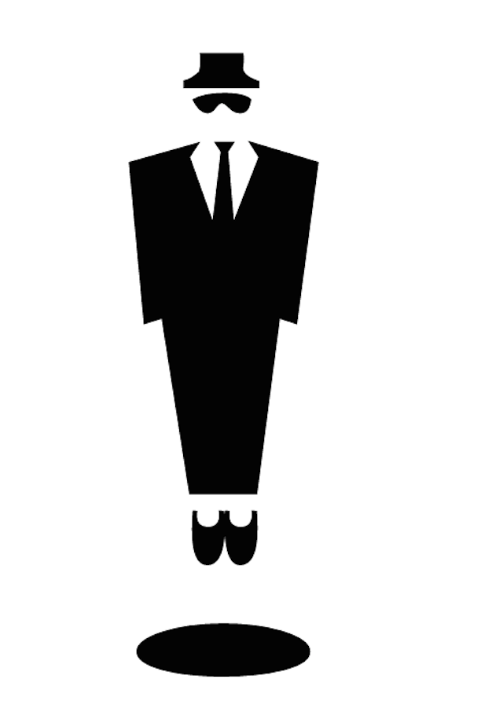

 

 <!-- .slide: class="center" -->
---

## &nbsp;
 

 <!-- .slide: class="center" -->

 

---
 

 <!-- .slide: class="center" -->
Note: Gday
---
 

 <!-- .slide: class="center" -->
Note: I want to start out by thanking the DSF for their scholarship
---
 

 <!-- .slide: class="center" -->
Note: I'm a developer. At the moment I'm doing a lot of Python
---
 

 <!-- .slide: class="center" -->
 

 <!-- .slide: class="center" -->
Note: But I also code a lot of different things

Ruby JavaScript PHP Perl
Python Web Shell Python
---
 

 <!-- .slide: class="center" -->
Note: And so I see a whole lot of different kinds of bugs
---
 

 <!-- .slide: class="center" -->
Note: and I love emoji
---
 

 <!-- .slide: class="center" -->
Note: and I love how broken emoji is

How broken?
---
 

 <!-- .slide: class="center" -->

Note: 
This talk contains no emoji.

SVG renders only

I'm running Ubuntu, and emoji don't work on ubuntu by default

---

 

 <!-- .slide: class="center" -->

Note: 

So, let's get started with a bit about how uniode got started

the birds and the bees, if you will. *BOOM BOOM *
---

 

 <!-- .slide: class="center" -->
Note: Everything in a computer is made of ones and zero

Binary 
---
 

 <!-- .slide: class="center" -->
Note: The amercans worked out that they could make their entire alphabet in 7bits
---
 

 <!-- .slide: class="center" -->
 

 <!-- .slide: class="center" -->
 

 <!-- .slide: class="center" -->
Note: So they created ascii

American Standard Code for Information Interchange

7 bits needed encode 127 characters
---
 

 <!-- .slide: class="center" -->

Note: But then how do you encode languages where they have more fancy characters/
---
 

 <!-- .slide: class="center" -->
 

 <!-- .slide: class="center" -->
 

 <!-- .slide: class="center" -->
Note: Well, you extend your encoding set!

use 8 bits!

And think of a really creative name for it

Like, extended ascii

255 characters
---

 

 <!-- .slide: class="center" -->
Note: But then you want to add characters from asian langauges

And all these differnet files need to be interchangeable because of this thing called the internet

---
 

 <!-- .slide: class="center" -->
 

 <!-- .slide: class="center" -->
Note: You can't encode everything in just 8 bits; it's not enough.
---

 

Note: universal encoding
Unicode Consortium
Space for just over a million different characters
---
 

 <!-- .slide: class="center" -->
 

 <!-- .slide: class="center" -->
Note: Three main encoding types.

YOu might have heard of these
---
 

 <!-- .slide: class="center" -->
 

 <!-- .slide: class="center" -->
Note: Fixed, or set. Always 32 bits
---
 

 <!-- .slide: class="center" -->
 

 <!-- .slide: class="center" -->
Note: If you want to encode in UTF-32, you have to us 32 bits
---
 

 <!-- .slide: class="center" -->

   
 <!-- .slide: class="center" -->
Note: Which means you have a lot of wasted space for characters in ASCII
---
 

 <!-- .slide: class="center" -->
 

 <!-- .slide: class="center" -->
Note: but you can encode other things as well
---
 

 <!-- .slide: class="center" -->

   
 <!-- .slide: class="center" -->
Note: but because there's such a big namespace, you still get wasted bits

---
 

 <!-- .slide: class="center" -->
 

 <!-- .slide: class="center" -->

Note: Flexible, Variable
---
 

 <!-- .slide: class="center" -->
 

 <!-- .slide: class="center" -->
Note: you don't have to use all the other bits

Added benefit: it's directly compatible with ASCII bit for bit

---
 

 <!-- .slide: class="center" -->
 

 <!-- .slide: class="center" -->
 

 <!-- .slide: class="center" -->
 

 <!-- .slide: class="center" -->

Note: The tags on the top note how many more to expect

0 at start is none

11 at start is one more (2 total)
111 is two more

---
 

 <!-- .slide: class="center" -->
Note: you might also see encodines described with a slash-u
These codes relate to specific codepoints, and each is unique
---
 

 <!-- .slide: class="center" -->
 

 <!-- .slide: class="center" -->

Note: here are these codes
---
 

 <!-- .slide: class="center" -->
 

 <!-- .slide: class="center" -->
Note: 
Here are some more awesome unicode codepoints

arabic ligature sallallahou alayhe wasallam

glagolitic capital letter spidery ha
---

 

 <!-- .slide: class="center" -->
 

 <!-- .slide: class="center" -->
  

 <!-- .slide: class="center" -->

Note: Combination marks

\u0065 \u0301
---

 

 <!-- .slide: class="center" -->
 

 <!-- .slide: class="center" -->
Note: So, with this, people are happy ,characters can be encoded.
---

 

 <!-- .slide: class="center" -->
Note: But the Japanese were wondering where the rest of their codepoints were
---

 

 <!-- .slide: class="center" -->

Note: These japanese had mobile phones with these little pictures, and they wanted them in emoji
---
 

Note: Shigetaka Kurita

SHI-GE-TA-KA KU RI TA

12x12 pixels

Introduced in the early 1990s, with a whole lot of turmoil

There's entire essays on the implementatation issues with this

Emoji Added to Unicode 6, 2010

TLDR: Apple implemented the proposed unicode spec with emoji for japan only

then a couple of versions later, released to the US

And then everyone rampted up

---

 

 <!-- .slide: class="center" -->

Note: Not the first time symbols were in unicode

Zapf Dingbats - creased 1978 Added in Uncide 1.0 in 1991

Microsoft Wingdings - created 1990 added Unicde 7.0, 2014

Webdings 1997 with such important symbols as the Cancer Ribbon, No Piracy, and Leviating Business Man
---

 

 <!-- .slide: class="center" -->
 

 <!-- .slide: class="center" -->
Note: the first verison with emoji
Unicode 6.0 the versions that are more previlent
---
 

 <!-- .slide: class="center" -->
 

 <!-- .slide: class="center" -->
Note: A small face-only update in 2012

most platforms, if they support emoji at all, will support up to here
---
 

 <!-- .slide: class="center" -->
 

 <!-- .slide: class="center" -->

Note: Unicode 7 2014

---
 

 <!-- .slide: class="center" -->
 

 <!-- .slide: class="center" -->

Note: Unicode 8 2015
Taco is now official

---
 

 <!-- .slide: class="center" -->

 
<pre style='margin-bottom:0px;margin-top:0px'><code style="font: 'monospace' 150%">$ python3 >>> import unicodedata >>> unicodedata.name("") 'CLAPPING HANDS SIGN'</code></pre>
 <!-- .element: class="fragment" -->

Note: CLAPPING HANDS SIGN

Python Code

Much work to get unicode integrated into systems

The picture here is the image form the standard

if i run the python code in Apple, i get the apple version

---
 

 <!-- .slide: class="center" -->

Note: Apple implemented emoji when they etered the japanese market

Didn't add to US iPhones for years, ~2010

People have used emoji *SO MUCH* since then

All ages

even important people like

Julie Bishop - Australian Minister for Foreign Affairs

Shes done entire interview in emoji

---

 

 <!-- .slide: class="center" -->

Note: Sending SMS apple to apple works, but then you get cross compatibility issues

---

 

 <!-- .slide: class="center" -->

Note: I'm going to make a scientific hypothsis
---

 

 <!-- .slide: class="center" -->
Note: I think that the unicode adoption, particularly the graphics and implementations was a bit rushed.
---
 

 <!-- .slide: class="center" -->
 
<pre style='margin-bottom:0px;margin-top:0px'><code style="font: 'monospace' 150%">>>> unicodedata.name("")</code></pre>

 
<pre style='margin-bottom:0px;margin-top:0px'><code style="font: 'monospace' 150%">'YELLOW HEART'</code></pre>

Note: 

Yellow Heart

This is the Apple version

Here's what Android went with.

---

Note: Android 4.4 KitKat
---

  

 <!-- .slide: class="center" -->

Note: 

Std vs 4.4 vs 5.0 Andoird IMplementations

Here's their 4.4 vs 5 implementations

The theory is that the black/white sample was used directly, but that doesn't explain the rest of them.
---

 

 <!-- .slide: class="center" -->

Note: 
This isn't the only one that's not exactly the same

Differences across platforms. Your version may not match receipant

The first three: Shock, Flushed face

Last one: bashful d'awww

Completely different

---
 

 <!-- .slide: class="center" -->

Note: it's not just google getting it weird

here's clapping from google vs microsoft

the thumbs!
---

 

 <!-- .slide: class="center" -->
Note: but sometimes the outlier is more correct.

jazzhands vs hugs
---
 

 <!-- .slide: class="center" -->

Note: Guess -- Blonde

---
 

 <!-- .slide: class="center" -->
Note: rat vs mouse
---
 

 <!-- .slide: class="center" -->
Note: disappointed

face with cold sweat

relieved 

face with open mouth and cold sweat
---
 

 <!-- .slide: class="center" -->
Note: grinning vs grimmace
---

 

 <!-- .slide: class="center" -->
Note: 

Person bowing deeply

information desk

No good

OK 
---
 

 <!-- .slide: class="center" -->
---
 

 <!-- .slide: class="center" -->
---
 

 <!-- .slide: class="center" -->

Note: Terrifying out of context

---
 

 <!-- .slide: class="center" -->
Note: webdings character

introduced 7.0 2014

No standards for webdings, based on a few people's opinions

now in unicode for backwards compatibility

---
 

 <!-- .slide: class="center" -->

Note: Dr Slump character - poop-boy

---
 

 <!-- .slide: class="center" -->

Note: so how do emoji get approved
---
 

 <!-- .slide: class="center" -->

Note: 
---
 

 <!-- .slide: class="center" -->
 

 <!-- .slide: class="center" -->

Note: Compatibility - Cowboy added to compat with Yahoo messenger
---
 

 <!-- .slide: class="center" -->

Note: Frequency. Hamburger for scale

---

 

 <!-- .slide: class="center" -->

Note: Distintiveness

Probbably don't need some for udon and ramen and lingine
---

 

 <!-- .slide: class="center" -->

Note: Completeness - they didnt have the full zodiac set until 8.0 when 5 were added (including scorpio)
---
 

 <!-- .slide: class="center" -->

Note: Frequently requested

---
 

 <!-- .slide: class="center" -->

---
 

 <!-- .slide: class="center" -->
Note: Overly specific

Don't need a manhattan in there
---

 

 <!-- .slide: class="center" -->

Note: open ended - don't need all the professions

---

 

 <!-- .slide: class="center" -->
Note: Already represented

Try and use a combination
---
 

 <!-- .slide: class="center" -->
Note: no logos or brands

But these are a watch, headphones, a mobile and a desktop

and in no way

an iWatch, Earbuds, an iPhone and an iMac.

Nope. 
---
 

 <!-- .slide: class="center" -->
Note: fads, memes, etc.
---
 

 <!-- .slide: class="center" -->
---
 

 <!-- .slide: class="center" -->
Note: whisky is coming in with 9.0

many proposals hit some of the inclusion factors

often use google trends or social media trends

one used hamburgr as a relative term to show the usage of different foods

hambuger for scale
---
 

 <!-- .slide: class="center" -->
Note: As new emoji are brought in

older systems will be outdated
---
 

 <!-- .slide: class="center" -->

Note: Mojibake
---
 

 <!-- .slide: class="center" -->
 

 <!-- .slide: class="center" -->

Note: Thinking Face in my Talk Summary

Not all systems have emoji

My Android - 5.0.1 OS --> U7.0 if you're lucky

Yosemite - up to 6.1, plus vulcan

Linux in general... yeah no.
---

 

 <!-- .slide: class="center" -->

Note: Current example. Github Reactions

---

 

 <!-- .slide: class="center" -->
---

 

 <!-- .slide: class="center" -->
---
 

 <!-- .slide: class="center" -->

Note: So how do you get the input in?

---
# 

 <!-- .slide: class="center" -->

Note: Apple input Control CMD Space

Not universal

Some apps don't like it

Sourced from Swedish camping map

Place of intereste

---

 

 <!-- .slide: class="center" -->
 

 <!-- .slide: class="center" -->
 

 <!-- .slide: class="center" -->
 

 <!-- .slide: class="center" -->

Note: Mobile device input

++New platforms have at least an option fr input

Not universal

---
 

 <!-- .slide: class="center" -->

Note: In the webspace, you have a few options

You can have your own input keyboard in the web space

Twitter DMs have a few, facebook has a menu in their webview

Google and Docs have menus, but their implementation is a bit.. weird

It's one of the older ones, and it looks like they're using private space

The emoji in your drafts, or in the edit mode, aren't emoji

But they're saved as it.

---
 

 <!-- .slide: class="center" -->

Note: workaround for having a visual input mechanism is shortcodes

But they're a psudostandard

---

 

 <!-- .slide: class="center" -->
  <!-- .element: class="fragment" -->

Note: Shortcodes

Slack: Searchable if they are native
auto convert from emoji codepoints to emoticons

Github: shortcodes, no search, autocomplete only.

Django-emoji is an app for Django that reports to do this

---

 

 <!-- .slide: class="center" -->
  <!-- .element: class="fragment" -->

Note: HipChat

uses brackets instead

---

 

 <!-- .slide: class="center" -->

Note: 

Cross-platform incompatibility
Interetinsg to see when slack codes go into hipchat

Also, slack engineering using slack codes in medium

Also, hipchat api calls - slash commands are broken in 4.0 clients, but emoticons still work -__

---

 

 <!-- .slide: class="center" -->

Note: on that note, please make automatically changing arbitaary text to emoji optional

please let me disable autocorrect

---
## &nbsp;
 
<pre style='margin-bottom:0px;margin-top:0px'><code style="font: 'monospace' 150%">$ python</code></pre>

 
<pre style='margin-bottom:0px;margin-top:0px'><code style="font: 'monospace' 150%">>>> if (x < y):</code></pre>

 
<pre style='margin-bottom:0px;margin-top:0px'><code style="font: 'monospace' 150%">>>> &nbsp; &nbsp; return True</code></pre>

  
 
<pre style='margin-bottom:0px;margin-top:0px'><code style="font: 'monospace' 150%">>>> if  < y   >>> &nbsp; &nbsp; return True</code></pre>
 <!-- .element: class="fragment" -->
Note: 

Autoconvert 

MAKE IT OPTIONAL
---
 

 <!-- .slide: class="center" -->
Note: Reading things back again

For mobile you can mostly assume platform emoji, with sme exceptions
---

 

 <!-- .slide: class="center" -->

Note: On the web,you have complete control

You can control the entire system

You can make it work

You can make it display your own emoji, or use a common one, like Emoji One

---

 

 <!-- .slide: class="center" -->
Note: 
If i might make a suggestion

if you have to do this kind of thing

---
 

 <!-- .slide: class="center" -->

Note: 

Think of it in terms of web accessibilty

At the very least, have images that are distinct and visible

little 12x12 don't work

Use vector graphs where possible - Apple doesnt

Where you can, allow the images to be bigger

Twitter DM and Slack message - if only emoji, they're display bigger
---
 

 <!-- .slide: class="center" -->
Note: Fall Back

Don't rely on system emoji for the web. It's unreliable, and exclusionary

You could try and detect if the emoji won't work via the User Agent, or

Just serve your own emoji graphs

Yes, it's not the best way to get things done, but
---
 

 <!-- .slide: class="center" -->

Note: Alt - Highlight

Have the unicode character as the alt

Allows copy and pasting

---
 

 <!-- .slide: class="center" -->

Note: Tooltip - Mouse Over

Have the proper description there, the standard

Alt Text does not have the same functionality as Tool Tips

You can use this to your own advantage
---

 

 <!-- .slide: class="center" -->

Note: 
twist things around

why don't we just have a hardware solution?

---
# &nbsp; <!-- .slide: data-background="pictures/emoji_keyboard.jpg" data-background-transition="none" -->

Note: Tom Scott

Hardware keyboard x 14 + LUA script + Autohotkey

Also Emojili - a hack as a joke, but they were approched by VCs
---

 

 <!-- .slide: class="center" -->

Note: The future
---

---

  

 <!-- .slide: class="center" -->

Note: Unicode 9.0

Not yet finalised, due for release this year
---

  

 <!-- .slide: class="center" -->

Note: 

These images are from Emojipedia mockups

These are the only ones currently on the list

Very Very tentative

Other popular suggestions that *MIGHT* make it in:

Doctor 
Giraffe 
Dinosaur 
Sandwich 
Milkshake 
Knitting 
Coffee (currently only 'hot beverage')
Hawaiian Hangtime sign (thumb and pinky)

---

 

 <!-- .slide: class="center" -->
 

 <!-- .slide: class="center" -->
Note: 

Google Updating Flushed as well, PHEW
---

  

 <!-- .slide: class="center" -->

Note: Android, and others, are updating their emoji all the time

New OS version -> new emoji, plus updates to the old ones

If it's an OS, you're going to have multiple different versions still in use
---

 

 <!-- .slide: class="center" -->
Note: They're also changing hands to handle the next feature

which is colour tone customisation
---

 

 <!-- .slide: class="center" -->
 

 <!-- .slide: class="center" -->

Note: 

Next - New Emoji Technology

Fitzpatrick Scale

Skin Tones

Not implemented in a lot of places

Slack yes, Facebook No, Google not a lot at all ("gender neutral")
---
 

 <!-- .slide: class="center" -->

Note: Fallback should look like this, sometimes the coloured square is a mojibake though.
---
 

 <!-- .slide: class="center" -->
 

 <!-- .slide: class="center" -->
Note: 

Zero space character allows for groupings
Banned in indonesia
---
 

 <!-- .slide: class="center" -->
 

 <!-- .slide: class="center" -->
Note: New proposal TR52

Combination of colours and hair colours

like the combination characters from earlier

The technology exists...
---

 

 <!-- .slide: class="center" -->

Note: Technical Standard #52

Closes early May, open for public feedback
---

 
Note: the takeaways
---

 

 <!-- .slide: class="center" -->

Note: 

There's a lot of power in speech

Emoji are an additional communication

Don't assume others will know what you're talking about without explaination
---

 

 <!-- .slide: class="center" -->

Note: Implement responsibly

Think about accessibility
---

 

 <!-- .slide: class="center" -->
Note: 

And have fun~
---

 

 <!-- .slide: class="center" -->

### glasnt.com/talks