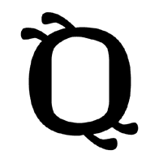
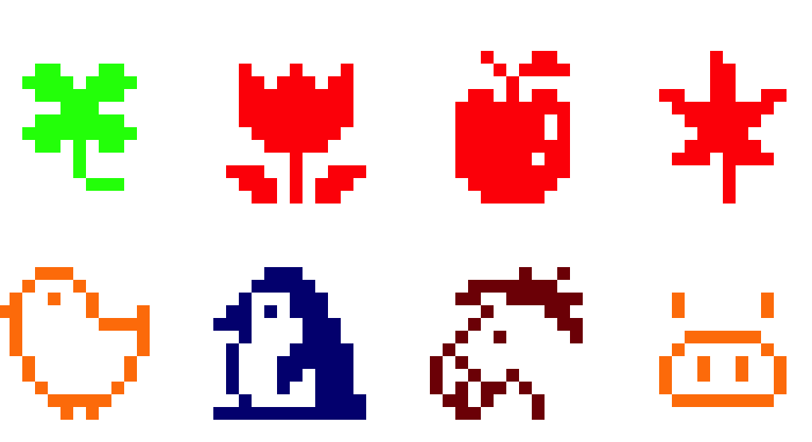
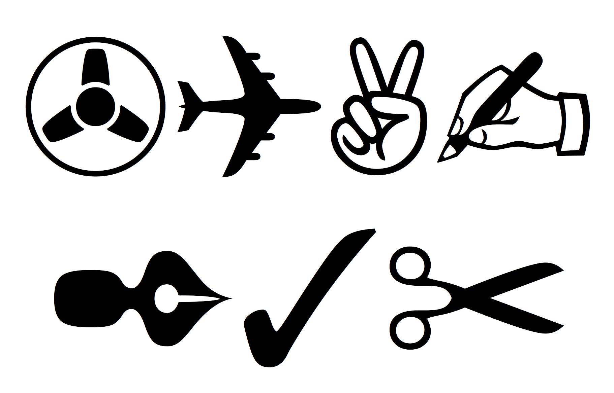

## &nbsp;

 <!-- .slide: class="center" -->
 
---
 

 <!-- .slide: class="center" -->
Note: Guitar
---
 

 <!-- .slide: class="center" -->
Note: I'm a developer
---
 

 <!-- .slide: class="center" -->
 

 <!-- .slide: class="center" -->
Note: I code in a lot of things
---
 

 <!-- .slide: class="center" -->
Note: And so I see a whole lot of different kinds of bugs
---
 

 <!-- .slide: class="center" -->
Note: and I love emoji
---
 

 <!-- .slide: class="center" -->
Note: and I love how broken emoji is

How broken?
---
 

 <!-- .slide: class="center" -->

Note: 
This talk contains no emoji.

SVG renders.

I'm running Ubuntu, and nothing would work if I did that
---

 

 <!-- .slide: class="center" -->
Note: I ran a poll on twitter asking me to do this in entirely emoji, but i can't

So, let's get started with a bit about how uniode got started

the birds and the bees, if you will. *BOOM BOOM *
---

 

 <!-- .slide: class="center" -->
Note: Everything in a computer is made of ones and zero

Binary 
---
 

 <!-- .slide: class="center" -->
Note: The amercans worked out that they could make their entire alphabet in 7bits
---
 

 <!-- .slide: class="center" -->
 

 <!-- .slide: class="center" -->
 

 <!-- .slide: class="center" -->
Note: So they created ascii

American Standard Code for Information Interchange

7 bits needed encode 127 characters
---
 

 <!-- .slide: class="center" -->

Note: But then how do you encode languages where they have more fancy characters/
---
 

 <!-- .slide: class="center" -->
 

 <!-- .slide: class="center" -->
 

 <!-- .slide: class="center" -->
Note: Well, you extend your encoding set!

use 8 bits!

And think of a really creative name for it

Like, extended ascii
---

 

 <!-- .slide: class="center" -->
Note: But then you want to add characters from asian langauges

And all these differnet files need to be interchangeable because of this thing called the internet

---
 

 <!-- .slide: class="center" -->
 

 <!-- .slide: class="center" -->
Note: You can't encode everything in just 8 bits; it's not enough.
---

 

Note: universal encoding

---
 

 <!-- .slide: class="center" -->
 

 <!-- .slide: class="center" -->
 

 <!-- .slide: class="center" -->
Note: Three main encoding types.

YOu might have heard of these
---
 

 <!-- .slide: class="center" -->
 

 <!-- .slide: class="center" -->
Note: Fixed, or set. Always 32 bits
---
 

 <!-- .slide: class="center" -->
 

 <!-- .slide: class="center" -->
Note: If you want to encode in UTF-32, you have to us 32 bits

---
 

 <!-- .slide: class="center" -->
 

 <!-- .slide: class="center" -->
 

 <!-- .slide: class="center" -->
 

 <!-- .slide: class="center" -->
Note: Which means you have a lot of wasted space for characters in ASCII
---

 

 <!-- .slide: class="center" -->
 

 <!-- .slide: class="center" -->
Note: but you can encode other things as well
---
 

 <!-- .slide: class="center" -->
 

 <!-- .slide: class="center" -->
 

 <!-- .slide: class="center" -->
 

 <!-- .slide: class="center" -->
Note: but because there's such a big namespace, you still get wasted bits
---

 

 <!-- .slide: class="center" -->
 

 <!-- .slide: class="center" -->

Note: Flexible, Variable
---
 

 <!-- .slide: class="center" -->
 

 <!-- .slide: class="center" -->
Note: you don't have to use all the other bits

Added benefit: it's directly compatible with ASCII bit for bit

---
 

 <!-- .slide: class="center" -->
 

 <!-- .slide: class="center" -->
 

 <!-- .slide: class="center" -->
 

 <!-- .slide: class="center" -->

Note: The tags on the top note how many more to expect

0 at start is none

11 at start is one more (2 total)
111 is two more

---
 

 <!-- .slide: class="center" -->
Note: you might also see encodines described with a slash-u
---
 

 <!-- .slide: class="center" -->
 

 <!-- .slide: class="center" -->

Note: here are these codes
---
 

 <!-- .slide: class="center" -->
 

 <!-- .slide: class="center" -->
Note: 
Here are some more awesome unicode codepoints

arabic ligature sallallahou alayhe wasallam

glagolitic capital letter spidery ha
---

 

 <!-- .slide: class="center" -->
 

 <!-- .slide: class="center" -->
  
 

 <!-- .slide: class="center" --> <!-- .element: class="fragment" -->

Note: Combination marks
 

 <!-- .slide: class="center" -->

\u0065 \u0301
---

# S҉̥͍͕͖y̙̹͆̐̉̌ḏ͓ D̮̹̝͔̈ͫ̐ͯ̍ͣe̯̳͔̳̿̃v͇͕̥ͥ͑Ọ̥̖ͣ̈́̐͒̿p͈͕̎̏͆s͎̭̻̲͖̖̹̓̈́ͪͩ̚ <!-- .slide: class="center" -->

Note: Zalgo
---
 

 <!-- .slide: class="center" -->
 

 <!-- .slide: class="center" -->
Note: So, with this, people are happy ,characters can be encoded.
---

 

 <!-- .slide: class="center" -->
Note: But the Japanese were wondering where the rest of their codepoints were
---

 

 <!-- .slide: class="center" -->

Note: "We want our emoji"
---
 

Note: Shigetaka Kurita

SHI-GE-TA-KA KU RI TA

12x12 pixels

Introduced in the early 1990s, with a whole lot of turmoil

There's entire essays on the implementatation issues with this

Emoji was proposed 2007
Released 2010 in Unicode 6

TLDR: Apple implemented the proposed unicode spec with emoji for japan only

then a couple of versions later, released to the US

And then everyone rampted up

---

 

Note: Not the first time symbols were in unicode

Zapf Dingbats - creased 1978 Added in Uncide 1.0 in 1991

---

 
Note: Microsoft Wingdings - created 1990 added Unicde 7.0, 2014
---

 

Note: Also webdings - with such important symbols as the Cancer Ribbon, No Piracy, and Leviating Business Man

---

 

 <!-- .slide: class="center" -->

 
<pre style='margin-bottom:0px;margin-top:0px'><code style="font: 'monospace' 150%">$ python3 >>> import unicodedata >>> unicode_data.name("") >>> 'CLAPPING HANDS SIGN'</code></pre>
 <!-- .element: class="fragment" -->

Note: CLAPPING HANDS SIGN

Python Code

Much work to get unicode integrated into systems

TODO: FIX KEYCAPS

---

 

 <!-- .slide: class="center" -->

Note: I'm going to make a scientific hypothsis
---

 

 <!-- .slide: class="center" -->
Note: I think that the unicode adoption, particularly the graphics and implementations was a bit rushed.
---
 

 <!-- .slide: class="center" -->

Note: 
1F49B 
Yellow Heart
---

 

 <!-- .slide: class="center" -->
Note: Twitter, EmojiOne, Apple
---

Note: Android 4.4 KitKat
---

 

 <!-- .slide: class="center" -->
 

 <!-- .slide: class="center" -->

Note: 

Yellow green blue purple

4.4 vs 5
---

 

 <!-- .slide: class="center" -->

Note: 

Heavy Black Heart
Eight Pointed Black Star

Black referrs to filled
White refers to unfilled.

---

 

 <!-- .slide: class="center" -->

Note: Clapping thumbs
---
 

 <!-- .slide: class="center" -->
Note: hugs or jazzhands
---
 

 <!-- .slide: class="center" -->

Note: Guess -- Blonde

Google Twitter EmojiOne Mozilla
---
 

 <!-- .slide: class="center" -->
Note: sheep vs ram
---
 

 <!-- .slide: class="center" -->
Note: OX vs buffalo
---
 

 <!-- .slide: class="center" -->
Note: rat vs mouse
---
 

 <!-- .slide: class="center" -->
Note: weary vs tired
---
 

 <!-- .slide: class="center" -->
Note: disappointed

face with cold sweat

relieved 

face with open mouth and cold sweat

---
 

 <!-- .slide: class="center" -->
Note: grinning vs grimmace
---
 

 <!-- .slide: class="center" -->
---
 

 <!-- .slide: class="center" -->
Note: 

Person bowing deeply

information desk

No good

OK 
---
 

 <!-- .slide: class="center" -->
 

 <!-- .slide: class="center" -->
---
 

 <!-- .slide: class="center" -->
---
 

 <!-- .slide: class="center" -->
Note: TODO MORE CUTE
---
 

 <!-- .slide: class="center" -->
 

 <!-- .slide: class="center" -->
Note: Twitter vs emojione
---
 

 <!-- .slide: class="center" -->

Note: Terrifying out of context

---

 

 <!-- .slide: class="center" -->

Note: 
Matthew Garret tweet: stabbed in the face with a heart

---
 

 <!-- .slide: class="center" -->
Note: webdings character

introduced 7.0 2014

No standards for webdings, based on a few people's opinions

now in unicode for backwards compatibility

---
 

 <!-- .slide: class="center" -->
---
 

 <!-- .slide: class="center" -->
Note: Dr Slump character - poop-boy

---
 

 <!-- .slide: class="center" -->

Note: so how do emoji get approved
---
 

 <!-- .slide: class="center" -->

Note: 
---
 

 <!-- .slide: class="center" -->
 

 <!-- .slide: class="center" -->

Note: Compatibility - Cowboy added to compat with Yahoo messenger
---
 

 <!-- .slide: class="center" -->

Note: Frequency. Hamburger for scale

---

 

 <!-- .slide: class="center" -->

Note: Distintiveness

Probbably don't need some for udon and ramen and lingine
---

 

 <!-- .slide: class="center" -->

Note: Completeness - they didnt have the full zodiac set until 8.0 when 5 were added (including scorpio)
---
 

 <!-- .slide: class="center" -->

Note: Frequently requested

---
 

 <!-- .slide: class="center" -->

---
 

 <!-- .slide: class="center" -->
Note: Overly specific

Don't need a manhattan in there
---

 

 <!-- .slide: class="center" -->

Note: open ended - don't need all the professions

---

 

 <!-- .slide: class="center" -->
Note: Already represented

Try and use a combination
---
 

 <!-- .slide: class="center" -->
Note: no logos or brands

But these are a watch, headphones, a mobile and a desktop

and in no way

an iWatch, Earbuds, an iPhone and an iMac.

Nope. 
---
 

 <!-- .slide: class="center" -->
Note: fads, memes, etc.
---
 

 <!-- .slide: class="center" -->
---
 

 <!-- .slide: class="center" -->
---
 

 <!-- .slide: class="center" -->
---
 

 <!-- .slide: class="center" -->
---
 

 <!-- .slide: class="center" -->
 

 <!-- .slide: class="center" -->

Note: Thinking Face in my Talk Summary
---

 

 <!-- .slide: class="center" -->

Note: So how do you get the input in?

---
# 

 <!-- .slide: class="center" -->

Note: Apple input Control CMD Space

Not universal

Some apps don't like it

Sourced from Swedish camping map

Place of intereste

---

 

 <!-- .slide: class="center" -->
 

 <!-- .slide: class="center" -->
 

 <!-- .slide: class="center" -->
 

 <!-- .slide: class="center" -->

Note: Mobile device input

 

++New platforms have at least an option fr input

Not universal

---

 

 <!-- .slide: class="center" -->

Note: Browser: input fields vs text on page

Microsoft - uncoloured in input, coluored on page

Apple - ungrouped in input, groupings on page,

FB - 20 hidden behind stickers, more on messenger
Twitter: 5
Gmail: hidden in the edit bar

Normally shortcut to reading format, except for Gmail - weird intermediate

Basptiste reports this also happens in Google Slides edit mode

---
 

 <!-- .slide: class="center" -->

Note: workaround for having a visual input mechanism is shortcodes

This are bad

But they're a psudostandard

GitHub: colon shortsuggestions
Hipchat: bracket, long form suggestions (but brackets are more common in speech

Slack does this really well

---

 

 <!-- .slide: class="center" -->
Note: Shortcodes

Slack: Searchable if they are native
auto convert from emoji codepoints to emoticons

Github: shortcodes, no search, autocomplete only.
---

 

 <!-- .slide: class="center" -->

Note: HipChat

uses brackets instead

Interetinsg to see when slack codes go into hipchat

Also, slack engineering using slack codes in medium

Cross-platform incompatibility

---
## &nbsp;
 
<pre style='margin-bottom:0px;margin-top:0px'><code style="font: 'monospace' 150%">$ python</code></pre>

 
<pre style='margin-bottom:0px;margin-top:0px'><code style="font: 'monospace' 150%">>>> if (x < y):</code></pre>

 
<pre style='margin-bottom:0px;margin-top:0px'><code style="font: 'monospace' 150%">>>> &nbsp; &nbsp; return True</code></pre>

  
 
<pre style='margin-bottom:0px;margin-top:0px'><code style="font: 'monospace' 150%">>>> if  < y   >>> &nbsp; &nbsp; return True</code></pre>
 <!-- .element: class="fragment" -->
Note: 

Autoconvert 

MAKE IT OPTIONAL
---
 

 <!-- .slide: class="center" -->
Note: Reading things back again

Platform level

Web based flexibility

Twitter wins this
---

 

 <!-- .slide: class="center" -->

Note: you have control

You can do things with failover graphs and all the stuff
---

 

 <!-- .slide: class="center" -->
Note: 
Failover graphic, copy
---
 

 <!-- .slide: class="center" -->

Note: a

accessibility 
alt text important

You can't see what the things are!

SVGS FOR THE LOVE OF GOD

APPLE DOESN'T DO THIS
---
 

 <!-- .slide: class="center" -->

Note: Tooltip - Mouse Over

Have the proper description there
---
 

 <!-- .slide: class="center" -->

Note: Alt - Highlight

Have the unicode character as the alt

Allows copy and pasting

---

 

 <!-- .slide: class="center" -->

Note: 
twist things around

why don't we just have a hardware solution?

---
# &nbsp; <!-- .slide: data-background="pictures/emoji_keyboard.jpg" data-background-transition="none" -->

Note: Tom Scott, Emojli

---

 

 <!-- .slide: class="center" -->

Note: The future

---

 

 <!-- .slide: class="center" -->
 

 <!-- .slide: class="center" -->

Note: Unicode 9.0

Popular asked for ones

Fill in backward compat (nerd, thinking)

Cricket -- many olympics (might not be in in time though)
---

 

 <!-- .slide: class="center" -->
 

 <!-- .slide: class="center" -->

Note: Candidates -- not yet approved

Chicken in Unicode 6.0

Egg provisionally in 9.0

Now you know which came first

SPOON 
---

  

Note: Android have updated their images AGAIN

matching ios more
---

 

 <!-- .slide: class="center" -->
 

 <!-- .slide: class="center" -->

Note: Fitzpatrick Scale

Skin Tones

Not implemented in a lot of places

Slack yes, Facebook No, Google not a lot at all ("gender neutral")
---

 

 <!-- .slide: class="center" -->
---

 

 <!-- .slide: class="center" -->

Note: These are specific emoji, not groupings

Zero space character allows for groupings

---

 

 <!-- .slide: class="center" -->
 

 <!-- .slide: class="center" -->

---
 

 <!-- .slide: class="center" -->
 

 <!-- .slide: class="center" -->
Note: New proposal TR52

Combination of colours and hair colours

like the combination characters from earlier

The technology exists...
---

 

 <!-- .slide: class="center" -->

Note: Technical Standard #52

Closes early May, open for public feedback
---

 
Note: the takeaways
---
 

 <!-- .slide: class="center" -->

Note: Emoji are an additional communication

Don't assume others will know what you're talking about without explaination
---

 

 <!-- .slide: class="center" -->

Note: Think about accessibility
---

 

 <!-- .slide: class="center" -->
Note: have a bit of fun, tho
---

 

 <!-- .slide: class="center" -->

### glasnt.com/talks