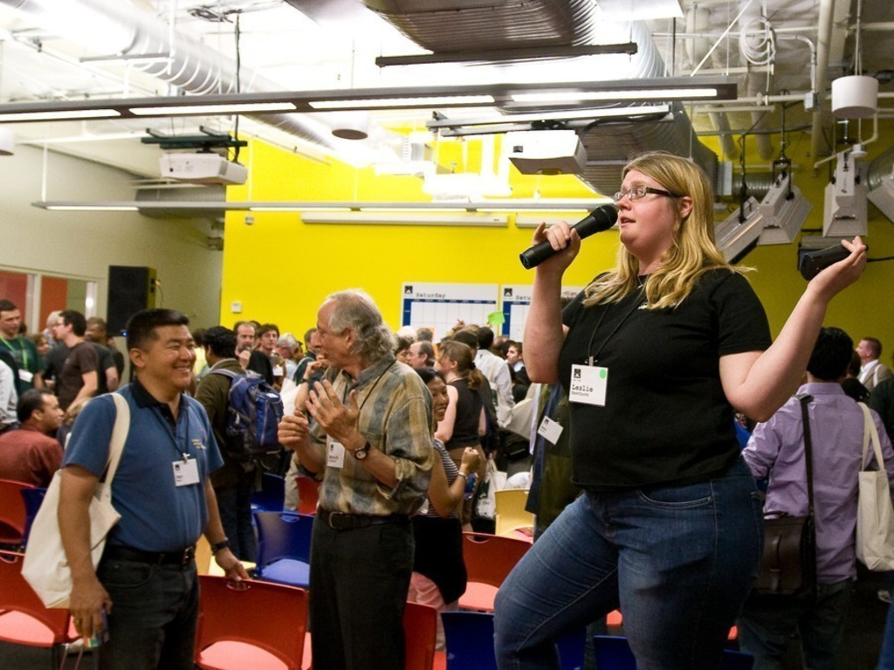
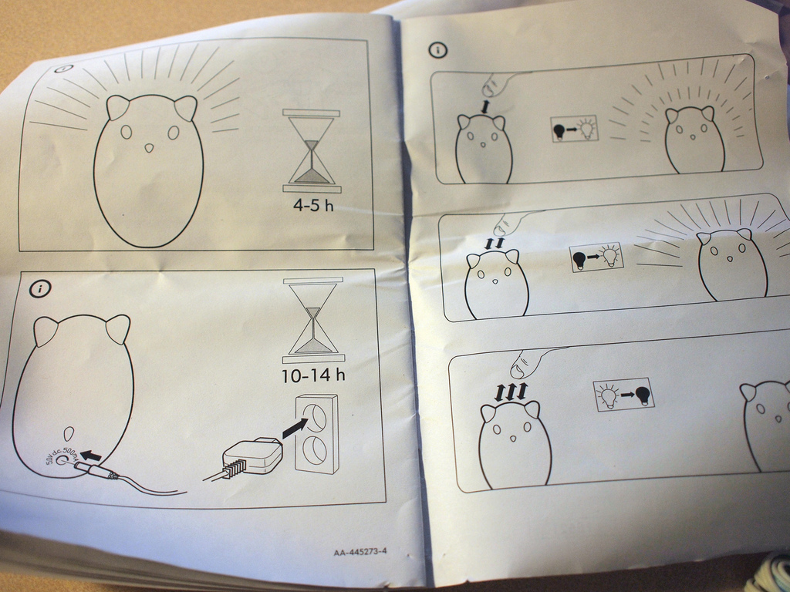
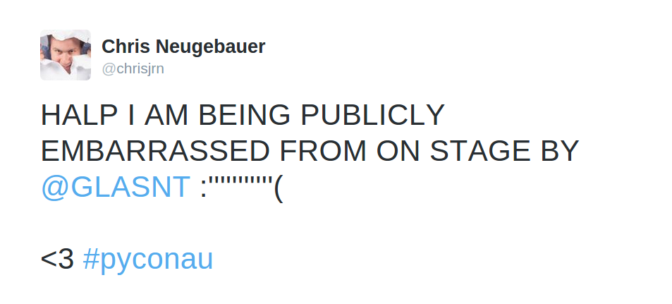
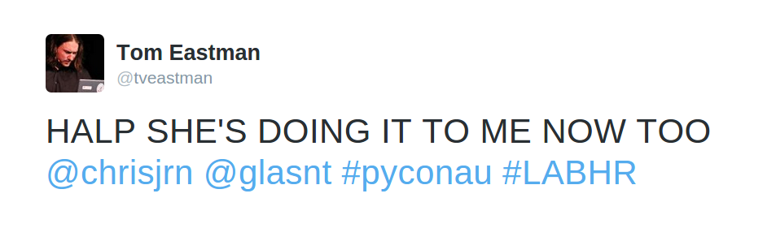
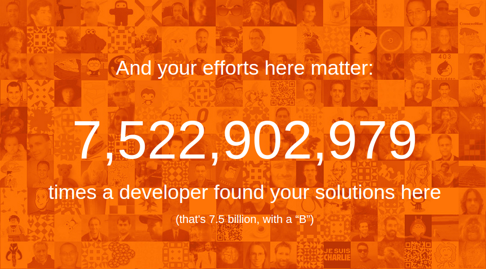
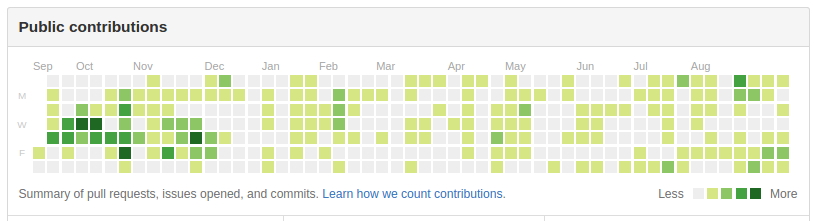
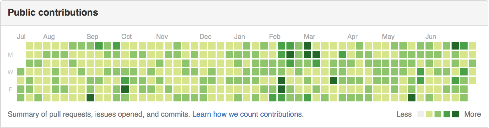
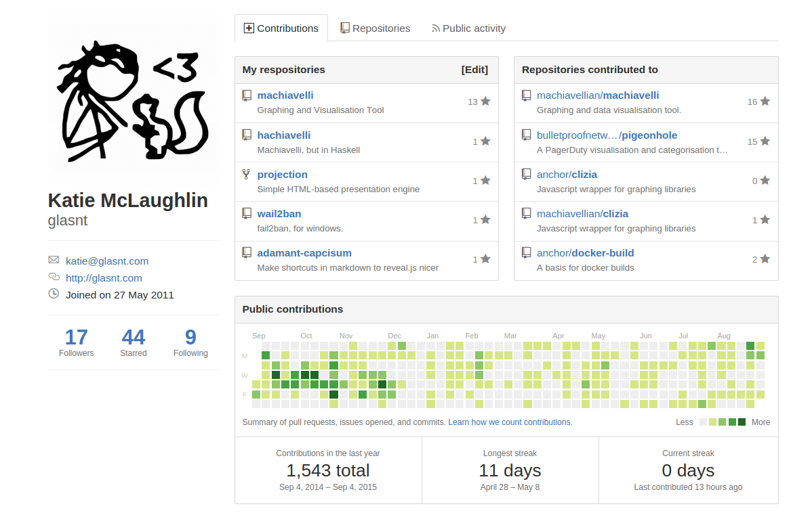
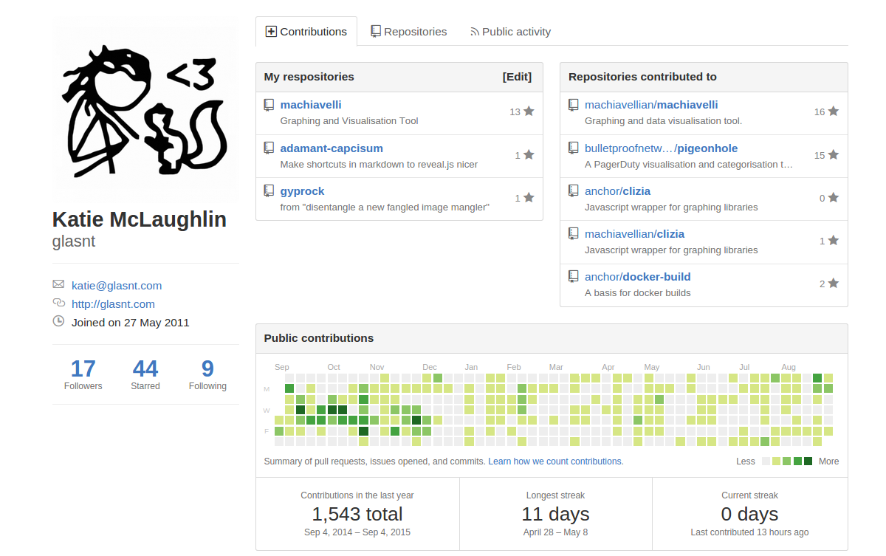

# Build a Better Hat Rack <!-- .slide: class="center" -->
## All Contributions Welcome

 

 <!-- .slide: class="center" -->

Note: These are my speaker notes.

There are many like them, but these ones are mine

---

# Hi! <!-- .slide: class="center" -->

Note: Hi! I'm Katie, and I'm a software developer.

I wear many hats. I use all the languages.

---

 

 <!-- .slide: class="center" -->
---
 

 <!-- .slide: class="center" -->

Note: I do OSS contributions

Docker have paid me for my contributions

I am also an Active Technical Contributor for Open Stack

Want to know what my contribution to OpenStack was?

---

 

 <!-- .slide: class="center" -->

Note: an inline documentation change. It's a Python file, yo

---

 
# Barcelona
### October 25-28, 2016
### &nbsp; <!-- .slide: data-background="pictures/barcelona-bkgd-lrg.jpg" data-background-transition="none" -->

Note: 

If you committed within the window, you got a free ticket to Tokyo

Incentive Driven Code Development

---

 

 <!-- .slide: class="center" -->

Note: But how do we track all these contributions that we make

---

 

 <!-- .slide: class="center" -->

Note: GitHub gives us some of this functionality

Pretty graphs and the like

---

 

 <!-- .slide: class="center" -->

Note: but it's not exactly perfect

And it only include itself

There are other ways - project specific, etc

---

 

 <!-- .slide: class="center" -->

Note: But what about everything else?

Code Review

Documentation 

Testing 

Design 

UAT 

Promotion 

User Groups / Presentations

---

 

 <!-- .slide: class="center" -->

Note: Who here:

Who here has committed to PHP Core or a major framework?

Everyone else:

Used the code

Taught 

Spoken 

Attended 

---

 

 <!-- .slide: class="center" -->

Note: These are all contributions

Not even including all the aspects of the SDLC that go unattributed

Community, yo

---

 

 <!-- .slide: class="center" -->

Note: So, how can we track and record and acknowledge all this?

---

 

Note: Let me tell you about Leslie

Amazing human being

---

# #LABHR <!-- .slide: class="center" -->
## bit.do/LABHR

Note: She started this hashtag, and wrote a blog post about it

---

 

Note: Which I've turned into a easy to read manual to try and spread the message

---

# DÅLIGORDLEK
 

#LABHR
Note: It's a bad pun

---

 

#LABHR
Note: Leslie and Deb meet over coffee

Leslie of Google / Elastic

Deb of Open Innovation Network

Sahana Software Foundation

Software for developing countries

“No, this is great. This gives me one of those places to hang your hat.

You know, something you can list on your LinkedIn profile instead of just a project that you work on for free because you love it.

But no one really knows about it or notices.”

---

 

#LABHR
Note: So Leslie + Blog = 5 steps

---

 

#LABHR
Note: write the list

---

 

#LABHR
Note: send the list

---

 

#LABHR
Note: GRAVY

Tweet about it

---

 

#LABHR
Note: GRAVY #2

Linked in Recommendations

NOT endorsements

See later

---

 

#LABHR

Note: GRAVY #3

Do it for someone not like you

---

 

#LABHR
Note: Simple! Nice! Helpful!

---

 

Note: But it didn't get that much traction

Leslie reported ~30 known LinkedIn recommendation

I've done talks in multiple different cities/languages

It's always the same, one or two after the talk

(PyConAU exception - because I refused to get off stage until 10 tweets happened)
(This did result in some residiual activity during the sprints)
Maybe y'all need a LIVE DEMO

---

# How to be nice <!-- .slide: class="center" -->
## [demo] <!-- .slide: class="center" -->

Note: Live demo, lets hope this works

Hat Rack
---

# Hi, Jack! <!-- .slide: class="center" -->

---

 

Note: Jack is a force of good for the community - Davey

---

# How to say thank you <!-- .slide: class="center" -->
## [demo] <!-- .slide: class="center" -->

Note: 
Repeat for mic, if required.

---
# How not to react <!-- .slide: class="center" -->

Note: 

This didn't happen last time. Ref Chris.

---

 

Note: Chris was a little bit upset last time this happened

Ref Tom

---

 

Note: And not just him.

---

 

Note: It took a third party to actually confirm they did good.

Ref Russell.

I've seen this before, not only in the #LABHR
---

Russell Keith-Magee 
@freakboy3742  @tveastman @chrisjrn You both deserve it. Thanks for everything you do for the community. &#35;LABHR /cc @glasnt
---

# Why can't we take a compliment? <!-- .slide: class="center" -->

---

# Minimisation <!-- .slide: class="center" -->

Note: Antonym of exaggeration

"She'll be right, no worries"

Understating 

---
# Tall Poppy Syndrome <!-- .slide: class="center" -->

Note: We are reluctant to allow ourselves to be elevated in front of our peers, lest we be cut down.

And of course, everyone's favourite

---

# Imposter Syndrome <!-- .slide: class="center" -->

Note: If we get thanked, we tend not to think it actually applies, because all the problems

---

# Acknowledging just how splendid we are <!-- .slide: class="center" -->

Note: We are amazing. We are splendid. We need to ack that.

The fact that I didn't know half of these existed is a problem in itself.

---

 

Note: can be dev or community or combination of both

Sarah Mei

Sam Saffron

---
   
 

Note: Perl White Camel

* User Groups

* Advocacy

* Community

Tim O'Reilly

Paul Fenwick

---

   
 

Note: Python Software Foundation awards

Community Service

Distinguished Service

Nick Coghlan

---

 
---

# Acknowledging our *own* achievements <!-- .slide: class="center" -->

Note: one way to break this is to start to acknowledge our own achievements

---
  
  
 

Note: Lara Hogan, Donut Manifesto

This donut = draft of a book

Giving ourselves a little celebration if noone else will

Tweeting the donut

Piggybacking on a picture of a donut (instagram makes this OK).

---

 

Note: I like the idea of donuts. This is one I did the other day.

I'm not trying to be self-gratifying, but sometimes, you need to do that.

---

# Not all contributions are donuts <!-- .slide: class="center" -->

Note: sometimes it's the little things that add up onto something big

---

# Stack Overflow <!-- .slide: class="center" -->

---

 

Note: The profiles are now really nice!

---

# Just a drop in the ocean <!-- .slide: class="center" -->

Note: 
How many people go onto stackoverflow to ask

Does anyone know how many questions there have been answered on SO?

---

 

Note: SO recently 10 million questions.

Go on there and find your project's tag, and thank the people who are answering your things for you

You might have a standalone SO instance for your Q&A

---

 

Note: 

If a dev found a solution just half of those times, and it saved them just 30 minutes, that's nearly 1.85 billion hours saved.

It's enough to read all of Wikipedia. 12,000 times.

8 million developers come here every day.

It'd be a bigger country than more than half the world's nations.

There are about 51,000 developers on the site at any given second. This is what 51,000 people looks like.

Together, we've built a place where every 12 seconds a developer posts an answer that helps fellow coders.

---

#  <!-- .slide: class="center" -->
 

Note: Your community advocates need your thanks

You can thank them by giving them something extremely useful

---

# But why say thank you? <!-- .slide: class="center" -->

Note: Apart from it being a nice thing todo.

---

# It's nice thing to do <!-- .slide: class="center" -->

Note: Not getting acknowedgement sucks

Burnout 

Plight of the organiser
---

# Encourage continued engagement <!-- .slide: class="center" -->

Note: They have done a thing once, they will do it again.

Charelle's story from Compcon - first commit, hand held from Russell
---

# Voluntold <!-- .slide: class="center" -->

Note: I'm super encourageable. I think half the stuff i do is average until validated

---

# "Foot in the Door" <!-- .slide: class="center" -->

Note: "Fear, Uncertainty and Dopamine" - Paul Fenwick

Amazing talk about a few different issues about hacking brains

Brilliant riff about making contrubutors stick

Foot in the Door - Drive Safely sign - 17% baseline, 76% with pre-sticker

Car Bumper Stickers

A tiny little foot in the door

STICKERS 

Little things = seed, -> improvement over time

"If you see someone doing something like that - acknowledge them like crazy

---

# Change self image <!-- .slide: class="center" -->

Note: 
it makes them feel valued

self image change, they feel included in the project, and it makes them feel good

but it also binds their fate to yours

if your project fails, it reflects badly on them, because they are now involed in your project

---

 

Note: But just how can we say thank you

---

# Communication within your project <!-- .slide: class="center" -->

Note: Mentioning things in your release notes is a good thing. MediaGolbin does this

Drupal concatenates thread commentors into git commit message

But the scope of this communication is only within your existing community.

You need to extend to more general communications
---
# Communication outside your project <!-- .slide: class="center" -->

---
# Give your helpers something to show for their work <!-- .slide: class="center" -->

---
 

Note: This is the new age resume. Publically accessible. We can thank people who would otherwise be unrecognised

LinkedIn is pretty awful though.

---

# Recommendations vs Endorsements <!-- .slide: class="center" -->

Note: Two main ways to add content to someone's linkedin profile

---
# Recommendations <!-- .slide: class="center" -->

---

 

Note: Here's all the different sections that you can fill on your profile

---

 

Note: But here are the only ones that are able to be recommendable

---

 

---

 

Note: Running a conf, volenteering as a thing, is **experience**

LIST IT AS SUCH

---

# Endorsements <!-- .slide: class="center" -->
## ... possibly not as helpful <!-- .element: class="fragment" -->

---

 

---

 

---
# User Contributions <!-- .slide: class="center" -->

---

 

Note: No idea how the 'Repositories contributed to' works

I've done Rails, Rubocop, Docker, OpenStack, Pybee... they arent there

---
   
 

Note: focus on this graph. So much focus
---

# What counts? <!-- .slide: class="center" -->
## Commits <!-- .element: class="fragment" -->
### 
(against <code>master</code> or <code>gh-pages</code>)
 <!-- .element: class="fragment" -->
## Issues and Pull Requests <!-- .element: class="fragment" -->
### (opened, in the past year) <!-- .element: class="fragment" -->

Note: Continued discussions on a PR only counts as one

---

# But only if... <!-- .slide: class="center" -->

## you own the repo <!-- .element: class="fragment" -->
## or, you're a collaborator <!-- .element: class="fragment" -->
## or, you're in the owner organisation <!-- .element: class="fragment" -->
## or, you forked the repo <!-- .element: class="fragment" -->
### ... but commits don't count on forks <!-- .element: class="fragment" -->

---

# What counts? <!-- .slide: class="center" -->
## Only some of your work. <!-- .element: class="fragment" -->

Note: But what if you really want that full green graph
---

# Sound too hard? <!-- .slide: class="center" -->
## It's ok, there's a hack for that <!-- .element: class="fragment" -->

---
## <pre><code style="font: 'monospace' 150%">$ pip install rockstar</code></pre>
## <pre><code style="font: 'monospace' 150%">$ rockstar</code></pre> <!-- .element: class="fragment" -->
</code></pre> 

  <!-- .element: class="fragment" -->

Note: By default - one hello world in c++ everyday for as many days as you specify

---

## ozh.org/contribution <!-- .slide: class="center" -->

  <!-- .element: class="fragment" -->

---

 

---
# Project Contributions <!-- .slide: class="center" -->

---

 

Note: Looking at any github project page we can see all the contributors right?

THere's a button right at the top and everything

---

 

Note: But if we click it, then we don't actually get the contributors

We get the top ones, with a graph, ranked by lines of code

---
 

Note: And it's only the top 100

---

# This is only some of the contributors <!-- .slide: class="center" -->
Note: Not even all the code commiters are listed!
---
# This is only some of the contributions <!-- .slide: class="center" -->
Note: What about everything else

---

# What about everything else? <!-- .slide: class="center" -->
## Logged Issues <!-- .element: class="fragment" -->
## Unmerged Pull Requests <!-- .element: class="fragment" -->
## Code Reviews <!-- .element: class="fragment" -->
## Feature Discussions <!-- .element: class="fragment" -->
## Feature Voting <!-- .element: class="fragment" -->

---

# What if... <!-- .slide: class="center" -->

Note: What if these contributions counted

---

#  <!-- .slide: class="center" -->

Note: What if these contributions were accolates
---
 

Note: you have a profile
---
 

Note: What if you could change your profile
---
 

Note: What if you could curate a list of repositories you were proud to have worked on

---
 

Note: And add ones that would otherwise fall off the end because they don't have enough stars?
---
 

Note: What if your contributions outside your namespace could be curated?

---
 

Note: What if you could list what you were proud to have worked on

---
 

Note: What if you could add things that you had interacted with, but not committed code to

---
 

Note: What if you could display that the owners of the project had given you accolades for your work?

What if, as a project owner, you could give props to community members

---

 

Note: What if the gamification goal was community help, not a full green graph
---

 

Note: But how can you find who in your project community to give props to?

The customisation of the github profile may not exist, but the data for who could be given props does

---
## github.com/glasnt/octohat <!-- .slide: class="center" -->
## <code>pip install octohat</code> <!-- .element: class="fragment" -->

Note: introducing octohat
---

# hakimel/reveal.js <!-- .slide: class="center" -->
## Code Contributors: 142 <!-- .element: class="fragment" -->
## Non-Code Contributors: 435 <!-- .element: class="fragment" -->

---

# joomla/joomla-cms <!-- .slide: class="center" -->
## Code Contributors: 414 <!-- .element: class="fragment" -->
## Non-Code Contributors: 266* <!-- .element: class="fragment" -->
### * Since June 2015, ~700 issues/PRs <!-- .element: class="fragment" -->

Note: Joomla is *massive*

I could only get this many before my GitHub token ratelimited.
---

# avinassh/rockstar <!-- .slide: class="center" -->
## Code Contributors: 30 <!-- .element: class="fragment" -->
## Non-Code Contributors: 38 <!-- .element: class="fragment" -->

---

# glasnt/octohat <!-- .slide: class="center" -->
## Code Contributors: 6 <!-- .element: class="fragment" -->
## Non-Code Contributor: 3 <!-- .element: class="fragment" -->

Note: So many conversions!
TODO update moar stats

---

# TL;DR: <!-- .slide: class="center" -->
## There's nothing wrong  with being nice <!-- .element: class="fragment" -->

Note: Thank people that have already done so much

Encourge them to do more

Do more you self

---

  
# #LABHR <!-- .slide: class="center" -->
## bit.do/LABHR
## github.com/glasnt/octohat
  

Non-code contributors to this talk:
  
 Donna&nbsp;Benjamin, Nick&nbsp;Coghlan, Robert&nbsp;Collins, Ben Dechrai, Tom Eastman, Paul&nbsp;Fenwick, Leslie&nbsp;Hawthorn, Lindsay Holmwood, Russell Keith-Magee, Deb&nbsp;Nicholson, Christopher&nbsp;Neugebauer, Christopher Pitt, Davey&nbsp;Shafik, Aurynn Shaw, Jack&nbsp;Skinner
  
  
Thank You <3
