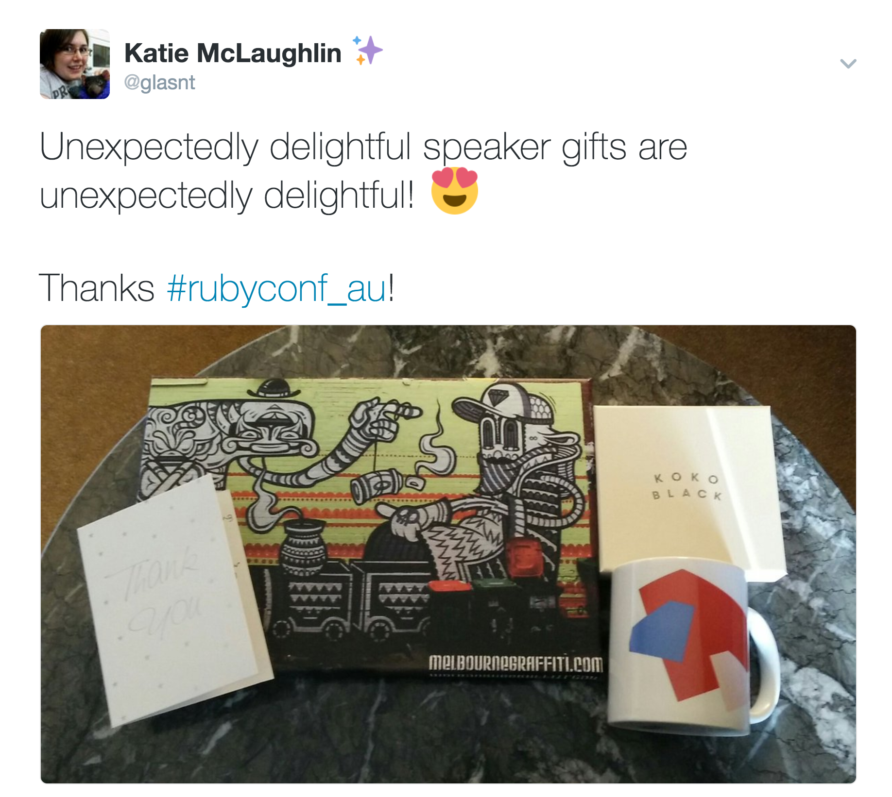

# &nbsp;
#  +  =>  <!-- .slide: class="center" -->

 

Note: t/down | g/koala | t/sparkles
---

 

 <!-- .slide: class="center" -->

Note: Hi! I'm Katie. You may know me as 'glasnt' or That Emoji Girl
---

 

 <!-- .slide: class="center" -->
Note: 

I've been doing this talk about the place called

---
## The Power and Responsibility <!-- .slide: class="center" -->
##of Unicode Adoption <!-- .slide: class="center" -->
Note: 
"The power and responsibility of UNicode adoption"

I first gave it at this very meetup in March last year.

I know right? It sounds like a proper technical talk, but it's actually me just yelling about emoji and stuff

Thing is, that's not the name
---

## The Power  and Responsibility  <!-- .slide: class="center" -->
## of Unicode Adoption  <!-- .slide: class="center" -->

Note: this is the name. it has emoji in the title

This has caused me all *sorts* of fun when trying to propose and present at conferences

---

 

Note: For example, some conferences can't get the name right, even when it's been entered into their system

---

 

Note: Some like some characters, but not others

I had to resubmit this one and remove specific characters

---
 

Note: Some won't allow emoji in the talk title, but will in the description (sadface)

---

 

Note: Some just get a little bit corrupted (kiwicon)
---
 
Note: but sometimes it works!

... on the website
---
 
Note: but not on the printed schedule
---

 
Note: or on the AV notes.

Side note, it's REALLY fun when the person introducing you on stage reads that verbatim

---

 

Note: when you have broken unicode in the middle of glossy printed programs, that's fun

---

 

Note: but it's not too bad when the schedule poster on the wall just leave them out
---

 
 
Note: because they can be corrected

---

 
Note: But the best part is when the digital boards work

Because I can tell you exactly what operating system this is running. Windows 8

---
# &nbsp;
 

Note: This is the emoji
---
 

Note: 

Different vendors have implemented emoji differently. In this case, the 'sweat drop' face is the most easily recognisable as windows, because it looks like a face with boils all over it or something

(picture of different sweat)

Based on this, we can guess the operating system, down to the version, using just the emoji being displayed.

---

 

 <!-- .slide: class="center" -->

Note: but then sometimes things break completely.

---

 

Note: Take this signage, from RubyConf just last week in Melbourne
---
 

Note: https://twitter.com/robjacoby/status/829474149143769088
Rob Jacoby, twitter

This is what the sign was showing.

---
 
Note: So what's this gibberish?
---
## &nbsp;
## &nbsp;
# `ud83dude0dnn`
---
## &nbsp;
## &nbsp;
# `\ud83d\ude0dnn`
---
## &nbsp;
## &nbsp;
# `\ud83d \ude0d nn`
---
## &nbsp;
## &nbsp;
# `\u1F60D nn`
---

## &nbsp;
## &nbsp;
#  `nn`
---

 
Note: Thanks Rob
---

 

 <!-- .slide: class="center" -->

Note: 

But this is a hacker conf, that's not that interesting

What if we could hack with emoji.

Is it possible?

Well, it depends on your definition of hacking, and emoji

---

 

Note: 
These are not emoji

So if, for example, you were to say download an executable claiming to give you an emoji pack for your favourite chat client, that's not hacking. That's you downloading a random executable and getting what's coming to you

What's also not hacking, well, technically, is a Denial of Service attack that was recently fixed by apple.
---

 

 <!-- .slide: class="center" -->

---
 

 <!-- .slide: class="center" -->
Note: Who is familiar with the Pride Flag emoji that was just added?
---

 

 <!-- .slide: class="center" -->
Note: it's comprised of two existing emoji, the white flag and the rainbow, but with a special character

a Zero Width joiner, between them

You don't normally see this because in your flag picker, you see the end result.

However 

---
 

 <!-- .slide: class="center" -->

<a href="http://thehackernews.com/2017/01/crash-iphone-emoji.html">You Can Crash Anyone's iPhone or iPad With A Simple Emoji Text Message (2017)</a>
Note: There was a bug where if you sent the two emoji with a number between them, the device would get really confused, and not know what to do
---

 

<a href="https://www.kazoosoft.eu/wp-content/uploads/2015/05/Iphone6Bug2015.jpeg">jazoosoft.eu</a>
Note: so it would crash

this isn't the firts time a bug like this has happened
---
 

<a href="http://s.wsj.net/public/resources/images/BN-IP966_IMESSA_G_20150527143121.jpg">wsj.net</a>

Note: This has happened before in what's known as the effective power bug
---

<pre style="font-size: 60px"><code>
effective. 
Power 
لُلُصّبُلُلصّبُررً ॣ ॣh ॣ ॣ
冗 
</code></pre> 
<a href="https://www.youtube.com/watch?v=hJLMSllzoLA">The Effective Power Bug (2015)</a>
Note: how this worked is that the words 'effective power' had no meaning, but the text after it, that's displaying weirdly here, would set it off

When this text appeared in a notification popup, the truncation of that message would happen part way in the stuff on the third line, and the phone would get confused and restart

but that's not hacking.
---

 

 <!-- .slide: class="center" -->

---

---
 

 <!-- .slide: class="center" -->
---
 

 <!-- .slide: class="center" -->
### `http://xn--9q9h.ws`
Note: that's the domain, but the path...
---

# `?utf8=✓` <!-- .slide: class="center" -->
---
### `google.com``/test/عربي.امارات` <!-- .slide: class="center" -->
<a href="http://www.rafayhackingarticles.net/2016/08/google-chrome-firefox-address-bar.html">Google Chrome, Firefox Address Bar Spoofing Vulnerability</a>

Note: RTL
---
###`عربي.امارات/google.com``/test` <!-- .slide: class="center" -->
<a href="http://www.rafayhackingarticles.net/2016/08/google-chrome-firefox-address-bar.html">Google Chrome, Firefox Address Bar Spoofing Vulnerability</a>
---
 

 <!-- .slide: class="center" -->

<a href="https://poststatus.com/the-trojan-emoji/">Anatomy of a Critical Security Bug</a>
Note: What is hacking is this wonderful incident I found involving mysql, not-strict tables, and wordpress

With literally a bug that could set the world on fire

---

## `STRICT_ALL_TABLES` <!-- .slide: class="center" -->

Note: This could have all been avoided if STRICT TABLES had been enabled for wordpress

Wordpress core used some of the ... more interesting features of mysql, so they couldn't enable this, and this is why everthing was a fire

---

 

 <!-- .slide: class="center" -->

Note: This character could break everything.
---

 

 <!-- .slide: class="center" -->

Note: But not this one.

---
 

 <!-- .slide: class="center" -->
## &nbsp;

Note: YOu see, these are two different smiles
---
 

 <!-- .slide: class="center" -->
## &nbsp; &nbsp; `U+263A`&nbsp; &nbsp; &nbsp; &nbsp; &nbsp; &nbsp; `U+1F642`

Note: one dates back to Unicode 1.1, in 1991, and the latter is a newer emoji.

Hence why the one of the left has a smaller unicode code point
---
 

 <!-- .slide: class="center" -->
## &nbsp; &nbsp; `E2·98·BA` &nbsp; &nbsp; `F0·9F·98·8A`
Note: 
The emoji the right uses four bytes

And there's a small issue in mysql when strict tables is turned off. If you try and insert an emoji it'll... truncate.

---

## `<q cite="Smile` `">` <!-- .slide: class="center" -->
## `Be Happy</q>`

Note: So, say if you have a Wordpress blog that allows comments, and citations, and you have something like this, which would pass javascript validation because it's a complete tag

But because Mysql...
---

## `<q cite="Smile` &nbsp;&nbsp; &nbsp; &nbsp; . <!-- .slide: class="center" -->
## &nbsp;

Note: It'd drop about here
---

## `script src="hax.ohno">` <!-- .slide: class="center" -->

Note: which means that if your NEXT comment happens to be something like this

because that's not a script tag, there's no opening angle bracket

---
## `<q cite="Smile` <!-- .slide: class="center" -->
## `...` <!-- .slide: class="center" -->
## `script src="hax.ohno">` <!-- .slide: class="center" -->
Note: you'd end up with a very large quote tag, that had a script attribute

sad trombone.

---

 

 <!-- .slide: class="center" -->

---

# `CVE-2015-3438` <!-- .slide: class="center" -->
Note: So that's CVE 2015 3 4 3 8

It's been patched as of WordPress 4.2, so please PATCH YOUR THINGS
Wordpress 4.2 introduced emoji natively into the system... and also removed a small issue with it breaking everything

but you get new emoji! you should update your things!
---
# MySQL <!-- .slide: class="center" -->
## `STRICT_ALL_TABLES` <!-- .slide: class="center" -->
Note: also, make sure you enable strict tables, because yowsa.

---

 

 <!-- .slide: class="center" -->

Note: this probably isn't the only thing out there, but it's something to watch out for

---
 

 <!-- .slide: class="center" -->

### glasnt.com/talks