# &nbsp;
All Contributions Welcome
## CLS 2017
 

Note: These are my speaker notes.

There are many like them, but these ones are mine
---

# Hi! <!-- .slide: class="center" -->

---
 

 <!-- .slide: class="center" -->

Note: 
We do a lot of stuff in FOSS

languages, operating systems, websutes packages

entire ecosystems
---

 

 <!-- .slide: class="center" -->

Note: But how do we track all these contributions that we make

---

 

  <!-- .slide: class="center" -->

Note: GitHub gives us some of this functionality

Pretty graphs and the like

---

 

  <!-- .slide: class="center" -->

Note: but it's not exactly perfect

And it only include itself

There are other ways - project specific, etc

---

 

 <!-- .slide: class="center" -->

Note: But what about everything else?

personally, papers ctte, councils, conferences

Code Review / Documentation

Testing / Design

Promotion 

User Groups / Presentations

conferences 

---

 

 <!-- .slide: class="center" -->

Note: Who here:

Used the code

Taught 

Spoken 

Attended 

---

 

 <!-- .slide: class="center" -->

Note: These are all contributions

Not even including all the aspects of the SDLC that go unattributed

Community, yo

---

 

 <!-- .slide: class="center" -->

Note: So, how can we track and record and acknowledge all this?

---

 

Note: Let me tell you about Leslie

Amazing human being

---

# #LABHR <!-- .slide: class="center" -->
## bit.do/LABHR

Note: She started this hashtag, and wrote a blog post about it

---

 

#LABHR
Note: So Leslie + Blog = 5 steps

---

 

#LABHR
Note: write the list

---

 

#LABHR
Note: send the list

---

 

#LABHR
Note: GRAVY

Tweet about it

---

 

#LABHR
Note: GRAVY #2

Linked in Recommendations

NOT endorsements

See later

---

 

#LABHR

Note: GRAVY #3

Do it for someone not like you

if you're a coder, for your QA

mentors to mentees

---

 

#LABHR
Note: Simple! Nice! Helpful!

---

 

Note: So, how can you do this in the real world

---

# How to be nice <!-- .slide: class="center" -->
## [demo] <!-- .slide: class="center" -->

Note: Live demo, lets hope this works

Hat Rack
---

# How to say thank you <!-- .slide: class="center" -->
## [demo] <!-- .slide: class="center" -->

Note: 
Squees and blushes

---
# How not to react <!-- .slide: class="center" -->
## &nbsp; <!-- .slide: class="center" -->

Note: 

---
# Why can't we take a compliment? <!-- .slide: class="center" -->

---

# Minimisation <!-- .slide: class="center" -->

Note: Antonym of exaggeration

"She'll be right, no worries"

Understating 

---
# Tall Poppy Syndrome <!-- .slide: class="center" -->

Note: We are reluctant to allow ourselves to be elevated in front of our peers, lest we be cut down.

And of course, everyone's favourite

---

# Imposter Syndrome <!-- .slide: class="center" -->

Note: If we get thanked, we tend not to think it actually applies, because all the problems

---

# Acknowledging our local wonders <!-- .slide: class="center" -->

Note: We are amazing. We are splendid. We need to ack that.

The fact that I didn't know half of these existed is a problem in itself.

---

 
## Open Source Awards <!-- .slide: class="center" -->
Note: Including both Leslie and Deb

Jessica McKeller

Sarah Sharp

Vicky Brasseur

Ricky Endlsey -- Open Source.com

---

 

<a href="https://en.wikipedia.org/wiki/Linux_Australia#/media/File:The_Rusty_Wrench_at_Coogee_Beach,_Feb_2013.jpg">CC BY-SA 3.0</a>

Note: Linux Australia award

Previous winners

Pia Waugh

Donna Benjimin - Drupal

2015 - Steve Walsh - NOC extraordinare

2017 - Michael Davies and Michael Still, Paper's Chairs for LCA for a decade
---

# Acknowledging within a project <!-- .slide: class="center" -->

Note: You don't have to have a grand award, but you can do something small for people

---

 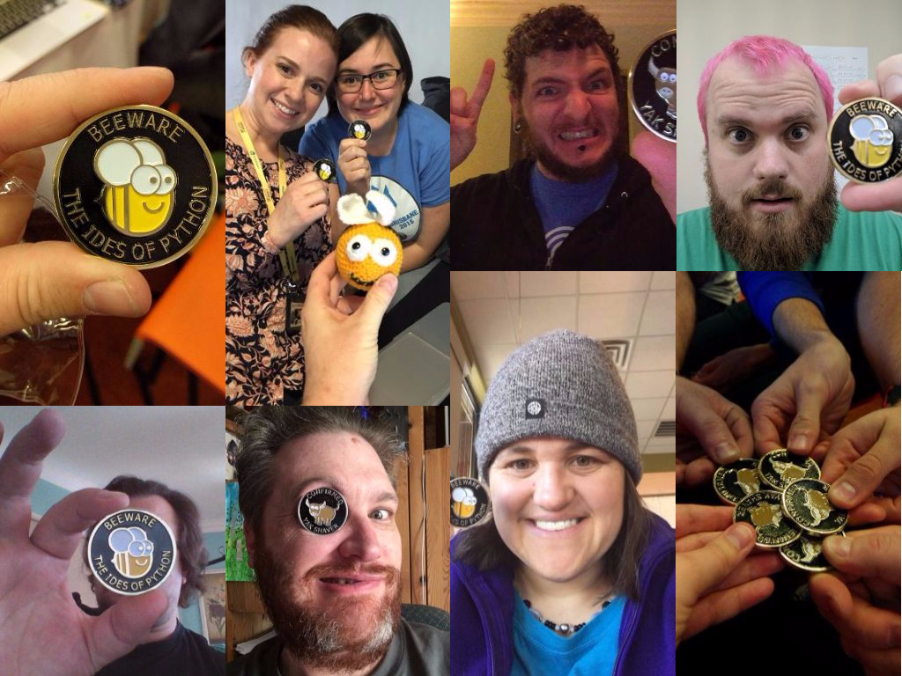

Note: The beeware project has a Challenge coin that you get when you contribute to the project

Any contribution, it doesn't have to be code.
---

# Acknowledging the little things <!-- .slide: class="center" -->
Note: you don't have to win an award to be awesome
---

 
## &nbsp; <!-- .slide: data-background="#f64747" data-background-transition="none" -->

Note: djangocon europe

happiness packets. io

A nice little message

and privacy settings to share or not share
---

# Acknowledging our *own* achievements <!-- .slide: class="center" -->

Note: one way to break this is to start to acknowledge our own achievements

---
 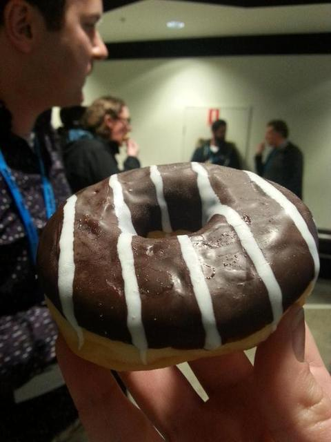

Note: Lara Hogan, Donut Manifesto

This donut = draft of a book

Giving ourselves a little celebration if noone else will

Tweeting the donut

Piggybacking on a picture of a donut (instagram makes this OK).

I like the idea of donuts. This is one I did the other day.

I'm not trying to be self-gratifying, but sometimes, you need to do that.

---

# But why say thank you? <!-- .slide: class="center" -->

Note: Apart from it being a nice thing todo.

---

# It's nice thing to do <!-- .slide: class="center" -->

Note: Not getting acknowedgement sucks

Burnout 

Plight of the organiser
---

# Encourage continued engagement <!-- .slide: class="center" -->

Note: They have done a thing once, they will do it again.

Charelle's story from Compcon - first commit, hand held from Russell
---

# Change self image <!-- .slide: class="center" -->

Note: 
it makes them feel valued

self image change, they feel included in the project, and it makes them feel good

but it also binds their fate to yours

if your project fails, it reflects badly on them, because they are now involed in your project

---

 

 <!-- .slide: class="center" -->

Note: But just how can we say thank you

---

# Communication within your project <!-- .slide: class="center" -->

Note: Mentioning things in your release notes is a good thing. MediaGolbin does this

Drupal concatenates thread commentors into git commit message

But the scope of this communication is only within your existing community.

You need to extend to more general communications
---
# Communication &ast;outside&ast; your project <!-- .slide: class="center" -->

---
# Give your helpers something to show for their work <!-- .slide: class="center" -->

---
 

Note: This is the new age resume. Publically accessible. We can thank people who would otherwise be unrecognised

LinkedIn is pretty awful though.

---

# Recommendations vs Endorsements <!-- .slide: class="center" -->

Note: Two main ways to add content to someone's linkedin profile

---
# Recommendations <!-- .slide: class="center" -->

---

 

Note: But here are the only ones that are able to be recommendable

---

 

Note: Running a conf, volenteering as a thing, is **experience**

LIST IT AS SUCH

---

# Endorsements <!-- .slide: class="center" -->
## ... <!-- .element: class="fragment" -->

---
# &nbsp;
 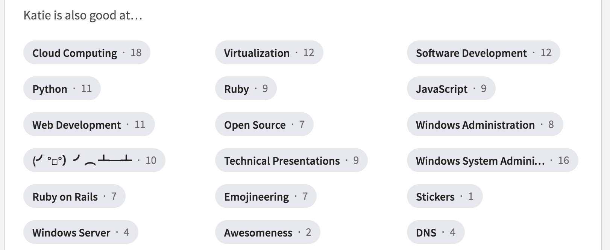
---

To: Paul "pjf" Fenwick From: Weston Fillman, Google  

<i>I'd love to find the right fit for you within Google, given your experience in Nyan Cat costumes, system architecture, Perl, and talking like a pirate. </i>
 

<a href="https://twitter.com/pjf/status/730215052750381056">@pjf, twitter</a>

---

 

---
# User Contributions <!-- .slide: class="center" -->

---

 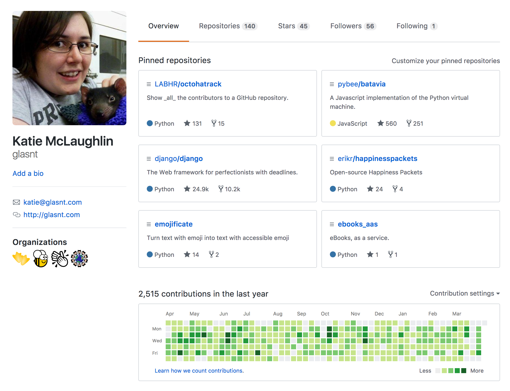

Note: this is the current github profile page. It's been vastly improved in the last few years
---
 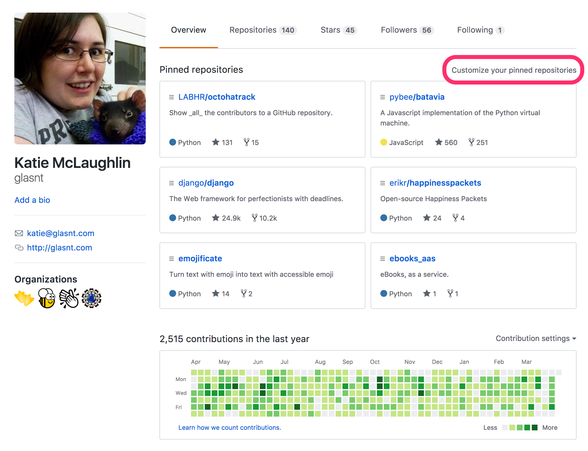

Note: you can now edit what repos show up, which is seeded from a list of anything
you've contributed to, even if it's just raised an issue, which is wonderful

---
 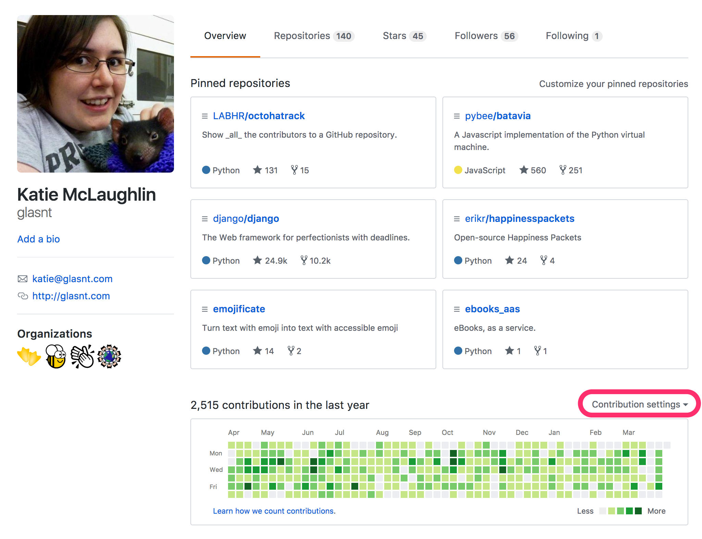
Note: you can also alter if you want your private contribution counts to show up on your graph
---
 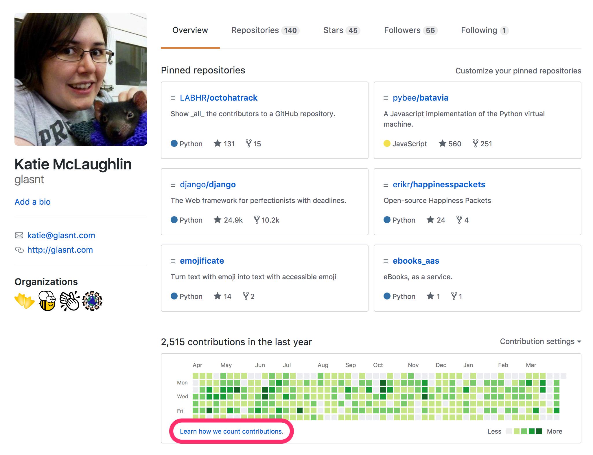
Note: but what is in that graph
---

# What counts? <!-- .slide: class="center" -->
## Commits* <!-- .element: class="fragment" -->
## Issues&#42; and Pull Requests&#42; <!-- .element: class="fragment" -->

Note: 

Issues created by you

Pull requests created or closed by you

commits to master by you

forks dont count

comments don't count

has to be linked to email

wiki contribs don't count

---

# Sound too hard? <!-- .slide: class="center" -->

---
 
<pre style='margin-bottom:0px;margin-top:0px'><code style="font: 'monospace' 150%">$ pip install rockstar</code></pre>

 
<pre style='margin-bottom:0px;margin-top:0px'><code style="font: 'monospace' 150%">$ rockstar</code></pre>
 <!-- .element: class="fragment" -->

  <!-- .element: class="fragment" -->

Note: Because creating a new repo and backdating a bunch of commits is a thing
you can do to fake your profile

---
# Project Contributions <!-- .slide: class="center" -->

---

 

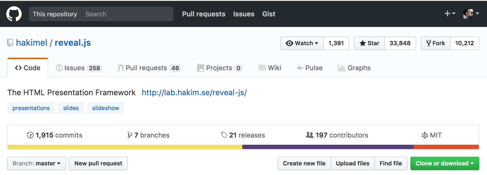

  <!-- .slide: class="center" -->

Note: Looking at any github project page we can see all the contributors right?

---
 

  <!-- .slide: class="center" -->

Note: ttere's a button right at the top and everything

---

 

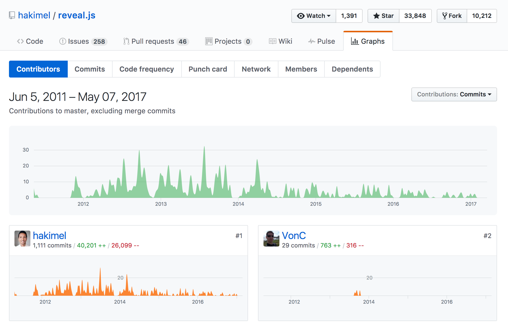

  <!-- .slide: class="center" -->

Note: But if we click it, then we don't actually get the contributors

We get the top ones, with a graph, ranked by lines of code

---
 

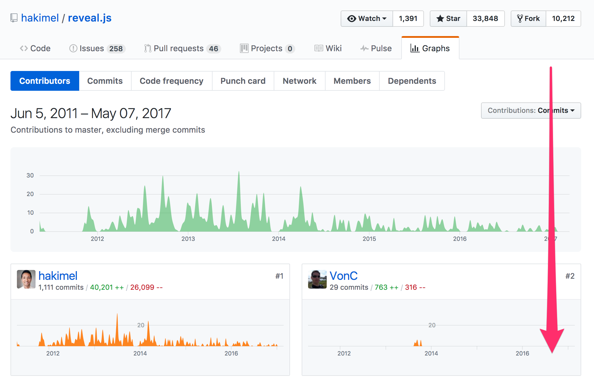

  <!-- .slide: class="center" -->
---
 

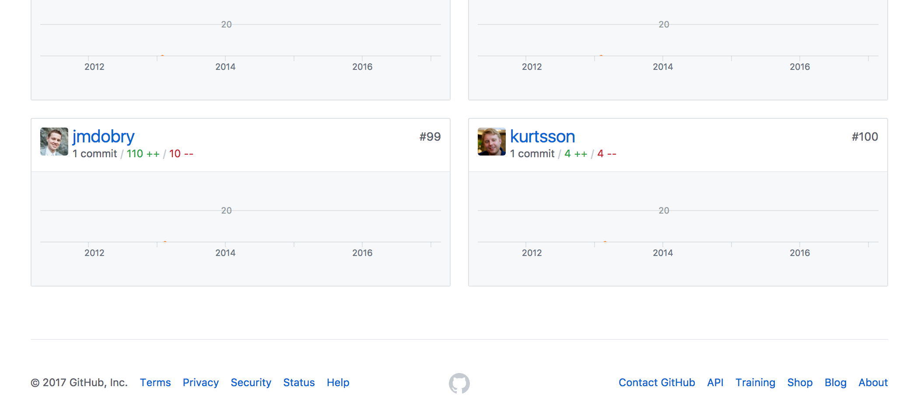

  <!-- .slide: class="center" -->
---
 

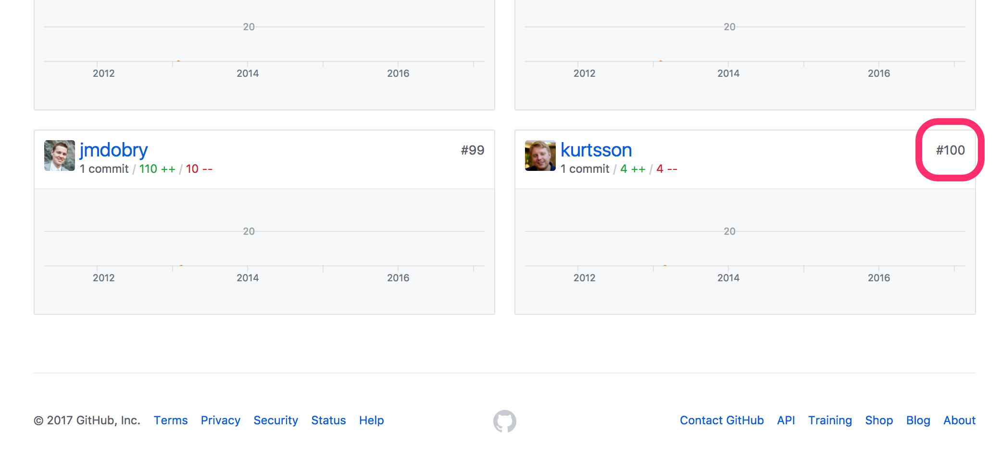

  <!-- .slide: class="center" -->

Note: And it's only the top 100

---

# This is only some of the contributors <!-- .slide: class="center" -->
Note: Not even all the code commiters are listed!
---
# This is only some of the contributions <!-- .slide: class="center" -->
Note: What about everything else

---

# What about everything else? <!-- .slide: class="center" -->
---
## Logged Issues <!-- .slide: class="center" -->
## Unmerged Pull Requests <!-- .element: class="fragment" -->
## Code Reviews <!-- .element: class="fragment" -->
## Feature Discussions <!-- .element: class="fragment" -->
## Feature Voting <!-- .element: class="fragment" -->
## Wiki editing <!-- .element: class="fragment" -->

---
 

 <!-- .slide: class="center" -->

Note: But how can you find who in your project community to give props to?

The customisation of the github profile may not exist, but the data for who could be given props does

---
## github.com/LABHR/octohatrack <!-- .slide: class="center" -->
## <code>pip install octohatrack</code>

Note: introducing octohatrack
---

## All GitHub 'contributors'
# Plus: <!-- .element: class="fragment" -->
## All Issue Creators & Commenters <!-- .element: class="fragment" -->
## All PR Creators & Commenters <!-- .element: class="fragment" -->
## All Wiki editors <!-- .element: class="fragment" -->
## Custom CONTRIBUTORS <!-- .element: class="fragment" -->

---

# hakimel/reveal.js <!-- .slide: class="center" -->
## GitHub Contributors: 197 <!-- .element: class="fragment" -->
## All Contributors: 1741 <!-- .element: class="fragment" -->

---

# kennethreitz/requests <!-- .slide: class="center" -->
## GitHub Contributors: 457 <!-- .element: class="fragment" -->
## All Contributors: 2255+ <!-- .element: class="fragment" -->

Note: 
including at least 3 unique wiki contributors

Python HTTP Requests for Humans

---

# avinassh/rockstar <!-- .slide: class="center" -->
## GitHub Contributors: 35 <!-- .element: class="fragment" -->
## All Contributors: 83 <!-- .element: class="fragment" -->

---

# LABHR/octohatrack <!-- .slide: class="center" -->
## GitHub Contributors: 10 <!-- .element: class="fragment" -->
## All Contributors: 27 <!-- .element: class="fragment" -->

Note: So many conversions!

---

# TL;DR: <!-- .slide: class="center" -->
## You're awesome :) <!-- .element: class="fragment" -->

Note: Thank people that have already done so much

Encourge them to do more

Do more you self

---

  
# #LABHR <!-- .slide: class="center" -->
## labhr.github.io
  

Contributors to this talk:
  
 Donna&nbsp;Benjamin, Nick&nbsp;Coghlan, Ben&nbsp;Dechrai, Tom&nbsp;Eastman, Paul&nbsp;Fenwick, Leslie&nbsp;Hawthorn, Lara&nbsp;Hogan, Lindsay&nbsp;Holmwood, Russell&nbsp;Keith-Magee, Anna&nbsp;Ossowski, Deb&nbsp;Nicholson, Christopher&nbsp;Neugebauer, Jack&nbsp;Skinner, Josh&nbsp;Simmons, Lee&nbsp;Symes
  
  
Thank You <3
