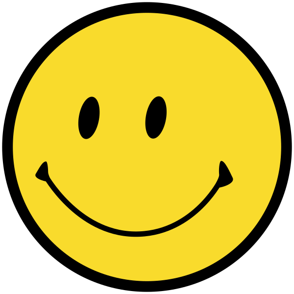

background-image: url(images/test-pattern.png)

???

---

class: title

# Lightning Talk Karaoke
## Give a talk, but use someone else's slides

???

This should be fun

---

class: title 

# Emoji Archaeology 101
## Originally by Dr Russell Keith-Magee

???

Good morning/afternoon, class. I'm substituting for Dr Magee today. Sadly, he's come down with a bad case of yakshaving. 

This is Emoji Archaeology 101.

---

class: screenshot

???

In 1963, the human emotion of happiness was created.

It was created by the American Harvey Ross Ball, who was employed to create an image of a happy face to raise the morale of the employees at an insurance company.

But once people realized that it was possible to express emotions, they wanted to express emotions of their own.

---

class: screenshot

???

In a New York Times interview in April 1969, Vladimir Nabokov said "I often think there should exist a special typographical sign for a smile – some sort of concave mark, a supine round bracket."

---
class:title emoticon

# 0x3A
# 0x2D
# 0x29

???

In 1982 Scott Fahlmann had a breakthrough, when he proposed the composition of three ASCII characters as a trigraph to express an emotion - happiness.

---
class:title emoticon

# :
# -
# )

???

Although these code points don't, in themselves, represent any emotional context, if composed horizontally

---
class:title emoticon

# :-)

???

they combine to produce a powerful expression which the user can comprehend by simply turning ones head 90 degress to the left

1:00

---
class:title emoticon

# 0x3A :
# 0x2D -
# 0x29 )

???

While happiness does have significant utility as an emotion, users felt it was not meeting all their needs.

---
class:title emoticon

# 0x3A :
# 0x2D -
# **0x28 (**

???

However, by replacing the third codepoint

---
class:title emoticon

# :-(

???

the much more functional emotion of "unhappiness" could be expressed. This, ironically, led to much higher levels of happiness, because users were now able to voice displeasure at everyone who disagreed with them.

Thus began a precambrian explosion in the expression of emotion, as users realized the hidden potential of the US ASCII codepoint set.

The first changes were simple issues of ergonomics.

---
class:title emoticon

# (-:

???

By reversing the codepoint order, it was possible to evenly spread the physical exertion required to observe emotion.

More sophisticated extensions were then added

---
class:title emoticon

# B‑)

???

such as adornment - wearing glasses

---
class:title emoticon

# %‑)

???

And a optical tiredness from staring deep into the ASCII code chart looking for emotional inspiration.

---
class:title emoticon

# :‑D

???

There was also a move to represent more extreme emotions - such as extreme happiness.

2:00

---
class:title emoticon

# >:-(

???

Some expressions of extremis couldn't be embedded into three glyphs - they required the introduction of a fourth glyph, to demonstrate scorn,

---
class:title emoticon

# :'-(

???

or to embody a single tear, rolling down the face.

---
class:title emoticon

# :')

???

Some purists felt that the three codepoint limit should be retained; and so they compressed complex emotions by losing the fidelity of nasal expression.

---
class:title emoticon

# ~(_8^(I)

???

Others freed themselves of n-ary constraints, allowing for the rendition of, say, the absurdist philosopher Homer Simpson

---
class:title emoticon

# *<|:‑)

???

or beneficent midwinter courier, Santa Claus.

---
class:title emoticon

# o_o

???

Others revisited the premise that emotions had to be expressed horizontally, and looked to the perpendicular as a presentation style.

---
class:title emoticon

# @_@
# \*_\*
# (=_=)

???

However, the US ASCII code set was reaching it's limit at this point.

---
class:title emoticon

# ^ω^

???

This led to the introduction of UNICODE, providing vastly more alternatives with which to construct even deeper expressions of emotion.

---
class:title emoticon

# (◠‿◠*)
# ヽ(`Д´)ﾉ
# ಠ_ಠ

???

It is not clear from the literature that *any* of these glyphs are actually used in their languages of origin.

---
class: title emoticon flip

# (ノಠ益ಠ)ノ彡┻━┻

???

The schism between minimalists and maximalists in the expression of emotion reached it's zenith in this pair of expressions:

11 character "table flip" as an ultimate expression of anger, and

---
class: title emoticon

# ツ

???

a single katakana character, as an expression of simple happiness.

Unfortunately, pressure was placed upon the UNICODE consortium to allow more literal expressions of emotion.

---
class: title emoji

# ☻

???

This started with simple renditions, but over time,

---
class: title emoji

# 😀

???

these expressions became more and more literal,

---
class: title emoji

# 😘

???

removing all subtlety

---
class: title emoji

# 😜

???

and nuance

---
class: title emoji

# 🤔

???

and indeed beauty, from the process of emotional expression...

---
class: title emoji

# 💩

???

... perhaps best demonstrated by the introduction of the "pile of poo" symbol, allowing scatological references without the need to understand what scatalogical means.

3:40

---
class:title

# Agency

???

This has been accompanied by a loss of agency.

In the past, users could disruptively innovate and develop their own emotions.

But like some sort of Big Brother, only those emotions approved by the Unicode Consortium may be expressed.

It doesn't matter if you like Manhattans - the Consortium, the savage arbiter of the Sapir-Whorf hypothesis, has determined that you shall not express that idea.

And no longer may we compose symbols to create rich new emotions. Only those compositions approved by The Consortium are permitted.

---
class: title emoji

# )

???

The modern emoji represents a significant loss to our collective culture. The ability to embody happiness in the 8 bits of storage needed to display a right bracket - this... THIS is the essence of the human condition. This is who we are. We are not stardust. We are not the champions. We are not a number. We are emotions, trapped in a brittle corporeal manifestation.

---
class: title

# What to do?

???

So what are we to do? Some might call for emoji to be eliminated. To be struck from our collective history.

But that is defeat. We should fight for our emotions.

---
class: title

# Rise up!

???

So Rise up, my children! Smash the control emoji! Smash the control machine! We have nothing to lose but our chains! Don't be constrained by the limits placed on you by the Consortium. Compose new emotions, and express them - express them deeply, and longingly, and outwardly.

---
class: title

# Class dismissed.

???

And before someone asks -

---
class: title

# This WILL be on the exam

???

yes, this *will* be on the exam.
