## &nbsp; <!-- .slide: class="center" -->
# Snek in the Browser <!-- .slide: class="center" -->
## SyPy April 2017
 

Note: 

Breathe. You got dis.
---

 

 <!-- .slide: class="center" -->

Note: 
Hi! I'm Katie, and this is Snek in the Browser. We're going to be diving into some
content in this talk that might be a bit daunting at first, but trust me, we'll get there.

And like any good talk, we should start with some definitions

Let's kick off with the most important definition of all

---
# What is 'snek'? <!-- .slide: class="center" -->

Note: 

What is 'snek'? According to the most reliable source of information on the internet, Tumblr..
---

 

Note: 

A snek is comprised of a dangernoodle, with a snoot for booping. snek is very cute

---

 

  <!-- .slide: class="center" -->

Note: 

more conventionally, snek is also pronounced "snake", of which Python is an instance.

More more importantly,

---

# What is Python? <!-- .slide: class="center" -->

Note: 

What _is_ Python?

Now, this might be tricky one. Python itself isn't a language. It's a language specification

What you're used to when you type `python` into a terminal and get a nice little interactive
program to play with is, probably, CPython. i

---

# What is CPython? <!-- .slide: class="center" -->

Note: 

What is CPython?

This is the most common implementation of the Python language specification

---
<pre class="cli"><code>$ cat snek.py
def snek():
&nbsp; &nbsp; print("")

if __name__ == "__main__":
&nbsp; &nbsp; snek()
</code></pre> 

Note: 

Say you have a file called snek.py

All it does it print an emoji snek

---

<pre class="cli"><code>$ python snek.py

</code></pre> 

Note: we can execute this file by asking python to run it.

And then we get our snek

But we have more ways to execute this code

---

<pre class="cli"><code>$ python
Python 3.5.1
>>> import snek
>>> snek.snek()
</code></pre>

Note: we could also use the interactive python interface

and ask it to import the snek file for us

which gives us snek
---

<pre class="cli"><code>$ cd &#95;&#95;pycache&#95;&#95;
$ cat snek.cpython-35.pyc
</code></pre> 
Note: after we do that, we see a new folder that's turned up in our file system

it has a file in it that's got the extension pyc instead of just py
---

<pre class="cli"><code>$ cd &#95;&#95;pycache&#95;&#95;
$ cat snek.cpython-35.pyc

�sYE�@s#dd�Zedkre�dS)cCstd�dS)Nu
)�print�rr�tmp/snek.py�sneks 
r&lowbar;&lowbar;main&lowbar;&lowbar;N)r&lowbar;&lowbar;name&lowbar;&lowbar;rrrr<module>s 
</code></pre> 
Note: but it looks to be full of a little bit of jibberish

---

<pre class="cli"><code>$ python
Python 3.5.1
>>> def snek():
>>> &nbsp; &nbsp; print("")
</code></pre> 

Note: However, it's not gibberish to the python intepreter. It knows how to read this compiled content

If we run python, define our function
---

<pre class="cli"><code>$ python
Python 3.5.1
>>> def snek():
>>> &nbsp; &nbsp; print("")
>>> import dis
>>> dis.dis(snek)
</code></pre> 

Note: but then import a module called 'dis'

and ask it to dis this snek

---

<pre class="cli" style="margin-left: -20px"><code>
&nbsp; 2&nbsp; 0 LOAD_GLOBAL&nbsp; &nbsp; 0 (print)
&nbsp; &nbsp; &nbsp;3 LOAD_CONST&nbsp; &nbsp; &nbsp;1 ('')
&nbsp; &nbsp; &nbsp;6 CALL_FUNCTION&nbsp; 1
&nbsp; &nbsp; &nbsp; &nbsp; &nbsp; &nbsp; (1 positional, 0 keyword pair)
&nbsp; &nbsp; &nbsp;9 POP_TOP
&nbsp; &nbsp; 10 LOAD_CONST&nbsp; &nbsp; &nbsp;0 (None)
&nbsp; &nbsp; 13 RETURN_VALUE
</code></pre> 

Note: and you get this.

The module 'dis' that we used, that's short for "disassembler"

And what you're seeing here, is raw Cpython byteocde.

You can pretty much read here what's going onn directly.

Load a global, load a constact, call a function.

Thank goodness we have nicer syntax to use!

---

# That's snek <!-- .slide: class="center" -->

Note: So that's the 'snek'. A language that we know and love, that's really just a nice wrapper around building blocks

---

# But who is browser? <!-- .slide: class="center" -->

Note: 

But what about the browser?

---

 

  <!-- .slide: class="center" -->

Note: when I say browser, I mean one of the many application use use to
surf the information superhighway, also known as the internet. You may
have heard of it.

---

 

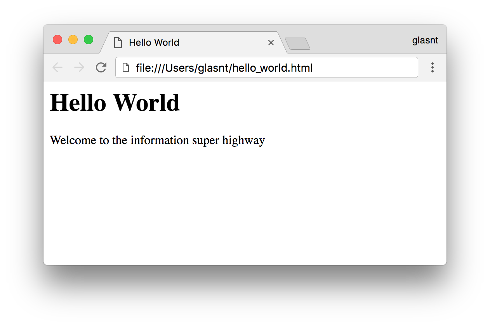

  <!-- .slide: class="center" -->

Note: This is a browser window. We have an address bar, which shows where we are. We have a window, which shows some content.

---

 

  <!-- .slide: class="center" -->
Note: this is made using HTML.

HTML, or Hypertext Markup Language, is what gives the information super highway it's look and feel

---

<pre class="cli"><code>&lt;html>
&nbsp; &lt;title>Hello World&lt;/title>
&nbsp; &lt;body>
&nbsp; &nbsp; &lt;h1>Hello World&lt;/h1>
&nbsp; &nbsp; &lt;p>
&nbsp; &nbsp; &nbsp; Welcome to the information
&nbsp; &nbsp; &nbsp; super highway
&nbsp; &nbsp; &lt;/p>
&nbsp; &lt;/body>
&lt;/html> 
</code></pre> 
Note: using a combination of markup tags we can make a structure on a page that is then rendered in a browser

---

 

Note: We can also use CSS -- Cascading Style Sheets -- to take our browser from it's drab, but functional state

---

 

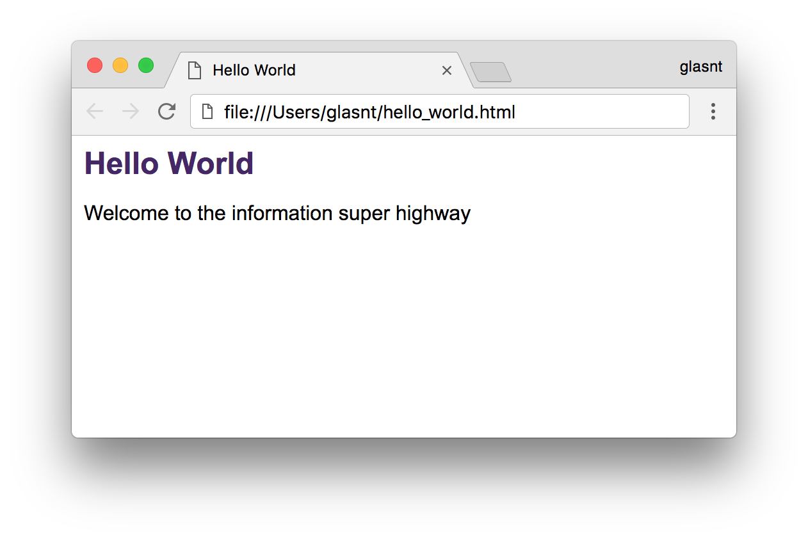

  <!-- .slide: class="center" -->

Note: into something that looks a little bit nicer

---
<pre class="cli"><code>&lt;html>
&nbsp; &lt;head>
&nbsp; &nbsp; &lt;link href="style.css"
&nbsp; &nbsp; &nbsp; &nbsp; &nbsp; rel="stylesheet">
&nbsp; &lt;/head>
&nbsp; ...
&lt;/html> 
Note: 
This is done by importing a stylesheet into the page

---
<pre class="cli"><code>
body {
&nbsp; font-family: "Arial";
} 
h1 {
&nbsp; color: #452768;
&nbsp; font-size: 24px;
} 
</code></pre> 
Note: And that stylesheet tells certain parts of the page how to display.
---

 

Note: We can extend our HTML to include a form, that will allow us to surf the internets

Well, not actually. What we're doing here is enabling us to send information from the client front-end to the serer bakend.

---

<pre class="cli" ><code>&lt;form>
&nbsp; &lt;label>Username: &lt;/label>
&nbsp; &lt;input type="text"
&nbsp; &nbsp; &nbsp; &nbsp;&nbsp; id="username">
&nbsp;&lt;button>Surf!&lt;/button> 
&lt;/form> 
</code></pre> 

Note: This is what that little bit we've added looks like. There's a label, a form input element, and a button
---

 

  <!-- .slide: class="center" -->

Note: So we want to validate our form

We want to ensure the username is valid

The actual validation rules here we'll use aren't best practice, but I'm using them to demonstrate a point.
---

 

  <!-- .slide: class="center" -->

Note: Serverside, we want to use Python
---

<pre class="cli"><code>def valid_username(un):
&nbsp; 
&nbsp; 
&nbsp; 
&nbsp; 
&nbsp; 
&nbsp; 
&nbsp; 
</code></pre> 
Note: So we declare a method in our server-side python API to validate a username is valid
---
<pre class="cli"><code>def valid_username(un):
&nbsp; usr = un
&nbsp; 
&nbsp; 
&nbsp; 
&nbsp; 
&nbsp; 
&nbsp; 
</code></pre> 
Note: One way to do this, is to take a copy of the username object

---
<pre class="cli"><code>def valid_username(un):
&nbsp; usr = un
&nbsp; 
&nbsp; 
&nbsp; if usr != un:
&nbsp; &nbsp; return False
&nbsp; 
&nbsp; return True
</code></pre> 
Note: and then after out maipulations, if they match, return True

---
<pre class="cli"><code>def valid_username(un):
&nbsp; usr = un.lower()
&nbsp; 
&nbsp; 
&nbsp; if usr != un:
&nbsp; &nbsp; return False
&nbsp; 
&nbsp; return True
</code></pre> 
Note: For example, allowing usernames that are idential apart from case is bad, so we should
only allow lowercase usernames to be entered to start

---
<pre class="cli"><code>def valid_username(un):
&nbsp; usr = un.lower().strip()
&nbsp; &nbsp;
&nbsp; &nbsp;
&nbsp; if usr != un:
&nbsp; &nbsp; return False
&nbsp; 
&nbsp; return True
</code></pre> 
Note: also, we want to strip whitespace from the start and end.

This is particularly useful for mobile entry, where when autocorrecting a space is added to the end
in some keybaords.
---
<pre class="cli"><code>def valid_username(un):
&nbsp; usr = un.lower().strip() \
&nbsp; &nbsp; &nbsp; &nbsp; &nbsp; .encode("ascii","ignore") \
&nbsp; &nbsp; &nbsp; &nbsp; &nbsp; .decode("utf-8")
&nbsp; if usr != un:
&nbsp; &nbsp; return False
&nbsp; 
&nbsp; return True
</code></pre> 
Note: And because we hate emoji, we may want to ensure that only ascii

This is great, we now have a function in python that does exactly what we want, that works
exactly for our business logic in the API

---

 

  <!-- .slide: class="center" -->

Note: But if we want to use this same logic client side

---

 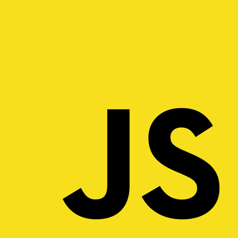
Note: But because we're in the web, we have to use JavaScript

JavaScript won the great language war in the browser, defeating such foes as Flash, Visual basic, JScript and ActiveScript.

Luckily. 
---
<pre class="cli"><code>function valid_username(un) {
&nbsp; 
&nbsp; 
&nbsp; 
&nbsp; 
&nbsp; 
&nbsp; 
} 
</code></pre> 
Note: To ensure that we have the same validation on the front and back end, we need to translate our python code to javascript exactly
---

<pre class="cli"><code>function valid_username(un) {
&nbsp; <h>usr = un</h>
&nbsp; 
&nbsp; 
&nbsp; 
&nbsp; 
&nbsp; 
} 
</code></pre> 
Note: Firstly, take a copy of the string. which is the same syntax in python as in javascript
Except no it's not, because in this case, usr would be a global variable

---
<pre class="cli"><code>function valid_username(un) {
&nbsp; <h>var</h> usr = un
&nbsp; 
&nbsp; 
&nbsp; 
&nbsp; 
&nbsp; 
} 
</code></pre> 
Note: We need to the the 'var' prefix to ensure it's local.

Okay, this is fine.

---
<pre class="cli"><code>function valid_username(un) {
&nbsp; var usr = un
&nbsp; 
&nbsp; if usr != un {
&nbsp; &nbsp; return False;
&nbsp; }
&nbsp; return True;
} 
</code></pre> 
Note: we can then just add our if and return statements, swapping out the colon in python for braces in javascript, right?

Well, no, this isn't valid

---

<pre class="cli"><code>function valid_username(un) {
&nbsp; var usr = un
&nbsp; 
&nbsp; if <h>(</h>usr != un<h>)</h> {
&nbsp; &nbsp; return False;
&nbsp; }
&nbsp; return True;
} 
</code></pre> 
Note: you need to wrap the if statement comparison in brackets
---

<pre class="cli"><code>function valid_username(un) {
&nbsp; var usr = un
&nbsp; 
&nbsp; if (usr != un) {
&nbsp; &nbsp; return <h>f</h>alse;
&nbsp; }
&nbsp; return <h>t</h>rue;
} 
</code></pre> 
Note: and you need to set the booleans to lowercase, because they spelt differently in javscript
---

<pre class="cli"><code>function valid_username(un) {
&nbsp; var usr = un
&nbsp; 
&nbsp; if (usr !=<h>=</h> un) {
&nbsp; &nbsp; return false;
&nbsp; }
&nbsp; return true;
} 
</code></pre> 
Note: and you need to use a not equals equals in javascript because otherwise you
may be comparing the equality between a string and a number, which would be bad

Now, now, we can get to the bit where we actually get to the validation

So, converting a string to lowercase in javascript. A quick check of the mozilla develoepr network shows that we need
---

<pre class="cli"><code>function valid_username(un) {
&nbsp; var usr = un<h>.toLowerCase()</h>
&nbsp; 
&nbsp; if (usr !== un) {
&nbsp; &nbsp; return false;
&nbsp; }
&nbsp; return true;
} 
</code></pre> 
Note: toLowerCase. that's fine. Next is strip. But there's no native strip function in javascript

---

<pre class="cli"><code>function valid_username(un) {
&nbsp; var usr = un.toLowerCase()<h>.trim()</h>
&nbsp; 
&nbsp; if (usr !== un) {
&nbsp; &nbsp; return false;
&nbsp; }
&nbsp; return true;
} 
</code></pre> 
Note: There is a trim though. Except that won't work in all browsers, beacuse it was only introduced a few years ago, and IE8 won't understand this command

And then there's the converting of the string from potentually unicode to ascii.

---
<pre class="cli"><code>function valid_username(un) {
&nbsp; var usr = un.toLowerCase().trim()
&nbsp; &nbsp; &nbsp; &nbsp; &nbsp; &nbsp; &nbsp; <h>.??????? </h>
&nbsp; if (usr !== un) {
&nbsp; &nbsp; return false;
&nbsp; }
&nbsp; return true;
} 
</code></pre> 
Note: how can we replicate the same functionality as an purposefully lossy encode decode in python in javascript

There doesnt appear to be anything that natively does it in js. So we'd have to make our own

We could iterate over all the elements and use a charCodeAt to check if it's character id is less than 127

Or we could use a regex

We could probably use encodeURIcomponent to convert any of the non-ascii characters, then compare with the original string to spot any differences

Or we could

---

# Gah! <!-- .slide: class="center" -->

Note: 
GAH 

It's just too complicated, and highly prone to translation errors

Why can't we just use the python code, that works, in the browser?

Well. we can

---
 

Note: Beeware, is a series of libraries and tools that helps get python everywhere.

Remember our bytecode from earlier? We run that in the browser, using a BeeWare suite tool called Batavia

---
 

 <!-- .slide: class="center" -->
 

 <!-- .slide: class="center" -->
---

 

 <!-- .slide: class="center" -->
 

 <!-- .slide: class="center" -->

---
# Batavia
 

Note: 

Batavia is a Python virtual machine, written in javascript.

Why is it called batavia?

Batavia was the name of a Dutch merchant ship in the 1600's. It sorta.. crashed.. into Australia

Not far from Perth, actually, which is where the Bee-levolent Dictator For Now of BeeWare,
Russell Keith-Magee, hails from.

Now, the batavia had a small problem with it's crew, mainly mutiny.. but where it was suppoesd to be going
was what is now Indonesia, to a small island called Java

So the Batavia was the world's first Java ship.

---

### ba doom tish <!-- .slide: class="center" -->

---

 

Note: Using batavia, our little helper be can help lead the way for snek to be in the browser
---

<pre class="cli"><code>def valid_username(un):
&nbsp; usr = un.lower().strip() \
&nbsp; &nbsp; &nbsp; &nbsp; &nbsp; .encode("ascii","ignore") \
&nbsp; &nbsp; &nbsp; &nbsp; &nbsp; .decode("utf-8")
&nbsp; if usr != un:
&nbsp; &nbsp; return False
&nbsp; 
&nbsp; return True
</code></pre> 
Note: Here's our python function from before

---

<pre class="cli"><code>$ python
Python 3.5.1
>>> from validate import valid_username
</code></pre> 
---
<pre class="cli"><code>$ python
Python 3.5.1
>>> from validate import valid_username
>>> validate.__code__
</code></pre> 
---

<pre class="cli"><code>$ python
Python 3.5.1
>>> from validate import valid_username
>>> validate.__code__
&ltcode object valid_username at 0x1035c95d0,
file "/private/tmp/validate.py", line 1>
</code></pre> 
---
<pre class="cli"><code>>>> validate.__code__.co_code
</code></pre> 
---
<pre class="cli"><code>>>> validate.__code__.co_code
b'|\x00\x00j\x00\x00\x83\x00\x00j 
\x01\x00\x83\x00\x00j\x02\x00d\x01 
\x00d\x02\x00\x83\x02\x00j\x03\x00d 
\x03\x00\x83\x01\x00}\x01\x00t\x04 
\x00|\x00\x00\x83\x01\x00\x01t\x04 
\x00|\x01\x00\x83\x01\x00\x01|\x01 
\x00|\x00\x00k\x03\x00rK\x00d\x04 
\x00Sd\x05\x00S' 
</code></pre> 
---
<pre class="cli"><code>>>> from base64 import b64encode
>>> b64encode(
... valid_username.__code__.co_code)
</code></pre> 
---
<pre class="cli"><code>>>> from base64 import b64encode
>>> b64encode(
... valid_username.__code__.co_code)
b'fAAAagAAgwAAagEAgwAAagIAZAEAZAIAgw 
IAagMAZAMAgwEAfQEAdAQAfAAAgwEAAXQEAH 
wBAIMBAAF8AQB8AABrAwBySwBkBABTZAUAUw&equals;&equals;' 
</code></pre> 
---
<pre class="cli"><code>
&lt;script src="/static/batavia.js">&lt;script>
&lt;script type="application/python-bytecode">
fAAAagAAgwAAagEAgwAAagIAZAEAZAIAgw 
IAagMAZAMAgwEAfQEAdAQAfAAAgwEAAXQEAH 
wBAIMBAAF8AQB8AABrAwBySwBkBABTZAUAUw&equals;&equals; 
&lt;script> 
</code></pre> 
---
<pre class="cli"><code>&lt;script type="text/javascript">
function validate() {
&nbsp; usr = $("username")
&nbsp; if !valid_username(usr) {
&nbsp; &nbsp; alert("you don't surf")
&nbsp; }
} 
---
<pre class="cli" ><code>&lt;form>
&nbsp; &lt;label>Username: &lt;/label>
&nbsp; &lt;input type="text"
&nbsp; &nbsp; &nbsp; &nbsp;&nbsp; id="username">
&nbsp;&lt;button>Surf!&lt;/button> 
&lt;/form> 
</code></pre> 
---

<pre class="cli" ><code>&lt;form <h>onSubmit="valid_username()"</h>>
&nbsp; &lt;label>Username: &lt;/label>
&nbsp; &lt;input type="text"
&nbsp; &nbsp; &nbsp; &nbsp;&nbsp; id="username">
&nbsp;&lt;button>Surf!&lt;/button> 
&lt;/form> 
</code></pre> 

Note: 
---

 
---

 
---
 
---
## But how? <!-- .slide: class="center" -->

---

### TODO <!-- .slide: class="center" -->

Note: Remember that base64 bytecode from earlier? It's just an encoded base of instructions

>>> for b in snek.__code__.co_code:
... print(hex(b))
... 
0x74 
0x0 
0x0 
0x64 
0x1 
0x0 
0x83 
0x1 
0x0 
0x1 
0x64 
0x0 
0x0 
0x53 

dis.disco? Mapping of codes around?
Or linking the dis.dis() to the bytecode

then talk about walkthrough

---

## Snek in the Browser <!-- .slide: class="center" -->

Note: and that's snek int he browser

---

## Doesn't this already exist? <!-- .slide: class="center" -->

Note: Well, yes and no.
---

## Brython, Skulpt, PyPy.js <!-- .slide: class="center" -->
### Compiler + Interpreter + REPL + Python Virtual Machine

Note: Brython, Skult and PyPyJS all exist, and all solve the problem of getting Python
in the browser, but in different ways.

Brython and Skulpt are full implementations of the Python compler and interpreter, complete with interactive prompt.

PyPyJS is similar, except it's used emscripted to compile the PyPy source code into javaScript.

These implementations are big. Like, 5 megabytes for PyPy.js.

I mean, 5MB may not be a lot, but it's a noticable load time. It's even more noticable on mobile. Even more
noticable if you live on a small island in the middle of the pacific, like I do. Or, say, on conference wifi.

---
# Batavia <!-- .slide: class="center" -->

### ~~Compiler + Interpreter + REPL +~~ Python Virtual Machine

Note: batavia, however, doesn't need a compiler, since we're proving the compiled code already.

We don't need an interpreter and repl because we already have our code, and our users aren't inputing code directly

All we need is the python virtual machine.

Add it all up, and add javascript compression, batavia is currently under a quarter of the size, just under 800kb, which is negligable, even over Australian mobile internet.

---

## But wait, there's more. <!-- .slide: class="center" -->

Note: So that's Batavia

but that's only one part of the beeware suite.

---

<pre class="cli" ><code>&lt;form>
&nbsp; &lt;label>Username: &lt;/label>
&nbsp; &lt;input type="text"
&nbsp; &nbsp; &nbsp; &nbsp;&nbsp; id="username">
&nbsp;&lt;button>Surf!&lt;/button> 
&lt;/form> 
</code></pre> 
Note: Remember this markup from earlier? This will allow us to implement a form on the web
---

 

 <!-- .slide: class="center" -->
 

 <!-- .slide: class="center" -->

Note: 
We've already gotten rid of the JavaScript with BeeWare, but what about the HTML and the CSS?

Can we remove those too?
---

 

 <!-- .slide: class="center" -->
 

 <!-- .slide: class="center" -->

Note: 

Yes. 

---

# Toga
 

Note: we've already shaved that yak

Toga is a Python native, OS native, cross platform graphical uiser interface toolkit

Why is it called toga? Well, when in Rome

---
### sorry, not sorry <!-- .slide: class="center" -->

---
<pre class="cli" ><code>&lt;form>
&nbsp; &lt;label>Username: &lt;/label>
&nbsp; &lt;input type="text"
&nbsp; &nbsp; &nbsp; &nbsp;&nbsp; id="username">
&nbsp;&lt;button>Surf!&lt;/button> 
&lt;/form> 
</code></pre> 

Note: if we take our form, we can re-create it in Toga
---
<pre ><code>import toga

class SuperHighway(toga.App):

&nbsp; &nbsp; def valid_username(un):
&nbsp; &nbsp; &nbsp; &nbsp; ...

&nbsp; &nbsp; def validate_user(self, widget):
&nbsp; &nbsp; &nbsp; &nbsp; if not valid_username(self.username.value):
&nbsp; &nbsp; &nbsp; &nbsp; &nbsp; &nbsp;self.main_window.info_dialog("Denied", "you don't surf")

&nbsp; &nbsp; def startup(self):
&nbsp; &nbsp; &nbsp; &nbsp; self.main_window &equals; toga.MainWindow(self.name)
&nbsp; &nbsp; &nbsp; &nbsp; self.main_window.app &equals; self

&nbsp; &nbsp; &nbsp; &nbsp; <c># insert UI here</c>

&nbsp; &nbsp; &nbsp; &nbsp; self.main_window.content &equals; box
&nbsp; &nbsp; &nbsp; &nbsp; self.main_window.show()

def main():
&nbsp; &nbsp; return SuperHighway("Super Highway", "org.pybee.superhighway")
</code></pre> 
---
<pre><code> 
<c># UI elements</c>
un_label &equals; toga.Label("Username")
self.username &equals; toga.TextInput()
button &equals; toga.Button("Surf", on_press&equals;self.validate_user)

box &equals; toga.Box()
box.add(un_label) 
box.add(self.username) 
box.add(button) 
self.username.style.set(width&equals;100) 
un_label.style.set(width&equals;100) 
button.style.set(width&equals;100) 
box.style.set(padding&equals;30, flex_direction&equals;"row")
</code></pre> 

---

<pre class="cli"><code>

$ python -m highway</code></pre>

Note: we can then run this code, and we get...
---

 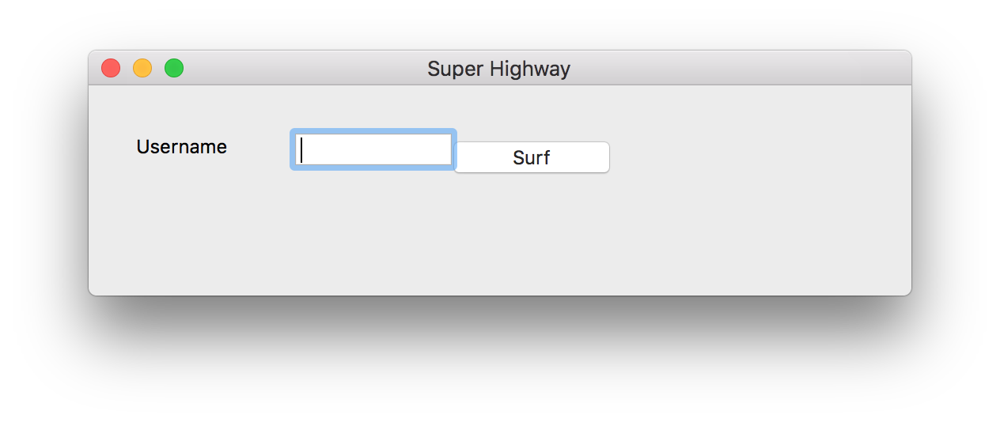

Note: our program as a native platform application; in this case, macOS
---

 

Note: including the popup

But if we want to take this away somewhere...

---

# Briefcase
 

Note: then, we can take this code, and wrap it in breifcase

Why is it called briefcase? Because it allows you to carry your apps around

Sorry. I didn't name these things

---

<pre class="cli"><code>

$ python setup.py macos
</code></pre> 
---

 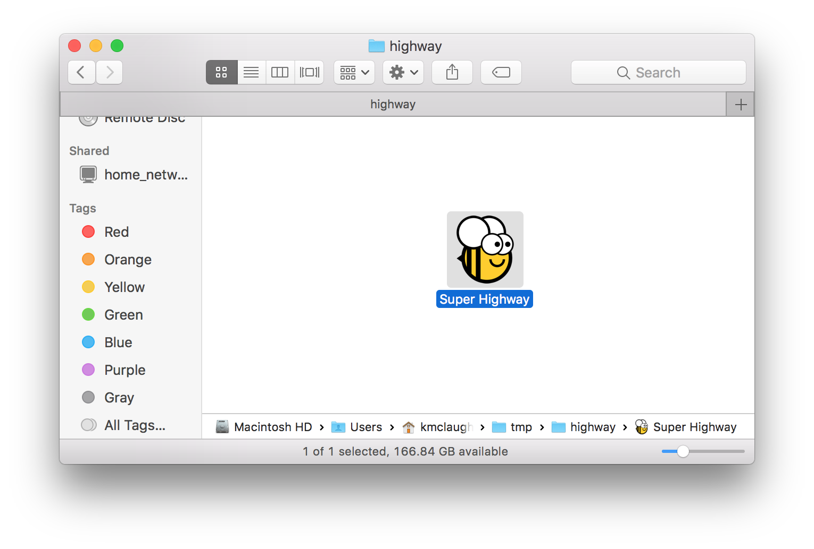

Note: See? nice little self-contain macOS app
---
 
---

<pre class="cli"><code>

$ python setup.py django
</code></pre> 
---

 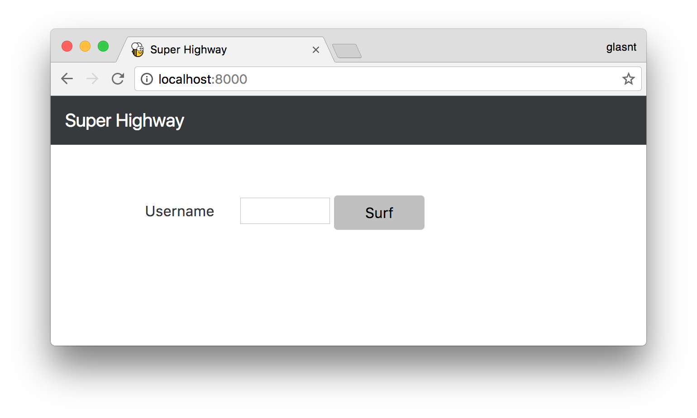
---

<pre class="cli"><code>

$ python setup.py ios
</code></pre> 
---

 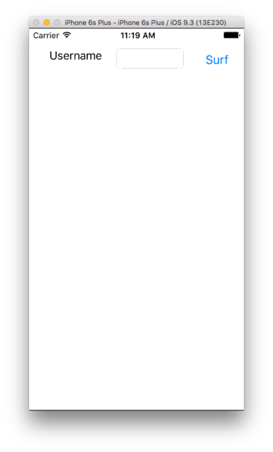
---
<pre class="cli"><code>

$ python setup.py android
</code></pre> 
---

 

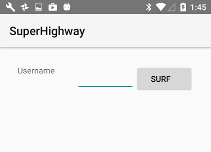

  <!-- .slide: class="center" -->
---
<pre class="cli"><code>

$ python setup.py windows
</code></pre> 
---

 

  <!-- .slide: class="center" -->

---

<pre class="cli"><code>

$ python setup.py linux
</code></pre> 
---

 

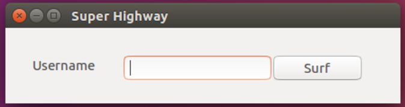

  <!-- .slide: class="center" -->

---

 

 <!-- .slide: class="center" -->
---

## But wait, there's still more. <!-- .slide: class="center" -->

Note: the thing is, Toga is a toolkit that is a collecton of cross-platform widgets.

Which means,
---

 

  <!-- .slide: class="center" -->

Note: you rememebr that browser window from before?

We can recreate that in Toga
---
<pre><code>#!/usr/bin/env python

import toga
from colosseum import CSS

class Graze(toga.App):
&nbsp; &nbsp; def startup(self):
&nbsp; &nbsp; &nbsp; &nbsp; self.main_window = toga.MainWindow(self.name)
&nbsp; &nbsp; &nbsp; &nbsp; self.main_window.app = self

&nbsp; &nbsp; &nbsp; &nbsp; self.webview = toga.WebView(style=CSS(flex=1))
&nbsp; &nbsp; &nbsp; &nbsp; self.url_input = toga.TextInput(
&nbsp; &nbsp; &nbsp; &nbsp; &nbsp; &nbsp; initial='https://pybee.com/',
&nbsp; &nbsp; &nbsp; &nbsp; &nbsp; &nbsp; style=CSS(flex=1, margin=5)
&nbsp; &nbsp; &nbsp; &nbsp; )

&nbsp; &nbsp; &nbsp; ...
</code></pre> 
---

 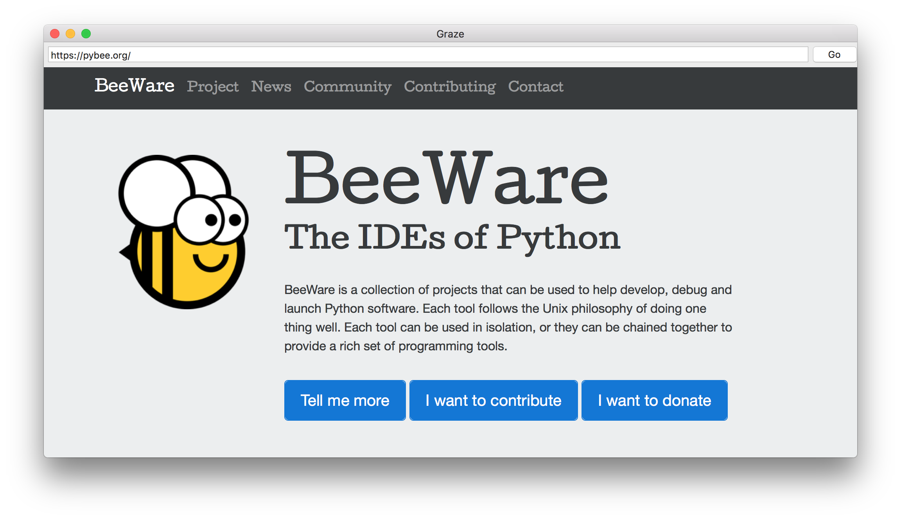
Note: Which means we can make our own brower that runs as a native app

And yes,
---

 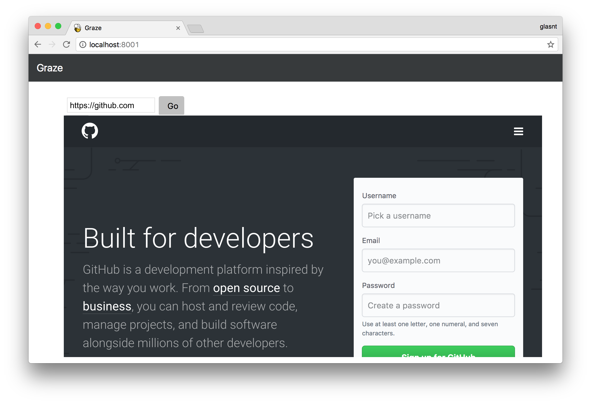

Note: this means we can have a browser in a browser.

---

## Python 3.4, 3.5 Compatible <!-- .slide: class="center" -->
Note: The entire BeeWare suite is compatible with Python 3.4 and 3.5

---

## Python 3.6? <!-- .slide: class="center" -->
Note: but what about 3.6?

Well, some parts work, but 3.6 presents and interseting problem
---

## Bytecode vs Wordcode <!-- .slide: class="center" -->

Note: remember how I said that bytecode was a cpython implementation? Well, even through it is documented, it's not formal, it's considered 'internal', and they made no guarentee of backwards compatbility

The basis of this particular change is changing the underlying opcodes to use 16 bit units for various optimisations. The thing is, this is changes the marshelling that batavia does to wrangle bytecode around, so it doesn't work for 3.6

---

## You can help! <!-- .slide: class="center" -->

Note: However, you can totally help! We have an open offer to mentor anyone who wants to contribute, even if you've never contributed to open source.

If you do contrinue to the project

---
 
Note: i
You get one of the famous BeeWare challenge coins. If you have already contributed to beeware and haven't received your coin, I have a few here tonight, come and see me afterwards
---

## We have a booth at <!-- .slide: class="center" -->
## OSCON and PyCon US!

Note: Also, if you're coming along to OSCON or Pycon US, we'll have a booth there, where I'll have
---
 

Note: stickers! many many stickers. I don't have many here, sadly, but if you'd like one, come see me.

---
 

 <!-- .slide: class="center" -->

### glasnt.com/talks