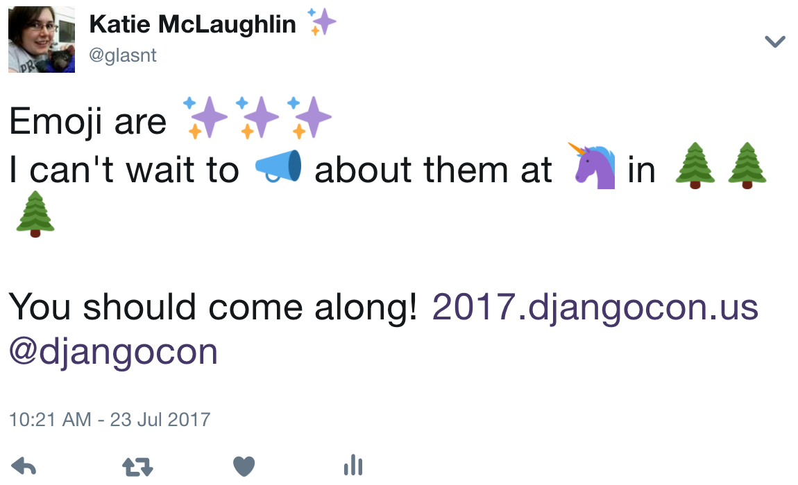
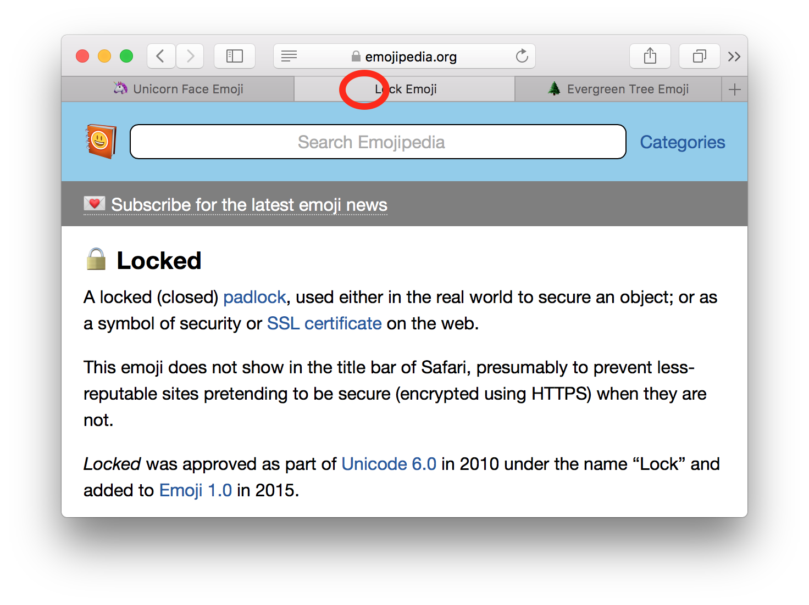
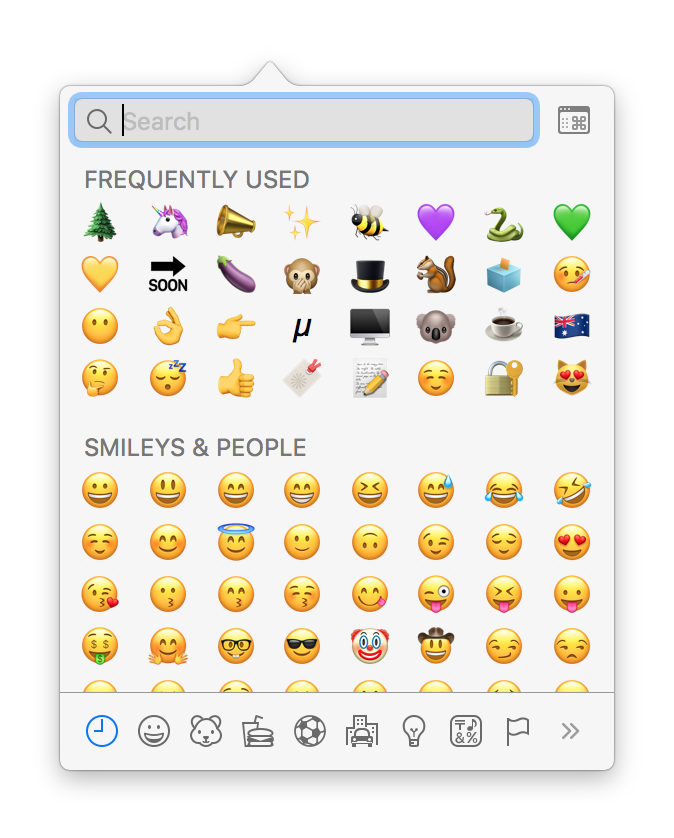
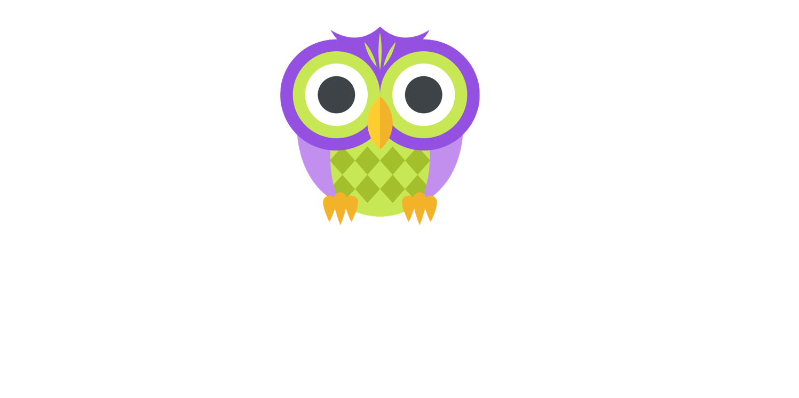
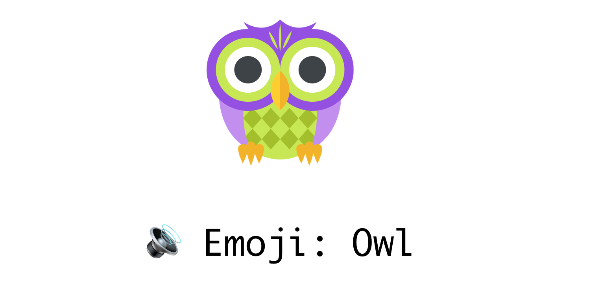
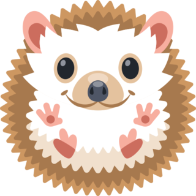
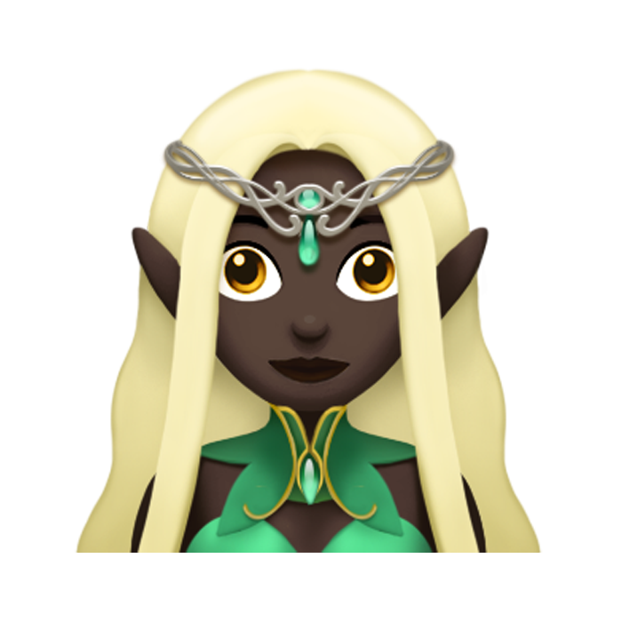
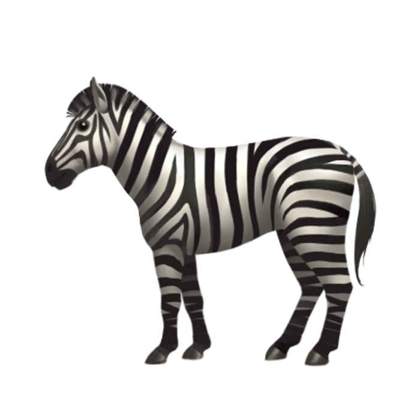
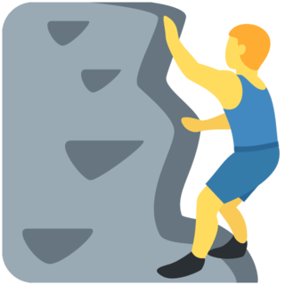

 

 <!-- .slide: class="center" -->
---
 

 <!-- .slide: class="center" -->
 
---
 

 <!-- .slide: class="center" -->
Note: Hi~
Yes, this is a talk about emoji in the archecture track. Why?
---
 

 <!-- .slide: class="center" -->
Note: i love emoji
---
 

 <!-- .slide: class="center" -->
Note: i love how broken it is
---
 

 <!-- .slide: class="center" -->
Note: basically, because computers, we have

---
 

---

 

 <!-- .slide: class="center" -->
 

 <!-- .slide: class="center" -->
Note: Three main encoding types.

YOu might have heard of these
---
 

 <!-- .slide: class="center" -->
 

 <!-- .slide: class="center" -->

Note: Flexible, Variable
---
 

 <!-- .slide: class="center" -->
 

 <!-- .slide: class="center" -->
 

 <!-- .slide: class="center" -->
 

 <!-- .slide: class="center" -->
Note: you don't have to use all the other bits

Added benefit: it's directly compatible with ASCII bit for bit

---
 

 <!-- .slide: class="center" -->
 

 <!-- .slide: class="center" -->
 

 <!-- .slide: class="center" -->
 

 <!-- .slide: class="center" -->

Note: The tags on the top note how many more to expect

0 at start is none

11 at start is one more (2 total)
111 is two more

---
 

 <!-- .slide: class="center" -->
# `\u0041`
---
 

 <!-- .slide: class="center" -->

# `\u3042`
---

 

 <!-- .slide: class="center" -->
# `\u0045`

---

 

 <!-- .slide: class="center" -->
# `\u0301`

---

 

 <!-- .slide: class="center" -->
# `\u0045\u0341`
---

 

 <!-- .slide: class="center" -->
 

 <!-- .slide: class="center" -->
Note: English, Latin-character based languages, cyrliic, chinese
---

 

 <!-- .slide: class="center" -->
Note: But the japense arne't happy
---

 

 <!-- .slide: class="center" -->

Note: These japanese had mobile phones with these little pictures, and they wanted them in unicode
---
 

 <!-- .slide: class="center" -->
 

Note: Shigetaka Kurita

SHI-GE-TA-KA KU RI TA

12x12 pixels

Some original use on pagers

Weather reports

directions to local business

and selling tickets to things

BRAND ENGAGEMENT

---
 

 <!-- .slide: class="center" -->
 

 <!-- .slide: class="center" -->
 

 <!-- .slide: class="center" -->
Note: with help of google

unicode 6 got emoji

and then nothing happened.
---
 

 <!-- .slide: class="center" -->
 

 <!-- .slide: class="center" -->
 

 <!-- .slide: class="center" -->
Note: i

iOS 2, 3 in Japan

Gets emoji

then they have it as an option in the iOS 5 US version

the first verison with emoji
If it supports emoji,it will support 6

After this, adoption rates plummet

Yosemite won't support anything above 6

---
 

 <!-- .slide: class="center" -->
 

 <!-- .slide: class="center" -->
 

 <!-- .slide: class="center" -->

Note: Levitating here because webdings

Wingdings and webdings compatitbility because missing data
---

 

 <!-- .slide: class="center" -->
 

 <!-- .slide: class="center" -->
 

 <!-- .slide: class="center" -->

Note: Unicode 8 2015
---
 

 <!-- .slide: class="center" -->
 

 <!-- .slide: class="center" -->
 

 <!-- .slide: class="center" -->
Note: 

If you can't see these: Upgrade. You get new emoji ... and security patches
---
 

 <!-- .slide: class="center" -->
## `\u1F926\u1F3FE`
---

 

 <!-- .slide: class="center" -->
## `\u1F926 \u1F3FE`
---
 

 <!-- .slide: class="center" -->
## `\u1F487`
---
 

 <!-- .slide: class="center" -->
## `\u1F487` &nbsp; `\u2640`
---
 

 <!-- .slide: class="center" -->
## `\u1F487` &nbsp; `\u2642`
---
 

 <!-- .slide: class="center" -->
## `\u1F487\u2642`
---

 

 <!-- .slide: class="center" -->
## `\u1F468\u2764\u1F468`
---
 

 <!-- .slide: class="center" -->

## `\u1F468 \u2764 \u1F468`

---

 

 <!-- .slide: class="center" -->
## &nbsp;
Note: Speaking of those flags from earlier, they work in a similar way to the facepalm emoji
---
 

 <!-- .slide: class="center" -->
##`\u1F1FA\u1F1F8` 
---
 

 <!-- .slide: class="center" -->
##`\u1F1FA \u1F1F8`

---
 

 <!-- .slide: class="center" -->
---
 
<pre style='margin-bottom:0px;margin-top:0px'><code style="font: 'monospace' 150%">$ python</code></pre>

 
<pre style='margin-bottom:0px;margin-top:0px'><code style="font: 'monospace' 150%">>>> import unicodedata</code></pre>

 
<pre style='margin-bottom:0px;margin-top:0px'><code style="font: 'monospace' 150%">>>> unicodedata.name("")</code></pre>

 
<pre style='margin-bottom:0px;margin-top:0px'><code style="font: 'monospace' 150%">'SNAKE'</code></pre>

 
<pre style='margin-bottom:0px;margin-top:0px'><code style="font: 'monospace' 150%">>>> "\N{SNAKE}"</code></pre>

 
<pre style='margin-bottom:0px;margin-top:0px'><code style="font: 'monospace' 150%">''</code></pre>

Note: Escape Sequence, for Named character in unicode database

"Escape Sequences, good for unicode *and* gravitational fields!" -- Jason Yee, gitbiscet

New in python 3.3

---
 
<pre style='margin-bottom:0px;margin-top:0px'><code style="font: 'monospace' 150%">$ python</code></pre>

 
<pre style='margin-bottom:0px;margin-top:0px'><code style="font: 'monospace' 150%">>>> "".encode("unicode_escape")</code></pre>

 
<pre style='margin-bottom:0px;margin-top:0px'><code style="font: 'monospace' 150%">b'\\U0001f40d'</code></pre>

 
<pre style='margin-bottom:0px;margin-top:0px'><code style="font: 'monospace' 150%">>>> "\U0001f40d"</code></pre>

 
<pre style='margin-bottom:0px;margin-top:0px'><code style="font: 'monospace' 150%">''</code></pre>

---
 

 <!-- .slide: class="center" -->

Note: here's where it gets (more) complicated
---

 

 <!-- .slide: class="center" -->
Note: I posit that the unicode adoption, particularly the graphics and implementations was a bit rushed.

and this has been depremental to emoji

Especially with the original android adoption
---
 

 <!-- .slide: class="center" -->

 
<pre style='margin-bottom:0px;margin-top:0px'><code style="font: 'monospace' 150%">&nbsp; >>> unicodedata.name("")</code></pre>

 
<pre style='margin-bottom:0px;margin-top:0px'><code style="font: 'monospace' 150%">&nbsp; 'YELLOW HEART'</code></pre>

Note: 
Yellow Heart

This is the Apple version

Here's what Android went with.
---
#  <!-- .slide: class="center" -->
---
 

 <!-- .slide: class="center" -->
---

 

 <!-- .slide: class="center" -->
Note: ** micro services **
---
 

 <!-- .slide: class="center" -->
---
 

 <!-- .slide: class="center" -->
Note: Guess -- Blonde
---
 

 <!-- .slide: class="center" -->
---
 

 <!-- .slide: class="center" -->

Note: so how do emoji get approved
---
 

 <!-- .slide: class="center" -->

Note: 
---
 

 <!-- .slide: class="center" -->
 

 <!-- .slide: class="center" -->

Note: Compatibility - Cowboy added to compat with Yahoo messenger
---
 

 <!-- .slide: class="center" -->
 

 <!-- .slide: class="center" -->

Note: Completeness - they didnt have the full zodiac set until 8.0 when 5 were added (including scorpio)
---
 

 <!-- .slide: class="center" -->

Note: Frequently requested

---
 

 <!-- .slide: class="center" -->
Note: some things that don't count

---
 

 <!-- .slide: class="center" -->
Note: Overly specific

Can't have a manhattan or a long island
---
 

 <!-- .slide: class="center" -->
Note: no logos or brands

But these are a watch, headphones, a mobile and a desktop

and in no way

an iWatch, Earbuds, an iPhone and an iMac.

Nope. 
---
 

 <!-- .slide: class="center" -->
Note: fads, memes, etc.
---
 

 <!-- .slide: class="center" -->
Note: As new emoji are brought in

older systems will be outdated
---
 

 <!-- .slide: class="center" -->

Note: Mojibake
---
 

 <!-- .slide: class="center" -->
 

 <!-- .slide: class="center" -->

Note: 

This extends to just normal characters too, not just emoji

JP: mo-ji-ba-ke

Think of it like this
---

 

Note: here is a sample tweet. If my system couldn't read any of the emoji, would the tweet still make sense? Well, there's an app for that.
---

 
 [Chrome](https://chrome.google.com/webstore/detail/emoji-censor/heceohcbaahlibmaeheomnkpmhnggnld) [Firefox](https://addons.mozilla.org/en-GB/firefox/addon/emoji-censor/)

Note: Emoji Censor is a browser extension

Gilmore Davidson

Self-proclaimed "emoji grinch"

Firefox and Chrome

---
 

 <!-- .slide: class="center" -->

---

Note: Surprisingly enough, this works
---
 

 <!-- .slide: class="center" -->
---
 

 <!-- .slide: class="center" -->
### `https://xn--9q9h.ws`

---
 

 <!-- .slide: class="center" -->

Note: Speaking of the web, here's another interesting thing, to do with tabs in browsers

---

 

Note: Emoji pedia is awesome, you can look up emoji and see all the cross-browser fun

But notice something that's inconsistent?

---

 
Note: Safari won't display lock emoji in brower tabs

This is GOOD

otherwise, people might assume the page is secured when it's not

---

 

 <!-- .slide: class="center" -->

Note: So how do you get the input in?
---

 

---

  <!-- .slide: class="center" -->
---
# 

 <!-- .slide: class="center" -->

Note: Apple input Control CMD Space
---

---
 

 <!-- .slide: class="center" -->
---
# &nbsp; <!-- .slide: data-background="pictures/emoji_keyboard.jpg" data-background-transition="none" -->
Note: Tom Scott
Hardware keyboard x 14 + LUA script + Autohotkey
---
# &nbsp; <!-- .slide: data-background="pictures/o/emojli.jpg" data-background-transition="none" -->
Note: 
Also Emojili - a hack as a joke, but they were approched by VCs

They had an iphone and android app

Electromagnetic field talk about the fun they had trying to create this bodge

---
 

 <!-- .slide: class="center" -->

Note: In the webspace, you have a few options

---
 
Note: some websites have panels
---

 

 <!-- .slide: class="center" -->
 

 <!-- .slide: class="center" -->

<a href="https://thenextweb.com/apps/2017/04/28/twitter-now-supports-emoji-search-absolutely-needed/#.tnw_hLCAQj1Q">Twitter</a>, Instagram <a href="https://engineering.instagram.com/emojineering-part-1-machine-learning-for-emoji-trendsmachine-learning-for-emoji-trends-7f5f9cb979ad">1</a>, <a href="https://engineering.instagram.com/emojineering-part-ii-implementing-hashtag-emoji-7b653b221c82">2</a>
---

 

 <!-- .slide: class="center" -->

Note: but a workaround for having a visual input mechanism is shortcodes

But they're a psudostandard
---

 

 <!-- .slide: class="center" -->
  <!-- .element: class="fragment" -->

Note: Shortcodes

Slack: Searchable if they are native
auto convert from emoji codepoints to emoticons

Github: shortcodes, no search, autocomplete only.

Django-emoji is an app for Django that reports to do this

---

 

 <!-- .slide: class="center" -->
  <!-- .element: class="fragment" -->

Note: HipChat

uses brackets instead

---

 

 <!-- .slide: class="center" -->

Note: 

Cross-platform incompatibility
---
 

 <!-- .slide: class="center" -->

Note: who here is familiar with slack
---
 

 <!-- .slide: class="center" -->
## `:partyparrot:` <!-- .slide: class="center" -->

Note: and this?

partyparrrot is not an emoji
---
 
## `:shipit:` <!-- .slide: class="center" -->

Note: so is github
it's an emoticon
---
 

 <!-- .slide: class="center" -->
---
 

 <!-- .slide: class="center" -->

Note: on that note, please make automatically changing arbitaary text to emoji optional

please let me disable autocorrect
---
 

 <!-- .slide: class="center" -->
Note: automatically overexaggerating
---
 

 <!-- .slide: class="center" -->
---
 

 <!-- .slide: class="center" -->
Note: A note on slack. It doesn't keep up to date with emoji
---
### `:chipmunk:` &nbsp;  <!-- .slide: class="center" -->
### `:popcorn:` &nbsp; 
### `:duck:` &nbsp; &nbsp; &nbsp; &nbsp;
---
 

 <!-- .slide: class="center" -->
Note: Reading things back again

For mobile you can mostly assume platform emoji, with sme exceptions
---

 

 <!-- .slide: class="center" -->

Note: On the web,you have complete control

You can control the entire system

You can make it work

You can make it display your own emoji, or use a common one, like Emoji One

---

 

 <!-- .slide: class="center" -->
Note: 
If i might make a suggestion

if you have to do this kind of thing
---
 

 <!-- .slide: class="center" -->
Note: Fall Back

Don't rely on system emoji for the web. It's unreliable, and exclusionary

You could try and detect if the emoji won't work via the User Agent, or

Just serve your own emoji graphs

Yes, it's not the best way to get things done, but
---

# ✌ ⁉ ⤴ ⚡ ⚗ 🀄 ⛽  <!-- .slide: class="center" -->
# 😂 😮 🖖 🙃 🥝 🥦

### glasnt.com/unicode-test

Note: Actual Emoji
One from every release of unicode from 1993 - 2017

Chrome, Firefox, Safari evergreen all on el cap
: none of them look the same
---

# `twemoji.js` <!-- .slide: class="center" -->
Note: Wordpress.com uses this.

javascript front end change emoji to fallback images only
---

 

 <!-- .slide: class="center" -->
---
 

 <!-- .slide: class="center" -->

Note: Alt - Highlight

Have the unicode character as the alt

Allows copy and pasting

---
 

 <!-- .slide: class="center" -->

Note: Tooltip - Mouse Over

Have the proper description there, the standard

Alt Text does not have the same functionality as Tool Tips

You can use this to your own advantage

NEW 

Twitter implements all these on the web

As long as you are using a browser that runs javascript and can display images, Twitter will work every emoji.

---

 

 <!-- .slide: class="center" -->
Note: 
Think of it in terms of web accessibilty

At the very least, have images that are distinct and visible

little 12x12 don't work

Use vector graphs where possible - Apple doesnt

Where you can, allow the images to be bigger

Twitter DM and Slack message - if only emoji, they're display bigger
---
<pre class="ficate"><code>&lt;img src&equals;"img/1F989.png" alt="🦉"
title&equals;"Owl" aria-label&equals;"Emoji: Owl">

---
<pre class="ficate"><code>&lt;img <r>src&equals;"img/1F989.png"</r> alt="🦉"
title&equals;"Owl" aria-label&equals;"Emoji: Owl">

---

<pre class="ficate"><code>&lt;img src&equals;"img/1F989.png" <r>alt="🦉"</r>
title&equals;"Owl" aria-label&equals;"Emoji: Owl">

---
<pre class="ficate"><code>&lt;img src&equals;"img/1F989.png" alt="🦉" <r>title&equals;"Owl"</r> aria-label&equals;"Emoji: Owl">

---
<pre class="ficate"><code>&lt;img src&equals;"img/1F989.png" alt="🦉"
title&equals;"Owl" <r>aria-label&equals;"Emoji: Owl"</r>>

---
## `pip install emojificate` <!-- .slide: class="center" -->
---
<pre style="font-size: 120%"><code>

&lcub;&percnt; load emojificate %}

&lt;dt>Content&lt;/dt> 
&lt;dd>{{ words|emojificate }}&lt;/dd>
</code></pre> 
 [Solve for Emoji](http://glasnt.com/blog/2016/08/06/solve-for-emoji.html)
Note: loading a template tag, and then passing 'content' through a template filter
---
<pre style="font-size: 120%"><code>

;&lcub;&percnt; emojified %}

😎🌈💕 

;&lcub;&percnt; endemojified %}

</code></pre> 
 [Solve for Emoji](http://glasnt.com/blog/2016/08/06/solve-for-emoji.html)
Note: full template tag
---
 

 <!-- .slide: class="center" -->

Note: TIP for general use
---

## `<meta charset="utf-8">` <!-- .slide: class="center" -->
Note: 
By default, html4 does not use unicode

---
 

 <!-- .slide: class="center" -->

Note: The future
---
 

 <!-- .slide: class="center" -->
---

 

 <!-- .slide: class="center" -->

 

 <!-- .slide: class="center" -->
 

 <!-- .slide: class="center" -->
<a href="http://blog.emojipedia.org/final-2017-emoji-list/">emojipedia.org</a>
---
 

 <!-- .slide: class="center" -->
 

 <!-- .slide: class="center" -->
 

 <!-- .slide: class="center" -->

<a href="http://blog.emojipedia.org/final-2017-emoji-list/">emojipedia.org</a>

---
 

 <!-- .slide: class="center" -->
 
Note: I know right? mind. blown.
---

 

 <!-- .slide: class="center" -->
 

Note: 
which is also a candidate.
---
 

 <!-- .slide: class="center" -->
 

 <!-- .slide: class="center" -->

Note: recommendations in Unicde10 include updating some of the glyphs to conform
including the sweat drop character
---
 

 <!-- .slide: class="center" -->
 

 <!-- .slide: class="center" -->
 

 <!-- .slide: class="center" -->
---
 

 <!-- .slide: class="center" -->
 

 <!-- .slide: class="center" -->
 

 <!-- .slide: class="center" -->

Note: also, the 2017 update also includes ' a third base for people, being gender neutral.

---

 

 <!-- .slide: class="center" -->
 

 <!-- .slide: class="center" -->
---
 

 <!-- .slide: class="center" -->
 

 <!-- .slide: class="center" -->

Note: Which should allow for all the professions and people to have a version that not's a man or a woman
---

#  &nbsp;  <!-- .slide: class="center" -->
Note: updates
---
 

 <!-- .slide: class="center" -->
---

 <!-- .slide: class="center" -->
---
 

 <!-- .slide: class="center" -->
---

 

 <!-- .slide: class="center" -->
 

 <!-- .slide: class="center" -->
---
## &nbsp;
 

  <!-- .slide: class="center" -->
 [Emojipedia.org](http://blog.emojipedia.org/fewer-empty-boxes-ahead-for-android-users/)

Note: One this goeogle is fixing is the Emoji compatibility

Apps can update their code to use emoji suport library

Adds a font that features all the latest glyphs, and realtively simple code for app devs to use in order to replace glyphs that the system doesn't know about

Should work for 4.4 onwards, (cc 2013)
---
 

 <!-- .slide: class="center" -->
 

 <!-- .slide: class="center" -->
Note: windows 8 to windows 10
---

 

 <!-- .slide: class="center" -->
---
 

  <!-- .slide: class="center" -->
Note: updates in the creators update

---

 

 <!-- .slide: class="center" -->
---

---
 

 <!-- .slide: class="center" -->
 

 <!-- .slide: class="center" -->
---
 

 <!-- .slide: class="center" -->

Note: Emojione have also updated, now with a premoum version

They're updated a bunch of things, including the Owl

R.i.P. Argle Owl
---
 

 <!-- .slide: class="center" -->
 

 <!-- .slide: class="center" -->
Note: Andoird 7.1 last few days
---
## &nbsp;
 
---

 

 <!-- .slide: class="center" -->
---
 

 <!-- .slide: class="center" -->
 

 <!-- .slide: class="center" -->

 <!-- .slide: class="center" -->
 [unicode.org](http://www.unicode.org/L2/L2017/?C=M;O=D)
---

 

 <!-- .slide: class="center" -->
 

 <!-- .slide: class="center" -->
 

 <!-- .slide: class="center" -->
 [Facebook]()
---
 

 <!-- .slide: class="center" -->

Note: but what about more combinations?
---
 

 [Source](https://codepen.io/mandymichael/details/mWXGZp)
---
 

 <!-- .slide: class="center" -->
---
 
---
 

 <!-- .slide: class="center" -->
---
 
---
 

Note: but what about the partyy parrot? Well... there are serveral birds, but no "tropical bird"

You're welcome.

But that was last November, since then, they've literally added more exclusion factors, including
---
 
 [L2/17-280](http://www.unicode.org/L2/L2017/17280-tropical-bird-emoji.pdf)
Note: I submitted a proposal to fix this issue.
L2/17-280 is the unique identifier

However, since this submission

---
 

 <!-- .slide: class="center" -->
Note: Exclusion factor K: Faulty Comparison.

"the emoji dog and poodle, and two type of camel, do not justify adding different varieties of the same kind of animal"
---

 

 <!-- .slide: class="center" -->
---
 

 <!-- .slide: class="center" -->
Note: For more information
---
### &nbsp;
 

### emojipedia.org
---

## &nbsp;
 

### @fakeunicode
---
### &nbsp;

 
### @unicode
---

### &nbsp;
 
#### 501(c)(3) Non-Profit
---
 
Note: the takeaways
---

 

 <!-- .slide: class="center" -->

Note: 

There's a lot of power in speech

Emoji are an additional communication

Don't assume others will know what you're talking about without explaination
---

 

 <!-- .slide: class="center" -->

Note: Implement responsibly

Think about accessibility
---

 

 <!-- .slide: class="center" -->
Note: 

And have fun~
---

 

 <!-- .slide: class="center" -->

### glasnt.com/talks