###&nbsp; 
# How to handle abandoned projects, Take Two <!-- .slide: class="center" -->

---
 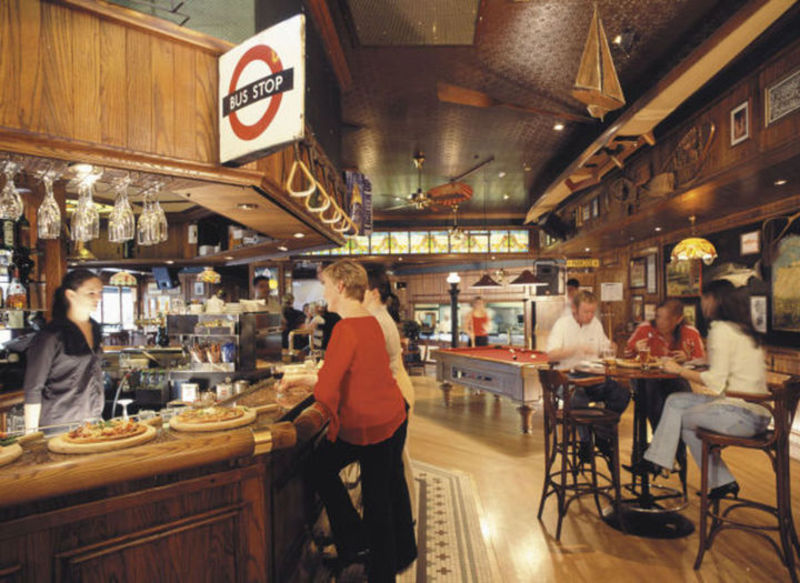
 [Menulog](https://www.menulog.co.nz/spe_bar_restaurant_the_langham_auckland)
Note: So I'm in a pub in Auckland, as you do.

It's 2013, and I've just finished attending my first open source software conference. It's the first time that the Open Source Developers Conference, or OSDC, has been held outside of Australia.

Paul Fenwick has just given the closing keynote, and a bunch of delegates have retired to the bar. The organisers are rounding up a bunch of people that are all going to see the blockbuster Gravity in the cinema

And I'm next to a guy with dreads.

"This was a pretty good conferece", I say.

"Well, I'm glad you agree", he says.

"I've got some ideas of my own that I might present next year, this little thing I've been working on"

"You should tweet that!"

---
 

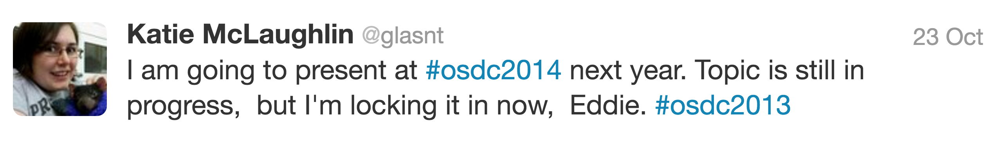

  <!-- .slide: class="center" -->
Note: and so I do, using the slang of the time.

Moments later, I get a notification. "Someone has retweeted your tweet!"
---

 

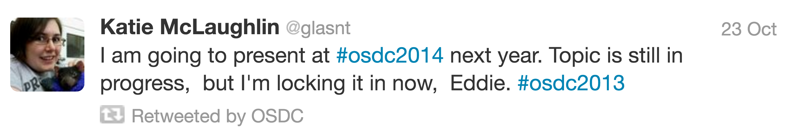

  <!-- .slide: class="center" -->
Note: ... Ah.

Turns out the bloke with the dreads was Ben Dechrai.. who sort of.. co-founded OSDC... yeah...

This was the start of my journey into public speaking and open source community wrangling

I've told this story before, and it's been affectionately referred to as my

"super hero origin story"

The rest of this talk is about my trials.

---
 

 [Wikipedia](https://commons.wikimedia.org/wiki/File:Statue-of-King-George-V.jpg)

Note: So I'm in a public square in Brisbane, as you do. It's 2015, a wonderful winter's afternoon,
and I'm holding onto an ice cream for a friend, while they are saying hello to some really cute labradours.

What I'm supposed to be doing right then was giving a talk.

---
 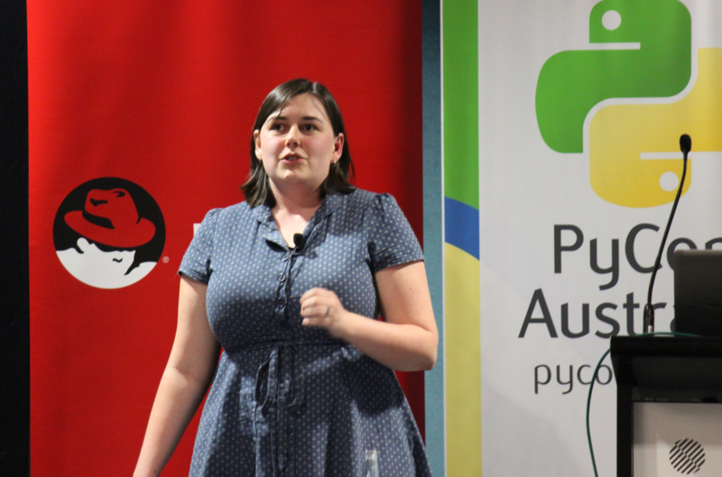
 [Flickr, CC-BY 2.0](https://www.flickr.com/photos/developersteve/albums/72157656549888386)
Note: 
At PyCon AU 2015, my first Python developers conference, I was supposed to give two talks.

Tt wasn't the first time I'd been asked to do two talks at a conference, so I thought I'd be fine.

I'd been speaking at conferences for months. Months! Overseas and everything!

But two brand new talks at a conference? For a new speaker? Yeaaahhh...

The first talk on Saturday was about acknowledging contributions to open source that aren't code, now known as the Hat Rack talk.

---

Note: The second talk never happened.

Thankfully today, two years on, I've been given the oppurtinity to finally give that talk.

Most of the following slides are true to the 2015 version, with some updates for time.

And if you'll indulge me, there will be some commentary track involved here, and I'll give context as we go along.
---
 <!-- .slide: data-background="#000"-->
## &nbsp;
# How to handle abandoned projects <!-- .slide: class="center" -->
 

Note: Hi, I'm Katie, and this is how to handle abandoned projects

---

 <!-- .slide: data-background="#000"-->
# &nbsp;

Note: 

*crickets* 

Even now, just trying to start this talk is.. hard.

How should I start?

What do I say? What can I say? Should I say anything?

Does context matter?

I mean, the talk is clearly about project abandonment, so something must have gone down

Was it burnout? Was it a loss of interest? Was it an unexpected passing of the maintainer?

I could share the tips tricks and configuration suggestions without the context.

Because does it matter? Does context matter?

This is what I had a problem with. All this technology stuff in my talk is solid, current, and repeatable.

Sure as you can see it covers github, but that's the stack I use, so that's the stack of cover.

But a talk just about configuration, without the story, what kind of a talk is that?
---

---
 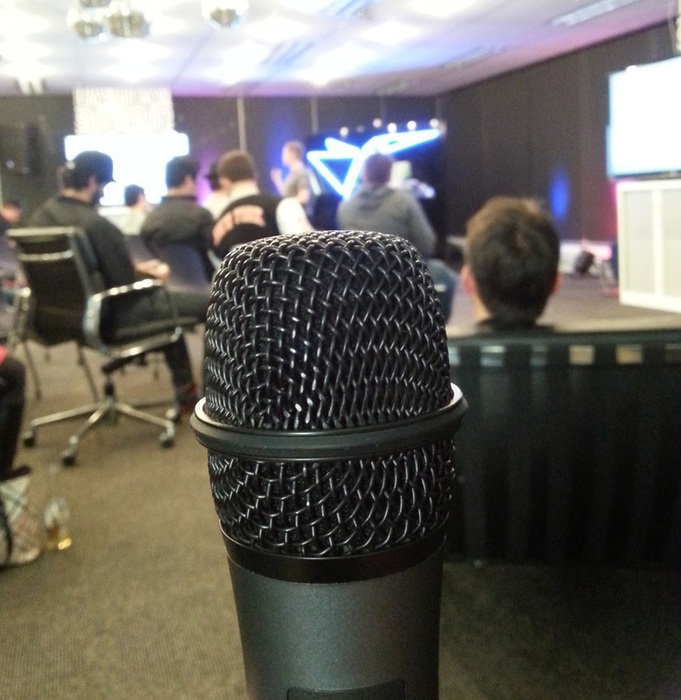
 CC-BY-NC-SA 4.0

Note: 

A few weeks after pycon I gave this talk at a local Sydney php user group. I
did the talk, saying the context was that "it happened to a friend of a friend
of mine". But that was bull. It was an outright lie, but it let me get past
the context and into the content.

And now I'm here, revisiting this question. Does context matter? Does the human
story around why the tech exists matter? Does anyone care about what happened
to put me in this situation?

Yes. Yes it matters. It matters more than the tech. You can google a bunch of
things around how migrate code and how to make copies and how to do all that
push button get repo stuff. But if by telling my story it helps a single person
going through the same thing I did feel less alone in what was a pretty crappy
situation, all things told, then it is absolutely worth it.

---

 

Note: So I'm in an office in Sydney, as you do. It's early 2015. It's a Tuesday. The month earlier
I'd come back from doing a talk at an international conference about a project
I'd been working on at the company for just over a year at that point.

The project had gotten some traction at the conference. I'd gotten some really good feedback, and
was beavering away, making improvements in the weeks since.

It's a few minutes before standup, and I've just cracked this functionality hack
in elastic search that meant that we could store some complex data within the system
that meant that a function we wanted to implemented was now achievable.

I'm bouncing on my feet at this point, because it was a breakthrough three or four
layers down the stack that meant that we were about to crack full-production readiness .

... 

Just as standup starts, I get called into the CTO's office.

---

 
Note: 
Effective immediately, I am no longer employed at the company. My role has been made redundant.

A quarter of the department was walked out that day. By the end of that year,
most of who remained left of their own accord.

I was shattered.

I'd been working there for four years. It was my first role that I'd actually enjoyed working at.

I'd been learning so much, and was actively encouraged to share that with others. Which is a huge difference from the closed source roles I'd previously been in

I was a poster child for this place. Literally, on posters.

Which is really fun to see your face on a google ad, advertising an employer that has just fired you.

---

 

Note: I was lucky. I was able to find a new job really quickly. I reached out to a friend and former coworker

and they were able to get me an interview with their employer the next day.

I was also lucky about the fact that I got let go **after** my big international debut.

I know some people that haven't been so lucky. Heck, it took me months to stop using "we" when talking about that employer. I can't even imagine how you'd go about giving a spruik to a place that just turfed you. I've seen people give that talk, and it's heartbreaking to watch.

Time passes, and I settle into my new role. Then I start considering what I could do about the project I left behind.

---

 <!-- .slide: data-background="#000"-->

Note: 
And thus the original talk content continues

---
 <!-- .slide: data-background="#000"-->

Note: 

In this case, the project is open source, in a public repo on github. So the solution should be easy, right?

---
 <!-- .slide: data-background="#000"-->
# "Just fork it!" <!-- .slide: class="center" -->

Note: Well.. no.
---

 <!-- .slide: data-background="#000"-->
# GitHub doesn't do "forking" <!-- .slide: class="center" -->

Note: They don't implement the traditional forking methodology, regardless of the marketing you might read.

We'll get to that

---

 <!-- .slide: data-background="#000"-->
## GitHub Faux-forking <!-- .slide: class="center" -->
## Licensing
## 'Competitor' Code
## Dead Source

Note: But there's even more issues

---

 <!-- .slide: data-background="#000"-->
# GitHub Faux-Forking <!-- .slide: class="center" -->
## 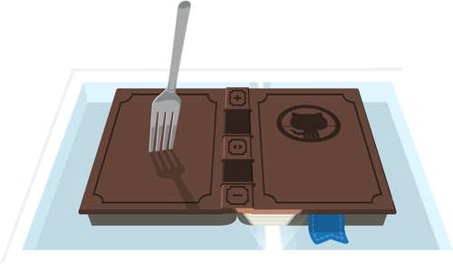
Note: Github's 'forking' isn't the same as traditional forking

Sure, you get a copy of the code under your username, but it's not a full working copy with all the bells and whistles of a github repo
---

 <!-- .slide: data-background="#000"-->
# Limitations <!-- .slide: class="center" -->
## Parent Lock-in <!-- .element: class="fragment" -->
## Default Pull Requests <!-- .element: class="fragment" -->
## No Issue Logging by Default <!-- .element: class="fragment" -->
## Commits Don't Count <!-- .element: class="fragment" -->

Note: There are limitations

Parent - perma link to source, there's always going to be a little "Forked from" link at the top

PR - new PRS defaults to parent, accidently attempt to merge upstream. Which gets fun if you don't notice, and accidently submit code up, because PRs can't be deleted.

Issues - issues are disabled by default on forks, but can be enabled.

Commits - If you're familiar with my hatrack talk, you'll know that I'm all about the contributions graphs. For forks, anything to do, any edits you make, they don't count. At all.

---

 <!-- .slide: data-background="#000"-->

# Licensing <!-- .slide: class="center" -->

Note: Licencing is fun, especially because laws around this stuff depend on the country you're in.

It also depends on the site you're on.
---
 <!-- .slide: data-background="#000"-->
### GitHub Repo w/out LICENCE? <!-- .slide: class="center" -->
### All Rights Reserved <!-- .element: class="fragment" -->

 https://help.github.com/articles/licensing-a-repository/

Note: For code on github, if the repo does not have a licence

All Rights resreved: no one may reproduce, distribute, or create derivative works from it. At all.

---
 <!-- .slide: data-background="#000"-->
## choosealicense.com <!-- .slide: class="center" -->
## opensource.org/licenses

Note: There are many places where you can get information about what lience to choose

This isn't a licencing talk, so I defer to these resources.

But of note, different websites have different default licence rights

---
 <!-- .slide: data-background="#000"-->
#### &lt;aside> <!-- .slide: class="center" -->
### StackOverflow
### Code? MIT
### Everything else? CC-BY-SA
#### &lt;/aside>

 [A New Code License: The MIT, this time with Attribution Required, StackOverflow Meta](https://meta.stackexchange.com/questions/272956/a-new-code-license-the-mit-this-time-with-attribution-required?cb=1)

Note: Last year stackoverflow changed their default licencing arrangements. Since the dawn of time, StackOverflow answers have been Creative Commons Share Alike. Which means you can share and adapt, but you must attribute.

But as of March 2016, all code is MIT licenced. You are released from having to copy the MIT licence text in your copy, as long as you give attribution to the original author

Speaking of licences, that gets fun when you copy code
---
 <!-- .slide: data-background="#000"-->
# 'Competitor' Code <!-- .slide: class="center" -->
## &copy; Their Company 2014 <!-- .element: class="fragment" -->
## &copy; Your Company 2015 <!-- .element: class="fragment" -->

Note: Especially if it's from a competitor

If you take a copy of their code, depending on their licence you probably have to keep their Copyright information

Which means you end up having to append yours.

And depending on how rivalrous your companies are...

---
 <!-- .slide: data-background="#000"-->

 

  <!-- .slide: class="center" -->
Note: Yeah.

---

 <!-- .slide: data-background="#000"-->
# Dead Source <!-- .slide: class="center" -->
## 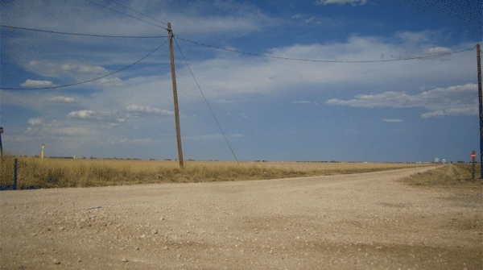

Note: And then ther'es dead source

If the source upstream is dead, then that's an inhibitor of innovation

No merges ever, no changes. And you can't easily communicate this fact, either.

Your fork might be churning away, but people up stream don't know.
---

 <!-- .slide: data-background="#000"-->

# So what could you do? <!-- .slide: class="center" -->
---

 <!-- .slide: data-background="#000"-->
# Ask. <!-- .slide: class="center" --> <!-- .slide: class="center" --> <!-- .element style="font-size: 5em" --> 

Note: Ask.

There are many possible solutions to this problem

You could transfer of ownership of the code

They could update their code to reference your active fork

And there are other otpions

---

 <!-- .slide: data-background="#000"-->
# But why should you care? <!-- .slide: class="center" -->

---
 <!-- .slide: data-background="#000"-->
# PHP 7 <!-- .slide: class="center" --> <!-- .slide: class="center" --> <!-- .element style="font-size: 5em" --> 

Note: PHP5 will die. PHP4 shuold already be dead.

When everyone upgrades, the old code needs to come along, or it'll be lost.

Not just PHP

---
 <!-- .slide: data-background="#000"-->
# Ruby 1.8, 1.9.3 EOL <!-- .slide: class="center" -->
## 
 Example: <code>pry-debugger</code>
 <!-- .element: class="fragment" -->

Note: Language versions that have reached end of life are also a problem, especially when the changes in the new versions aren't backwards compatible

An example of this: pry-debugger, a REALLY COOL inline debugging tool - only works with 1.x

Was the go to debugger now not so much

It was the GO TO for ruby devs, but It doesn't work on anything in Ruby 2 up

There was a time when the readme didn't mention this, and the code just didn't work, and ruby devs didn't know what to use

Now the readme clearly states that you should use ByeBug if you're on Ruby 2

By the way, you really shouldn't be using Ruby 1.8 or 1.9 any more, they're end of life and no longer secure. Move up to Ruby 2. it's shiny

---
 <!-- .slide: data-background="#000"-->
# Python 3 <!-- .slide: class="center" -->

Note: And yeah, I guess Python 3 also has to be considered.

Especially since there's a countdown timer now on the end of life of Python 2

Once 2.7 goes EOL, then projects can't be used any more.

---
 <!-- .slide: data-background="#000"-->

# Porting is boring <!-- .slide: class="center" -->
## but it's imporant <!-- .element: class="fragment" -->
Note: 

And I get it, porting is boring.

There's no satisfaction in it

Especailly when there's a long tail of dependencies prohibit porting

But if code isn't ported, then you're actively encouraging people to run insecure versions of languages and are inviting security issues.

---

 <!-- .slide: data-background="#000"-->
# Non-Language Dependent Factors <!-- .slide: class="center" -->

Note: There's other things that could happen

---

 <!-- .slide: data-background="#000"-->
# Google Code <!-- .slide: class="center" -->
## Read Only

Note: Like, proper read only. Back in 2015, it was in the process of shutting down,
Now, there are pages that don't work, the export utilities don't work... Yeah.

---
 <!-- .slide: data-background="#000"-->
# SourceForge <!-- .slide: class="center" -->
## 👾

Note: Other source control places have had some ... issues

Like feigning updates by repackaging binaries with spyware.

Allegedly 

---

 <!-- .slide: data-background="#000"-->

# Projects are going to need attention <!-- .slide: class="center" -->

Note: 'active' meaning someone's using it, who's moving to the new structure

The maintainer may be off growing grapes

And Hostile Forks Don't Help

---

 <!-- .slide: data-background="#000"-->
# So what can you do? <!-- .slide: class="center" -->
## Abandon Responsibly <!-- .element: class="fragment" -->
## Restore Dead Code <!-- .element: class="fragment" -->

Note: Abandon If you have a project

Help restore if you see a project

---
 <!-- .slide: data-background="#000"-->

# Abandon Responsibly
## Update your README <!-- .element: class="fragment" -->
## Mark as inactive <!-- .element: class="fragment" -->
## Link to a better solution <!-- .element: class="fragment" -->
## Leave a forwarding address <!-- .element: class="fragment" -->

Note: Documentation is your friend

You don't want people coming across your stuff when there's something better

You really don't want people using code that has deps with known vuls

Link 

Forwardning - point to the new people. Because may or may not want your email on code you wrote and people emailing you a decade later.
---
 <!-- .slide: data-background="#000"-->

  <!-- .slide: class="center" -->
## unmaintained.tech

Note: 
Because github readme badges are cool, there's this one that includes a link to the site unmaintained.tech which includes a short manifesto which is helpful if you can't find the words to add to the readme yourself
---

 <!-- .slide: data-background="#000"-->
# GitHub Ownership Transfer <!-- .slide: class="center" -->

Note: GitHub allows you to transfer repos around, and the process is relatively straight forward

Work out where the repo is going, a new organisation or an existing one.

Make sure the new maintainer is an admin of both

Then transfer the repo

And remember to remove the admin from the original organisation, that could lead to fun if you don't want them to have perminant admin rights.

---

 <!-- .slide: data-background="#000"-->
# Benefits <!-- .slide: class="center" -->
## All the PRs, Issues, Commits stay <!-- .element: class="fragment" -->
## 301 Redirects to new URL <!-- .element: class="fragment" -->
## You get the commit bit :D <!-- .element: class="fragment" -->

Note: There are some really good benifits to this over forking

All the PRs and issues stay intact

301 - the 301 is very nice. Anyone trying to go to the old URL will get redirected to the new one. It also works for the git repos on disk too

This may break if you attempt to overload the old namespace, however.

Commit - also, you get the commit bit, which is really nice
---

 <!-- .slide: data-background="#000"-->

# Restore Dead Code <!-- .slide: class="center" -->
## Check their README <!-- .element: class="fragment" -->
## 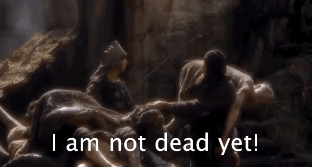 <!-- .element: class="fragment" -->

Note: you really need to check before trying anything. Some things to look for

---
 <!-- .slide: data-background="#000"-->

# Restore Dead Code
## Check their README
## Is it inactive? <!-- .element: class="fragment" -->
## Is there a better solution? <!-- .element: class="fragment" -->
## Could you be the new maintainer? <!-- .element: class="fragment" -->

Note: check the history.

Check if the latest release was stable.

Check if they've mentioned anything in the latest notes

Check if they suggest anything more in their read me

See if they are looking for someone

Do they have an IRC channel? A mailing list?

---

 <!-- .slide: data-background="#000"-->
# There's probably more factors in play <!-- .slide: class="center" -->

Note: It's never just that simple.

Politics 

Friendships 

Pet Projects

---

 <!-- .slide: data-background="#000"-->
## Go to rule: <!-- .slide: class="center" -->
# Ask.

Note: the ability to openly communicate is one facet of opensource that makes it amazing

They've put in the effort to make a solution that's usefulness is expiring

Help make their solution timeless.

---

 <!-- .slide: data-background="#000"-->
# Thanks! <!-- .slide: class="center" -->
 

Note: Thanks! /me mock cheers

---

## &nbsp;

Note: 

*deep breath*

That was really really good to get off my chest.

Also, a term I didn't know at the time but do know now, is "GitHub Generation"

I'm absolutely github generation, so a lot of what I spoke on was GitHub oriented.

There's so much more to this topic, you have no idea.

---
#### You should totally go see: <!-- .slide: class="center" -->
## Passing the Baton: Succession planning for your project talk
### VM Brasseur
### This afternoon!

Note: Lucky, the conference provides!

If you're interested in this stuff, and around the planning of such things
You really really need to go see VM Brasseur's talk this afternoon.
Like really really need to.
---

# What did I choose? <!-- .slide: class="center" -->

Note: For those playing at home, what did I end up going with for my project?

A combination of transferring ownership and marking things as "no maintenance intended"

If you are interested in what the project was, the code still exists.

---

### github.com/WhereSoftwareGoesToDie <!-- .slide: class="center" -->

Note: 

This organisation name wasn't chosen by me, it was deleted by one of my old coworkers. I think it perfectly encapsulates our thoughts on the things we'd created.

---

 

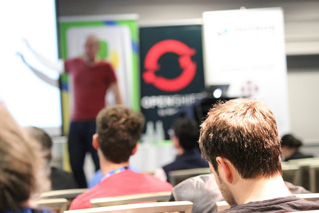

  <!-- .slide: class="center" -->
 [Flickr](https://www.flickr.com/photos/developersteve/albums/72157656549888386)

Note: Back to brisbane, back to the 2015, back to that Sunday afternoon.

Trying to find how to talk about that talk was all consuming, it was making so anxious that I must have had a breakdown.

I don't actually remember, because I was so consumed by the overwhelming emotions

I've even had to go and research what happened to me, by asking people who were there, I was so out of it.

That sunday afternoon, I didn't look right. I was stressed out in the break leading up
to the talk, and I was trying to edit my slides at the last minute. Pro-tip, this never ends well

One thing I do distinctly remember is making my way around to the Kennedy room, laptop in hand, and looking down the corridor, seeing the lecturn, and having the whole dolly zoom effect happen, and going

NOOOOOPE 

And you know what the immediate response was?
---

### It's okay. <!-- .slide: class="center" -->

Note: 

It's okay. Come over here and sit down.

They'd planned for this. I didn't have to do anything I wasn't absolutely comfortable with.

So immediately, waves of relief start washing over me.

And then the regret and anxiety set in.

I'd just let everyone down. They knew I was going to fail. I'm a terrible person. I shouldn't be here. I don't deserve to be here. I want my mum. I want to go home.

Thankfully only a few moments into this sinking whirlpool of emotions, I was asked if I was okay, and if some freshair would be helpful
---

 

  <!-- .slide: class="center" -->
 [Wikipedia](https://commons.wikimedia.org/wiki/File:Statue-of-King-George-V.jpg)

Note: it was that trip outside that saved me from a breakdown. I mean, I wasn't okay, but I knew I would be.

What started as 'let's get some freshair' turned into 'let's go into full distraction and self-care mode and go get some icecream'. The amazing puppies we met along the way was only icing on the cake.

I came back to the conference after that. I sat in the back of the room for the end of day lightning talks and closing address... but I came back.

---

 

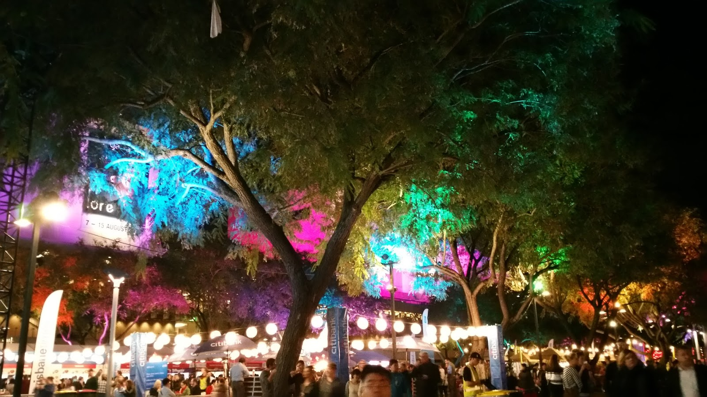

  <!-- .slide: class="center" -->
 [Espresso and Matcha](http://espresso-and-matcha.blogspot.com.au/2015/07/brisbane-noodle-night-markets-southbank.html)

Note: that night, I didn't go home. I could have, but I didn't.

I went out with a group of people to the noodle markets over in Southbank

My phone was going off by this point. People messaging me asking where I was, if I was okay. There was word that something was wrong. One person heard that I got gastro (erk). Having the constant buzzing and pinging made me feel even worse

By mutual agreement, I give my phone to a friend to hold onto so I wouldn't keep getting alerted and distracted.

It also meant I couldn't leave the markets without being able to be okay travelling back. I really needed that.

That evening was really nice. I ate.. something tasty, I can't remember. But it was great just to be around people who wanted me to be around. At the time, that was a rare thing for me.

---

 

  <!-- .slide: class="center" -->
 CC-BY-NC-SA 4.0

Note: the next day, I came back. I could have hid, but I didn't. I wanted to be around these amazing people.

The Monday and Tuesday were development sprint days. That was the sprints that I was introduced to BeeWare. And the rest is history.

If I had left, I wouldn't have come back. At all. I would have felt that I couldn't show my face again.

But I did come back. And I came back the next year. And now I'm here.

---

 

  <!-- .slide: class="center" -->
 CC-BY-NC-SA 4.0

Note: it hasn't been smoothsailing for me since Brisbane.

Anxiety is just the start. I've had a pretty terrible time of late, too.

But I've also had some good things happen. One of which is the fact I've just started a new job at Divio, doing Python and Django as a day job. It's early days yet, but it's amazing to be able to work with the tech of the community I adore so much.

After Brisbane, I sought out a professional about dealing with my anxiety.

Seriously. If you need to talk to someone, please do.

Australians covered under medicare, you can get rebates on seeing a professional that can deal with your mental health issues, just as you could for physical issues.
---
 

  <!-- .slide: class="center" -->
 CC-BY-NC-SA 4.0

Note: I've been seeing a professional for a few years now, and it's helped me a lot.

But I still get anxious. Especially over talks. And **especially** this one.

I've had many sleepless nights just trying to work out how to best word this talk. I can yell about emoji until the cows come home. but this talk is vulnerable. This talk is **hard**

Being asked by Richard to keynote was a last minute thing. I wasn't his first choice, but I knew I could do it. And I wanted to. That's a big thing.

Plus, the fact that a talk slot opening up because of a speaker dropping out about a speaker dropping out of a talk... I couldn't help but use this oppurtunity to give the talk I couldn't give at this conference two years ago.

---

 

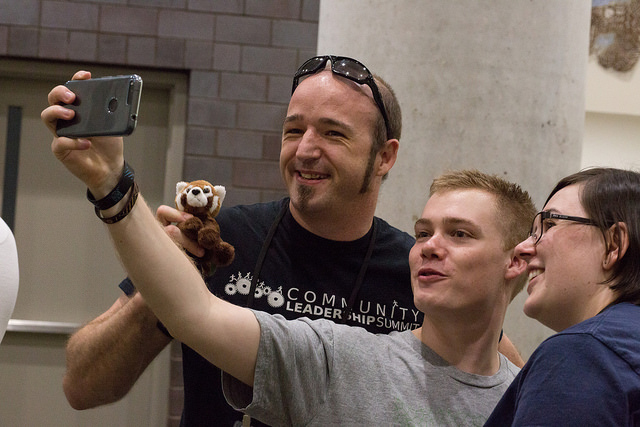

  <!-- .slide: class="center" -->

 [Flickr](https://www.flickr.com/photos/oreillyconf/34151250760/in/album-72157681448852001/)

Note: 
TODO "woman has emotions, News at 11"

I'm now an accomplished speaker and member of this community

The other talk from Pycon AU 2015, the one I actually gave? The hat rack talk? I've given that as a keynote. Twice.

I've helped run confernces all over the world, and spoken at more to boot. I've tried to give back to this amazing community what it gave to me. It can never me enough, but I hope it's something.

---

 

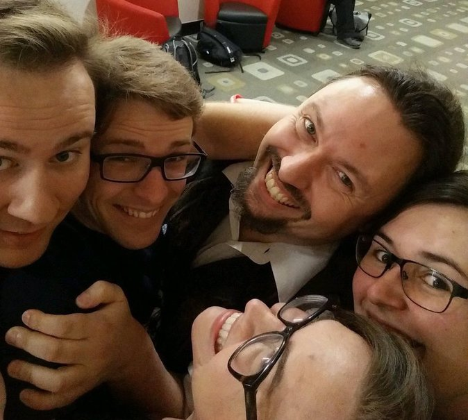

  <!-- .slide: class="center" -->
 [Twitter](https://twitter.com/chrisjrn/status/861230190336376832)

Note: what has helped me through out all of this is the community. Just having
people who want me around is more helpful than you could ever imagine.

Of note, this particularly lovely group of people here. You may notice a Paul Fenwick in there,
who I mentioned right at the start of this talk.

With his permission, I want to share a small story that shows again just how the little things
can help some feel welcome and included in a community.

I often get the oppurtinuty to go to conferences in communities I'm not a part of,
and one of those was devworld.
---

 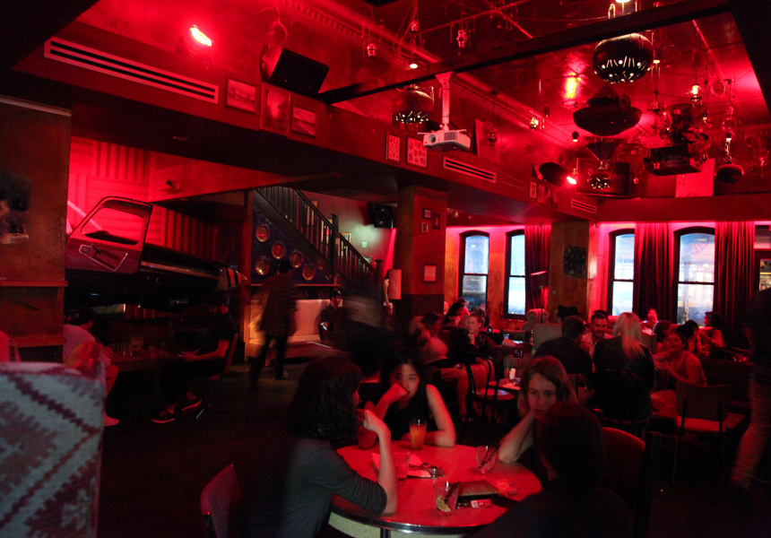

 [Broadsheet Melbourne](https://www.broadsheet.com.au/melbourne/bars/bimbo-deluxe)

Note: So I'm in a pub in Melbourne that has a plane in it, as you do. It's late 2015, and I've found
myself at the speaker dinner for devworld.

The only reason I'm at devworld is because a) i got offered a ticket, and b), after seeing the speaker lineup, I say, and I quote: "OMG OMG OMG Paul Fenwick is keynoting devworld I must go!"

I remember Paul keynoting my first ever open source conference, and I regretted not being able to formally say hi.

I think there may have been a "meeting the queen moment" where we all lined up and shook his hand, but I doubted he remembered me.

So I'm at the dinner, and Paul arrives. And I get the oppurtinity to say hi. And I tell him about how I've seen him speak before, and a major reason why I'm at devworld is to see him.

He later told me that it was my enthusasm for looking forward to hearing him speak that made him feel more at ease in his role at the conference. And this is coming from a long time public speaker.
---
 

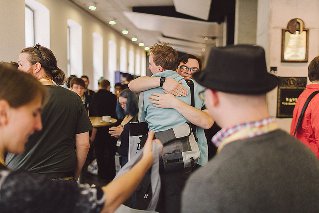

  <!-- .slide: class="center" -->

 [Flickr, CC BY-NC 2.0](https://www.flickr.com/photos/140681500@N07/26064158351/in/album-72157666565815855/)
Note: 
Letting people know that you have been looking forward to seeing them, wishing them luck with their speaking, and actively enjoying their company.. that is what makes a great community.

Going from just an event name that you've heard of before, into an annual pilgramage to see friends
and meet people and gather with your people... that is what makes an amazing community.

Having a group of people that actively help each other, either by activey volunteering
to help run events, and reaching out those in their community that need just a little bit of help, that's what makes an incredible community.

---
 

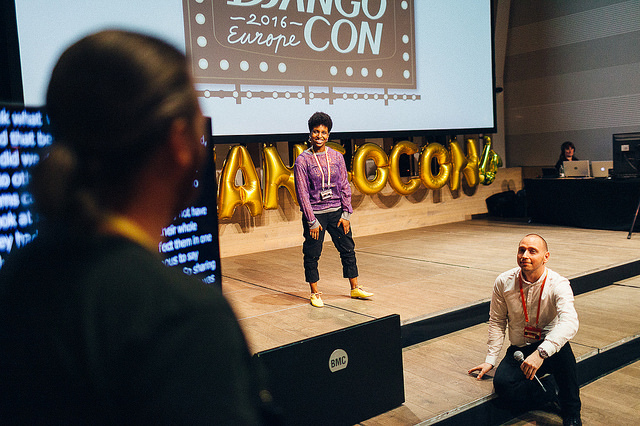

  <!-- .slide: class="center" -->

 [Flickr, CC BY-NC 2.0](https://www.flickr.com/photos/140681500@N07/25781125034/in/album-72157666565815855/)

Note: And it doesn't have to be big hugge things, it can be little things that make people feel included.

If a speaker asks for questions, making sure there's a question, even if it's from you.

Offering to sit with someone at lunch. If you're local, suggesting a local cafe or restaurant.

Little things to help attendees, like having quiet room, ensuring a ramp or a lift is available to rooms for wheelchair, or even just making sure someones name spelled correctly.

Having stenographers or sign language intepretors. Having non-alcoholic beverages at dinner. Vege options and kosher meals.

Volunteering to help out. Being there if someone needs a hand. Or just being there, actively listening.
---

 

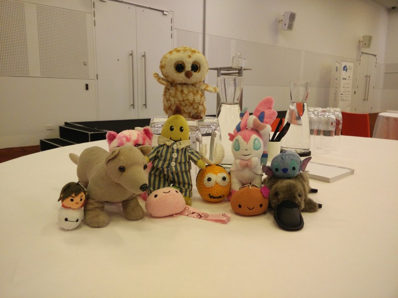

  <!-- .slide: class="center" -->
 CC-BY-NC-SA 4.0

Note: Because this community is amazing.

I mean take this picture. This is a plushie group photo, because there are many people that have travelling
stuffed animals that they take with them, and even have on the lecturn during their talk.

[possibly moniyum ref]

I've not just met people through this community, I've made friends. Good friends.

And this is something I've never had before. I've never had a group of people that want me around.

I was told once that I can't consider the people I meet, I know, and who I adore at events like this my friends.

That is wrong.
You may only see them once a year. You may only interact on bug trackers, or on IRC.

But they can be your friends.

And it's because of these amazing people that I'm still here today. And i'm grateful.
---
  
  
  
  

#### glasnt.com/talks

Note: thank you for your time.