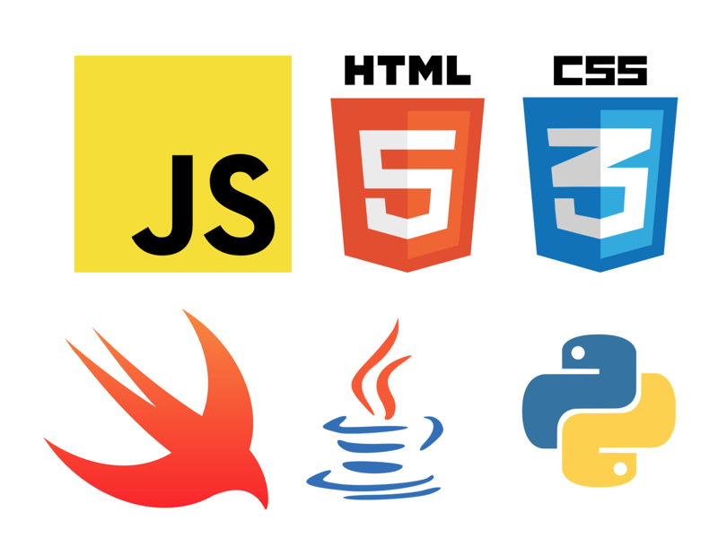
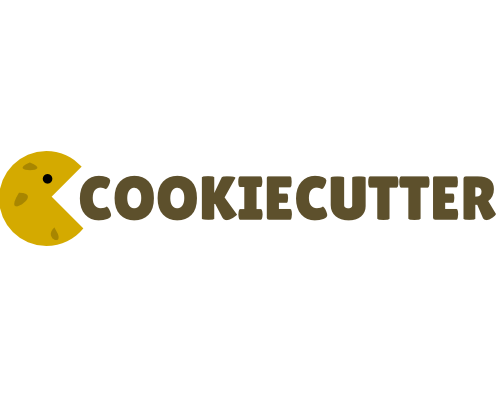
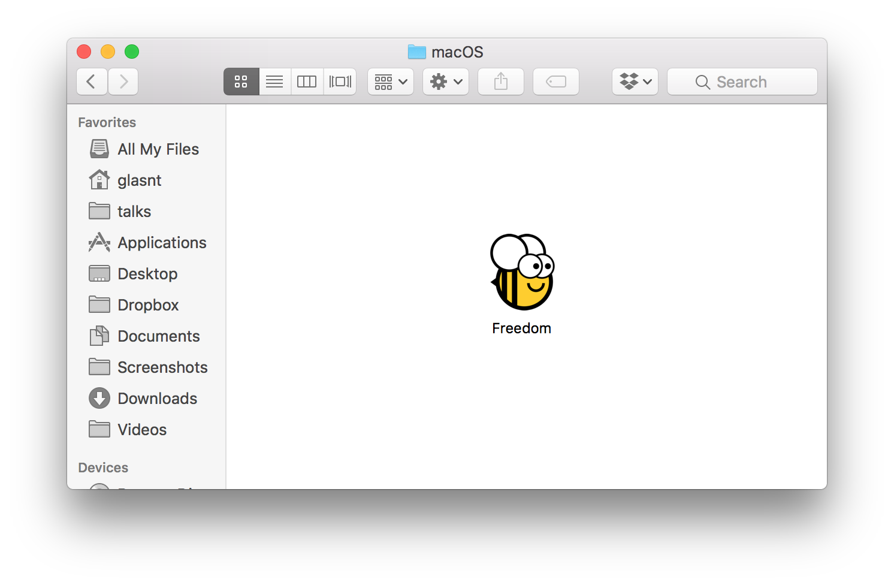
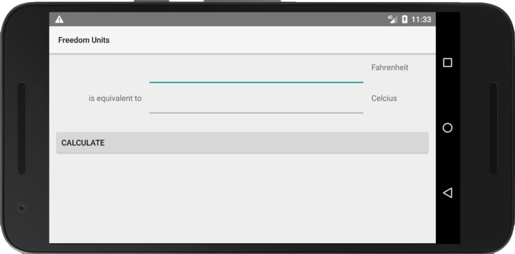
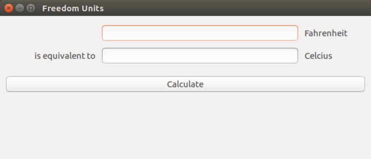

background-image: url(images/test-pattern.png)

???
---
class: title

# ...Bees?
## GitHub Constellation, Sydney


???

---
background-image: url(images/ghosa-one.jpg)

???

Back in May, GitHub ran an Open Source Alley at OSCON. For half a day, open source projects could get a table at their booth to showcase their project, and a time slot to give a short presentation on their project

---
background-image: url(images/ghosa-two.jpg)

???

Beeware was fortunate enough to be one of these projects, and we were able to showcase our work and share what our project is all about

---
class: title


???

Beeware is series of application libraries, tools and widgets that let you right native cross platofrm applications in python

Consider the conundrum: you want to write an app

You're an australian developer working with americans, and they keep telling you the temperative in farenheight, but you are more familiar with Celsius. 

So you want to build a temperature converter

---


???

So here's the mockup of the app. We have a field where we enter the temp in F, and then a field which shows us the temp in C. Press the buttom, and the value is calculated and placed in the C field. 

So we know what we want our app to do, but how do we go about writing it?

Well it depends what platform we wantt o target. 

---


???

If you want a web app, you're going to have to use Javascript, html, and some css for styling

If you want to build an iphone app, you're going to need swing

If you want an andoird app you're going to need java

And if you wanted your app to not just be client side, but server driven, you're going to need python, or something similar. 

And that's not even considering if you want a native desktop application on Windows or Linux

---
class: title


???

This is where beeware comes in. Instead of having to learn half a dozen rpogramming languages and markup dialects, we can just use one. 

---

class: title
# github.com/python/cpython


???

And it's all in python. 

Why python?

Python is a highly versitile language. Accessible to newcomers, but with enough grunt for the heavy lifting, powering sites like Instagram

It's desgined for teaching, works on every platform, and it's free and open source software


Fun fact: python has recently migrated to GitHub from a self-hosted mercurial repository


---

# &nbsp;
# github.com/pybee/toga


???

To see just how beeware works, here's an example application built in Toga

Toga is a widget toolkit. We define an application with widgets declared by toga, and when it comes time to run the code on the host platform, we use the toga abstraction to call the base widgets. 

Apple buttons on iOS, Android buttons on android, and so on. 

The reason to do all of this is that we want our apps to look like they belong. 

If any user can tell that the app they're using is made with beeware, we've failed. 

---
```python
import toga

class Freedom(toga.App):
  def calculate(self, widget):
    try:
      self.c_input.value = (float(self.f_input.value) - 32.0) * 5.0 / 9.0
    except Exception:
      self.c_input.value = '???'

  def startup(self):
    self.main_window = toga.MainWindow(self.name)
    self.main_window.app = self

    c_box = toga.Box()
    f_box = toga.Box()
    box = toga.Box()

    self.c_input = toga.TextInput(readonly=True)
    self.f_input = toga.TextInput()
    # ...
```
---
### &nbsp;
```python
    # ...
    c_label = toga.Label('Celcius')
    f_label = toga.Label('Fahrenheit')
    join_label = toga.Label('is equivalent to')

    button = toga.Button('Calculate', on_press=self.calculate)

    # .. styling ..

    f_box.add([self.f_input, f_label])
    c_box.add([join_label, self.c_input, c_label])
    box.add([f_box, c_box, button])

    self.main_window.content = box
    self.main_window.show()

def main():
  return Freedom('Freedom', 'org.pybee.freedom')

```
---
# &nbsp;
```shell
$ pip install toga
$ python -m freedom
```
---
# &nbsp;
```shell
$ pip install toga
$ python -m freedom
```


---
# &nbsp;
# github.com/pybee/briefcase


???

To be able to take our app away with us takes a little bit more work. 

This is where briefcase comes in

Briefcase helps us pack up our applications in a way we can transport them around. 

There's a little bit of template work required before we can get there, thogh. 

Thankfully, we have a app that can help us here. 


---

# &nbsp;
# github.com/audreyr/cookiecutter



???

At beeware we don't just shave bespoke tibettan yaks. We are more than happy to take use store-bought yaks. 
This is the case with cookiecutter

With cookiecutter, you can easily create a template with replacement fields to create a structure for your app, project, receipe, anything you like

---

# &nbsp;
```bash
$ pip install cookiecutter briefcase
$ cookiecutter https://github.com/pybee/briefcase-template

app_name [appname]: freedom
formal_name [App Name]: Freedom
description [An app that does lots of stuff]: Units
author [Jane Developer]: Katie
author_email [jane@example.com]: katie@glasnt.com
bundle [com.example]: org.pybee
# ...

$ cp freedom.py freedom/app.py
```
---
# &nbsp;
```shell 
$ python setup.py macos -s
```


---

---

# &nbsp;
```shell 
$ python setup.py ios -s
```

---
# &nbsp;
```shell 
$ python setup.py android -s
```

---
# &nbsp;
```shell 
$ python setup.py linux -s
```

---
# &nbsp;
```shell 
$ python setup.py windows -s
```

---
# &nbsp;
```shell 
$ python setup.py django -s
```

---
class: title
# &nbsp;
# This presentation

## Yes, really. 

???

Really :)


github.com/pybee/podium

---
class: title

# github.com/pybee/podium


---
class: title

???

Ta da!

Here's the thing so. 

This is only part of the beeware story

It's not just code. 

---
class: title
# ... Bees?

???

Bees. 

---

class: title

# Apiarists tend to bees

???

Our nomclemcure about different levels of members is just as fun as our project names

A bee is anyone that works on the project. Core team members tend to the bees, so they're apiarists. 

---
class: title
# Bees need to learn somewhere

???


For anyone who knows github like the back of their hand, they don't bat an eyelid when they come across a bit
of code that needs a fix

They know exactly how to get to github

get to the code repo

create a fork

clone the fork to their local machine

create a branch

make a commit

push the branch to their fork

and create a pull request based on their branch

---
class: title
# Bees need to learn somewhere

???

And sure, there's documentation on github about all these concepts

but there's nothing like actually sitting down with someone to learn this for the first time

Pair programming for someone just starting out, who doesn't know where to look, or how to describe the things they want to know about, is an absolute treasure

If you're lucky enough to be already working in a dev job with a senior programmer that is willing to do this sort of thing, then good for you

But if you don't have that, you're stuck fumbling around. 


---
class: title

# Sprints

???

This is why we run sprints

I'm using the term sprint here not in an agile sense, but in the Python-world term

At python and django conferences, after say, 1 day of workshops and a few days of talks, organisers will normally hold onto some of the conference space, or a nearby venue, kitted out with power and internet, and let attendees use the space for a few days after the event as a hacking space

The time is normally unstructured, but it's an absolutely amazing feature of many of the conferences I attend

You've spent a few days meeting new people and listneing to talks, and your brain is swarming with ideas. I mean, you've travelled how far to be with these people, so why not take advantage of their physical locality?

Why not use the days immiedately following to take a look at that new python trick you learnt about, or help out with a project you're interested in while the people from that project are around

---

class: title

# Apiarists tend to bees

???

This is something that we the beeware team have found to be amazing, not just for introducing people to our project and gaining contributors, both just at sprints and longer term, but also introducing first timers to open source contribution in general

One of the first sprints we ran, I remember a young woman started with having to create her own github account, and by next day, she was not only submitting PRs, but also helping other people around her with the GitHub basics. 

---

class: title

## ... with just a little incentive.

???

And sure, some people are happy to do this out of the kindness of their hearts. 

Some do it because they want to help teach the new generation

Some for those little green squares on their github profile

But at beeware, we have something a bit more substantial

---

background-image: url(images/yak-shaver.jpg)

footnote: [99% Invisible: 'Coin Check'](https://99percentinvisible.org/episode/coin-check/)


???

Thanks to generous funding from MaxCDN and RevSys, we've made challenge coins

Anyone who contributes to beeware gets a nice shiny

The A side has Tibirius with Confirmed Yak Shaver, and the B side has Brutus with the project name and tag line

Any contributions count. It doesn't have to be code

We've given out coins for people giving talks on beeware, helping fix our tutorials, giving us marketing and fundraising advise, and so much more. 


---

class: title

# Rewards for helping those shave

???

Not only that. with thanks to github for the funding for the coin pressing, we have a second coin
---

background-image: url(images/yak-herder2.jpg)

???

The yak herder coin is for those that help other people earn their yak shaver coin

We've given this out to those who help other bees at sprints, our apiarists who are always helping review pull requests, and the like

---
background-image: url(images/bee-map.png)

???

As part of conferences apiarists have spoken at, we've run sprints all over the world, on five continents
---

TODO broken travis, webhook, beekeeper, etc. 


---

TODO

ping for lca bees
ping for pycon sydney bees


# 

---
class: title

# Thank you!

???
