 

 <!-- .slide: class="center" -->

🔊🔜
Note: now, something to wake you up.

Feel free to sing along....
---
<video src="foxpigchickenintro.webm" data-autoplay controls height="600px"></video>

<a href="https://twitter.com/ManxomeMia/status/926660732162154496" style="color: lightgray">Mia Harrison, Twitter</a>

Note: data-autoplay
---
 <!-- .slide: data-background-image="pictures/beedeck.jpg"-->

## &nbsp;
<h1 style="color: white; -webkit-text-stroke: 2px black;">Protect yourself against the bees</h1>

 

Note: Kia ora!

---
 

 <!-- .slide: class="center" -->
---
 <!-- .slide: data-background-image="pictures/beepurple.jpg"-->

Note: I like bees
---
 <!-- .slide: data-background-image="pictures/beepurrrr.jpg"-->
---

 <!-- .slide: data-background-image="pictures/bumblewhite.jpg"-->

Note: bees are cool

You know what else is cool?

---

 

  <!-- .slide: class="center" -->

Note: bee emoji

but the bee emoji may not look like this to you

Pūatahanga 

Pu-a-tahanga 

---

 

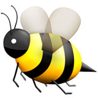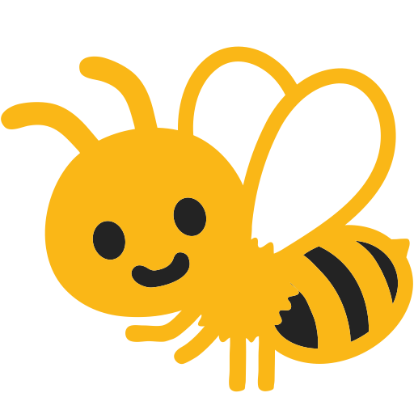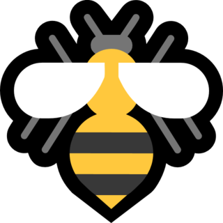

 <!-- .slide: class="center" -->
<h3 style="color: white !important">.</h3>

Note: depending on your platform, you'll see bees differently

---

 

 <!-- .slide: class="center" -->
<h3>iOS 10.3</h3>
<h3>Android 4.4</h3>
<h3>Win 10</h3>

Note: if you're on iOS, Android, or Windows, you'll know these bees

But not all bees are created equal

It depends on your platform

---

 

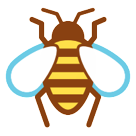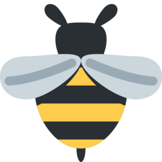

 <!-- .slide: class="center" -->
#### HTC Sense &nbsp; WhatsApp&nbsp; Twemoji &nbsp;Firefox OS &nbsp; Win 10

Note: A number of the bees for some platforms are fine. They look like bees. They're good bees.

Some of them, however...
---

 

 <!-- .slide: class="center" -->
### iOS 10.3

Note: the standard apple bee. Sure, it looks like a bee, a bit cartoon, but okay. 7 out of 10
---

 

 <!-- .slide: class="center" -->
### EmojiOne 2.2

Note: This bee is also cute as heck. This one is from EmojiOne, a once free, not freemium open source emoji set

But this bee, while cute, is superseded.

---

 

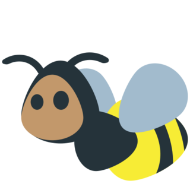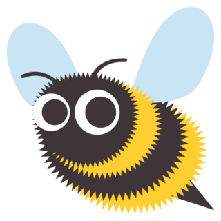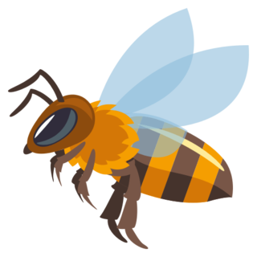

 <!-- .slide: class="center" -->
### 1.0 &nbsp;&nbsp;&nbsp; &nbsp; 2.0 &nbsp;&nbsp; &nbsp;&nbsp; &nbsp; 2.2 &nbsp; &nbsp; &nbsp; &nbsp; 3.0
#### EmojiOne

Note: The emojione bee has gone from buzzy, to fuzzy, to cute af, to .. sadly anatomically correct.

---

 

 <!-- .slide: class="center" -->
## Android 4.4

Note: this bee is my favourite, he's just so happy to see you. 10 out of 10, keep buzzing my friend.

Sadly, as you may have heard or seen, the cute blob android emoji have been replaced with 'normal' emoji...\

I say 'normal', because the faces are very much styled similar to the apple emoji.. .

and yet...

---

 

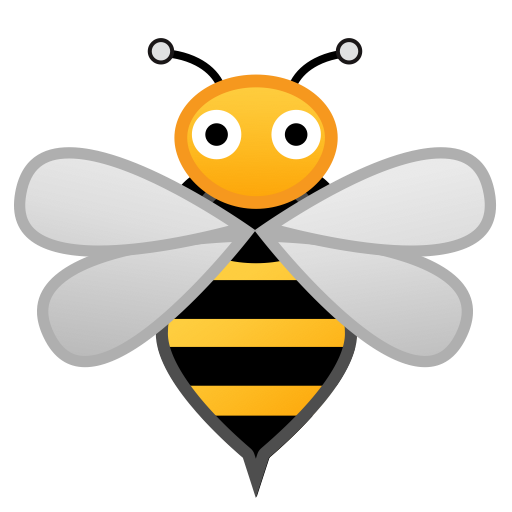

 <!-- .slide: class="center" -->

## Android O

Note: ... see a problem?

It's an exorsist bee

WAT 

and then you have the just.. strage ones...

---

 

 <!-- .slide: class="center" -->
## LG

Note: the LG bee is just.. bulbus?

---

 

 <!-- .slide: class="center" -->
## Samsung

Note: it's the beemovie, but everytime you see the bee, you double check you aren't on a galaxy note that might.. explode..

---

 

 <!-- .slide: class="center" -->

## Emojidex

Note: The emojidex bee though... I think he's playing some variation of quiddich

Or he's a red teamer with his honeypot there.

---

## twitter.com/emojirates <!-- .slide: class="center" -->

Note: if you're a fan of dog rates, check out emoji rates!

They're good codepoints, brant.

---

 <!-- .slide: data-background-image="pictures/beeyellow.jpg"-->

Note: ANYWAY

While I'm not taking pictures or grading bees

---

 

 <!-- .slide: class="center" -->
Note: 

---
## The Power and Responsibility <!-- .slide: class="center" -->
##of Unicode Adoption <!-- .slide: class="center" -->
Note: 
"The power and responsibility of UNicode adoption"

I first gave it at this very meetup in March last year.

I know right? It sounds like a proper technical talk, but it's actually me just yelling about emoji and stuff

Thing is, that's not the name
---

## The Power  and Responsibility  <!-- .slide: class="center" -->
## of Unicode Adoption  <!-- .slide: class="center" -->

Note: this is the name. it has emoji in the title

This has caused me all *sorts* of fun when trying to propose and present at conferences

---

 

Note: For example, some conferences can't get the name right, even when it's been entered into their system

---

 

Note: Some like some characters, but not others

I had to resubmit this one and remove specific characters

---

 

Note: Some just get a little bit corrupted (kiwicon)
---

 
Note: but sometimes it works!

... on the website
---
 
Note: but not on the printed schedule
---

 
Note: or on the AV notes.

Side note, it's REALLY fun when the person introducing you on stage reads that verbatim

---

 

---
 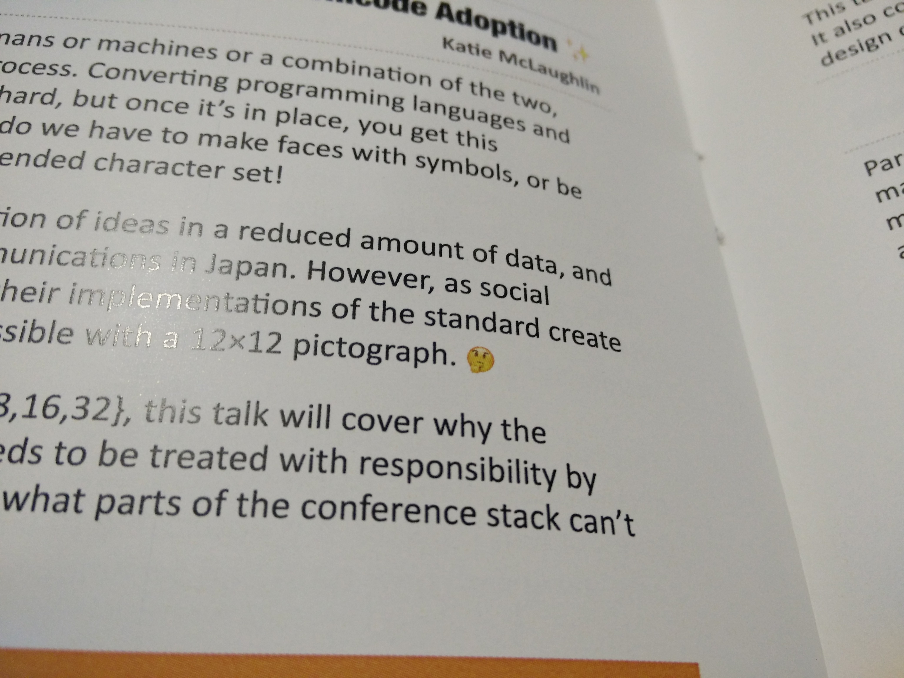

Note: granted, sometimes they get it right!
---

 

Note: but sometimes it prints out wrong

---

 

Note: So sometimes they just cut it out entirely
---

 
 
Note: but they can be corrected
---
 
Note: But the best part is when the digital boards work

Because I can tell you exactly what operating system this is running. Windows 8

---
# &nbsp;
 

Note: This is the emoji
---
 

Note: 

Different vendors have implemented emoji differently. In this case, the 'sweat drop' face is the most easily recognisable as windows, because it looks like a face with boils all over it or something

(picture of different sweat)

Based on this, we can guess the operating system, down to the version, using just the emoji being displayed.
---

 

 <!-- .slide: class="center" -->

Note: So yeah, that's fun.

But oyu don't have to submit talks to confs to test out platforms and their emoji support

---

 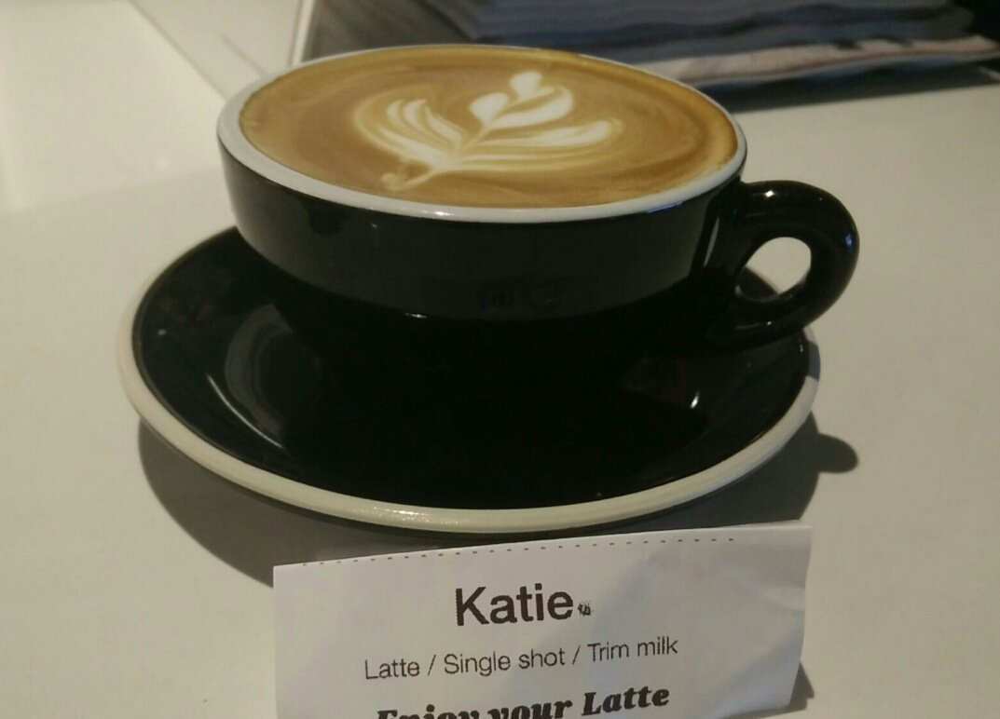

Note: you can try it any time any application allows free-form input
---

 

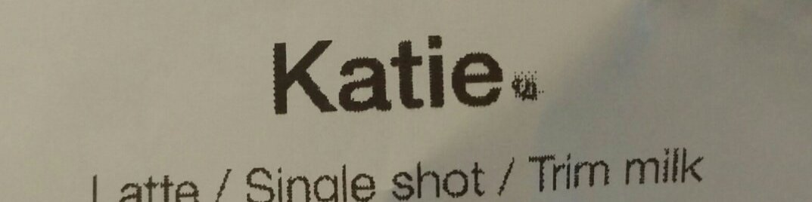

  <!-- .slide: class="center" -->
---
 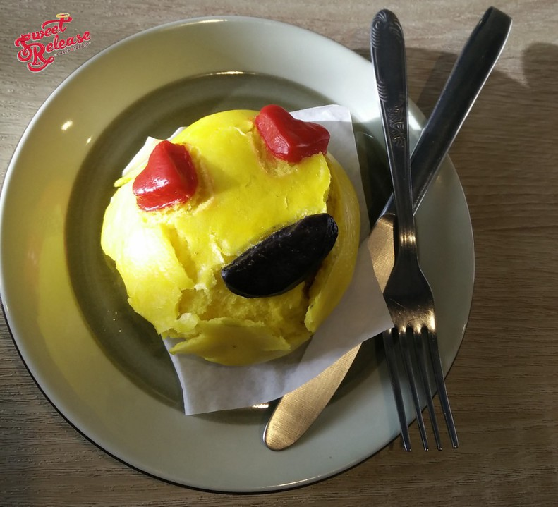

Note: Sweet release

Or if you want to be pure

---

 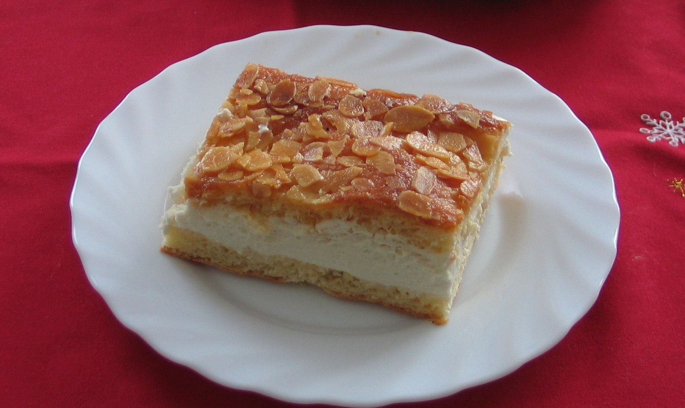

Note: a bienenstich

bee string

---
 <!-- .slide: data-background-image="pictures/beehobart.jpg"-->

Note: go back to bees
This is a hacker conf, yeah? while bees are awesome, what if we could hack with them?
---

 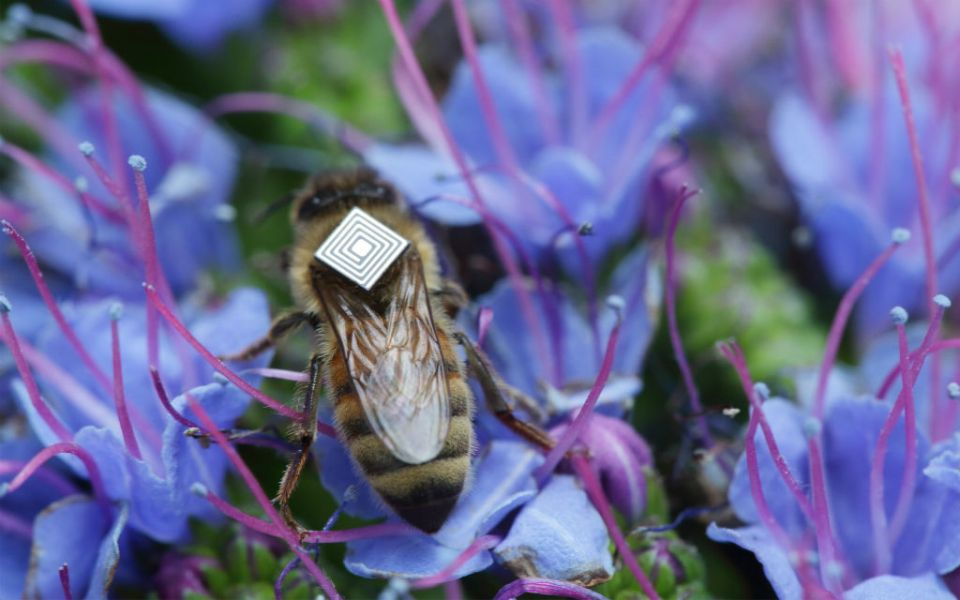

Note: you could attach tiny little microchips onto bees like sciencists in manchester did

they created an

internet of stings

but this is fiddly

we should stick to our emoji

---
 

 <!-- .slide: class="center" -->

Note: 

but what is emoji

---

 

Note: 
These are not emoji

So if, for example, you were to say download an executable claiming to give you an emoji pack for your favourite chat client, that's not hacking. That's you downloading a random executable and getting what's coming to you

---

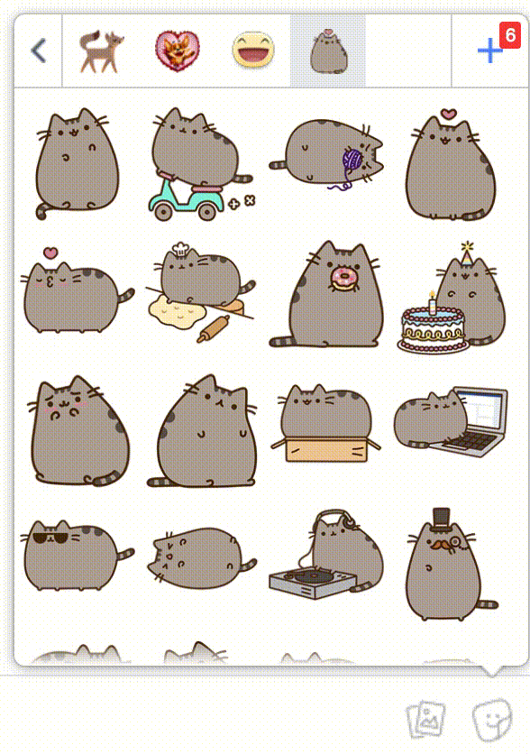

Note: These are not emoji. These are stickers.

These are animated devils that some vendors make you pay for.

These were cool back in Yahoo messenger 15 years ago.

---

 

Note: this is not emoji. This is face detection as a gimmick

trivialising 

---

 

Note: these again, aren't emoji. These are twiter stickers, now, granted,

---

 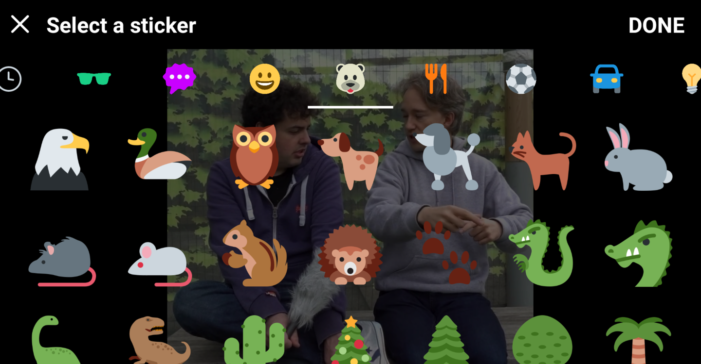

Note: these *are emoji*, but in the official twitter client, they are literally there so you can cover up your image.
For example

---

 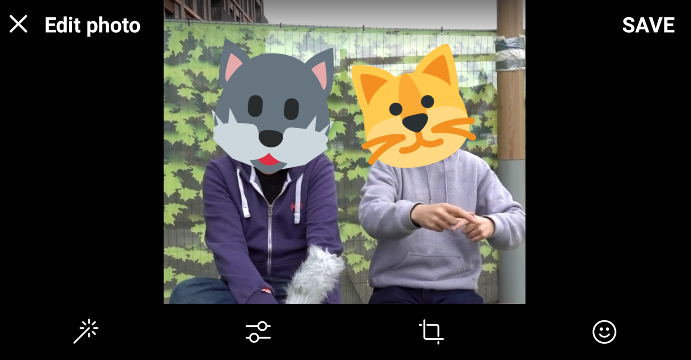

Note: you might do this so you can mask the identity of these two individuals, right?

Well no.

TODO TWITTER STICKER OBSERVIE STORY
https://twitter.com/devipotato/status/929830195766292480 

But it's not just thirdparty apps taht can cause trouble
---

 

 <!-- .slide: class="center" -->

Note: native functioanlity with emoji can crash your phone.
---
 

 <!-- .slide: class="center" -->
Note: Who is familiar with the Pride Flag emoji that was just added?
---

 

 <!-- .slide: class="center" -->
Note: it's comprised of two existing emoji, the white flag and the rainbow, but with a special character

a Zero Width joiner, between them

You don't normally see this because in your flag picker, you see the end result.

However 

---
 

 <!-- .slide: class="center" -->

<a href="http://thehackernews.com/2017/01/crash-iphone-emoji.html">You Can Crash Anyone's iPhone or iPad With A Simple Emoji Text Message (2017)</a>
Note: There was a bug where if you sent the two emoji with a number between them, the device would get really confused, and not know what to do
---

 

<a href="https://www.kazoosoft.eu/wp-content/uploads/2015/05/Iphone6Bug2015.jpeg">jazoosoft.eu</a>
Note: so it would crash

this isn't the firts time a bug like this has happened
---
 

<a href="http://s.wsj.net/public/resources/images/BN-IP966_IMESSA_G_20150527143121.jpg">wsj.net</a>

Note: This has happened before in what's known as the effective power bug
---

<pre style="font-size: 60px"><code>
effective. 
Power 
لُلُصّبُلُلصّبُررً ॣ ॣh ॣ ॣ
冗 
</code></pre> 
<a href="https://www.youtube.com/watch?v=hJLMSllzoLA">The Effective Power Bug (2015)</a>
Note: how this worked is that the words 'effective power' had no meaning, but the text after it, that's displaying weirdly here, would set it off

When this text appeared in a notification popup, the truncation of that message would happen part way in the stuff on the third line, and the phone would get confused and restart

but that's not hacking.
---

 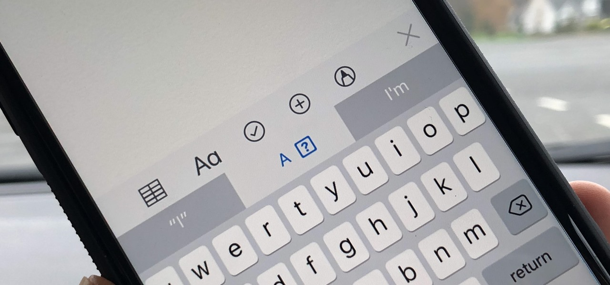

<a href="https://ios.gadgethacks.com/how-to/fix-a-autocorrect-bug-ios-11-when-typing-i-out-your-iphone-0181016/">gadgethacks.com</a>
---

 

 <!-- .slide: class="center" -->

---

---
 

 <!-- .slide: class="center" -->
---
 

 <!-- .slide: class="center" -->
### `http://xn--9q9h.ws`
Note: that's the domain, but the path...
---

# `?utf8=✓` <!-- .slide: class="center" -->
---
### `google.com``/test/عربي.امارات` <!-- .slide: class="center" -->
<a href="http://www.rafayhackingarticles.net/2016/08/google-chrome-firefox-address-bar.html">Google Chrome, Firefox Address Bar Spoofing Vulnerability</a>

Note: RTL
---
###`عربي.امارات/google.com``/test` <!-- .slide: class="center" -->
<a href="http://www.rafayhackingarticles.net/2016/08/google-chrome-firefox-address-bar.html">Google Chrome, Firefox Address Bar Spoofing Vulnerability</a>
---
 

 <!-- .slide: class="center" -->

Note: Speaking of the web, here's another interesting thing, to do with tabs in
browsers 

---

 

Note: Emoji pedia is awesome, you can look up emoji and see all the cross-browser fun

But notice something that's inconsistent?

---

 
Note: Safari won't display lock emoji in brower tabs

This is GOOD

otherwise, people might assume the page is secured when it's not
---

 

 <!-- .slide: class="center" -->

Note: some other interesting things you can do with emoji
---
 

 <!-- .slide: class="center" -->
---

## `set ☀️=set` <!-- .slide: class="center" -->
Note: geddit? Sun set?... Annnnyway
---
## `set ☀️=set` `%♫% ☺️=pow^er&&%♫% `☻`=she^ll` `%☺️%%`☻%` <!-- .slide: class="center" -->
<a href="https://twitter.com/ItsReallyNick/status/932681997876649989">Nick Carr, Twitter</a>
---

 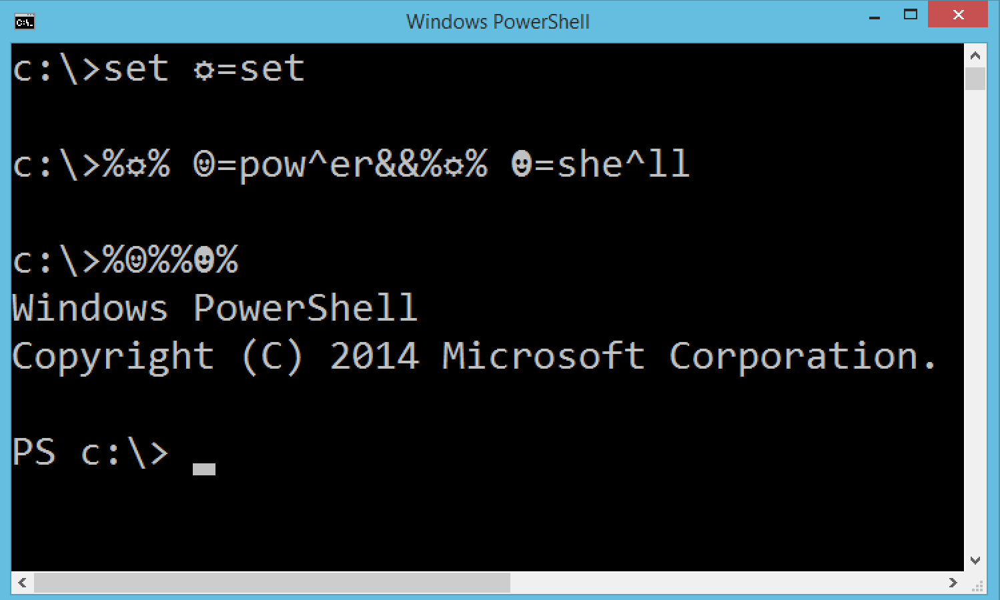
---

 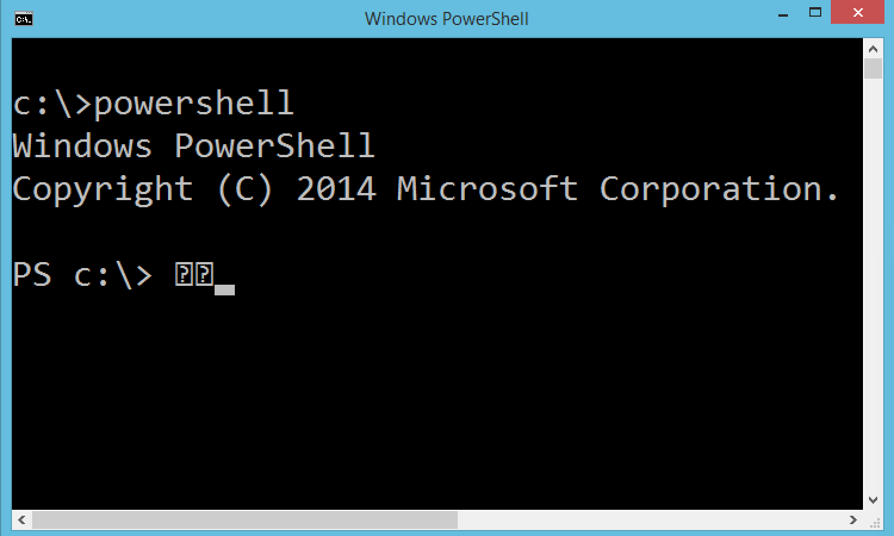
---
 

 <!-- .slide: class="center" -->

<a href="https://poststatus.com/the-trojan-emoji/">Anatomy of a Critical Security Bug</a>
Note: What is hacking is this wonderful incident I found involving mysql, not-strict tables, and wordpress

With literally a bug that could set the world on fire

---

## `STRICT_ALL_TABLES` <!-- .slide: class="center" -->

Note: This could have all been avoided if STRICT TABLES had been enabled for wordpress

Wordpress core used some of the ... more interesting features of mysql, so they couldn't enable this, and this is why everthing was a fire

---

 <!-- .slide: data-background-image="pictures/beeflight.jpg"-->

---

 

 <!-- .slide: class="center" -->
## &nbsp;

---
 

 <!-- .slide: class="center" -->
## `U+1F41D`
Note: 

This is our codepoint

---

 

 <!-- .slide: class="center" -->
## `\xf0\x9f\x90\x9d `
Note: 
The emoji uses four bytes

And there's a small issue in mysql when strict tables is turned off. If you try and insert an emoji it'll... truncate.
---

## `<q cite="Bees are cute` `">` <!-- .slide: class="center" -->
## `BSides WLG is awesome</q>`

Note: So, say if you have a Wordpress blog that allows comments, and citations, and you have something like this, which would pass javascript validation because it's a complete tag

But because Mysql...
---
## `<q cite="Bees are cute` &nbsp;&nbsp; &nbsp; &nbsp; . <!-- .slide: class="center" -->

## &nbsp;

Note: It'd drop about here
---

## `script src="honeypot.js">` <!-- .slide: class="center" -->

Note: which means that if your NEXT comment happens to be something like this

because that's not a script tag, there's no opening angle bracket

---
## `<q cite="Bees are cute` <!-- .slide: class="center" -->
## `...` <!-- .slide: class="center" -->
## `script src="honeypot.js">` <!-- .slide: class="center" -->
Note: you'd end up with a very large quote tag, that had a script attribute

sad trombone.

---

 

 <!-- .slide: class="center" -->

---

# `CVE-2015-3438` <!-- .slide: class="center" -->
Note: So that's CVE 2015 3 4 3 8

It's been patched as of WordPress 4.2, so please PATCH YOUR THINGS
Wordpress 4.2 introduced emoji natively into the system... and also removed a small issue with it breaking everything

but you get new emoji! you should update your things!
---
# MySQL <!-- .slide: class="center" -->
## `STRICT_ALL_TABLES` <!-- .slide: class="center" -->
## `utf8mb4` <!-- .slide: class="center" -->
Note: also, make sure you enable strict tables, because yowsa.

---

 

 <!-- .slide: class="center" -->

Note: this probably isn't the only thing out there, but it's something to watch out for
---

 

 <!-- .slide: class="center" -->

Note: CRITICAL NOTE
---
 

 <!-- .slide: class="center" -->
<h3>Sierra iOS10.3</h3>
<h3>High Sierra iOS11.1</h3>

---

 <!-- .slide: data-background-image="pictures/beeupsidedown.jpg"-->

#&nbsp; 

#&nbsp; 
 <h3 style="-webkit-text-stroke: 1px black; color: white">glasnt.com/talks</h3> <!-- .slide: class="center" -->
#&nbsp; 
#&nbsp; 
<h4 style="bottom: -200px; -webkit-text-stroke: 1px black; color: white">All bee photographs CC BY-NC-SA 4.0</h4>