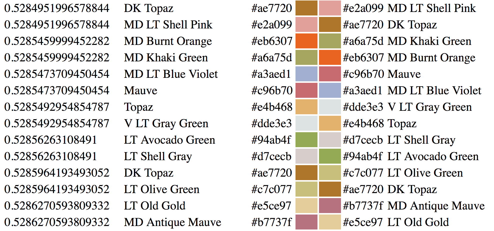
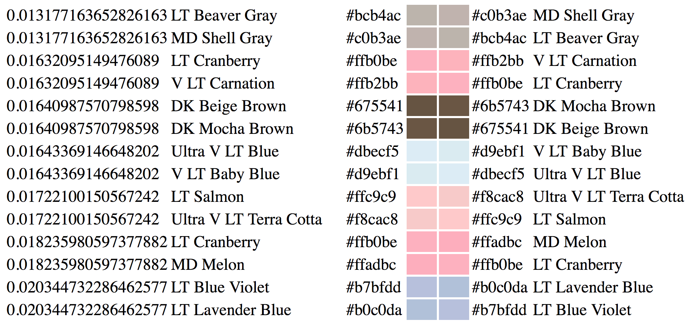
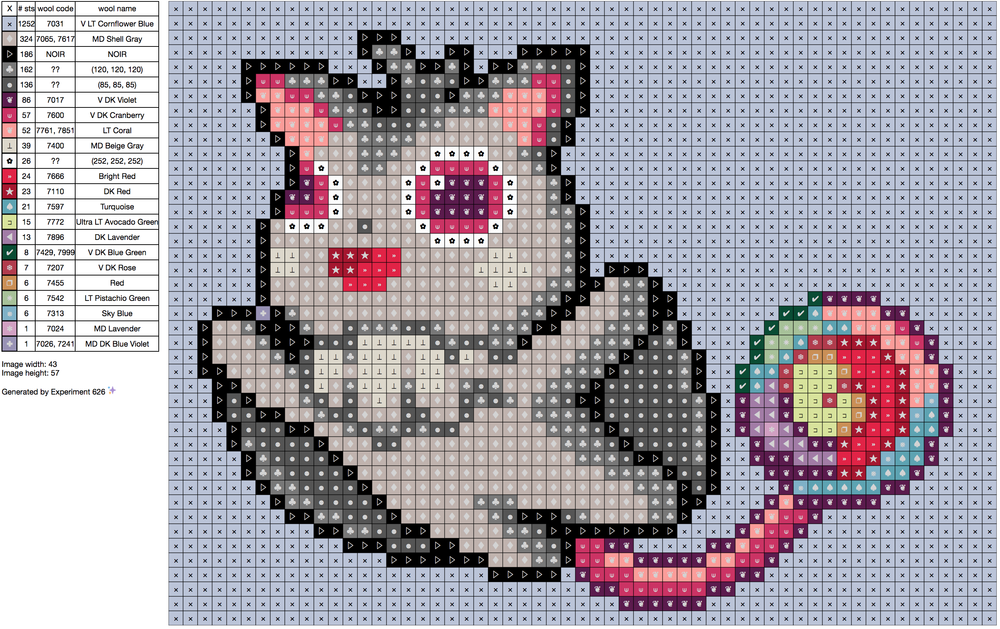
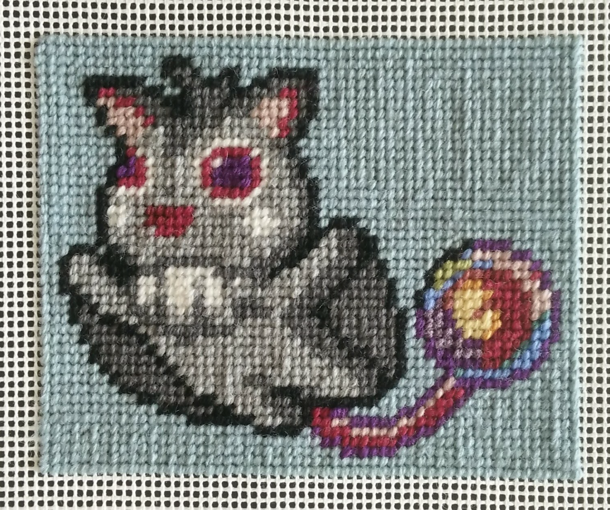

# &nbsp;
# A Right Stitchup <!-- .slide: class="center" -->
### Lightning Talk

 
---

## ~~  A long time ago   at a conference far away  ~~ <!-- .slide: class="center" -->

---

 <!-- .slide: data-background-image="pictures/osdc2014.png"-->

---

 <!-- .slide: data-background-image="pictures/green_display.jpg"-->

---

 <!-- .slide: data-background-image="pictures/green_lynn.jpg"-->

---

 <!-- .slide: data-background-image="pictures/green_design_clip.png"-->
---

 <!-- .slide: data-background-image="pictures/green_working.jpg"-->
---

# &nbsp;

*"If you know anything about image manipulation, colour setting, cross stitch charts..."*
---
# &nbsp;
*"If there is any [F/OSS] software out there please tell me.*

 *Otherwise I will make my own,* <!-- .element: class="fragment" -->

 *and present it here next year"* <!-- .element: class="fragment" -->

 &dash; me, November 2014 <!-- .element: class="fragment" -->

---

# &nbsp;
# &nbsp;
 (To be fair, OSDC hasn't run since 2015) <!-- .element: class="fragment" -->
---

## Problems to solve <!-- .slide: class="center" -->

* "image manipulation"
* "colour setting"
* "cross stitch charts"

---

## Image manipulation <!-- .slide: class="center" -->
---

## `imagemagick` <!-- .slide: class="center" -->
---

## ~~`imagemagick`~~ <!-- .slide: class="center" -->
---

## `pillow` <!-- .slide: class="center" -->
---
## `getpixel((x,y))` <!-- .slide: class="center" -->
---
## Colour setting <!-- .slide: class="center" -->
---
### Let's learn about floss <!-- .slide: class="center" -->
---
 

  <!-- .slide: class="center" -->

Note: Dollfus-Mieg et Compagnie
Est. 1746
---
 <!-- .slide: data-background-image="pictures/dmc-rack.jpg"-->
---
 <!-- .slide: data-background-image="pictures/floss_macro.jpg"-->
---
 <!-- .slide: data-background-image="pictures/wool_macro.jpg"-->
---
 
---

<pre><code style="font-size: 36px; line-height: 1.5;">

V DK Cranberry&nbsp;&nbsp;600&nbsp;&nbsp;&nbsp;&nbsp;7600
DK Cranberry&nbsp; &nbsp;&nbsp;601
MD Cranberry&nbsp;&nbsp;&nbsp;&nbsp;602&nbsp;&nbsp;&nbsp;&nbsp;7603
Cranberry&nbsp;&nbsp;&nbsp;&nbsp;&nbsp;&nbsp;&nbsp;603&nbsp;&nbsp;&nbsp;&nbsp;7604 
LT Cranberry&nbsp;&nbsp;&nbsp;&nbsp;604&nbsp;&nbsp;&nbsp;&nbsp;7605
V LT Cranberry&nbsp;&nbsp;605
</code></pre> 

---
## ∑ floss > ∑ wool <!-- .slide: class="center" -->
---
### *This chart has been formulated only as a guide to assist you in selecting color from the DMC family of products. Please use your own judgement in making the final decision on color interpretation.* <!-- .slide: class="center" -->
---

## Color Code ➡ RGB <!-- .slide: class="center" -->
### ???
---
##### *cough* <!-- .slide: class="center" -->
---
### 454 RGB Codes for Floss <!-- .slide: class="center" -->
---
### ➡ 291 RGB Codes for Wool <!-- .slide: class="center" -->
---
### Reducing picture to only available colours <!-- .slide: class="center" -->
---
## `pillow` <!-- .slide: class="center" -->
---
<pre><code style="font-size: 36px; line-height: 1.5;">
pdata = [0, 0, 0, 255, 255, 255, ...]
p = Image.new('P', (16, 16))
p.putpalette(pdata) 
im.convert('P', 0, p.im)
</code></pre> 
---
 
---
 
---
<pre><code style="font-size: 36px; line-height: 1.5;">
im.convert('P' 
, palette=Image.ADAPTIVE
, colors=16)
</code></pre> 
---
 
---
 
---

### Problem: 256 <!-- .slide: class="center" -->
Note: pillow palette limited to 256

we have 291, shouldn't be too hard to remove the closest colurs, right?
---

 

  <!-- .slide: class="center" -->
---
 

  <!-- .slide: class="center" -->
Note: latest revision of the forumula from International Commission on Illumination (CIE)
---
### `from skimage.color` <!-- .slide: class="center" -->
### `import deltaE_ciede2000` <!-- .slide: class="center" -->

Note: praise scikit
---

 
---
 

---
## Cross-stitch charts <!-- .slide: class="center" -->
---
## `
` <!-- .slide: class="center" -->
---
## Result <!-- .slide: class="center" -->
---

## github.com/glasnt/626 <!-- .slide: class="center" -->
---
 
---

 <!-- .slide: data-background-image="pictures/green_new_chart.png"-->
---
### Here's one I prepared earlier <!-- .slide: class="center" -->
---
 
---
 
---
 
---

 

 <!-- .slide: class="center" -->
 