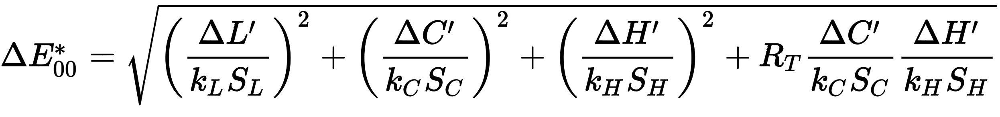
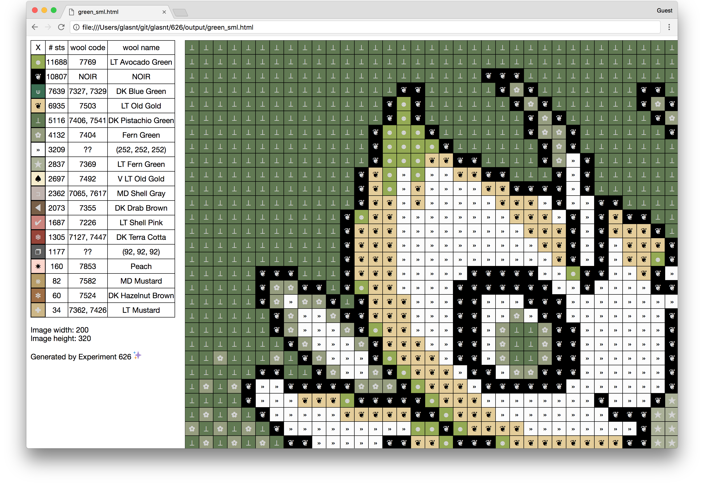
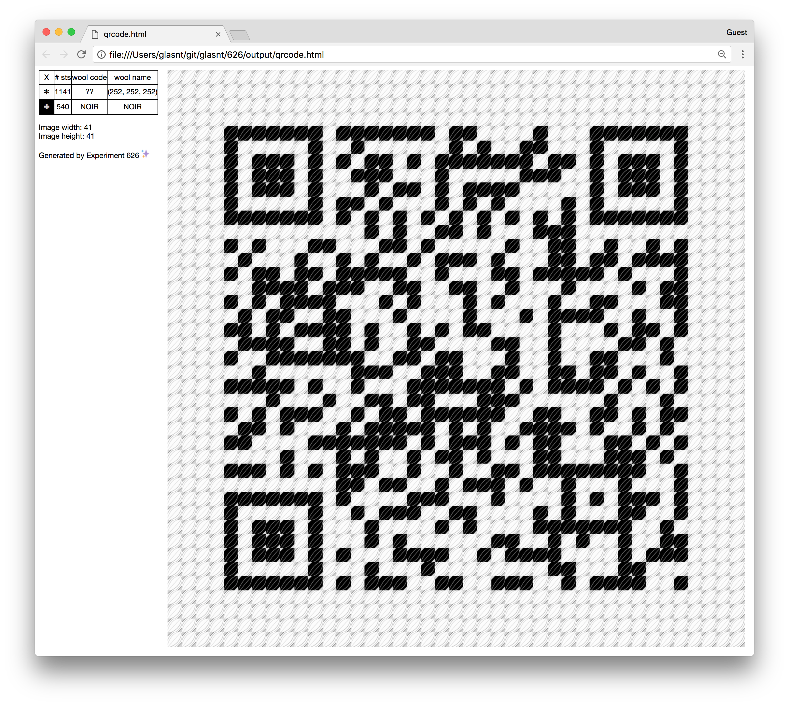

# &nbsp;
# A Right Stitchup <!-- .slide: class="center" -->
### Lightning Talk

 
---

## ~~  A long time ago   at a conference far away  ~~ <!-- .slide: class="center" -->

---

 <!-- .slide: data-background-image="pictures/osdc2014.png"-->

---

 <!-- .slide: data-background-image="pictures/green_display.jpg"-->

---

 <!-- .slide: data-background-image="pictures/green_lynn.jpg"-->

---

 <!-- .slide: data-background-image="pictures/green_design_clip.png"-->
---

 <!-- .slide: data-background-image="pictures/green_working.jpg"-->
---

# &nbsp;

*"If you know anything about image manipulation, colour setting, cross stitch charts...*

 *If there is any [FOSS] software out there please tell me.* <!-- .element: class="fragment" -->

 *Otherwise I will make my own,* <!-- .element: class="fragment" -->

 *and present it here next year"* <!-- .element: class="fragment" -->

 &dash; me, November 2014 <!-- .element: class="fragment" -->

---

# &nbsp;
# &nbsp;
 (To be fair, OSDC hasn't run since 2015) <!-- .element: class="fragment" -->
---

## Problems to solve <!-- .slide: class="center" -->

* "image manipulation"
* "colour setting"
* "cross stitch charts"

---

## Image manipulation <!-- .slide: class="center" -->
---

## `imagemagick` <!-- .slide: class="center" -->
---

## ~~`imagemagick`~~ <!-- .slide: class="center" -->
---

### "Don't wrap your shell script directly in [web framework]" <!-- .slide: class="center" -->
<small>Katie McLaughlin, "Disentangle a new fangled image mangler", linux.conf.au 2015 Multimedia Miniconf</small>

[youtube.com](https://www.youtube.com/watch?v=XedLGMp38xA)

Note: I've already done that talk. I've already worked out that imagemagick is too powerful and vulnerable for my unsecase

This talk is a lovely wander through a different image manipulation project of mine.

---

## `pillow` <!-- .slide: class="center" -->
---
## `getpixel((x,y))` <!-- .slide: class="center" -->
---
## Colour setting <!-- .slide: class="center" -->
---
### Let's learn about floss <!-- .slide: class="center" -->
---
 

  <!-- .slide: class="center" -->

Note: Dollfus-Mieg et Compagnie
Est. 1746
---
 <!-- .slide: data-background-image="pictures/dmc-rack.jpg"-->
---
 <!-- .slide: data-background-image="pictures/floss_macro.jpg"-->
---
 <!-- .slide: data-background-image="pictures/wool_macro.jpg"-->
---
 
---

<pre><code style="font-size: 36px; line-height: 1.5;">

V DK Cranberry&nbsp;&nbsp;600&nbsp;&nbsp;&nbsp;&nbsp;7600
DK Cranberry&nbsp; &nbsp;&nbsp;601
MD Cranberry&nbsp;&nbsp;&nbsp;&nbsp;602&nbsp;&nbsp;&nbsp;&nbsp;7603
Cranberry&nbsp;&nbsp;&nbsp;&nbsp;&nbsp;&nbsp;&nbsp;603&nbsp;&nbsp;&nbsp;&nbsp;7604 
LT Cranberry&nbsp;&nbsp;&nbsp;&nbsp;604&nbsp;&nbsp;&nbsp;&nbsp;7605
V LT Cranberry&nbsp;&nbsp;605
</code></pre> 
---
 <!-- .slide: data-background-image="pictures/full_floss.jpg"-->
---
 <!-- .slide: data-background-image="pictures/wool_6floss.jpg"-->
---
## more floss than wool <!-- .slide: class="center" -->
#### over 50% more! <!-- .slide: class="center" -->
---
## Colour Code ➡ RGB <!-- .slide: class="center" -->
### ??? <!-- .element: class="fragment" -->
---
### No official mapping exists <!-- .slide: class="center" -->
#### 'proprietary information' <!-- .slide: class="center" -->
 [thread-bare.com](https://www.thread-bare.com/2017/09/20/creating-cross-stitch-charts-with-consistent-colors)
Note: proprietary information

colour drifting over time

official standard

allows competitors to "steal"
---
##### *cough* <!-- .slide: class="center" -->
---
### 454 RGB Codes for Floss <!-- .slide: class="center" -->
### 293 RGB Codes for Wool <!-- .slide: class="center" -->
---
### Reducing picture to only available colours <!-- .slide: class="center" -->
---
## `pillow` <!-- .slide: class="center" -->
---
<pre><code style="font-size: 36px; line-height: 1.5;">
pdata = [0, 0, 0, 255, 255, 255, ...]
p = Image.new('P', (16, 16))
p.putpalette(pdata) 
im.convert('P', 0, p.im)
</code></pre> 
---
 
---
 
---
<pre><code style="font-size: 36px; line-height: 1.5;">
im.convert('P' 
&nbsp; &nbsp; , palette=Image.ADAPTIVE
&nbsp; &nbsp; , colors=16)
</code></pre> 
---
 
---
 
---

### Problem: 256 <!-- .slide: class="center" -->
Note: pillow palette limited to 256

we have 291, shouldn't be too hard to remove the closest colurs, right?
---

 

  <!-- .slide: class="center" -->
### Euclidean Distance <!-- .slide: class="center" -->
[wikipedia](https://en.wikipedia.org/wiki/Color_difference)
Note: very rough estimate
---
 

  <!-- .slide: class="center" -->
### CIEDE2000 <!-- .slide: class="center" -->
[wikipedia](https://en.wikipedia.org/wiki/Color_difference)

Note: latest revision of the forumula from International Commission on Illumination (CIE)

Perceptual uniformity

---

<pre><code style="font-size: 36px; line-height: 1.5;">
$ pip install numpy scikit-image
$ python
>>> from skimage.color &nbsp; &nbsp; &nbsp;import deltaE_ciede2000
</code></pre> 

Note: praise scikit
---
<table class="difftable"><tr><th>deltaE ciede2000</th><th>Colour A</th><th>Hex A</th><th>Swatch A</th><th>Swatch B</th><th>Hex B</th><th>Colour B</th></tr>
<tr><td>0.5026168399946604</td><td>Beige Gray Dark</td><td>#A49878</td><td style='background-color: #A49878'>&nbsp; &nbsp; &nbsp; &nbsp;</td><td style='background-color: #C4DECC'>&nbsp; &nbsp; &nbsp; &nbsp; </td><td>#C4DECC</td><td>Blue Green Vy Lt</td></tr>
<tr><td>0.5026168399946604</td><td>Blue Green Vy Lt</td><td>#C4DECC</td><td style='background-color: #C4DECC'>&nbsp; &nbsp; &nbsp; &nbsp;</td><td style='background-color: #A49878'>&nbsp; &nbsp; &nbsp; &nbsp; </td><td>#A49878</td><td>Beige Gray Dark</td></tr>
<tr><td>0.502616850208514</td><td>Cranberry</td><td>#FFA4BE</td><td style='background-color: #FFA4BE'>&nbsp; &nbsp; &nbsp; &nbsp;</td><td style='background-color: #946083'>&nbsp; &nbsp; &nbsp; &nbsp; </td><td>#946083</td><td>Grape Medium</td></tr>
<tr><td>0.502616850208514</td><td>Grape Medium</td><td>#946083</td><td style='background-color: #946083'>&nbsp; &nbsp; &nbsp; &nbsp;</td><td style='background-color: #FFA4BE'>&nbsp; &nbsp; &nbsp; &nbsp; </td><td>#FFA4BE</td><td>Cranberry</td></tr>
<tr><td>0.5026269549802299</td><td>Lavender Blue Dark</td><td>#5C7294</td><td style='background-color: #5C7294'>&nbsp; &nbsp; &nbsp; &nbsp;</td><td style='background-color: #D8BC9A'>&nbsp; &nbsp; &nbsp; &nbsp; </td><td>#D8BC9A</td><td>Yellow Beige Md</td></tr>
<tr><td>0.5026269549802299</td><td>Yellow Beige Md</td><td>#D8BC9A</td><td style='background-color: #D8BC9A'>&nbsp; &nbsp; &nbsp; &nbsp;</td><td style='background-color: #5C7294'>&nbsp; &nbsp; &nbsp; &nbsp; </td><td>#5C7294</td><td>Lavender Blue Dark</td></tr>
<tr><td>0.502628951120124</td><td>Hazelnut Brown</td><td>#B78B61</td><td style='background-color: #B78B61'>&nbsp; &nbsp; &nbsp; &nbsp;</td><td style='background-color: #59C7B4'>&nbsp; &nbsp; &nbsp; &nbsp; </td><td>#59C7B4</td><td>Sea Green Med</td></tr>
<tr><td>0.502628951120124</td><td>Sea Green Med</td><td>#59C7B4</td><td style='background-color: #59C7B4'>&nbsp; &nbsp; &nbsp; &nbsp;</td><td style='background-color: #B78B61'>&nbsp; &nbsp; &nbsp; &nbsp; </td><td>#B78B61</td><td>Hazelnut Brown</td></tr>
<tr><td>0.5026301870741252</td><td>Dusty Rose Med Vy Lt</td><td>#FFBDBD</td><td style='background-color: #FFBDBD'>&nbsp; &nbsp; &nbsp; &nbsp;</td><td style='background-color: #AA8F56'>&nbsp; &nbsp; &nbsp; &nbsp; </td><td>#AA8F56</td><td>Golden Olive Md</td></tr>
<tr><td>0.5026301870741252</td><td>Golden Olive Md</td><td>#AA8F56</td><td style='background-color: #AA8F56'>&nbsp; &nbsp; &nbsp; &nbsp;</td><td style='background-color: #FFBDBD'>&nbsp; &nbsp; &nbsp; &nbsp; </td><td>#FFBDBD</td><td>Dusty Rose Med Vy Lt</td></tr>
<tr><td>0.5026302897414802</td><td>Hunter Green Vy Dk</td><td>#1B5300</td><td style='background-color: #1B5300'>&nbsp; &nbsp; &nbsp; &nbsp;</td><td style='background-color: #B71F33'>&nbsp; &nbsp; &nbsp; &nbsp; </td><td>#B71F33</td><td>Red Medium</td></tr>
<tr><td>0.5026302897414802</td><td>Red Medium</td><td>#B71F33</td><td style='background-color: #B71F33'>&nbsp; &nbsp; &nbsp; &nbsp;</td><td style='background-color: #1B5300'>&nbsp; &nbsp; &nbsp; &nbsp; </td><td>#1B5300</td><td>Hunter Green Vy Dk</td></tr>
<tr><td>0.5026358009581365</td><td>Plum Light</td><td>#C54989</td><td style='background-color: #C54989'>&nbsp; &nbsp; &nbsp; &nbsp;</td><td style='background-color: #E2A099'>&nbsp; &nbsp; &nbsp; &nbsp; </td><td>#E2A099</td><td>Shell Pink Med Light</td></tr>
<tr><td>0.5026358009581365</td><td>Shell Pink Med Light</td><td>#E2A099</td><td style='background-color: #E2A099'>&nbsp; &nbsp; &nbsp; &nbsp;</td><td style='background-color: #C54989'>&nbsp; &nbsp; &nbsp; &nbsp; </td><td>#C54989</td><td>Plum Light</td></tr>
<tr><td>0.5026396562917449</td><td>Carnation Dark</td><td>#FF5773</td><td style='background-color: #FF5773'>&nbsp; &nbsp; &nbsp; &nbsp;</td><td style='background-color: #D0A53E'>&nbsp; &nbsp; &nbsp; &nbsp; </td><td>#D0A53E</td><td>Old Gold Medium</td></tr>
<tr><td>0.5026396562917449</td><td>Old Gold Medium</td><td>#D0A53E</td><td style='background-color: #D0A53E'>&nbsp; &nbsp; &nbsp; &nbsp;</td><td style='background-color: #FF5773'>&nbsp; &nbsp; &nbsp; &nbsp; </td><td>#FF5773</td><td>Carnation Dark</td></tr>
<tr><td>0.5026467750409492</td><td>Golden Brown Dk</td><td>#914F12</td><td style='background-color: #914F12'>&nbsp; &nbsp; &nbsp; &nbsp;</td><td style='background-color: #889268'>&nbsp; &nbsp; &nbsp; &nbsp; </td><td>#889268</td><td>Green Gray Md</td></tr>
<tr><td>0.5026467750409492</td><td>Green Gray Md</td><td>#889268</td><td style='background-color: #889268'>&nbsp; &nbsp; &nbsp; &nbsp;</td><td style='background-color: #914F12'>&nbsp; &nbsp; &nbsp; &nbsp; </td><td>#914F12</td><td>Golden Brown Dk</td></tr>
</table> 
</section> 
---
<table class="difftable"><tr><th>deltaE ciede2000</th><th>Colour A</th><th>Hex A</th><th>Swatch A</th><th>Swatch B</th><th>Hex B</th><th>Colour B</th></tr>
<tr><td>0.0069134420593650195</td><td>Mocha Brn Ult Vy Lt</td><td>#FAF6F0</td><td style='background-color: #FAF6F0'>&nbsp; &nbsp; &nbsp; &nbsp;</td><td style='background-color: #F9F7F1'>&nbsp; &nbsp; &nbsp; &nbsp; </td><td>#F9F7F1</td><td>Winter White</td></tr>
<tr><td>0.0069134420593650195</td><td>Winter White</td><td>#F9F7F1</td><td style='background-color: #F9F7F1'>&nbsp; &nbsp; &nbsp; &nbsp;</td><td style='background-color: #FAF6F0'>&nbsp; &nbsp; &nbsp; &nbsp; </td><td>#FAF6F0</td><td>Mocha Brn Ult Vy Lt</td></tr>
<tr><td>0.0072345914037694</td><td>Olive Green Dk</td><td>#938B37</td><td style='background-color: #938B37'>&nbsp; &nbsp; &nbsp; &nbsp;</td><td style='background-color: #948C36'>&nbsp; &nbsp; &nbsp; &nbsp; </td><td>#948C36</td><td>Olive Green</td></tr>
<tr><td>0.0072345914037694</td><td>Olive Green</td><td>#948C36</td><td style='background-color: #948C36'>&nbsp; &nbsp; &nbsp; &nbsp;</td><td style='background-color: #938B37'>&nbsp; &nbsp; &nbsp; &nbsp; </td><td>#938B37</td><td>Olive Green Dk</td></tr>
<tr><td>0.007566102478952069</td><td>Baby Pink</td><td>#FFDFD9</td><td style='background-color: #FFDFD9'>&nbsp; &nbsp; &nbsp; &nbsp;</td><td style='background-color: #FFDFD7'>&nbsp; &nbsp; &nbsp; &nbsp; </td><td>#FFDFD7</td><td>Shell Pink Ult Vy Lt</td></tr>
<tr><td>0.007566102478952069</td><td>Shell Pink Ult Vy Lt</td><td>#FFDFD7</td><td style='background-color: #FFDFD7'>&nbsp; &nbsp; &nbsp; &nbsp;</td><td style='background-color: #FFDFD9'>&nbsp; &nbsp; &nbsp; &nbsp; </td><td>#FFDFD9</td><td>Baby Pink</td></tr>
<tr><td>0.00918721318108803</td><td>Apricot Very Light</td><td>#FFDED5</td><td style='background-color: #FFDED5'>&nbsp; &nbsp; &nbsp; &nbsp;</td><td style='background-color: #FFDFD7'>&nbsp; &nbsp; &nbsp; &nbsp; </td><td>#FFDFD7</td><td>Shell Pink Ult Vy Lt</td></tr>
<tr><td>0.00918721318108803</td><td>Shell Pink Ult Vy Lt</td><td>#FFDFD7</td><td style='background-color: #FFDFD7'>&nbsp; &nbsp; &nbsp; &nbsp;</td><td style='background-color: #FFDED5'>&nbsp; &nbsp; &nbsp; &nbsp; </td><td>#FFDED5</td><td>Apricot Very Light</td></tr>
<tr><td>0.00962148915492655</td><td>Cream</td><td>#FFFBEF</td><td style='background-color: #FFFBEF'>&nbsp; &nbsp; &nbsp; &nbsp;</td><td style='background-color: #FCFCEE'>&nbsp; &nbsp; &nbsp; &nbsp; </td><td>#FCFCEE</td><td>Off White</td></tr>
<tr><td>0.00962148915492655</td><td>Off White</td><td>#FCFCEE</td><td style='background-color: #FCFCEE'>&nbsp; &nbsp; &nbsp; &nbsp;</td><td style='background-color: #FFFBEF'>&nbsp; &nbsp; &nbsp; &nbsp; </td><td>#FFFBEF</td><td>Cream</td></tr>
<tr><td>0.010399465066750093</td><td>Dusty Rose</td><td>#E8879B</td><td style='background-color: #E8879B'>&nbsp; &nbsp; &nbsp; &nbsp;</td><td style='background-color: #EA8699'>&nbsp; &nbsp; &nbsp; &nbsp; </td><td>#EA8699</td><td>Raspberry Light</td></tr>
<tr><td>0.010399465066750093</td><td>Raspberry Light</td><td>#EA8699</td><td style='background-color: #EA8699'>&nbsp; &nbsp; &nbsp; &nbsp;</td><td style='background-color: #E8879B'>&nbsp; &nbsp; &nbsp; &nbsp; </td><td>#E8879B</td><td>Dusty Rose</td></tr>
<tr><td>0.013177163652826163</td><td>Beaver Gray Lt</td><td>#BCB4AC</td><td style='background-color: #BCB4AC'>&nbsp; &nbsp; &nbsp; &nbsp;</td><td style='background-color: #C0B3AE'>&nbsp; &nbsp; &nbsp; &nbsp; </td><td>#C0B3AE</td><td>Shell Gray Med</td></tr>
<tr><td>0.013177163652826163</td><td>Shell Gray Med</td><td>#C0B3AE</td><td style='background-color: #C0B3AE'>&nbsp; &nbsp; &nbsp; &nbsp;</td><td style='background-color: #BCB4AC'>&nbsp; &nbsp; &nbsp; &nbsp; </td><td>#BCB4AC</td><td>Beaver Gray Lt</td></tr>
<tr><td>0.014038710824153958</td><td>Beige Gray Med</td><td>#DDD8CB</td><td style='background-color: #DDD8CB'>&nbsp; &nbsp; &nbsp; &nbsp;</td><td style='background-color: #E3D8CC'>&nbsp; &nbsp; &nbsp; &nbsp; </td><td>#E3D8CC</td><td>Mocha Brown Vy Lt</td></tr>
<tr><td>0.014038710824153958</td><td>Mocha Brown Vy Lt</td><td>#E3D8CC</td><td style='background-color: #E3D8CC'>&nbsp; &nbsp; &nbsp; &nbsp;</td><td style='background-color: #DDD8CB'>&nbsp; &nbsp; &nbsp; &nbsp; </td><td>#DDD8CB</td><td>Beige Gray Med</td></tr>
<tr><td>0.014944343254283848</td><td>Carnation Very Light</td><td>#FFB2BB</td><td style='background-color: #FFB2BB'>&nbsp; &nbsp; &nbsp; &nbsp;</td><td style='background-color: #FCB0B9'>&nbsp; &nbsp; &nbsp; &nbsp; </td><td>#FCB0B9</td><td>Pink Medium</td></tr>
<tr><td>0.014944343254283848</td><td>Pink Medium</td><td>#FCB0B9</td><td style='background-color: #FCB0B9'>&nbsp; &nbsp; &nbsp; &nbsp;</td><td style='background-color: #FFB2BB'>&nbsp; &nbsp; &nbsp; &nbsp; </td><td>#FFB2BB</td><td>Carnation Very Light</td></tr>
</table> 
---
<table class="difftable"><tr><th>deltaE ciede2000</th><th>Colour A</th><th>Hex A</th><th>Swatch A</th><th>Swatch B</th><th>Hex B</th><th>Colour B</th></tr>
<tr><td>0.04989602021800601</td><td>Cranberry Dark</td><td>#D1286A</td><td style='background-color: #D1286A'>&nbsp; &nbsp; &nbsp; &nbsp;</td><td style='background-color: #CD2F63'>&nbsp; &nbsp; &nbsp; &nbsp; </td><td>#CD2F63</td><td>Cranberry Very Dark</td></tr>
<tr><td>0.04989602021800601</td><td>Cranberry Very Dark</td><td>#CD2F63</td><td style='background-color: #CD2F63'>&nbsp; &nbsp; &nbsp; &nbsp;</td><td style='background-color: #D1286A'>&nbsp; &nbsp; &nbsp; &nbsp; </td><td>#D1286A</td><td>Cranberry Dark</td></tr>
<tr><td>0.06759176350122559</td><td>Cranberry Light</td><td>#FFB0BE</td><td style='background-color: #FFB0BE'>&nbsp; &nbsp; &nbsp; &nbsp;</td><td style='background-color: #FFA4BE'>&nbsp; &nbsp; &nbsp; &nbsp; </td><td>#FFA4BE</td><td>Cranberry</td></tr>
<tr><td>0.06759176350122559</td><td>Cranberry</td><td>#FFA4BE</td><td style='background-color: #FFA4BE'>&nbsp; &nbsp; &nbsp; &nbsp;</td><td style='background-color: #FFB0BE'>&nbsp; &nbsp; &nbsp; &nbsp; </td><td>#FFB0BE</td><td>Cranberry Light</td></tr>
<tr><td>0.1043483831009906</td><td>Cranberry Light</td><td>#FFB0BE</td><td style='background-color: #FFB0BE'>&nbsp; &nbsp; &nbsp; &nbsp;</td><td style='background-color: #FFC0CD'>&nbsp; &nbsp; &nbsp; &nbsp; </td><td>#FFC0CD</td><td>Cranberry Very Light</td></tr>
<tr><td>0.1043483831009906</td><td>Cranberry Very Light</td><td>#FFC0CD</td><td style='background-color: #FFC0CD'>&nbsp; &nbsp; &nbsp; &nbsp;</td><td style='background-color: #FFB0BE'>&nbsp; &nbsp; &nbsp; &nbsp; </td><td>#FFB0BE</td><td>Cranberry Light</td></tr>
<tr><td>0.16450628922209645</td><td>Cranberry Medium</td><td>#E24874</td><td style='background-color: #E24874'>&nbsp; &nbsp; &nbsp; &nbsp;</td><td style='background-color: #CD2F63'>&nbsp; &nbsp; &nbsp; &nbsp; </td><td>#CD2F63</td><td>Cranberry Very Dark</td></tr>
<tr><td>0.16450628922209645</td><td>Cranberry Very Dark</td><td>#CD2F63</td><td style='background-color: #CD2F63'>&nbsp; &nbsp; &nbsp; &nbsp;</td><td style='background-color: #E24874'>&nbsp; &nbsp; &nbsp; &nbsp; </td><td>#E24874</td><td>Cranberry Medium</td></tr>
<tr><td>0.16521369601575045</td><td>Cranberry Very Light</td><td>#FFC0CD</td><td style='background-color: #FFC0CD'>&nbsp; &nbsp; &nbsp; &nbsp;</td><td style='background-color: #FFA4BE'>&nbsp; &nbsp; &nbsp; &nbsp; </td><td>#FFA4BE</td><td>Cranberry</td></tr>
<tr><td>0.16521369601575045</td><td>Cranberry</td><td>#FFA4BE</td><td style='background-color: #FFA4BE'>&nbsp; &nbsp; &nbsp; &nbsp;</td><td style='background-color: #FFC0CD'>&nbsp; &nbsp; &nbsp; &nbsp; </td><td>#FFC0CD</td><td>Cranberry Very Light</td></tr>
<tr><td>0.19236698179290798</td><td>Cranberry Dark</td><td>#D1286A</td><td style='background-color: #D1286A'>&nbsp; &nbsp; &nbsp; &nbsp;</td><td style='background-color: #E24874'>&nbsp; &nbsp; &nbsp; &nbsp; </td><td>#E24874</td><td>Cranberry Medium</td></tr>
<tr><td>0.19236698179290798</td><td>Cranberry Medium</td><td>#E24874</td><td style='background-color: #E24874'>&nbsp; &nbsp; &nbsp; &nbsp;</td><td style='background-color: #D1286A'>&nbsp; &nbsp; &nbsp; &nbsp; </td><td>#D1286A</td><td>Cranberry Dark</td></tr>
<tr><td>0.5920647937529571</td><td>Cranberry Medium</td><td>#E24874</td><td style='background-color: #E24874'>&nbsp; &nbsp; &nbsp; &nbsp;</td><td style='background-color: #FFA4BE'>&nbsp; &nbsp; &nbsp; &nbsp; </td><td>#FFA4BE</td><td>Cranberry</td></tr>
<tr><td>0.5920647937529571</td><td>Cranberry</td><td>#FFA4BE</td><td style='background-color: #FFA4BE'>&nbsp; &nbsp; &nbsp; &nbsp;</td><td style='background-color: #E24874'>&nbsp; &nbsp; &nbsp; &nbsp; </td><td>#E24874</td><td>Cranberry Medium</td></tr>
<tr><td>0.6516599170662192</td><td>Cranberry Light</td><td>#FFB0BE</td><td style='background-color: #FFB0BE'>&nbsp; &nbsp; &nbsp; &nbsp;</td><td style='background-color: #E24874'>&nbsp; &nbsp; &nbsp; &nbsp; </td><td>#E24874</td><td>Cranberry Medium</td></tr>
<tr><td>0.6516599170662192</td><td>Cranberry Medium</td><td>#E24874</td><td style='background-color: #E24874'>&nbsp; &nbsp; &nbsp; &nbsp;</td><td style='background-color: #FFB0BE'>&nbsp; &nbsp; &nbsp; &nbsp; </td><td>#FFB0BE</td><td>Cranberry Light</td></tr>
<tr><td>0.7542495972356424</td><td>Cranberry Very Dark</td><td>#CD2F63</td><td style='background-color: #CD2F63'>&nbsp; &nbsp; &nbsp; &nbsp;</td><td style='background-color: #FFA4BE'>&nbsp; &nbsp; &nbsp; &nbsp; </td><td>#FFA4BE</td><td>Cranberry</td></tr>
<tr><td>0.7542495972356424</td><td>Cranberry</td><td>#FFA4BE</td><td style='background-color: #FFA4BE'>&nbsp; &nbsp; &nbsp; &nbsp;</td><td style='background-color: #CD2F63'>&nbsp; &nbsp; &nbsp; &nbsp; </td><td>#CD2F63</td><td>Cranberry Very Dark</td></tr>
</table> 

---
## Cross-stitch charts <!-- .slide: class="center" -->
---
## `
` <!-- .slide: class="center" -->
---
## Result <!-- .slide: class="center" -->
---

## github.com/glasnt/626 <!-- .slide: class="center" -->
---
 
---

 <!-- .slide: data-background-image="pictures/green_chart_new_clip.png"-->
---
### Here's one I prepared earlier <!-- .slide: class="center" -->
---
 
[tumblr](http://probertson.tumblr.com/post/161081154009/australian-pokedex-30-57)
---
#### `./ih sweetsail.png -s2` <!-- .slide: class="center" -->
---
 <!-- .slide: data-background-image="pictures/sweet_chart.png"-->
---
#### `./ih sweetsail.png -s2 -t` <!-- .slide: class="center" -->
---
 <!-- .slide: data-background-image="pictures/sweet_mock.png"-->
---
 <!-- .slide: data-background-image="pictures/sweet_progress.jpg"-->
---
 <!-- .slide: data-background-image="pictures/sweet_finished.jpg"-->
---

## Practical Applications <!-- .slide: class="center" -->

Note: if time permits

Stringly typed

String a string to string a string
---
<pre><code style="font-size: 36px; line-height: 1.5;">
$ pip install qrcode
$ qrcode "YourWifiPassword" > wifi.png
$ ./ih wifi.png -s10 -t
</code></pre> 
---
 

---
## So why isn't this Stitch as a Service? <!-- .slide: class="center" -->
---

### "If you can avoid file uploads, at all, do." <!-- .slide: class="center" -->
<small>Tom Eastman, "The dangerous, exquisite art of safely handing user-uploaded files", linux.conf.au 2017</small>

[youtube.com](https://www.youtube.com/watch?v=7QVgzVcoV_M)
Note: basically, Tom put the fear of god in me.

This works locally. I'm not going to play this game again.
---

## But since y'all asked so nicely.. <!-- .slide: class="center" -->

---

## TODO <!-- .slide: class="center" -->
---
### github.com/glasnt/626 <!-- .slide: class="center" -->
  
 

 <!-- .slide: class="center" -->
 