  
# ORM: The Sequel <!-- .slide: class="center" -->
### SyPy April 2018 <!-- .slide: class="center" -->
 
---
# ⚠️ <!-- .slide: class="center" -->

Note: Before I start a word of warning
---
 

  <!-- .slide: class="center" -->
&nbsp; <!-- .slide: data-background-color="#f58619" -->

<b>&nbsp; .</b>
 <!-- .slide: data-background-color="#f58619" -->
Note: 
This talk is being presented next month at DjangoCon Europe

---
 

  <!-- .slide: class="center" -->
&nbsp; <!-- .slide: data-background-color="#f58619" -->

<b>DRAFT</b>
 <!-- .slide: data-background-color="#f58619" -->
Note: 

this talk is a work in progress.

If you find any technical errors, or issues, please tell me **after** the talk. I"ll have my twitter and email at the end

Now, with that out of the way

*cough*. :center self:
---
 

 <!-- .slide: class="center" -->

Note: Hi I'm Katie
---
 

  <!-- .slide: class="center" -->

Note: And I do a bunch of things in the Django community
---
 

  <!-- .slide: class="center" -->
&nbsp; <!-- .slide: data-background-color="#302613" -->
Note: I spoke at DjangoCon Europe 16 in Budapest
---
 

  <!-- .slide: class="center" -->
&nbsp; <!-- .slide: data-background-color="#c2eaf4" -->
Note: I was a mentor, and also gave a talk, at DjangoCon US 2017
---
 <!-- .slide: data-background-image="pictures/17_bg.png"-->
 

  <!-- .slide: class="center" -->
Note: I was the organiser of djangocon australia 17
---
 

  <!-- .slide: class="center" -->
Note: I'm currently serving as a Director of the Django Software Foundation
---
# &nbsp; <!-- .slide: class="center" -->

Note: But I'm an absolute novice at django. I have no idea what I'm doing
---
 

  <!-- .slide: class="center" -->
Note: I still see the django admin as

---
 

  <!-- .slide: class="center" -->

Note: a magical piece of software development

---
 <!-- .slide: data-background-image="pictures/macbook.jpg"-->
Note: But just because I'm a novice at django, doesn't mean I'm a novice at tech
---
 <!-- .slide: data-background-image="pictures/thinkpad.jpg"-->
Note: I have over a decade of software development and systems administration behind me.

Before getting into the Python/Django space, I was a ruby dev, working with Rails and Sinatra stacks

But before that, around the time the magic was being removed from Django, I was in my first tech job, and using my first tech stack:

---
 

  <!-- .slide: class="center" -->
&nbsp; <!-- .slide: data-background-color="#f8f8f8" -->

Note: Was Orale Application Express

Oracle Appplication express, also known as Apex, is a in-database web application creation suite. it comes free with Oracle XE (the free version of the database)
---

 [StackOverflow](https://stackoverflow.com/questions/48789457/oracle-apex-version-3-2-tabindex-not-working)

Note: Back in 2006, this was the bees knees. An entire web GUI way to build a website based on form submissions and database manpulations. I used this for years
---
 <!-- .slide: data-background-image="pictures/apex32.jpg"-->
Note: So much so, I was a technical reviewer for a technical book on the subject.

Yes, I'm that much of a nerd.
---

# &nbsp; <!-- .slide: class="center" -->

Note: I haven't used APEX for years. But, there's one thing that I have an intrinstic knowledge of

---

 <h1 style="color: white;text-shadow: 1px 1px 6px black, 0 0 136px red, 0 0 51px yellow; font-family: arial; font-size: 200pt">SQL</h1> <!-- .slide: class="center" -->
 <h1 style="color: white;text-shadow: 1px 1px 6px black, 0 0 136px red, 0 0 51px yellow; font-family: arial; font-size:40pt">Structured Query Language</h1> <!-- .slide: class="center" -->

Note: SQL

It's like riding a bike. Left outer joins are always going to be a bit.. fuzzy, but I can't count the amount of times I wished there was an option of throwing a LIKE clause on search results.

---
 

  <!-- .slide: class="center" -->
Note: Getting back to Django.

I'm still getting my head around how Django works

I mean, sure, for a sufficiently setup existing django application, the admin makes things so intuitive.

But if you were to try and tell me how things work underneath

---
 <!-- .slide: data-background-image="pictures/fogofwar.png"-->

Note: I would have some sort of fog of war thing going on. I can't tell what's going on.
---
## > *"Oh, just use the shell!"* <!-- .slide: class="center" -->
Note: Even worse when I'm told "Oh, just use the shell"

It's an empty space. But I've been told that this is where the actual Django magic lives
---
 <h1 style="color: white;text-shadow: 1px 1px 6px black, 0 0 136px blue, 0 0 51px green; font-family: arial; font-size: 200pt">ORM</h1> <!-- .slide: class="center" -->

 <h1 style="color: white;text-shadow: 1px 1px 6px black, 0 0 136px blue, 0 0 51px green; font-family: arial; font-size: 40pt">Object Relational Mapper</h1> <!-- .slide: class="center" -->
Note: The ORM

The Object relational mapper

The engine that makes django go

But without context, what does that even mean?
---
# Context matters <!-- .slide: class="center" -->

Note: Context is important.

So for the purposes of this, let's break away from the normal.

---

# Context: existing project <!-- .slide: class="center" -->

Note: A number of tutorials start with a clean slate, and assume you have little to know dev experience. DjangoGirls is great for complete beginners to development

But it's not so helpful for developers who come into the space with prior knowledge

It's also not helpful for the way that I came into Django; trying to fix an existing project

So for the purposes of this, we're going to use an existing project
---

 

Note: 

If you've seen my DjangoCon EU 2016 talk, this website would be sort of familiar to you.

I call it.. Unicodex. It's a django-backed database of different emoji from different platforms

On the home page there's a bunch of emoji and if you click on one

---

 

Note: it shows you the emoji from different vendors and the versions.

So given this website exists, we can start poking around in the shell
---
 

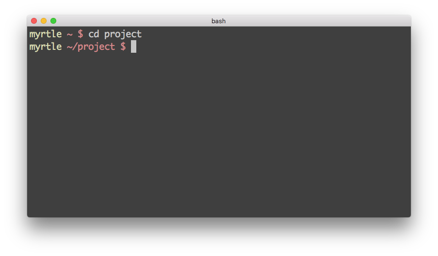

  <!-- .slide: class="center" -->
Note: Going back to our original statement "Just use the shell", what we mean is invoking manage.py shell
---

bash

<ps>myrtle</ps> <dr>~ $</dr> cd project 
<ps>myrtle</ps> <dr>~/project $</dr> <w>&nbsp;</w><b>
  
  
  
  
  
  
  
  
  
  

 
---

bash

<ps>myrtle</ps> <dr>~ $</dr> cd project 
<ps>myrtle</ps> <dr>~/project $</dr> ./manage.py shell<w>&nbsp;</w>
  
  
  
  
  
  
  
  
  
  

 
---

python3.6

<ps>myrtle</ps> <dr>~ $</dr> cd project 
<ps>myrtle</ps> <dr>~/project $</dr> ./manage.py shell 
Python 3.6.3 (default, Nov 9 2017, 15:58:30) 
[GCC 4.2.1 Compatible Apple LLVM 9.0.0 (clang-900.0.38)] on darwin 
Type "help", "copyright", "credits" or "license" for more information. 
(InteractiveConsole)  
&gt;&gt;&gt; <w>&nbsp;</w>
  
  
  
  
  

 
---
 

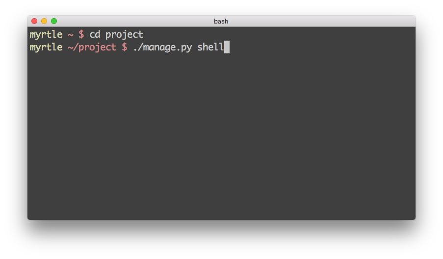

  <!-- .slide: class="center" -->
Note: So we navigate to our project directory and type manage.py shell
---
 

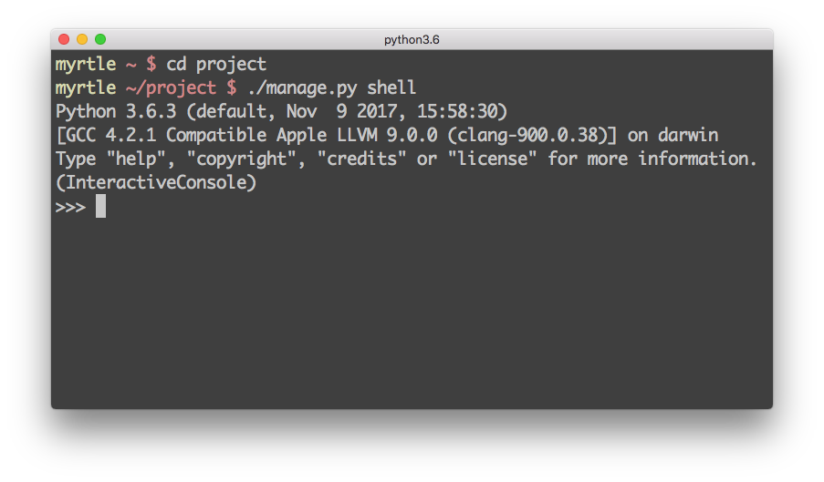

  <!-- .slide: class="center" -->
Note: and we're given a
---
## "But, how do I use the shell?" <!-- .slide: class="center" -->
## *"..."* <!-- .element: class="fragment" -->
---
## Finding all tables <!-- .slide: class="center" -->
---
<pre><code> 
<c>&dash;&dash; MySQL</c>
show tables

<c>&dash;&dash; PostgreSQL</c>
\dt 

<c>&dash;&dash; Oracle</c>
<r>SELECT *  &nbsp; FROM</r> <l>dba</l>.<l>tables</l>
</code></pre> 
---
<pre><code> 
<c>&num; ORM</c>
<c>&num; ...</c>

Note: To get this in the ORM.. there's no real good way.

In order to start querying model objects, you need to import the models

But without looking at the model code, and understanding what you're looking at in order to generate the import statement, you can be at a complete loss.

Thankfully, django is clever and has helpful methods you can call to generate a list of imports for all the models in the project
---
<pre><code> 
<c># Generate import statements</c>
<r>from</r> django.apps <r>import</r> apps
&nbsp; 
<r>for</r> app_config <r>in</r> apps.get_app_configs():
&nbsp; l <r>=</r> app_config.label
&nbsp; <r>for</r> model <r>in</r> app_config.get_models():
&nbsp; &nbsp; n <r>=</r> model._meta.object_name
&nbsp; &nbsp; <l>print</l>(<d>f'from</d> <l>{</l>l<l>}</l><d>.models import </d><l>{</l>n<l>}</l>')
</code></pre> 
---
 

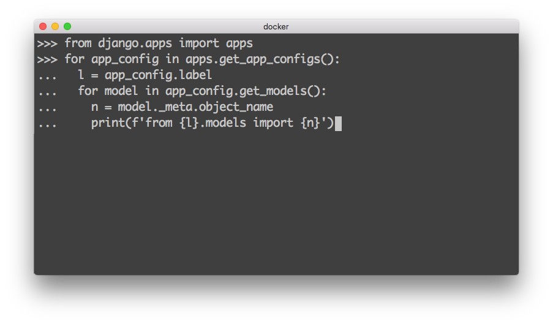

  <!-- .slide: class="center" -->
---
 

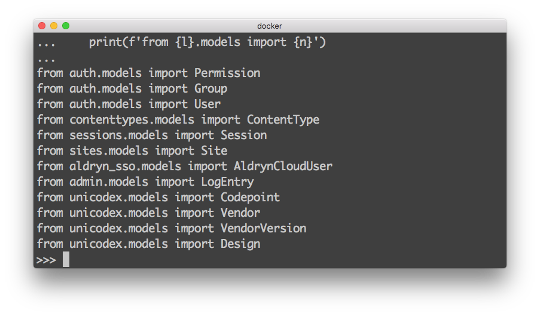

  <!-- .slide: class="center" -->
---
## Finding all tables <!-- .slide: class="center" -->
### via the database
---
 

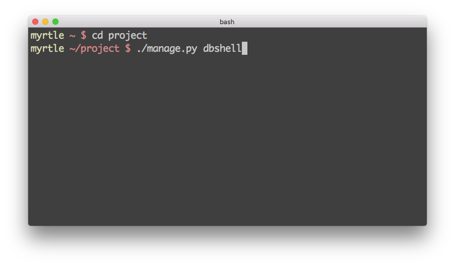

  <!-- .slide: class="center" -->
---
 

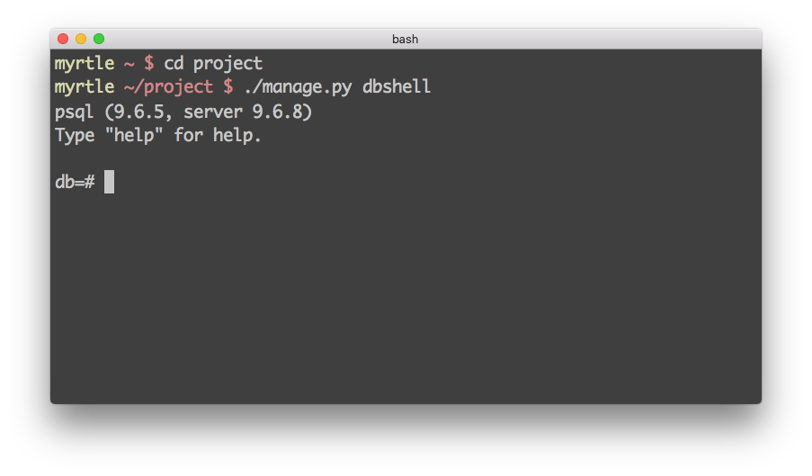

  <!-- .slide: class="center" -->
---
 

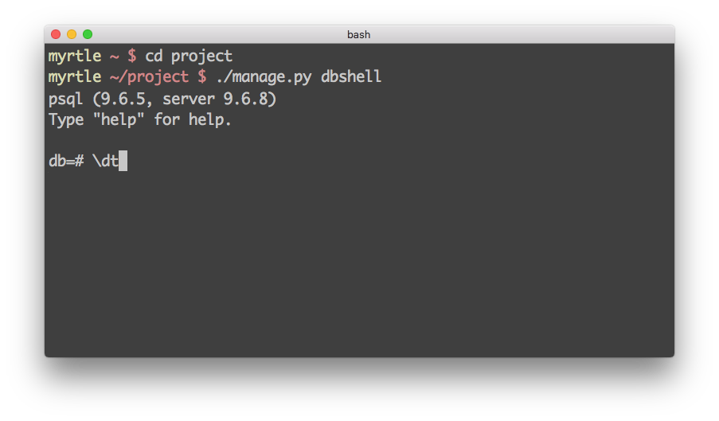

  <!-- .slide: class="center" -->
---
 

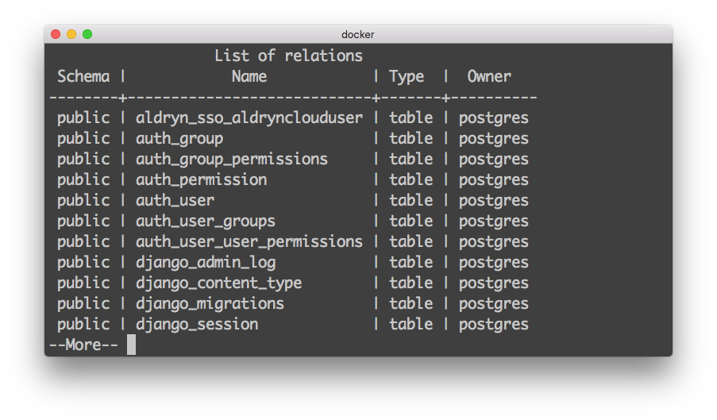

  <!-- .slide: class="center" -->
---
 

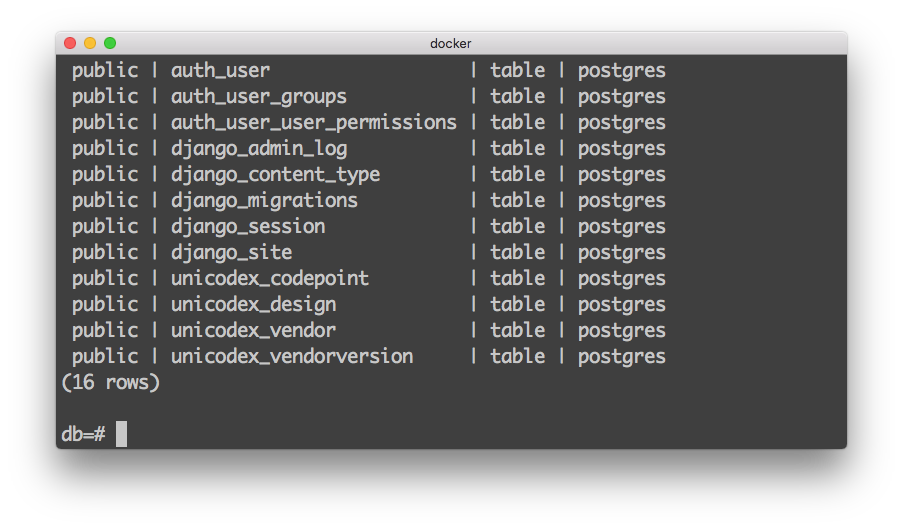

  <!-- .slide: class="center" -->
---
## Show all table contents <!-- .slide: class="center" -->
---
<pre><code> 
<c>&dash;&dash; SQL</c>
<r>SELECT *  &nbsp; FROM</r> <l>unicodex_codepoint;</l>
   
</code></pre> 
---
<pre><code> 
<c>&dash;&dash; SQL</c>
<r>SELECT *  &nbsp; FROM</r> <l>unicodex_codepoint;</l>

<c>&num; ORM</c>
Codepoint.objects.all() 
</code></pre> 
---
 

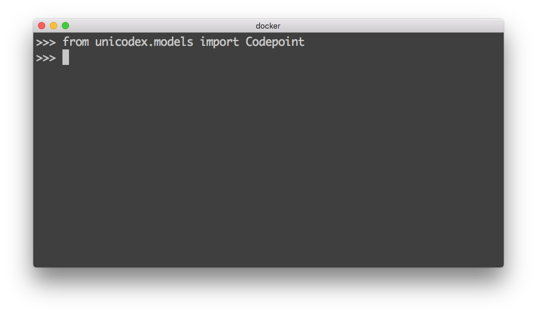

  <!-- .slide: class="center" -->
---
 

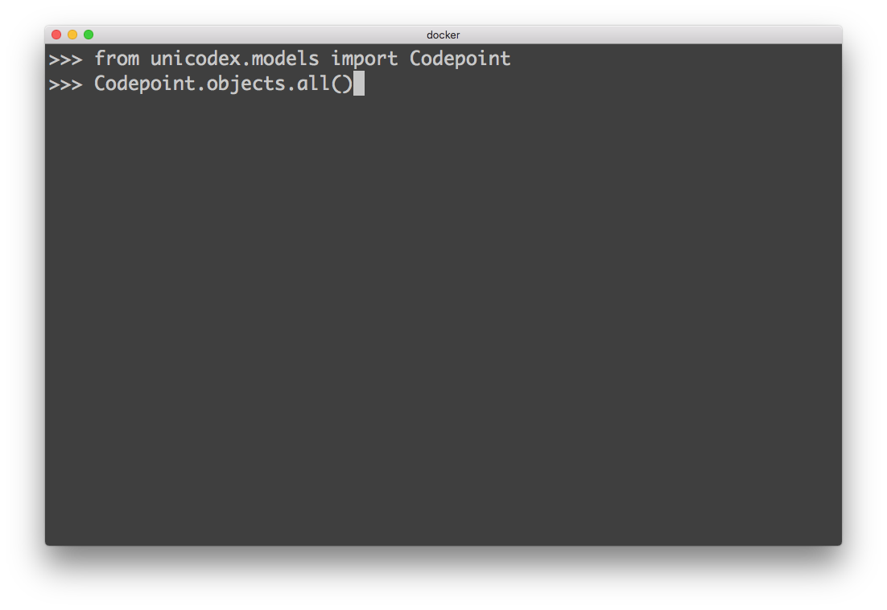

  <!-- .slide: class="center" -->
---
 

  <!-- .slide: class="center" -->
---
## Show specific table contents <!-- .slide: class="center" -->
---
<pre><code> 
<c>&dash;&dash; SQL</c>
<r>SELECT *  &nbsp; FROM</r> <l>unicodex_codepoint c</l> &nbsp;<r>WHERE</r> <l>c</l>.<l>name</l> <r>=</r> 'Sparkles';
   
</code></pre> 
---
<pre><code> 
<c>&dash;&dash; SQL</c>
<r>SELECT *  &nbsp; FROM</r> <l>unicodex_codepoint c</l> &nbsp;<r>WHERE</r> <l>c</l>.<l>name</l> <r>&equals;</r> 'Sparkles';

<c>&num; ORM</c>
Codepoint.objects.filter(<r>name&equals;</r>'Sparkles') 
</code></pre> 
---
 

---
 
---
## Get specific record <!-- .slide: class="center" -->
---
 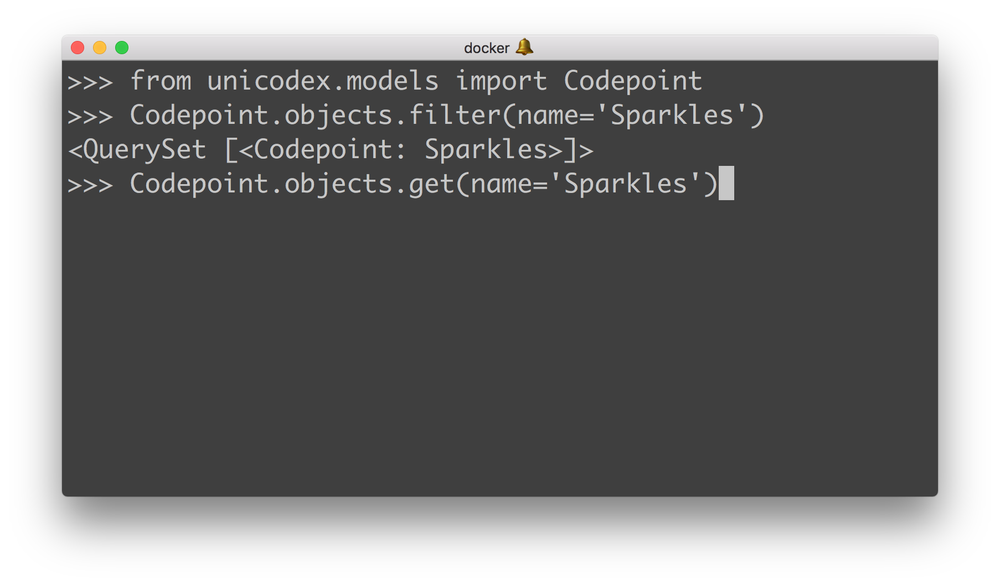
---
 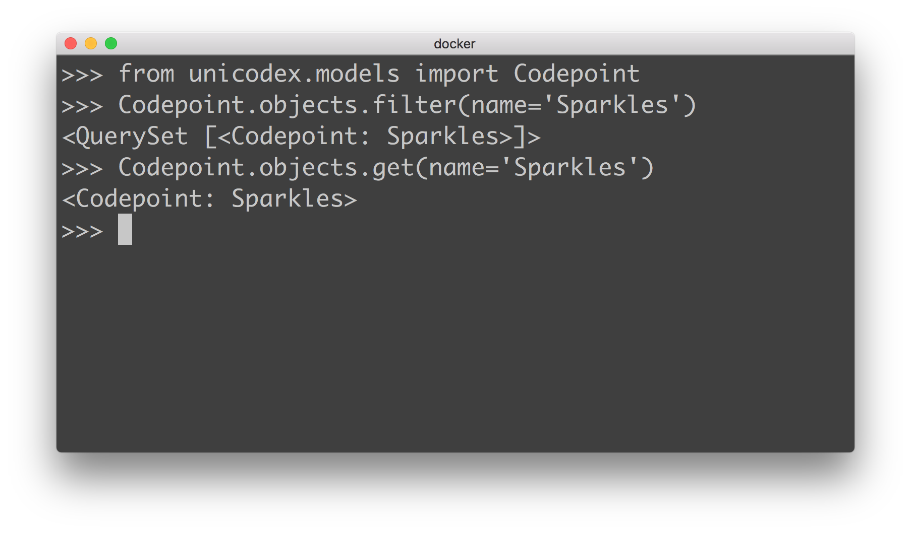
---
## Joins <!-- .slide: class="center" -->
---
<pre><code> 
<c>&dash;&dash; SQL</c>
<r>SELECT *  &nbsp; FROM</r> <l>unicodex_codepoint c, unicodex_design d</l> &nbsp;<r>WHERE</r> <l>c</l>.<l>name</l> <r>&equals;</r> 'Sparkles' <r>&nbsp; &nbsp;AND</r> d.codepoint_id = c.id;

<c>&num; ORM</c>
Design.objects.filter(<o> &nbsp;&nbsp;&nbsp;codepoint__name&equals;</o>"Sparkles") 
</code></pre> 
---
<pre><code> 
<c>&dash;&dash; SQL</c>
<r>SELECT *  &nbsp; FROM</r> <l>unicodex_codepoint c, unicodex_design d</l> &nbsp;<r>WHERE</r> <l>c</l>.<l>name</l> <r>&equals;</r> 'Sparkles' <r>&nbsp; &nbsp;AND</r> d.codepoint_id = c.id;

<c>&num; ORM</c>
Design.objects.filter(<o> &nbsp;&nbsp;&nbsp;codepoint__name&equals;</o>"Sparkles") 
&nbsp; &nbsp; &nbsp; &nbsp; &nbsp; &nbsp; <c>^^</c>
</code></pre> 
---
<pre><code> 
<c>&num; ORM</c>
Thing.objects.filter(<o>relation__name&equals;</o>"str") 
&nbsp; &nbsp; &nbsp; &nbsp; &nbsp; &nbsp; &nbsp; &nbsp; &nbsp;&nbsp; &nbsp; &nbsp; &nbsp; &nbsp; &nbsp; <c>^^</c>
</code></pre> 

### Double Underscore <!-- .element: class="fragment" -->
##### '*just follow the fields til you get to the one you want*' - <fl>[django docs](https://docs.djangoproject.com/en/2.0/topics/db/queries/#lookups-that-span-relationships)</fl> <!-- .element: class="fragment" -->

Note: Django offers a powerful and intuitive way to “follow” relationships in lookups, taking care of the SQL JOINs for you automatically, behind the scenes. To span a relationship, just use the field name of related fields across models, separated by double underscores, until you get to the field you want."
---

 

  <!-- .slide: class="center" -->
---
 

  <!-- .slide: class="center" -->
---
 

  <!-- .slide: class="center" -->
---

---
<pre><code> 
<c>&num; Follow the fields</c>
Design.objects.filter(  &nbsp;<o>vendorversion__vendor__name&equals;</o>"Apple")
</code></pre> 
---
<pre><code> 
<c>&num; Follow the fields</c>
Design.objects.filter(  &nbsp;<o>vendorversion__vendor__name&equals;</o>"Apple")

<c>&num; ... and then some </c>
Design.objects.filter(  &nbsp;<o>vendorversion__vendor__name__contains&equals;</o>"App")
</code></pre> 
---
<pre><code> 
<c>&num; ... and then some AND </c>
Design.objects.filter(  &nbsp;<o>vendorversion__vendor__name__contains&equals;</o>"App", &nbsp; <o>codepoint__name__startswith&equals;</o>"Spark", &nbsp; <o>image__endswith&equals;</o>"png")
</code></pre> 
---
<pre><code><c>&num; Field Lookups</c><table>
<tr><td><l>contains</l></td><td><o>LIKE "%?%"</o></td></tr>
<tr><td><l>icontains</l></td><td><o>ILIKE "%?%"</o></td></tr>
<tr><td><l>in</l></td><td><o>IN (?, ?, ?, ...)</o></td></tr>
<tr><td><l>gt, ge</l></td><td><o>&gt;, &gt;=</o></td></tr>
<tr><td><l>lt, le</l></td><td><o>&lt;, &lt;=</o></td></tr>
<tr><td><l>isnull</l></td><td><o>NULL</o></td></tr></table><c>&num; ... and many more!</c>
<fl>[docs - querysets field lookups](https://docs.djangoproject.com/en/2.0/ref/models/querysets/#field-lookups)</fl>
---
## `OR` else <!-- .slide: class="center" -->
---
## `Q` <!-- .slide: class="center" -->

Note: Q
---
<pre><code><c>&dash;&dash; SQL</c> <r>SELECT *  &nbsp; FROM</r> <l>unicodex_codepoint c, unicodex_design d</l> &nbsp;<r>WHERE</r> d.codepoint_id &equals; c.id <l><r>&nbsp; &nbsp;AND</r> (c</l>.<l>name</l> <r>&equals;</r> 'Sparkles' <l><r>&nbsp; &nbsp;&nbsp; OR</r> c</l>.<l>name</l> <r>&equals;</r> 'Unicorn')
</code></pre> 

---
<pre><code><c>&dash;&dash; SQL</c> <r>SELECT *  &nbsp; FROM</r> <l>unicodex_codepoint c, unicodex_design d</l> &nbsp;<r>WHERE</r> d.codepoint_id &equals; c.id <l><r>&nbsp; &nbsp;AND</r> (c</l>.<l>name</l> <r>&equals;</r> 'Sparkles' <l><r>&nbsp; &nbsp;&nbsp; OR</r> c</l>.<l>name</l> <r>&equals;</r> 'Unicorn')
<c>&num; ORM </c> Design.objects.filter( &nbsp; &nbsp;<o>codepoint_&#95;name</o>&equals;'Unicorn', &nbsp; &nbsp;<o>codepoint&#95;_name&equals;</o>"Sparkles")
---
<pre><code><c>&dash;&dash; SQL</c> <r>SELECT *  &nbsp; FROM</r> <l>unicodex_codepoint c, unicodex_design d</l> &nbsp;<r>WHERE</r> d.codepoint_id &equals; c.id <l><r>&nbsp; &nbsp;AND</r> (c</l>.<l>name</l> <r>&equals;</r> 'Sparkles' <l><r>&nbsp; &nbsp;&nbsp; OR</r> c</l>.<l>name</l> <r>&equals;</r> 'Unicorn')
<c>&num; ORM </c> Design.objects.filter( &nbsp; &nbsp;<o>codepoint_&#95;name</o>&equals;'Unicorn', &nbsp; &nbsp;<o>codepoint&#95;_name&equals;</o>"Sparkles")
<b><r>SyntaxError: keyword argument repeated</r></b>
---
<pre><code><r>from</r> django.db.models <r>import</r> Q
 Design.objects.filter( &nbsp; &nbsp;Q(<o>codepoint_&#95;name</o>&equals;'Unicorn'), &nbsp; &nbsp;Q(<o>codepoint&#95;_name&equals;</o>"Sparkles") )
<c># Unicorn and Sparkles?</c>
---
<pre><code><r>from</r> django.db.models <r>import</r> Q
 Design.objects.filter( &nbsp; &nbsp;Q(<o>codepoint_&#95;name</o>&equals;'Unicorn'), &nbsp; &nbsp;~Q(<o>codepoint&#95;_name&equals;</o>"Sparkles") )
<c># Unicorn OR Sparkles!</c>

---
## Counting results <!-- .slide: class="center" -->
---
<pre><code> 
<c>&dash;&dash; SQL</c>
<r>SELECT count(1)  &nbsp; FROM</r> <l>unicodex_codepoint c, unicodex_design d</l> &nbsp;<r>WHERE</r> <l>c</l>.<l>name</l> <r>&equals;</r> 'Sparkles' <r>&nbsp; &nbsp;AND</r> d.codepoint_id = c.id;

<c>&num; ORM</c>
Design.objects.filter(<o> &nbsp;&nbsp;&nbsp;codepoint__name&equals;</o>"Sparkles").count() 
</code></pre> 
---
# Protip <!-- .slide: class="center" -->
## Use `ipython` <!-- .slide: class="center" -->
---
<pre><code><c>$</c>./manage.py shell
&gt;&gt;&gt; 
^C 
<c>&num; requirements.txt, Pipfile, etc</c>
ipython 

$ ./manage.py shell
In [1]:

---

./manage.py shell

Line 1 
Line 2 
Line 3 
Line 4 
Line 5 
Line 6 
Line 7 
Line 8 
Line 9 
Line 10 
012345678901234567890123456789012345 
  

 
---

./manage.py shell

<tg>In [</tg><ty>1</ty><tg>]: from </tg><tb>uni</tb><w>&nbsp;</w>
 &nbsp; &nbsp; &nbsp; &nbsp; &nbsp; &nbsp; &nbsp; &nbsp; <w>unicodedata</w>
 &nbsp; &nbsp; &nbsp; &nbsp; &nbsp; &nbsp; &nbsp; &nbsp; <w>unicodex</w>
 &nbsp; &nbsp; &nbsp; &nbsp; &nbsp; &nbsp; &nbsp; &nbsp; <w>unittest</w>
</pre></code> 

 
---
# Bonus <!-- .slide: class="center" -->
## PostgreSQL Gotchas <!-- .slide: class="center" -->

---
<pre><code>$ pg_dump ... > db_dump

$ grep INSERT db_dump <r>|</r> wc -l
0 

$ less db_dump
... 
COPY public.django_site (id, domain, name) FROM stdin;
... 

</code></pre> 
---

<pre><code>$ pg_dump --insert .. > db_dump_inserts

$ grep INSERT db_dump_inserts <r>|</r> wc -l
30241 

$ less db_dump_inserts
... 
INSERT INTO public.django_site VALUES
... 
</code></pre> 

---
# .. <!-- .slide: class="center" -->
---
 

  <!-- .slide: class="center" -->
---
 <!-- .slide: data-background-image="pictures/pyconau18.png"-->

Note: CFP?
---
  
 

 <!-- .slide: class="center" -->
 
 Some images: [WOCinTech Chat](https://www.flickr.com/photos/wocintechchat/albums)