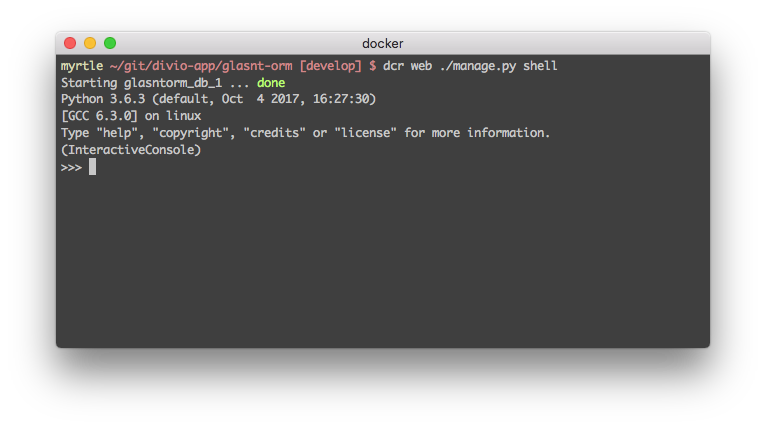

  
# ORM: The Sequel <!-- .slide: class="center" -->
### SyPy April 2018 <!-- .slide: class="center" -->
 
---
 

 <!-- .slide: class="center" -->
---
 

  <!-- .slide: class="center" -->
&nbsp; <!-- .slide: data-background-color="#f58619" -->
---
 

  <!-- .slide: class="center" -->
---
 

  <!-- .slide: class="center" -->
&nbsp; <!-- .slide: data-background-color="#302613" -->
---
 

  <!-- .slide: class="center" -->
&nbsp; <!-- .slide: data-background-color="#c2eaf4" -->
---
 <!-- .slide: data-background-image="pictures/17_bg.png"-->
 

  <!-- .slide: class="center" -->
---
 

  <!-- .slide: class="center" -->
---
# &nbsp; <!-- .slide: class="center" -->

Note: Nope.
---
 

  <!-- .slide: class="center" -->
---
 <!-- .slide: data-background-image="pictures/macbook.jpg"-->
---
 <!-- .slide: data-background-image="pictures/thinkpad.jpg"-->
---
 <!-- .slide: data-background-image="pictures/apex32.jpg"-->
---
 

  <!-- .slide: class="center" -->
---

 

  <!-- .slide: class="center" -->
---
 <!-- .slide: data-background-image="pictures/fogofwar.png"-->
---
 

  <!-- .slide: class="center" -->
---
  
 

 <!-- .slide: class="center" -->
 
 Some images: [WOCinTech Chat](https://www.flickr.com/photos/wocintechchat/albums)