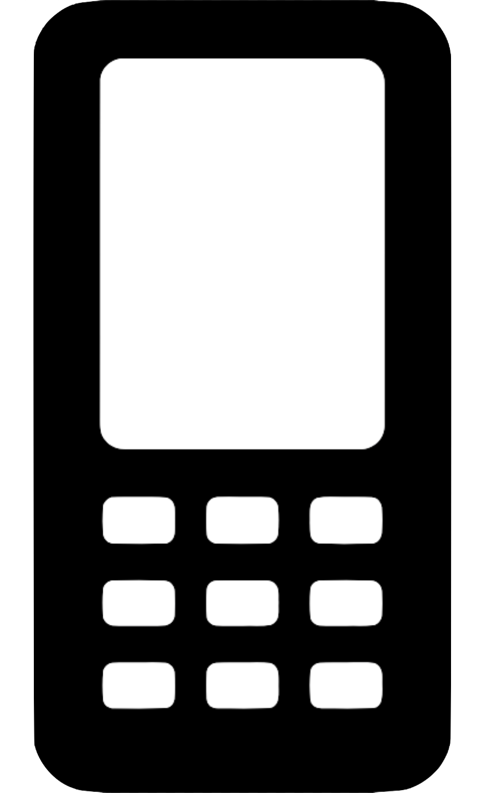
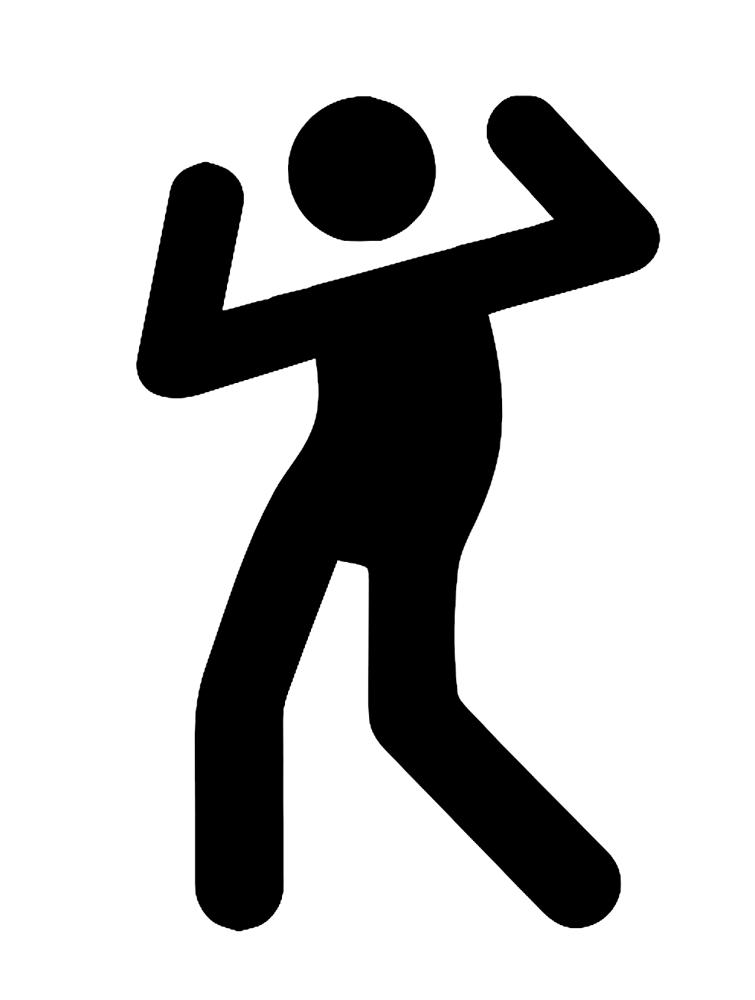
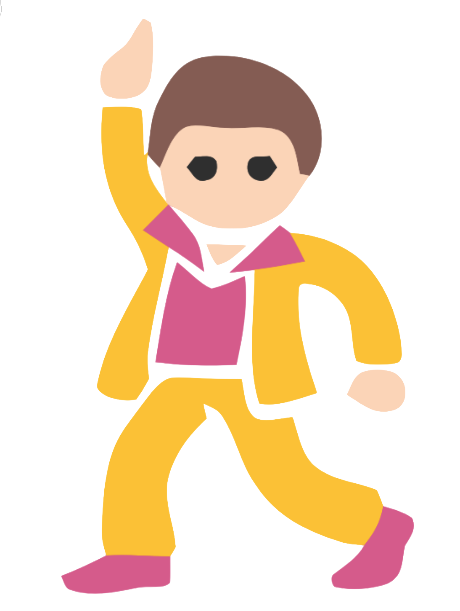
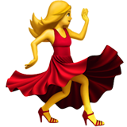
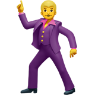
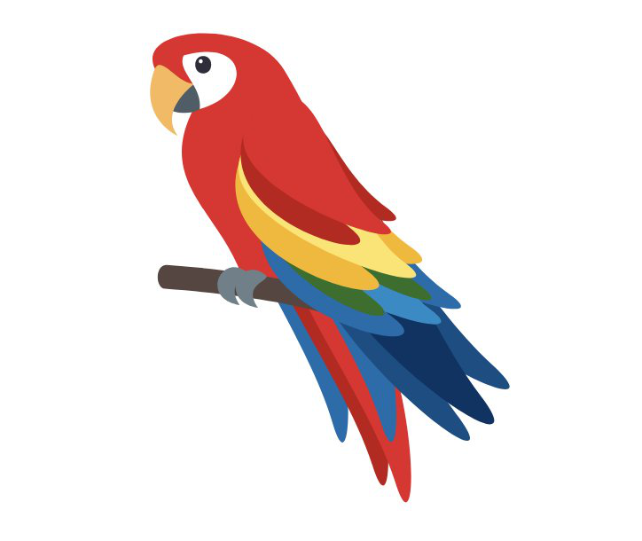
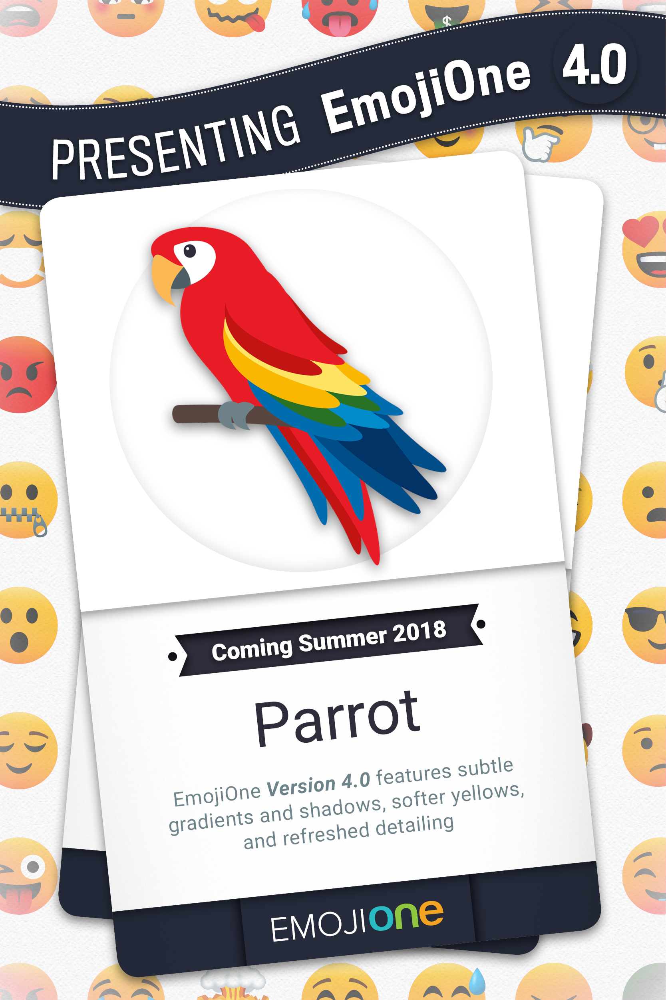

 

 <!-- .slide: class="center" -->
---
### &nbsp; <!-- .slide: class="center" -->
## Communication strategies beyond the Basic Multilingual Plane <!-- .slide: class="center" -->
### &nbsp; <!-- .slide: class="center" -->

---

 

 <!-- .slide: class="center" -->

Note: Hi! I'm Katie
---

 

 <!-- .slide: class="center" -->

Note: Thank you so much for having me at your amazing conference

---

 

 <!-- .slide: class="center" -->

Note: A number of my good friends have had the pleasure of keynoting this event in the past few years, but it was only after seeing the AMAZING CATERING that I cheekily suggested I should keynote
---

 

  <!-- .slide: class="center" -->

Note: and does it live up to expectations :D

But I'm not just here for cake

---

 

 <!-- .slide: class="center" -->

Note: I've been giving a talk for over two years now called

The power and responsibility of unicode adoption

---
 

 <!-- .slide: class="center" -->
 

 <!-- .slide: class="center" -->

Note: I've given this talk a few times now, mostly in Australia and New Zealand, but twice in the US, once in the UK and Hungary
---

 

 <!-- .slide: class="center" -->

Note: I'm not giving that talk today. If you are interested in that talk, there are many differente verions available online, and most of the recordings are linked on my website

Instead I want to talk about something else today

---

  <!-- .slide: class="center" -->

Note: dragons

Dragons are real. They just come from another plane of existance... let me explain

---

 

 <!-- .slide: class="center" -->

Note: Back in the early days of computers, every country had their own standard of how they stored data

Americans had ASCII, Taiwan had Big 5, Japan had Shift JIS, and there were so many others

---

 

 <!-- .slide: class="center" -->

Note: trying to convert between all these standards was terrible.

There wasn't one standard that everyone could use, that could handle every type of symbol everyone wanted

---

 

 <!-- .slide: class="center" -->

Note: Thankfully, the Unicode Consortium was formed and made a universal encoding - unicode

It allows for over a million different code points to be encoded within it.

The space is split up into planes, allowing for around 65 thousand characters each

---

 

 <!-- .slide: class="center" -->
 

 <!-- .slide: class="center" -->
 

 <!-- .slide: class="center" -->

Note: Plane 0 is known as the Basic Multilingual Plane, and covers all the characters you can represent with just 4 hexadecimal digits

This plane contains a lot of things; Every latin character, non-latin european character, middle eastern scripts, asian scripts, and all the Han unificiation characters. There's a lot in this plane, but it's only one of 17 planes

You can use up to 8 hexidecimal characters - 0 through F - so there's plenty of room for everyone

---

 

 <!-- .slide: class="center" -->

 

 <!-- .slide: class="center" -->
 

 <!-- .slide: class="center" -->

Note: The plane I'm more interested in, and what I'll be focusing on, is the Supplimentary Multilingual Plane

This is where you find every emoji that currently exists.

---
  <!-- .slide: class="center" -->

Note: 

This is where the dragons live.

But what I'm talking about is one specific dragon

---

  <!-- .slide: class="center" -->

 

 <!-- .slide: class="center" -->

Note: Dragon one eff four oh nine

This is the code point for the dragon emoji

I can't send you this dragon, sadly.

But I can send you the reference code point to this dragon, and your phone, tablet, laptop will intepret that codepoint, and display *a* dragon

But it might not be this dragon

It depends on what operating system your device is using
---

  <!-- .slide: class="center" -->

Note: if you have a HTC phone, your dragon will look like this

But if oyu have a samsung, it'll look like

---
  <!-- .slide: class="center" -->

Note: like this

But that's only if you have the latest updates on your phone

If you don't
---

  <!-- .slide: class="center" -->

Note: your dragon looks a little bit cuter!

The thing is, HTC and Samsung have their own emoji

If oyu have an android phone by a different manufacturer

---

  <!-- .slide: class="center" -->

Note: your dragonw ill probably look like this

But if you have a newer android, or have service from a provider that gives operating system updates

---

  <!-- .slide: class="center" -->

Note: your dragon will look like this

But if you have an iphone, your dragon will look completely different

---

  <!-- .slide: class="center" -->

Note: older apples will look like this

and newer ones

---

  <!-- .slide: class="center" -->

Note: will look like this

But it doesn't matter what platform you have if you're using certain social media platforms

Because they have their own emoji!

---

  <!-- .slide: class="center" -->

Note: twitter's version looks more like the Loch Ness Monster

And for Facebook, it's even worse, because it can depending HOW YOU"RE USING FACEBOOK

---

  <!-- .slide: class="center" -->

Note: if you're using the Facebook Mobile app, messenger, your dragon looks like this

but if you're using the facebook WEBSITE

---
  <!-- .slide: class="center" -->

Note: your dragon looks different **AGAIN**
---

 

 <!-- .slide: class="center" -->
 

 <!-- .slide: class="center" -->

Note: There are ten different dragons here, and that's not even counting if you have an older version of windows, if you're running linux, if you have custom emoji sets...

And here's the thing. They all look like dragons. I mean, sure, some look more european, and others look more like traditional Long dragons, but they're all dragons.

And depending on if you're using facebook on the web or messenger your dragon will change between chinese and medieval... but they're all dragons.

I mean, sure, a few of them are charging up ball lightning for some reason, but they're all dragons

It's when you start trying to use only emoji to communicate that you get issues.

For example, if you were to send the message: I feel powerful, with a dragon on the end... are you being
---

  <!-- .slide: class="center" -->

Note: literal? I feel so powerful I'm bristling with power!

---

  <!-- .slide: class="center" -->

Note: sarcastic? Feeling bloated and tired and a bit green around the gills...
---

# &nbsp;

Note: yeah, okay, I might be pushing this anology with dragons, but this happens all the time in real life

For example: I get to speak at PyCon TW!

---

 

 <!-- .slide: class="center" -->

Note: What am I trying to say here?

This face to me seems... slightly anguished?

Maybe I meant another face..
---

 

 <!-- .slide: class="center" -->

Note: this is only just slightly better to me, but that mouth seems wrong, and not the emoji I'd chose to describe my actual feeling: excitement

---

 

 <!-- .slide: class="center" -->

Note: this particular pair of emoji are Grimace and Grinning

In older versions of emoji these codepoints were represeneted in ways where they could be easily confused

So much so that there was a research study on exactly this

“Blissfully happy” or “ready to fight”: Varying Interpretations of Emoji

From the University of Minnesota

It found that while the misintepretation across different platforms were problematic, as we've already seen with our dragons, there were issues with different emoji within the same platform.

For this partiuclar instance this has been fixed

---

 

 <!-- .slide: class="center" -->

Note: Nearly every platform has ensured that the grinning face with smiling eyes emoji has a mouth that suits

But there are still emoji that can be confused with each other.

For example:

---

# &nbsp;

Note: A message from a relative letting you know that the family pet is in hosptial

---

 

 <!-- .slide: class="center" -->

Note: crying happy face

... Not sure that's the one you meant, honey...

---

 

 <!-- .slide: class="center" -->

Note: you probably meant Loudly crying face

I mean, sure, you can see the subtle differences here when they're big on a projector screen

The mouths are different, sure, but if you're typing this out on a phone you're not getting a good resolution to view the differences
---

 <!-- .slide: class="center" -->

Note: your phone's emoji keynote is TINY and so it's easy to not ever see the differences

It's so very important to make sure you're not allowing the intepretation of your message to hang in the balance of an emoji.

---

 

 <!-- .slide: class="center" -->

Note: or the fact that if you look up the different emoji, you get things that might not align with your expression of an emotion

For example - these are weary, tired sleepy and sleeping

I know the last one, that's a person snoring

the other three are completely subtitutable for me.

---

# &nbsp;

Note: There's another issue wrapped up in here that I want to talk about.

And that's where emoji come from

---

 

 <!-- .slide: class="center" -->

Note: the simple answer is Japan!

But there's a long and complicated answer that describes why the confusion with the eyes happens.

While picograms have been a part of many written languages for a veeery long time

It was japan in the 90's that introduced what we now call emoji

Named - "e" - Picture, and "moji" - character

---
 

 <!-- .slide: class="center" -->

Note: It was introduced on on mobile phones. Not when they looked like this

---
 

 <!-- .slide: class="center" -->

Note: but when we looked like this

The object on the right is known as a Pager. It was a way to receive messages and it beeped at you, constantly, so it's also referred to as a beeper.

Japanese telcoms realised there was space in their encoding sets for small images for useful things

---

 

 <!-- .slide: class="center" -->

Note: like hearts, location symbols like a mobie thetre, cats, and sparkles

But some of these symbols make more sense than others
---

 

 <!-- .slide: class="center" -->

Note: for me, I can understand what these symbols mean

Here, let me show them in their current Apple rendering to assist
---
 

 <!-- .slide: class="center" -->
Note: I know these two. ZZZ is sleeping. The bang is a collision, or explision
---
 

 <!-- .slide: class="center" -->
Note: but this.. this is a bit more unfamiliar to me. This is dizzy, like when a cartoon character runs into a wall and hits their head, they see stars
---
 

 <!-- .slide: class="center" -->
Note: However, this symbol. I have absolutely no idea on.

Coming from outside a culture where this symbol is used, I have no context.

But I looked it up. This is anger. It's from manga, and is supposed to represented throbbing blood vessels on the head.

Yeah, okay, I can see that now. Anger.

But it doesn't stop there. I'm a dumb westerner

---
 

 <!-- .slide: class="center" -->

Note: so these don't have any context for me.

These, for the record, are Information Desk, Okay, and No.

The middle one is from Japanese culture where a circle is a mark of correctness
---
 

 <!-- .slide: class="center" -->

Note: I'm used to having a tick or a check for correctless, so having a picture of someone making an O face doesn't register with me
---
 

 <!-- .slide: class="center" -->

Note: so back to the two smiling faces. The difference in the eyes is simple to show.
---
 
^_^
 <!-- .slide: class="center" -->
Note: kaomoji predate emoji, and use symbols to make faces

This is smiling eyes.

This style is very much prelevent in Asia and communites who are within that culture.

As for the west?
---
 
:D
 <!-- .slide: class="center" -->

Note: this is our smile. It's sideways, and the eyes are made with a colon
---
## :D ^_^
 

 <!-- .slide: class="center" -->

Note: so when you put them together with their emoji counterparts, you can see how someone like me might not understand how the eyes in cartoons hold all the emotion in Asian comics, where as in the west, it's normally the mouth.

Once you first learn this, the difference is obvious.

Unfortunately, this still isn't universal knowledge.
---

 

 <!-- .slide: class="center" -->
Note: this is a new emoji callled Face With Hand Over Mouth

And when there are smiling eyes on every platform apart from Apple... you're going to get problems.

Having the smiling eyes changes the assumed expression from

ooops 

to 

teehee 

Which means if you send this two or from an iphone, your meaning will be lost without any context

And it's not just faces where context matters
---

 <!-- .slide: class="center" -->
 

 <!-- .slide: class="center" -->

Note: these are just some of the hand and fingers based emoji that are available.

Depending on your culture, you may or may not recognise any of these.

---

 

 <!-- .slide: class="center" -->

Note: the index and middle finger extended, palm facing out

---

 

 <!-- .slide: class="center" -->

Note: it could mean "peace"

---

 

 <!-- .slide: class="center" -->

Note: it could mean two

But only in some languages. In german, this isn't two, as they start counting form the thumb

And there's even more examples

---
 

 <!-- .slide: class="center" -->

Note: extending the thumb only, pointed upwards

This could mean

---

 

 <!-- .slide: class="center" -->

Note: everything is okay!

---

 

 <!-- .slide: class="center" -->

Note: in scuba diving, it means SOMETHING IS VERY WRONG and I have to come up for air

---

 

 <!-- .slide: class="center" -->

Note: in Germany it could be the number one

---

 

 <!-- .slide: class="center" -->

Note: while in japan it means five!

---
 

 <!-- .slide: class="center" -->

Note: while in Australia it could used to flag down a bus or a car,

or when use agressively
---
 

 <!-- .slide: class="center" -->

Note: can be an extremely rude 'Up Yours!'
---

&nbsp; 

Note: there are some things that will always only make sense in context

such is the ambiguity of human gestures

But 

---

  <!-- .slide: class="center" -->

Note: getting back to our original point

Dragons 

There are efforts to fix how emoji are represented across different platforms so they all at least look the same.

---

 

 <!-- .slide: class="center" -->

Note: this has been dubbed the Convergence of emoji

Bringing all the representations of a single codepoint across platforms closer together.

---

  <!-- .slide: class="center" -->
 

 <!-- .slide: class="center" -->

Note: the most notable instance of this is with this emoji, dancer.

Now, this is the most recent Micosft represetnation, but in the beginning, it wasn't so simple
---
 

 <!-- .slide: class="center" -->
 

 <!-- .slide: class="center" -->
---
 

 <!-- .slide: class="center" -->
 

 <!-- .slide: class="center" -->
---
 

 <!-- .slide: class="center" -->
 

 <!-- .slide: class="center" -->
---
 

 <!-- .slide: class="center" -->
 

 <!-- .slide: class="center" -->
---
 

 <!-- .slide: class="center" -->
 

 <!-- .slide: class="center" -->
---
 

 <!-- .slide: class="center" -->
 

 <!-- .slide: class="center" -->
---
 

 <!-- .slide: class="center" -->
 

 <!-- .slide: class="center" -->
---
 

 <!-- .slide: class="center" -->
 

 <!-- .slide: class="center" -->
---
 

 <!-- .slide: class="center" -->
 

 <!-- .slide: class="center" -->
---

 

 <!-- .slide: class="center" -->
 

 <!-- .slide: class="center" -->
---
 

 <!-- .slide: class="center" -->
 

 <!-- .slide: class="center" -->

Note: today, most of the images look the same. But it's to be noted that because of some of the issues
---
 

 <!-- .slide: class="center" -->
 

 <!-- .slide: class="center" -->

Note: they literally made a man dancer just to try and clean it up
---
 

 <!-- .slide: class="center" -->

Note: this is just the story for one particular code point, but it could very well happen again.

New emoji have been introduced every for the past few years, with mixed results
---

  <!-- .slide: class="center" -->
 

 <!-- .slide: class="center" -->

Note: this is the dumpling emoji, which was introduced in Unicode version 10 last year

The submission to the Unicode Consortium included this image as a suggested represetnation

But it's only ever a suggestion. Vendors can choose whatever they want

Which is how we ended up with this
---

 

 <!-- .slide: class="center" -->

Note: yes, they're all dumplings, but some are obviously "shou long bao" while others look more like gyoza

which means that if you're using only this emoji to denote where you want to go for lunch, you're either going to end up having people thinking you want chinese or japanese, depending on what mobile phone they use.

I mean, it's not the end of the world, but it's a serious consideration.

---
&nbsp; 

Note: 
Personally I have a vested interest in this. Not dumplings. I mean, I love dumplings, but I have a vested interest in how emoji are going to be displayed.

One emoji in paricular.

---
  <!-- .slide: class="center" -->

 

 <!-- .slide: class="center" -->

Note: this emoji, the parrot emoji

Because I made this emoji

I submitted a proposal to the unicode consortium, and it was approved

So some time in the next few months, the parrot emoji will show up on your phones.

It won't look like this. This is a sample image created by Emojipedia, but it's a represetnation of what it could look like.

But I have no idea how it will acutally appear on devices

---

 

 <!-- .slide: class="center" -->

Note: 
Will it be a toucan? A cockatoo? a parakeet? a Macaw? A kakapo?

I don't know

it'll be a surprise :)

Well, that's a lie. I do know what one will look like

---

 

 <!-- .slide: class="center" -->

Note: I know that the EmojiOne parrot emoji will look like a scarlet macaw

---

Note: EmojiOne have kindly shared this preview with me

---

&nbsp; 

Note: 

The thing is, I don't knwo what's going to happen

I mean, I do know little things; like that the new emoji on Twitter should be available in the middle of June. And I know that Some of the other new emoji include lobsters, kangaroos, a partying face,

There's a lot I don't know about emoji

I don't know how emoji will continue to evolve

---

 

 <!-- .slide: class="center" -->

Note: if I did I'd be able to see into the future

There will be more emoji

This is inevitable, ebcause the process to add new emoji is a public process.

For instance.. what is one emoji that could be added...

---

 

 <!-- .slide: class="center" -->

Note: A dragon...

---

 

 <!-- .slide: class="center" -->

Note: Fly. A dragonfly

To request a new emoji, you need to submit an aplication directly to the Unicode Consortium's Emoji subcommittee

They detail a list of inclusion and exclusion factors
---

 

 <!-- .slide: class="center" -->
Note: For instance, would the emoji be popular

Would it be frequently used

Is it disinctive

Is it already used on an instant messaging service, where adding it to unicode would be good for compatibility purposes

However, there are factors that work against it too

---

 

 <!-- .slide: class="center" -->

Note: is it overly specific

is it already represented

is it a logo or a brand

---

 

 <!-- .slide: class="center" -->

Note: I think that dragonfly might be a good addition, but it is a little bit specific.

There also isn't currently a fly, let alone a dragon fly

---

 

 <!-- .slide: class="center" -->

Note: there is only a limited amount of insects already, but is this enough?

---

 

 <!-- .slide: class="center" -->
#### [unicode.org/emoji/selection.html](https://www.unicode.org/emoji/selection.html)

Note: if you are interestd, you can email the unicode consortiym directly

But 

there is an entire community working towards creating new proposals

---
 

 <!-- .slide: class="center" -->

#### [emojination.org](http://www.emojination.org/)

Note: emojination is a community that helps you propose emoji

They are the ones that made the dumpling emoji happen

and make sure that you don't submit somthing that's already been submitted

for instance, if you wanted, say, bubble tea to be an emoji, they already have it up there, and it's currently "on hold"

I've helped out with a few on there, including knitting needles, yarn, and thread. Ive also had some rejected, like Coin and Needle

If you are interested, check them out

---

 

 <!-- .slide: class="center" -->

#### [emojipedia.org](http://www.emojipedia.org/)
Note: lot of information I've presented today is based on the collection of information known as emojipedia

it's like an encyclopedia, but for emoji

It's run by Jeremy Burge, an Australian (yay australians!) and it has so much useful information about every minor change in emoji over every major vendor, and also has a blog, and a podcast, and a newsletter. I've been in the newsletter. It's kinda cool :D

---
 

 <!-- .slide: class="center" -->

Note: and that's all I had

GO TO - question time?

OR 

END? 

---
 

 <!-- .slide: class="center" -->

### glasnt.com/talks
---

 

 <!-- .slide: class="center" -->