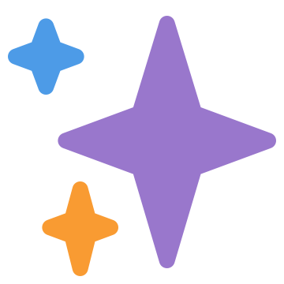

class: title
# <br>Turning wat into why
## All Things Open, 2018


???

You got this 💪
---
class: title
# JavaScript
### ☞ &nbsp;`Chrome 69 Console`
???

Let's talk about javascript
---
.righthead[JavaScript]
<pre><code class="javascript">> 4 + 2</code></pre>
--
<pre><code class="javascript">6</code></pre>
--
<pre><code class="javascript">> 4 - 2</code></pre>
--
<pre><code class="javascript">2</code></pre>
--
<pre><code class="javascript">> 4 - "2"</code></pre>
--
<pre><code class="javascript">2</code></pre>
--
<pre><code class="javascript">> 4 + "2"</code></pre>
--
<pre><code class="javascript">"42"</code></pre>

---
.righthead[JavaScript]
<pre><code class="javascript">> 1 == "1"</code></pre>
--
<pre><code class="javascript">true</code></pre>
--
<pre><code class="javascript">> 1 === "1"</code></pre>
--
<pre><code class="javascript">false</code></pre>
---
.righthead[JavaScript]
<pre><code class="javascript">.large[> ".emoji[👩🏻‍🚀]".split("")]</code></pre>
--
<pre><code class="javascript">.large[[".w[�]",".w[�]",".w[�]",".w[�]",,".w[�]",".w[�]"]]</code></pre>
---
.righthead[JavaScript]
<pre><code class="javascript">> [] + []</code></pre>
--
<pre><code class="javascript">""</code></pre>
--
<pre><code class="javascript">> [] + {}</code></pre>
--
<pre><code class="javascript">"[object Object]"</code></pre>
--
<pre><code class="javascript">> {} + []</code></pre>
--
<pre><code class="javascript">0</code></pre>
--
<pre><code class="javascript">> {} + {}</code></pre>
--
<pre><code class="javascript">NaN</code></pre>
---
background-image: url("images/wat.png")
.wat[.wat-pos[wat]]
---
background-image: url("images/wat.png")
.wat[.wat-pos[.strike[wat]]]
.why[.why-pos[why]]
---
class: title
# JavaScript
???

Let's talk about javascript
---
.righthead[JavaScript]
<pre><code class="javascript">> 4 + 2</code></pre>
<pre><code class="javascript">6</code></pre>
<pre><code class="javascript">> 4 - 2</code></pre>
<pre><code class="javascript">2</code></pre>
<pre><code class="javascript">> 4 - "2"</code></pre>
<pre><code class="javascript">2</code></pre>
<pre><code class="javascript">> 4 + "2"</code></pre>
<pre><code class="javascript">"42"</code></pre>

???

the problem with this example is to do with types
---
.righthead[JavaScript]
<pre><code class="javascript">> 4 + 2</code></pre>
<pre><code class="javascript">6</code></pre>
<pre><code class="javascript">> 4 - 2</code></pre>
<pre><code class="javascript">2</code></pre>
<pre><code class="javascript">> 4 .blue[-] "2" // implicit coercion</code></pre>
<pre><code class="javascript">2</code></pre>
<pre><code class="javascript">> 4 + "2"</code></pre>
<pre><code class="javascript">"42"</code></pre>


???
1: subtraction is only defined for numerics, so it coerces the string into a number
---
.righthead[JavaScript]
<pre><code class="javascript">> 4 + 2</code></pre>
<pre><code class="javascript">6</code></pre>
<pre><code class="javascript">> 4 - 2</code></pre>
<pre><code class="javascript">2</code></pre>
<pre><code class="javascript">> 4 .blue[-] "2" // implicit coercion</code></pre>
<pre><code class="javascript">2</code></pre>
<pre><code class="javascript">> 4 .blue[+] "2" // overloaded operand</code></pre>
<pre><code class="javascript">"42"</code></pre>


???

2: the plus is an overloaded operand. It can act as both numeric addition, or in this case, concatenation

---
.righthead[JavaScript]
<pre><code class="javascript">> 1 == "1"</code></pre>
<pre><code class="javascript">true</code></pre>
<pre><code class="javascript">> 1 === "1"</code></pre>
<pre><code class="javascript">false</code></pre>
???

This next example is to do with the difference in the equality operators

---
.righthead[JavaScript]
<pre><code class="javascript">> 1 .blue[==] "1" // with type coercion</code></pre>
<pre><code class="javascript">true</code></pre>
<pre><code class="javascript">> 1 .blue[===] "1" // without type coercion</code></pre>
<pre><code class="javascript">false</code></pre>
???

This next example is to do with the difference in the equality operators
---
.righthead[JavaScript]
<pre><code class="javascript">.large[> ".emoji[👩🏻‍🚀]".split("")]</code></pre>
<pre><code class="javascript">.large[[".w[�]",".w[�]",".w[�]",".w[�]",,".w[�]",".w[�]"]]</code></pre>
???

JS predates unicode, so javascript makes some... assumptions about variable length characters
like the fact that they are each two characters.
---

.righthead[JavaScript]
<pre><code class="javascript">.large[> ".emoji[👩🏻‍🚀]".split("")]</code></pre>
<pre><code class="javascript">.large[[".w[�]",".w[�]",".w[�]",".w[�]",,".w[�]",".w[�]"]]</code></pre>
<br>
<pre><code class="javascript">.large[> Array.from(".emoji[👩🏻‍🚀]")]</code></pre>
--
<pre><code class="javascript">.large[[".emoji[👩]",".emoji[🏻]","‍",".emoji[🚀]"]]</code></pre>

???

What you should be using in this situation is Array.from

This is the correct answer here.

Because: Fun Emoji Fact - the light skin toned female astronaut emoji is

a sequence of the Woman emoji

the light skin tone fitzpatrick modifier (which allows you to define skin colour)

a zero width joiner

and the rocket ship emoji

Which means we can also do stuff like string replacement

---

.righthead[JavaScript]
<pre><code class="javascript">.large[> ".emoji[👩🏻‍🚀]".replace(".emoji[👩]",".emoji[👨]")]]</code></pre>
--
<pre><code class="javascript">.emoji[👨🏻‍🚀]</code></pre>
--
<br><br><br>
.center[.lemoji[👩🏻‍🚀 ➡ 👨🏻‍🚀]]
---

.righthead[JavaScript]
<pre><code class="javascript">> [] + []</code></pre>
<pre><code class="javascript">""</code></pre>
<pre><code class="javascript">> [] + {}</code></pre>
<pre><code class="javascript">"[object Object]"</code></pre>
<pre><code class="javascript">> {} + []</code></pre>
<pre><code class="javascript">0</code></pre>
<pre><code class="javascript">> {} + {}</code></pre>
<pre><code class="javascript">NaN</code></pre>

???

but as for this example...

---

.righthead[JavaScript]
<pre><code class="javascript">> [] + []</code></pre>
<pre><code class="javascript">"" // ???</code></pre>
<pre><code class="javascript">> [] + {}</code></pre>
<pre><code class="javascript">"[object Object]" // ???</code></pre>
<pre><code class="javascript">> {} + []</code></pre>
<pre><code class="javascript">0 // ???</code></pre>
<pre><code class="javascript">> {} + {}</code></pre>
<pre><code class="javascript">NaN // ???</code></pre>
???

This one is a bit more complicated.
---

class: title
# `+`

???

Remember that overloaded operand I mentioned earlier?

Let's dive into that a bit more.

---
class: center
# .ecma[.ecma-header[ECMA-262, 9th edition]]
## .ecma[.ecma-header[ECMAScript® 2018 Language Specification]]
### .ecma[12.8.3 The Addition Operator ( `+` )]
#### &nbsp;

---

class: center
# .ecma[.ecma-header[ECMA-262, 9th edition]]
## .ecma[.ecma-header[ECMAScript® 2018 Language Specification]]
### .ecma[12.8.3 The Addition Operator ( `+` )]
#### NOTE The addition operator either performs string concatenation or numeric addition.

---
.righthead[ECMAScript]
## .bluef[`a`] `+` .greenf[`b`]

--

.ecma[.bc[Convert .bluef[`a`] and .greenf[`b`] to primatives]]

--

* .ecma[.bc[`typeof()` in `undefined`, `null`, `boolean`, `number`, `string`]]

--

* .ecma[Try .bc[`.valueOf()`], else .bc[`.toString()`]]

--

.ecma[Are .bc[.bluef[`a`]] or .bc[.greenf[`b`]] a string?]

--

.ecma[Yes → .bc[Concatenate `String(`.bluef[`a`]`)` and `String(`.greenf[`b`]`)`]]

--

.ecma[No → .bc[Sum `Number(`.bluef[`a`]`)` and `Number(`.greenf[`b`]`)`]]
---
.righthead[ECMAScript]
## .bluef[`[]`] `+` .greenf[`{}`]
--

.ecma[.bc[Convert .bluef[`[]`] to primative]]

--

* .ecma[.bc[`typeof()` in `undefined`, `null`, `boolean`, `number`, `string`]]
* .ecma[Try .bc[`.valueOf()`]]

--
<pre><code class="javascript">> [].valueOf()</code></pre>
--
<pre><code class="javascript">[]</code></pre>
--
<pre><code class="javascript">> typeof([])</code></pre>
--
<pre><code class="javascript">"object"</code></pre>
---
.righthead[ECMAScript]
## .bluef[`[]`] `+` .greenf[`{}`]

.ecma[.bc[Convert .bluef[`[]`] to primative]]

* .ecma[.bc[`typeof()` in `undefined`, `null`, `boolean`, `number`, `string`]]
* .ecma[Try .bc[`.valueOf()`, else `.toString()`]]

--
<pre><code class="javascript">> [].toString()</code></pre>
--
<pre><code class="javascript">""</code></pre>
--
<pre><code class="javascript">> typeof("")</code></pre>
--
<pre><code class="javascript">"string"</code></pre>

---
.righthead[ECMAScript]
## .bluef[`""`] `+` .greenf[`{}`]
--

.ecma[.bc[Convert .greenf[`{}`] to primative]]

--

* .ecma[.bc[`typeof()` in `undefined`, `null`, `boolean`, `number`, `string`]]
* .ecma[Try .bc[`.valueOf()`]]

--
<pre><code class="javascript">> {}.valueOf()</code></pre>
--
<pre><code class="javascript">{}</code></pre>
--
<pre><code class="javascript">> typeof({})</code></pre>
--
<pre><code class="javascript">"object"</code></pre>
---
.righthead[ECMAScript]
## .bluef[`""`] `+` .greenf[`{}`]

.ecma[.bc[Convert .greenf[`{}`] to primative]]

* .ecma[.bc[`typeof()` in `undefined`, `null`, `boolean`, `number`, `string`]]
* .ecma[Try .bc[`.valueOf()`, else `.toString()`]]

--
<pre><code class="javascript">> {}.toString()</code></pre>
--
<pre><code class="javascript">"[object Object]"</code></pre>
--
<pre><code class="javascript">// ... huh?</code></pre>
---
.righthead[ECMAScript]

.fix-tilt[aside]
<pre><code class="javascript">> String({"a": "b"})</code></pre>
<pre><code class="javascript">"[object Object]"</code></pre>

???

As an aside: the default string representation of a object is the string object object

A lot of other languages have printed representations of dictionaries or objects that are more useful, but not javascript.


---
.righthead[ECMAScript]

.fix-tilt[aside]
<pre><code class="javascript">> String({"a": "b"})</code></pre>
<pre><code class="javascript">"[object Object]"</code></pre>
<br>
<pre><code class="javascript">> JSON.stringify({"a": "b"})</code></pre>
<pre><code class="javascript">'{"a":"b"}'</code></pre>

???

If you do want to get the string representation without altering the functionality of Obejcts, you can use JSON.stringify to natively check


Backwards compatibility

---
.righthead[ECMAScript]
## .bluef[`""`] `+` .greenf[`{}`]

.ecma[.bc[Convert .greenf[`{}`] to primative]]

* .ecma[.bc[`typeof()` in `undefined`, `null`, `boolean`, `number`, `string`]]
* .ecma[Try .bc[`.valueOf()`, else `.toString()`]]

--
<pre><code class="javascript">> {}.toString()</code></pre>
--
<pre><code class="javascript">"[object Object]"</code></pre>
--
<pre><code class="javascript">> typeof("[object Object]")</code></pre>
--
<pre><code class="javascript">"string"</code></pre>


---
.righthead[ECMAScript]
## .bluef[`""`] `+` .greenf[`"[object Object]"`]
--

.ecma[Are .bc[.bluef[`""`]] or .bc[.greenf[`"[object Object]"`]] a string?]

--

.ecma[Yes → .bc[Concatenate `String(`.bluef[`a`]`)` and `String(`.greenf[`b`]`)`]]

--
<pre><code class="javascript">> "" + "[object Object]"</code></pre>
--
<pre><code class="javascript">"[object Object]"</code></pre>

---
.righthead[ECMAScript]
.bc[.bluef[`[] → ""`] &nbsp; &nbsp; .greenf[`{} → "[object Object]"`]]
--
<pre><code class="javascript">> [] + []</code></pre>
--
.code[.greyf[.bc[`≈ "" + ""`]]]
--
<pre><code class="javascript">""</code></pre>
--
<br><br>
<pre><code class="javascript">> [] + {}</code></pre>
--
.code[.greyf[.bc[`≈ "" + "[object Object]"`]]]
--
<pre><code class="javascript">"[object Object]"</code></pre>

---
.righthead[ECMAScript]
.bc[.bluef[`[] → ""`] &nbsp; &nbsp; .greenf[`{} → "[object Object]"`]]
--
<pre><code class="javascript">> {} + []</code></pre>
---
.righthead[ECMAScript]
.bc[.bluef[`[] → ""`] &nbsp; &nbsp; .greenf[`{} → "[object Object]"`]]
<pre><code class="javascript">> .blue[{}] + [] // empty block</code></pre>


???

Code blocks are ignored, as a no-op

So we can ignore that side, but the other side

---
.righthead[ECMAScript]
.bc[.bluef[`[] → ""`] &nbsp; &nbsp; .greenf[`{} → "[object Object]"`]]
<pre><code class="javascript">> .grey[{}] .green[+ []] // unary addition</code></pre>


???

the other side is a unary addition, which casts the object to number
---
.righthead[ECMAScript]
.bc[.bluef[`[] → ""`] &nbsp; &nbsp; .greenf[`{} → "[object Object]"`]]
<pre><code class="javascript">> {} + []</code></pre>
.code[.greyf[.bc[`≈ ` &nbsp &nbsp`+ ""`]]]

???

this is the equiv of casting the empty string, the primative from earlier, to a number

Which in this case is zero

~~~~~~~~~~~~

--
<pre><code class="javascript">0</code></pre>
--
<br><br>
<pre><code class="javascript">> {} + {}</code></pre>
--

.code[.greyf[.bc[`≈ ` &nbsp &nbsp`+ "[object Object]"`]]]

???

unary addition on a string is the same as

casting a string to a number

Which works just about as well as you think

--
<pre><code class="javascript">NaN</code></pre>

???

Therefore.

---
.righthead[ECMAScript]
<pre><code class="javascript">> [] + []</code></pre>
--
<pre><code class="javascript">""</code></pre>
--
<pre><code class="javascript">> [] + {}</code></pre>
--
<pre><code class="javascript">"[object Object]"</code></pre>
--
<pre><code class="javascript">> {} + []</code></pre>
--
<pre><code class="javascript">0</code></pre>
--
<pre><code class="javascript">> {} + {}</code></pre>
--
<pre><code class="javascript">NaN</code></pre>

---
.righthead[ECMAScript]
<pre><code class="javascript">> [] + []</code></pre>
<pre><code class="javascript">""</code></pre>
<pre><code class="javascript">> [] + {}</code></pre>
<pre><code class="javascript">"[object Object]"</code></pre>
<pre><code class="javascript">> {} + []</code></pre>
<pre><code class="javascript">0</code></pre>
<pre><code class="javascript">> {} + {}</code></pre>
<pre><code class="javascript">NaN</code></pre>

.fix-notilt[]

???

tada
---
.righthead[ECMAScript]
<pre><code class="javascript">> [] + []</code></pre>
<pre><code class="javascript">""</code></pre>
<pre><code class="javascript">> [] + {}</code></pre>
<pre><code class="javascript">"[object Object]"</code></pre>
<pre><code class="javascript">> {} + []</code></pre>
<pre><code class="javascript">0</code></pre>
<pre><code class="javascript">> {} + {}</code></pre>
<pre><code class="javascript">NaN</code></pre>

.fix-notilt[]

???

but, technically, this isn't completely right

I mean, everything I've just said is accurate, but the problem is that we were using flawed logic.

That code block is only intepreted as a codeblock if it's leading the statement

In these examples, we can't rely on the console interpreting things for us.

We should be using actual IO operations, variables, etc, to replicate what we would get in production code.

---
.righthead[ECMAScript]

.code[`> var` .bluef[.bc[`a`]] ` = []; var` .greenf[.bc[`b`]] ` = {}`]

--

.code[.bc[> .bluef[`a`] + .bluef[`a`]]]
--
<pre><code class="javascript">""</code></pre>
--
.code[.bc[> .bluef[`a`] + .greenf[`b`]]]
--
<pre><code class="javascript">"[object Object]"</code></pre>
--
.code[.bc[> .greenf[`b`] + .bluef[`a`]]]
--
<pre><code class="javascript">"[object Object]"</code></pre>
--
.code[.bc[> .greenf[`b`] + .greenf[`b`]]]
--
<pre><code class="javascript">NaN</code></pre>


---

.righthead[ECMAScript]

.code[`> var` .bluef[.bc[`a`]] ` = []; var` .greenf[.bc[`b`]] ` = {}`]

.code[.bc[> .bluef[`a`] + .bluef[`a`]]]
<pre><code class="javascript">""</code></pre>
.code[.bc[> .bluef[`a`] + .greenf[`b`]]]
<pre><code class="javascript">"[object Object]"</code></pre>
.code[.bc[> .greenf[`b`] + .bluef[`a`]]]
<pre><code class="javascript">"[object Object]"</code></pre>
.code[.bc[> .greenf[`b`] + .greenf[`b`]]]
<pre><code class="javascript">NaN</code></pre>

.fix-tilt-long[commutative]
.fix-notilt[]

???

Commutative - same forwards as is backwards

Pron.: Com-ut-a-tive
---
class: title
# JavaScript isn't awful

???

JS isn't awful
---
class: title
# JavaScript is awe-ful

???

It's awe-ful, full of awe.

(
If you're interseted I have an entire full talk where I dive deeper in to JS, called Javascript is Awe-ful. But to summarise
)

It's a 22 year old language that is 100% backwards compatible. JavaScript written in 1995 will work today.

That ye olde space jam website? It still works on modern browsers.

JavaScript also won the browser-langauge wars, defeating such foes as Flash, Visual basic, JScript and ActiveScript.

However.

If you don't understand the design constraints and considerations, you might think of these wats as weird little edge cases.


---
class: title
# So don't use it.
???

There are so many different languages that you can use in the browser!

You can use... JavaScript

Or
---
# Languages that compile to JavaScript

---
# Languages that compile to JavaScript

.tinytext[8ball, acorn, ActionScript, ADsafe, Agda, Alasql, Amber, APL, asm.js, AST, Astring, Babel, Batavia, Bck2Brwsr, bdParse, Bennu, BicaJVM, bison-lalr1.js, BiwaScheme, Bizubee, BlackCoffee, Blade, Block, Blockly, Bonsai-C, Bridge.NET, browserl, Brozula, Brython, Bucklescript, Builder, Bulbul, burrito, Caffeine, Caja, Canopy, Ceylon, Cheerp, Chlorinejs, CilJs, CirruScript, Clamato, ClojureJS, ClojureScript, Clue, CobolScript, Coco, CoffeeScript, CokeScript, ColaScript, ColdRuby, Compiler, ContextJS, Continuation.js, Contracts.coffee, Cor, Cruiser.Parse, Daonode, Dart, defrac, DoctorJS, Doppio, DotNetWebToolkit, DuoCode, E, ecma-ast, EdgeLisp, ElixirScript, Elm, EmberScript, Emscripten, ErlyJS, esast, escodegen, eslisp, esmangle, Esprima, estraverse, Fable, falafel, Fantom, Fargo, fay, Flapjax, Flow, forml, Fun, FunScript, FutureScript, ghcjs, Gnusto, Go2js, GopherJS, GorillaScript, Grey, GrooScript, GWT, Ham, haste, Haxe, heap.coffee, Hodor, HotRuby, IcedCoffeeScript, Idris, Illumination, Limba, Interpreter, Iode, j2js, Jacaranda, jangaroo, Jasy, Java2Script, JavaScript++, JavaScripthon, JEnglish, jison, jisp, jLang, jmacro, Js_of_ocaml, js--, js-scala, js.js, JS/CC, jsc, JScala, JSCL, JScriptSuite, jsForth, JSGLR, jshaskell, JSIL, JsMaker, jsparse, JSPipe, JSweet, JSX, jwacs, Kaffeine, Kal, Kernel, Khan, Khepri, ki, Kotlin, L2, lambdascript, languagejs, Lisp, LispyScript, LiteScript, LiveScript, LLJS, lua.js, LuvvieScript, maja, Mandreel, Mascara, Meemoo, MetaCoffee, mfjs, mobl, Mochiscript, Mode, Moescript, Monkey, MoonScript, Narcissus, NarrativeJS, nconc, nearley, NemerleWeb, Netjs, Nim, node-jvm, NodeScript, NoFlo, O’Browser, Objective-J, Ocamljs, Oia, oj, oK, OMeta/JS, Opa, Opal, Oppo, Outlet, p2js, p4js, Parenscript, parse-js, PearScript, PEG.js, Perlito, PharoJS, php.js, phype, Pit, Plaid, pogoscript, Prefix, Processing.js, Prolog, prolog.js, promiseLand, pseudo-python, PureScript, PyCow, Pygmy, Pyjaco, Pyjamas, Pyjs, PyNarcissus, PyPyJS, PythonScript, pythonscript, PyvaScript, PYXC-PJ, qb.js, Quby, Quixe, QWT, RacketScript, Ralph, RamdaScript, RapydScript, rb2js, rbnarcissus, Reb2Static, Red, RedScript, reflect.js, ReParse, rocambole, Roy, RoyalScript, RPN, ruby-parser.js, Ruby2JS, RubyJS, Rusthon, Saltarelle, Scala.js, scalagwt, Scheje, Scheme, scheme2js, Script#, ScriptBlocks, Scriptjure, SDK, Secure, Shaper, SharpKit, Shen, Sibilant, Six, Skew, Skulpt, Smallscript, Smalltalk, SMLtoJs, smpl.js, Snap, SourceMap, Specification, Specification, Spider, Spiderbasic, Spock, sql-parser, sql.js, sqld3, SqueakJS, STIP.js, Storm, StratifiedJS, Streamline.js, Studio, Studio, Sugar, sweet.js, Swym, Taijilang, TameJS, TARDISgo, TeaVM, TeJaS, TIScript, TLC, ToffeeScript, Topaz, Traceur, Transcrypt, treehugger, Typecast.js, types, TypeScript, Uberscript, UglifyJS, UHC, uilang, uniter, Ur, Waterbear, WebAssembly, WebSharper, wForth, Whalesong, Wind.js, WootzJs, Wortel, XLCC, YHC, YoptaScript, Zeon, ZeParser. So yeah, you have a few different options. Just a few, though.]

???

You could use another language and compile that down to JavaScript

One of those in there is one I helped write, Batavia. Come see me after, I have stickers!

In all seriousness, you can take literally *ANY* another language and convert it to javascript

That'll solve all your problems right?
---
class: title
## Using another language won't save you.

???

Well no.

Using another language won't save you.
---
class: title
# Ruby
### ☞ &nbsp;`brew install ruby && irb`


???

let's talk about Ruby

As a note: all the examples are completely reproducable on a macbook, I've included the brew commands and repl invocation, or how to run the example script. The link at the bottom of every slide has all this, don't worry.

So!

Ruby
---
.righthead[Ruby]
<pre><code class="ruby">> not true && false</code></pre>
--
<pre><code class="ruby">=> true</code></pre>
--
<pre><code class="ruby">> not true and false</code></pre>
--
<pre><code class="ruby">=> false</code></pre>
---
.righthead[Ruby]
<pre><code class="ruby">> not true && false</code></pre>
<pre><code class="ruby">=> true</code></pre>
<pre><code class="ruby">> not true and false</code></pre>
<pre><code class="ruby">=> false</code></pre>

<br>
<pre><code class="ruby"># Order of precedence</code></pre>

<pre><code class="ruby">&& , ||</code></pre>
<pre><code class="ruby">not</code></pre>
<pre><code class="ruby">and , or</code></pre>

---
.righthead[Ruby]
<pre><code class="ruby">> not .blue[true && false]</code></pre>
<pre><code class="ruby">=> true</code></pre>
<pre><code class="ruby">> .red[not true] and false</code></pre>
<pre><code class="ruby">=> false</code></pre>

<br>
<pre><code class="ruby"># Order of precedence</code></pre>

<pre><code class="ruby">.blue[&&] , ||</code></pre>
<pre><code class="ruby">not</code></pre>
<pre><code class="ruby">.red[and] , or</code></pre>
---
class: title
# Python
### ☞ &nbsp;`brew install python && python`
---
.righthead[Python]
<pre><code class="python">>>> a = 256</code></pre>
--
<pre><code class="python">>>> b = 256</code></pre>
--
<pre><code class="python">>>> a is b</code></pre>
--
<pre><code class="python">True</code></pre>
---
.righthead[Python]
<pre><code class="python">>>> a = 257</code></pre>
--
<pre><code class="python">>>> b = 257</code></pre>
--
<pre><code class="python">>>> a is b</code></pre>
--
<pre><code class="python">False</code></pre>
--
<br>
<pre><code class="python">>>> a = 257; b = 257</code></pre>
--
<pre><code class="python">>>> a is b</code></pre>
--
<pre><code class="python">True</code></pre>
---
.righthead[Terminal]
`$ python`

???

In Python, when you load the interpreter, you're probably loading CPython. An optimisation of CPython is to create a list of integers from -5 to 256 for you.
--
.righthead[CPython]
<pre><code class="python">>>> .white[a=b]</code></pre>
<pre><code class="python">.white[.]</code></pre>
<pre><code class="python">.white[.]</code></pre>
<pre><code class="python">.white[.]</code></pre>
.righthead[CPython Cache]
<pre><code class="bash">&nbsp;</code></pre>

<pre><code class="bash">[ -5 ][ -4 ][...][ 254 ][ 255 ][ 256 ]</code></pre>
???
An optimisation of CPython is to create a list of integers from -5 to 256 for you.
---
.righthead[Terminal]
`$ python`
.righthead[CPython]
<pre><code class="python">>>> a = 256</code></pre>
<pre><code class="python">.white[.]</code></pre>
<pre><code class="python">.white[.]</code></pre>
<pre><code class="python">.white[.]</code></pre>
.righthead[CPython Cache]
<pre><code class="bash">&nbsp;</code></pre>

<pre><code class="bash">[ -5 ][ -4 ][...][ 254 ][ 255 ][ 256 ]</code></pre>
<pre><code class="bash">.white[.................................]a</code></pre>

???

so when you assign a variable, it can use one you prepared earlier
---
.righthead[Terminal]
`$ python`
.righthead[CPython]
<pre><code class="python">>>> a = 256</code></pre>
<pre><code class="python">>>> b = 256</code></pre>
<pre><code class="python">.white[.]</code></pre>
<pre><code class="python">.white[.]</code></pre>
.righthead[CPython Cache]
<pre><code class="bash">&nbsp;</code></pre>
<pre><code class="bash">[ -5 ][ -4 ][...][ 254 ][ 255 ][ 256 ]</code></pre>
<pre><code class="bash">.white[.................................]a b</code></pre>

---
.righthead[Terminal]
`$ python`
.righthead[CPython]
<pre><code class="python">>>> a = 256</code></pre>
<pre><code class="python">>>> b = 256</code></pre>
<pre><code class="python">>>> a is b</code></pre>
<pre><code class="python">.white[.]</code></pre>
.righthead[CPython Cache]
<pre><code class="bash">&nbsp;</code></pre>
<pre><code class="bash">[ -5 ][ -4 ][...][ 254 ][ 255 ][ 256 ]</code></pre>
<pre><code class="bash">.white[.................................]a b</code></pre>

???

`is` when we talk about "is" here, we're doing an identity check.

Identity is a check to see if two objects are the same
---
.righthead[Terminal]
`$ python`
.righthead[CPython]
<pre><code class="python">>>> a = 256</code></pre>
<pre><code class="python">>>> b = 256</code></pre>
<pre><code class="python">>>> a is b</code></pre>
<pre><code class="python">.white[.]</code></pre>
.righthead[CPython Cache]
<pre><code class="bash">&nbsp;</code></pre>
<pre><code class="bash">[ -5 ][ -4 ][...][ 254 ][ 255 ][ .green[256] ]</code></pre>
<pre><code class="bash">.white[.................................]a b</code></pre>

???

Are A and B the same object. Yes!

---

.righthead[Terminal]
`$ python`
.righthead[CPython]
<pre><code class="python">>>> a = 256</code></pre>
<pre><code class="python">>>> b = 256</code></pre>
<pre><code class="python">>>> a is b</code></pre>
<pre><code class="python">True</code></pre>
.righthead[CPython Cache]
<pre><code class="bash">&nbsp;</code></pre>
<pre><code class="bash">[ -5 ][ -4 ][...][ 254 ][ 255 ][ .green[256] ]</code></pre>
<pre><code class="bash">.white[.................................]a b</code></pre>

???

Are A and B the same object. Yes!

---
.righthead[Terminal]
`$ python`
.righthead[CPython]
<pre><code class="python">>>> .white[a=b]</code></pre>
<pre><code class="python">.white[.]</code></pre>
<pre><code class="python">.white[.]</code></pre>
<pre><code class="python">.white[.]</code></pre>
.righthead[CPython Cache]
<pre><code class="bash">&nbsp;</code></pre>

<pre><code class="bash">[ -5 ][ -4 ][...][ 254 ][ 255 ][ 256 ]</code></pre>
???
But when we use integers outside of our cache, things change

---
.righthead[Terminal]
`$ python`
.righthead[CPython]
<pre><code class="python">>>> a = 257</code></pre>
<pre><code class="python">.white[.]</code></pre>
<pre><code class="python">.white[.]</code></pre>
<pre><code class="python">.white[.]</code></pre>
.righthead[CPython Cache]
<pre><code class="bash">&nbsp;</code></pre>

<pre><code class="bash">[ -5 ][ -4 ][...][ 254 ][ 255 ][ 256 ][~][ 257 ]</code></pre>
<pre><code class="bash">.white[............................................]a</code></pre>
???
When we exceed the predeclared array, the value is assigned somewhere else in memory


---
.righthead[Terminal]
`$ python`
.righthead[CPython]
<pre><code class="python">>>> a = 257</code></pre>
<pre><code class="python">>>> b = 257</code></pre>
<pre><code class="python">.white[.]</code></pre>
<pre><code class="python">.white[.]</code></pre>
.righthead[CPython Cache]
<pre><code class="bash">&nbsp;</code></pre>

<pre><code class="bash">[ -5 ][ -4 ][...][ 254 ][ 255 ][ 256 ][~][ 257 ][ 257 ]</code></pre>
<pre><code class="bash">.white[............................................]a.white[......]b</code></pre>
???
And when we declare B we also store that as it's own value

---
.righthead[Terminal]
`$ python`
.righthead[CPython]
<pre><code class="python">>>> a = 257</code></pre>
<pre><code class="python">>>> b = 257</code></pre>
<pre><code class="python">>>> a is b</code></pre>
<pre><code class="python">.white[.]</code></pre>
.righthead[CPython Cache]
<pre><code class="bash">&nbsp;</code></pre>

<pre><code class="bash">[ -5 ][ -4 ][...][ 254 ][ 255 ][ 256 ][~][ 257 ][ 257 ]</code></pre>
<pre><code class="bash">.white[............................................]a.white[......]b</code></pre>
???

So when we run the check
---
.righthead[Terminal]
`$ python`
.righthead[CPython]
<pre><code class="python">>>> a = 257</code></pre>
<pre><code class="python">>>> b = 257</code></pre>
<pre><code class="python">>>> a is b</code></pre>
<pre><code class="python">.white[.]</code></pre>
.righthead[CPython Cache]
<pre><code class="bash">&nbsp;</code></pre>

<pre><code class="bash">[ -5 ][ -4 ][...][ 254 ][ 255 ][ 256 ][~][ .red[257] ][ .red[257] ]</code></pre>
<pre><code class="bash">.white[............................................]a.white[......]b</code></pre>
???

The objects aren't the same

---
.righthead[Terminal]
`$ python`
.righthead[CPython]
<pre><code class="python">>>> a = 257</code></pre>
<pre><code class="python">>>> b = 257</code></pre>
<pre><code class="python">>>> a is b</code></pre>
<pre><code class="python">False</code></pre>
.righthead[CPython Cache]
<pre><code class="bash">&nbsp;</code></pre>

<pre><code class="bash">[ -5 ][ -4 ][...][ 254 ][ 255 ][ 256 ][~][ .red[257] ][ .red[257] ]</code></pre>
<pre><code class="bash">.white[............................................]a.white[......]b</code></pre>
???

So the check is false
Even thought he variables have the same value, they aren't the same value, so the identity check fails.
---
.righthead[Terminal]
`$ python`
.righthead[CPython]
<pre><code class="python">>>> a = 257; b = 257;</code></pre>
<pre><code class="python">.white[.]</code></pre>
<pre><code class="python">.white[.]</code></pre>
<pre><code class="python">.white[.]</code></pre>
.righthead[CPython Cache]
<pre><code class="bash">&nbsp;</code></pre>

<pre><code class="bash">[ -5 ][ -4 ][...][ 254 ][ 255 ][ 256 ]</code></pre>
???

Here, the one line of code with a semicolon

a quite rare character to see in python code, btw

the interpreter processes this all as one code object
---
.righthead[Terminal]
`$ python`
.righthead[CPython]
<pre><code class="python">>>> a = 257; b = 257;</code></pre>
<pre><code class="python">.white[.]</code></pre>
<pre><code class="python">.white[.]</code></pre>
<pre><code class="python">.white[.]</code></pre>
.righthead[CPython Cache]
<pre><code class="bash">&nbsp;</code></pre>

<pre><code class="bash">[ -5 ][ -4 ][...][ 254 ][ 255 ][ 256 ][~][ 257 ]</code></pre>
<pre><code class="bash">.white[...........................................]a b</code></pre>
???

so it's allowed to optimise
and so it only creates one constant
---
.righthead[Terminal]
`$ python`
.righthead[CPython]
<pre><code class="python">>>> a = 257; b = 257;</code></pre>
<pre><code class="python">>>> a is b</code></pre>
<pre><code class="python">.white[.]</code></pre>
<pre><code class="python">.white[.]</code></pre>
.righthead[CPython Cache]
<pre><code class="bash">&nbsp;</code></pre>

<pre><code class="bash">[ -5 ][ -4 ][...][ 254 ][ 255 ][ 256 ][~][ 257 ]</code></pre>
<pre><code class="bash">.white[...........................................]a b</code></pre>
???

So when we do our identity check again
---
.righthead[Terminal]
`$ python`
.righthead[CPython]
<pre><code class="python">>>> a = 257; b = 257;</code></pre>
<pre><code class="python">>>> a is b</code></pre>
<pre><code class="python">.white[.]</code></pre>
<pre><code class="python">.white[.]</code></pre>
.righthead[CPython Cache]
<pre><code class="bash">&nbsp;</code></pre>

<pre><code class="bash">[ -5 ][ -4 ][...][ 254 ][ 255 ][ 256 ][~][ .green[257] ]</code></pre>
<pre><code class="bash">.white[...........................................]a b</code></pre>
???

The objects are the same
---
.righthead[Terminal]
`$ python`
.righthead[CPython]
<pre><code class="python">>>> a = 257; b = 257;</code></pre>
<pre><code class="python">>>> a is b</code></pre>
<pre><code class="python">True</code></pre>
<pre><code class="python">.white[.]</code></pre>
.righthead[CPython Cache]
<pre><code class="bash">&nbsp;</code></pre>

<pre><code class="bash">[ -5 ][ -4 ][...][ 254 ][ 255 ][ 256 ][~][ .green[257] ]</code></pre>
<pre><code class="bash">.white[...........................................]a b</code></pre>
???
So our check succeeds

---
.righthead[CPython]
<pre><code class="python">>>> a = 257</code></pre>
<pre><code class="python">>>> b = 257</code></pre>
<pre><code class="python">>>> a is b</code></pre>
<pre><code class="python">False</code></pre>
???

if what we wanted to do here was an equality check, checking if the values were equal,
---
.righthead[CPython]
<pre><code class="python">>>> a = 257</code></pre>
<pre><code class="python">>>> b = 257</code></pre>
<pre><code class="python">>>> a .green[==] b</code></pre>
<pre><code class="python">True</code></pre>

.fix-tilt[fix]
???
we need to use double equals here instead.
---
class: title
# Java
### ☞ &nbsp;`brew install javarepl && javarepl`
---
.righthead[Java]
<pre><code class="java">java> Integer a = 128</code></pre>
--
<pre><code class="java">java> Integer b = 128</code></pre>
--
<pre><code class="java">java> a <= b</code></pre>
--
<pre><code class="java">true</code></pre>
--
<pre><code class="java">java> a >= b</code></pre>
--
<pre><code class="java">true</code></pre>
--
<pre><code class="java">java> a == b</code></pre>
--
<pre><code class="java">false</code></pre>

---
.righthead[Java]
<pre><code class="java">java> Integer a = 128</code></pre>
<pre><code class="java">java> Integer b = 128</code></pre>
<pre><code class="java">java> a <= b</code></pre>
<pre><code class="java">true</code></pre>
<pre><code class="java">java> a >= b</code></pre>
<pre><code class="java">true</code></pre>
<pre><code class="java">java> a .blue[==] b /* identity ✱ /</code></pre>
<pre><code class="java">false</code></pre>
--
.righthead[IntegerCache]
<pre><code class="bash">.white[.............................][-127][-126][...][126][127]</code></pre>

???
---
.righthead[Java]
<pre><code class="java">java> Integer a = 128</code></pre>
<pre><code class="java">java> Integer b = 128</code></pre>
<pre><code class="java">java> a <= b</code></pre>
<pre><code class="java">true</code></pre>
<pre><code class="java">java> a >= b</code></pre>
<pre><code class="java">true</code></pre>
<pre><code class="java">java> a .green[.equals] (b)</code></pre>
<pre><code class="java">true</code></pre>
.fix-tilt[fix #1]

---
.righthead[Java]
<pre><code class="java">java> .green[int] a = 128</code></pre>
<pre><code class="java">java> .green[int] b = 128</code></pre>
<pre><code class="java">java> a <= b</code></pre>
<pre><code class="java">true</code></pre>
<pre><code class="java">java> a >= b</code></pre>
<pre><code class="java">true</code></pre>
<pre><code class="java">java> a == b</code></pre>
<pre><code class="java">true</code></pre>
.fix-tilt[fix #2]

---
class: title
# All languages have quirks

???

All these things might be first taken to be 'quirks'

But if you have a deep understanding of how a language works

it's not a quirks

it's how the language works

---

class: title
# Perl
### ☞ &nbsp;`brew install perl && perl -de1`
---
.righthead[Perl]
<pre><code class="perl">> if ("a" == "b") {</code></pre>
<pre><code class="perl">&nbsp; &nbsp; print "true"</code></pre>
<pre><code class="perl">} else {</code></pre>
<pre><code class="perl">&nbsp; &nbsp; print "false" }</code></pre>
<pre><code class="perl">&nbsp;</code></pre>
--
<pre><code class="perl">true</code></pre>

---
.righthead[Perl]
<pre><code class="perl">> if ("a" .blue[==] "b") { # numeric equality</code></pre>
<pre><code class="perl">&nbsp; &nbsp; print "true"</code></pre>
<pre><code class="perl">} else {</code></pre>
<pre><code class="perl">&nbsp; &nbsp; print "false" }</code></pre>
<pre><code class="perl">&nbsp;</code></pre>
<pre><code class="perl">true</code></pre>

---
.righthead[Perl]
<pre><code class="perl">> if ("a" .green[eq] "b") { # string equality</code></pre>
<pre><code class="perl">&nbsp; &nbsp; print "true"</code></pre>
<pre><code class="perl">} else {</code></pre>
<pre><code class="perl">&nbsp; &nbsp; print "false" }</code></pre>
<pre><code class="perl">&nbsp;</code></pre>
<pre><code class="perl">false</code></pre>
---
class: title
# Bash
### ☞ &nbsp;`bash`
---
.righthead[Bash]
<pre><code class="bash">~ $ 4 + 2</code></pre>
--
<pre><code class="bash">bash: 4: command not found</code></pre>
--
<pre><code class="bash">~ $ $(4 + 2)</code></pre>
--
<pre><code class="bash">bash: 4+2: command not found</code></pre>
--
<pre><code class="bash">~ $ $((4 + 2))</code></pre>
--
<pre><code class="bash">bash: 6: command not found</code></pre>
--
<pre><code class="bash">~ $ echo $((4 + 2))</code></pre>
--
<pre><code class="bash">6</code></pre>

???

Bash isn't designed to do raw arithmetic
Bash is a shell

2: But it can if we give it the correct syntax
Ah

3: we need to echo out the result

---
.righthead[Bash]
<pre><code class="bash">~ $ 4 + 2</code></pre>
<pre><code class="bash">bash: 4: command not found</code></pre>
<pre><code class="bash">~ $ $(4 + 2)</code></pre>
<pre><code class="bash">bash: 4+2: command not found</code></pre>
<pre><code class="bash">~ $ $((4 + 2))</code></pre>
<pre><code class="bash">bash: 6: command not found</code></pre>
<pre><code class="bash">~ $ echo $((4 + 2))</code></pre>
<pre><code class="bash">6</code></pre>

.fix-tilt[By Design]

???

Because bash is designed for execution, not returning a string representation of the value of some mathematical equation, like every other example so far
---
<br><br><br><br>
# Haskell
### ☞ &nbsp;`brew install haskell-platform && ghci`
.footnotes[†&nbsp;`echo ":set prompt "λ> " > ~/.ghci/ghci.conf` .white[................................................]]
---
.righthead[Haskell]
<pre><code class="haskell">λ> let a = 2 + 2</code></pre>
--
<pre><code class="haskell">λ> a</code></pre>
--
<pre><code class="haskell">4</code></pre>
--
<pre><code class="haskell">&nbsp;</code></pre>
<pre><code class="haskell">λ> let b = 2 + 2</code></pre>
--
<pre><code class="haskell">&nbsp;&nbsp; &nbsp; &nbsp; where 2 + 2 = 5</code></pre>
--
<pre><code class="haskell">λ> b</code></pre>
--
<pre><code class="haskell">5</code></pre>

---

.righthead[Haskell]
<pre><code class="haskell">λ> let a = 2 + 2</code></pre>
<pre><code class="haskell">λ> a</code></pre>
<pre><code class="haskell">4</code></pre>
<pre><code class="haskell">&nbsp;</code></pre>
<pre><code class="haskell">λ> let b = 2 + 2</code></pre>
<pre><code class="haskell">&nbsp;&nbsp; &nbsp; &nbsp; where 2 + 2 = 5 # pattern matching</code></pre>
<pre><code class="haskell">λ> b</code></pre>
<pre><code class="haskell">5</code></pre>

.fix-tilt[By Design]
---
.righthead[Haskell]
<pre><code class="haskell">fib :: Int -> Int</code></pre>
<pre><code class="haskell">fib 0 = 0</code></pre>
<pre><code class="haskell">fib 1 = 1</code></pre>
<pre><code class="haskell">fib n = fib (n - 1) + fib (n - 2)</code></pre>
---
.righthead[Haskell]
<pre><code class="haskell">fib :: Int -> Int</code></pre>
<pre><code class="haskell">.green[fib 0 = 0]</code></pre>
<pre><code class="haskell">.green[fib 1 = 1]</code></pre>
<pre><code class="haskell">fib n = fib (n - 1) + fib (n - 2)</code></pre>
---
.righthead[Haskell]
<pre><code class="haskell">fib :: Int -> Int</code></pre>
<pre><code class="haskell">.green[fib 0 = 0]</code></pre>
<pre><code class="haskell">.green[fib 1 = 1]</code></pre>
<pre><code class="haskell">fib n = fib (n - 1) + fib (n - 2)</code></pre>
<br>
.righthead[Ruby]
<pre><code class="ruby">def fib(n)</code></pre>
<pre><code class="ruby">&nbsp; &nbsp; .green[return n if (0..1).include? n]</code></pre>
<pre><code class="ruby">&nbsp; &nbsp; (fib(n - 1) + fib(n - 2))</code></pre>
<pre><code class="ruby">end</code></pre>

???

this has the same sort of effect as in Ruby
---
<br><br><br><br>
# Pascal
### ☞ &nbsp;`brew install fpc`<br> &nbsp;`fpc example.pas && ./example`

---
.righthead[cat example.pas]
<pre><code class="delphi">Program example(output);</code></pre>
<pre><code class="delphi">VAR x: INTEGER;</code></pre>
<pre><code class="delphi">begin</code></pre>
<pre><code class="delphi">&nbsp; x := 41;</code></pre>
<pre><code class="delphi">&nbsp; x += 1;</code></pre>
<pre><code class="delphi">&nbsp; writeln(x = 42);</code></pre>
<pre><code class="delphi">end.</code></pre>
.righthead[Terminal]
.code[`$ fpc example.pas && ./example`]
--
<pre><code class="delphi">TRUE</code></pre>

---
.righthead[cat example.pas]
<pre><code class="delphi">Program example(output);</code></pre>
<pre><code class="delphi">VAR x: INTEGER;</code></pre>
<pre><code class="delphi">begin</code></pre>
<pre><code class="delphi">&nbsp; x .blue[:=] 41; // assignment</code></pre>
<pre><code class="delphi">&nbsp; x += 1;</code></pre>
<pre><code class="delphi">&nbsp; writeln(x .blue[=] 42); // equality</code></pre>
<pre><code class="delphi">end.</code></pre>
.righthead[Terminal]
.code[`$ fpc example.pas && ./example`]
<pre><code class="delphi">TRUE</code></pre>


???

that's all I wanted to point out

an assignment operator that doesn't look like equality; bliss

---

class: title
# Elixir
### ☞ &nbsp;`brew install elixir && iex`
---
.righthead[Elixir]
```elixir
iex> Enum.map(1..5, fn(x) -> x*x end)
```
--
<pre><code class="elixir">[1, 4, 9, 16, 25]</code></pre>
--
<br>
<pre><code class="elixir">iex> Enum.map(6..10, fn(x) -> x&ast;x end)</code></pre>
--
<pre><code class="elixir">'$1@Qd'</code></pre>

---
.righthead[Elixir]
<pre><code class="elixir">iex> a = Enum.map(6..10, fn(x) -> x*x end)</code></pre>
--
<pre><code class="elixir">iex> Enum.map(a, fn(x) -> IO.puts x end)</code></pre>
--
<pre><code class="elixir">36</code></pre>
<pre><code class="elixir">49</code></pre>
<pre><code class="elixir">64</code></pre>
<pre><code class="elixir">81</code></pre>
<pre><code class="elixir">100</code></pre>

???
If we were to assign our list as a variable
then iterate over each element to print it

we get the list we expected

But why did our first example break and the second one not?

Let's try a different range

---
.righthead[Elixir]
<pre><code class="elixir">iex> Enum.map(65..90, fn(x) -> x end)</code></pre>
--
<pre><code class="elixir">'ABCDEFGHIJKLMNOPQRSTUVWXYZ'</code></pre>


???

Let's try say... 65 to 90

No reason

And let's not to anything, just have each element in the range pass through

We get a recognisable string.

This is because in ASCII, Capital A starts at sequence 65
---

.righthead[Elixir]
<pre><code class="elixir">iex> Enum.map(65..90, fn(x) -> x end)</code></pre>
<pre><code class="elixir">'ABCDEFGHIJKLMNOPQRSTUVWXYZ'</code></pre>

.fix-tilt[By design]


???

The reason for this:

Elixir was built on top of Erlang, which was created in the 80's, and strings in Erlang are represented as a lists of integers. So, without telling our interpreter any different, it's going to assume that we want to print a string, not a list of numbers

There are flags in erlang to change this, but it's only going to effect our interactive interpreter, not the actual data manipulation

---
class: title
# CSS
### ☞ &nbsp;`Chrome 69`
---
.righthead[example.css]
<pre><code class="css">.black { color: black; }</code></pre>
<pre><code class="css">.gold &nbsp;{ color: gold; }</code></pre>

.righthead[example.html]
<pre><code class="xml">.nopad[`<link rel="stylesheet" href="example.css" />`]</code></pre>
<pre><code class="xml">`<div class="black gold"> Black Gold </div>`</code></pre>
<pre><code class="xml">`<div class="gold black"> Gold Black </div>`</code></pre>

--
.righthead[open example.html]
.white[.]
<div class="css-demo">
<div class="black gold">Black Gold</div>
<div class="gold black">Gold Black</div>
</div>

???

These two classes have the same specificity, so CSS falls back to source order.

---
.righthead[example.css]
<pre><code class="css">.black { color: black; }</code></pre>
<pre><code class="css">.red[.gold &nbsp;{ color: gold; }] .inline-code[`/* specificity */`]</code></pre>

.righthead[example.html]
<pre><code class="xml">.nopad[`<link rel="stylesheet" href="example.css" />`]</code></pre>
<pre><code class="xml">`<div class="black gold"> Black Gold </div>`</code></pre>
<pre><code class="xml">`<div class="gold black"> Gold Black </div>`</code></pre>

.righthead[open example.html]
<div class="css-demo">
<div class="black gold">Black Gold</div>
<div class="gold black">Gold Black</div>
</div>

???

The class order on the element does not matter. These two classes have the same specificity, so CSS falls back to source order.

But ah! I hear you cry. What about `!important`
---
.righthead[example.css]
<pre><code class="css">.black { color: black !important; }</code></pre>
<pre><code class="css">.gold &nbsp;{ color: gold; }</code></pre>

.righthead[example.html]
<pre><code class="xml">.nopad[`<link rel="stylesheet" href="example.css" />`]</code></pre>
<pre><code class="xml">`<div class="black gold"> Black Gold </div>`</code></pre>
<pre><code class="xml">`<div class="gold black"> Gold Black </div>`</code></pre>

???

Let's just add that here, that'll make sure black actually works!
--

.righthead[open example.html]
<div class="css-demo">
<div class="blacki gold">Black Gold</div>
<div class="gold blacki">Gold Black</div>
</div>

???

well yes, but it'll also override Gold
---
.righthead[CSS Specificity]
<br><br>
Type selector .bc[.row2[`h1, h2, p`]] .row3[`# lowest`]

Class selector .bc[.row2[`.black, .gold`]]

ID selector .bc[.row2[`#specific, #example`]] .row3[`# highest`]

???

the specificity of the CSS selector in lowest to highest

types, classes, then specific identifers


--
<br><br>
<br><br>
**Bad Practice** .bc[.row2[.red[`!important`]]]

???

Important will override, but you should avoid using it where possible. There are some situations were it's the only way to get things working, such as overriding inline CSS, but using inline css is VERY bad practice.

CSS is literally cascading style sheets. It should naturally cascade

---
class: title
# Scala
### ☞ &nbsp;`brew install scala && scala`
---
.righthead[Scala]
<pre><code class="scala">scala> println({} + "")</code></pre>
--
<pre><code class="scala">()</code></pre>
---
.righthead[Scala]
<pre><code class="scala">scala> println({} + "")</code></pre>
<pre><code class="scala">()</code></pre>

.fix-tilt[By design]

???

yeah, so this is because scala uses punctuation in a completely different way to javascript and other languages; the braces you're seeing is an empty function, and the concatenation of that to an empty string is an empty result

for anyone unfamiliar with the conventions of syntax in scala, this might be confusing, but this is absolutely by design
---

class: title
# Go
### ☞ &nbsp;`brew install go`<br> &nbsp;`go run example.go`
---
.righthead[example.go]

<pre><code class="go">package main</code></pre>
<pre><code class="go">func main() {</code></pre>
<pre><code class="go">&nbsp; a := 4</code></pre>
<pre><code class="go">&nbsp; b := 2</code></pre>
<pre><code class="go">&nbsp; print(a == b)</code></pre>
<pre><code class="go">}</code></pre>
--
.righthead[Terminal]
.code[`$ go run example.go`]
--
<br>
.code[`false`]

---
.righthead[example.go]

<pre><code class="go">package main</code></pre>
<pre><code class="go">func main() {</code></pre>
<pre><code class="go">&nbsp; a .blue[:=] 4 // assignment</code></pre>
<pre><code class="go">&nbsp; b .blue[:=] 2 // ... right?</code></pre>
<pre><code class="go">&nbsp; print(a == b)</code></pre>
<pre><code class="go">}</code></pre>
.righthead[Terminal]
.code[`$ go run example.go`]
<br>
.code[`false`]

???

So you'd expect these operators to be assignment, just like pascal

Except they're not operators.

They're shortcuts.

---
.righthead[example.go]

<pre><code class="go">package main</code></pre>
<pre><code class="go">func main() {</code></pre>
<pre><code class="go">&nbsp; .green[var a = 4] // standard assignment</code></pre>
<pre><code class="go">&nbsp; b .blue[:=] 2 .white[..] // short variable declaration</code></pre>
<pre><code class="go">&nbsp; print(a == b)</code></pre>
<pre><code class="go">}</code></pre>
.righthead[Terminal]
.code[`$ go run example.go`]
<br>
.code[`false`]


???

I can use the full declaration on the variable a, and it's the equivelent of the colon equals I"m performing on B


---

class: title
# No language is 'better'

???

No language is better than any other

The mere fact a programming language exists means years of work by many many people building and developing a common dialect to describe and manipulate the realm in which it lives

Each have their own strengths

---

class: title
# PHP
### ☞ &nbsp;`brew install php && php -a`

---
.righthead[PHP]
<pre><code class="php">php> echo (TRUE ? "True" : "False");</code></pre>
--
<pre><code class="php">true</code></pre>
--
<br>
<pre><code class="php">php> echo (False ? "True" : "False");</code></pre>
--
<pre><code class="php">false</code></pre>

???

Ternary operators


but

---
.righthead[PHP]
<pre><code class="php">php> echo (FALSE ? "one" :</code></pre>
<pre><code class="php">&nbsp; &nbsp; &nbsp; &nbsp; &nbsp; &nbsp;FALSE ? "two" :</code></pre>
<pre><code class="php">&nbsp; &nbsp; &nbsp; &nbsp; &nbsp; &nbsp; &nbsp; &nbsp; &nbsp;&nbsp; "three");</code></pre>
--
<pre><code class="php">three</code></pre>

---
.righthead[PHP]
<pre><code class="php">php> echo (FALSE ? "one" :</code></pre>
<pre><code class="php">&nbsp; &nbsp; &nbsp; &nbsp; &nbsp; &nbsp;TRUE &nbsp;? "two" :</code></pre>
<pre><code class="php">&nbsp; &nbsp; &nbsp; &nbsp; &nbsp; &nbsp; &nbsp; &nbsp; &nbsp;&nbsp; "three");</code></pre>
--
<pre><code class="php">two</code></pre>

---
.righthead[PHP]
<pre><code class="php">php> echo (TRUE &nbsp;? "one" :</code></pre>
<pre><code class="php">&nbsp; &nbsp; &nbsp; &nbsp; &nbsp; &nbsp;TRUE &nbsp;? "two" :</code></pre>
<pre><code class="php">&nbsp; &nbsp; &nbsp; &nbsp; &nbsp; &nbsp; &nbsp; &nbsp; &nbsp;&nbsp; "three");</code></pre>
--
<pre><code class="php">two</code></pre>

???

This is because ternary expressions in PHP are left associative

Like we saw earlier in the ruby example, the assumption of the order of operations is that we'd short cut to "one" here

The solution?
---
.righthead[PHP]
<pre><code class="php">php> echo (TRUE &nbsp;? "one" :</code></pre>
<pre><code class="php">&nbsp; &nbsp; &nbsp; &nbsp; &nbsp; &nbsp;TRUE &nbsp;? "two" :</code></pre>
<pre><code class="php">&nbsp; &nbsp; &nbsp; &nbsp; &nbsp; &nbsp; &nbsp; &nbsp; &nbsp;&nbsp; .strike["three"]); .inline-code[`/* left associative */`]</code></pre>
<pre><code class="php">two</code></pre>
.fix-tilt[AVOID]

???

This is because ternary expressions in PHP are left associative

Like we saw earlier in the ruby example, the assumption of the order of operations is that we'd short cut to "one" here

The solution?
---
<br><br><br><br>
# PowerShell
### ☞ &nbsp;`brew cask install powershell && pwsh`
--
<br>
### (Yes, really!)

---
.righthead[PowerShell]
<br>
<pre><code class="powershell">PS> if (4 > 6) { "true" } else { "false" }</code></pre>
--
<pre><code class="powershell">false</code></pre>

--
<br>
<pre><code class="powershell">PS> if (4 < 6) { "true" } else { "false" }</code></pre>
--
<pre><code class="powershell">.ps-error[The '<' operator is reserved for future use.]</code></pre>

---
.righthead[PowerShell]
<br>
<pre><code class="powershell">PS> if (4 .red[>] 6) { "true" } else { "false" } # redirection</code></pre>
<pre><code class="powershell">false</code></pre>
<br>
<pre><code class="powershell">PS> if (4 .red[<] 6) { "true" } else { "false" } # AVOID</code></pre>
<pre><code class="powershell">.ps-error[The '<' operator is reserved for future use.]</code></pre>
.fix-tilt[AVOID]
???

You should avoid using greater than, since the complementary less than doesn't exist.
---
.righthead[PowerShell]
<br>
<pre><code class="powershell">PS> if (4 .green[-gt] 6) { "true" } else { "false" }</code></pre>
<pre><code class="powershell">true</code></pre>
<br>
<pre><code class="powershell">PS> if (4 .green[-lt] 6) { "true" } else { "false" }</code></pre>
<pre><code class="powershell">false</code></pre>
.fix-tilt[FIX]

???
It also means you don't hvae to remember which way the crocodile goes

---
&nbsp;

???
INTENTIONALLY BLANK

I've gone through over a dozen programming languages

And shown what could be described in each as a 'wat'

But if you have a deep understanding of how a language works
it's not a wat
it's how the language works
---

class: title
# Turn .wat[wat] into .why[why]

???

When ever you find yourself thinking WAT
turn it into a why

Find out why things are the way they are

Understand the reasoning behind the decision

It will help you get a deeper mastery of the language, and you might just learn something neat along the way

---

class: title
# .inline-img[Learn something .new[new]]

???
>

Because these are all examples that I have personally come across. I have been a polyglot developer for *mumble* years now, in every one of these languages, and I use to think

just because I'm a ruby dev, python is terrible

or

I'm doing haskell now, everything that's not functional sucks

But

they're tools

they're tools to manipulate data to solve problems, and each of them has their place

If you are proficient at, say, ruby, and only ruby, that's great. But why not try your hand at something else? You might learn something more and help deeper your understanding of your language of choice along the way


---

class: title
# <br><br>Thanks!


???

thank you for your time