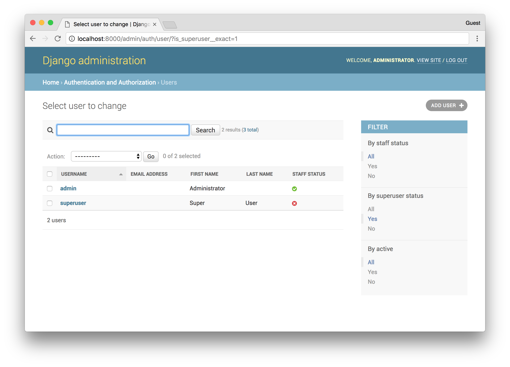
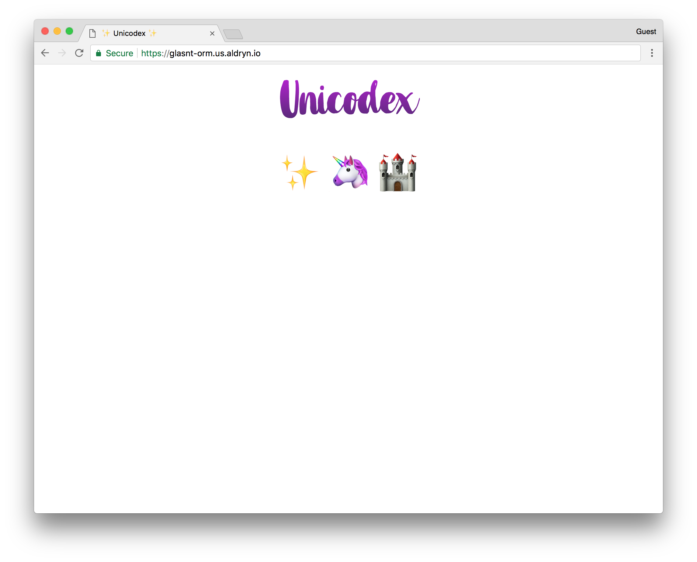
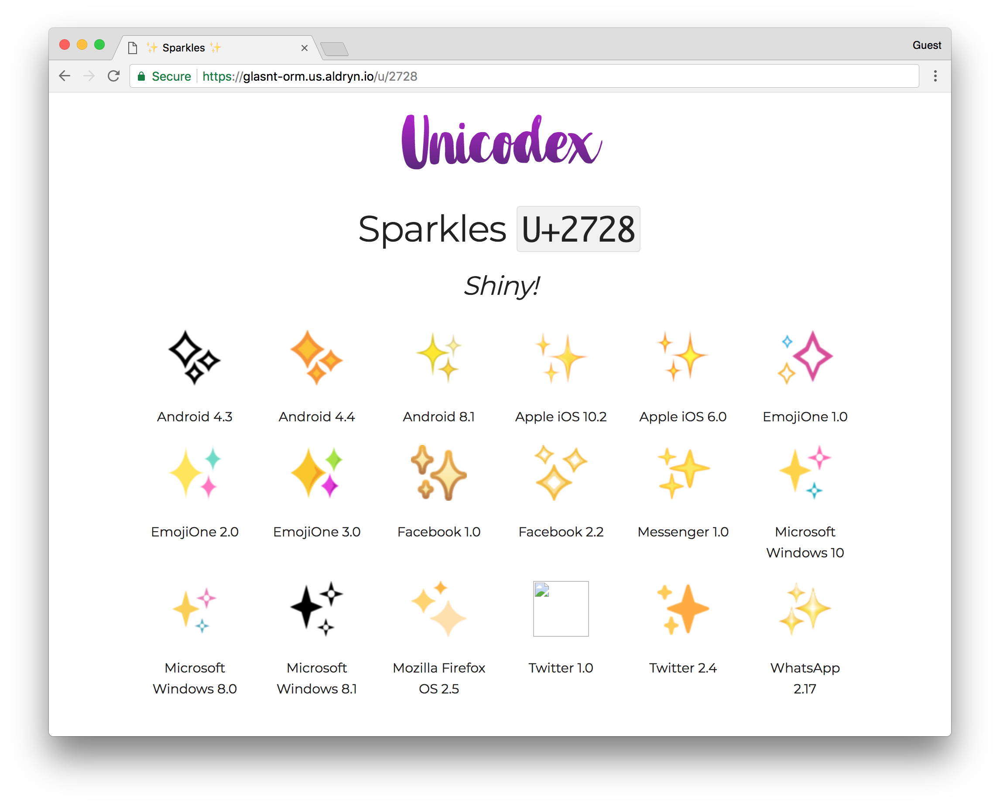

<br>
class: title
# ORM: The Sequel
# class: title
## DjangoCon Europe 2018

---
class: middle, center


???

Hi I'm Katie
---
class: middle, center, image


???

And I do a bunch of things in the Django community
---
class: middle, center, image

???

I spoke at DjangoCon Europe 16 in Budapest
---
class: middle, center, image

???

I was a mentor, and also gave a talk, at DjangoCon US 2017
---
class: middle, center, image

background-image: url("images/17_bg.png")
???

I was the organiser of djangocon australia 17
---

class: middle, center, image


???

I'm a site reliability engineer at Divio, the company behind django-cms
---
class: middle, center, image

???

I'm currently serving as a Director of the Django Software Foundation
---

???

But I don't know django.

Yet.

I'm an absolute novice. I have no idea what I'm doing
---
class: middle, center, image

???

I still see the django admin as

---
class: middle, center, image

???

a magical piece of software development
---
class: middle, center, image


???

I mean, the fact that this admin is just generated based on something called models..?

and it just works, it's so cool


---
background-image: url("images/macbook.jpg")
.footnotes[[WOCinTech](https://www.flickr.com/photos/wocintechchat/albums)]
???

But just because I'm a novice at django, doesn't mean I'm a novice at tech
---
background-image: url("images/thinkpad.jpg")
.footnotes[[WOCinTech](https://www.flickr.com/photos/wocintechchat/albums)]

???

I have over a decade of software development and systems administration behind me.

Before getting into the Python/Django space, I was a ruby dev, working with Rails and Sinatra stacks

But before that, around the time the magic was being removed from Django, I was in my first tech job, and using my first tech stack:

---
class: middle, center, image

&nbsp; <!-- .slide: data-background-color="#f8f8f8" -->

???

Was Orale Application Express

Oracle Appplication express, also known as Apex, is a in-database web application creation suite. it comes free with Oracle XE (the free version of the database)
---


.footnotes[[StackOverflow](https://stackoverflow.com/questions/48789457/oracle-apex-version-3-2-tabindex-not-working)]

???

Back in 2006, this was the bees knees. An entire web GUI way to build a website based on form submissions and database manpulations. I used this for years
---
background-image: url("images/apex32.jpg")
???

So much so, I was a technical reviewer for a technical book on the subject.

Yes, I'm that much of a nerd.
---

class: title
# &nbsp;

???

I haven't used APEX for years. But, there's one thing that I have an intrinstic knowledge of

---

= <h1 style="color: white;text-shadow: 1px 1px 6px black, 0 0 136px red, 0 0 51px yellow; font-family: arial; font-size: 200pt">SQL</h1>
= <h1 style="color: white;text-shadow: 1px 1px 6px black, 0 0 136px red, 0 0 51px yellow; font-family: arial; font-size:40pt">Structured Query Language</h1>

???

SQL

It's like riding a bike. Left outer joins are always going to be a bit.. fuzzy, but I can't count the amount of times I wished there was an option of throwing a LIKE clause on search results.


---
class: middle, center, image

???

Getting back to Django.

I'm still getting my head around how Django works

I mean, sure, for a sufficiently setup existing django application, the admin makes things so intuitive.

But if you were to try and tell me how things work underneath

---
background-image: url("images/fogofwar.png")

???

I would have some sort of fog of war thing going on. I can't tell what's going on.
---
class: title
## > *"Oh, just use the shell!"*
???

Even worse when I'm told "Oh, just use the shell"

It's an empty space. But I've been told that this is where the actual Django magic lives
---
= <h1 style="color: white;text-shadow: 1px 1px 6px black, 0 0 136px blue, 0 0 51px green; font-family: arial; font-size: 200pt">ORM</h1>

= <h1 style="color: white;text-shadow: 1px 1px 6px black, 0 0 136px blue, 0 0 51px green; font-family: arial; font-size: 40pt">Object Relational Mapper</h1>
???

The ORM

The Object relational mapper

The engine that makes django go

But without context, what does that even mean?
---
class: title
# Context

???

Context is important.

So for the purposes of this, let's break away from the normal.

A number of tutorials start with a clean slate, and assume you have little to know dev experience. DjangoGirls is great for complete beginners to development

But it's not so helpful for developers who come into the space with prior knowledge

It's also not helpful for the way that I came into Django; trying to fix an existing project

So for the purposes of this, we're going to use an existing project
---
background-image: url("images/hunterbird.jpg")

???

We're going to be a noisy myna, and go bughunting.

We're going to find outselves an existing project, in this case, a field of kale, and hunt about trying to find some delicious bugs.

The field may look daunting, endless complexities that seem impossible to understand, but we'll get there.

---
class: title
# Context

???

so, our context today isn't going to be the standard blog site or news portal.

It's going to be about something near and dear to my heart
---
class: title
# ✨
???

emoji
---
class: top, image


???

If you've seen my {DjangoCon EU 2016 talk,emoji talks before}

this website would be sort of familiar to you.

I call it.. Unicodex. It's a django-backed database of different emoji from different platforms

On the home page there's a bunch of emoji and if you click on one

---

class: top, image


???

it shows you the emoji from different vendors and the versions.

So given this website exists, we can start poking around in the shell
---
class: title
## "Just use the shell"
???

what they mean here is the django shell
---
<div class="shell-wrap"><p class="shell-top-bar">bash</p><p class="shell-body">
<ps>myrtle</ps> <dr>~ $</dr>
cd project<br>
<ps>myrtle</ps> <dr>~/project $</dr>
./manage.py shell<w>&nbsp;</w>

???

which is available using the manage.py shell command
---
<div class="shell-wrap"><p class="shell-top-bar">python3.6</p><p class="shell-body">
<ps>myrtle</ps> <dr>~ $</dr>
cd project<br>
<ps>myrtle</ps> <dr>~/project $</dr>
./manage.py shell<br>
Python 3.6.3 (default, Nov 9 2017, 15:58:30)<br>
[GCC 4.2.1 Compatible Apple LLVM 9.0.0 (clang-900.0.38)] on darwin<br>
Type "help", "copyright", "credits" or "license" for more information.<br>
(InteractiveConsole)<br>
`>>>` &nbsp;<w>&nbsp;</w>

???

Here, we're presented with an interactive console

All shell is is a python environment where the django environment path has been loaded.

From here you can interact with your django projet directly.

---
class: title
## "But, how do I use the shell?"
## *"..."*

???

but how do I use the shell

First things first. For an SQL dev, the first thing they normally do in a foreign system is
---
class: title
## Finding all tables
---
```sql

-- MySQL
show tables;

-- PostgreSQL
\dt

-- Oracle
SELECT * 
FROM dba.tables;
```


???

depending on which flavour of database is most familiar to you, you'd try and issue one of these commands

For mysql, for postgres, for oracle

But we're not in a database console, we're in the django shell. We need to use ORM codes.


---
```python
&num;  ORM Code 
&num;  ...
```

???

SO! To list all the tables in a project in the django shell!...

there's no real good way.

In order to start querying model objects, you need to import the models

In django, a project has multiple applications, or apps, and an app can have one or many models.

The model code is the powerhouse of django. the ORM manipulates models. A lot of the logic for a django project is going to be in the model.py of it's various applications.
But without looking at the model code, and understanding what you're looking at in order to generate the import statement, you can be at a complete loss.

Thankfully, django is clever and has helpful methods you can call to generate a list of imports for all the models in the project
---
```python

# Generate import statements
from django.apps import apps

for app_config in apps.get_app_configs():
   l = app_config.name
   for model in app_config.get_models():
     n = model._meta.object_name
     print(f'from {l}.models import {n}')
```

???

here's some I prepared earlier

We're going to import the django apps

And iterate over all the apps that django knows about

For each of those, we're going to get all the models

and print an import statement for each

---
### Generate import statements
<div class="shell-wrap"><p class="shell-top-bar">python3.6</p><p class="shell-body">
<ps>myrtle</ps> <dr>~/project $</dr>
./manage.py shell<br>
Python 3.6.3 (default, Nov 9 2017, 15:58:30)<br>
[GCC 4.2.1 Compatible Apple LLVM 9.0.0 (clang-900.0.38)] on darwin<br>
Type "help", "copyright", "credits" or "license" for more information.<br>
(InteractiveConsole TEST TEST)<br>
`>>>` &nbsp;<w>&nbsp;</w>

???

Going back to our shell
---
### Generate import statements
<div class="shell-wrap"><p class="shell-top-bar">python3.6</p><p class="shell-body">
<ps>myrtle</ps> <dr>~/project $</dr>
./manage.py shell<br>
Python 3.6.3 (default, Nov 9 2017, 15:58:30)<br>
[GCC 4.2.1 Compatible Apple LLVM 9.0.0 (clang-900.0.38)] on darwin<br>
Type "help", "copyright", "credits" or "license" for more information.<br>
(InteractiveConsole)<br>
`>>>` from django.apps import apps<br><br>
`>>>` for app_config in apps.get_app_configs():<br><br>
...&nbsp; l = app_config.name<br>
...&nbsp; for model in app_config.get_models():<br>
...&nbsp; &nbsp; n = model._meta.object_name<br>
...&nbsp; &nbsp; print(f'from {l}.models import {n}')<br>
...&nbsp;<w>&nbsp;</w>

???

for now, we're just going to dump in that code and run it
---
### Generate import statements
<div class="shell-wrap"><p class="shell-top-bar">python3.6</p><p class="shell-body">
...&nbsp;<br>
from django.contrib.auth.models import Permission<br>
from django.contrib.auth.models import Group<br>
from django.contrib.auth.models import User<br>
from django.contrib.contenttypes.models import ContentType<br>
from django.contrib.sessions.models import Session<br>
from django.contrib.sites.models import Site<br>
from aldryn_sso.models import AldrynCloudUser<br>
from django.contrib.admin.models import LogEntry<br>
from unicodex.models import Codepoint<br>
from unicodex.models import Vendor<br>
from unicodex.models import VendorVersion<br>
from unicodex.models import Design<br>
`>>>` &nbsp;<w>&nbsp;</w>

???

and what we get back is some generated import statements about

This output will have similarities across django projects

the first few in this list are pretty standard fair; authentication, sessions, sites, admin

There's also one in there called aldryn_sso. this is because I've hosted this on divio cloud. We're holding a workshop during the sprints on it, come see me afterwards!

But what we're looking for is, in a lovely happenstance, the models that match the name of the website we saw earlier -- unicodex.
---

class: title
## Finding the table for a model
---
### Finding the table for a model
<pre><code>
<c># ORM</c>
Codepoint._meta.db_table
</code></pre>
---
### Finding the table for a model
<div class="shell-wrap"><p class="shell-top-bar">python3.6</p><p class="shell-body">
<ps>myrtle</ps> <dr>~/project $</dr>
./manage.py shell<br>
Python 3.6.3 (default, Nov 9 2017, 15:58:30)<br>
[GCC 4.2.1 Compatible Apple LLVM 9.0.0 (clang-900.0.38)] on darwin<br>
Type "help", "copyright", "credits" or "license" for more information.<br>
(InteractiveConsole)<br>
`>>>` <w>&nbsp;</w>
---
### Finding the table for a model
<div class="shell-wrap"><p class="shell-top-bar">python3.6</p><p class="shell-body">
<ps>myrtle</ps> <dr>~/project $</dr>
./manage.py shell<br>
Python 3.6.3 (default, Nov 9 2017, 15:58:30)<br>
[GCC 4.2.1 Compatible Apple LLVM 9.0.0 (clang-900.0.38)] on darwin<br>
Type "help", "copyright", "credits" or "license" for more information.<br>
(InteractiveConsole)<br>
`>>>` from unicodex.models import Codepoint<w>&nbsp;</w>
---
### Finding the table for a model
<div class="shell-wrap"><p class="shell-top-bar">python3.6</p><p class="shell-body">
<ps>myrtle</ps> <dr>~/project $</dr>
./manage.py shell<br>
Python 3.6.3 (default, Nov 9 2017, 15:58:30)<br>
[GCC 4.2.1 Compatible Apple LLVM 9.0.0 (clang-900.0.38)] on darwin<br>
Type "help", "copyright", "credits" or "license" for more information.<br>
(InteractiveConsole)<br>
`>>>` from unicodex.models import Codepoint<br>
`>>>` <w>&nbsp;</w>
---
### Finding the table for a model
<div class="shell-wrap"><p class="shell-top-bar">python3.6</p><p class="shell-body">
<ps>myrtle</ps> <dr>~/project $</dr>
./manage.py shell<br>
Python 3.6.3 (default, Nov 9 2017, 15:58:30)<br>
[GCC 4.2.1 Compatible Apple LLVM 9.0.0 (clang-900.0.38)] on darwin<br>
Type "help", "copyright", "credits" or "license" for more information.<br>
(InteractiveConsole)<br>
`>>>` from unicodex.models import Codepoint<br>
`>>>` Codepoint._meta.db_table<w>&nbsp;</w>
---
### Finding the table for a model
<div class="shell-wrap"><p class="shell-top-bar">python3.6</p><p class="shell-body">
<ps>myrtle</ps> <dr>~/project $</dr>
./manage.py shell<br>
Python 3.6.3 (default, Nov 9 2017, 15:58:30)<br>
[GCC 4.2.1 Compatible Apple LLVM 9.0.0 (clang-900.0.38)] on darwin<br>
Type "help", "copyright", "credits" or "license" for more information.<br>
(InteractiveConsole)<br>
`>>>` from unicodex.models import Codepoint<br>
`>>>` Codepoint._meta.db_table<br>
'unicodex_codepoint'<br>
`>>>` <w>&nbsp;</w>
---
class: title
## Showing all table columns
---
### Showing all table columns
<pre><code><br><c># ORM</c><br>Codepoint._meta.get_fields()
---
### Showing all table columns
<div class="shell-wrap"><p class="shell-top-bar">python3.6</p><p class="shell-body">
<ps>myrtle</ps> <dr>~/project $</dr>
./manage.py shell<br>
Python 3.6.3 (default, Nov 9 2017, 15:58:30)<br>
[GCC 4.2.1 Compatible Apple LLVM 9.0.0 (clang-900.0.38)] on darwin<br>
Type "help", "copyright", "credits" or "license" for more information.<br>
(InteractiveConsole)<br>
`>>>` from unicodex.models import Codepoint<br>
`>>>` Codepoint._meta.db_table<br>
'unicodex_codepoint'<br>
`>>>` <w>&nbsp;</w>
---
### Showing all table columns
<div class="shell-wrap"><p class="shell-top-bar">python3.6</p><p class="shell-body">
<ps>myrtle</ps> <dr>~/project $</dr>
./manage.py shell<br>
Python 3.6.3 (default, Nov 9 2017, 15:58:30)<br>
[GCC 4.2.1 Compatible Apple LLVM 9.0.0 (clang-900.0.38)] on darwin<br>
Type "help", "copyright", "credits" or "license" for more information.<br>
(InteractiveConsole)<br>
`>>>` from unicodex.models import Codepoint<br>
`>>>` Codepoint._meta.db_table<br>
'unicodex_codepoint'<br>
`>>>` Codepoint._meta.get_fields()<w>&nbsp;</w>
---
### Showing all table columns
<div class="shell-wrap"><p class="shell-top-bar">python3.6</p><p class="shell-body">
Python 3.6.3 (default, Nov 9 2017, 15:58:30)<br>
[GCC 4.2.1 Compatible Apple LLVM 9.0.0 (clang-900.0.38)] on darwin<br>
Type "help", "copyright", "credits" or "license" for more information.<br>
(InteractiveConsole)<br>
`>>>` from unicodex.models import Codepoint<br>
`>>>` Codepoint._meta.db_table<br>
'unicodex_codepoint'<br>
`>>>` Codepoint._meta.get_fields()<br>
(`<`ManyToOneRel: unicodex.design>, <br>
`<`django.db.models.fields.AutoField: id>, <br>
`<`django.db.models.fields.CharField: name>, <br>
`<`django.db.models.fields.TextField: description>,<br>
`<`django.db.models.fields.CharField: codepoint>)<br>
`>>>` <w>&nbsp;</w>
---
class: title
## Finding all tables
### via the database

???

We can find all this information directly via the database,

and django provides an easy way to get there
---
### Find all tables via the database
<div class="shell-wrap"><p class="shell-top-bar">bash</p><p class="shell-body">
<ps>myrtle</ps> <dr>~/project $</dr>
./manage.py dbshell<w>&nbsp;</w>

???

back in our terminal, instead of running manage.py shell, we run DB shell
---
### Find all tables via the database
<div class="shell-wrap"><p class="shell-top-bar">psql</p><p class="shell-body">
<ps>myrtle</ps> <dr>~/project $</dr>
./manage.py dbshell<br>
psql (9.6.5, server 9.6.8)<br>
Type "help" for help.<br>
<br>
db=#&nbsp;<w>&nbsp;</w>

???

and we get an output that will be familiar to postgres devs in the audience

This particular project has a postgres backend
---
### Find all tables via the database
<div class="shell-wrap"><p class="shell-top-bar">psql</p><p class="shell-body">
<ps>myrtle</ps> <dr>~/project $</dr>
./manage.py dbshell<br>
psql (9.6.5, server 9.6.8)<br>
Type "help" for help.<br>
<br>
db=# \dt<w>&nbsp;</w>

???

given we know it's postgres, we cna issue the postgres list table command, and get back
---
### Find all tables via the database
<div class="shell-wrap"><p class="shell-top-bar">psql</p><p class="shell-body">
&nbsp; &nbsp; &nbsp; &nbsp; &nbsp; &nbsp; &nbsp; &nbsp; &nbsp; List of relations<br>
&nbsp;Schema |&nbsp; &nbsp; &nbsp; &nbsp; &nbsp; &nbsp; Name&nbsp; &nbsp; &nbsp; &nbsp; &nbsp; &nbsp; | Type&nbsp; |&nbsp; Owner<br>
&dash;&dash;&dash;&dash;&dash;&dash;&dash;&dash;+&dash;&dash;&dash;&dash;&dash;&dash;&dash;&dash;&dash;&dash;&dash;&dash;&dash;&dash;&dash;&dash;&dash;&dash;&dash;&dash;&dash;&dash;&dash;&dash;&dash;&dash;&dash;&dash;+&dash;&dash;&dash;&dash;&dash;&dash;&dash;+&dash;&dash;&dash;&dash;&dash;&dash;&dash;&dash;&dash;&dash;<br>
&nbsp;public | aldryn_sso_aldrynclouduser | table | postgres<br>
&nbsp;public | auth_group&nbsp; &nbsp; &nbsp; &nbsp; &nbsp; &nbsp; &nbsp; &nbsp;&nbsp; | table | postgres<br>
&nbsp;public | auth_group_permissions&nbsp; &nbsp; &nbsp;| table | postgres<br>
&nbsp;public | auth_permission&nbsp; &nbsp; &nbsp; &nbsp; &nbsp; &nbsp; | table | postgres<br>
&nbsp;public | auth_user&nbsp; &nbsp; &nbsp; &nbsp; &nbsp; &nbsp; &nbsp; &nbsp; &nbsp; | table | postgres<br>
&nbsp;public | auth_user_groups&nbsp; &nbsp; &nbsp; &nbsp;&nbsp; &nbsp; | table | postgres<br>
&nbsp;public | auth_user_user_permissions | table | postgres<br>
&nbsp;public | django_admin_log&nbsp; &nbsp;&nbsp; &nbsp; &nbsp; &nbsp; | table | postgres<br>
&nbsp;public | django_content_type&nbsp; &nbsp; &nbsp; &nbsp; | table | postgres<br>
&nbsp;public&nbsp;|&nbsp;django_migrations&nbsp;&nbsp;&nbsp;&nbsp;&nbsp;&nbsp;&nbsp;&nbsp;&nbsp;&nbsp;|&nbsp;table&nbsp;|&nbsp;postgres<br.
&nbsp;public&nbsp;|&nbsp;django_session&nbsp;&nbsp;&nbsp;&nbsp;&nbsp;&nbsp;&nbsp;&nbsp;&nbsp;&nbsp;&nbsp;&nbsp;&nbsp;|&nbsp;table&nbsp;|&nbsp;postgres<br>
&nbsp;public&nbsp;|&nbsp;django_site&nbsp;&nbsp;&nbsp;&nbsp;&nbsp;&nbsp;&nbsp;&nbsp;&nbsp;&nbsp;&nbsp;&nbsp;&nbsp;&nbsp;&nbsp;&nbsp;|&nbsp;table&nbsp;|&nbsp;postgres<br>
&dash;&dash;More&dash;&dash;

???

all our tables. Note the usual suspects from earlier, auth, content, sites
---
### Find all tables via the database
<div class="shell-wrap"><p class="shell-top-bar">psql</p><p class="shell-body">
&nbsp;public | auth_permission&nbsp; &nbsp; &nbsp; &nbsp; &nbsp; &nbsp; | table | postgres<br>
&nbsp;public | auth_user&nbsp; &nbsp; &nbsp; &nbsp; &nbsp; &nbsp; &nbsp; &nbsp; &nbsp; | table | postgres<br>
&nbsp;public | auth_user_groups&nbsp; &nbsp; &nbsp; &nbsp;&nbsp; &nbsp; | table | postgres<br>
&nbsp;public | auth_user_user_permissions | table | postgres<br>
&nbsp;public | django_admin_log&nbsp; &nbsp;&nbsp; &nbsp; &nbsp; &nbsp; | table | postgres<br>
&nbsp;public | django_content_type&nbsp; &nbsp; &nbsp; &nbsp; | table | postgres<br>
&nbsp;public&nbsp;|&nbsp;django_migrations&nbsp;&nbsp;&nbsp;&nbsp;&nbsp;&nbsp;&nbsp;&nbsp;&nbsp;&nbsp;|&nbsp;table&nbsp;|&nbsp;postgres<br.
&nbsp;public&nbsp;|&nbsp;django_session&nbsp;&nbsp;&nbsp;&nbsp;&nbsp;&nbsp;&nbsp;&nbsp;&nbsp;&nbsp;&nbsp;&nbsp;&nbsp;|&nbsp;table&nbsp;|&nbsp;postgres<br>
&nbsp;public&nbsp;|&nbsp;django_site&nbsp;&nbsp;&nbsp;&nbsp;&nbsp;&nbsp;&nbsp;&nbsp;&nbsp;&nbsp;&nbsp;&nbsp;&nbsp;&nbsp;&nbsp;&nbsp;|&nbsp;table&nbsp;|&nbsp;postgres<br>
&nbsp;public&nbsp;|&nbsp;unicodex_codepoint&nbsp;&nbsp;&nbsp;&nbsp;&nbsp;&nbsp;&nbsp;&nbsp;&nbsp;|&nbsp;table&nbsp;|&nbsp;postgres<br>
&nbsp;public&nbsp;|&nbsp;unicodex_design&nbsp;&nbsp;&nbsp;&nbsp;&nbsp;&nbsp;&nbsp;&nbsp;&nbsp;&nbsp;&nbsp;&nbsp;|&nbsp;table&nbsp;|&nbsp;postgres<br>
&nbsp;public&nbsp;|&nbsp;unicodex_vendor&nbsp;&nbsp;&nbsp;&nbsp;&nbsp;&nbsp;&nbsp;&nbsp;&nbsp;&nbsp;&nbsp;&nbsp;|&nbsp;table&nbsp;|&nbsp;postgres<br>
&nbsp;public&nbsp;|&nbsp;unicodex_vendorversion&nbsp;&nbsp;&nbsp;&nbsp;&nbsp;|&nbsp;table&nbsp;|&nbsp;postgres<br>
(16 rows)<br>
<br>
db=#&nbsp;<w>&nbsp;</w>

???

but also, our own project's tables

We'll take note of these for later.
---
class: title
## Show all table contents

???

so now that we know there are tables, we'd like to see what's inside them
---
### Show all table contents
<pre><code>
<c>&dash;&dash; SQL</c>
<r>SELECT * <br>&nbsp; FROM</r> unicodex_codepoint;
<br><br>
</code></pre>

???

in SQL, this would be your standard select star from table
---
### Show all table contents
<pre><code>
<c>&dash;&dash; SQL</c>
<r>SELECT * <br>&nbsp; FROM</r> unicodex_codepoint;

<c>&num; ORM</c>
Codepoint.objects.all()
</code></pre>

???

in the ORM, this maps to Codepoint, the model, dot objects dot all

Just list all of them
---
### Show all table contents
<div class="shell-wrap"><p class="shell-top-bar">python3.6</p><p class="shell-body">
<ps>myrtle</ps> <dr>~/project $</dr>
./manage.py shell<br>
Python 3.6.3 (default, Nov 9 2017, 15:58:30)<br>
[GCC 4.2.1 Compatible Apple LLVM 9.0.0 (clang-900.0.38)] on darwin<br>
Type "help", "copyright", "credits" or "license" for more information.<br>
(InteractiveConsole)<br>
`>>>` <w>&nbsp;</w>
???

back over in our console, before we can call Codepoint, we need to use that import statement we generated earlier
---
### Show all table contents
<div class="shell-wrap"><p class="shell-top-bar">python3.6</p><p class="shell-body">
<ps>myrtle</ps> <dr>~/project $</dr>
./manage.py shell<br>
Python 3.6.3 (default, Nov 9 2017, 15:58:30)<br>
[GCC 4.2.1 Compatible Apple LLVM 9.0.0 (clang-900.0.38)] on darwin<br>
Type "help", "copyright", "credits" or "license" for more information.<br>
(InteractiveConsole)<br>
`>>>` from unicodex.models import Codepoint<w>&nbsp;</w>

???

from unicodex dot models import codepoint
---
### Show all table contents
<div class="shell-wrap"><p class="shell-top-bar">python3.6</p><p class="shell-body">
<ps>myrtle</ps> <dr>~/project $</dr>
./manage.py shell<br>
Python 3.6.3 (default, Nov 9 2017, 15:58:30)<br>
[GCC 4.2.1 Compatible Apple LLVM 9.0.0 (clang-900.0.38)] on darwin<br>
Type "help", "copyright", "credits" or "license" for more information.<br>
(InteractiveConsole)<br>
`>>>` from unicodex.models import Codepoint<br>
`>>>` <w>&nbsp;</w>

???

after we hit enter, we'll get no output, which is good, because this was successfully imported.
---
### Show all table contents
<div class="shell-wrap"><p class="shell-top-bar">python3.6</p><p class="shell-body">
<ps>myrtle</ps> <dr>~/project $</dr>
./manage.py shell<br>
Python 3.6.3 (default, Nov 9 2017, 15:58:30)<br>
[GCC 4.2.1 Compatible Apple LLVM 9.0.0 (clang-900.0.38)] on darwin<br>
Type "help", "copyright", "credits" or "license" for more information.<br>
(InteractiveConsole)<br>
`>>>` from unicodex.models import Codepoint<br>
`>>>` Codepoint.objects.all()<w>&nbsp;</w>

???

then we make our codepoint dot objects dot all call
---
### Show all table contents
<div class="shell-wrap"><p class="shell-top-bar">python3.6</p><p class="shell-body">
<ps>myrtle</ps> <dr>~/project $</dr>
./manage.py shell<br>
Python 3.6.3 (default, Nov 9 2017, 15:58:30)<br>
[GCC 4.2.1 Compatible Apple LLVM 9.0.0 (clang-900.0.38)] on darwin<br>
Type "help", "copyright", "credits" or "license" for more information.<br>
(InteractiveConsole)<br>
`>>>` from unicodex.models import Codepoint<br>
`>>>` Codepoint.objects.all()<br>
`<`QuerySet [`<`Codepoint: Sparkles>, `<`Codepoint: Unicorn>, `<`Codepoint: Castle>]><br>
`>>>` <w>&nbsp;</w>

???

and we get back a queryset of objects

We remember from earlier that there were sparkles, unicorns and hearts on our page, so we're getting the right data!

The return value here is known as a queryset, an unordered objects. QuerySets can be enacted upon further, which we'll see later.


**Query set is not a list**

---
class: title
## Show specific table contents

???

now that we can see all the things, how about just some of the things
---
### Show specific table contents
<pre><code>
<c>&dash;&dash; SQL</c>
<r>SELECT * <br>&nbsp; FROM</r> unicodex_codepoint c<br>&nbsp;<r>WHERE</r> <l>c</l>.<l>name</l> <r>=</r> <d>'Sparkles'</d>;
<br><br>
</code></pre>

???

the SQL would be familiar

Adding a where clause for, say, sparkles
---
### Show specific table contents
<pre><code>
<c>&dash;&dash; SQL</c>
<r>SELECT * <br>&nbsp; FROM</r> unicodex_codepoint c<br>&nbsp;<r>WHERE</r> <l>c</l>.<l>name</l> <r>&equals;</r> <d>'Sparkles'</d>;

<c>&num; ORM</c>
Codepoint.objects.filter(<o>name&equals;</o>'Sparkles')
</code></pre>

???

this maps to the ORM as filter. where the name column is a keyword argument of filter.


---
### Show specific table contents
<div class="shell-wrap"><p class="shell-top-bar">python3.6</p><p class="shell-body">
`>>>` from unicodex.models import Codepoint<br>
`>>>` Codepoint.objects.filter(name='Sparkles')<w>&nbsp;</w>

???

so in our fresh terminal, we import Codepoint

Then run our filter
---
### Show specific table contents
<div class="shell-wrap"><p class="shell-top-bar">python3.6</p><p class="shell-body">
`>>>` from unicodex.models import Codepoint<br>
`>>>` Codepoint.objects.filter(name='Sparkles')<br>
`<`QuerySet [`<`Codepoint: Sparkles>]><br>
`>>>` <w>&nbsp;</w>
???

and we get back a queryset with a single object: sparkles
---
class: title
## Get specific record

???

we can also just return one specific record, instead of a queryset
---
### Get specific record
<div class="shell-wrap"><p class="shell-top-bar">python3.6</p><p class="shell-body">
`>>>` from unicodex.models import Codepoint<br>
`>>>` Codepoint.objects.filter(name='Sparkles')<br>
`<`QuerySet [`<`Codepoint: Sparkles>]><br>
`>>>` Codepoint.objects.get(name='Sparkles')<w>&nbsp;</w>
???

so where last time we used filter

This time we use get
---
### Get specific record
<div class="shell-wrap"><p class="shell-top-bar">python3.6</p><p class="shell-body">
`>>>` from unicodex.models import Codepoint<br>
`>>>` Codepoint.objects.filter(name='Sparkles')<br>
`<`QuerySet [`<`Codepoint: Sparkles>]><br>
`>>>` Codepoint.objects.get(name='Sparkles')<br>
`<`Codepoint: Sparkles><br>
`>>>` <w>&nbsp;</w>

???

and we get a single object
---
### Get specific record
<div class="shell-wrap"><p class="shell-top-bar">python3.6</p><p class="shell-body">
`>>>` from unicodex.models import Codepoint<br>
`>>>` Codepoint.objects.filter(name='Sparkles')<br>
`<`QuerySet [`<`Codepoint: Sparkles>]><br>
`>>>` Codepoint.objects.get(name='Sparkles')<br>
`<`Codepoint: Sparkles><br>
`>>>` Codepoint.objects.get()<w>&nbsp;</w>

???

a thing to note about get

Get will always return one and only one object

THERE CAN BE ONLY ONE

So if you try and run get, say, without any limiatations
---
### Get specific record
<div class="shell-wrap"><p class="shell-top-bar">python3.6</p><p class="shell-body">
`<`QuerySet [`<`Codepoint: Sparkles>]><br>
`>>>` Codepoint.objects.get(name='Sparkles')<br>
`<`Codepoint: Sparkles><br>
`>>>` Codepoint.objects.get()<br>
Traceback (most recent call last):<br>
&nbsp; File "`<`console>", line 1, in `<`module><br>
&nbsp; File "/usr/local/lib/python3.6/site-packages/django/db/models/manager.p y", line 85, in manager_method<br>
&nbsp; &nbsp; return getattr(self.get_queryset(), name)(&#42;args, &#42;&#42;kwargs)<br>
&nbsp; File "/usr/local/lib/python3.6/site-packages/django/db/models/query.py" , line 384, in get<br>
&nbsp; &nbsp; (self.model._meta.object_name, num)<br>
unicodex.models.MultipleObjectsReturned: get() returned more than one Codepoint -- it returned 3!<br>
`>>>` <w>&nbsp;</w>

???

we get a MultipleObjectsReturned error

which tells us that it would have returned three Codepoint objects, which is just far too much for get to handle.
---
class: title
## Joins

???

So now we come to the fun bit. Joins

Anyone who's worked with SQL for long enough will know the venn diagrams for inner joins, outer joins, left joins, right joins, and it can get a bit confusing

Thankfully, especially for someone like me who has forgotten so much SQL, the ORM makes joins a joy.
---
### Joins
<pre><code><c>&dash;&dash; SQL</c><br><r>SELECT</r> d.<r>*</r> <br>&nbsp; <r>FROM</r> unicodex_codepoint c,<br>&nbsp; &nbsp; &nbsp; &nbsp;unicodex_design d<br>&nbsp;<r>WHERE</r> <l>c</l>.<l>name</l> <r>&equals;</r> <d>'Sparkles'</d><BR><r>&nbsp; &nbsp;AND</r> <l>d</l>.<l>codepoint_id</l> <r>=</r> <l>c</l>.<l>id</l>;
???

say we want to join our design and codepoint tables

A codepoint has multiple designs. Sparkles has an image that shows up in Android, Apple, Facebook, etc

So we want to join on the codepoint_id on the designs table to the primary codepoint id

This is a good chunk of SQL

So what does the ORM equivelent look like?
---
### Joins
<pre><code><c>&dash;&dash; SQL</c><br><r>SELECT</r> d.<r>*</r> <br>&nbsp; <r>FROM</r> unicodex_codepoint c,<br>&nbsp; &nbsp; &nbsp; &nbsp;unicodex_design d<br>&nbsp;<r>WHERE</r> <l>c</l>.<l>name</l> <r>&equals;</r> <d>'Sparkles'</d><BR><r>&nbsp; &nbsp;AND</r> <l>d</l>.<l>codepoint_id</l> <r>=</r> <l>c</l>.<l>id</l>;<br><br><c>&num; ORM</c>
Design.objects.filter(<o>codepoint&#95;&#95;name&equals;</o>'Sparkles')
</code></pre>
???

Design dot objects dot filter codepoint dunder name equals sparkles.

I know right? so simple!
---
### Joins
<pre><code><c>&dash;&dash; SQL</c><br><r>SELECT</r> d.<r>*</r> <br>&nbsp; <r>FROM</r> unicodex_codepoint c,<br>&nbsp; &nbsp; &nbsp; &nbsp;unicodex_design d<br>&nbsp;<r>WHERE</r> <l>c</l>.<l>name</l> <r>&equals;</r> <d>'Sparkles'</d><BR><r>&nbsp; &nbsp;AND</r> <l>d</l>.<l>codepoint_id</l> <r>=</r> <l>c</l>.<l>id</l>;<br><br><c>&num; ORM</c>
Design.objects.filter(<o>codepoint&#95;&#95;name&equals;</o>'Sparkles')
&nbsp; &nbsp; &nbsp; &nbsp; &nbsp; &nbsp;&nbsp; &nbsp; &nbsp; &nbsp; &nbsp; &nbsp; &nbsp; &nbsp; &nbsp; &nbsp; <c>^^</c>
</code></pre>

???

this doubleunderscore here is doing a lot of powerful things behind the scenes

which I'll explain more in a moment.

---
### Joins
<div class="shell-wrap"><p class="shell-top-bar">python3.6</p><p class="shell-body">
`>>>` <w>&nbsp;</w>

???

back to our terminal again, to execute this elegant little code snippet

We import the design model this time
---
### Joins
<div class="shell-wrap"><p class="shell-top-bar">python3.6</p><p class="shell-body">
`>>>` from unicodex.models import Design<w>&nbsp;</w>
---
### Joins
<div class="shell-wrap"><p class="shell-top-bar">python3.6</p><p class="shell-body">
`>>>` from unicodex.models import Design<br>
`>>>` <w>&nbsp;</w>
---

### Joins
<div class="shell-wrap"><p class="shell-top-bar">python3.6</p><p class="shell-body">
`>>>` from unicodex.models import Design<br>
`>>>` Design.objects.filter(codepoint&#95;&#95;name='Sparkles')<w>&nbsp;</w>
???

and we run our filter
---
### Joins
<div class="shell-wrap"><p class="shell-top-bar">python3.6</p><p class="shell-body">
`>>>` from unicodex.models import Design<br>
`>>>` Design.objects.filter(codepoint&#95;&#95;name='Sparkles')<br>
`<`QuerySet [`<`Design: Sparkles Apple iOS 10.2>, `<`Design: Sparkles Apple iOS 6.0>, `<`Design: Sparkles Android 8.1>, `<`Design: Sparkles Android 4.4>, `<`Design: Sparkles Android 4.3>, `<`Design: Sparkles Microsoft Windows 10>, `<`Design: Sparkles Microsoft Windows 8.0>, `<`Design: Sparkles Microsoft Windows 8.1>, `<`Design: Sparkles Twitter 2.4>, `<`Design: Sparkles EmojiOne 3.0>, `<`Design: Sparkles EmojiOne 2.0>, `<`Design: Sparkles EmojiOne 1.0>, `<`Design: Sparkles Facebook 2.2>, `<`Design: Sparkles Facebook 1.0>, `<`Design: Sparkles Messenger 1.0>, `<`Design: Sparkles WhatsApp 2.17>, `<`Design: Sparkles Mozilla Firefox OS 2.5>, `<`Design: Sparkles Twitter 1.0>]><br>
`>>>` <w>&nbsp;</w>


???

---
### Joins
<pre><code><c>&num; ORM</c>
Design.objects.filter(<o>codepoint&#95;&#95;name&equals;</o>'Sparkles')

<c>&num; field, field, field... lookup</c>

???

what we have here is one or more fields and then a lookup, all separated by double underscores

A lookup as an operation on that field

If you remember back when we looked up the fields on a model, we know what options we have here.
---
### Joins
<div class="shell-wrap"><p class="shell-top-bar">python3.6</p><p class="shell-body">
`>>>` from unicodex.models import Design<br>
`>>>` Design._meta.get_fields()<w>&nbsp;</w>
---
### Joins
<div class="shell-wrap"><p class="shell-top-bar">python3.6</p><p class="shell-body">
`>>>` from unicodex.models import Design<br>
`>>>` Design._meta.get_fields()<br>
(`<`django.db.models.fields.AutoField: id>,<br>
`<`django.db.models.fields.related.ForeignKey: vendorversion>, <br>
`<`django.db.models.fields.related.ForeignKey: codepoint>, <br>
`<`django.db.models.fields.files.FileField: image>)<br>
`>>>` <w>&nbsp;</w>

???

we have four fields - a unique id, two foreign keys off to other models, and image

but name isn't there. That came from codepoint

---
### Joins
<div class="shell-wrap"><p class="shell-top-bar">python3.6</p><p class="shell-body">
`>>>` from unicodex.models import Design<br>
`>>>` Design._meta.get_fields()<br>
(`<`django.db.models.fields.AutoField: id>,<br>
`<`django.db.models.fields.related.ForeignKey: vendorversion>, <br>
`<`django.db.models.fields.related.ForeignKey: codepoint>, <br>
`<`django.db.models.fields.files.FileField: image>)<br>
`>>>` Codepoint._meta.get_fields()<w>&nbsp;</w>

???

so if we inspect Codepoint

---
### Joins
<div class="shell-wrap"><p class="shell-top-bar">python3.6</p><p class="shell-body">
`>>>` from unicodex.models import Design<br>
`>>>` Design._meta.get_fields()<br>
(`<`django.db.models.fields.AutoField: id>,<br>
`<`django.db.models.fields.related.ForeignKey: vendorversion>, <br>
`<`django.db.models.fields.related.ForeignKey: codepoint>, <br>
`<`django.db.models.fields.files.FileField: image>)<br>
`>>>` Codepoint._meta.get_fields()<br>
(`<`ManyToOneRel: unicodex.design>, <br>
`<`django.db.models.fields.AutoField: id>,<br>
`<`django.db.models.fields.CharField: name>, <br>
`<`django.db.models.fields.TextField: description>,<br>
`<`django.db.models.fields.CharField: codepoint>)<br>
`>>>` <w>&nbsp;</w>

???

WE see that codepoint has the name field
---
<pre><code><c>&num; ORM</c>
Design.objects.filter(<o>codepoint&#95;&#95;name&equals;</o>'Sparkles')<br><br><c>&num; field, field, field... lookup</c>

???

You'll also note in our example that we end on a field.

By default the look up is an exact match on the string. So effectively, name equals sparkles
---
```python
# ORM
Design.objects.filter(codepoint__name='Sparkles')
# field, field, field... lookup

# ORM
Design.objects.filter(codepoint__name__exact='Sparkles')
```

???

so by default what we're calling is codepoint name equals
---
class: title
# Aside

???

as aside, did you know that this is how those awesome admin filters work? it's true!
---
class: top, image

???

if we go back to that admin page we saw right at the start
---
class: top, image

???

Look at the URL

It's our filters

the admin uses field lookups in it's UI

and to some extent, you can handcode this URL to do some basic filtering, even if there isn't any filters on the right hand side panel

---
<div class="shell-wrap"><p class="shell-top-bar">python3.6</p><p class="shell-body">
`>>>` from unicodex.models import Design<br>
`>>>` Design._meta.get_fields()<br>
(`<`django.db.models.fields.AutoField: id>,<br>
`<`django.db.models.fields.related.ForeignKey: vendorversion>, <br>
`<`django.db.models.fields.related.ForeignKey: codepoint>, <br>
`<`django.db.models.fields.files.FileField: image>)<br>
`>>>` Codepoint._meta.get_fields()<br>
(`<`ManyToOneRel: unicodex.design>, <br>
`<`django.db.models.fields.AutoField: id>,<br>
`<`django.db.models.fields.CharField: name>, <br>
`<`django.db.models.fields.TextField: description>,<br>
`<`django.db.models.fields.CharField: codepoint>)<br>
`>>>` <w>&nbsp;</w>

???

back to our terminal

We can also forge a path down a different series of foreign keys

See the vendorversion there? Let's see what that contains
---

<div class="shell-wrap"><p class="shell-top-bar">python3.6</p><p class="shell-body">
`>>>` <w>&nbsp;</w>
---
<div class="shell-wrap"><p class="shell-top-bar">python3.6</p><p class="shell-body">
`>>>` from unicodex.models import VendorVersion<w>&nbsp;</w>
---

<div class="shell-wrap"><p class="shell-top-bar">python3.6</p><p class="shell-body">
`>>>` from unicodex.models import VendorVersion<br>
`>>>` <w>&nbsp;</w>
---
<div class="shell-wrap"><p class="shell-top-bar">python3.6</p><p class="shell-body">
`>>>` from unicodex.models import VendorVersion<br>
`>>>` VendorVersion._meta.get_fields()<w>&nbsp;</w>


???

let's refresh our terminal and inspect VendorVersion

---
<div class="shell-wrap"><p class="shell-top-bar">python3.6</p><p class="shell-body">
`>>>` from unicodex.models import VendorVersion<br>
`>>>` VendorVersion._meta.get_fields()<br>
(`<`ManyToOneRel: unicodex.design>,<br>
`<`django.db.models.fields.AutoField: id>, <br>
`<`django.db.models.fields.CharField: name>, <br>
`<`django.db.models.fields.related.ForeignKey: vendor>)<br>
`>>>` <w>&nbsp;</w>

???

Okay, so a vendorversion has many designs, an ID, a name, and a Vendor FK

What about Vendor?
---
<div class="shell-wrap"><p class="shell-top-bar">python3.6</p><p class="shell-body">
`>>>` from unicodex.models import VendorVersion<br>
`>>>` VendorVersion._meta.get_fields()<br>
(`<`ManyToOneRel: unicodex.design>,<br>
`<`django.db.models.fields.AutoField: id>, <br>
`<`django.db.models.fields.CharField: name>, <br>
`<`django.db.models.fields.related.ForeignKey: vendor>)<br>
`>>>` from unicodex.models import Vendor<w>&nbsp;</w>

---
<div class="shell-wrap"><p class="shell-top-bar">python3.6</p><p class="shell-body">
`>>>` from unicodex.models import VendorVersion<br>
`>>>` VendorVersion._meta.get_fields()<br>
(`<`ManyToOneRel: unicodex.design>,<br>
`<`django.db.models.fields.AutoField: id>, <br>
`<`django.db.models.fields.CharField: name>, <br>
`<`django.db.models.fields.related.ForeignKey: vendor>)<br>
`>>>` from unicodex.models import Vendor<br>
`>>>` <w>&nbsp;</w>
---
<div class="shell-wrap"><p class="shell-top-bar">python3.6</p><p class="shell-body">
`>>>` from unicodex.models import VendorVersion<br>
`>>>` VendorVersion._meta.get_fields()<br>
(`<`ManyToOneRel: unicodex.design>,<br>
`<`django.db.models.fields.AutoField: id>, <br>
`<`django.db.models.fields.CharField: name>, <br>
`<`django.db.models.fields.related.ForeignKey: vendor>)<br>
`>>>` from unicodex.models import Vendor<br>
`>>>` Vendor._meta.get_fields()<w>&nbsp;</w>


???

clear our terminal, import Vendor, and check

---
<div class="shell-wrap"><p class="shell-top-bar">python3.6</p><p class="shell-body">
`>>>` from unicodex.models import VendorVersion<br>
`>>>` VendorVersion._meta.get_fields()<br>
(`<`ManyToOneRel: unicodex.design>,<br>
`<`django.db.models.fields.AutoField: id>, <br>
`<`django.db.models.fields.CharField: name>, <br>
`<`django.db.models.fields.related.ForeignKey: vendor>)<br>
`>>>` from unicodex.models import Vendor<br>
`>>>` Vendor._meta.get_fields()<br>
(`<`ManyToOneRel: unicodex.vendorversion>, <br>
`<`django.db.models.fields.AutoField: id>, <br>
`<`django.db.models.fields.CharField: name>) <br>
`>>>` <w>&nbsp;</w>

???

so vendor has a relationship with vendorversion, an id and a name too

And thus, we have exhausted our search, and we could build up a UML diagram showing the relationships between all the tables in this app

But I woldn't do that too you.

Back to what we were doing, showing filter walks

---

<div class="shell-wrap"><p class="shell-top-bar">python3.6</p><p class="shell-body">
`>>>` <w>&nbsp;</w>

???

clearing our terminal again with Control L
---
<div class="shell-wrap"><p class="shell-top-bar">python3.6</p><p class="shell-body">
`>>>` Design.objects.filter(<w>&nbsp;</w>

???

we have a number of options here. Let's build the longest chain we can...

---
<div class="shell-wrap"><p class="shell-top-bar">python3.6</p><p class="shell-body">
`>>>` Design.objects.filter(vendorversion<w>&nbsp;</w>

???

Let's filter design objects where... the linked vendor version

---

<div class="shell-wrap"><p class="shell-top-bar">python3.6</p><p class="shell-body">
`>>>` Design.objects.filter(vendorversion&#95;&#95;vendor<w>&nbsp;</w>


???

and the vendor linked to that....

---
<div class="shell-wrap"><p class="shell-top-bar">python3.6</p><p class="shell-body">
`>>>` Design.objects.filter(vendorversion&#95;&#95;vendor&#95;&#95;name<w>&nbsp;</w>

???

the name of that vendor

---


<div class="shell-wrap"><p class="shell-top-bar">python3.6</p><p class="shell-body">
`>>>` Design.objects.filter(vendorversion&#95;&#95;vendor&#95;&#95;name&#95;&#95;contains=<w>&nbsp;</w>

???

contains...
---

<div class="shell-wrap"><p class="shell-top-bar">python3.6</p><p class="shell-body">
`>>>` Design.objects.filter(vendorversion&#95;&#95;vendor&#95;&#95;name&#95;&#95;contains="Micro")<w>&nbsp;</w>

???

the string Micro
---

<div class="shell-wrap"><p class="shell-top-bar">python3.6</p><p class="shell-body">
`>>>` Design.objects.filter(vendorversion&#95;&#95;vendor&#95;&#95;name&#95;&#95;contains="Micro")<br>
`<`QuerySet [`<`Design: Sparkles Microsoft Windows 8.0>, `<`Design: Castle Microsoft Windows 8.0>, `<`Design: Sparkles Microsoft Windows 8.1>, `<`Design: Castle Microsoft Windows 8.1>, `<`Design: Sparkles Microsoft Windows 10>, `<`Design: Unicorn Microsoft Windows 10>, `<`Design: Castle Microsoft Windows 10>]><br>
`>>>` <w>&nbsp;</w>

???

And thus, we get a of all designs where the name of the linked vendor contains Micro

---
<pre><code><c>&num; Field Lookups</c><table>
<tr><td><l>contains</l></td><td><o>LIKE "%?%"</o></td></tr>
<tr><td><l>startswith</l></td><td><o>LIKE "?%"</o></td></tr>
<tr><td><l>endswith</l></td><td><o>LIKE "%?"</o></td></tr>
<tr><td><l>in</l></td><td><o>IN (?, ?, ?, ...)</o></td></tr>
<tr><td><l>lt, le, gt, ge</l></td><td><o>`<`, `<`=, `>`, `>`=</o></td></tr>
<tr><td><l>range</l></td><td><o>BETWEEN</o></td></tr>
<tr><td><l>isnull</l></td><td><o>NULL</o></td></tr></table><c>&num; ... and many more!</c>
<span class="bfoot" style="margin-bottom: -270px"><fl>[docs - querysets field lookups](https://docs.djangoproject.com/en/2.0/ref/models/querysets/#field-lookups)</fl></span>

???

There are other field lookups we can use for a number of differnt things.

We're also not just limited to one filter, we can have more than one
---

<div class="shell-wrap"><p class="shell-top-bar">python3.6</p><p class="shell-body">
`>>>` Design.objects.filter(vendorversion&#95;&#95;vendor&#95;&#95;name&#95;&#95;contains="Micro"<w>&nbsp;</w>

???

instead of just filtering on Micro, we could alos
---
<div class="shell-wrap"><p class="shell-top-bar">python3.6</p><p class="shell-body">
`>>>` Design.objects.filter(vendorversion&#95;&#95;vendor&#95;&#95;name&#95;&#95;contains="Micro",<br>
... &nbsp;&nbsp;<w>&nbsp;</w><br>
---
<div class="shell-wrap"><p class="shell-top-bar">python3.6</p><p class="shell-body">
`>>>` Design.objects.filter(vendorversion&#95;&#95;vendor&#95;&#95;name&#95;&#95;contains="Micro",<br>
... &nbsp; codepoint<w>&nbsp;</w><br>

---
<div class="shell-wrap"><p class="shell-top-bar">python3.6</p><p class="shell-body">
`>>>` Design.objects.filter(vendorversion&#95;&#95;vendor&#95;&#95;name&#95;&#95;contains="Micro",<br>
... &nbsp; codepoint&#95;&#95;name<w>&nbsp;</w><br>


---
<div class="shell-wrap"><p class="shell-top-bar">python3.6</p><p class="shell-body">
`>>>` Design.objects.filter(vendorversion&#95;&#95;vendor&#95;&#95;name&#95;&#95;contains="Micro",<br>
... &nbsp; codepoint&#95;&#95;name&#95;&#95;endswith<w>&nbsp;</w><br>

---
<div class="shell-wrap"><p class="shell-top-bar">python3.6</p><p class="shell-body">
`>>>` Design.objects.filter(vendorversion&#95;&#95;vendor&#95;&#95;name&#95;&#95;contains="Micro",<br>
... &nbsp; codepoint&#95;&#95;name&#95;&#95;endswith="corn")<w>&nbsp;</w><br>


---
<div class="shell-wrap"><p class="shell-top-bar">python3.6</p><p class="shell-body">
`>>>` Design.objects.filter(vendorversion&#95;&#95;vendor&#95;&#95;name&#95;&#95;contains="Micro",<br>
... &nbsp; codepoint&#95;&#95;name&#95;&#95;endswith="corn")<br>
`<`QuerySet [`<`Design: Unicorn Microsoft Windows 10>]><br>
`>>>` <w>&nbsp;</w>

???

we get list of designs both from a vendor
---
class: title
## ... `AND`?
???

So far we've dealt with single or chained filters, which will AND together

name equals sparkles AND image ends with png AND AND AND

If we want to start using OR, we need to get a bit fancy
---
class: title
# `Q`

???

This is where Q comes in

No, not the race from the great Star Trek sequel, The Next Generation,

Q and in Query

With Q, we can build up AND, OR, and NOT statements in our where clause when filtering objects

So, let's start some comparisons...
---
<pre><code><c>&num; ORM</c>
Codepoint.objects.filter(
&nbsp; <o>name=</o>'Sparkles',
&nbsp; <o>description=</o>'Shiny!'
)


???

instead of using our super long chaining filter, let's use a simpler example here
this query would give us codepoints named sparkles with the description shiny

---
<pre><code><c>&num; ORM</c>
Codepoint.objects.filter(
&nbsp; <o>name=</o>'Sparkles',
&nbsp; <o>description=</o>'Shiny!'
)<br><br><c>&dash;&dash; SQL</c><br><r>SELECT *
&nbsp; FROM</r> unicodex_codepoint c <br><r>&nbsp;WHERE</r> <l>c</l>.<l>name</l> <r>=</r> <d>'Sparkles'</d><br><r>&nbsp; &nbsp;AND</r> <l>c</l>.<l>description</l> <r>=</r> <d>'Shiny!'</d>

???

this would be the equvilent SQL
---
<pre><code><c>&num; ORM</c>
Codepoint.objects.filter(
&nbsp; <o>name&#95;&#95;exact=</o>'Sparkles',
&nbsp; <o>description&#95;&#95;exact=</o>'Shiny!'
)<br><br><c>&dash;&dash; SQL</c><br><r>SELECT *
&nbsp; FROM</r> unicodex_codepoint c <br><r>&nbsp;WHERE</r> <l>c</l>.<l>name</l> <r>=</r> <d>'Sparkles'</d><br><r>&nbsp; &nbsp;AND</r> <l>c</l>.<l>description</l> <r>=</r> <d>'Shiny!'</d>

???

And we learnt earlier that unless there's a field lookup defined, we assume exact

This is the same SQL

We can also express this same statement using Q
---

<pre><code><c>&num; ORM</c>
Codepoint.objects.filter(
&nbsp; <o>name=</o>'Sparkles',
&nbsp; <o>description=</o>'Shiny!'
)<br><br><c>&dash;&dash; SQL</c><br><r>SELECT *
&nbsp; FROM</r> unicodex_codepoint c <br><r>&nbsp;WHERE</r> <l>c</l>.<l>name</l> <r>=</r> <d>'Sparkles'</d><br><r>&nbsp; &nbsp;AND</r> <l>c</l>.<l>description</l> <r>=</r> <d>'Shiny!'</d>

???

so going back to our first example,
---
<pre><code><c>&num; ORM</c>
Codepoint.objects.filter(
&nbsp; <o>name=</o>'Sparkles').filter(
&nbsp; <o>description=</o>'Shiny!'
)<br><br><c>&dash;&dash; SQL</c><br><r>SELECT *
&nbsp; FROM</r> unicodex_codepoint c <br><r>&nbsp;WHERE</r> <l>c</l>.<l>name</l> <r>=</r> <d>'Sparkles'</d><br><r>&nbsp; &nbsp;AND</r> <l>c</l>.<l>description</l> <r>=</r> <d>'Shiny!'</d>

???

we could also have two separate filter clauses.
---
<pre><code><c>&num; ORM</c>
Codepoint.objects.filter(
&nbsp; <o>name=</o>'Sparkles',
&nbsp; <o>description=</o>'Shiny!'
)<br><br><c>&dash;&dash; SQL</c><br><r>SELECT *
&nbsp; FROM</r> unicodex_codepoint c <br><r>&nbsp;WHERE</r> <l>c</l>.<l>name</l> <r>=</r> <d>'Sparkles'</d><br><r>&nbsp; &nbsp;AND</r> <l>c</l>.<l>description</l> <r>=</r> <d>'Shiny!'</d>

???

we could also

---
<pre><code><c>&num; ORM</c>
Codepoint.objects.filter(
&nbsp; Q(<o>name=</o>'Sparkles'),
&nbsp; Q(<o>description=</o>'Shiny!')
)<br><br><c>&dash;&dash; SQL</c><br><r>SELECT *
&nbsp; FROM</r> unicodex_codepoint c <br><r>&nbsp;WHERE</r> <l>c</l>.<l>name</l> <r>=</r> <d>'Sparkles'</d><br><r>&nbsp; &nbsp;AND</r> <l>c</l>.<l>description</l> <r>=</r> <d>'Shiny!'</d>

???

wrap our two filter parameters in Q

This provides the same result

Notice in all of this, the equivelent SQL hasn't changed.

With our comma here, we're implying we're using AND here. We can be explicit

---
<pre><code><c>&num; ORM</c>
Codepoint.objects.filter(
&nbsp; Q(<o>name=</o>'Sparkles') <r>&</r>
&nbsp; Q(<o>description=</o>'Shiny!')
)<br><br><c>&dash;&dash; SQL</c><br><r>SELECT *
&nbsp; FROM</r> unicodex_codepoint c <br><r>&nbsp;WHERE</r> <l>c</l>.<l>name</l> <r>=</r> <d>'Sparkles'</d><br><r>&nbsp; &nbsp;AND</r> <l>c</l>.<l>description</l> <r>=</r> <d>'Shiny!'</d>

???

But, since we have Q objects, we can do operations on them

Here, we're saying filter by this Query, and this Query

And we're using AND here explitictly

We don't have to wrap both in Q, either
---
<pre><code><c>&num; ORM</c>
Codepoint.objects.filter(
&nbsp; Q(<o>name=</o>'Sparkles'),</r>
&nbsp; Q(<o>description=</o>'Shiny!')
)<br><br><c>&dash;&dash; SQL</c><br><r>SELECT *
&nbsp; FROM</r> unicodex_codepoint c <br><r>&nbsp;WHERE</r> <l>c</l>.<l>name</l> <r>=</r> <d>'Sparkles'</d><br><r>&nbsp; &nbsp;AND</r> <l>c</l>.<l>description</l> <r>=</r> <d>'Shiny!'</d>

???

going back to our changed example
---
<pre><code><c>&num; ORM</c>
Codepoint.objects.filter(
&nbsp; Q(<o>name=</o>'Sparkles'),
&nbsp; <o>description=</o>'Shiny!'
)<br><br><c>&dash;&dash; SQL</c><br><r>SELECT *
&nbsp; FROM</r> unicodex_codepoint c <br><r>&nbsp;WHERE</r> <l>c</l>.<l>name</l> <r>=</r> <d>'Sparkles'</d><br><r>&nbsp; &nbsp;AND</r> <l>c</l>.<l>description</l> <r>=</r> <d>'Shiny!'</d>


???

we can change our queries with comman, and just wrap the first one and leave thther. Same result
---
<pre><code><c>&num; ORM</c>
Codepoint.objects.filter(
&nbsp; <o>name=</o>'Sparkles',
&nbsp; <o>description=</o>'Shiny!'
)<br><br><c>&dash;&dash; SQL</c><br><r>SELECT *
&nbsp; FROM</r> unicodex_codepoint c <br><r>&nbsp;WHERE</r> <l>c</l>.<l>name</l> <r>=</r> <d>'Sparkles'</d><br><r>&nbsp; &nbsp;AND</r> <l>c</l>.<l>description</l> <r>=</r> <d>'Shiny!'</d>


???

and we don't have to wrap either. But what if we wrap just the second
So, we could just wrap the second one, and leave the first one alone, right?


---
<pre><code><c>&num; ORM</c>
Codepoint.objects.filter(
&nbsp; <o>name=</o>'Sparkles',
&nbsp; Q(<o>description=</o>'Shiny!')
)<br><br><r>SyntaxError: positional argument follows keyword argument</r>

???

well no, we get an error.

The error here is insightful: Syntax Error, positioal argument follows keyword argument

The reasoning behind this is that in all the code we've been doing here, we've been giving arguments to the filter function

And in python, you have to declare positional argumnet before keyword argumnets

Remembering that even in these new Django concepts, we're still using Python, so python rules still apply.
---

<pre><code><c>&num; ORM</c>
Codepoint.objects.filter(
&nbsp; <o>name=</o>'Sparkles',
&nbsp; <o>description=</o>'Shiny!'
)<br><br><c>&dash;&dash; SQL</c><br><r>SELECT *
&nbsp; FROM</r> unicodex_codepoint c <br><r>&nbsp;WHERE</r> <l>c</l>.<l>name</l> <r>=</r> <d>'Sparkles'</d><br><r>&nbsp; &nbsp;AND</r> <l>c</l>.<l>description</l> <r>=</r> <d>'Shiny!'</d>

???

Another example of this. Let's put our code back working, and try changing that description

Say we want to search for sparkles and unicorns

So we search for name equals sparkles and name equals unicorns and
---
<pre><code><c>&num; ORM</c>
Codepoint.objects.filter(
&nbsp; <o>name=</o>'Sparkles',
&nbsp; <o>name=</o>'Unicorn'
)<br><br><r>SyntaxError: keyword argument repeated</r>

???

oh. There's an error.

This is agan, because Python. You can't repeat keyword aguments. But, you can get around this.
Just wrap it in Q

---
<pre><code><c>&num; ORM</c>
Codepoint.objects.filter(
&nbsp; Q(<o>name=</o>'Sparkles'),
&nbsp; Q(<o>name=</o>'Unicorn')
)<br><br><c>&dash;&dash; SQL</c><br><r>SELECT *
&nbsp; FROM</r> unicodex_codepoint c <br><r>&nbsp;WHERE</r> <l>c</l>.<l>name</l> <r>=</r> <d>'Sparkles'</d><br><r>&nbsp; &nbsp;AND</r> <l>c</l>.<l>name</l> <r>=</r> <d>'Unicorn'</d>

???

now, this code is valid python, but it isn't useful, because it will never return any results.

We're asking for exact string matches on the same column, twice. It'll always be an empty set.

But what we can do is change this from an and, to an OR

---
<pre><code><c>&num; ORM</c>
Codepoint.objects.filter(
&nbsp; Q(<o>name=</o>'Sparkles') &
&nbsp; Q(<o>name=</o>'Unicorn')
)<br><br><c>&dash;&dash; SQL</c><br><r>SELECT *
&nbsp; FROM</r> unicodex_codepoint c <br><r>&nbsp;WHERE</r> <l>c</l>.<l>name</l> <r>=</r> <d>'Sparkles'</d><br><r>&nbsp; &nbsp;AND</r> <l>c</l>.<l>name</l> <r>=</r> <d>'Unicorn'</d>

???

Using the comma is equiv to this AND, but with the comma we're giving filter two arguments. Here, we're giving it one. We'll get back to this, because it's really cool

So, to take our AND to and OR, we change the ampersand

---
<pre><code><c>&num; ORM</c>
Codepoint.objects.filter(
&nbsp; Q(<o>name=</o>'Sparkles') |
&nbsp; Q(<o>name=</o>'Unicorn')
)<br><br><c>&dash;&dash; SQL</c><br><r>SELECT *
&nbsp; FROM</r> unicodex_codepoint c <br><r>&nbsp;WHERE</r> <l>c</l>.<l>name</l> <r>=</r> <d>'Sparkles'</d><br><r>&nbsp; &nbsp; OR</r> <l>c</l>.<l>name</l> <r>=</r> <d>'Unicorn'</d>

???

to a pipe.

This is an or operation

You may have only seen these operators before in bitmasking

---
<div class="shell-wrap"><p class="shell-top-bar">python3.6</p><p class="shell-body">
`>>>` <w>&nbsp;</w>
---
<div class="shell-wrap"><p class="shell-top-bar">python3.6</p><p class="shell-body">
`>>>` x = 0b10101010<w>&nbsp;</w>

???

if we have X as a binary string of one zero one zero

---
<div class="shell-wrap"><p class="shell-top-bar">python3.6</p><p class="shell-body">
`>>>` x = 0b10101010<br>
`>>>` <w>&nbsp;</w>

---
<div class="shell-wrap"><p class="shell-top-bar">python3.6</p><p class="shell-body">
`>>>` x = 0b10101010<br>
`>>>` y = 0b11110000<w>&nbsp;</w>

???

and we have y as one one one zero zero zero zero

we can do something called bit masking

---
<div class="shell-wrap"><p class="shell-top-bar">python3.6</p><p class="shell-body">
`>>>` x = 0b10101010<br>
`>>>` y = 0b11110000<br>
`>>>` <w>&nbsp;</w>

---
<div class="shell-wrap"><p class="shell-top-bar">python3.6</p><p class="shell-body">
`>>>` x = 0b10101010<br>
`>>>` y = 0b11110000<br>
`>>>` bin(x & y)<w>&nbsp;</w>

???

if we ask for x AND y

---
<div class="shell-wrap"><p class="shell-top-bar">python3.6</p><p class="shell-body">
`>>>` x = 0b10101010<br>
`>>>` y = 0b11110000<br>
`>>>` bin(x & y)<br>
'0b10100000'<br>
`>>>` <w>&nbsp;</w>

???

we get 10100000

For each bit, we only return 1 if both are 1

---
<div class="shell-wrap"><p class="shell-top-bar">python3.6</p><p class="shell-body">
`>>>` x = 0b10101010<br>
`>>>` y = 0b11110000<br>
`>>>` bin(x & y)<br>
'0b10100000'<br>
`>>>` bin(x | y)<w>&nbsp;</w>

???

conversely, if we ask for x OR y

---
<div class="shell-wrap"><p class="shell-top-bar">python3.6</p><p class="shell-body">
`>>>` x = 0b10101010<br>
`>>>` y = 0b11110000<br>
`>>>` bin(x & y)<br>
'0b10100000'<br>
`>>>` bin(x | y)<br>
'0b11110101'

???

we get all ones at the start, then our stripes

That's because we return one is either or are 1


That's how binary ANDs and binary ORs work

This is very similar to what we do in SQL.

For each row of a table, we want to return it in our result set if BOTH conditions are true on and, or if either are true on and OR

---
<pre><code><c>&num; ORM</c>
Codepoint.objects.filter(
&nbsp; Q(<o>name=</o>'Sparkles') |
&nbsp; Q(<o>name=</o>'Unicorn')
)<br><br><c>&dash;&dash; SQL</c><br><r>SELECT *
&nbsp; FROM</r> unicodex_codepoint c <br><r>&nbsp;WHERE</r> <l>c</l>.<l>name</l> <r>=</r> <d>'Sparkles'</d><br><r>&nbsp; &nbsp; OR</r> <l>c</l>.<l>name</l> <r>=</r> <d>'Unicorn'</d>


???

so, using the and or operators here makes sense, because those are the actions we are performing

But, we're doing these operations on Query objects, not binary. Do how does that work?

What's happening here is metaprogramming. Sometimes confused for magic, it's a funcitonlaity of python that makes it really powerful.

I'm going to show you a small snippet of django source code. It won't be scary, don't worry.

---
<pre><code style="font-size: 24pt !important"><r>class</r> <g>Q</g>(<g>tree</g>.<g>Node</g>):
<c>"""<br>Encapsulate filters as objects that can<br>then be combined logically (using `&` and `|`).<br>"""</c>
&nbsp; ...<br><br>
&nbsp; <r>def</r> <l>&#95;&#95;or&#95;&#95;</l>(self, other):
&nbsp; &nbsp; <r>return</r> <l>self</l>._combine(other, <l>self.OR</l>)

&nbsp; <r>def</r> <l>&#95;&#95;and&#95;&#95;</l>(self, other):
&nbsp; &nbsp; <r>return</r> <l>self</l>._combine(other, <l>self.AND</l>)
</code></pre>

.footnotes[[django db/models/utils.py](https://github.com/django/django/blame/5256a805ff1c31e4d5112627846291e91c5dc65d/django/db/models/query_utils.py#L142)]

???

django literally overloads the operations that happens when you try and do bitwise operations on the Q class in order for Q to have a logical response to bitwise operations

and it means you can do bitwise operations on Q obecjts and it's compeltely valid python

it's composble, it's functional, and it's intuative.

and it's been in Django for over 10 years

---
<pre><code><c>&num; ORM</c>
Codepoint.objects.filter(
&nbsp; Q(<o>name=</o>'Sparkles') |
&nbsp; Q(<o>name=</o>'Unicorn')
)<br><br><c>&dash;&dash; SQL</c><br><r>SELECT *
&nbsp; FROM</r> unicodex_codepoint c <br><r>&nbsp;WHERE</r> <l>c</l>.<l>name</l> <r>=</r> <d>'Sparkles'</d><br><r>&nbsp; &nbsp; OR</r> <l>c</l>.<l>name</l> <r>=</r> <d>'Unicorn'</d>

???

as well as AND or OR, we can also do NOT

So with our code above

---
<pre><code><c>&num; ORM</c>
Codepoint.objects.filter(
&nbsp; Q(<o>name=</o>'Sparkles') |
&nbsp; ~Q(<o>name=</o>'Unicorn')
)<br><br><c>&dash;&dash; SQL</c><br><r>SELECT *
&nbsp; FROM</r> unicodex_codepoint c <br><r>&nbsp;WHERE</r> <l>c</l>.<l>name</l> <r>=</r> <d>'Sparkles'</d><br><r> &nbsp; &nbsp;OR NOT</r> <l>c</l>.<l>name</l> <r>=</r> <d>'Unicorn'</d>


???

we can and a tilda negation to invert that part of the query, and add a NOT to our SQL

Using our field lookups and these operations, we can do a lot of things. But are some limitations

Firstly, you need to understand how the joins happen in order avoid confusion

---
<pre><code><c>&num; ORM</c>
Codepoint.objects.filter(
&nbsp; <o>design&#95;&#95;image&#95;&#95;contains=</o>"png",
&nbsp; <o>design&#95;&#95;image&#95;&#95;startswith=</o>"design")

???

Consider the following we want codepoints where their design iages have png and start with design

THis is based on the filename I'm using for the iages uploaded to my models

Okay. Let's run that and see what happens

---
<div class="shell-wrap"><p class="shell-top-bar">python3.6</p><p class="shell-body">
<ps>myrtle</ps> <dr>~/project $</dr>
./manage.py shell<br>
Python 3.6.3 (default, Nov 9 2017, 15:58:30)<br>
[GCC 4.2.1 Compatible Apple LLVM 9.0.0 (clang-900.0.38)] on darwin<br>
Type "help", "copyright", "credits" or "license" for more information.<br>
(InteractiveConsole)<br>
`>>>` <w>&nbsp;</w>

???

so in our terminal

---
<div class="shell-wrap"><p class="shell-top-bar">python3.6</p><p class="shell-body">
<ps>myrtle</ps> <dr>~/project $</dr>
./manage.py shell<br>
Python 3.6.3 (default, Nov 9 2017, 15:58:30)<br>
[GCC 4.2.1 Compatible Apple LLVM 9.0.0 (clang-900.0.38)] on darwin<br>
Type "help", "copyright", "credits" or "license" for more information.<br>
(InteractiveConsole)<br>
`>>>` from unicodex.models import Codepoint<w>&nbsp;</w>

---
<div class="shell-wrap"><p class="shell-top-bar">python3.6</p><p class="shell-body">
<ps>myrtle</ps> <dr>~/project $</dr>
./manage.py shell<br>
Python 3.6.3 (default, Nov 9 2017, 15:58:30)<br>
[GCC 4.2.1 Compatible Apple LLVM 9.0.0 (clang-900.0.38)] on darwin<br>
Type "help", "copyright", "credits" or "license" for more information.<br>
(InteractiveConsole)<br>
`>>>` from unicodex.models import Codepoint<br>
`>>>` <w>&nbsp;</w>

???

remembering to import our model

---
<div class="shell-wrap"><p class="shell-top-bar">python3.6</p><p class="shell-body">
<ps>myrtle</ps> <dr>~/project $</dr>
./manage.py shell<br>
Python 3.6.3 (default, Nov 9 2017, 15:58:30)<br>
[GCC 4.2.1 Compatible Apple LLVM 9.0.0 (clang-900.0.38)] on darwin<br>
Type "help", "copyright", "credits" or "license" for more information.<br>
(InteractiveConsole)<br>
`>>>` from unicodex.models import Codepoint<br>
`>>>` Codepoint.objects.filter(design&#95;&#95;image&#95;&#95;contains="png", design&#95;&#95;image&#95;&#95;startswith="design")<w>&nbsp;</w>

???

we add our code

---
<div class="shell-wrap"><p class="shell-top-bar">python3.6</p><p class="shell-body">
<ps>myrtle</ps> <dr>~/project $</dr>
./manage.py shell<br>
Python 3.6.3 (default, Nov 9 2017, 15:58:30)<br>
[GCC 4.2.1 Compatible Apple LLVM 9.0.0 (clang-900.0.38)] on darwin<br>
Type "help", "copyright", "credits" or "license" for more information.<br>
(InteractiveConsole)<br>
`>>>` from unicodex.models import Codepoint<br>
`>>>` Codepoint.objects.filter(design&#95;&#95;image&#95;&#95;contains="png", design&#95;&#95;image&#95;&#95;startswith="design")<br>
`<`QuerySet [`<`Codepoint: Sparkles>, `<`Codepoint: Sparkles>, `<`Codepoint: Sparkles>, `<`Codepoint: Sparkles>, `<`Codepoint: Sparkles>, `<`Codepoint: Sparkles>, `<`Codepoint: Sparkles>, `<`Codepoint: Sparkles>, `<`Codepoint: Sparkles>, `<`Codepoint: Sparkles>, `<`Codepoint: Sparkles>, `<`Codepoint: Unicorn>, `<`Codepoint: Unicorn>, `<`Codepoint: Unicorn>, `<`Codepoint: Unicorn>, `<`Codepoint: Unicorn>, `<`Codepoint: Unicorn>, `<`Codepoint: Unicorn>, `<`Codepoint: Castle>, `<`Codepoint: Castle>, '...(remaining elements truncated)...']><br>
`>>>` <w>&nbsp;</w>


???

And we get back a reeeeeeally long queryset.

But, the resuts are truncated for us

This is so incredibly useful

Data is still there, if you iterate over the list, but the print representation specificalyl doesn't flood your terminal

(this was implemented because of a very real bug at Lawrance Journal World, where they had servers keep crashing, because the debug page was trying to be helpful and show all the data... a million objects worth..)

---
<div class="shell-wrap"><p class="shell-top-bar">python3.6</p><p class="shell-body">
<ps>myrtle</ps> <dr>~/project $</dr>
./manage.py shell<br>
Python 3.6.3 (default, Nov 9 2017, 15:58:30)<br>
[GCC 4.2.1 Compatible Apple LLVM 9.0.0 (clang-900.0.38)] on darwin<br>
Type "help", "copyright", "credits" or "license" for more information.<br>
(InteractiveConsole)<br>
`>>>` from unicodex.models import Codepoint<br>
`>>>` Codepoint.objects.filter(design&#95;&#95;image&#95;&#95;contains="png", design&#95;&#95;image&#95;&#95;startswith="design")<w>&nbsp;</w>


???

rewind a step

---
<div class="shell-wrap"><p class="shell-top-bar">python3.6</p><p class="shell-body">
<ps>myrtle</ps> <dr>~/project $</dr>
./manage.py shell<br>
Python 3.6.3 (default, Nov 9 2017, 15:58:30)<br>
[GCC 4.2.1 Compatible Apple LLVM 9.0.0 (clang-900.0.38)] on darwin<br>
Type "help", "copyright", "credits" or "license" for more information.<br>
(InteractiveConsole)<br>
`>>>` from unicodex.models import Codepoint<br>
`>>>` Codepoint.objects.filter(design&#95;&#95;image&#95;&#95;contains="png", design&#95;&#95;image&#95;&#95;startswith="design").count()<w>&nbsp;</w>

???

add a count function on the end

---
<div class="shell-wrap"><p class="shell-top-bar">python3.6</p><p class="shell-body">
<ps>myrtle</ps> <dr>~/project $</dr>
./manage.py shell<br>
Python 3.6.3 (default, Nov 9 2017, 15:58:30)<br>
[GCC 4.2.1 Compatible Apple LLVM 9.0.0 (clang-900.0.38)] on darwin<br>
Type "help", "copyright", "credits" or "license" for more information.<br>
(InteractiveConsole)<br>
`>>>` from unicodex.models import Codepoint<br>
`>>>` Codepoint.objects.filter(design&#95;&#95;image&#95;&#95;contains="png", design&#95;&#95;image&#95;&#95;startswith="design").count()<br>
44<br>
`>>>` <w>&nbsp;</w>

???

44 results

---
<pre><code><c>&num; ORM</c>
Codepoint.objects.filter(
&nbsp; <o>design&#95;&#95;image&#95;&#95;contains=</o>"png",
&nbsp; <o>design&#95;&#95;image&#95;&#95;startswith=</o>"design").count()

---
<pre><code><c>&num; ORM</c>
Codepoint.objects.filter(
&nbsp; <o>design&#95;&#95;image&#95;&#95;contains=</o>"png",
&nbsp; <o>design&#95;&#95;image&#95;&#95;startswith=</o>"design").count()<br><br><c>&dash;&dash; SQL</c><br><c>&dash;&dash; ?? </c>


???

But what code was run?

We have the ability to check this
---
<pre><code><c>&num; ORM</c>
Codepoint.objects.filter(
&nbsp; <o>design&#95;&#95;image&#95;&#95;contains=</o>"png",
&nbsp; <o>design&#95;&#95;image&#95;&#95;startswith=</o>"design").count()<br><br><c>&dash;&dash; SQL</c><br><c>&dash;&dash; ?? </c><br><br><c>&num; ORM</c><br><r>from</r> django.db <r>import</r> connection<br>connection.queries
</code></pre>
---
<div class="shell-wrap"><p class="shell-top-bar">python3.6</p><p class="shell-body">
<ps>myrtle</ps> <dr>~/project $</dr>
./manage.py shell<br>
Python 3.6.3 (default, Nov 9 2017, 15:58:30)<br>
[GCC 4.2.1 Compatible Apple LLVM 9.0.0 (clang-900.0.38)] on darwin<br>
Type "help", "copyright", "credits" or "license" for more information.<br>
(InteractiveConsole)<br>
`>>>` from unicodex.models import Codepoint<br>
`>>>` Codepoint.objects.filter(design&#95;&#95;image&#95;&#95;contains="png", design&#95;&#95;image&#95;&#95;startswith="design").count()<br>
44<br>
`>>>` <w>&nbsp;</w>
---

<div class="shell-wrap"><p class="shell-top-bar">python3.6</p><p class="shell-body">
<ps>myrtle</ps> <dr>~/project $</dr>
./manage.py shell<br>
Python 3.6.3 (default, Nov 9 2017, 15:58:30)<br>
[GCC 4.2.1 Compatible Apple LLVM 9.0.0 (clang-900.0.38)] on darwin<br>
Type "help", "copyright", "credits" or "license" for more information.<br>
(InteractiveConsole)<br>
`>>>` from unicodex.models import Codepoint<br>
`>>>` Codepoint.objects.filter(design&#95;&#95;image&#95;&#95;contains="png", design&#95;&#95;image&#95;&#95;startswith="design").count()<br>
44<br>
`>>>` from django.db import connection<w>&nbsp;</w>

???

we can import the django database connection modele
---

<div class="shell-wrap"><p class="shell-top-bar">python3.6</p><p class="shell-body">
<ps>myrtle</ps> <dr>~/project $</dr>
./manage.py shell<br>
Python 3.6.3 (default, Nov 9 2017, 15:58:30)<br>
[GCC 4.2.1 Compatible Apple LLVM 9.0.0 (clang-900.0.38)] on darwin<br>
Type "help", "copyright", "credits" or "license" for more information.<br>
(InteractiveConsole)<br>
`>>>` from unicodex.models import Codepoint<br>
`>>>` Codepoint.objects.filter(design&#95;&#95;image&#95;&#95;contains="png", design&#95;&#95;image&#95;&#95;startswith="design").count()<br>
44<br>
`>>>` from django.db import connection<br>
`>>>` <w>&nbsp;</w>
---

<div class="shell-wrap"><p class="shell-top-bar">python3.6</p><p class="shell-body">
<ps>myrtle</ps> <dr>~/project $</dr>
./manage.py shell<br>
Python 3.6.3 (default, Nov 9 2017, 15:58:30)<br>
[GCC 4.2.1 Compatible Apple LLVM 9.0.0 (clang-900.0.38)] on darwin<br>
Type "help", "copyright", "credits" or "license" for more information.<br>
(InteractiveConsole)<br>
`>>>` from unicodex.models import Codepoint<br>
`>>>` Codepoint.objects.filter(design&#95;&#95;image&#95;&#95;contains="png", design&#95;&#95;image&#95;&#95;startswith="design").count()<br>
44<br>
`>>>` from django.db import connection<br>
`>>>` connection.queries[-1]<w>&nbsp;</w>

???

and inspect the last query run against our databse


---
<div class="shell-wrap"><p class="shell-top-bar">python3.6</p><p class="shell-body">
<ps>myrtle</ps> <dr>~/project $</dr>
./manage.py shell<br>
Python 3.6.3 (default, Nov 9 2017, 15:58:30)<br>
[GCC 4.2.1 Compatible Apple LLVM 9.0.0 (clang-900.0.38)] on darwin<br>
Type "help", "copyright", "credits" or "license" for more information.<br>
(InteractiveConsole)<br>
`>>>` from unicodex.models import Codepoint<br>
`>>>` Codepoint.objects.filter(design&#95;&#95;image&#95;&#95;contains="png", design&#95;&#95;image&#95;&#95;startswith="design").count()<br>
44<br>
`>>>` from django.db import connection<br>
`>>>` connection.queries[-1]<br>
{'sql': 'SELECT COUNT(&#42;) AS "&#95;&#95;count" FROM "unicodex_codepoint" INNER JOIN "unicodex_design" ON ("unicodex_codepoint"."id" = "unicodex_design"."codepoint_id") WHERE ("unicodex_design"."image"::text LIKE \'%png%\' AND "unicodex_design"."image"::text LIKE \'design%\')', 'time': '0.001'}<br>
`>>>` <w>&nbsp;</w>
---
<pre><code><c>&num; ORM</c>
Codepoint.objects.filter(
&nbsp; <o>design&#95;&#95;image&#95;&#95;contains=</o>"png",
&nbsp; <o>design&#95;&#95;image&#95;&#95;startswith=</o>"design").count()<br><br><c>&dash;&dash; SQL</c><br><r>SELECT</r> <l>count</l>(<r>*</r>)
&nbsp; <r>FROM</r> unicodex_codepoint C<br><r>&nbsp;INNER JOIN</r> unicodex_design D <r>ON</r> (<l>C</l>.<l>id <r>=</r> D</l>.<l>id</l>)<br><r>&nbsp;WHERE</r> (<l>D</l>.<l>image</l> <r>LIKE</r> <d>'%png%'</d>
&nbsp; &nbsp; <r>AND</r> <l>D</l>.<l>image</l> <r>LIKE</r> <d>'design%'</d>)

---

<pre><code><c>&num; ORM</c>
Codepoint.objects.filter(
&nbsp; <o>design&#95;&#95;image&#95;&#95;contains=</o>"png").filter(
&nbsp; <o>design&#95;&#95;image&#95;&#95;startswith=</o>"design").count()<br><br><c>&dash;&dash; SQL</c><br><c>&dash;&dash; ??

---
<div class="shell-wrap"><p class="shell-top-bar">python3.6</p><p class="shell-body">
`>>>` from unicodex.models import Codepoint<br>
`>>>` Codepoint.objects.filter(design&#95;&#95;image&#95;&#95;contains="png", design&#95;&#95;image&#95;&#95;startswith="design").count()<br>
44<br>
`>>>` from django.db import connection<br>
`>>>` connection.queries[-1]<br>
{'sql': 'SELECT COUNT(&#42;) AS "&#95;&#95;count" FROM "unicodex&#95;codepoint" INNER JOIN "unicodex&#95;design" ON ("unicodex&#95;codepoint"."id" = "unicodex&#95;design"."codepoint&#95;id") WHERE ("unicodex&#95;design"."image"::text LIKE \'%png%\' AND "unicodex&#95;design"."image"::text LIKE \'design%\')', 'time': '0.001'}<br>
`>>>` <w>&nbsp;</w>
---
<div class="shell-wrap"><p class="shell-top-bar">python3.6</p><p class="shell-body">
`>>>` from unicodex.models import Codepoint<br>
`>>>` Codepoint.objects.filter(design&#95;&#95;image&#95;&#95;contains="png", design&#95;&#95;image&#95;&#95;startswith="design").count()<br>
44<br>
`>>>` from django.db import connection<br>
`>>>` connection.queries[-1]<br>
{'sql': 'SELECT COUNT(&#42;) AS "&#95;&#95;count" FROM "unicodex&#95;codepoint" INNER JOIN "unicodex&#95;design" ON ("unicodex&#95;codepoint"."id" = "unicodex&#95;design"."codepoint&#95;id") WHERE ("unicodex&#95;design"."image"::text LIKE \'%png%\' AND "unicodex&#95;design"."image"::text LIKE \'design%\')', 'time': '0.001'}<br>
`>>>` Codepoint.objects.filter(design&#95;&#95;image&#95;&#95;contains="png").filter(<br>
... design&#95;&#95;image&#95;&#95;startswith="design").count()<w>&nbsp;</w><br>

---
<div class="shell-wrap"><p class="shell-top-bar">python3.6</p><p class="shell-body">
`>>>` from unicodex.models import Codepoint<br>
`>>>` Codepoint.objects.filter(design&#95;&#95;image&#95;&#95;contains="png", design&#95;&#95;image&#95;&#95;startswith="design").count()<br>
44<br>
`>>>` from django.db import connection<br>
`>>>` connection.queries[-1]<br>
{'sql': 'SELECT COUNT(&#42;) AS "&#95;&#95;count" FROM "unicodex&#95;codepoint" INNER JOIN "unicodex&#95;design" ON ("unicodex&#95;codepoint"."id" = "unicodex&#95;design"."codepoint&#95;id") WHERE ("unicodex&#95;design"."image"::text LIKE \'%png%\' AND "unicodex&#95;design"."image"::text LIKE \'design%\')', 'time': '0.001'}<br>
`>>>` Codepoint.objects.filter(design&#95;&#95;image&#95;&#95;contains="png").filter(<br>
... design&#95;&#95;image&#95;&#95;startswith="design").count()<br>
712<br>
`>>>` <w>&nbsp;</w>

???

wait, what??

---
<div class="shell-wrap"><p class="shell-top-bar">python3.6</p><p class="shell-body">
`>>>` from unicodex.models import Codepoint<br>
`>>>` Codepoint.objects.filter(design&#95;&#95;image&#95;&#95;contains="png", design&#95;&#95;image&#95;&#95;startswith="design").count()<br>
44<br>
`>>>` from django.db import connection<br>
`>>>` connection.queries[-1]<br>
{'sql': 'SELECT COUNT(&#42;) AS "&#95;&#95;count" FROM "unicodex&#95;codepoint" INNER JOIN "unicodex&#95;design" ON ("unicodex&#95;codepoint"."id" = "unicodex&#95;design"."codepoint&#95;id") WHERE ("unicodex&#95;design"."image"::text LIKE \'%png%\' AND "unicodex&#95;design"."image"::text LIKE \'design%\')', 'time': '0.001'}<br>
`>>>` Codepoint.objects.filter(design&#95;&#95;image&#95;&#95;contains="png").filter(<br>
... design&#95;&#95;image&#95;&#95;startswith="design").count()<br>
712<br>
`>>>` connection.queries[-1]<w>&nbsp;</w>

???

let's check


---
<div class="shell-wrap"><p class="shell-top-bar">python3.6</p><p class="shell-body">
`>>>` connection.queries[-1]<br>
{'sql': 'SELECT COUNT(&#42;) AS "&#95;&#95;count" FROM "unicodex&#95;codepoint" INNER JOIN "unicodex&#95;design" ON ("unicodex&#95;codepoint"."id" = "unicodex&#95;design"."codepoint&#95;id") WHERE ("unicodex&#95;design"."image"::text LIKE \'%png%\' AND "unicodex&#95;design"."image"::text LIKE \'design%\')', 'time': '0.001'}<br>
`>>>` Codepoint.objects.filter(design&#95;&#95;image&#95;&#95;contains="png").filter(<br>
... design&#95;&#95;image&#95;&#95;startswith="design").count()<br>
712<br>
`>>>` connection.queries[-1]<br>
{'sql': 'SELECT COUNT(&#42;) AS "&#95;&#95;count" FROM "unicodex&#95;codepoint" INNER JOIN "unicodex&#95;design" ON ("unicodex&#95;codepoint"."id" = "unicodex&#95;design"."codepoint&#95;id") INNER JOIN "unicodex&#95;design" T3 ON ("unicodex&#95;codepoint"."id" = T3."codepoint&#95;id") WHERE ("unicodex&#95;design"."image"::text LIKE \'%png%\' AND T3."image"::text LIKE \'design%\')', 'time': '0.002'}<br>
`>>>` <w>&nbsp;</w>

???

well, we can tell it's a different SQL statement than before based on the length of the output.. but let's format itnicely and see what's going on
---
<pre><code><c>&num; ORM</c>
Codepoint.objects.filter(
&nbsp; <o>design&#95;&#95;image&#95;&#95;contains=</o>"png").filter(
&nbsp; <o>design&#95;&#95;image&#95;&#95;startswith=</o>"design").count()<br><br><c>&dash;&dash; SQL</c><br><r>SELECT</r> <l>count</l>(<r>&#42;</r>)
&nbsp; <r>FROM</r> from unicodex_codepoint C<br><r>&nbsp;INNER JOIN</r> unicodex_design D <r>ON</r> (<l>C</l>.<l>id <r>=</r> D</l>.<l>id</l>)<br><r>&nbsp;INNER JOIN</r> unicodex_design E <r>ON</r> (<l>C</l>.<l>id <r>=</r> E</l>.<l>id</l>)<br><r>&nbsp;WHERE</r> (<l>D</l>.<l>image</l> <r>LIKE</r> <d>'%png%'</d>
&nbsp; &nbsp; <r>AND</r> <l>E</l>.<l>image</l> <r>LIKE</r> <d>'design%'</d>)

???

Ah.

We have TWO joins happening here

Every time there is a separate filter, it's another join. Which can absolutely be useful, but not when you're matching on the same associated table in both filters, as you can't join those references together.

To do that, put them both in the same filter call. Django will be able to work it out, then.
---

background-image: url("images/hunterbird.jpg")

???

so now that we know how to hunt let's find that bug

---

class: top, image


???

we have a broken image somewhere. We can tell by the page that it's probably the image associated to the with the Twitter 1.0 Sparkle design.

So let's find that.

Option: 'shout it out'

---
<div class="shell-wrap"><p class="shell-top-bar">bash</p><p class="shell-body">
<ps>myrtle</ps> <dr>~ $</dr>
cd project<br>
<ps>myrtle</ps> <dr>~/project $</dr>
./manage.py shell<w>&nbsp;</w>

---
<div class="shell-wrap"><p class="shell-top-bar">python3.6</p><p class="shell-body">
<ps>myrtle</ps> <dr>~ $</dr>
cd project<br>
<ps>myrtle</ps> <dr>~/project $</dr>
./manage.py shell<br>
Python 3.6.3 (default, Nov 9 2017, 15:58:30)<br>
[GCC 4.2.1 Compatible Apple LLVM 9.0.0 (clang-900.0.38)] on darwin<br>
Type "help", "copyright", "credits" or "license" for more information.<br>
(InteractiveConsole)<br>
`>>>` <w>&nbsp;</w>
---
<div class="shell-wrap"><p class="shell-top-bar">python3.6</p><p class="shell-body">
<ps>myrtle</ps> <dr>~ $</dr>
cd project<br>
<ps>myrtle</ps> <dr>~/project $</dr>
./manage.py shell<br>
Python 3.6.3 (default, Nov 9 2017, 15:58:30)<br>
[GCC 4.2.1 Compatible Apple LLVM 9.0.0 (clang-900.0.38)] on darwin<br>
Type "help", "copyright", "credits" or "license" for more information.<br>
(InteractiveConsole)<br>
`>>>` from unicodex.objects import<w>&nbsp;</w>
---
<div class="shell-wrap"><p class="shell-top-bar">python3.6</p><p class="shell-body">
<ps>myrtle</ps> <dr>~ $</dr>
cd project<br>
<ps>myrtle</ps> <dr>~/project $</dr>
./manage.py shell<br>
Python 3.6.3 (default, Nov 9 2017, 15:58:30)<br>
[GCC 4.2.1 Compatible Apple LLVM 9.0.0 (clang-900.0.38)] on darwin<br>
Type "help", "copyright", "credits" or "license" for more information.<br>
(InteractiveConsole)<br>
`>>>` from unicodex.objects import *<w>&nbsp;</w>
---
<div class="shell-wrap"><p class="shell-top-bar">python3.6</p><p class="shell-body">
<ps>myrtle</ps> <dr>~ $</dr>
cd project<br>
<ps>myrtle</ps> <dr>~/project $</dr>
./manage.py shell<br>
Python 3.6.3 (default, Nov 9 2017, 15:58:30)<br>
[GCC 4.2.1 Compatible Apple LLVM 9.0.0 (clang-900.0.38)] on darwin<br>
Type "help", "copyright", "credits" or "license" for more information.<br>
(InteractiveConsole)<br>
`>>>` from unicodex.objects import *<br>
`>>>` <w>&nbsp;</w>
---
<div class="shell-wrap"><p class="shell-top-bar">python3.6</p><p class="shell-body">
<ps>myrtle</ps> <dr>~ $</dr>
cd project<br>
<ps>myrtle</ps> <dr>~/project $</dr>
./manage.py shell<br>
Python 3.6.3 (default, Nov 9 2017, 15:58:30)<br>
[GCC 4.2.1 Compatible Apple LLVM 9.0.0 (clang-900.0.38)] on darwin<br>
Type "help", "copyright", "credits" or "license" for more information.<br>
(InteractiveConsole)<br>
`>>>` from unicodex.objects import *<br>
`>>>` Design.objects.filter(<w>&nbsp;</w>
---
<div class="shell-wrap"><p class="shell-top-bar">python3.6</p><p class="shell-body">
<ps>myrtle</ps> <dr>~ $</dr>
cd project<br>
<ps>myrtle</ps> <dr>~/project $</dr>
./manage.py shell<br>
Python 3.6.3 (default, Nov 9 2017, 15:58:30)<br>
[GCC 4.2.1 Compatible Apple LLVM 9.0.0 (clang-900.0.38)] on darwin<br>
Type "help", "copyright", "credits" or "license" for more information.<br>
(InteractiveConsole)<br>
`>>>` from unicodex.objects import *<br>
`>>>` Design.objects.filter(codepoint&#95;&#95;name="Sparkles"<w>&nbsp;</w>
---
<div class="shell-wrap"><p class="shell-top-bar">python3.6</p><p class="shell-body">
<ps>myrtle</ps> <dr>~ $</dr>
cd project<br>
<ps>myrtle</ps> <dr>~/project $</dr>
./manage.py shell<br>
Python 3.6.3 (default, Nov 9 2017, 15:58:30)<br>
[GCC 4.2.1 Compatible Apple LLVM 9.0.0 (clang-900.0.38)] on darwin<br>
Type "help", "copyright", "credits" or "license" for more information.<br>
(InteractiveConsole)<br>
`>>>` from unicodex.objects import *<br>
`>>>` Design.objects.filter(codepoint&#95;&#95;name="Sparkles",<br>
... <w>&nbsp;</w><br>
---
<div class="shell-wrap"><p class="shell-top-bar">python3.6</p><p class="shell-body">
<ps>myrtle</ps> <dr>~ $</dr>
cd project<br>
<ps>myrtle</ps> <dr>~/project $</dr>
./manage.py shell<br>
Python 3.6.3 (default, Nov 9 2017, 15:58:30)<br>
[GCC 4.2.1 Compatible Apple LLVM 9.0.0 (clang-900.0.38)] on darwin<br>
Type "help", "copyright", "credits" or "license" for more information.<br>
(InteractiveConsole)<br>
`>>>` from unicodex.objects import *<br>
`>>>` Design.objects.filter(codepoint&#95;&#95;name="Sparkles",<br>
... vendorversion<w>&nbsp;</w><br>
---
<div class="shell-wrap"><p class="shell-top-bar">python3.6</p><p class="shell-body">
<ps>myrtle</ps> <dr>~ $</dr>
cd project<br>
<ps>myrtle</ps> <dr>~/project $</dr>
./manage.py shell<br>
Python 3.6.3 (default, Nov 9 2017, 15:58:30)<br>
[GCC 4.2.1 Compatible Apple LLVM 9.0.0 (clang-900.0.38)] on darwin<br>
Type "help", "copyright", "credits" or "license" for more information.<br>
(InteractiveConsole)<br>
`>>>` from unicodex.objects import *<br>
`>>>` Design.objects.filter(codepoint&#95;&#95;name="Sparkles",<br>
... vendorversion&#95;&#95;vendor<w>&nbsp;</w><br>
---
<div class="shell-wrap"><p class="shell-top-bar">python3.6</p><p class="shell-body">
<ps>myrtle</ps> <dr>~ $</dr>
cd project<br>
<ps>myrtle</ps> <dr>~/project $</dr>
./manage.py shell<br>
Python 3.6.3 (default, Nov 9 2017, 15:58:30)<br>
[GCC 4.2.1 Compatible Apple LLVM 9.0.0 (clang-900.0.38)] on darwin<br>
Type "help", "copyright", "credits" or "license" for more information.<br>
(InteractiveConsole)<br>
`>>>` from unicodex.objects import *<br>
`>>>` Design.objects.filter(codepoint&#95;&#95;name="Sparkles",<br>
... vendorversion&#95;&#95;vendor&#95;&#95;name<w>&nbsp;</w><br>
---
<div class="shell-wrap"><p class="shell-top-bar">python3.6</p><p class="shell-body">
<ps>myrtle</ps> <dr>~ $</dr>
cd project<br>
<ps>myrtle</ps> <dr>~/project $</dr>
./manage.py shell<br>
Python 3.6.3 (default, Nov 9 2017, 15:58:30)<br>
[GCC 4.2.1 Compatible Apple LLVM 9.0.0 (clang-900.0.38)] on darwin<br>
Type "help", "copyright", "credits" or "license" for more information.<br>
(InteractiveConsole)<br>
`>>>` from unicodex.objects import *<br>
`>>>` Design.objects.filter(codepoint&#95;&#95;name="Sparkles",<br>
... vendorversion&#95;&#95;vendor&#95;&#95;name="Twitter")<w>&nbsp;</w><br>
---
<div class="shell-wrap"><p class="shell-top-bar">python3.6</p><p class="shell-body">
<ps>myrtle</ps> <dr>~ $</dr>
cd project<br>
<ps>myrtle</ps> <dr>~/project $</dr>
./manage.py shell<br>
Python 3.6.3 (default, Nov 9 2017, 15:58:30)<br>
[GCC 4.2.1 Compatible Apple LLVM 9.0.0 (clang-900.0.38)] on darwin<br>
Type "help", "copyright", "credits" or "license" for more information.<br>
(InteractiveConsole)<br>
`>>>` from unicodex.objects import *<br>
`>>>` Design.objects.filter(codepoint&#95;&#95;name="Sparkles",<br>
... vendorversion&#95;&#95;vendor&#95;&#95;name="Twitter")<br>
`<`QuerySet [`<`Design: Sparkles Twitter 1.0>, `<`Design: Sparkles Twitter 2.4>]><br>
`>>>` <w>&nbsp;</w>
---
<div class="shell-wrap"><p class="shell-top-bar">python3.6</p><p class="shell-body">
<ps>myrtle</ps> <dr>~ $</dr>
cd project<br>
<ps>myrtle</ps> <dr>~/project $</dr>
./manage.py shell<br>
Python 3.6.3 (default, Nov 9 2017, 15:58:30)<br>
[GCC 4.2.1 Compatible Apple LLVM 9.0.0 (clang-900.0.38)] on darwin<br>
Type "help", "copyright", "credits" or "license" for more information.<br>
(InteractiveConsole)<br>
`>>>` from unicodex.objects import *<br>
`>>>` Design.objects.filter(codepoint&#95;&#95;name="Sparkles",<br>
... vendorversion&#95;&#95;vendor&#95;&#95;name="Twitter")<br>
`<`QuerySet [`<`Design: Sparkles Twitter 1.0>, `<`Design: Sparkles Twitter 2.4>]><br>
`>>>` Design.objects.filter(codepoint&#95;&#95;name="Sparkles",<br>
... vendorversion&#95;&#95;vendor&#95;&#95;name="Twitter")<w>&nbsp;</w><br>

???

press up to replay the line
---
<div class="shell-wrap"><p class="shell-top-bar">python3.6</p><p class="shell-body">
<ps>myrtle</ps> <dr>~ $</dr>
cd project<br>
<ps>myrtle</ps> <dr>~/project $</dr>
./manage.py shell<br>
Python 3.6.3 (default, Nov 9 2017, 15:58:30)<br>
[GCC 4.2.1 Compatible Apple LLVM 9.0.0 (clang-900.0.38)] on darwin<br>
Type "help", "copyright", "credits" or "license" for more information.<br>
(InteractiveConsole)<br>
`>>>` from unicodex.objects import *<br>
`>>>` Design.objects.filter(codepoint&#95;&#95;name="Sparkles",<br>
... vendorversion&#95;&#95;vendor&#95;&#95;name="Twitter")<br>
`<`QuerySet [`<`Design: Sparkles Twitter 1.0>, `<`Design: Sparkles Twitter 2.4>]><br>
`>>>` <w>D</w>esign.objects.filter(codepoint&#95;&#95;name="Sparkles",<br>
... vendorversion&#95;&#95;vendor&#95;&#95;name="Twitter")<br>

---
<div class="shell-wrap"><p class="shell-top-bar">python3.6</p><p class="shell-body">
<ps>myrtle</ps> <dr>~ $</dr>
cd project<br>
<ps>myrtle</ps> <dr>~/project $</dr>
./manage.py shell<br>
Python 3.6.3 (default, Nov 9 2017, 15:58:30)<br>
[GCC 4.2.1 Compatible Apple LLVM 9.0.0 (clang-900.0.38)] on darwin<br>
Type "help", "copyright", "credits" or "license" for more information.<br>
(InteractiveConsole)<br>
`>>>` from unicodex.objects import *<br>
`>>>` Design.objects.filter(codepoint&#95;&#95;name="Sparkles",<br>
... vendorversion&#95;&#95;vendor&#95;&#95;name="Twitter")<br>
`<`QuerySet [`<`Design: Sparkles Twitter 1.0>, `<`Design: Sparkles Twitter 2.4>]><br>
`>>>` d =<w>&nbsp;</w>Design.objects.filter(codepoint&#95;&#95;name="Sparkles",<br>
... vendorversion&#95;&#95;vendor&#95;&#95;name="Twitter")<br>

---
<div class="shell-wrap"><p class="shell-top-bar">python3.6</p><p class="shell-body">
<ps>myrtle</ps> <dr>~ $</dr>
cd project<br>
<ps>myrtle</ps> <dr>~/project $</dr>
./manage.py shell<br>
Python 3.6.3 (default, Nov 9 2017, 15:58:30)<br>
[GCC 4.2.1 Compatible Apple LLVM 9.0.0 (clang-900.0.38)] on darwin<br>
Type "help", "copyright", "credits" or "license" for more information.<br>
(InteractiveConsole)<br>
`>>>` from unicodex.objects import *<br>
`>>>` Design.objects.filter(codepoint&#95;&#95;name="Sparkles",<br>
... vendorversion&#95;&#95;vendor&#95;&#95;name="Twitter")<br>
`<`QuerySet [`<`Design: Sparkles Twitter 1.0>, `<`Design: Sparkles Twitter 2.4>]><br>
`>>>` d = Design.objects.filter(codepoint&#95;&#95;name="Sparkles",<br>
... vendorversion&#95;&#95;vendor&#95;&#95;name="Twitter")<br>
`>>>` <w>&nbsp;</w>

???

now we have our value saved
---
<div class="shell-wrap"><p class="shell-top-bar">python3.6</p><p class="shell-body">
`>>>` <w>&nbsp;</w>

???

clear terminal
---
<div class="shell-wrap"><p class="shell-top-bar">python3.6</p><p class="shell-body">
`>>>` d<w>&nbsp;</w>
---
<div class="shell-wrap"><p class="shell-top-bar">python3.6</p><p class="shell-body">
`>>>` d<br>
`<`QuerySet [`<`Design: Sparkles Twitter 1.0>, `<`Design: Sparkles Twitter 2.4>]><br>
`>>>` <w>&nbsp;</w>

???

now, we can filter more.
---

<div class="shell-wrap"><p class="shell-top-bar">python3.6</p><p class="shell-body">
`>>>` d<br>
`<`QuerySet [`<`Design: Sparkles Twitter 1.0>, `<`Design: Sparkles Twitter 2.4>]><br>
`>>>` d[0]<w>&nbsp;</w>

???

we could absolutely just return the first value of this array

That's completely valid
---
<div class="shell-wrap"><p class="shell-top-bar">python3.6</p><p class="shell-body">
`>>>` d<br>
`<`QuerySet [`<`Design: Sparkles Twitter 1.0>, `<`Design: Sparkles Twitter 2.4>]><br>
`>>>` d<w>&nbsp;</w>

???

but let's keep filtering, instead

---
<div class="shell-wrap"><p class="shell-top-bar">python3.6</p><p class="shell-body">
`>>>` d<br>
`<`QuerySet [`<`Design: Sparkles Twitter 1.0>, `<`Design: Sparkles Twitter 2.4>]><br>
`>>>` d.filter(<w>&nbsp;</w>

???

we can chain filters on querysets, remember?

---
<div class="shell-wrap"><p class="shell-top-bar">python3.6</p><p class="shell-body">
`>>>` d<br>
`<`QuerySet [`<`Design: Sparkles Twitter 1.0>, `<`Design: Sparkles Twitter 2.4>]><br>
`>>>` d.filter(vendorversion<w>&nbsp;</w>
---
<div class="shell-wrap"><p class="shell-top-bar">python3.6</p><p class="shell-body">
`>>>` d<br>
`<`QuerySet [`<`Design: Sparkles Twitter 1.0>, `<`Design: Sparkles Twitter 2.4>]><br>
`>>>` d.filter(vendorversion&#95;&#95;name<w>&nbsp;</w>
---
<div class="shell-wrap"><p class="shell-top-bar">python3.6</p><p class="shell-body">
`>>>` d<br>
`<`QuerySet [`<`Design: Sparkles Twitter 1.0>, `<`Design: Sparkles Twitter 2.4>]><br>
`>>>` d.filter(vendorversion&#95;&#95;name&#95;&#95;contains<w>&nbsp;</w>

???

contains here, to be save. We know the string will have 1.0 in it, but we aren't 100% sure where
---
<div class="shell-wrap"><p class="shell-top-bar">python3.6</p><p class="shell-body">
`>>>` d<br>
`<`QuerySet [`<`Design: Sparkles Twitter 1.0>, `<`Design: Sparkles Twitter 2.4>]><br>
`>>>` d.filter(vendorversion&#95;&#95;name&#95;&#95;contains="1.0")<w>&nbsp;</w>
---
<div class="shell-wrap"><p class="shell-top-bar">python3.6</p><p class="shell-body">
`>>>` d<br>
`<`QuerySet [`<`Design: Sparkles Twitter 1.0>, `<`Design: Sparkles Twitter 2.4>]><br>
`>>>` d.filter(vendorversion&#95;&#95;name&#95;&#95;contains="1.0")<br>
`<`QuerySet [`<`Design: Sparkles Twitter 1.0>]><br>
`>>>` <w>&nbsp;</w>

???

woo!
---
<div class="shell-wrap"><p class="shell-top-bar">python3.6</p><p class="shell-body">
`>>>` d<br>
`<`QuerySet [`<`Design: Sparkles Twitter 1.0>, `<`Design: Sparkles Twitter 2.4>]><br>
`>>>` d.filter(vendorversion&#95;&#95;name&#95;&#95;contains="1.0")<br>
`<`QuerySet [`<`Design: Sparkles Twitter 1.0>]><br>
`>>>` d.filter(vendorversion&#95;&#95;name&#95;&#95;contains="1.0")<w>&nbsp;</w>
---
<div class="shell-wrap"><p class="shell-top-bar">python3.6</p><p class="shell-body">
`>>>` d<br>
`<`QuerySet [`<`Design: Sparkles Twitter 1.0>, `<`Design: Sparkles Twitter 2.4>]><br>
`>>>` d.filter(vendorversion&#95;&#95;name&#95;&#95;contains="1.0")<br>
`<`QuerySet [`<`Design: Sparkles Twitter 1.0>]><br>
`>>>` <w>d</w>.filter(vendorversion&#95;&#95;name&#95;&#95;contains="1.0")<br>
---
<div class="shell-wrap"><p class="shell-top-bar">python3.6</p><p class="shell-body">
`>>>` d<br>
`<`QuerySet [`<`Design: Sparkles Twitter 1.0>, `<`Design: Sparkles Twitter 2.4>]><br>
`>>>` d.filter(vendorversion&#95;&#95;name&#95;&#95;contains="1.0")<br>
`<`QuerySet [`<`Design: Sparkles Twitter 1.0>]><br>
`>>>` d.filte<w>r</w>(vendorversion&#95;&#95;name&#95;&#95;contains="1.0")<br>

---
<div class="shell-wrap"><p class="shell-top-bar">python3.6</p><p class="shell-body">
`>>>` d<br>
`<`QuerySet [`<`Design: Sparkles Twitter 1.0>, `<`Design: Sparkles Twitter 2.4>]><br>
`>>>` d.filter(vendorversion&#95;&#95;name&#95;&#95;contains="1.0")<br>
`<`QuerySet [`<`Design: Sparkles Twitter 1.0>]><br>
`>>>` d.<w>(</w>vendorversion&#95;&#95;name&#95;&#95;contains="1.0")<br>
---
<div class="shell-wrap"><p class="shell-top-bar">python3.6</p><p class="shell-body">
`>>>` d<br>
`<`QuerySet [`<`Design: Sparkles Twitter 1.0>, `<`Design: Sparkles Twitter 2.4>]><br>
`>>>` d.filter(vendorversion&#95;&#95;name&#95;&#95;contains="1.0")<br>
`<`QuerySet [`<`Design: Sparkles Twitter 1.0>]><br>
`>>>` d.get<w>(</w>vendorversion&#95;&#95;name&#95;&#95;contains="1.0")<br>
---
<div class="shell-wrap"><p class="shell-top-bar">python3.6</p><p class="shell-body">
`>>>` d<br>
`<`QuerySet [`<`Design: Sparkles Twitter 1.0>, `<`Design: Sparkles Twitter 2.4>]><br>
`>>>` d.filter(vendorversion&#95;&#95;name&#95;&#95;contains="1.0")<br>
`<`QuerySet [`<`Design: Sparkles Twitter 1.0>]><br>
`>>>` d.get(vendorversion&#95;&#95;name&#95;&#95;contains="1.0")<br>
`<`Design: Sparkles Twitter 1.0><br>
`>>>` <w>&nbsp;</w>
---
<div class="shell-wrap"><p class="shell-top-bar">python3.6</p><p class="shell-body">
`>>>` d<br>
`<`QuerySet [`<`Design: Sparkles Twitter 1.0>, `<`Design: Sparkles Twitter 2.4>]><br>
`>>>` d.filter(vendorversion&#95;&#95;name&#95;&#95;contains="1.0")<br>
`<`QuerySet [`<`Design: Sparkles Twitter 1.0>]><br>
`>>>` d.get(vendorversion&#95;&#95;name&#95;&#95;contains="1.0")<br>
`<`Design: Sparkles Twitter 1.0><br>
`>>>` d.get(vendorversion&#95;&#95;name&#95;&#95;contains="1.0")<w>&nbsp;</w>

---
<div class="shell-wrap"><p class="shell-top-bar">python3.6</p><p class="shell-body">
`>>>` d<br>
`<`QuerySet [`<`Design: Sparkles Twitter 1.0>, `<`Design: Sparkles Twitter 2.4>]><br>
`>>>` d.filter(vendorversion&#95;&#95;name&#95;&#95;contains="1.0")<br>
`<`QuerySet [`<`Design: Sparkles Twitter 1.0>]><br>
`>>>` d.get(vendorversion&#95;&#95;name&#95;&#95;contains="1.0")<br>
`<`Design: Sparkles Twitter 1.0><br>
`>>>` d.get(vendorversion&#95;&#95;name&#95;&#95;contains="1.0")._meta.get_fields()<w>&nbsp;</w>

---
<div class="shell-wrap"><p class="shell-top-bar">python3.6</p><p class="shell-body">
`>>>` d<br>
`<`QuerySet [`<`Design: Sparkles Twitter 1.0>, `<`Design: Sparkles Twitter 2.4>]><br>
`>>>` d.filter(vendorversion&#95;&#95;name&#95;&#95;contains="1.0")<br>
`<`QuerySet [`<`Design: Sparkles Twitter 1.0>]><br>
`>>>` d.get(vendorversion&#95;&#95;name&#95;&#95;contains="1.0")<br>
`<`Design: Sparkles Twitter 1.0><br>
`>>>` d.get(vendorversion&#95;&#95;name&#95;&#95;contains="1.0")._meta.get_fields()<br>
(`<`django.db.models.fields.AutoField: id>,<br>
`<`django.db.models.fields.related.ForeignKey: vendorversion>, </br>
`<`django.db.models.fields.related.ForeignKey: codepoint>, <br>
`<`django.db.models.fields.files.FileField: image>)<br>
`>>>` <w>&nbsp;</w>
---
<div class="shell-wrap"><p class="shell-top-bar">python3.6</p><p class="shell-body">
`>>>` d<br>
`<`QuerySet [`<`Design: Sparkles Twitter 1.0>, `<`Design: Sparkles Twitter 2.4>]><br>
`>>>` d.filter(vendorversion&#95;&#95;name&#95;&#95;contains="1.0")<br>
`<`QuerySet [`<`Design: Sparkles Twitter 1.0>]><br>
`>>>` d.get(vendorversion&#95;&#95;name&#95;&#95;contains="1.0")<br>
`<`Design: Sparkles Twitter 1.0><br>
`>>>` d.get(vendorversion&#95;&#95;name&#95;&#95;contains="1.0")._meta.get_fields()<br>
(`<`django.db.models.fields.AutoField: id>,<br>
`<`django.db.models.fields.related.ForeignKey: vendorversion>, </br>
`<`django.db.models.fields.related.ForeignKey: codepoint>, <br>
`<`django.db.models.fields.files.FileField: image>)<br>
`>>>` d.get(vendorversion&#95;&#95;name&#95;&#95;contains="1.0")._meta.get_fields()<w>&nbsp;</w>
---
<div class="shell-wrap"><p class="shell-top-bar">python3.6</p><p class="shell-body">
`>>>` d<br>
`<`QuerySet [`<`Design: Sparkles Twitter 1.0>, `<`Design: Sparkles Twitter 2.4>]><br>
`>>>` d.filter(vendorversion&#95;&#95;name&#95;&#95;contains="1.0")<br>
`<`QuerySet [`<`Design: Sparkles Twitter 1.0>]><br>
`>>>` d.get(vendorversion&#95;&#95;name&#95;&#95;contains="1.0")<br>
`<`Design: Sparkles Twitter 1.0><br>
`>>>` d.get(vendorversion&#95;&#95;name&#95;&#95;contains="1.0")._meta.get_fields()<br>
(`<`django.db.models.fields.AutoField: id>,<br>
`<`django.db.models.fields.related.ForeignKey: vendorversion>, </br>
`<`django.db.models.fields.related.ForeignKey: codepoint>, <br>
`<`django.db.models.fields.files.FileField: image>)<br>
`>>>` d.get(vendorversion&#95;&#95;name&#95;&#95;contains="1.0")<w>&nbsp;</w>

---
<div class="shell-wrap"><p class="shell-top-bar">python3.6</p><p class="shell-body">
`>>>` d<br>
`<`QuerySet [`<`Design: Sparkles Twitter 1.0>, `<`Design: Sparkles Twitter 2.4>]><br>
`>>>` d.filter(vendorversion&#95;&#95;name&#95;&#95;contains="1.0")<br>
`<`QuerySet [`<`Design: Sparkles Twitter 1.0>]><br>
`>>>` d.get(vendorversion&#95;&#95;name&#95;&#95;contains="1.0")<br>
`<`Design: Sparkles Twitter 1.0><br>
`>>>` d.get(vendorversion&#95;&#95;name&#95;&#95;contains="1.0")._meta.get_fields()<br>
(`<`django.db.models.fields.AutoField: id>,<br>
`<`django.db.models.fields.related.ForeignKey: vendorversion>, </br>
`<`django.db.models.fields.related.ForeignKey: codepoint>, <br>
`<`django.db.models.fields.files.FileField: image>)<br>
`>>>` d.get(vendorversion&#95;&#95;name&#95;&#95;contains="1.0").image<w>&nbsp;</w>
---
<div class="shell-wrap"><p class="shell-top-bar">python3.6</p><p class="shell-body">
`>>>` d<br>
`<`QuerySet [`<`Design: Sparkles Twitter 1.0>, `<`Design: Sparkles Twitter 2.4>]><br>
`>>>` d.filter(vendorversion&#95;&#95;name&#95;&#95;contains="1.0")<br>
`<`QuerySet [`<`Design: Sparkles Twitter 1.0>]><br>
`>>>` d.get(vendorversion&#95;&#95;name&#95;&#95;contains="1.0")<br>
`<`Design: Sparkles Twitter 1.0><br>
`>>>` d.get(vendorversion&#95;&#95;name&#95;&#95;contains="1.0")._meta.get_fields()<br>
(`<`django.db.models.fields.AutoField: id>,<br>
`<`django.db.models.fields.related.ForeignKey: vendorversion>, </br>
`<`django.db.models.fields.related.ForeignKey: codepoint>, <br>
`<`django.db.models.fields.files.FileField: image>)<br>
`>>>` d.get(vendorversion&#95;&#95;name&#95;&#95;contains="1.0").image<br>
`<`FieldFile: designs/downloads/2728_twitter_twemoji-1.0.png🐛><br>
`>>>` <w>&nbsp;</w>
---

class: title
## `..twemoji-1.0.png🐛"`

???

there's my bug!

Gotcha!

I really should fix that.. meh, after my talk.


---
class: title
## So

???

So, the ORM is demonstratably great and all, but what if you have something reeeeeally complex, that you can't easily represent in the ORM?
---

class: title
## So, what if the ORM doesn't do it?


---
class: title
## `raw`
???

If you really really really need to, you can drop down to raw SQL CODE
---
class: title
# ⚠️
???

but

but but but

You need to be careful

If you look up the docs about how to do this

---
<div class="left"><span style="font-family: Roboto">Performing raw SQL queries</span><br><br>
<rr>The raw() manager ...</rr><br/>
<br>⚠️ <rb>You should be very careful whenever you write.</rb><br>
<br>`Abc.objects.raw('SELECT * FROM myapp_abc')`<br><br>
🗒 <rr>Where did the name of the Person table come from in that example?</rr>
<br>⚠️ <rb>No checking is done on the SQL statement that is passed in to .raw().</rb>
<br>⚠️ <rb>If you are performing queries on MySQL, note that MySQL’s silent type coercion may cause unexpected results when mixing types.</rb>
<br>⚠️ <rb>While a RawQuerySet instance can be iterated over like a normal QuerySet, RawQuerySet doesn’t implement </rb><br></div>

???

you'll see it is FULL of warnings and notes and conditions

There are specific sections in the docs about how to give raw parameterised arguments to help prevent potential SQL injection, but you should still understand how this functionality works before you try using it.

You also break the ability for your app to be used by multiple databases. Because of the differences in SQL between databases, your postgres flavoured code probably will break if someone wants to run it on an sqlite database

---
class: title
## Sometimes, the sequels are better.

???

But sometimes, SQL is better

the whole point of the ORM is in the name: the Object Relational Mapper. It's all about mapping objects to relations

the ORM can do 80% of things, but if there's stuff that's easier to do in RAW self, instead of wrangling the ORM, do that instead.

---
class: title
## Discover more yourself
???

I've only touched the surface of the power of the ORM

If I've caught your interest in the power of this part of django, you can learn more yourself
---
class: title
## Creating objects
## Field Types
## Field Relationships

???

How to create objects, including from raw SQL

Field types - things like email fields and image fields

And more field relations, ways that you can call both codepoint attributes on a design object, and design attributes on a codepoint
---
class: title
## <fl>docs.djangoproject.com</fl>

???

seriously, the docs are wonderful. Now that you know some of the general terms of this bit of software, you should be able to find more interesting ways to make the ORM work for you
---
class: title
# ☝️
class: title
## <span style="color: white">`.`</span>
???

Oh, and just one more note before I go
If you really want to make the ORM work well for you when developing
---

class: title
# ☝️
class: title
## `echo "ipython" >> Pipfile`
???

add ipython as a dev requirement in your Pipfile, or requirements.txt or whereever all good python package managers store their requirements.
---
<div class="shell-wrap"><p class="shell-top-bar">python3.6</p><p class="shell-body">
<ps>myrtle</ps> <dr>~/project $</dr>
./manage.py shell<br>
Python 3.6.3 (default, Nov 9 2017, 15:58:30)<br>
[GCC 4.2.1 Compatible Apple LLVM 9.0.0 (clang-900.0.38)] on darwin<br>
Type "help", "copyright", "credits" or "license" for more information.<br>
(InteractiveConsole)<br>
`>>>` <w>&nbsp;</w>

???

it will turn your shell from this old and busted
---
<div class="shell-wrap"><p class="shell-top-bar">python3.6</p><p class="shell-body">
<ps>myrtle</ps> <dr>~/project $</dr>
./manage.py shell<br>
Python 3.6.3 (default, Nov 9 2017, 15:58:30)<br>
Type 'copyright', 'credits' or 'license' for more information<br>
IPython 6.3.1 -- An enhanced Interactive Python. Type '?' for help.<br><br>
<tg>In [</tg><ty>1</ty><tg>]:&nbsp;<w>&nbsp;</w>
???

to the new hotness

This is an ipython powered shell, which means
---
<div class="shell-wrap"><p class="shell-top-bar">python3.6</p><p class="shell-body">
<ps>myrtle</ps> <dr>~/project $</dr>
./manage.py shell<br>
Python 3.6.3 (default, Nov 9 2017, 15:58:30)<br>
Type 'copyright', 'credits' or 'license' for more information<br>
IPython 6.3.1 -- An enhanced Interactive Python. Type '?' for help.<br>
<br><tg>In [</tg><ty>1</ty><tg>]: from </tg><tb>uni</tb><w>&nbsp;</w>
???

you start typing something, press tab, and
---
<div class="shell-wrap"><p class="shell-top-bar">python3.6</p><p class="shell-body">
<ps>myrtle</ps> <dr>~/project $</dr>
./manage.py shell<br>
Python 3.6.3 (default, Nov 9 2017, 15:58:30)<br>
Type 'copyright', 'credits' or 'license' for more information<br>
IPython 6.3.1 -- An enhanced Interactive Python. Type '?' for help.<br>
<br><tg>In [</tg><ty>1</ty><tg>]: from </tg><tb>uni</tb><w>&nbsp;</w>
<br>&nbsp; &nbsp; &nbsp; &nbsp; &nbsp; &nbsp; &nbsp; &nbsp; <ww>unicodedata</ww>
<br>&nbsp; &nbsp; &nbsp; &nbsp; &nbsp; &nbsp; &nbsp; &nbsp; <ww>unicodex&nbsp; &nbsp;</ww>
<br>&nbsp; &nbsp; &nbsp; &nbsp; &nbsp; &nbsp; &nbsp; &nbsp; <ww>unittest&nbsp; &nbsp;</ww>
???

you get autocompleted suggestions.

So cool
---

background-image: url("images/hunterfound.jpg")


???

So that's all I had. Hopefully with these tips and tricks about how to use the ORM to interact your project, you can start finding those pesky bugs you've been tasked to find.

It might be a new stack to you, it might be old school, but I find the utmost dorkish joy in finding that odd little thing in a technology stack that just a short time ago I had no idea about, and then being able to harness that power.

And being able to use your skills gained from other technology sets in new fields is really fun, sometimes a bit interesting, but always great.

---
<br>
<div style='width: 100%; margin: 0 auto;'><p align='center'></p></div>

.footnotes[Technical reviewers: James Bennett, Russell Keith-Magee]

???

thank you for your time
---
background-image: url("images/pyconau18.png")
<div style="-webkit-transform: rotate(-29deg);color: lightgreen;font-size: 64pt;margin-top: 230px;font-family: 'DTLProkyonST', regular;margin-left: 600px;z-index: 999;width: 500px;"><b>Includes<br>DjangoCon AU</b></div>
???

PS PyCon AU is a thing that's happening