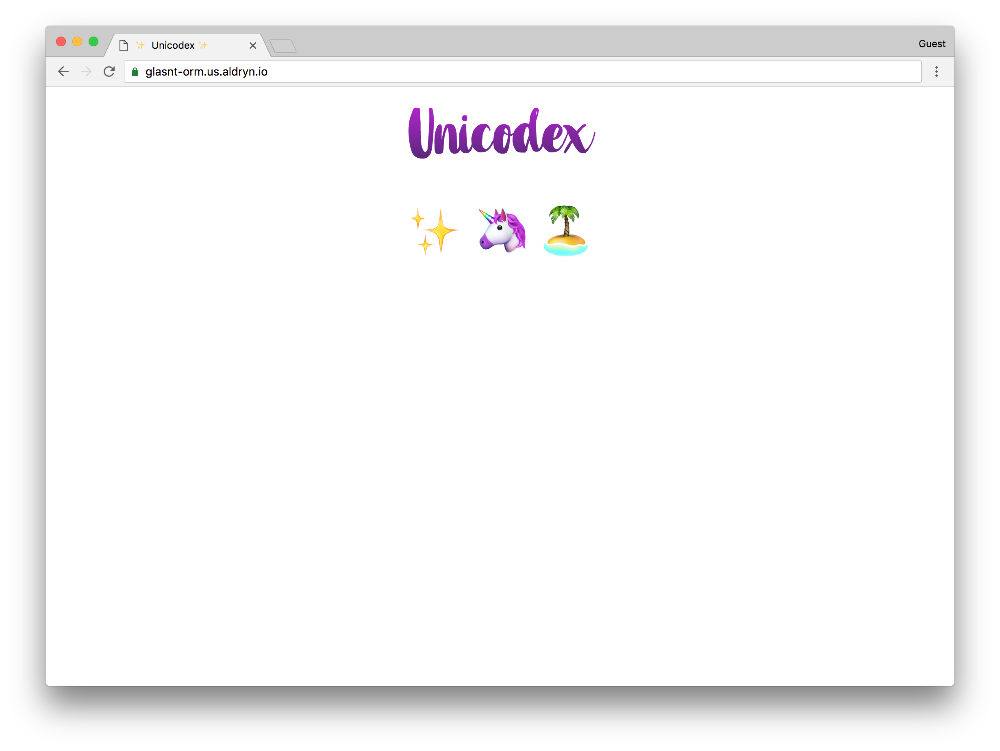
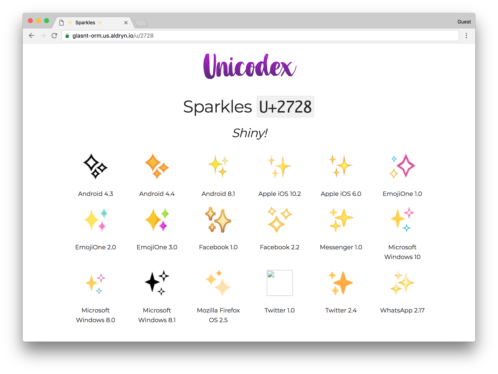
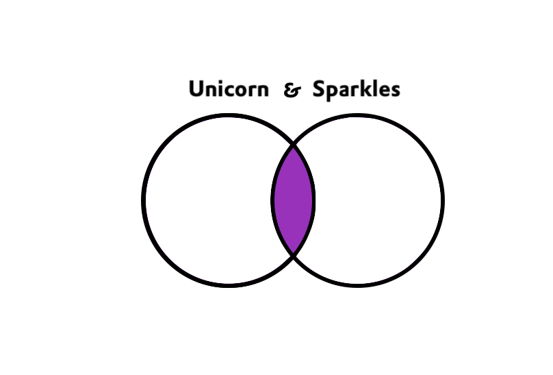
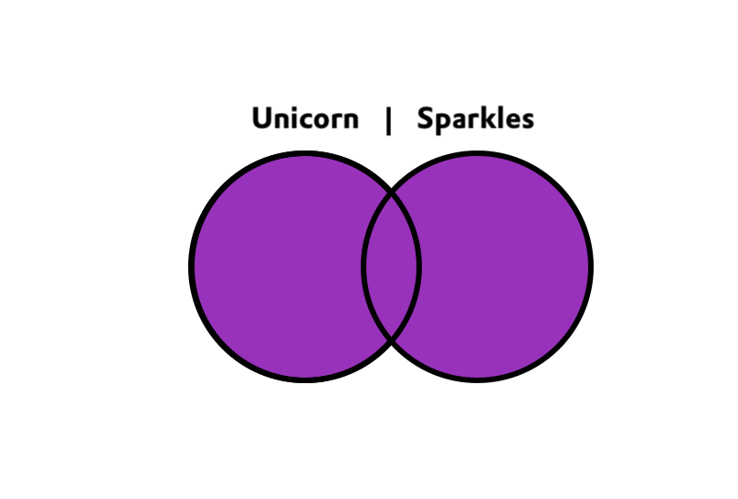

Class: title
# <br>ORM: The Sequel
## DjangoCon US 2018

---
class: middle, center


???

Hi I'm Katie
---
background-image: url("images/divio-background.png")


???

I'm a site reliability engineer at divio
We do hosted django as a service, come speak to me later if this interests you.

---
class: middle, center, image


???

I do a lot of things in and around Django, from being a Director of the Django Software foundation, to having run a DjangoCon, and helped at many more.

But I'm not currently a django developer. I'm still new to django

---
class: middle, center, image

???

But regardless of how much I know or don't know, I still think that this thing right here? The Django Admin is just
---
class: middle, center, image


???

oh so awesome. If I jump into a new project, and I need to do something I can just log into the admin
---
class: middle, center, image


???

Navigate to the place I want, and view, update, and delete to my hearts desire.

But the more I learn about django, the more I learn how the magic works.

This lovely insert-model-get-UI is powered by

---
<br><br><br><br><br>
.center[.ORM[.header[ORM]]]
<br>
.center[.ORM[.tagline[Object Relational Mapper]]]

???

the ORM

The object relational mapper

It allows us to interact with our data as objects in Python.

Now here's where I could start teaching you how the ORM works based on abstract thoughts

But I'm going to go a different way

---
background-image: url("images/thinkpad2.jpg")
.footnotes[[WOCinTech](https://www.flickr.com/photos/wocintechchat/albums)]

???

See, I might be new to django and newish to python, but while I work in ops in these languages, I have many *many* years of development behind me, just not in Python.

I've come from an ... ecclectic background, ranging from Ruby to Haskell to Powershell as my 'native languages', but all of these have something in common.

When you're working with data, you need a database, and databases have a shared language

---
<br><br><br><br><br>
.center[.SQL[.header[SQL]]]
<br>
.center[.SQL[.tagline[Structured Query Language]]]

???

SQL

Structured Query Language

Select star from table where blah is like blah

Sure, you have graphql now, but SQL is still a fundamental skill.

And when I was first asking questions about the ORM with one of the django core devs (did you know you can just ask them questions? it's awesome!) one of the things they asked is "well, what do you already know?"

---
class: title
# Common Context

???

And we've already seem similar talks like this at this very conference. We had a JavaScript for Python devs eralier in the week, and we also had an entire talk on skill transference when switching careers.

In everything, context is important.

For a developer coming at a problem from a different tech stack, being able to leverage shared skills into learning this new bit of tech is a fast-pass to understanding.

Given that, this talk is going to go a bit differently.

---

background-image: url("images/smol5.jpg")

???


We're not going to start from tech basics, and we're not going to start with a blank project.

We're going to use our existing SQL knowledge on an existing project. If you don't know SQL, I'm not going to teach it from first prinicples, but hopefully you can follow along,

---
background-image: url("images/hunterbird-169.jpg")

???

We're going to be a fully grown bird, hunting for a bug in an environment that might seem complex, but is just only a little bit different from what we were used to when we were but a smol bird.

---
class: title
# Context

???

So for our existing application, we're going to use something near and dear to my heart
---
class: title, emoji
class: title
# ✨
???

emoji

What? You think I wouldn't mention emoji in a talk at a djangocon? :)


---
class: top, image


???

This is our sample project, based on a concept that might be familiar to you, Emojipedia.

I've created a little django application that shows information about emoji appear on different platforms.

On the home page there's a bunch of emoji and if you click on one

---

class: top, image


???

it shows you the emoji from different vendors and the versions.

We can see taht there's a few listings for versions of Apple, Android, etc..

And as you can see, there's a bug.

There's a broken image in this listing. And it's our job to find out why.

We could use the admin, but instead, we're going to use something called

---

class: title
# 🦄🐚
???

The django shell

The django shell is a command line interface into your project

---
### The Shell
<div class="shell-wrap"><p class="shell-top-bar">bash</p><p class="shell-body">
<ps>myrtle</ps> <dr>~ $</dr>

???

a lot of my examples today are going to be shown in literal terminals - iterm2 on macos mojave, for those playing at home.

So to get to the django shell, we first
---
### The Shell
<div class="shell-wrap"><p class="shell-top-bar">bash</p><p class="shell-body">
<ps>myrtle</ps> <dr>~ $</dr>
cd project<w>&nbsp;</w>

???

need to navigate to our project
---
### The Shell
<div class="shell-wrap"><p class="shell-top-bar">bash</p><p class="shell-body">
<ps>myrtle</ps> <dr>~ $</dr>
cd project<br>
<ps>myrtle</ps> <dr>~/project $</dr>
<w>&nbsp;</w>

???

and then depending on how your project is setup,
---
### The Shell
<div class="shell-wrap"><p class="shell-top-bar">bash</p><p class="shell-body">
<ps>myrtle</ps> <dr>~ $</dr>
cd project<br>
<ps>myrtle</ps> <dr>~/project $</dr>
./manage.py shell<w>&nbsp;</w>

???

call manage.py shell

You may need to preface this with a call to start your virtualenv, pipenv, docker run, whatever.

But you'll get...
---
### The Shell
<div class="shell-wrap"><p class="shell-top-bar">python3.7</p><p class="shell-body">
<ps>myrtle</ps> <dr>~ $</dr>
cd project<br>
<ps>myrtle</ps> <dr>~/project $</dr>
./manage.py shell<br>
Python 3.7.0 (default, Sep 24 2018, 20:50:19)<br>
[Clang 10.0.0 (clang-1000.10.44.2)] on darwin<br>
Type "help", "copyright", "credits" or "license" for more information.<br>
`>>>` <w>&nbsp;</w>

???

Here, we're presented with an interactive console

All shell is is a python environment where the django environment path has been loaded.

From here you can interact with your django projet directly.

---
class: title
# 🐚💪

???

the shell is pretty powerful, but you need to understand how to call django and ORM commands in order to use it.

---

class: title
# 🤔

???

but would I, a database nerd, interact with it?


First thing I'd want to do in any new system
---
class: title
## Finding all tables

???

I want to know what I'm working with.
---
### Finding all tables

<pre><code class="sql">-- MySQL<br>show tables;</code></pre>
<br>

<pre><code class="sql">-- PostgreSQL<br>\dt</code></pre>

<pre><code class="sql">-- Oracle<br>SELECT *<br>FROM dba.tables;</code></pre>


???

depending on which flavour of database is most familiar to you, you'd try and issue one of these commands

For mysql, for postgres, for oracle

But we're not in a database console, we're in the django shell. We need to use ORM codes.


---
### Finding all tables
```python
&num;  ORM Code 
&num;  ...
```

???

SO! To list all the tables in a project in the django shell!...

there's no real good way.

In order to start querying model objects, you need to import the models

In django, a project has multiple applications, or apps, and an app can have one or many models.

The model code is the powerhouse of django. the ORM manipulates models. A lot of the logic for a django project is going to be in the model.py of it's various applications.
But without looking at the model code, and understanding what you're looking at in order to generate the import statement, you can be at a complete loss.

Thankfully, django is clever and has helpful methods you can call to generate a list of imports for all the models in the project
---
### Generate import statements
```python
# python

from django.apps import apps

for app_config in apps.get_app_configs():
   l = app_config.name
   for model in app_config.get_models():
     n = model._meta.object_name
     print(f'from {l}.models import {n}')
```

???

here's some I prepared earlier

We're going to import the django apps

And iterate over all the apps that django knows about

For each of those, we're going to get all the models

and print an import statement for each

---
### Generate import statements
<div class="shell-wrap"><p class="shell-top-bar">python3.7</p><p class="shell-body">
<ps>myrtle</ps> <dr>~/project $</dr>
./manage.py shell<br>
Python 3.7.0 (default, Sep 24 2018, 20:50:19)<br>
[Clang 10.0.0 (clang-1000.10.44.2)] on darwin<br>
Type "help", "copyright", "credits" or "license" for more information.<br>
`>>>` &nbsp;<w>&nbsp;</w>

???

Going back to our shell
---
### Generate import statements
<div class="shell-wrap"><p class="shell-top-bar">python3.7</p><p class="shell-body">
<ps>myrtle</ps> <dr>~/project $</dr>
./manage.py shell<br>
Python 3.7.0 (default, Sep 24 2018, 20:50:19)<br>
[Clang 10.0.0 (clang-1000.10.44.2)] on darwin<br>
Type "help", "copyright", "credits" or "license" for more information.<br>
`>>>` from django.apps import apps<br><br>
`>>>` for app_config in apps.get_app_configs():<br><br>
...&nbsp; l = app_config.name<br>
...&nbsp; for model in app_config.get_models():<br>
...&nbsp; &nbsp; n = model._meta.object_name<br>
...&nbsp; &nbsp; print(f'from {l}.models import {n}')<br>
...&nbsp;<w>&nbsp;</w>

???

for now, we're just going to dump in that code and run it
---
### Generate import statements
<div class="shell-wrap"><p class="shell-top-bar">python3.7</p><p class="shell-body">
...&nbsp;<br>
from django.contrib.auth.models import Permission<br>
from django.contrib.auth.models import Group<br>
from django.contrib.auth.models import User<br>
from django.contrib.contenttypes.models import ContentType<br>
from django.contrib.sessions.models import Session<br>
from django.contrib.sites.models import Site<br>
from aldryn_sso.models import AldrynCloudUser<br>
from django.contrib.admin.models import LogEntry<br>
from unicodex.models import Codepoint<br>
from unicodex.models import Vendor<br>
from unicodex.models import VendorVersion<br>
from unicodex.models import Design<br>
`>>>` &nbsp;<w>&nbsp;</w>

???

and what we get back is some generated import statements about

This output will have similarities across django projects

the first few in this list are pretty standard fair; authentication, sessions, sites, admin

There's also one in there called aldryn_sso. The divio platform gives a bunch of things out of the boxx, and the ability to use your divio account to log into the django admin is one of them.

But what we're looking for is, in a lovely happenstance, the models that match the name of the website we saw earlier -- unicodex.
---

class: title
## Finding the table for a model

???

Because I'm interested in the database, I want to see what table a model relates to
---
### Finding the table for a model
<pre><code>
<c># ORM</c>
Codepoint._meta.db_table
</code></pre>

???

and to do that, we can query the _meta options for our model.

We used this before to get the object name to import
---
### Finding the table for a model
<div class="shell-wrap"><p class="shell-top-bar">python3.7</p><p class="shell-body">
<ps>myrtle</ps> <dr>~/project $</dr>
./manage.py shell<br>
Python 3.7.0 (default, Sep 24 2018, 20:50:19)<br>
[Clang 10.0.0 (clang-1000.10.44.2)] on darwin<br>
Type "help", "copyright", "credits" or "license" for more information.<br>
`>>>` from unicodex.models import Codepoint<br>
`>>>` Codepoint._meta.db_table<w>&nbsp;</w>

???

so in our terminal, we can import Cdepoint and get value
---
### Finding the table for a model
<div class="shell-wrap"><p class="shell-top-bar">python3.7</p><p class="shell-body">
<ps>myrtle</ps> <dr>~/project $</dr>
./manage.py shell<br>
Python 3.7.0 (default, Sep 24 2018, 20:50:19)<br>
[Clang 10.0.0 (clang-1000.10.44.2)] on darwin<br>
Type "help", "copyright", "credits" or "license" for more information.<br>
`>>>` from unicodex.models import Codepoint<br>
`>>>` Codepoint._meta.db_table<br>
'unicodex_codepoint'<br>
`>>>` <w>&nbsp;</w>
---
class: title
## Showing all table columns

???

we can also use meta to show all the columsn on the table
---
### Showing all table columns
<pre><code class="sql">-- MySQL<br>show table_name;<br><br>-- PostgreSQL<br>\d+ table_name<br><br>-- Oracle<br>EXEC sp_columns 'table_name'</code></pre>

???

depending on your database this could be different, but in the ORM you can just use one command
---
### Showing all table columns

<pre><code class="python"># ORM</code></pre>
<pre><code class="python">Codepoint._meta.get_fields()</code></pre>

???

again, another meta call, asking to get the fields on the model
---
### Showing all table columns
<div class="shell-wrap"><p class="shell-top-bar">python3.7</p><p class="shell-body">
<ps>myrtle</ps> <dr>~/project $</dr>
./manage.py shell<br>
Python 3.7.0 (default, Sep 24 2018, 20:50:19)<br>
[Clang 10.0.0 (clang-1000.10.44.2)] on darwin<br>
Type "help", "copyright", "credits" or "license" for more information.<br>
`>>>` from unicodex.models import Codepoint<br>
`>>>` Codepoint._meta.db_table<br>
'unicodex_codepoint'<br>
`>>>` <w>&nbsp;</w>
???

so back in our terminal
---
### Showing all table columns
<div class="shell-wrap"><p class="shell-top-bar">python3.7</p><p class="shell-body">
<ps>myrtle</ps> <dr>~/project $</dr>
./manage.py shell<br>
Python 3.7.0 (default, Sep 24 2018, 20:50:19)<br>
[Clang 10.0.0 (clang-1000.10.44.2)] on darwin<br>
Type "help", "copyright", "credits" or "license" for more information.<br>
`>>>` from unicodex.models import Codepoint<br>
`>>>` Codepoint._meta.db_table<br>
'unicodex_codepoint'<br>
`>>>` Codepoint._meta.get_fields()<w>&nbsp;</w>
???

we can ask for the fields
---
### Showing all table columns
<div class="shell-wrap"><p class="shell-top-bar">python3.7</p><p class="shell-body">
<ps>myrtle</ps> <dr>~/project $</dr>
./manage.py shell<br>
Python 3.7.0 (default, Sep 24 2018, 20:50:19)<br>
[Clang 10.0.0 (clang-1000.10.44.2)] on darwin<br>
Type "help", "copyright", "credits" or "license" for more information.<br>
`>>>` from unicodex.models import Codepoint<br>
`>>>` Codepoint._meta.db_table<br>
'unicodex_codepoint'<br>
`>>>` Codepoint._meta.get_fields()<br>
(`<`ManyToOneRel: unicodex.design>, <br>
`<`django.db.models.fields.AutoField: id>, <br>
`<`django.db.models.fields.CharField: name>, <br>
`<`django.db.models.fields.TextField: description>,<br>
`<`django.db.models.fields.CharField: codepoint>)<br>
`>>>` <w>&nbsp;</w>

???

we can get that
---
class: title
## 🤔

???

but what about all those native functions, can we still make use of them?

Well you can always connect directly to the databse, but django has a helpful wrapper for that

---
### Go directly to the database
<div class="shell-wrap"><p class="shell-top-bar">bash</p><p class="shell-body">
<ps>myrtle</ps> <dr>~/project $</dr>
<w>&nbsp;</w>
???

in our terminal, instead of calling manage.py shell

---
### Go directly to the database
<div class="shell-wrap"><p class="shell-top-bar">bash</p><p class="shell-body">
<ps>myrtle</ps> <dr>~/project $</dr>
./manage.py dbshell<w>&nbsp;</w>

???

we can run managepy db shell
---
### Go directly to the database
<div class="shell-wrap"><p class="shell-top-bar">psql</p><p class="shell-body">
<ps>myrtle</ps> <dr>~/project $</dr>
./manage.py dbshell<br>
&#112;sql (9.6.5, server 9.6.8)<br>
Type "help" for help.<br>
<br>
db=#&nbsp;<w>&nbsp;</w>

???

and we get an output that will be familiar to postgres devs in the audience

This particular project has a postgres backend

---
### Show all tables
<div class="shell-wrap"><p class="shell-top-bar">psql</p><p class="shell-body">
<ps>myrtle</ps> <dr>~/project $</dr>
./manage.py dbshell<br>
&#112;sql (9.6.5, server 9.6.8)<br>
Type "help" for help.<br>
<br>
db=# \dt<w>&nbsp;</w>

???

given we know it's postgres, we cna issue the postgres list table command, and get back
---
### Show all tables
<div class="shell-wrap"><p class="shell-top-bar">psql</p><p class="shell-body">
&nbsp; &nbsp; &nbsp; &nbsp; &nbsp; &nbsp; &nbsp; &nbsp; &nbsp; List of relations<br>
&nbsp;Schema |&nbsp; &nbsp; &nbsp; &nbsp; &nbsp; &nbsp; Name&nbsp; &nbsp; &nbsp; &nbsp; &nbsp; &nbsp; | Type&nbsp; |&nbsp; Owner<br>
&dash;&dash;&dash;&dash;&dash;&dash;&dash;&dash;+&dash;&dash;&dash;&dash;&dash;&dash;&dash;&dash;&dash;&dash;&dash;&dash;&dash;&dash;&dash;&dash;&dash;&dash;&dash;&dash;&dash;&dash;&dash;&dash;&dash;&dash;&dash;&dash;+&dash;&dash;&dash;&dash;&dash;&dash;&dash;+&dash;&dash;&dash;&dash;&dash;&dash;&dash;&dash;&dash;&dash;<br>
&nbsp;public | aldryn_sso_aldrynclouduser | table | postgres<br>
&nbsp;public | auth_group&nbsp; &nbsp; &nbsp; &nbsp; &nbsp; &nbsp; &nbsp; &nbsp;&nbsp; | table | postgres<br>
&nbsp;public | auth_group_permissions&nbsp; &nbsp; &nbsp;| table | postgres<br>
&nbsp;public | auth_permission&nbsp; &nbsp; &nbsp; &nbsp; &nbsp; &nbsp; | table | postgres<br>
&nbsp;public | auth_user&nbsp; &nbsp; &nbsp; &nbsp; &nbsp; &nbsp; &nbsp; &nbsp; &nbsp; | table | postgres<br>
&nbsp;public | auth_user_groups&nbsp; &nbsp; &nbsp; &nbsp;&nbsp; &nbsp; | table | postgres<br>
&nbsp;public | auth_user_user_permissions | table | postgres<br>
&nbsp;public | django_admin_log&nbsp; &nbsp;&nbsp; &nbsp; &nbsp; &nbsp; | table | postgres<br>
&nbsp;public | django_content_type&nbsp; &nbsp; &nbsp; &nbsp; | table | postgres<br>
&nbsp;public&nbsp;|&nbsp;django_migrations&nbsp;&nbsp;&nbsp;&nbsp;&nbsp;&nbsp;&nbsp;&nbsp;&nbsp;&nbsp;|&nbsp;table&nbsp;|&nbsp;postgres<br.
&nbsp;public&nbsp;|&nbsp;django_session&nbsp;&nbsp;&nbsp;&nbsp;&nbsp;&nbsp;&nbsp;&nbsp;&nbsp;&nbsp;&nbsp;&nbsp;&nbsp;|&nbsp;table&nbsp;|&nbsp;postgres<br>
&nbsp;public&nbsp;|&nbsp;django_site&nbsp;&nbsp;&nbsp;&nbsp;&nbsp;&nbsp;&nbsp;&nbsp;&nbsp;&nbsp;&nbsp;&nbsp;&nbsp;&nbsp;&nbsp;&nbsp;|&nbsp;table&nbsp;|&nbsp;postgres<br>
&dash;&dash;More&dash;&dash;

???

all our tables. Note the usual suspects from earlier, auth, content, sites
---
### Show all tables
<div class="shell-wrap"><p class="shell-top-bar">psql</p><p class="shell-body">
&nbsp;public | auth_permission&nbsp; &nbsp; &nbsp; &nbsp; &nbsp; &nbsp; | table | postgres<br>
&nbsp;public | auth_user&nbsp; &nbsp; &nbsp; &nbsp; &nbsp; &nbsp; &nbsp; &nbsp; &nbsp; | table | postgres<br>
&nbsp;public | auth_user_groups&nbsp; &nbsp; &nbsp; &nbsp;&nbsp; &nbsp; | table | postgres<br>
&nbsp;public | auth_user_user_permissions | table | postgres<br>
&nbsp;public | django_admin_log&nbsp; &nbsp;&nbsp; &nbsp; &nbsp; &nbsp; | table | postgres<br>
&nbsp;public | django_content_type&nbsp; &nbsp; &nbsp; &nbsp; | table | postgres<br>
&nbsp;public&nbsp;|&nbsp;django_migrations&nbsp;&nbsp;&nbsp;&nbsp;&nbsp;&nbsp;&nbsp;&nbsp;&nbsp;&nbsp;|&nbsp;table&nbsp;|&nbsp;postgres<br.
&nbsp;public&nbsp;|&nbsp;django_session&nbsp;&nbsp;&nbsp;&nbsp;&nbsp;&nbsp;&nbsp;&nbsp;&nbsp;&nbsp;&nbsp;&nbsp;&nbsp;|&nbsp;table&nbsp;|&nbsp;postgres<br>
&nbsp;public&nbsp;|&nbsp;django_site&nbsp;&nbsp;&nbsp;&nbsp;&nbsp;&nbsp;&nbsp;&nbsp;&nbsp;&nbsp;&nbsp;&nbsp;&nbsp;&nbsp;&nbsp;&nbsp;|&nbsp;table&nbsp;|&nbsp;postgres<br>
&nbsp;public&nbsp;|&nbsp;unicodex_codepoint&nbsp;&nbsp;&nbsp;&nbsp;&nbsp;&nbsp;&nbsp;&nbsp;&nbsp;|&nbsp;table&nbsp;|&nbsp;postgres<br>
&nbsp;public&nbsp;|&nbsp;unicodex_design&nbsp;&nbsp;&nbsp;&nbsp;&nbsp;&nbsp;&nbsp;&nbsp;&nbsp;&nbsp;&nbsp;&nbsp;|&nbsp;table&nbsp;|&nbsp;postgres<br>
&nbsp;public&nbsp;|&nbsp;unicodex_vendor&nbsp;&nbsp;&nbsp;&nbsp;&nbsp;&nbsp;&nbsp;&nbsp;&nbsp;&nbsp;&nbsp;&nbsp;|&nbsp;table&nbsp;|&nbsp;postgres<br>
&nbsp;public&nbsp;|&nbsp;unicodex_vendorversion&nbsp;&nbsp;&nbsp;&nbsp;&nbsp;|&nbsp;table&nbsp;|&nbsp;postgres<br>
(16 rows)<br>
<br>
db=#&nbsp;<w>&nbsp;</w>

???

but also, our own project's tables

We'll take note of these for later.
---
class: title
## Show all table contents

???

so now that we know there are tables, we'd like to see what's inside them
---
### Show all table contents
<pre><code>
<c>&dash;&dash; SQL</c>
<r>SELECT * <br>&nbsp; FROM</r> unicodex_codepoint;
<br><br>
</code></pre>

???

in SQL, this would be your standard select star from table
---
### Show all table contents
<pre><code>
<c>&dash;&dash; SQL</c>
<r>SELECT * <br>&nbsp; FROM</r> unicodex_codepoint;

<c>&num; ORM</c>
Codepoint.objects.all()
</code></pre>

???

in the ORM, this maps to Codepoint, the model, dot objects dot all

Just list all of them
---
### Show all table contents
<div class="shell-wrap"><p class="shell-top-bar">python3.7</p><p class="shell-body">
<ps>myrtle</ps> <dr>~/project $</dr>
./manage.py shell<br>
Python 3.7.0 (default, Sep 24 2018, 20:50:19)<br>
[Clang 10.0.0 (clang-1000.10.44.2)] on darwin<br>
Type "help", "copyright", "credits" or "license" for more information.<br>
`>>>` from unicodex.models import Codepoint<br>
`>>>` Codepoint.objects.all()<w>&nbsp;</w>

???

then we make our codepoint dot objects dot all call
---
### Show all table contents
<div class="shell-wrap"><p class="shell-top-bar">python3.7</p><p class="shell-body">
<ps>myrtle</ps> <dr>~/project $</dr>
./manage.py shell<br>
Python 3.7.0 (default, Sep 24 2018, 20:50:19)<br>
[Clang 10.0.0 (clang-1000.10.44.2)] on darwin<br>
Type "help", "copyright", "credits" or "license" for more information.<br>
`>>>` from unicodex.models import Codepoint<br>
`>>>` Codepoint.objects.all()<br>
`<`QuerySet [`<`Codepoint: Sparkles>, `<`Codepoint: Unicorn>, `<`Codepoint: Desert Island>]><br>
`>>>` <w>&nbsp;</w>

???

and we get back a queryset of objects

We remember from earlier that there were sparkles, unicorns and hearts on our page, so we're getting the right data!

The return value here is known as a queryset, an unordered objects. QuerySets can be enacted upon further, which we'll see later.


**Query set is not a list**

---
class: title
## Show specific table contents

???

now that we can see all the things, how about just some of the things
---
### Show specific table contents
<pre><code>
<c>&dash;&dash; SQL</c>
<r>SELECT * <br>&nbsp; FROM</r> unicodex_codepoint c<br>&nbsp;<r>WHERE</r> <l>c</l>.<l>name</l> <r>=</r> <d>'Sparkles'</d>;
<br><br>
</code></pre>

???

the SQL would be familiar

Adding a where clause for, say, sparkles
---
### Show specific table contents
<pre><code>
<c>&dash;&dash; SQL</c>
<r>SELECT * <br>&nbsp; FROM</r> unicodex_codepoint c<br>&nbsp;<r>WHERE</r> <l>c</l>.<l>name</l> <r>&equals;</r> <d>'Sparkles'</d>;

<c>&num; ORM</c>
Codepoint.objects.filter(<o>name&equals;</o>'Sparkles')
</code></pre>

???

this maps to the ORM as filter. where the name column is a keyword argument of filter.


---
### Show specific table contents
<div class="shell-wrap"><p class="shell-top-bar">python3.7</p><p class="shell-body">
`>>>` from unicodex.models import Codepoint<br>
`>>>` Codepoint.objects.filter(name='Sparkles')<w>&nbsp;</w>

???

so in our fresh terminal, we import Codepoint

Then run our filter
---
### Show specific table contents
<div class="shell-wrap"><p class="shell-top-bar">python3.7</p><p class="shell-body">
`>>>` from unicodex.models import Codepoint<br>
`>>>` Codepoint.objects.filter(name='Sparkles')<br>
`<`QuerySet [`<`Codepoint: Sparkles>]><br>
`>>>` <w>&nbsp;</w>
???

and we get back a queryset with a single object: sparkles
---
class: title
## Get specific record

???

we can also just return one specific record, instead of a queryset
---
### Get specific record
<pre><code>
<c>&num; ORM</c>
Codepoint.objects.get(<o>name&equals;</o>'Sparkles')
</code></pre>

???

intead of filter, we can use get
---
### Get specific record
<div class="shell-wrap"><p class="shell-top-bar">python3.7</p><p class="shell-body">
`>>>` from unicodex.models import Codepoint<br>
`>>>` Codepoint.objects.filter(name='Sparkles')<br>
`<`QuerySet [`<`Codepoint: Sparkles>]><br>
`>>>` Codepoint.objects.get(name='Sparkles')<w>&nbsp;</w>
???

so where last time we used filter

This time we use get
---
### Get specific record
<div class="shell-wrap"><p class="shell-top-bar">python3.7</p><p class="shell-body">
`>>>` from unicodex.models import Codepoint<br>
`>>>` Codepoint.objects.filter(name='Sparkles')<br>
`<`QuerySet [`<`Codepoint: Sparkles>]><br>
`>>>` Codepoint.objects.get(name='Sparkles')<br>
`<`Codepoint: Sparkles><br>
`>>>` <w>&nbsp;</w>

???

and we get a single object
---
### Get specific record
<div class="shell-wrap"><p class="shell-top-bar">python3.7</p><p class="shell-body">
`>>>` from unicodex.models import Codepoint<br>
`>>>` Codepoint.objects.filter(name='Sparkles')<br>
`<`QuerySet [`<`Codepoint: Sparkles>]><br>
`>>>` Codepoint.objects.get(name='Sparkles')<br>
`<`Codepoint: Sparkles><br>
`>>>` Codepoint.objects.get()<w>&nbsp;</w>

???

a thing to note about get

Get will always return one and only one object

THERE CAN BE ONLY ONE

So if you try and run get, say, without any limiatations
---
### Get specific record
<div class="shell-wrap"><p class="shell-top-bar">python3.7</p><p class="shell-body">
`<`QuerySet [`<`Codepoint: Sparkles>]><br>
`>>>` Codepoint.objects.get(name='Sparkles')<br>
`<`Codepoint: Sparkles><br>
`>>>` Codepoint.objects.get()<br>
Traceback (most recent call last):<br>
&nbsp; File "`<`console>", line 1, in `<`module><br>
&nbsp; File "/usr/local/lib/python3.7/site-packages/django/db/models/manager.p y", line 85, in manager_method<br>
&nbsp; &nbsp; return getattr(self.get_queryset(), name)(&#42;args, &#42;&#42;kwargs)<br>
&nbsp; File "/usr/local/lib/python3.7/site-packages/django/db/models/query.py" , line 384, in get<br>
&nbsp; &nbsp; (self.model._meta.object_name, num)<br>
unicodex.models.MultipleObjectsReturned: get() returned more than one Codepoint -- it returned 3!<br>
`>>>` <w>&nbsp;</w>

???

we get a MultipleObjectsReturned error

which tells us that it would have returned three Codepoint objects, which is just far too much for get to handle.
---
class: title
## Joins

???

So now we come to the fun bit. Joins

Anyone who's worked with SQL for long enough will know the venn diagrams for inner joins, outer joins, left joins, right joins, and it can get a bit confusing

Thankfully, especially for someone like me who has forgotten so much SQL, the ORM makes joins a joy.
---
### Joins
<pre><code><c>&dash;&dash; SQL</c><br><r>SELECT</r> d.<r>*</r> <br>&nbsp; <r>FROM</r> unicodex_codepoint c,<br>&nbsp; &nbsp; &nbsp; &nbsp;unicodex_design d<br>&nbsp;<r>WHERE</r> <l>c</l>.<l>name</l> <r>&equals;</r> <d>'Sparkles'</d><BR><r>&nbsp; &nbsp;AND</r> <l>d</l>.<l>codepoint_id</l> <r>=</r> <l>c</l>.<l>id</l>;
???

say we want to join our design and codepoint tables

A codepoint has multiple designs. Sparkles has an image that shows up in Android, Apple, Facebook, etc

So we want to join on the codepoint_id on the designs table to the primary codepoint id

This is a good chunk of SQL

So what does the ORM equivelent look like?
---
### Joins
<pre><code><c>&dash;&dash; SQL</c><br><r>SELECT</r> d.<r>*</r> <br>&nbsp; <r>FROM</r> unicodex_codepoint c,<br>&nbsp; &nbsp; &nbsp; &nbsp;unicodex_design d<br>&nbsp;<r>WHERE</r> <l>c</l>.<l>name</l> <r>&equals;</r> <d>'Sparkles'</d><BR><r>&nbsp; &nbsp;AND</r> <l>d</l>.<l>codepoint_id</l> <r>=</r> <l>c</l>.<l>id</l>;<br><br><c>&num; ORM</c>
Design.objects.filter(<o>codepoint＿name&equals;</o>'Sparkles')
</code></pre>
???

Design dot objects dot filter codepoint dunder name equals sparkles.

I know right? so simple!

---
### Joins
<pre><code><c>&dash;&dash; SQL</c><br><r>SELECT</r> d.<r>*</r> <br>&nbsp; <r>FROM</r> unicodex_codepoint c,<br>&nbsp; &nbsp; &nbsp; &nbsp;unicodex_design d<br>&nbsp;<r>WHERE</r> <l>c</l>.<l>name</l> <r>&equals;</r> <d>'Sparkles'</d><BR><r>&nbsp; &nbsp;AND</r> <l>d</l>.<l>codepoint_id</l> <r>=</r> <l>c</l>.<l>id</l>;<br><br><c>&num; ORM</c>
Design.objects.filter(<o>codepoint＿name&equals;</o>'Sparkles')
&nbsp; &nbsp; &nbsp; &nbsp; &nbsp; &nbsp;&nbsp; &nbsp; &nbsp; &nbsp; &nbsp; &nbsp; &nbsp; &nbsp; &nbsp; &nbsp; <c>^^</c>
</code></pre>

???

this doubleunderscore here is doing a lot of powerful things behind the scenes

which I'll explain more in a moment.

---
### Joins
<div class="shell-wrap"><p class="shell-top-bar">python3.7</p><p class="shell-body">
`>>>` <w>&nbsp;</w>

???

back to our terminal again, to execute this elegant little code snippet

We import the design model this time
---
### Joins
<div class="shell-wrap"><p class="shell-top-bar">python3.7</p><p class="shell-body">
`>>>` from unicodex.models import Design<w>&nbsp;</w>
---
### Joins
<div class="shell-wrap"><p class="shell-top-bar">python3.7</p><p class="shell-body">
`>>>` from unicodex.models import Design<br>
`>>>` <w>&nbsp;</w>
---

### Joins
<div class="shell-wrap"><p class="shell-top-bar">python3.7</p><p class="shell-body">
`>>>` from unicodex.models import Design<br>
`>>>` Design.objects.filter(codepoint＿name='Sparkles')<w>&nbsp;</w>
???

and we run our filter
---
### Joins
<div class="shell-wrap"><p class="shell-top-bar">python3.7</p><p class="shell-body">
`>>>` from unicodex.models import Design<br>
`>>>` Design.objects.filter(codepoint＿name='Sparkles')<br>
`<`QuerySet [`<`Design: Sparkles Apple iOS 10.2>, `<`Design: Sparkles Apple iOS 6.0>, `<`Design: Sparkles Android 8.1>, `<`Design: Sparkles Android 4.4>, `<`Design: Sparkles Android 4.3>, `<`Design: Sparkles Microsoft Windows 10>, `<`Design: Sparkles Microsoft Windows 8.0>, `<`Design: Sparkles Microsoft Windows 8.1>, `<`Design: Sparkles Twitter 2.4>, `<`Design: Sparkles EmojiOne 3.0>, `<`Design: Sparkles EmojiOne 2.0>, `<`Design: Sparkles EmojiOne 1.0>, `<`Design: Sparkles Facebook 2.2>, `<`Design: Sparkles Facebook 1.0>, `<`Design: Sparkles Messenger 1.0>, `<`Design: Sparkles WhatsApp 2.17>, `<`Design: Sparkles Mozilla Firefox OS 2.5>, `<`Design: Sparkles Twitter 1.0>]><br>
`>>>` <w>&nbsp;</w>


???

---
### Joins

```python
# ORM
Design.objects.filter(codepoint__name='Sparkles')
# field, lookup
```

???

what we have here is one or more fields and then a lookup, all separated by double underscores

A lookup as an operation on that field

If you remember back when we looked up the fields on a model, we know what options we have here.

You'll also note in our example that we end on a field.

By default the look up is an exact match on the string. So effectively, name equals sparkles
---
### Joins

```python
# ORM
Design.objects.filter(codepoint__name='Sparkles')
# field, lookup

# ORM
Design.objects.filter(codepoint__name__exact='Sparkles')
# field, field, lookup
```

???

so by default what we're calling is codepoint name equals
---
class: title
# Aside

???

as aside, did you know that this is how those awesome admin filters work? it's true!
---
class: top, image

???

if we go back to that admin page we saw right at the start
---
class: top, image

???

Look at the URL

It's our filters

the admin uses field lookups in it's UI

and to some extent, you can handcode this URL to do some basic filtering, even if there isn't any filters on the right hand side panel

---
class: title
# Longest possible chain?
???
So, what if we want to try and build our longest possible chain

We'd need to be able to find how all our models link together, and then add a lookup on the end.

To do that we need to
---
class: title
# Discover the entire schema

???

discover the entire schema

Using the tools we already have, we could go through all the models we know, and for each one, import it, and get the fields

---
### Discovering the schema
<div class="shell-wrap"><p class="shell-top-bar">python3.7</p><p class="shell-body">
<ps>myrtle</ps> <dr>~/project $</dr>
./manage.py shell<br>
Python 3.7.0 (default, Sep 24 2018, 20:50:19)<br>
[Clang 10.0.0 (clang-1000.10.44.2)] on darwin<br>
Type "help", "copyright", "credits" or "license" for more information.<br>
`>>>` from unicodex.models import Design<br>
`>>>` Design._meta.get_fields()<w>&nbsp;</w>

???

such as this, for design
---
### Discovering the schema
<div class="shell-wrap"><p class="shell-top-bar">python3.7</p><p class="shell-body">
<ps>myrtle</ps> <dr>~/project $</dr>
./manage.py shell<br>
Python 3.7.0 (default, Sep 24 2018, 20:50:19)<br>
[Clang 10.0.0 (clang-1000.10.44.2)] on darwin<br>
Type "help", "copyright", "credits" or "license" for more information.<br>
`>>>` from unicodex.models import Design<br>
`>>>` Design._meta.get_fields()<br>
(`<`django.db.models.fields.AutoField: id>,<br>
`<`django.db.models.fields.related.ForeignKey: vendorversion>, <br>
`<`django.db.models.fields.related.ForeignKey: codepoint>, <br>
`<`django.db.models.fields.files.FileField: image>)<br>
`>>>` <w>&nbsp;</w>

???

which shows other fields we haven't seen before

There's a Foreign key there, which we can link back to the Codepoint model,

we also see a special field: FileField. We are looking for a broken image so knowing about this will be useful later.


Now, we could go through like this for the all the models

But because this is DJango

There's a better way.

But I'm sorry, but there's going to be a UML diagram.
---
<br><br><br><br><br>
.center[.UML[.header[UML]]]
<br>
.center[.UML[.tagline[Unified Modeling Language]]]

???

Unified Modeling Language

You might be familiar with a different type of visualisation scheme, but what this essentually is is just a way of seeing how different tables, or in our case, models, link to each other.

And the great thing about django is that it can generate this for us! (noticing a trend here?)


---
### Generate UML diagrams - setup

<div class="shell-wrap"><p class="shell-top-bar">bash</p><p class="shell-body">
<ps>myrtle</ps> <dr>~/project $</dr>
<w>&nbsp;</w>
???

The thing is, we will need some setup here, because this functionality isn't native to core django

And as I mentioned, I run a mac, so these instructions will be mac specific.
---
### Generate UML diagrams - setup
<div class="shell-wrap"><p class="shell-top-bar">bash</p><p class="shell-body">
<ps>myrtle</ps> <dr>~/project $</dr>
brew install graphviz<w>&nbsp;</w>

???

our diagrams will be generated using graphviz, so we'll install that to the system
---
### Generate UML diagrams - setup
<div class="shell-wrap"><p class="shell-top-bar">bash</p><p class="shell-body">
<ps>myrtle</ps> <dr>~/project $</dr>
brew install graphviz
<br>
.lblue[==>] .b[Downloading https`:`//homebrew.bintray.com/bottles/graphviz-2.40.1.moj ave.bottle.1.tar.gz]<br>
.white[############################################################ 100.0%]<br>
.lblue[==>] .b[Pouring graphviz-2.40.1.mojave.bottle.1.tar.gz]<br>
🍺 /usr/local/Cellar/graphviz/2.40.1: 500 files, 11.2MB<br>
<ps>myrtle</ps> <dr>~/project $</dr>
<w>&nbsp;</w>

???

so that's installed
---
### Generate UML diagrams - setup
<div class="shell-wrap"><p class="shell-top-bar">bash</p><p class="shell-body">
<ps>myrtle</ps> <dr>~/project $</dr>
brew install graphviz
<br>
.lblue[==>] .b[Downloading https`:`//homebrew.bintray.com/bottles/graphviz-2.40.1.moj ave.bottle.1.tar.gz]<br>
.white[############################################################ 100.0%]<br>
.lblue[==>] .b[Pouring graphviz-2.40.1.mojave.bottle.1.tar.gz]<br>
🍺 /usr/local/Cellar/graphviz/2.40.1: 500 files, 11.2MB<br>
<ps>myrtle</ps> <dr>~/project $</dr>
pip install pygraphviz django-extensions<w>&nbsp;</w>
???
Now we need to install some python packages

graphvuz <pre><code class="python">- the wrapper to our aforeinstalled graphviz</code></pre>

and this wonderful package called django-extenstions

Django extentions adds a bunch of helpful things to django, and UML diagrams is just one bit
---
### Generate UML diagrams - setup
<div class="shell-wrap"><p class="shell-top-bar">bash</p><p class="shell-body">
<ps>myrtle</ps> <dr>~/project $</dr>
brew install graphviz
<br>
.lblue[==>] .b[Downloading https`:`//homebrew.bintray.com/bottles/graphviz-2.40.1.moj ave.bottle.1.tar.gz]<br>
.white[############################################################ 100.0%]<br>
.lblue[==>] .b[Pouring graphviz-2.40.1.mojave.bottle.1.tar.gz]<br>
🍺 /usr/local/Cellar/graphviz/2.40.1: 500 files, 11.2MB<br>
<ps>myrtle</ps> <dr>~/project $</dr>
pip install pygraphviz django-extensions<br>
... <br> Successfully installed django-extensions-2.1.2 pygraphviz-1.5<br>
<ps>myrtle</ps> <dr>~/project $</dr>
<w>&nbsp;</w>
???
So now that's all installed, there's just one more thing we need to do before we can start making diagrams
---
### Generate UML diagrams - setup
<div class="shell-wrap"><p class="shell-top-bar">bash</p><p class="shell-body">
<ps>myrtle</ps> <dr>~/project $</dr>
brew install graphviz
<br>
.lblue[==>] .b[Downloading https`:`//homebrew.bintray.com/bottles/graphviz-2.40.1.moj ave.bottle.1.tar.gz]<br>
.white[############################################################ 100.0%]<br>
.lblue[==>] .b[Pouring graphviz-2.40.1.mojave.bottle.1.tar.gz]<br>
🍺 /usr/local/Cellar/graphviz/2.40.1: 500 files, 11.2MB<br>
<ps>myrtle</ps> <dr>~/project $</dr>
pip install pygraphviz django-extensions<br>
... <br> Successfully installed django-extensions-2.1.2 pygraphviz-1.5<br>
<ps>myrtle</ps> <dr>~/project $</dr>
vi settings.py<w>&nbsp;</w>
???
We need to edit our project

Everything so far has been able to be completed without even touching our code
---
### Generate UML diagrams - setup
<div class="shell-wrap"><p class="shell-top-bar">vim</p><p class="shell-body">
.aqua[import] aldryn_addons.settings<br>
aldryn_addons.settings.load(.b[.mblue[locals]]())<br>
<br>
.mblue[# all django settings can be altered here]
<br>
<br>
INSTALLED_APPS.extend([<br>
.tp[....].pink["unicodex"],<br>
])<br>
.mblue[~]<br>
.mblue[~]<br>
.mblue[~]<br>
.mblue[~]<br>
.mblue[~]<br>
.mblue[~]<br>
"settings.py" 9L, 156C written


???

so given a configuration that looks something like this in vim
---
### Generate UML diagrams - setup
<div class="shell-wrap"><p class="shell-top-bar">vim</p><p class="shell-body">
.aqua[import] aldryn_addons.settings<br>
aldryn_addons.settings.load(.b[.mblue[locals]]())<br>
<br>
.mblue[# all django settings can be altered here]
<br>
<br>
INSTALLED_APPS.extend([<br>
.tp[....].pink["unicodex"],<br>
.tp[....].pink["django_extensions"], .mblue[# note the underscore]<w>&nbsp;</w>
<br>
])<br>
.mblue[~]<br>
.mblue[~]<br>
.mblue[~]<br>
.mblue[~]<br>
.mblue[~]<br>
"settings.py" 10L, 203C written


???

we just need to add django extensions to our list of installed apps.

Django has to be told what's installed in order to load the app on start, and allow us to use it

If we didn't install unicodex, our app wouldn't know about it.

Also note in this case, we installed the package as django HYPHEN extensions, but we add it to the installed_apps as django UNDERSCORE packages
---
### Generate UML diagrams
<div class="shell-wrap"><p class="shell-top-bar">bash</p><p class="shell-body">
<ps>myrtle</ps> <dr>~/project $</dr>
brew install graphviz
<br>
.lblue[==>] .b[Downloading https`:`//homebrew.bintray.com/bottles/graphviz-2.40.1.moj ave.bottle.1.tar.gz]<br>
.white[############################################################ 100.0%]<br>
.lblue[==>] .b[Pouring graphviz-2.40.1.mojave.bottle.1.tar.gz]<br>
🍺 /usr/local/Cellar/graphviz/2.40.1: 500 files, 11.2MB<br>
<ps>myrtle</ps> <dr>~/project $</dr>
pip install pygraphviz django-extensions<br>
... <br> Successfully installed django-extensions-2.1.2 pygraphviz-1.5<br>
<ps>myrtle</ps> <dr>~/project $</dr>
vi settings.py<br>
<ps>myrtle</ps> <dr>~/project $</dr>
<w>&nbsp;</w>

???

So we save that file, and now, we're ready to generate our diagram

---
### Generate UML diagrams
<div class="shell-wrap"><p class="shell-top-bar">bash</p><p class="shell-body">
<ps>myrtle</ps> <dr>~/project $</dr>
brew install graphviz
<br>
.lblue[==>] .b[Downloading https`:`//homebrew.bintray.com/bottles/graphviz-2.40.1.moj ave.bottle.1.tar.gz]<br>
.white[############################################################ 100.0%]<br>
.lblue[==>] .b[Pouring graphviz-2.40.1.mojave.bottle.1.tar.gz]<br>
🍺 /usr/local/Cellar/graphviz/2.40.1: 500 files, 11.2MB<br>
<ps>myrtle</ps> <dr>~/project $</dr>
pip install pygraphviz django-extensions<br>
... <br> Successfully installed django-extensions-2.1.2 pygraphviz-1.5<br>
<ps>myrtle</ps> <dr>~/project $</dr>
vi settings.py<br>
<ps>myrtle</ps> <dr>~/project $</dr>
./manage.py graph_models unicodex -o uml.png<w>&nbsp;</w>

???

(read command)

django_extensions added a new command we can run on manage.py

we want to graph_models

against unicodex

and output, hyphen o

to uml.png

---
### Generate UML diagrams
<div class="shell-wrap"><p class="shell-top-bar">bash</p><p class="shell-body">
<ps>myrtle</ps> <dr>~/project $</dr>
brew install graphviz
<br>
.lblue[==>] .b[Downloading https`:`//homebrew.bintray.com/bottles/graphviz-2.40.1.moj ave.bottle.1.tar.gz]<br>
.white[############################################################ 100.0%]<br>
.lblue[==>] .b[Pouring graphviz-2.40.1.mojave.bottle.1.tar.gz]<br>
🍺 /usr/local/Cellar/graphviz/2.40.1: 500 files, 11.2MB<br>
<ps>myrtle</ps> <dr>~/project $</dr>
pip install pygraphviz django-extensions<br>
... <br> Successfully installed django-extensions-2.1.2 pygraphviz-1.5<br>
<ps>myrtle</ps> <dr>~/project $</dr>
vi settings.py<br>
<ps>myrtle</ps> <dr>~/project $</dr>
./manage.py graph_models unicodex -o uml.png<br>
<ps>myrtle</ps> <dr>~/project $</dr>
<w>&nbsp;</w>
???

once we execute this command, we get no output, but we can then
---
### Generate UML diagrams
<div class="shell-wrap"><p class="shell-top-bar">bash</p><p class="shell-body">
<ps>myrtle</ps> <dr>~/project $</dr>
brew install graphviz
<br>
.lblue[==>] .b[Downloading https`:`//homebrew.bintray.com/bottles/graphviz-2.40.1.moj ave.bottle.1.tar.gz]<br>
.white[############################################################ 100.0%]<br>
.lblue[==>] .b[Pouring graphviz-2.40.1.mojave.bottle.1.tar.gz]<br>
🍺 /usr/local/Cellar/graphviz/2.40.1: 500 files, 11.2MB<br>
<ps>myrtle</ps> <dr>~/project $</dr>
pip install pygraphviz django-extensions<br>
... <br> Successfully installed django-extensions-2.1.2 pygraphviz-1.5<br>
<ps>myrtle</ps> <dr>~/project $</dr>
vi settings.py<br>
<ps>myrtle</ps> <dr>~/project $</dr>
./manage.py graph_models unicodex -o uml.png<br>
<ps>myrtle</ps> <dr>~/project $</dr>
open uml.png<w>&nbsp;</w>
???

open the file on our local filesystem
---
background-image: url("images/uml_screenshot.png")

???

and here's our diagram

... which matches the django project dot com look and feel

the djangoproject website has since had a style update, so let me update the style on this diagram
---

background-image: url("images/uml_screenshot_2.png")

.footnotes[.smol[.far[.left[[WIP](https://gist.github.com/glasnt/673202a51cef26d98331de85d775cc7c) - Wanna help me PR it? 🔜👟]]]]

???

In this diagram, we can work out how the different models interact with each other without seeing the code

We can see that the Design has two FKs: Codepoint and VendorVersion

And a VendorVersion has a FK to a vendor
---
background-image: url("images/uml_screenshot_3.png")
.footnotes[.smol[.far[.left[[WIP](https://gist.github.com/glasnt/673202a51cef26d98331de85d775cc7c) - Wanna help me PR it? 🔜👟]]]]

???
How this works in reality: an emoji is a codepoint in the Unicode standard. For example the sparkles emoji is referenced by /u2728 everywhere.

But there are multiple different ways sparkles is represented

Depending on your version of android, the sparkle emoji could be black and white, more square golden versions, or just yellow sparkles

Each of these is a version from a vendor

...

SO

Given we now know our model...

So if we wanted to get our longest chain, we can just start in this case, from one end, and work our way across

---

class: title
# Longest possible chain
---
### Longest possible chain
<div class="shell-wrap"><p class="shell-top-bar">python3.7</p><p class="shell-body">
<ps>myrtle</ps> <dr>~/project $</dr>
./manage.py shell<br>
Python 3.7.0 (default, Sep 24 2018, 20:50:19)<br>
[Clang 10.0.0 (clang-1000.10.44.2)] on darwin<br>
Type "help", "copyright", "credits" or "license" for more information.<br>
`>>>` <w>&nbsp;</w>


???

so that longest chain...
First we need to


---
### Longest possible chain
<div class="shell-wrap"><p class="shell-top-bar">python3.7</p><p class="shell-body">
<ps>myrtle</ps> <dr>~/project $</dr>
./manage.py shell<br>
Python 3.7.0 (default, Sep 24 2018, 20:50:19)<br>
[Clang 10.0.0 (clang-1000.10.44.2)] on darwin<br>
Type "help", "copyright", "credits" or "license" for more information.<br>
`>>>` from unicodex.models import<w>&nbsp;</w>

???

import our models

but you wanna know a cheat?

---
### Longest possible chain
<div class="shell-wrap"><p class="shell-top-bar">python3.7</p><p class="shell-body">
<ps>myrtle</ps> <dr>~/project $</dr>
./manage.py shell<br>
Python 3.7.0 (default, Sep 24 2018, 20:50:19)<br>
[Clang 10.0.0 (clang-1000.10.44.2)] on darwin<br>
Type "help", "copyright", "credits" or "license" for more information.<br>
`>>>` from unicodex.models import *<w>&nbsp;</w>

???
Just import all of them.

hehe

---
### Longest possible chain
<div class="shell-wrap"><p class="shell-top-bar">python3.7</p><p class="shell-body">
<ps>myrtle</ps> <dr>~/project $</dr>
./manage.py shell<br>Python 3.7.0 (default, Sep 24 2018, 20:50:19)<br>[Clang 10.0.0 (clang-1000.10.44.2)] on darwin<br>Type "help", "copyright", "credits" or "license" for more information.<br>
`>>>` from unicodex.models import *<br>
`>>>` <w>&nbsp;</w>

---
### Longest possible chain
<div class="shell-wrap"><p class="shell-top-bar">python3.7</p><p class="shell-body">
<ps>myrtle</ps> <dr>~/project $</dr>
./manage.py shell<br>Python 3.7.0 (default, Sep 24 2018, 20:50:19)<br>[Clang 10.0.0 (clang-1000.10.44.2)] on darwin<br>Type "help", "copyright", "credits" or "license" for more information.<br>
`>>>` from unicodex.models import *<br>
`>>>` Codepoint.objects.filter(<w>&nbsp;</w>
---
### Longest possible chain
<div class="shell-wrap"><p class="shell-top-bar">python3.7</p><p class="shell-body">
<ps>myrtle</ps> <dr>~/project $</dr>
./manage.py shell<br>Python 3.7.0 (default, Sep 24 2018, 20:50:19)<br>[Clang 10.0.0 (clang-1000.10.44.2)] on darwin<br>Type "help", "copyright", "credits" or "license" for more information.<br>
`>>>` from unicodex.models import *<br>
`>>>` Codepoint.objects.filter(design`__`<w>&nbsp;</w>
---
### Longest possible chain
<div class="shell-wrap"><p class="shell-top-bar">python3.7</p><p class="shell-body">
<ps>myrtle</ps> <dr>~/project $</dr>
./manage.py shell<br>Python 3.7.0 (default, Sep 24 2018, 20:50:19)<br>[Clang 10.0.0 (clang-1000.10.44.2)] on darwin<br>Type "help", "copyright", "credits" or "license" for more information.<br>
`>>>` from unicodex.models import *<br>
`>>>` Codepoint.objects.filter(design`__`vendorversion`__`<w>&nbsp;</w>
---
### Longest possible chain
<div class="shell-wrap"><p class="shell-top-bar">python3.7</p><p class="shell-body">
<ps>myrtle</ps> <dr>~/project $</dr>
./manage.py shell<br>Python 3.7.0 (default, Sep 24 2018, 20:50:19)<br>[Clang 10.0.0 (clang-1000.10.44.2)] on darwin<br>Type "help", "copyright", "credits" or "license" for more information.<br>
`>>>` from unicodex.models import *<br>
`>>>` Codepoint.objects.filter(design`__`vendorversion`__`vendor`__`<w>&nbsp;</w>
---
### Longest possible chain
<div class="shell-wrap"><p class="shell-top-bar">python3.7</p><p class="shell-body">
<ps>myrtle</ps> <dr>~/project $</dr>
./manage.py shell<br>Python 3.7.0 (default, Sep 24 2018, 20:50:19)<br>[Clang 10.0.0 (clang-1000.10.44.2)] on darwin<br>Type "help", "copyright", "credits" or "license" for more information.<br>
`>>>` from unicodex.models import *<br>
`>>>` Codepoint.objects.filter(design`__`vendorversion`__`vendor`__`name`__`<w>&nbsp;</w>


---
### Longest possible chain
<div class="shell-wrap"><p class="shell-top-bar">python3.7</p><p class="shell-body">
<ps>myrtle</ps> <dr>~/project $</dr>
./manage.py shell<br>Python 3.7.0 (default, Sep 24 2018, 20:50:19)<br>[Clang 10.0.0 (clang-1000.10.44.2)] on darwin<br>Type "help", "copyright", "credits" or "license" for more information.<br>
`>>>` from unicodex.models import *<br>
`>>>` Codepoint.objects.filter(design`__`vendorversion`__`vendor`__`name`__`contai ns=<w>&nbsp;</w>


---
### Longest possible chain
<div class="shell-wrap"><p class="shell-top-bar">python3.7</p><p class="shell-body">
<ps>myrtle</ps> <dr>~/project $</dr>
./manage.py shell<br>Python 3.7.0 (default, Sep 24 2018, 20:50:19)<br>[Clang 10.0.0 (clang-1000.10.44.2)] on darwin<br>Type "help", "copyright", "credits" or "license" for more information.<br>
`>>>` from unicodex.models import *<br>
`>>>` Codepoint.objects.filter(design`__`vendorversion`__`vendor`__`name`__`contai ns="Microsoft"<w>&nbsp;</w>

---
### Longest possible chain
<div class="shell-wrap"><p class="shell-top-bar">python3.7</p><p class="shell-body">
<ps>myrtle</ps> <dr>~/project $</dr>
./manage.py shell<br>Python 3.7.0 (default, Sep 24 2018, 20:50:19)<br>[Clang 10.0.0 (clang-1000.10.44.2)] on darwin<br>Type "help", "copyright", "credits" or "license" for more information.<br>
`>>>` from unicodex.models import *<br>
`>>>` Codepoint.objects.filter(design`__`vendorversion`__`vendor`__`name`__`contai ns="Microsoft")<w>&nbsp;</w>

---
### Longest possible chain
<div class="shell-wrap"><p class="shell-top-bar">python3.7</p><p class="shell-body">
<ps>myrtle</ps> <dr>~/project $</dr>
./manage.py shell<br>Python 3.7.0 (default, Sep 24 2018, 20:50:19)<br>[Clang 10.0.0 (clang-1000.10.44.2)] on darwin<br>Type "help", "copyright", "credits" or "license" for more information.<br>
`>>>` from unicodex.models import *<br>
`>>>` Codepoint.objects.filter(design`__`vendorversion`__`vendor`__`name`__`contai ns="Microsoft")<br>
`<`QuerySet [`<`Codepoint: Sparkles>, `<`Codepoint: Sparkles>, `<`Codepoint: Sparkles>, `<`Codepoint: Unicorn>, `<`Codepoint: Desert Island>, `<`Codepoint: Desert Island>]><br>
`>>>` <w>&nbsp;</w>

---
class: title
# More complex joins
## `AND` beyond

???

So far we've dealt with single or chained filters, which will AND together

name equals sparkles AND image ends with png AND AND AND

If we want to start using OR, we need to get a bit fancy
---
class: title
# `Q()`

???

This is where Q comes in

Q as in Query

With Q, we can build up AND, OR, and NOT statements in our where clause when filtering objects

So, let's start some comparisons...
---
### Equivalent Queries
<pre><code><c>&num; ORM</c>
Codepoint.objects.filter(
&nbsp; .white[..]<o>name=</o>'Sparkles',
&nbsp; .white[..]<o>description=</o>'Shiny!'
)


???

instead of using our super long chaining filter, let's use a simpler example here
this query would give us codepoints named sparkles with the description shiny

---
### Equivalent Queries
<pre><code><c>&num; ORM</c>
Codepoint.objects.filter(
&nbsp; .white[..]<o>name=</o>'Sparkles',
&nbsp; .white[..]<o>description=</o>'Shiny!'
)<br><br><c>&dash;&dash; SQL</c><br><r>SELECT *
&nbsp; FROM</r> unicodex_codepoint c <br><r>&nbsp;WHERE</r> <l>c</l>.<l>name</l> <r>=</r> <d>'Sparkles'</d><br><r>&nbsp; &nbsp;AND</r> <l>c</l>.<l>description</l> <r>=</r> <d>'Shiny!'</d>

???

this would be the equvilent SQL
---
### Equivalent Queries
<pre><code><c>&num; ORM</c>
Codepoint.objects.filter(
&nbsp; .white[..]<o>name＿exact=</o>'Sparkles',
&nbsp; .white[..]<o>description＿exact=</o>'Shiny!'
)<br><br><c>&dash;&dash; SQL</c><br><r>SELECT *
&nbsp; FROM</r> unicodex_codepoint c <br><r>&nbsp;WHERE</r> <l>c</l>.<l>name</l> <r>=</r> <d>'Sparkles'</d><br><r>&nbsp; &nbsp;AND</r> <l>c</l>.<l>description</l> <r>=</r> <d>'Shiny!'</d>

???

And we learnt earlier that unless there's a field lookup defined, we assume exact

This is the same SQL

We can also express this same statement using Q
---

### Equivalent Queries
<pre><code><c>&num; ORM</c>
Codepoint.objects.filter(
&nbsp; .white[..]<o>name=</o>'Sparkles',
&nbsp; .white[..]<o>description=</o>'Shiny!'
)<br><br><c>&dash;&dash; SQL</c><br><r>SELECT *
&nbsp; FROM</r> unicodex_codepoint c <br><r>&nbsp;WHERE</r> <l>c</l>.<l>name</l> <r>=</r> <d>'Sparkles'</d><br><r>&nbsp; &nbsp;AND</r> <l>c</l>.<l>description</l> <r>=</r> <d>'Shiny!'</d>

???

so going back to our first example,
---
### Equivalent Queries
<pre><code><c>&num; ORM</c>
Codepoint.objects.filter(
&nbsp; .white[..]<o>name=</o>'Sparkles').filter(
&nbsp; .white[..]<o>description=</o>'Shiny!'
)<br><br><c>&dash;&dash; SQL</c><br><r>SELECT *
&nbsp; FROM</r> unicodex_codepoint c <br><r>&nbsp;WHERE</r> <l>c</l>.<l>name</l> <r>=</r> <d>'Sparkles'</d><br><r>&nbsp; &nbsp;AND</r> <l>c</l>.<l>description</l> <r>=</r> <d>'Shiny!'</d>

???

we could also have two separate filter clauses.
---
### Equivalent Queries
<pre><code><c>&num; ORM</c>
Codepoint.objects.filter(
&nbsp; Q(<o>name=</o>'Sparkles'),
&nbsp; Q(<o>description=</o>'Shiny!')
)<br><br><c>&dash;&dash; SQL</c><br><r>SELECT *
&nbsp; FROM</r> unicodex_codepoint c <br><r>&nbsp;WHERE</r> <l>c</l>.<l>name</l> <r>=</r> <d>'Sparkles'</d><br><r>&nbsp; &nbsp;AND</r> <l>c</l>.<l>description</l> <r>=</r> <d>'Shiny!'</d>

???

we could alos wrap our two filter parameters in Q

This provides the same result

Notice in all of this, the equivelent SQL hasn't changed.


---
### Equivalent Queries
<pre><code><c>&num; ORM</c>
Codepoint.objects.filter(
&nbsp; Q(<o>name=</o>'Sparkles').red[,]
&nbsp; Q(<o>description=</o>'Shiny!')
)<br><br><c>&dash;&dash; SQL</c><br><r>SELECT *
&nbsp; FROM</r> unicodex_codepoint c <br><r>&nbsp;WHERE</r> <l>c</l>.<l>name</l> <r>=</r> <d>'Sparkles'</d><br><r>&nbsp; &nbsp;AND</r> <l>c</l>.<l>description</l> <r>=</r> <d>'Shiny!'</d>
???
With our comma here, we're implying we're using AND here. We can be explicit

But, since we have Q objects, we can do operations on them

We can change this comma

---
### Equivalent Queries
<pre><code><c>&num; ORM</c>
Codepoint.objects.filter(
&nbsp; Q(<o>name=</o>'Sparkles') <r>&</r>
&nbsp; Q(<o>description=</o>'Shiny!')
)<br><br><c>&dash;&dash; SQL</c><br><r>SELECT *
&nbsp; FROM</r> unicodex_codepoint c <br><r>&nbsp;WHERE</r> <l>c</l>.<l>name</l> <r>=</r> <d>'Sparkles'</d><br><r>&nbsp; &nbsp;AND</r> <l>c</l>.<l>description</l> <r>=</r> <d>'Shiny!'</d>

???

Into an implict and

and the equivelent sql is the same


We don't have to wrap both in Q, either
---
### Equivalent Queries
<pre><code><c>&num; ORM</c>
Codepoint.objects.filter(
&nbsp; Q(<o>name=</o>'Sparkles'),
&nbsp; .white[..]<o>description=</o>'Shiny!'
)<br><br><c>&dash;&dash; SQL</c><br><r>SELECT *
&nbsp; FROM</r> unicodex_codepoint c <br><r>&nbsp;WHERE</r> <l>c</l>.<l>name</l> <r>=</r> <d>'Sparkles'</d><br><r>&nbsp; &nbsp;AND</r> <l>c</l>.<l>description</l> <r>=</r> <d>'Shiny!'</d>

???

we could just wrap one in a Q, returning our comma, and then specifying our other filter 'normally'

But can we do it the other way?

Having our normal type and *then* our Q type?


---
### Not so Equivalent Queries
<pre><code><c>&num; ORM</c>
Codepoint.objects.filter(
&nbsp; .white[..]<o>name=</o>'Sparkles',
&nbsp; Q(<o>description=</o>'Shiny!')
)<br><br><r>SyntaxError: positional argument follows keyword argument</r>

???

well no, we get an error.

The error here is insightful: Syntax Error, positioal argument follows keyword argument

The reasoning behind this is that in all the code we've been doing here, we've been giving arguments to the filter function

And in python, you have to declare positional argumnet before keyword argumnets

Remembering that even in these new Django concepts, we're still using Python, so python rules still apply.
---

### Equivalent Queries
<pre><code><c>&num; ORM</c>
Codepoint.objects.filter(
&nbsp; .white[..]<o>name=</o>'Sparkles',
&nbsp; .white[..]<o>description=</o>'Shiny!'
)<br><br><c>&dash;&dash; SQL</c><br><r>SELECT *
&nbsp; FROM</r> unicodex_codepoint c <br><r>&nbsp;WHERE</r> <l>c</l>.<l>name</l> <r>=</r> <d>'Sparkles'</d><br><r>&nbsp; &nbsp;AND</r> <l>c</l>.<l>description</l> <r>=</r> <d>'Shiny!'</d>

???

Another example of this. Let's put our code back working, and try changing that description

Say we want to search for sparkles and unicorns

So we search for name equals sparkles and name equals unicorns and
---
### Not so Equivalent Queries
<pre><code><c>&num; ORM</c>
Codepoint.objects.filter(
&nbsp; .white[..]<o>name=</o>'Sparkles',
&nbsp; .white[..]<o>name=</o>'Unicorn'
)<br><br><r>SyntaxError: keyword argument repeated</r>

???

oh. There's an error.

This is agan, because Python. You can't repeat keyword aguments. But, you can get around this.
Just wrap it in Q

---
### Equivalent Queries
<pre><code><c>&num; ORM</c>
Codepoint.objects.filter(
&nbsp; Q(<o>name=</o>'Sparkles'),
&nbsp; Q(<o>name=</o>'Unicorn')
)<br><br><c>&dash;&dash; SQL</c><br><r>SELECT *
&nbsp; FROM</r> unicodex_codepoint c <br><r>&nbsp;WHERE</r> <l>c</l>.<l>name</l> <r>=</r> <d>'Sparkles'</d><br><r>&nbsp; &nbsp;AND</r> <l>c</l>.<l>name</l> <r>=</r> <d>'Unicorn'</d>

???

now, this code is valid python, but it isn't useful, because it will never return any results.

We're asking for exact string matches on the same column, twice. It'll always be an empty set.

But what we can do is change this from an and, to an OR

---
### Equivalent Queries
<pre><code><c>&num; ORM</c>
Codepoint.objects.filter(
&nbsp; Q(<o>name=</o>'Sparkles') &
&nbsp; Q(<o>name=</o>'Unicorn')
)<br><br><c>&dash;&dash; SQL</c><br><r>SELECT *
&nbsp; FROM</r> unicodex_codepoint c <br><r>&nbsp;WHERE</r> <l>c</l>.<l>name</l> <r>=</r> <d>'Sparkles'</d><br><r>&nbsp; &nbsp;AND</r> <l>c</l>.<l>name</l> <r>=</r> <d>'Unicorn'</d>

???

Using the comma is equiv to this AND, but with the comma we're giving filter two arguments. Here, we're giving it one. We'll get back to this, because it's really cool

So, to take our AND to and OR, we change the ampersand

---
### Equivalent Queries
<pre><code><c>&num; ORM</c>
Codepoint.objects.filter(
&nbsp; Q(<o>name=</o>'Sparkles') |
&nbsp; Q(<o>name=</o>'Unicorn')
)<br><br><c>&dash;&dash; SQL</c><br><r>SELECT *
&nbsp; FROM</r> unicodex_codepoint c <br><r>&nbsp;WHERE</r> <l>c</l>.<l>name</l> <r>=</r> <d>'Sparkles'</d><br><r>&nbsp; &nbsp; OR</r> <l>c</l>.<l>name</l> <r>=</r> <d>'Unicorn'</d>

???

to a pipe.

This is an or operation

You may have only seen these operators before in bitmasking

---
### Bitmasking Refresher

<pre><code class="python">>>> x = 0b01010101</code></pre>
<pre><code class="python">>>> y = 0b11110000</code></pre>
<pre><code class="python">>>> bin(x & y)</code></pre>

???

a quick refresher

if we have two binary strings
one with some 1 and some 0

and then one with a half 1

and we get the logical and of these two

--
<pre><code class="python">0b10100000</code></pre>
--
<br><br><br><br><br>
.bigright[.code[.white[..]0b0.r[1]0.r[1]0101<br>& 0b1.r[1]1.r[1]0000<br>= 0b0.r[1]0.r[1]0000]]
---
### Bitmasking Refresher
<pre><code class="python">>>> x = 0b01010101</code></pre>
<pre><code class="python">>>> y = 0b11110000</code></pre>
<pre><code class="python">>>> bin(x & y)</code></pre>
<pre><code class="python">0b10100000</code></pre>
<pre><code class="python">>>> bin(x | y)</code></pre>
--
<pre><code class="python">0b11110101</code></pre>
--
.bigright[.code[.white[..]0b0.r[1]0.r[1]0.r[1]0.r[1]<br>| 0b.r[1111]0000<br>= 0b.r[1111]0.r[1]0.r[1]]]
???

we get all ones at the start, then our stripes

That's because we return one is either or are 1


That's how binary ANDs and binary ORs work

This is very similar to what we do in SQL.

For each row of a table, we want to return it in our result set if BOTH conditions are true on and, or if either are true on and OR

---
### Equivalent Queries
<pre><code><c>&num; ORM</c>
Codepoint.objects.filter(
&nbsp; Q(<o>name=</o>'Sparkles') &
&nbsp; Q(<o>name=</o>'Unicorn')
)<br><br><c>&dash;&dash; SQL</c><br><r>SELECT *
&nbsp; FROM</r> unicodex_codepoint c <br><r>&nbsp;WHERE</r> <l>c</l>.<l>name</l> <r>=</r> <d>'Sparkles'</d><br><r>&nbsp;&nbsp; AND</r> <l>c</l>.<l>name</l> <r>=</r> <d>'Unicorn'</d>

--
.venn[]
???

so in this case, a venn diagram would be if both were true
---
### Equivalent Queries
<pre><code><c>&num; ORM</c>
Codepoint.objects.filter(
&nbsp; Q(<o>name=</o>'Sparkles') |
&nbsp; Q(<o>name=</o>'Unicorn')
)<br><br><c>&dash;&dash; SQL</c><br><r>SELECT *
&nbsp; FROM</r> unicodex_codepoint c <br><r>&nbsp;WHERE</r> <l>c</l>.<l>name</l> <r>=</r> <d>'Sparkles'</d><br><r>&nbsp; &nbsp; OR</r> <l>c</l>.<l>name</l> <r>=</r> <d>'Unicorn'</d>

--

.venn[]

???

and in this case, if either are true


so, using the and or operators here makes sense, because those are the actions we are performing

But, we're doing these operations on Query objects, not binary.


Do how does that work?

How does our code know to perform logical operations on querysets

What's happening here is metaprogramming. Sometimes confused for magic, it's a funcitonlaity of python that makes it really powerful.

I'm going to show you a small snippet of django source code. It won't be scary, don't worry.

---
<pre><code style="font-size: 20pt !important"><br><r>class</r> <g>Q</g>(<g>tree</g>.<g>Node</g>):
<c>"""<br>Encapsulate filters as objects that can<br>then be combined logically (using.code[`` `&` ``]and.code[`` `|` ``]).<br>"""</c>
&nbsp; ...
&nbsp; <r>def</r> <l>＿or＿</l>(self, other):
&nbsp; &nbsp; <r>return</r> <l>self</l>._combine(other, <l>self.OR</l>)

&nbsp; <r>def</r> <l>＿and＿</l>(self, other):
&nbsp; &nbsp; <r>return</r> <l>self</l>._combine(other, <l>self.AND</l>)
</code></pre>

.footnotes[[django db/models/utils.py](https://github.com/django/django/blame/5256a805ff1c31e4d5112627846291e91c5dc65d/django/db/models/query_utils.py#L142)]

???

django literally overloads the operations that happens when you try and do bitwise operations on the Q class in order for Q to have a logical response to bitwise operations
---
<pre><code style="font-size: 20pt !important"><br><r>class</r> <g>Q</g>(<g>tree</g>.<g>Node</g>):
<c>"""<br>Encapsulate filters as objects that can<br>then be combined logically (using.code[`` `&` ``]and.code[`` `|` ``]).<br>"""</c>
&nbsp; ...
&nbsp; <r>def</r> <l>.red[＿or＿]</l>(self, other):
&nbsp; &nbsp; <r>return</r> <l>self</l>._combine(other, <l>self.OR</l>)

&nbsp; <r>def</r> <l>.red[＿and＿]</l>(self, other):
&nbsp; &nbsp; <r>return</r> <l>self</l>._combine(other, <l>self.AND</l>)
</code></pre>

.footnotes[[django db/models/utils.py](https://github.com/django/django/blame/5256a805ff1c31e4d5112627846291e91c5dc65d/django/db/models/query_utils.py#L142)]

???

these parts? It's literally saying : if you see an Or operation on a Q object, I want you to do this instead.

the double understore or and and here are pythonic ways to refer the ampersand and pipe characters, which in themselves would not be valid function names.

PS. this code has been in Django for over 10 years

---
### Equivalent Queries
<pre><code><c>&num; ORM</c>
Codepoint.objects.filter(
&nbsp; .white[.]Q(<o>name=</o>'Sparkles') |
&nbsp; .white[.]Q(<o>name=</o>'Unicorn')
)<br><br><c>&dash;&dash; SQL</c><br><r>SELECT *
&nbsp; FROM</r> unicodex_codepoint c <br><r>&nbsp;WHERE</r> <l>c</l>.<l>name</l> <r>=</r> <d>'Sparkles'</d><br><r>&nbsp; &nbsp; OR</r> <l>c</l>.<l>name</l> <r>=</r> <d>'Unicorn'</d>

???

as well as AND or OR, we can also do NOT

So with our code above

---
### Equivalent Queries
<pre><code><c>&num; ORM</c>
Codepoint.objects.filter(
&nbsp; .white[.]Q(<o>name=</o>'Sparkles') |
&nbsp; ~Q(<o>name=</o>'Unicorn')
)<br><br><c>&dash;&dash; SQL</c><br><r>SELECT *
&nbsp; FROM</r> unicodex_codepoint c <br><r>&nbsp;WHERE</r> <l>c</l>.<l>name</l> <r>=</r> <d>'Sparkles'</d><br><r> &nbsp; &nbsp;OR NOT</r> <l>c</l>.<l>name</l> <r>=</r> <d>'Unicorn'</d>


???

we can and a tilda negation to invert that part of the query, and add a NOT to our SQL

Using our field lookups and these operations, we can do a lot of things. But are some limitations

Firstly, we need to understand how the joins happen in order avoid confusion

---

class: title
# More filters
## More results
???

Here's a new filter to check
---
### More filters, more results
<pre><code><c>&num; ORM</c>
Codepoint.objects.filter(
&nbsp; <o>design＿image＿contains=</o>"png",
&nbsp; <o>design＿image＿startswith=</o>"design")

???

Consider the following we want codepoints where their design images have png and start with design

THis is based on the filename I'm using for the images uploaded to my models

Which means we probably are going to get a lot of results.

Okay. Let's run that and see what happens

---
### More filters, more results
<div class="shell-wrap"><p class="shell-top-bar">python3.7</p><p class="shell-body">
<ps>myrtle</ps> <dr>~/project $</dr>
./manage.py shell<br>
Python 3.7.0 (default, Sep 24 2018, 20:50:19)<br>
[Clang 10.0.0 (clang-1000.10.44.2)] on darwin<br>
Type "help", "copyright", "credits" or "license" for more information.<br>
`>>>` from unicodex.models import Codepoint<br>
`>>>` Codepoint.objects.filter(design＿image＿contains="png", design＿image＿startswith="design")<w>&nbsp;</w>

???

we add our code

---
### More filters, more results
<div class="shell-wrap"><p class="shell-top-bar">python3.7</p><p class="shell-body">
<ps>myrtle</ps> <dr>~/project $</dr>
./manage.py shell<br>
Python 3.7.0 (default, Sep 24 2018, 20:50:19)<br>
[Clang 10.0.0 (clang-1000.10.44.2)] on darwin<br>
Type "help", "copyright", "credits" or "license" for more information.<br>
`>>>` from unicodex.models import Codepoint<br>
`>>>` Codepoint.objects.filter(design＿image＿contains="png", design＿image＿startswith="design")<br>
`<`QuerySet [`<`Codepoint: Sparkles>, `<`Codepoint: Sparkles>, `<`Codepoint: Sparkles>, `<`Codepoint: Sparkles>, `<`Codepoint: Sparkles>, `<`Codepoint: Sparkles>, `<`Codepoint: Sparkles>, `<`Codepoint: Sparkles>, `<`Codepoint: Sparkles>, `<`Codepoint: Sparkles>, `<`Codepoint: Sparkles>, `<`Codepoint: Unicorn>, `<`Codepoint: Unicorn>, `<`Codepoint: Unicorn>, `<`Codepoint: Unicorn>, `<`Codepoint: Unicorn>, `<`Codepoint: Unicorn>, `<`Codepoint: Unicorn>, '...(remaining elements truncated)...']><br>
`>>>` <w>&nbsp;</w>


???

And we get back a reeeeeeally long queryset.

But, the resuts are truncated for us

This is so incredibly useful

Data is still there, if you iterate over the list, but the print representation specificalyl doesn't flood your terminal

(this was implemented because of a very real bug at Lawrance Journal World, where they had servers keep crashing, because the debug page was trying to be helpful and show all the data... a million objects worth..)

---
### More filters, more results
<div class="shell-wrap"><p class="shell-top-bar">python3.7</p><p class="shell-body">
<ps>myrtle</ps> <dr>~/project $</dr>
./manage.py shell<br>
Python 3.7.0 (default, Sep 24 2018, 20:50:19)<br>
[Clang 10.0.0 (clang-1000.10.44.2)] on darwin<br>
Type "help", "copyright", "credits" or "license" for more information.<br>
`>>>` from unicodex.models import Codepoint<br>
`>>>` Codepoint.objects.filter(design＿image＿contains="png", design＿image＿startswith="design")<w>&nbsp;</w>


???

rewind a step

---
### More filters, more results
<div class="shell-wrap"><p class="shell-top-bar">python3.7</p><p class="shell-body">
<ps>myrtle</ps> <dr>~/project $</dr>
./manage.py shell<br>
Python 3.7.0 (default, Sep 24 2018, 20:50:19)<br>
[Clang 10.0.0 (clang-1000.10.44.2)] on darwin<br>
Type "help", "copyright", "credits" or "license" for more information.<br>
`>>>` from unicodex.models import Codepoint<br>
`>>>` Codepoint.objects.filter(design＿image＿contains="png", design＿image＿startswith="design").count()<w>&nbsp;</w>

???

add a count function on the end

---
### More filters, more results
<div class="shell-wrap"><p class="shell-top-bar">python3.7</p><p class="shell-body">
<ps>myrtle</ps> <dr>~/project $</dr>
./manage.py shell<br>
Python 3.7.0 (default, Sep 24 2018, 20:50:19)<br>
[Clang 10.0.0 (clang-1000.10.44.2)] on darwin<br>
Type "help", "copyright", "credits" or "license" for more information.<br>
`>>>` from unicodex.models import Codepoint<br>
`>>>` Codepoint.objects.filter(design＿image＿contains="png", design＿image＿startswith="design").count()<br>
44<br>
`>>>` <w>&nbsp;</w>

???

44 results

---
class: title
# So what happened?
???

so what happened there?

---
### So what happened?
<pre><code><c>&num; ORM</c>
Codepoint.objects.filter(
&nbsp; <o>design＿image＿contains=</o>"png",
&nbsp; <o>design＿image＿startswith=</o>"design").count()

---
### So what happened?
<pre><code><c>&num; ORM</c>
Codepoint.objects.filter(
&nbsp; <o>design＿image＿contains=</o>"png",
&nbsp; <o>design＿image＿startswith=</o>"design").count()<br><br><c>&dash;&dash; SQL</c><br><c>&dash;&dash; ?? </c>


???

But what code was run?

We have the ability to check this
---
### Inspect the query
<pre><code><c>&num; ORM</c>
Codepoint.objects.filter(
&nbsp; <o>design＿image＿contains=</o>"png",
&nbsp; <o>design＿image＿startswith=</o>"design").count()<br><br><c>&dash;&dash; SQL</c><br><c>&dash;&dash; ?? </c><br><br><c>&num; ORM</c><br><r>from</r> django.db <r>import</r> connection<br>connection.queries
</code></pre>
---
### Inspect the query
<div class="shell-wrap"><p class="shell-top-bar">python3.7</p><p class="shell-body">
<ps>myrtle</ps> <dr>~/project $</dr>
./manage.py shell<br>
Python 3.7.0 (default, Sep 24 2018, 20:50:19)<br>
[Clang 10.0.0 (clang-1000.10.44.2)] on darwin<br>
Type "help", "copyright", "credits" or "license" for more information.<br>
`>>>` from unicodex.models import Codepoint<br>
`>>>` Codepoint.objects.filter(design＿image＿contains="png", design＿image＿startswith="design").count()<br>
44<br>
`>>>` <w>&nbsp;</w>
---
### Inspect the query
<div class="shell-wrap"><p class="shell-top-bar">python3.7</p><p class="shell-body">
<ps>myrtle</ps> <dr>~/project $</dr>
./manage.py shell<br>
Python 3.7.0 (default, Sep 24 2018, 20:50:19)<br>
[Clang 10.0.0 (clang-1000.10.44.2)] on darwin<br>
Type "help", "copyright", "credits" or "license" for more information.<br>
`>>>` from unicodex.models import Codepoint<br>
`>>>` Codepoint.objects.filter(design＿image＿contains="png", design＿image＿startswith="design").count()<br>
44<br>
`>>>` from django.db import connection<w>&nbsp;</w>

???

we can import the django database connection modele
---
### Inspect the query
<div class="shell-wrap"><p class="shell-top-bar">python3.7</p><p class="shell-body">
<ps>myrtle</ps> <dr>~/project $</dr>
./manage.py shell<br>
Python 3.7.0 (default, Sep 24 2018, 20:50:19)<br>
[Clang 10.0.0 (clang-1000.10.44.2)] on darwin<br>
Type "help", "copyright", "credits" or "license" for more information.<br>
`>>>` from unicodex.models import Codepoint<br>
`>>>` Codepoint.objects.filter(design＿image＿contains="png", design＿image＿startswith="design").count()<br>
44<br>
`>>>` from django.db import connection<br>
`>>>` <w>&nbsp;</w>
---
### Inspect the query
<div class="shell-wrap"><p class="shell-top-bar">python3.7</p><p class="shell-body">
<ps>myrtle</ps> <dr>~/project $</dr>
./manage.py shell<br>
Python 3.7.0 (default, Sep 24 2018, 20:50:19)<br>
[Clang 10.0.0 (clang-1000.10.44.2)] on darwin<br>
Type "help", "copyright", "credits" or "license" for more information.<br>
`>>>` from unicodex.models import Codepoint<br>
`>>>` Codepoint.objects.filter(design＿image＿contains="png", design＿image＿startswith="design").count()<br>
44<br>
`>>>` from django.db import connection<br>
`>>>` connection.queries`[`-1`]`<w>&nbsp;</w>

???

and inspect the last query run against our databse


---
### Inspect the query
<div class="shell-wrap"><p class="shell-top-bar">python3.7</p><p class="shell-body">
Python 3.7.0 (default, Sep 24 2018, 20:50:19)<br>
[Clang 10.0.0 (clang-1000.10.44.2)] on darwin<br>
Type "help", "copyright", "credits" or "license" for more information.<br>
`>>>` from unicodex.models import Codepoint<br>
`>>>` Codepoint.objects.filter(design＿image＿contains="png", design＿image＿startswith="design").count()<br>
44<br>
`>>>` from django.db import connection<br>
`>>>` connection.queries`[`-1`]`<br>
{'sql': 'SELECT COUNT(&#42;) AS "＿count" FROM "unicodex_codepoint" INNER JOIN "unicodex_design" ON ("unicodex_codepoint"."id" = "unicodex_design"."codepoint_id") WHERE ("unicodex_design"."image"::text LIKE \'%png%\' AND "unicodex_design"."image"::text LIKE \'design%\')', 'time': '0.001'}<br>
`>>>` <w>&nbsp;</w>
---
### Inspect the query
<pre><code><c>&num; ORM</c>
Codepoint.objects.filter(
&nbsp; <o>design＿image＿contains=</o>"png",
&nbsp; <o>design＿image＿startswith=</o>"design").count()<br><br><c>&dash;&dash; SQL</c><br><r>SELECT</r> <l>count</l>(<r>*</r>)
&nbsp; <r>FROM</r> unicodex_codepoint C<br><r>&nbsp;INNER JOIN</r> unicodex_design D <r>ON</r> (<l>C</l>.<l>id <r>=</r> D</l>.<l>id</l>)<br><r>&nbsp;WHERE</r> (<l>D</l>.<l>image</l> <r>LIKE</r> <d>'%png%'</d>
&nbsp; &nbsp; <r>AND</r> <l>D</l>.<l>image</l> <r>LIKE</r> <d>'design%'</d>)

???

formatted. So it's what we expect.

But what if we start changing things.

---
### Equivalent Query?
<pre><code><c>&num; ORM</c>
Codepoint.objects.filter(
&nbsp; <o>design＿image＿contains=</o>"png"
&nbsp; <o>design＿image＿startswith=</o>"design").count()<br><br>
???

What if we changed this query from one filter
Note
---
### Equivalent Query?
<pre><code><c>&num; ORM</c>
Codepoint.objects.filter(
&nbsp; <o>design＿image＿contains=</o>"png").filter(
&nbsp; <o>design＿image＿startswith=</o>"design").count()<br><br>

???

to two. Would it be the same?

We can run the filter to check.

---
### Equivalent Query?
<div class="shell-wrap"><p class="shell-top-bar">python3.7</p><p class="shell-body">
`>>>` from unicodex.models import Codepoint<br>
`>>>` Codepoint.objects.filter(design＿image＿contains="png", design＿image＿startswith="design").count()<br>
44<br>
`>>>` from django.db import connection<br>
`>>>` connection.queries`[`-1`]`<br>
{'sql': 'SELECT COUNT(&#42;) AS "＿count" FROM "unicodex&#95;codepoint" INNER JOIN "unicodex&#95;design" ON ("unicodex&#95;codepoint"."id" = "unicodex&#95;design"."codepoint&#95;id") WHERE ("unicodex&#95;design"."image"::text LIKE \'%png%\' AND "unicodex&#95;design"."image"::text LIKE \'design%\')', 'time': '0.001'}<br>
`>>>` <w>&nbsp;</w>
---
### Equivalent Query?
<div class="shell-wrap"><p class="shell-top-bar">python3.7</p><p class="shell-body">
`>>>` from unicodex.models import Codepoint<br>
`>>>` Codepoint.objects.filter(design＿image＿contains="png", design＿image＿startswith="design").count()<br>
44<br>
`>>>` from django.db import connection<br>
`>>>` connection.queries`[`-1`]`<br>
{'sql': 'SELECT COUNT(&#42;) AS "＿count" FROM "unicodex&#95;codepoint" INNER JOIN "unicodex&#95;design" ON ("unicodex&#95;codepoint"."id" = "unicodex&#95;design"."codepoint&#95;id") WHERE ("unicodex&#95;design"."image"::text LIKE \'%png%\' AND "unicodex&#95;design"."image"::text LIKE \'design%\')', 'time': '0.001'}<br>
`>>>` Codepoint.objects.filter(design＿image＿contains="png").filter(<br>
... design＿image＿startswith="design").count()<w>&nbsp;</w><br>

---
### Equivalent Query?
<div class="shell-wrap"><p class="shell-top-bar">python3.7</p><p class="shell-body">
`>>>` from unicodex.models import Codepoint<br>
`>>>` Codepoint.objects.filter(design＿image＿contains="png", design＿image＿startswith="design").count()<br>
44<br>
`>>>` from django.db import connection<br>
`>>>` connection.queries`[`-1`]`<br>
{'sql': 'SELECT COUNT(&#42;) AS "＿count" FROM "unicodex&#95;codepoint" INNER JOIN "unicodex&#95;design" ON ("unicodex&#95;codepoint"."id" = "unicodex&#95;design"."codepoint&#95;id") WHERE ("unicodex&#95;design"."image"::text LIKE \'%png%\' AND "unicodex&#95;design"."image"::text LIKE \'design%\')', 'time': '0.001'}<br>
`>>>` Codepoint.objects.filter(design＿image＿contains="png").filter(<br>
... design＿image＿startswith="design").count()<br>
712<br>
`>>>` <w>&nbsp;</w>

???

wait, what??

It was 44

Now it's a little bit more than that.

---
### Equivalent Query?
<div class="shell-wrap"><p class="shell-top-bar">python3.7</p><p class="shell-body">
`>>>` from unicodex.models import Codepoint<br>
`>>>` Codepoint.objects.filter(design＿image＿contains="png", design＿image＿startswith="design").count()<br>
44<br>
`>>>` from django.db import connection<br>
`>>>` connection.queries`[`-1`]`<br>
{'sql': 'SELECT COUNT(&#42;) AS "＿count" FROM "unicodex&#95;codepoint" INNER JOIN "unicodex&#95;design" ON ("unicodex&#95;codepoint"."id" = "unicodex&#95;design"."codepoint&#95;id") WHERE ("unicodex&#95;design"."image"::text LIKE \'%png%\' AND "unicodex&#95;design"."image"::text LIKE \'design%\')', 'time': '0.001'}<br>
`>>>` Codepoint.objects.filter(design＿image＿contains="png").filter(<br>
... design＿image＿startswith="design").count()<br>
712<br>
`>>>` connection.queries`[`-1`]`<w>&nbsp;</w>

???

let's check


---
### Equivalent Query?
<div class="shell-wrap"><p class="shell-top-bar">python3.7</p><p class="shell-body">
JOIN "unicodex＿design" ON ("unicodex＿codepoint"."id" = "unicodex＿design"."codepoint＿id") WHERE ("unicodex＿design"."image"::text LIKE \'%png%\' AND "unicodex＿design"."image"::text LIKE \'design%\')', 'time': '0.001'}<br>
`>>>` Codepoint.objects.filter(design＿image＿contains="png").filter(<br>
... design＿image＿startswith="design").count()<br>
712<br>
`>>>` connection.queries`[`-1`]`<br>
{'sql': 'SELECT COUNT(&#42;) AS "＿count" FROM "unicodex&#95;codepoint" INNER JOIN "unicodex&#95;design" ON ("unicodex&#95;codepoint"."id" = "unicodex&#95;design"."codepoint&#95;id") INNER JOIN "unicodex&#95;design" T3 ON ("unicodex&#95;codepoint"."id" = T3."codepoint&#95;id") WHERE ("unicodex&#95;design"."image"::text LIKE \'%png%\' AND T3."image"::text LIKE \'design%\')', 'time': '0.002'}<br>
`>>>` <w>&nbsp;</w>

???

well, we can tell it's a different SQL statement than before based on the length of the output.. but let's format itnicely and see what's going on
---
### Not an Equivalent Query
<pre><code><c>&num; ORM</c>
Codepoint.objects.filter(
&nbsp; <o>design＿image＿contains=</o>"png").filter(
&nbsp; <o>design＿image＿startswith=</o>"design").count()<br><br><c>&dash;&dash; SQL</c><br><r>SELECT</r> <l>count</l>(<r>&#42;</r>)
&nbsp; <r>FROM</r> from unicodex_codepoint C<br><r>&nbsp;INNER JOIN</r> unicodex_design D <r>ON</r> (<l>C</l>.<l>id <r>=</r> D</l>.<l>id</l>)<br><r>&nbsp;INNER JOIN</r> unicodex_design E <r>ON</r> (<l>C</l>.<l>id <r>=</r> E</l>.<l>id</l>)<br><r>&nbsp;WHERE</r> (<l>D</l>.<l>image</l> <r>LIKE</r> <d>'%png%'</d>
&nbsp; &nbsp; <r>AND</r> <l>E</l>.<l>image</l> <r>LIKE</r> <d>'design%'</d>)

???

Ah.
---
### Not an Equivalent Query
<pre><code><c>&num; ORM</c>
Codepoint.objects.filter(
&nbsp; <o>design＿image＿contains=</o>"png").filter(
&nbsp; <o>design＿image＿startswith=</o>"design").count()<br><br><c>&dash;&dash; SQL</c><br><r>SELECT</r> <l>count</l>(<r>&#42;</r>)
&nbsp; <r>FROM</r> from unicodex_codepoint C<br><r>&nbsp;INNER JOIN</r> .red[unicodex_design D] <r>ON</r> (<l>C</l>.<l>id <r>=</r> D</l>.<l>id</l>)<br><r>&nbsp;INNER JOIN</r> .red[unicodex_design E] <r>ON</r> (<l>C</l>.<l>id <r>=</r> E</l>.<l>id</l>)<br><r>&nbsp;WHERE</r> (<l>D</l>.<l>image</l> <r>LIKE</r> <d>'%png%'</d>
&nbsp; &nbsp; <r>AND</r> <l>E</l>.<l>image</l> <r>LIKE</r> <d>'design%'</d>)

???
We have TWO joins happening here

on the same table

So we're getting a cartesan product, which isn't what we want.

Every time there is a separate filter, it's another join. Which can absolutely be useful, but not when you're matching on the same associated table in both filters, as you can't join those references together.

To do that, put them both in the same filter call. Django will be able to work it out, then.
---
class: title
# Putting it all together
---


background-image: url("images/hunterbird-169.jpg")

???

so now that we know how to hunt let's find that bug

---

class: top, image


???

we have a broken image somewhere. We can tell by the page that it's probably the image associated to the with the Twitter 1.0 Sparkle design.

So let's find that.

Option: 'shout it out'

---
class: title
# Find the bug
---
### Find the bug
<div class="shell-wrap"><p class="shell-top-bar">bash</p><p class="shell-body">
<ps>myrtle</ps> <dr>~ $</dr>
cd project<br>
<ps>myrtle</ps> <dr>~/project $</dr>
./manage.py shell<w>&nbsp;</w>

???

so we want to start up our shell again import stuff, then start querying

But did you know there's a shell that imports things for you?
---
### Find the bug
<div class="shell-wrap"><p class="shell-top-bar">bash</p><p class="shell-body">
<ps>myrtle</ps> <dr>~ $</dr>
cd project<br>
<ps>myrtle</ps> <dr>~/project $</dr>
./manage.py shell_plus<w>&nbsp;</w>

???

it's called shell plus

---
### Find the bug
<div class="shell-wrap"><p class="shell-top-bar">python3.7</p><p class="shell-body">
<ps>myrtle</ps> <dr>~ $</dr>
cd project<br>
<ps>myrtle</ps> <dr>~/project $</dr>
./manage.py shell_plus<br>
.b[.white[`#` Shell Plus Model Imports]]<br>
.green[from aldryn_sso.models import AldrynCloudUser]<br>
.green[from django.contrib.admin.models import LogEntry]<br>
.green[from django.contrib.auth.models import Group, Permission, User]<br>
.green[from django.contrib.contenttypes.models import ContentType]<br>
.green[from django.contrib.sessions.models import Session]<br>
.green[from django.contrib.sites.models import Site]<br>
.green[from unicodex.models import Codepoint, Design, Vendor, VendorVersion]<br>
.b[.white[`#` Shell Plus Django Imports]]<br>
.green[from django.core.cache import cache]<br>
.green[from django.conf import settings]<br>
.green[from django.contrib.auth import get_user_model]<br>
.green[from django.db import transaction]<br>
---
### Find the bug
<div class="shell-wrap"><p class="shell-top-bar">python3.7</p><p class="shell-body">
.green[from django.contrib.sites.models import Site]<br>
.green[from unicodex.models import Codepoint, Design, Vendor, VendorVersion]<br>
.b[.white[`#` Shell Plus Django Imports]]<br>
.green[from django.core.cache import cache]<br>
.green[from django.conf import settings]<br>
.green[from django.contrib.auth import get_user_model]<br>
.green[from django.db import transaction]<br>
.green[from django.db.models import Avg, Case, Count, F, Max, Min, Prefetch, Q, Sum, When, Exists, OuterRef, Subquery]<br>
.green[from django.utils import timezone]<br>
.green[from django.urls import reverse]<br>
Python 3.7.0 (default, Sep 24 2018, 20:50:19)<br>
[Clang 10.0.0 (clang-1000.10.44.2)] on darwin<br>
Type "help", "copyright", "credits" or "license" for more information.<br>
`>>>` <w>&nbsp;</w>

???

that's a lot of output. Let's just clear that up for now.

We can do that by pressing control L
---
### Find the bug
<div class="shell-wrap"><p class="shell-top-bar">python3.7</p><p class="shell-body">
.green[from django.contrib.sites.models import Site]<br>
.green[from unicodex.models import Codepoint, Design, Vendor, VendorVersion]<br>
.b[.white[`#` Shell Plus Django Imports]]<br>
.green[from django.core.cache import cache]<br>
.green[from django.conf import settings]<br>
.green[from django.contrib.auth import get_user_model]<br>
.green[from django.db import transaction]<br>
.green[from django.db.models import Avg, Case, Count, F, Max, Min, Prefetch, Q, Sum, When, Exists, OuterRef, Subquery]<br>
.green[from django.utils import timezone]<br>
.green[from django.urls import reverse]<br>
Python 3.7.0 (default, Sep 24 2018, 20:50:19)<br>
[Clang 10.0.0 (clang-1000.10.44.2)] on darwin<br>
Type "help", "copyright", "credits" or "license" for more information.<br>
`>>>` <w>&nbsp;</w>
</p></p></div>

.keyboard[.key[control] + .key[l]]
---
### Find the bug
<div class="shell-wrap"><p class="shell-top-bar">python3.7</p><p class="shell-body">
`>>>` <w>&nbsp;</w>
???

much better.

NOW

---
### Find the bug
<div class="shell-wrap"><p class="shell-top-bar">python3.7</p><p class="shell-body">
`>>>` Design.objects.filter(<w>&nbsp;</w>
---
### Find the bug
<div class="shell-wrap"><p class="shell-top-bar">python3.7</p><p class="shell-body">
`>>>` Design.objects.filter(codepoint＿name="Sparkles"<w>&nbsp;</w>
---
### Find the bug
<div class="shell-wrap"><p class="shell-top-bar">python3.7</p><p class="shell-body">
`>>>` Design.objects.filter(codepoint＿name="Sparkles",<br>
... <w>&nbsp;</w><br>
---
### Find the bug
<div class="shell-wrap"><p class="shell-top-bar">python3.7</p><p class="shell-body">
`>>>` Design.objects.filter(codepoint＿name="Sparkles",<br>
... vendorversion<w>&nbsp;</w><br>
---
### Find the bug
<div class="shell-wrap"><p class="shell-top-bar">python3.7</p><p class="shell-body">
`>>>` Design.objects.filter(codepoint＿name="Sparkles",<br>
... vendorversion＿vendor<w>&nbsp;</w><br>
---
### Find the bug
<div class="shell-wrap"><p class="shell-top-bar">python3.7</p><p class="shell-body">
`>>>` Design.objects.filter(codepoint＿name="Sparkles",<br>
... vendorversion＿vendor＿name<w>&nbsp;</w><br>
---
### Find the bug
<div class="shell-wrap"><p class="shell-top-bar">python3.7</p><p class="shell-body">
`>>>` Design.objects.filter(codepoint＿name="Sparkles",<br>
... vendorversion＿vendor＿name="Twitter")<w>&nbsp;</w><br>
---
### Find the bug
<div class="shell-wrap"><p class="shell-top-bar">python3.7</p><p class="shell-body">
`>>>` Design.objects.filter(codepoint＿name="Sparkles",<br>
... vendorversion＿vendor＿name="Twitter")<br>
`<`QuerySet [`<`Design: Sparkles Twitter 1.0>, `<`Design: Sparkles Twitter 2.4>]><br>
`>>>` <w>&nbsp;</w>
---
### Find the bug
<div class="shell-wrap"><p class="shell-top-bar">python3.7</p><p class="shell-body">
`>>>` Design.objects.filter(codepoint＿name="Sparkles",<br>
... vendorversion＿vendor＿name="Twitter")<br>
`<`QuerySet [`<`Design: Sparkles Twitter 1.0>, `<`Design: Sparkles Twitter 2.4>]><br>
`>>>` <w>&nbsp;</w>
.keyboard[.key[↑]]
???

press up
---
### Find the bug
<div class="shell-wrap"><p class="shell-top-bar">python3.7</p><p class="shell-body">
`>>>` Design.objects.filter(codepoint＿name="Sparkles",<br>
... vendorversion＿vendor＿name="Twitter")<br>
`<`QuerySet [`<`Design: Sparkles Twitter 1.0>, `<`Design: Sparkles Twitter 2.4>]><br>
`>>>` Design.objects.filter(codepoint＿name="Sparkles",<br>
... vendorversion＿vendor＿name="Twitter")<w>&nbsp;</w><br>
---
### Find the bug
<div class="shell-wrap"><p class="shell-top-bar">python3.7</p><p class="shell-body">
`>>>` Design.objects.filter(codepoint＿name="Sparkles",<br>
... vendorversion＿vendor＿name="Twitter")<br>
`<`QuerySet [`<`Design: Sparkles Twitter 1.0>, `<`Design: Sparkles Twitter 2.4>]><br>
`>>>` Design.objects.filter(codepoint＿name="Sparkles",<br>
... vendorversion＿vendor＿name="Twitter")<w>&nbsp;</w><br>
.keyboard[.key[Home]]
???

then go to the start of the line
---
### Find the bug
<div class="shell-wrap"><p class="shell-top-bar">python3.7</p><p class="shell-body">
`>>>` Design.objects.filter(codepoint＿name="Sparkles",<br>
... vendorversion＿vendor＿name="Twitter")<br>
`<`QuerySet [`<`Design: Sparkles Twitter 1.0>, `<`Design: Sparkles Twitter 2.4>]><br>
`>>>` <w>D</w>esign.objects.filter(codepoint＿name="Sparkles",<br>
... vendorversion＿vendor＿name="Twitter")<br>

---
### Find the bug
<div class="shell-wrap"><p class="shell-top-bar">python3.7</p><p class="shell-body">
`>>>` Design.objects.filter(codepoint＿name="Sparkles",<br>
... vendorversion＿vendor＿name="Twitter")<br>
`<`QuerySet [`<`Design: Sparkles Twitter 1.0>, `<`Design: Sparkles Twitter 2.4>]><br>
`>>>` d =<w>&nbsp;</w>Design.objects.filter(codepoint＿name="Sparkles",<br>
... vendorversion＿vendor＿name="Twitter")<br>

---
### Find the bug
<div class="shell-wrap"><p class="shell-top-bar">python3.7</p><p class="shell-body">
`>>>` Design.objects.filter(codepoint＿name="Sparkles",<br>
... vendorversion＿vendor＿name="Twitter")<br>
`<`QuerySet [`<`Design: Sparkles Twitter 1.0>, `<`Design: Sparkles Twitter 2.4>]><br>
`>>>` d = Design.objects.filter(codepoint＿name="Sparkles",<br>
... vendorversion＿vendor＿name="Twitter")<br>
`>>>` <w>&nbsp;</w>

???

now we have our value saved
---
### Find the bug
<div class="shell-wrap"><p class="shell-top-bar">python3.7</p><p class="shell-body">
`>>>` Design.objects.filter(codepoint＿name="Sparkles",<br>
... vendorversion＿vendor＿name="Twitter")<br>
`<`QuerySet [`<`Design: Sparkles Twitter 1.0>, `<`Design: Sparkles Twitter 2.4>]><br>
`>>>` d = Design.objects.filter(codepoint＿name="Sparkles",<br>
... vendorversion＿vendor＿name="Twitter")<br>
`>>>` <w>&nbsp;</w>
.keyboard[.key[control] + .key[l]]

???

we can clear our terminal again
---
### Find the bug
<div class="shell-wrap"><p class="shell-top-bar">python3.7</p><p class="shell-body">
`>>>` <w>&nbsp;</w>

???

clear terminal
---
### Find the bug
<div class="shell-wrap"><p class="shell-top-bar">python3.7</p><p class="shell-body">
`>>>` d<w>&nbsp;</w>
---
### Find the bug
<div class="shell-wrap"><p class="shell-top-bar">python3.7</p><p class="shell-body">
`>>>` d<br>
`<`QuerySet [`<`Design: Sparkles Twitter 1.0>, `<`Design: Sparkles Twitter 2.4>]><br>
`>>>` <w>&nbsp;</w>

???

now, we can filter more.
---
### Find the bug

<div class="shell-wrap"><p class="shell-top-bar">python3.7</p><p class="shell-body">
`>>>` d<br>
`<`QuerySet [`<`Design: Sparkles Twitter 1.0>, `<`Design: Sparkles Twitter 2.4>]><br>
`>>>` d[0]<w>&nbsp;</w>

???

we could absolutely just return the first value of this array

That's completely valid
---
### Find the bug
<div class="shell-wrap"><p class="shell-top-bar">python3.7</p><p class="shell-body">
`>>>` d<br>
`<`QuerySet [`<`Design: Sparkles Twitter 1.0>, `<`Design: Sparkles Twitter 2.4>]><br>
`>>>` d<w>&nbsp;</w>

???

but let's keep filtering, instead

---
### Find the bug
<div class="shell-wrap"><p class="shell-top-bar">python3.7</p><p class="shell-body">
`>>>` d<br>
`<`QuerySet [`<`Design: Sparkles Twitter 1.0>, `<`Design: Sparkles Twitter 2.4>]><br>
`>>>` d.filter(<w>&nbsp;</w>

???

we can chain filters on querysets, remember?

---
### Find the bug
<div class="shell-wrap"><p class="shell-top-bar">python3.7</p><p class="shell-body">
`>>>` d<br>
`<`QuerySet [`<`Design: Sparkles Twitter 1.0>, `<`Design: Sparkles Twitter 2.4>]><br>
`>>>` d.filter(vendorversion<w>&nbsp;</w>
---
### Find the bug
<div class="shell-wrap"><p class="shell-top-bar">python3.7</p><p class="shell-body">
`>>>` d<br>
`<`QuerySet [`<`Design: Sparkles Twitter 1.0>, `<`Design: Sparkles Twitter 2.4>]><br>
`>>>` d.filter(vendorversion＿name<w>&nbsp;</w>
---
### Find the bug
<div class="shell-wrap"><p class="shell-top-bar">python3.7</p><p class="shell-body">
`>>>` d<br>
`<`QuerySet [`<`Design: Sparkles Twitter 1.0>, `<`Design: Sparkles Twitter 2.4>]><br>
`>>>` d.filter(vendorversion＿name＿contains<w>&nbsp;</w>

???

contains here, to be save. We know the string will have 1.0 in it, but we aren't 100% sure where
---
### Find the bug
<div class="shell-wrap"><p class="shell-top-bar">python3.7</p><p class="shell-body">
`>>>` d<br>
`<`QuerySet [`<`Design: Sparkles Twitter 1.0>, `<`Design: Sparkles Twitter 2.4>]><br>
`>>>` d.filter(vendorversion＿name＿contains="1.0")<w>&nbsp;</w>
---
### Find the bug
<div class="shell-wrap"><p class="shell-top-bar">python3.7</p><p class="shell-body">
`>>>` d<br>
`<`QuerySet [`<`Design: Sparkles Twitter 1.0>, `<`Design: Sparkles Twitter 2.4>]><br>
`>>>` d.filter(vendorversion＿name＿contains="1.0")<br>
`<`QuerySet [`<`Design: Sparkles Twitter 1.0>]><br>
`>>>` <w>&nbsp;</w>

???

woo!
---
### Find the bug
<div class="shell-wrap"><p class="shell-top-bar">python3.7</p><p class="shell-body">
`>>>` d<br>
`<`QuerySet [`<`Design: Sparkles Twitter 1.0>, `<`Design: Sparkles Twitter 2.4>]><br>
`>>>` d.filter(vendorversion＿name＿contains="1.0")<br>
`<`QuerySet [`<`Design: Sparkles Twitter 1.0>]><br>
`>>>` d.filter(vendorversion＿name＿contains="1.0")<w>&nbsp;</w>
???

from here, we want to get just the one record.
we have a few different options
---
### Find the bug
<div class="shell-wrap"><p class="shell-top-bar">python3.7</p><p class="shell-body">
`>>>` d<br>
`<`QuerySet [`<`Design: Sparkles Twitter 1.0>, `<`Design: Sparkles Twitter 2.4>]><br>
`>>>` d.filter(vendorversion＿name＿contains="1.0")<br>
`<`QuerySet [`<`Design: Sparkles Twitter 1.0>]><br>
`>>>` d.filter(vendorversion＿name＿contains="1.0").get()<w>&nbsp;</w>
???

we could just `get()` our one record from our filter
---
### Find the bug
<div class="shell-wrap"><p class="shell-top-bar">python3.7</p><p class="shell-body">
`>>>` d<br>
`<`QuerySet [`<`Design: Sparkles Twitter 1.0>, `<`Design: Sparkles Twitter 2.4>]><br>
`>>>` d.filter(vendorversion＿name＿contains="1.0")<br>
`<`QuerySet [`<`Design: Sparkles Twitter 1.0>]><br>
`>>>` d.filter(vendorversion＿name＿contains="1.0")<w>&nbsp;</w>
???

or, we could
---
### Find the bug
<div class="shell-wrap"><p class="shell-top-bar">python3.7</p><p class="shell-body">
`>>>` d<br>
`<`QuerySet [`<`Design: Sparkles Twitter 1.0>, `<`Design: Sparkles Twitter 2.4>]><br>
`>>>` d.filter(vendorversion＿name＿contains="1.0")<br>
`<`QuerySet [`<`Design: Sparkles Twitter 1.0>]><br>
`>>>` <w>d</w>.filter(vendorversion＿name＿contains="1.0")<br>
---
### Find the bug
<div class="shell-wrap"><p class="shell-top-bar">python3.7</p><p class="shell-body">
`>>>` d<br>
`<`QuerySet [`<`Design: Sparkles Twitter 1.0>, `<`Design: Sparkles Twitter 2.4>]><br>
`>>>` d.filter(vendorversion＿name＿contains="1.0")<br>
`<`QuerySet [`<`Design: Sparkles Twitter 1.0>]><br>
`>>>` d.filte<w>r</w>(vendorversion＿name＿contains="1.0")<br>

---
### Find the bug
<div class="shell-wrap"><p class="shell-top-bar">python3.7</p><p class="shell-body">
`>>>` d<br>
`<`QuerySet [`<`Design: Sparkles Twitter 1.0>, `<`Design: Sparkles Twitter 2.4>]><br>
`>>>` d.filter(vendorversion＿name＿contains="1.0")<br>
`<`QuerySet [`<`Design: Sparkles Twitter 1.0>]><br>
`>>>` d.<w>(</w>vendorversion＿name＿contains="1.0")<br>
---
### Find the bug
<div class="shell-wrap"><p class="shell-top-bar">python3.7</p><p class="shell-body">
`>>>` d<br>
`<`QuerySet [`<`Design: Sparkles Twitter 1.0>, `<`Design: Sparkles Twitter 2.4>]><br>
`>>>` d.filter(vendorversion＿name＿contains="1.0")<br>
`<`QuerySet [`<`Design: Sparkles Twitter 1.0>]><br>
`>>>` d.get<w>(</w>vendorversion＿name＿contains="1.0")<br>
---
### Find the bug
<div class="shell-wrap"><p class="shell-top-bar">python3.7</p><p class="shell-body">
`>>>` d<br>
`<`QuerySet [`<`Design: Sparkles Twitter 1.0>, `<`Design: Sparkles Twitter 2.4>]><br>
`>>>` d.filter(vendorversion＿name＿contains="1.0")<br>
`<`QuerySet [`<`Design: Sparkles Twitter 1.0>]><br>
`>>>` d.get(vendorversion＿name＿contains="1.0")<br>
`<`Design: Sparkles Twitter 1.0><br>
`>>>` <w>&nbsp;</w>
---
### Find the bug
<div class="shell-wrap"><p class="shell-top-bar">python3.7</p><p class="shell-body">
`>>>` d<br>
`<`QuerySet [`<`Design: Sparkles Twitter 1.0>, `<`Design: Sparkles Twitter 2.4>]><br>
`>>>` d.filter(vendorversion＿name＿contains="1.0")<br>
`<`QuerySet [`<`Design: Sparkles Twitter 1.0>]><br>
`>>>` d.get(vendorversion＿name＿contains="1.0")<br>
`<`Design: Sparkles Twitter 1.0><br>
`>>>` d.get(vendorversion＿name＿contains="1.0")<w>&nbsp;</w>

---
### Find the bug
<div class="shell-wrap"><p class="shell-top-bar">python3.7</p><p class="shell-body">
`>>>` d<br>
`<`QuerySet [`<`Design: Sparkles Twitter 1.0>, `<`Design: Sparkles Twitter 2.4>]><br>
`>>>` d.filter(vendorversion＿name＿contains="1.0")<br>
`<`QuerySet [`<`Design: Sparkles Twitter 1.0>]><br>
`>>>` d.get(vendorversion＿name＿contains="1.0")<br>
`<`Design: Sparkles Twitter 1.0><br>
`>>>` d.get(vendorversion＿name＿contains="1.0")._meta.get_fields()<w>&nbsp;</w>

---
### Find the bug
<div class="shell-wrap"><p class="shell-top-bar">python3.7</p><p class="shell-body">
`>>>` d<br>
`<`QuerySet [`<`Design: Sparkles Twitter 1.0>, `<`Design: Sparkles Twitter 2.4>]><br>
`>>>` d.filter(vendorversion＿name＿contains="1.0")<br>
`<`QuerySet [`<`Design: Sparkles Twitter 1.0>]><br>
`>>>` d.get(vendorversion＿name＿contains="1.0")<br>
`<`Design: Sparkles Twitter 1.0><br>
`>>>` d.get(vendorversion＿name＿contains="1.0")._meta.get_fields()<br>
(`<`django.db.models.fields.AutoField: id>,<br>
`<`django.db.models.fields.related.ForeignKey: vendorversion>, </br>
`<`django.db.models.fields.related.ForeignKey: codepoint>, <br>
`<`django.db.models.fields.files.FileField: image>)<br>
`>>>` <w>&nbsp;</w>
---
### Find the bug
<div class="shell-wrap"><p class="shell-top-bar">python3.7</p><p class="shell-body">
`>>>` d<br>
`<`QuerySet [`<`Design: Sparkles Twitter 1.0>, `<`Design: Sparkles Twitter 2.4>]><br>
`>>>` d.filter(vendorversion＿name＿contains="1.0")<br>
`<`QuerySet [`<`Design: Sparkles Twitter 1.0>]><br>
`>>>` d.get(vendorversion＿name＿contains="1.0")<br>
`<`Design: Sparkles Twitter 1.0><br>
`>>>` d.get(vendorversion＿name＿contains="1.0")._meta.get_fields()<br>
(`<`django.db.models.fields.AutoField: id>,<br>
`<`django.db.models.fields.related.ForeignKey: vendorversion>, </br>
`<`django.db.models.fields.related.ForeignKey: codepoint>, <br>
`<`django.db.models.fields.files.FileField: image>)<br>
`>>>` d.get(vendorversion＿name＿contains="1.0")._meta.get_fields()<w>&nbsp;</w>
---
### Find the bug
<div class="shell-wrap"><p class="shell-top-bar">python3.7</p><p class="shell-body">
`>>>` d<br>
`<`QuerySet [`<`Design: Sparkles Twitter 1.0>, `<`Design: Sparkles Twitter 2.4>]><br>
`>>>` d.filter(vendorversion＿name＿contains="1.0")<br>
`<`QuerySet [`<`Design: Sparkles Twitter 1.0>]><br>
`>>>` d.get(vendorversion＿name＿contains="1.0")<br>
`<`Design: Sparkles Twitter 1.0><br>
`>>>` d.get(vendorversion＿name＿contains="1.0")._meta.get_fields()<br>
(`<`django.db.models.fields.AutoField: id>,<br>
`<`django.db.models.fields.related.ForeignKey: vendorversion>, </br>
`<`django.db.models.fields.related.ForeignKey: codepoint>, <br>
`<`django.db.models.fields.files.FileField: image>)<br>
`>>>` d.get(vendorversion＿name＿contains="1.0")<w>&nbsp;</w>

---
### Find the bug
<div class="shell-wrap"><p class="shell-top-bar">python3.7</p><p class="shell-body">
`>>>` d<br>
`<`QuerySet [`<`Design: Sparkles Twitter 1.0>, `<`Design: Sparkles Twitter 2.4>]><br>
`>>>` d.filter(vendorversion＿name＿contains="1.0")<br>
`<`QuerySet [`<`Design: Sparkles Twitter 1.0>]><br>
`>>>` d.get(vendorversion＿name＿contains="1.0")<br>
`<`Design: Sparkles Twitter 1.0><br>
`>>>` d.get(vendorversion＿name＿contains="1.0")._meta.get_fields()<br>
(`<`django.db.models.fields.AutoField: id>,<br>
`<`django.db.models.fields.related.ForeignKey: vendorversion>, </br>
`<`django.db.models.fields.related.ForeignKey: codepoint>, <br>
`<`django.db.models.fields.files.FileField: image>)<br>
`>>>` d.get(vendorversion＿name＿contains="1.0").image<w>&nbsp;</w>
---
### Find the bug
<div class="shell-wrap"><p class="shell-top-bar">python3.7</p><p class="shell-body">
`>>>` d<br>
`<`QuerySet [`<`Design: Sparkles Twitter 1.0>, `<`Design: Sparkles Twitter 2.4>]><br>
`>>>` d.filter(vendorversion＿name＿contains="1.0")<br>
`<`QuerySet [`<`Design: Sparkles Twitter 1.0>]><br>
`>>>` d.get(vendorversion＿name＿contains="1.0")<br>
`<`Design: Sparkles Twitter 1.0><br>
`>>>` d.get(vendorversion＿name＿contains="1.0")._meta.get_fields()<br>
(`<`django.db.models.fields.AutoField: id>,<br>
`<`django.db.models.fields.related.ForeignKey: vendorversion>, </br>
`<`django.db.models.fields.related.ForeignKey: codepoint>, <br>
`<`django.db.models.fields.files.FileField: image>)<br>
`>>>` d.get(vendorversion＿name＿contains="1.0").image<br>
`<`FieldFile: designs/downloads/2728_twitter_twemoji-1.0.png🐛><br>
`>>>` <w>&nbsp;</w>
---

class: title
## `..twemoji-1.0.png🐛`

???

there's my bug!

Gotcha!

I really should fix that.. meh, after my talk.


---
class: title
## So.

???

So, the ORM is demonstratably great and all, but what if you have something reeeeeally complex, that you can't easily represent in the ORM?
---

class: title
## So, what if the ORM doesn't do it?


---
class: title
## `raw`
???

If you really really really need to, you can drop down to raw SQL CODE
---
class: title
# ⚠️
???

but

but but but

You need to be careful

If you look up the docs about how to do this

---
<br>
.left[.roboto[Performing raw SQL queries]
<rr>The raw() manager ...</rr><br/>
<br>⚠️ <rb>You should be very careful whenever you write.</rb><br>
<br>`Abc.objects.raw('SELECT * FROM myapp_abc')`<br><br>
🗒 <rr>Where did the name of the Person table come from in that example?</rr>
<br>⚠️ <rb>No checking is done on the SQL statement that is passed in to .raw().</rb>
<br>⚠️ <rb>If you are performing queries on MySQL, note that MySQL’s silent type coercion may cause unexpected results when mixing types.</rb>
<br>⚠️ <rb>While a RawQuerySet instance can be iterated over like a normal QuerySet, RawQuerySet doesn’t implement </rb><br></div>

???

you'll see it is FULL of warnings and notes and conditions

There are specific sections in the docs about how to give raw parameterised arguments to help prevent potential SQL injection, but you should still understand how this functionality works before you try using it.

You also break the ability for your app to be used by multiple databases. Because of the differences in SQL between databases, your postgres flavoured code probably will break if someone wants to run it on an sqlite database

---
class: title
## Sometimes, the sequels are better.

???

But sometimes, SQL is better

the whole point of the ORM is in the name: the Object Relational Mapper. It's all about mapping objects to relations

the ORM can do 80% of things, but if there's stuff that's easier to do in RAW self, instead of wrangling the ORM, do that instead.

---
class: title
## Discover more yourself
???

I've only touched the surface of the power of the ORM

If I've caught your interest in the power of this part of django, you can learn more yourself
---
class: title
## Creating objects
## Field Types
## Field Relationships
## `F()`

???

How to create objects, including from raw SQL

Field types - things like email fields and image fields

And more field relations, ways that you can call both codepoint attributes on a design object, and design attributes on a codepoint

And Eff expressions, which allows you to manipulate fields in a model directly, for object oriented goodness!
---
class: title
## <fl>docs.djangoproject.com</fl>

???

seriously, the docs are wonderful. Now that you know some of the general terms of this bit of software, you should be able to find more interesting ways to make the ORM work for you
---

background-image: url("images/hunterfound-169.jpg")


???

So that's all I had. Hopefully with these tips and tricks about how to use the ORM to interact your project, you can start finding those pesky bugs you've been tasked to find.

And remember that if you have experience before getting into a tech stack, work out what similar things you've done before. if you've worked in any web gramework, you can map that to django. If you've used databases, you can see the similarities

You never start from zero, work from what you already know, and you'll get up to speed quickly.


---
class: title
# <br><br>Thank you for your time!

.footnotes[Technical reviewers: James Bennett, Russell Keith-Magee.]

???

thank you for your time