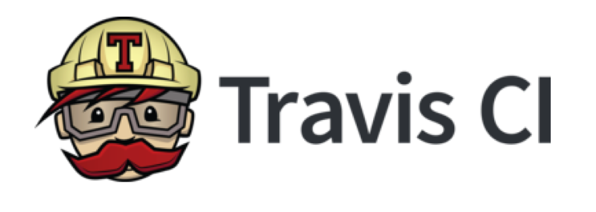
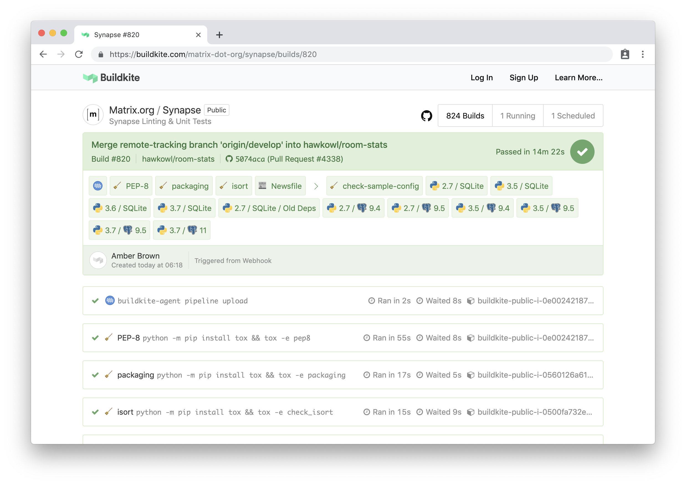

class: title
#  Wrangling enthusiastic hordes
## Maintainers Summit 2019

---

background-image: url("images/beeware_full.png")

???

you may have heard of beeware.

We have a booth at pycon for 4 years now; we were the keynote yesterday

we're even on github.com. Yes, not just github, github.com.
---

background-image: url("images/github-landing.png")

???
Scroll down on the main page, and there we are.

We've been working on developing native applciations in Python for a number of years now, and as part of that we've been running project sprints at a few conferences. PyCons and DjangoCons, mostly.
---
background-image: url("images/bee-map.png")

???

Since 2015 we've, at least count, run 18 in-person development sprints.

we're an extremely welcoming project, and these sprints can attract anywhere from a half a dozen to several dozen of participants.

As thankful as we are that there are so many people interested in working on our project, sometimes, we are literally ---
---

class: title
## *covered in bees*

???

covered in beeeeees

When you have 20 enthusiastic contributors waiting for you to get going and contributing, you start having to develop wrangling practices.

---

class: title
# What's worked for us:
# Shiny rewards

???

We've found that a big part of our popularity at sprints are our shiny contributor coins

---
background-image: url("images/yak-shaver.jpg")

???

in early 2016 we introduced our Yak Shaver coin - contribute in any way to the beeware project, and you get a shiny coin.

This gets us a lot of attention at sprints for those who want to contribute. So much so that we ran out of our first pressing of coins in just a few months.

internal: 100 Feb 2018, first at DCEU 16, gone by pyconau16
200 more, gone by pyconus 18
200 more now.

---

class: title
# One BDFN doesn't scale.

???

unforuntately, when you have one BFDN (belevolent dictator for now), he doesn't scale too well. He can't handle 30 odd folks wanting help trying to setup git on their machines.

So, we fixed this --
---

class: title
# What's worked for us:
# Shiny rewards

???

we introduced a new shiny.

The yak herder coin

---

background-image: url("images/yak-herder.jpg")

???

this coin is achiveved by helping at least 2 others earn their yak shaver coins. This has been monumentally helpful in being able to scale onboarding of new contributors.

---

background-image: url("images/beeware_full.png")

???

unforatunely, Russell isn't the only thing that doesn't scale infinately.

---

???

We can't reasonably accept PRs without running copious amounts of tests. We started using TravisCI for this, and later CircleCI, as with the free tier of Travis we couldn't get the number of paralell builds we needed to keep contributors happy. When there are a dozen folks all submitting their PRs and they have to wait for each other's test suite to pass on a third party service, it's not the best experience.

We have also possibly had an issue where other projets during our sprint were seeing travis latency. I'm not saying we DDoSed travis.. but... :shrug:

---

???

We partically solved this by splitting our two major projects - VOC and Batavia,across two CI providers - travis and circle CI

However, this didn't work for too long, and the maintaince of multiple CI configurations was annoying for our sysadmin (me)

Not only that, but we were stuck on the freeplans. Yes, both these platforms ahve paid for services, but the problem is they are a large per-month cost. We have very bursty use. 30 PRs a day for a few days, then 1 every few days for weeks.

So, we shave this yak by creating our own

---

???

beekeeper is a scalable CI solution that allows a configuration of an AWS EC2 cluster, which you can control the scale of. It also reduces to 0. Combine that with a basic front-end that shows live build results, and you have a basic scalable CI solution.

Now, this solution works for us, but there are more robust providers.
---

???

BuildKite does do the scaling CI thing really well, you pay for your own kit, they have a plug-and-play agent, but they don't yet have public-readable build statuses, which is a must-have feature. You otherwise have to pay a per-month fee per user, and that doesn't scale for open source projects.

---

class: title
# Wrangling enthusastic hordes
# with active delegation!

???

In summary, we've found that by engaging actie delegation, we can reduce the strain on both our principle engineers and our principle infrastructure, which gives us more time to get to the stuff we want to do - work on our app, and enble others to help us.

---

# Thanks!

