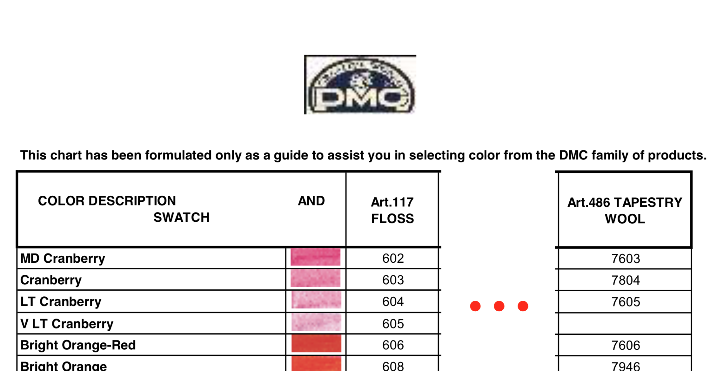
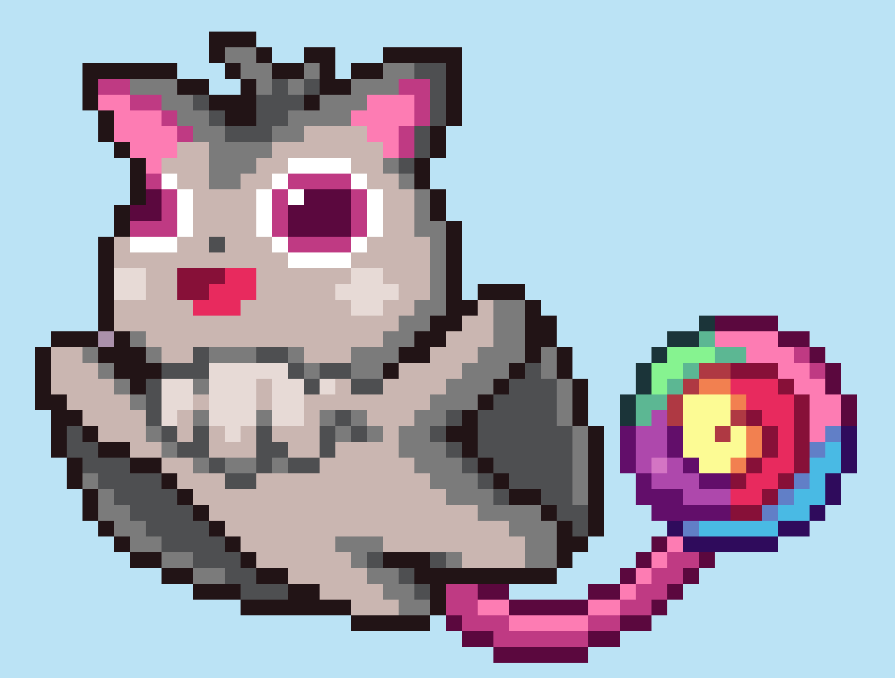
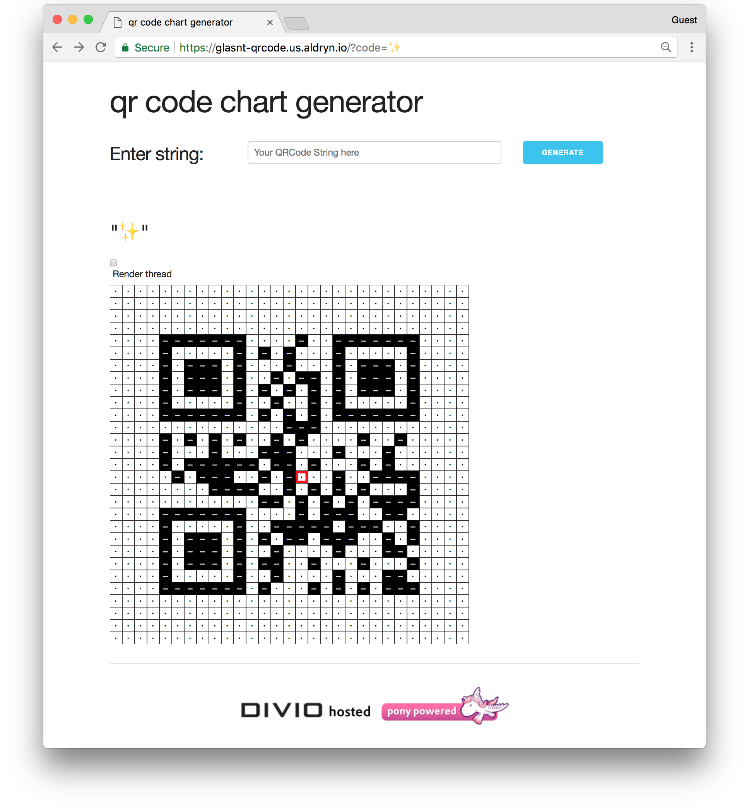

class: title
#   A Right Stitch-up
## Creating embroidery patterns with Pillow

???

FULL SCREEN ME!

⌘ + P

Monitors wrong? ⌘ + TAB
---

class: title
## ~~  A long time ago   at a conference far away  ~~

---

background-image: url("images/osdc2014.png")

???

OSDC 2014

First ever lightning talk, for the "OtherSkills lightning talks"

(5 minute lightning talks, about stuff that's not computers)

There were talks about: bread, choirs, and me, about cross-stitching

---

background-image: url("images/green_display.jpg")

???

I was talking about this cross-stitch I made

---

background-image: url("images/pokebros.gif")

???

the original artwork was created by a pixel artist from Melbourne, Paul Robertson. He's known for his work on things like the Scott Pilgrim vs the World game, Mercenary Kings, and the videoclip for Architecture in Helsinki's Do the Whirlwind.

---
background-image: url("images/pokebros_green.gif")

???

Pixel art, especially those with distinct colour palettes, map really well to cross-stitching

Each pixel maps to one stitch.
---

background-image: url("images/green_design_clip.png")
???

so you can import your design into one of the many closed-source, Windows only programs, and generate a chart for you to reference.

Each cell has a colour and a symbol which maps to a specific thread colour.

---

background-image: url("images/green_working.jpg")

???

you then take that design, that chart, that graph, whatever you wish to call it, and one by one fill in the pattern onto your fabric, or canvas.

---

background-image: url("images/green_lynn.jpg")

???

Years after my original lightning talk, This particular design, well, all three of them, were auctioned off atht the PyLadies fundraising auction in 2017

As shown here by the wonderful Lynn Root.

---

# &nbsp;

???

now, as part of this lightning talk I gave, I mentioned that the program I used to take the source image and turn it into the chart in which to use as a reference for the stitching was made using a closed source, Windows-only program.

And I said:

---
# &nbsp;

*"If you know anything about image manipulation, colour setting, cross stitch charts...*
--

*If there is any [FOSS] software out there please tell me.*

--

*Otherwise I will make my own,*

--
*and present it here next year"*

--

&dash; me
--
, November 2014

???

it was my first ever lightning talk, and I made a promise. Yes, it's a bit late, but you know, a year was just an estimate.

---
#    Problems to solve

???

so, by my own unscripted ramblings 5 years ago, I set myself three problems to solve
--

### "image manipulation"

--

### "colour setting"

--

### "cross stitch charts"

---

class: title
## Image manipulation

???

first step, image manipulation.

If I'm provided an image, I want to be able to go through every pixel in the image, and work out the colour

And we can do that in Python with
---
class: title
# `pillow`
### Python Imaging Library
---
class: title
## `getpixel((x,y))`
---

### 3x3.png
???

If I have a 3x3 image, with 9 pixels, all different colours, we can use this as a solid testing platform for testing getpixel

---

### 3x3.png

???

the co-ordinate system in Pillow starts in the top left, and works it's way across and down
---
.righthead[PIL.getpixel()]
.right-image[]
 
<pre><code class="python">>>> from PIL import Image</code></pre>
--
<pre><code class="python">>>> im = Image.open("3x3.png")</code></pre>
--
<pre><code class="python">>>> im.getpixel((0,2))</code></pre>
--
<pre><code class="python">(255, 0, 0, 255)</code></pre>
--
<pre><code class="bash"># R .white[.] G.white[.] B .white[.] A</code></pre>
--
<pre><code class="bash"> # (0,2) == red .white[ . . . . . . ] --></code></pre>

???

So we can address a single pixel in an image.

From here, we can loop through, and get the RGB values for every pixel in the image.

This will be useful later on.

But, onto the next problem
---
class: title
# Colour setting

???

colour setting. Yes, colour with a "U"

But first.
---
class: title
## Let's learn about floss
---
class: middle, center, image

???

Dollfus-Mieg et Compagnie

Is an Alsatian textile company, founded in 1746

Not to be confused with the hiphop group.

When I talk about DMC, I mean
---
background-image: url("images/dmc-rack.jpg")
???

this stuff.

If you're Australian, you'll find a setup like this in your local Spotlight or Lincraft. In America, think Michaels, or Hobby Lobby
---
background-image: url("images/floss_macro.jpg")

???

this is the DMC Floss, floss like the stuff you use to get food out from between yur teeth.

DMC have hundreds of different colours, all referenced by a code, in this multitrand medium.

Most pre-made cross-stitch charts and software will refer to DMC as the floss only

However, they sell more than Floss
---
background-image: url("images/wool_macro.jpg")
???

they also sell wool. DMC Tapestry Wool is a thicker medium, and while I've been using the word "cross-stitch" so far, technically you can't really use it for Cross-stitch.

The physical medium of these thread is interesting.
---

class: title
# ⊠⊠⊠
### Cross Stitch
# ⧄⧄⧄
### Half Stitch

???

if you have a very tight canvas; in cross-stitch you'll have say an Aida 14ct Cloth, to fill a square you would use, say, three ply of the floss in a cross-pattern. Complete this around your canvas, and you fill in all the gaps and create a complete image.

With the wool, however, it's too thick to use 14ct. I personally work in 10ct canvas, and with this medium I can only use half-sttich. A single half-stitch fills the square, so it works at scale.

---

background-image: url("images/wool_macro.jpg")

???

but this is where the fun comes in.

You see, floss and wool are not cross-compatible. They don't share codes, and they don't share palettes.

And, as I said, a lot of charts only refer to the floss. So, we need to convert from floss to wool.

The colours you're seeing now are part of the set called 'Cranberry'
---

???

while the names aren't strictly official, the codes are important.

There is a cross-compatibility chart, which is somewhat official as it has a terribly pjeg artefacted DMC logo, but it states that it's supposed to be used as a guide only. However, it does give us an aproximation of how to compare skeins of different medium (a skein being one 'spool')

The 'floss' from before has 600-series numbers for cranberry. And with this DF, you can see that the tapestry wool equivelent has a 7600 series

But they don't exactly match.
---
## The Cranberries - Analyze
.right-image[]
<pre><code style="font-size: 36px; line-height: 1.5;">

V DK Cranberry&nbsp;&nbsp;600&nbsp;&nbsp;&nbsp;&nbsp;7600
DK Cranberry&nbsp; &nbsp;&nbsp;601
MD Cranberry&nbsp;&nbsp;&nbsp;&nbsp;602&nbsp;&nbsp;&nbsp;&nbsp;7603
Cranberry&nbsp;&nbsp;&nbsp;&nbsp;&nbsp;&nbsp;&nbsp;603&nbsp;&nbsp;&nbsp;&nbsp;7604
LT Cranberry&nbsp;&nbsp;&nbsp;&nbsp;604&nbsp;&nbsp;&nbsp;&nbsp;7605
V LT Cranberry&nbsp;&nbsp;605
</code></pre>

???

if we go through the chart, we can see that there are many more floss threads available than wool.

For the Cranberry series, there are 6 available floss threads, but only four wool. And in this picture, my local craft-store was even completely out of one of the wool skeins.

This out of stock issue will come up later.

As a matter of numbers, there's on average about a 3 to 2 ratio of floss to wool mappings.

---

##     Floss → Wool ✓*
???

so, we can, mostly, convert a floss thread to it's wool equiv. That's great.

But we're working with computers. Pillow can get us RGB values
--

## DMC → RGB ??

???

so how can we

---
class: title
# No official mapping exists
### 'proprietary information'
.footnotes[[thread-bare.com](https://www.thread-bare.com/2017/09/20/creating-cross-stitch-charts-with-consistent-colors)]
???

Officially there's no official mapping.

It's 'proprietary information', colours can drift over time

Indeed, it's recommended that you buy your threads from the same dyelot to ensure they are from the same manufactured batch.

This mades sense. This is a company trade secret, from the 1800's.

It could allow competitors to "steal" and cheaply reproduce the colours.
---
class: title
## *cough*
---
class: title
## 454 RGB Codes for DMC floss
## 293 RGB Codes for DMC wool

???

so there are 454 codes for floss and 293 for wool.

The cache I found is a very rough approximation. I can't find much about how it was produced, but it's a good rough guide for our purposes.

With this we can convert from an RGB colour to an approximate thread.

So that's the colour setting down. But we have another problem
---
class: title
## Reducing picture to only available colours

???

there are more than 450, or even 300, colours in RGB. We only have a certain number of colours we can physically use, save for dying our own, but that's a problem for another medium.

Thankfully, we can solve this problem with a little bit of python
---
class: title
## `pillow`
???

pillow, again!
---
class: title
## `putpalette(data)`

???

there's a tiny function in Pillow called `putpalette()`
---
.righthead[PIL.putpalette()]
 
<pre><code class="python">>>> im.convert('P'</code></pre>
<pre><code class="python">&nbsp; &nbsp; &nbsp; , palette=Image.ADAPTIVE</code></pre>
<pre><code class="python">&nbsp; &nbsp; &nbsp; , colors=16)</code></pre>
---
# TODO

palette of reduced colours
palette of *my* colours
palette of *my* reduced colours

https://github.com/python-pillow/Pillow/commit/0b63579f39b0c908239957683a8a70d24e3b07f1

Quantize? Palette?
---
class: title
## Problem: 256
???

pillow palette limited to 256

TODO - this is superseeded by the reduction of the tapestry palette to 104
(Mention later)
(Also also, ensure that ih has both new and old palettes **documented**)
---
class: middle, center, image

## CIEDE2000
[wikipedia](https://en.wikipedia.org/wiki/Color_difference)

???

Luckily there's math for that!

latest revision of the forumula from International Commission on Illumination (CIE)

Perceptual uniformity

---
.righthead[deltaE_ciede2000]
 
<pre><code class="bash">$ pip install numpy scikit-image</code></pre>
<pre><code class="bash">$ python</code></pre>
<pre><code class="python">>>> from skimage.color &nbsp; &nbsp; &nbsp;import deltaE_ciede2000</code></pre>

???

praise scikit
---
<table class="difftable"><tr><th>deltaE ciede2000</th><th>Colour A</th><th>Hex A</th><th>Swatch A</th><th>Swatch B</th><th>Hex B</th><th>Colour B</th></tr>
<tr><td>0.5026168399946604</td><td>Beige Gray Dark</td><td>#A49878</td><td style='background-color: #A49878'>&nbsp; &nbsp; &nbsp; &nbsp;</td><td style='background-color: #C4DECC'>&nbsp; &nbsp; &nbsp; &nbsp; </td><td>#C4DECC</td><td>Blue Green Vy Lt</td></tr>
<tr><td>0.5026168399946604</td><td>Blue Green Vy Lt</td><td>#C4DECC</td><td style='background-color: #C4DECC'>&nbsp; &nbsp; &nbsp; &nbsp;</td><td style='background-color: #A49878'>&nbsp; &nbsp; &nbsp; &nbsp; </td><td>#A49878</td><td>Beige Gray Dark</td></tr>
<tr><td>0.502616850208514</td><td>Cranberry</td><td>#FFA4BE</td><td style='background-color: #FFA4BE'>&nbsp; &nbsp; &nbsp; &nbsp;</td><td style='background-color: #946083'>&nbsp; &nbsp; &nbsp; &nbsp; </td><td>#946083</td><td>Grape Medium</td></tr>
<tr><td>0.502616850208514</td><td>Grape Medium</td><td>#946083</td><td style='background-color: #946083'>&nbsp; &nbsp; &nbsp; &nbsp;</td><td style='background-color: #FFA4BE'>&nbsp; &nbsp; &nbsp; &nbsp; </td><td>#FFA4BE</td><td>Cranberry</td></tr>
<tr><td>0.5026269549802299</td><td>Lavender Blue Dark</td><td>#5C7294</td><td style='background-color: #5C7294'>&nbsp; &nbsp; &nbsp; &nbsp;</td><td style='background-color: #D8BC9A'>&nbsp; &nbsp; &nbsp; &nbsp; </td><td>#D8BC9A</td><td>Yellow Beige Md</td></tr>
<tr><td>0.5026269549802299</td><td>Yellow Beige Md</td><td>#D8BC9A</td><td style='background-color: #D8BC9A'>&nbsp; &nbsp; &nbsp; &nbsp;</td><td style='background-color: #5C7294'>&nbsp; &nbsp; &nbsp; &nbsp; </td><td>#5C7294</td><td>Lavender Blue Dark</td></tr>
<tr><td>0.502628951120124</td><td>Hazelnut Brown</td><td>#B78B61</td><td style='background-color: #B78B61'>&nbsp; &nbsp; &nbsp; &nbsp;</td><td style='background-color: #59C7B4'>&nbsp; &nbsp; &nbsp; &nbsp; </td><td>#59C7B4</td><td>Sea Green Med</td></tr>
<tr><td>0.502628951120124</td><td>Sea Green Med</td><td>#59C7B4</td><td style='background-color: #59C7B4'>&nbsp; &nbsp; &nbsp; &nbsp;</td><td style='background-color: #B78B61'>&nbsp; &nbsp; &nbsp; &nbsp; </td><td>#B78B61</td><td>Hazelnut Brown</td></tr>
<tr><td>0.5026301870741252</td><td>Dusty Rose Med Vy Lt</td><td>#FFBDBD</td><td style='background-color: #FFBDBD'>&nbsp; &nbsp; &nbsp; &nbsp;</td><td style='background-color: #AA8F56'>&nbsp; &nbsp; &nbsp; &nbsp; </td><td>#AA8F56</td><td>Golden Olive Md</td></tr>
<tr><td>0.5026301870741252</td><td>Golden Olive Md</td><td>#AA8F56</td><td style='background-color: #AA8F56'>&nbsp; &nbsp; &nbsp; &nbsp;</td><td style='background-color: #FFBDBD'>&nbsp; &nbsp; &nbsp; &nbsp; </td><td>#FFBDBD</td><td>Dusty Rose Med Vy Lt</td></tr>
<tr><td>0.5026302897414802</td><td>Hunter Green Vy Dk</td><td>#1B5300</td><td style='background-color: #1B5300'>&nbsp; &nbsp; &nbsp; &nbsp;</td><td style='background-color: #B71F33'>&nbsp; &nbsp; &nbsp; &nbsp; </td><td>#B71F33</td><td>Red Medium</td></tr>
<tr><td>0.5026302897414802</td><td>Red Medium</td><td>#B71F33</td><td style='background-color: #B71F33'>&nbsp; &nbsp; &nbsp; &nbsp;</td><td style='background-color: #1B5300'>&nbsp; &nbsp; &nbsp; &nbsp; </td><td>#1B5300</td><td>Hunter Green Vy Dk</td></tr>
<tr><td>0.5026358009581365</td><td>Plum Light</td><td>#C54989</td><td style='background-color: #C54989'>&nbsp; &nbsp; &nbsp; &nbsp;</td><td style='background-color: #E2A099'>&nbsp; &nbsp; &nbsp; &nbsp; </td><td>#E2A099</td><td>Shell Pink Med Light</td></tr>
<tr><td>0.5026358009581365</td><td>Shell Pink Med Light</td><td>#E2A099</td><td style='background-color: #E2A099'>&nbsp; &nbsp; &nbsp; &nbsp;</td><td style='background-color: #C54989'>&nbsp; &nbsp; &nbsp; &nbsp; </td><td>#C54989</td><td>Plum Light</td></tr>
<tr><td>0.5026396562917449</td><td>Carnation Dark</td><td>#FF5773</td><td style='background-color: #FF5773'>&nbsp; &nbsp; &nbsp; &nbsp;</td><td style='background-color: #D0A53E'>&nbsp; &nbsp; &nbsp; &nbsp; </td><td>#D0A53E</td><td>Old Gold Medium</td></tr>
<tr><td>0.5026396562917449</td><td>Old Gold Medium</td><td>#D0A53E</td><td style='background-color: #D0A53E'>&nbsp; &nbsp; &nbsp; &nbsp;</td><td style='background-color: #FF5773'>&nbsp; &nbsp; &nbsp; &nbsp; </td><td>#FF5773</td><td>Carnation Dark</td></tr>
<tr><td>0.5026467750409492</td><td>Golden Brown Dk</td><td>#914F12</td><td style='background-color: #914F12'>&nbsp; &nbsp; &nbsp; &nbsp;</td><td style='background-color: #889268'>&nbsp; &nbsp; &nbsp; &nbsp; </td><td>#889268</td><td>Green Gray Md</td></tr>
<tr><td>0.5026467750409492</td><td>Green Gray Md</td><td>#889268</td><td style='background-color: #889268'>&nbsp; &nbsp; &nbsp; &nbsp;</td><td style='background-color: #914F12'>&nbsp; &nbsp; &nbsp; &nbsp; </td><td>#914F12</td><td>Golden Brown Dk</td></tr>
</table>
</section>
---
<table class="difftable"><tr><th>deltaE ciede2000</th><th>Colour A</th><th>Hex A</th><th>Swatch A</th><th>Swatch B</th><th>Hex B</th><th>Colour B</th></tr>
<tr><td>0.0069134420593650195</td><td>Mocha Brn Ult Vy Lt</td><td>#FAF6F0</td><td style='background-color: #FAF6F0'>&nbsp; &nbsp; &nbsp; &nbsp;</td><td style='background-color: #F9F7F1'>&nbsp; &nbsp; &nbsp; &nbsp; </td><td>#F9F7F1</td><td>Winter White</td></tr>
<tr><td>0.0069134420593650195</td><td>Winter White</td><td>#F9F7F1</td><td style='background-color: #F9F7F1'>&nbsp; &nbsp; &nbsp; &nbsp;</td><td style='background-color: #FAF6F0'>&nbsp; &nbsp; &nbsp; &nbsp; </td><td>#FAF6F0</td><td>Mocha Brn Ult Vy Lt</td></tr>
<tr><td>0.0072345914037694</td><td>Olive Green Dk</td><td>#938B37</td><td style='background-color: #938B37'>&nbsp; &nbsp; &nbsp; &nbsp;</td><td style='background-color: #948C36'>&nbsp; &nbsp; &nbsp; &nbsp; </td><td>#948C36</td><td>Olive Green</td></tr>
<tr><td>0.0072345914037694</td><td>Olive Green</td><td>#948C36</td><td style='background-color: #948C36'>&nbsp; &nbsp; &nbsp; &nbsp;</td><td style='background-color: #938B37'>&nbsp; &nbsp; &nbsp; &nbsp; </td><td>#938B37</td><td>Olive Green Dk</td></tr>
<tr><td>0.007566102478952069</td><td>Baby Pink</td><td>#FFDFD9</td><td style='background-color: #FFDFD9'>&nbsp; &nbsp; &nbsp; &nbsp;</td><td style='background-color: #FFDFD7'>&nbsp; &nbsp; &nbsp; &nbsp; </td><td>#FFDFD7</td><td>Shell Pink Ult Vy Lt</td></tr>
<tr><td>0.007566102478952069</td><td>Shell Pink Ult Vy Lt</td><td>#FFDFD7</td><td style='background-color: #FFDFD7'>&nbsp; &nbsp; &nbsp; &nbsp;</td><td style='background-color: #FFDFD9'>&nbsp; &nbsp; &nbsp; &nbsp; </td><td>#FFDFD9</td><td>Baby Pink</td></tr>
<tr><td>0.00918721318108803</td><td>Apricot Very Light</td><td>#FFDED5</td><td style='background-color: #FFDED5'>&nbsp; &nbsp; &nbsp; &nbsp;</td><td style='background-color: #FFDFD7'>&nbsp; &nbsp; &nbsp; &nbsp; </td><td>#FFDFD7</td><td>Shell Pink Ult Vy Lt</td></tr>
<tr><td>0.00918721318108803</td><td>Shell Pink Ult Vy Lt</td><td>#FFDFD7</td><td style='background-color: #FFDFD7'>&nbsp; &nbsp; &nbsp; &nbsp;</td><td style='background-color: #FFDED5'>&nbsp; &nbsp; &nbsp; &nbsp; </td><td>#FFDED5</td><td>Apricot Very Light</td></tr>
<tr><td>0.00962148915492655</td><td>Cream</td><td>#FFFBEF</td><td style='background-color: #FFFBEF'>&nbsp; &nbsp; &nbsp; &nbsp;</td><td style='background-color: #FCFCEE'>&nbsp; &nbsp; &nbsp; &nbsp; </td><td>#FCFCEE</td><td>Off White</td></tr>
<tr><td>0.00962148915492655</td><td>Off White</td><td>#FCFCEE</td><td style='background-color: #FCFCEE'>&nbsp; &nbsp; &nbsp; &nbsp;</td><td style='background-color: #FFFBEF'>&nbsp; &nbsp; &nbsp; &nbsp; </td><td>#FFFBEF</td><td>Cream</td></tr>
<tr><td>0.010399465066750093</td><td>Dusty Rose</td><td>#E8879B</td><td style='background-color: #E8879B'>&nbsp; &nbsp; &nbsp; &nbsp;</td><td style='background-color: #EA8699'>&nbsp; &nbsp; &nbsp; &nbsp; </td><td>#EA8699</td><td>Raspberry Light</td></tr>
<tr><td>0.010399465066750093</td><td>Raspberry Light</td><td>#EA8699</td><td style='background-color: #EA8699'>&nbsp; &nbsp; &nbsp; &nbsp;</td><td style='background-color: #E8879B'>&nbsp; &nbsp; &nbsp; &nbsp; </td><td>#E8879B</td><td>Dusty Rose</td></tr>
<tr><td>0.013177163652826163</td><td>Beaver Gray Lt</td><td>#BCB4AC</td><td style='background-color: #BCB4AC'>&nbsp; &nbsp; &nbsp; &nbsp;</td><td style='background-color: #C0B3AE'>&nbsp; &nbsp; &nbsp; &nbsp; </td><td>#C0B3AE</td><td>Shell Gray Med</td></tr>
<tr><td>0.013177163652826163</td><td>Shell Gray Med</td><td>#C0B3AE</td><td style='background-color: #C0B3AE'>&nbsp; &nbsp; &nbsp; &nbsp;</td><td style='background-color: #BCB4AC'>&nbsp; &nbsp; &nbsp; &nbsp; </td><td>#BCB4AC</td><td>Beaver Gray Lt</td></tr>
<tr><td>0.014038710824153958</td><td>Beige Gray Med</td><td>#DDD8CB</td><td style='background-color: #DDD8CB'>&nbsp; &nbsp; &nbsp; &nbsp;</td><td style='background-color: #E3D8CC'>&nbsp; &nbsp; &nbsp; &nbsp; </td><td>#E3D8CC</td><td>Mocha Brown Vy Lt</td></tr>
<tr><td>0.014038710824153958</td><td>Mocha Brown Vy Lt</td><td>#E3D8CC</td><td style='background-color: #E3D8CC'>&nbsp; &nbsp; &nbsp; &nbsp;</td><td style='background-color: #DDD8CB'>&nbsp; &nbsp; &nbsp; &nbsp; </td><td>#DDD8CB</td><td>Beige Gray Med</td></tr>
<tr><td>0.014944343254283848</td><td>Carnation Very Light</td><td>#FFB2BB</td><td style='background-color: #FFB2BB'>&nbsp; &nbsp; &nbsp; &nbsp;</td><td style='background-color: #FCB0B9'>&nbsp; &nbsp; &nbsp; &nbsp; </td><td>#FCB0B9</td><td>Pink Medium</td></tr>
<tr><td>0.014944343254283848</td><td>Pink Medium</td><td>#FCB0B9</td><td style='background-color: #FCB0B9'>&nbsp; &nbsp; &nbsp; &nbsp;</td><td style='background-color: #FFB2BB'>&nbsp; &nbsp; &nbsp; &nbsp; </td><td>#FFB2BB</td><td>Carnation Very Light</td></tr>
</table>
---
<table class="difftable"><tr><th>deltaE ciede2000</th><th>Colour A</th><th>Hex A</th><th>Swatch A</th><th>Swatch B</th><th>Hex B</th><th>Colour B</th></tr>
<tr><td>0.04989602021800601</td><td>Cranberry Dark</td><td>#D1286A</td><td style='background-color: #D1286A'>&nbsp; &nbsp; &nbsp; &nbsp;</td><td style='background-color: #CD2F63'>&nbsp; &nbsp; &nbsp; &nbsp; </td><td>#CD2F63</td><td>Cranberry Very Dark</td></tr>
<tr><td>0.04989602021800601</td><td>Cranberry Very Dark</td><td>#CD2F63</td><td style='background-color: #CD2F63'>&nbsp; &nbsp; &nbsp; &nbsp;</td><td style='background-color: #D1286A'>&nbsp; &nbsp; &nbsp; &nbsp; </td><td>#D1286A</td><td>Cranberry Dark</td></tr>
<tr><td>0.06759176350122559</td><td>Cranberry Light</td><td>#FFB0BE</td><td style='background-color: #FFB0BE'>&nbsp; &nbsp; &nbsp; &nbsp;</td><td style='background-color: #FFA4BE'>&nbsp; &nbsp; &nbsp; &nbsp; </td><td>#FFA4BE</td><td>Cranberry</td></tr>
<tr><td>0.06759176350122559</td><td>Cranberry</td><td>#FFA4BE</td><td style='background-color: #FFA4BE'>&nbsp; &nbsp; &nbsp; &nbsp;</td><td style='background-color: #FFB0BE'>&nbsp; &nbsp; &nbsp; &nbsp; </td><td>#FFB0BE</td><td>Cranberry Light</td></tr>
<tr><td>0.1043483831009906</td><td>Cranberry Light</td><td>#FFB0BE</td><td style='background-color: #FFB0BE'>&nbsp; &nbsp; &nbsp; &nbsp;</td><td style='background-color: #FFC0CD'>&nbsp; &nbsp; &nbsp; &nbsp; </td><td>#FFC0CD</td><td>Cranberry Very Light</td></tr>
<tr><td>0.1043483831009906</td><td>Cranberry Very Light</td><td>#FFC0CD</td><td style='background-color: #FFC0CD'>&nbsp; &nbsp; &nbsp; &nbsp;</td><td style='background-color: #FFB0BE'>&nbsp; &nbsp; &nbsp; &nbsp; </td><td>#FFB0BE</td><td>Cranberry Light</td></tr>
<tr><td>0.16450628922209645</td><td>Cranberry Medium</td><td>#E24874</td><td style='background-color: #E24874'>&nbsp; &nbsp; &nbsp; &nbsp;</td><td style='background-color: #CD2F63'>&nbsp; &nbsp; &nbsp; &nbsp; </td><td>#CD2F63</td><td>Cranberry Very Dark</td></tr>
<tr><td>0.16450628922209645</td><td>Cranberry Very Dark</td><td>#CD2F63</td><td style='background-color: #CD2F63'>&nbsp; &nbsp; &nbsp; &nbsp;</td><td style='background-color: #E24874'>&nbsp; &nbsp; &nbsp; &nbsp; </td><td>#E24874</td><td>Cranberry Medium</td></tr>
<tr><td>0.16521369601575045</td><td>Cranberry Very Light</td><td>#FFC0CD</td><td style='background-color: #FFC0CD'>&nbsp; &nbsp; &nbsp; &nbsp;</td><td style='background-color: #FFA4BE'>&nbsp; &nbsp; &nbsp; &nbsp; </td><td>#FFA4BE</td><td>Cranberry</td></tr>
<tr><td>0.16521369601575045</td><td>Cranberry</td><td>#FFA4BE</td><td style='background-color: #FFA4BE'>&nbsp; &nbsp; &nbsp; &nbsp;</td><td style='background-color: #FFC0CD'>&nbsp; &nbsp; &nbsp; &nbsp; </td><td>#FFC0CD</td><td>Cranberry Very Light</td></tr>
<tr><td>0.19236698179290798</td><td>Cranberry Dark</td><td>#D1286A</td><td style='background-color: #D1286A'>&nbsp; &nbsp; &nbsp; &nbsp;</td><td style='background-color: #E24874'>&nbsp; &nbsp; &nbsp; &nbsp; </td><td>#E24874</td><td>Cranberry Medium</td></tr>
<tr><td>0.19236698179290798</td><td>Cranberry Medium</td><td>#E24874</td><td style='background-color: #E24874'>&nbsp; &nbsp; &nbsp; &nbsp;</td><td style='background-color: #D1286A'>&nbsp; &nbsp; &nbsp; &nbsp; </td><td>#D1286A</td><td>Cranberry Dark</td></tr>
<tr><td>0.5920647937529571</td><td>Cranberry Medium</td><td>#E24874</td><td style='background-color: #E24874'>&nbsp; &nbsp; &nbsp; &nbsp;</td><td style='background-color: #FFA4BE'>&nbsp; &nbsp; &nbsp; &nbsp; </td><td>#FFA4BE</td><td>Cranberry</td></tr>
<tr><td>0.5920647937529571</td><td>Cranberry</td><td>#FFA4BE</td><td style='background-color: #FFA4BE'>&nbsp; &nbsp; &nbsp; &nbsp;</td><td style='background-color: #E24874'>&nbsp; &nbsp; &nbsp; &nbsp; </td><td>#E24874</td><td>Cranberry Medium</td></tr>
<tr><td>0.6516599170662192</td><td>Cranberry Light</td><td>#FFB0BE</td><td style='background-color: #FFB0BE'>&nbsp; &nbsp; &nbsp; &nbsp;</td><td style='background-color: #E24874'>&nbsp; &nbsp; &nbsp; &nbsp; </td><td>#E24874</td><td>Cranberry Medium</td></tr>
<tr><td>0.6516599170662192</td><td>Cranberry Medium</td><td>#E24874</td><td style='background-color: #E24874'>&nbsp; &nbsp; &nbsp; &nbsp;</td><td style='background-color: #FFB0BE'>&nbsp; &nbsp; &nbsp; &nbsp; </td><td>#FFB0BE</td><td>Cranberry Light</td></tr>
<tr><td>0.7542495972356424</td><td>Cranberry Very Dark</td><td>#CD2F63</td><td style='background-color: #CD2F63'>&nbsp; &nbsp; &nbsp; &nbsp;</td><td style='background-color: #FFA4BE'>&nbsp; &nbsp; &nbsp; &nbsp; </td><td>#FFA4BE</td><td>Cranberry</td></tr>
<tr><td>0.7542495972356424</td><td>Cranberry</td><td>#FFA4BE</td><td style='background-color: #FFA4BE'>&nbsp; &nbsp; &nbsp; &nbsp;</td><td style='background-color: #CD2F63'>&nbsp; &nbsp; &nbsp; &nbsp; </td><td>#CD2F63</td><td>Cranberry Very Dark</td></tr>
</table>

---
class: title
## Cross-stitch charts
---
class: title
## ``
---
class: title
## `box-shadow: inset`
---
class: title
## Result
---

class: title
## github.com/glasnt/626
---
class: image-main

---

background-image: url("images/green_chart_new_clip.png")
---
class: title
## Here's one I prepared earlier
---
class: top, image

[tumblr](http://probertson.tumblr.com/post/161081154009/australian-pokedex-30-57)
---
<pre><code style="font-size: 36px; line-height: 1.5;">
$ ./ih sweetsail.png -s2
</pre></code>
---
background-image: url("images/sweet_chart.png")
---
<pre><code style="font-size: 36px; line-height: 1.5;">
$ ./ih sweetsail.png -s2 -t
</code></pre>
---
background-image: url("images/sweet_mock.png")
---
background-image: url("images/sweet_progress.jpg")
---
background-image: url("images/sweet_finished.jpg")
---

class: title
## Practical Applications

???

if time permits

Stringly typed

String a string to string a string
---
<pre><code style="font-size: 36px; line-height: 1.5;">
$ pip install qrcode
$ qrcode "YourWifiPassword" > wifi.png
$ ./ih wifi.png -s10 -t
</code></pre>
---
class: image-main

---
class: image-main

---
class: middle, center, image

---
class: title
## glasnt.com/qr
---
class: image-main

---
class: title
## github.com/glasnt/626
## glasnt.com/qr
