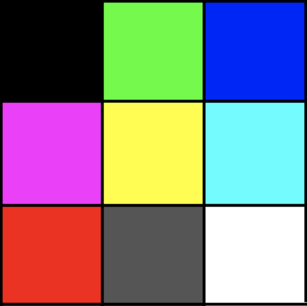
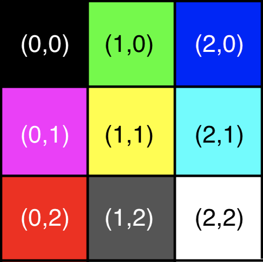
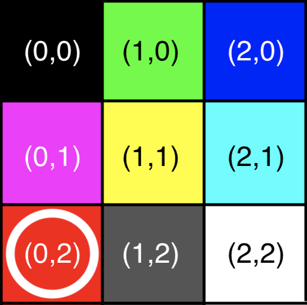
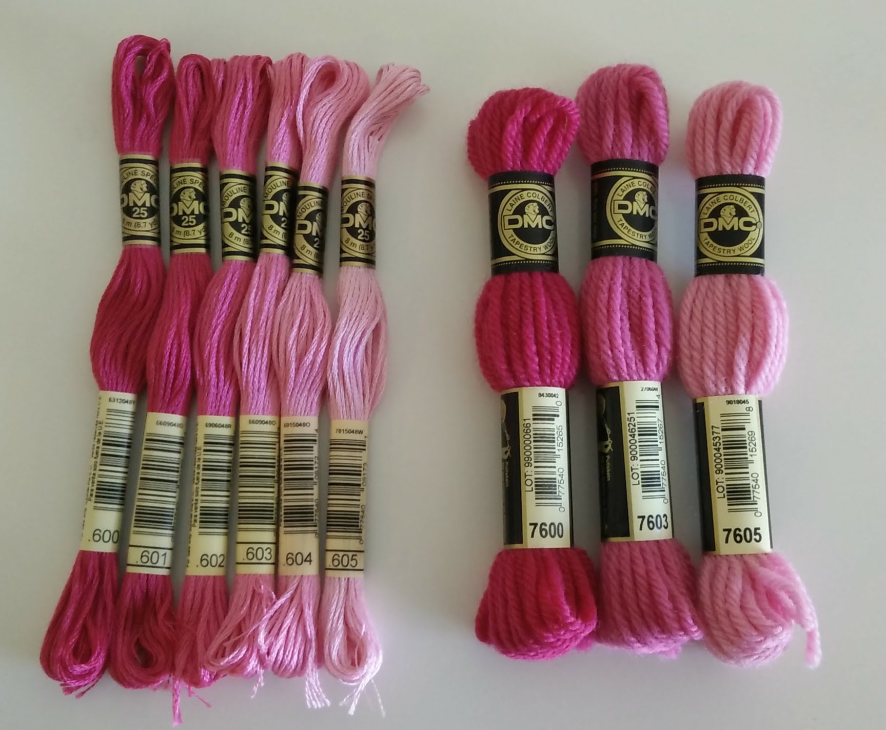
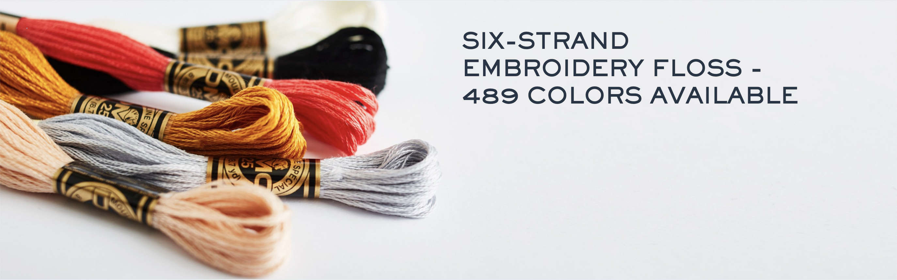
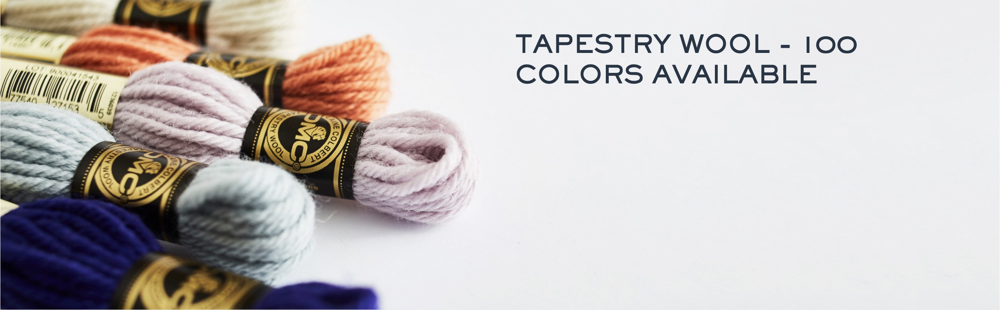
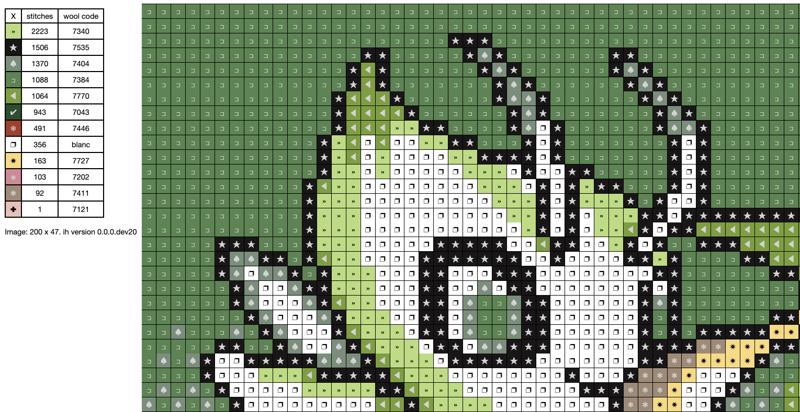
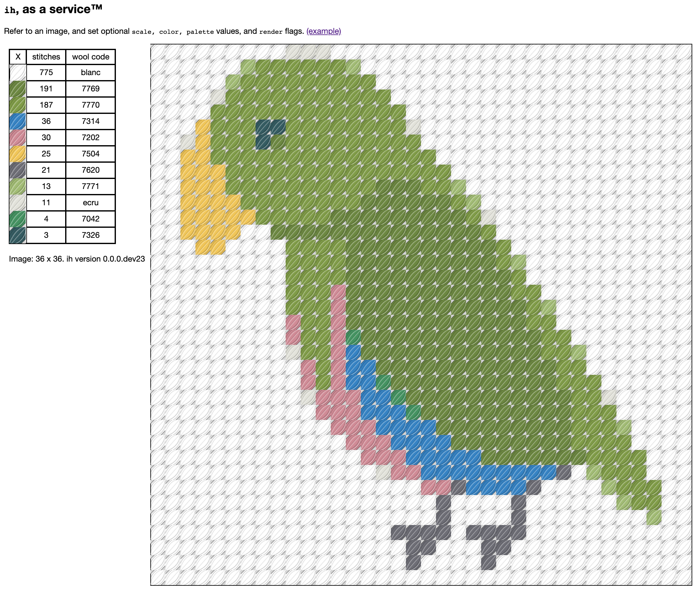
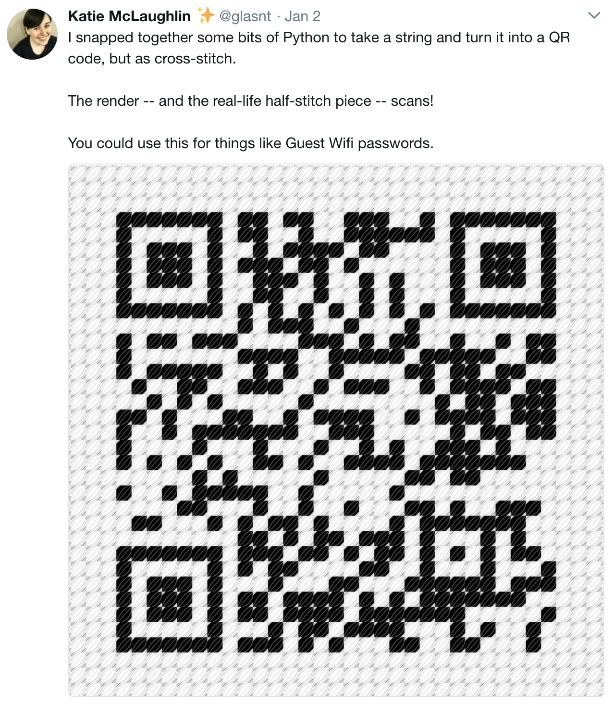

class: title
#   A Right Stitch-up
## Creating embroidery patterns with Pillow

???

FULL SCREEN ME!

⌘ + P

Monitors wrong? ⌘ + TAB
---

class: title
## ~~  A long time ago   at a conference far away  ~~

---

background-image: url("images/osdc2014.png")

???

OSDC 2014

First ever lightning talk, for the "OtherSkills lightning talks"

(5 minute lightning talks, about stuff that's not computers)

There were talks about: bread, choirs, and me, about cross-stitching

---

background-image: url("images/green_display.jpg")

???

I was talking about this cross-stitch I made

---

background-image: url("images/pokebros.gif")

.footnotes[[Water](https://www.instagram.com/p/BjDp1eMFY3O/), [Grass](https://www.instagram.com/p/BjDpt4cFhh6/), [Fire](https://www.instagram.com/p/BjDpyXOFW1m/) Bros, Paul Robertson, 2011]

???

the original artwork was created by a pixel artist from Melbourne, Paul Robertson. He's known for his work on things like the Scott Pilgrim vs the World game, Mercenary Kings, and the videoclip for Architecture in Helsinki's Do the Whirlwind.

---
background-image: url("images/pokebros_green.gif")
.footnotes[[Grass Bros](https://www.instagram.com/p/BjDpt4cFhh6/), Paul Robertson, 2011]

???

Pixel art, especially those with distinct colour palettes, map really well to cross-stitching

Each pixel maps to one stitch.
---

background-image: url("images/green_design_clip.png")
???

so you can import your design into one of the many closed-source, Windows only programs, and generate a chart for you to reference.

Each cell has a colour and a symbol which maps to a specific thread colour.

---

background-image: url("images/green_working.jpg")

???

you then take that design, that chart, that graph, whatever you wish to call it, and one by one fill in the pattern onto your fabric, or canvas.

---

background-image: url("images/green_lynn.jpg")

.white[.footnotes[[Mike Pirnat](https://www.flickr.com/photos/mikepirnat/34782968461/in/photostream/)]]

???

Years after my original lightning talk, This particular design, well, all three of them, were auctioned off atht the PyLadies fundraising auction in 2017

As shown here by the wonderful Lynn Root.

---

# &nbsp;

???

now, as part of this lightning talk I gave, I mentioned that the program I used to take the source image and turn it into the chart in which to use as a reference for the stitching was made using a closed source, Windows-only program.

And I said:

---
# &nbsp;

*"If you know anything about image manipulation, colour setting, cross stitch charts...*
--

*If there is any [FOSS] software out there please tell me.*

--

*Otherwise I will make my own,*

--
*and present it here next year"*

--

&dash; me
--
, November 2014

???

it was my first ever lightning talk, and I made a promise. Yes, it's a bit late, but you know, a year was just an estimate.

---
#    Problems to solve

???

so, by my own unscripted ramblings 5 years ago, I set myself three problems to solve
--

### "image manipulation"

--

### "colour setting"

--

### "cross stitch charts"

---

class: title
## Problem 1: Image manipulation

???

first step, image manipulation.

If I'm provided an image, I want to be able to go through every pixel in the image, and work out the colour

And we can do that in Python with
---
class: title
# `pillow`
### Python Imaging Library

???

Pillow is the go-to package for image manipulation in Python.

You can load images, resize them, rotate them, and then save the result.

But you can also interrogate an image...

---
class: title
## `Image.getpixel((x,y))`

???

which does pretty much what it says on the tin
---

### 3x3.png
???

If I have a 3x3 image, with 9 pixels, all different colours, we can use this as a solid testing platform for testing getpixel

---

### 3x3.png

???

the co-ordinate system in Pillow starts in the top left, and works it's way across and down
---
.righthead[Image.getpixel()]
.right-image[ .center[.b[3x3.png]]]
 
<pre><code class="bash">$ pip install pillow</code></pre>
--
<pre><code class="bash">$ python</code></pre>
--
<pre><code class="python">>>> from PIL import Image</code></pre>
--
<pre><code class="python">>>> im = Image.open("3x3.png")</code></pre>
--
<pre><code class="python">>>> im.getpixel((0,2))</code></pre>
--
<pre><code class="python">(255, 0, 0)</code></pre>
--
<pre><code class="bash"># R .white[.] G.white[.] B</code></pre>
---
.righthead[Image.getpixel()]
.right-image[ .center[.b[3x3.png]]]
 
<pre><code class="bash">$ pip install pillow</code></pre>
<pre><code class="bash">$ python</code></pre>
<pre><code class="python">>>> from PIL import Image</code></pre>
<pre><code class="python">>>> im = Image.open("3x3.png")</code></pre>
<pre><code class="python">>>> im.getpixel((0,2))</code></pre>
<pre><code class="python">(255, 0, 0)</code></pre>
<pre><code class="bash"># R .white[.] G.white[.] B</code></pre>

???

So we can address a single pixel in an image.

From here, we can loop through, and get the RGB values for every pixel in the image.

This will be useful later on.

But, onto the next problem
---
class: title
# Problem 2: Colour setting

???

colour setting. Yes, colour with a "U"

But first.
---
class: title
## Let's learn about floss
---
class: title
# Dollfus-Mieg et Compagnie
### (DMC)

???

Dollfus-Mieg et Compagnie

Is an Alsatian textile company, founded in 1746

Not to be confused with the hiphop group.

When I talk about DMC, I mean
---
background-image: url("images/dmc-rack.jpg")
???

this stuff.

If you're Australian, you'll find a setup like this in your local Spotlight or Lincraft. In America, think Michaels, or Jo-anne.
---
background-image: url("images/floss_macro.jpg")

???

this is the DMC Floss, floss like the stuff you use to get food out from between yur teeth.

DMC have hundreds of different colours, all referenced by a code, in this multitrand medium.

Most pre-made cross-stitch charts and software will refer to DMC as the floss only

However, they sell more than Floss
---
background-image: url("images/wool_macro.jpg")
???

they also sell wool. DMC Tapestry Wool is a thicker medium, and the one I prefer to work in.

I prefer to work in it because, well, my eyesight is already going, and I prefer the chunky effect it has.

but this is where the fun comes in.

You see, floss and wool are not cross-compatible. They don't share codes, and they don't share palettes.

And, as I said, a lot of charts only refer to the floss. So, we need to convert from floss to wool.

The colours you're seeing now are part of the set called 'Cranberry'

while the names aren't strictly official, the codes are important.

---
## The Cranberries - Analyze
.right-image[]
<pre><code style="font-size: 36px; line-height: 1.5;">

V DK Cranberry&nbsp;&nbsp;600&nbsp;&nbsp;&nbsp;&nbsp;7600
DK Cranberry&nbsp; &nbsp;&nbsp;601
MD Cranberry&nbsp;&nbsp;&nbsp;&nbsp;602&nbsp;&nbsp;&nbsp;&nbsp;7603
Cranberry&nbsp;&nbsp;&nbsp;&nbsp;&nbsp;&nbsp;&nbsp;603&nbsp;&nbsp;&nbsp;&nbsp;7604
LT Cranberry&nbsp;&nbsp;&nbsp;&nbsp;604&nbsp;&nbsp;&nbsp;&nbsp;7605
V LT Cranberry&nbsp;&nbsp;605
</code></pre>

???

There is a guide-only cross-compatibility chart you can find, but it's abslutely meant as a guide only.

So there is a way to roughly translate between the different mediums.

But we start to see a problem here of missing colours.

For the Cranberry series, there are 6 available floss threads, but only four wool. And in this picture, my local craft-store was even completely out of one of the wool skeins.

This out of stock issue will come up later.

As a matter of numbers, there's on average about a 3 to 2 ratio of floss to wool mappings.

---

##     Floss → Wool ✓*
???

so, we can, mostly, convert a floss thread to it's wool equiv. That's great.

But we're working with computers. Pillow can get us RGB values
--

## DMC → RGB ??

???

so how can we

---
class: title
# No official mapping exists
### 'proprietary information'
.footnotes[[thread-bare.com](https://www.thread-bare.com/2017/09/20/creating-cross-stitch-charts-with-consistent-colors)]
???

Officially there's no official mapping.

It's 'proprietary information', colours can drift over time

Indeed, it's recommended that you buy your threads from the same dyelot to ensure they are from the same manufactured batch.

This mades sense. This is a company trade secret, from the 1700's.

It could allow competitors to "steal" and cheaply reproduce the colours.
---

class: title
## however

???

however. There are ways around this.

You can find, with a lot of searching, someone's unofficial mapping of colours. I've used it before.

However.

You could always create your own.
---

class: title
## however

???
You could go through every available thread, take a picture of the thread, work out the best colour, and go from there.

Now, you'll have to deal with a bunch of variables

lighting, the camera being used, the environment the picture was taken.

If these are consistent throughout the entire photoshoot, you can get a pretty good average colour.

And even then, you should always use these sort of things as a guide only.

The threads will change per dye lot, the colurs you have in your design may not look the nicest together.

But it gets a lot of the job done.

Lucky for me, since I first started looking into this problem space, DMC has updated their website.

---

background-image: url("images/dmc_floss_pink.png")

???

They have all the colours available for their threads with their codes on their website.

We can see here, the 600 thread from the cranberry series. Except for a few things --

It doesn't use the names any more.

The actual skein doesn't list any color, only the code; the color name is helpful, but is not a primary identifier.

The other thing?

---

background-image: url("images/dmc_wool_pink.png")

???

the equivelent colour in wool doesn't exist any more.

Indeed, in the old mapping I found, there was about 450 floss threads, and just under 300 wool threads.

According to their website now,
---

???

there's 489 floss threads, and only 100 tapestry wool threads left.

That's not a lot. We'll touch on this later; as both these numbers cause us issues.

---

background-image: url("images/dmc_wool_pink.png")

???

back to this page.

we can see that they've captured both swatches and the full skein for each thread.

So we can use these images to work out the average color

How?

---
class: title
# `pillow`
---
class: title
## `ImageStat.Stat()`
---

.righthead[ImageStat.Stat()]
.right-image[]
.footnotes[[thread-bare.com](https://www.thread-bare.com/2017/09/20/creating-cross-stitch-charts-with-consistent-colors)]
 
<pre><code class="python">>>> from PIL import Image, ImageStat</code></pre>
--
<pre><code class="python">>>> im = Image.open("486_e_7202_150x150.jpg")</code></pre>

???

we can import our image like before

and then...

--
<pre><code class="python">>>> stats = ImageStat.Stat(im)</code></pre>
--
<pre><code class="python">>>> stats.median</code></pre>
--
<pre><code class="python">[211, 139, 150]</code></pre>

---

class: title
## ....

.footnotes[[thread-bare.com](https://www.thread-bare.com/2017/09/20/creating-cross-stitch-charts-with-consistent-colors)]

???

I mean, I guess this is pretty close?

But if we repeat this cross all the images we have access to, we can at least process them all in the same way.

We can then get a list of color codes, and their aproxx rgb colors.

This is useful for later.

New problem, tho.

---
class: title
## Reducing picture to only available colours

???

We have 100 wool colours to work with. So, we need to ensure that our source images only use these colours

Thankfully, we can solve this problem with a little bit of python
---
class: title
# `pillow`
???

pillow, again!
---
class: title
## `Image.putpalette(data)`

???

there's a tiny function in Pillow called `putpalette()` that's somewhat underdocumented.

I'm including the code here as this is method that worked for me, and hopefully works for someone else.
---
.righthead[Image.putpalette()]
 
<pre><code class="python">>>> def get_palette_image(palette):</code></pre>
???

we have to define a palette. Do do that, we have to set the palette on a new image.

The data in this case is a list of 768 integers.

That is, 256 triples of RGB values.
--
<pre><code class="python">>>> &nbsp; data = # [ .. ]</code></pre>
--
<pre><code class="python">>>> &nbsp; image = Image.new("P", (16, 16))</code></pre>
--
<pre><code class="python">>>> &nbsp; image.putpalette(data)</code></pre>
--
<pre><code class="python">>>> &nbsp; return image</code></pre>

???

What we're doing here is creating a new image, in the P mode. This means instead of the image having RGB values defineing the pixel, it uses palette indexes, which we're providing.

---
.righthead[Image.im.convert()]
 
<pre><code class="python">>>> im = Image.open("source.png")</code></pre>

???

from here, we can set the palette of our original source image to the palette of the image we just created.

--

<pre><code class="python">>>> palette_image = get_palette_image(palette)</code></pre>

???

we get our image from our previously defined function.

--
<pre><code class="python">>>> _im = im.im.convert("P", 0, palette_image.im)</code></pre>

???

then we convert our image to use the palette we're previously defined.

That's not a typo

the publc interface doesn't expose all the features of the lower level interface

--

<pre><code class="python">>>> return im._new(_im).convert("RGB")</code></pre>

???

and then we use our image primative and convert it into a regular image, converting it back to RGB while re'we're at it.

---
class: title
## Issue: 256
???

We have another issue tho.

256 is a special number in this domain.

you have a range of 256 integers to define each element of your RGB colour.

Also

Pillow palettes are limited to 256 colours.

We have 100 colours in our Wool palette, so that's fine, we only define 100 colours, right?

---
class: title
## Issue: 256 exactly.
???

Well, no.

See, turns out here is where I was going to mention that there was this weird bug in pillow where when I defined my palette, the previous function I showed was allowing these weird grey colours to turn up.

Turns out that the default palette for any image is a 256-length sliding greyscale. That is, RGB values 0,0,0; 1,1,1; all the way up to 255,255,255.

Which means that if you don't override these values, you end up having greyscale colours in your resulting image.

The solution here is to always define exactly 256 colours. In my implementation, I pad out the palette by taking whatever the last colour is and repeating that until I have a complete palette.

---

class: title
## Issue: 256 only.

???

but on the other end of the scale, we have the problem that we have too many colours in our floss palette. We have 489 colours of floss, but we can only use 256. So instead of padding out our palette, we have to truncate it.

But how can we choose what colours to remove?

---

class: title
## ⚠️

???

now, this section might be a bit contraversial.

I want to remove colours from my floss palette.

And the problem is: all floss colours are different. Even colour that are by RGB value 'reasonably close' are in fact different colours. And removing any colours will reduce the fidelity of our image in floss.

I understand and acknowlege this, but I mean, having too many colours vs not having enough colours? Wool stitchers have a harder time, imho.

---

class: title
## Reduce the colour palette.

???

so, to reduce our colour palette, it makes sense to prune colours that are super close to each other.

---
class: middle, center, image

## CIEDE2000
.footnotes[[wikipedia](https://en.wikipedia.org/wiki/Color_difference)]

???

Luckily there's math for that!

latest revision of the forumula from International Commission on Illumination (CIE)

Perceptual uniformity, in a function of colour distance. The smaller the number, the closer the colours.

Fun fact - largely based on experience with automotive paint on smooth surfaces.

And thankfully, because this is a fairly complex formula, we don't have to try and implement it ourselves, because it's already in scikit!
---
class: title
# `scikit-image`
---
class: title
## `skimage.color.deltaE_ciede2000()`
---
.righthead[skimage.color.deltaE_ciede2000()]
 
<pre><code class="bash">$ pip install numpy scikit-image</code></pre>
<pre><code class="bash">$ python</code></pre>
--
<pre><code class="python">>>> from skimage.color import deltaE_ciede2000</code></pre>
--
<pre><code class="python">>>> deltaE_ciede2000( .. , .. )</code></pre>
???

praise scikit

Color 1 and color 2 must be in a specific format here, but there are conversion helps to get us from RGB
---
background-image: url("images/similar-top-floss2.png")
???

checking all the permutations and sorting by the smallest number from this formula, we can see which colours are extremely similar.

This table shows: the distance of the colours, then the code, hex color and color swatch for each strand.

I've sorted this table by distance descending, which is why we have two rows per comparison.

What this data shows is is super interesting.

There are multiple threads in the DMC set that, according to our source images, are nigh-indistinguishable.

---

background-image: url("images/floss-comparisons.png")

???

based on the website images, we can barely see any difference between these threads.

In these three examples, the center set are from the same series - they are 640 and 642, but the difference are so minute that they allow for some extreme precision in the artwork; but for our perposes, we could remove

---

background-image: url("images/floss-thanos.png")

???

we could go full thanos and still get a pretty good palette.

So I took the 489 floss colours, and remove one of each of the similar pairs until I ended up with only 256 colours.

Again, not the best solution in the world, but as I've said, I have reasons.

---
class: title
## Problem 3: Cross-stitch charts

???

so with our color setting problem solved, we can move onto problem three. Charts.

How do I easily turn all this data into a nice, clear, zoomable, copyable, exportable image?

---

class: title
# `pillow`?

???

Why not Pillow? It's been the solution to every other problem so far.

Well, I tried. I did.

I was using ImageDraw all over the place to try and build up a chart, trying to make tables and concatenate squares together.

And the results weren't what I wanted. It had weird fonts, I couldn't use unicode charactars for the image symbols, and I was sitting there thinking... there's gotta be a better way. A way you can typeset any character, use whatever fonts you want, make tables...

---
class: title
# `html`

???

turns out that's HTML

I can build up a page using divs and spans, the odd table here and there, whatever CSS styling I want!

---

class: title
## &nbsp;

???

but now, finally. I've solve the three problems.
---
### "image manipulation"
--

### `Image.getpixel()`
--

### "colour setting"
--

### `ImageStat.Stat()`, `Image.putpalette()`, `skimage.color.deltaE_ciede2000()`

--

### "cross stitch charts"

--

### `html`

---
class: title
## Result

???

the result of solving all these problems is
---
class: title
## `pip install ih`
### github.com/glasnt/ih

???

A pip-installable package called Ih

Why is it called ih?

Well, it's a cross-stitching app. There's a Disney movie called Lilo and Stitch. And There's a scene where Stitch is able to convince a a main character to change their mind by saying: "ih".

Plus, it's a super short name that was available on the warehouse, so that's a good of a reason as anything.

My work in progress for this project was called Experiment 626 for similar reasons.

---
class: image-main

???

I can now generate a chart that looks exceedingly similar

it also has some good features that I like, including giving me the actual amount of stitches.

---
class: title
## Here's something I prepared earlier.

???

as an example of how I can use this in practice.

Here's something you might recognise

---

background-image: url("images/pycon-banner.png")

???

The conference iconography for this year is pretty. Very pretty. And it has a distinct set of colours. Bold colours. .. We could cross-stitch this.

---
class: middle, center, image

???

The twitter logo is a pretty good consice image to work with.

The image itself won't work well here. There's a graident going on, and it's a bit big.

But I'm a fan of pixel art, so I created my own

---

background-image: url("images/tinypycon10-border.png")
???

I mean, I'm no Paul Robertson, but I think this is a pretty good pixel art replication of the pycon logo

We can take this image and throw it in `ih`.

---
.righthead[ih]
 
<pre><code class="bash">$ pip install ih</code></pre>
--
<pre><code class="bash">$ ih tinypycon.png</code></pre>
--
<pre><code class="bash">Result: tinypycon.html</code></pre>
--
<pre><code class="bash">$ open tinypycon.html</code></pre>

---
background-image: url("images/tinychart.png")

???

And we get, a chart

Then I go and stitch it

And share the progress on my instagram story

---
background-image: url("images/littletrees/pyconmini_1.png")
---
background-image: url("images/littletrees/pyconmini_2.png")
---
background-image: url("images/littletrees/pyconmini_3.png")
---
background-image: url("images/littletrees/pyconmini_4.png")
---
background-image: url("images/littletrees/pyconmini_5.png")
---
background-image: url("images/littletrees/pyconmini_6.png")
---
background-image: url("images/littletrees/pyconmini_7a.png")

???

tada!

IF PROP - SHOW

---

# &nbsp;

???

but you know what? that's boring.

We can go bigger.

---

background-image: url("images/pyconlogo-final.png")

???

IF AVAILABLE - show real tapestry now.

In what is now a tradition, this tapestry will be auctioned off tomorrow night at the PyLadies charity auction. Proceeds will go to PyLadies, so if you've got a ticket, I hope to see you there!

It makes me really happy to see that the python community really embraces physical crafts. It's great that we can be a community that can share interests outside of code. That OtherSkills lightning talks back in 2014, the auction now? It's really nice.

I mean I'm going to do some acroyoga later, at a tech conf. It's awesome.

ANYWAY.

---
class: title
## pypi.org/project/ih
???

the package is up on the Warehouse now, but if CLIs aren't your style
--

## ih-aas.glasnt.com

???

I've wrapped this up in a Docker container and hosted it for you on google cloud run

---
## ih-aas.glasnt.com

???

you can either give it a URL of an image with a bunch of parameters like the scale, or the colours to use; or you can upload an image.

If hosted stateless HTTP containers interests you, come talk to me afterwards.

---
class: title
## Practical Applications

???

**if time permits**

You can also use this for practical applications.

For example, say you wanted to create a scannable QR code for your home wifi
---

.righthead[qrcode + ih]
 
<pre><code class="bash">$ pip install qrcode</code></pre>
<pre><code class="bash">$ qr "YourWifiPassword" > wifi.png</code></pre>
<pre><code class="bash">$ ih wifi.png -s10 -r</code></pre>

???

you can use the qrcode package, generate an image of the code, then pass that into ih

---
background-image: url("images/wifi-.png")

???

If you stitch this, then it is scannable. I have this at home.
---
class: image-main

???

apparently this is a really good idea, because I tweeted about it earlier last year
---
class: middle, center, image

???

and it got a little bit of attention.

So, because peer pressure, I've turned it into a service
---
class: title
## qr.glasnt.com

???

you can go to this URL and generate your own.

---

class: title
## pypi.org/project/ih ih-aas.glasnt.com qr.glasnt.com

???

If time:

I have also extended the functionality of ih over the years

it supports:
floss
wool
alpaca
lego
perler

It renders previews in all these things.

I've also got some twitter bots.

...

So that's all I had. For those of you with a ticket, I hope to see you at the auction tomorrow night.

Thank you all for your time~!