class: title
#  How Python Can Excel
## PyCon Thailand 2019
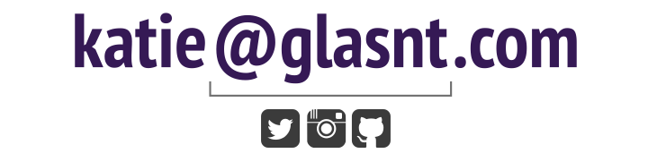

???

FULL SCREEN ME!

⌘ + P

Monitors wrong? ⌘ + TAB
---

class: title
# .e3[⚠️ 🙅‍♀️📝]

???

Before I start, a note about notes!

You don't have to take any.

I've got a lovely long list of all the links that I'll share at the end of the presentation.

I know this is the last talk of the conference, and our brains are almost full, and this talk might just overflow them;

but just put down your laptops and notepads, sitback, and relax.

We'll be covering a lot in this talk, but don't worry, I'll share the notes afterwards :)

---

class: title

???

Hi! I'm Katie

---

class: title

???

Thank you so much for inviting me to close your conference.

---

class: middle, center, image

???

One of my many roles in the Python community is as a Director of the Python Software Foundation.

The PSF is the organisation that holds the intellectual property rights behind the Python language.

We also run PyCon, recently held in Cleveland, and help other regional pycons around the world. We also help fund Python related development with our grants program.

---

class: title
# .e3[🐍🗳❗️]

.footnotes[Voting member? Check your email!]

???

by the way, if you are a voting memeber of the PSF, you have until today to submit your votes for the 2019 PSF Board of Director Election.

If you aren't a voting member... we're holding an election for our new 2019 board members. You can look up how to become a voting member on our website.

---

class: middle, center, image

???

in any case, the PSF does things in and around Python.

but python isn't just for developers.

---

class: top, image
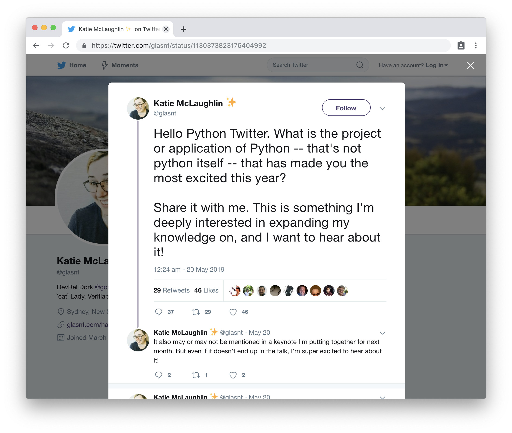

???

A few weeks ago I put out a call on twitter asking what exicting projects have you seen that use Python.

Specifically, not Python itself, or infrastructure around python, but the application of python.

And the results were... biased.

---
class: top, image
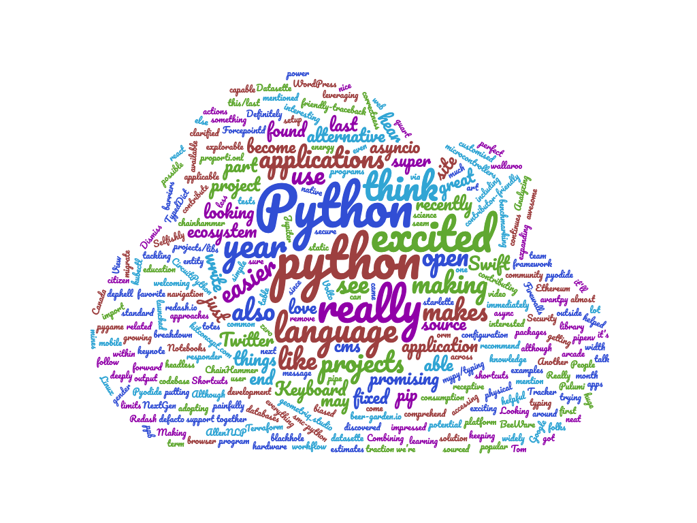

???

I got a LOT of comments about new features in the python standard and cpython, about asyncio, dependency management and so much more.

Now, this is partially my fault; I have a lot of the people building the bits around python in my social spheres, so the group to which this question was asked was biased.

However

---

class: title
# &nbsp;

???

I wanted to know about the projects that help people in their daily lives.

About ways Python itself is a foundational element in the infrastructure in our technical society.

And I did get a few really good replies. Some of which will feature in this keynote.

Which brings me to the title of my talk --

---

class: title
# How .pb[Python] Can .eg[Excel]

???

By this, I mean how Python
---

class: title
# .in[How .w[ . . ] 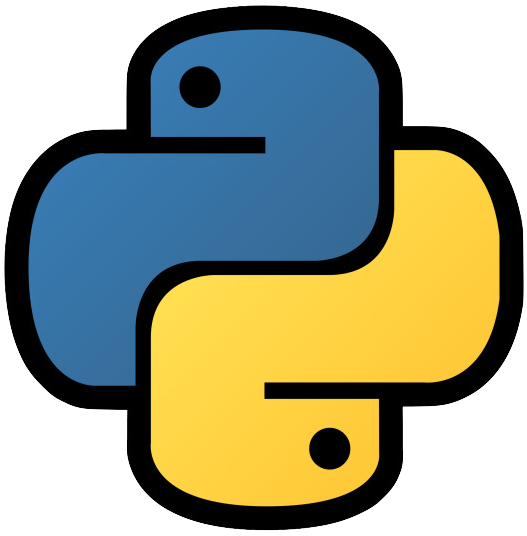 .w[. .] Can .eg[Excel]]

???

the programming language, can become as widespread and easy to use as

---
class: title
# .in[How .w[ . . ]  .w[. .] Can .w[. ]  .w[.]]

???

Microsoft Excel.

Yes, it's a play on words, but it's much more than that.

---
class: title

???
Python is 30 years old next year. And Python has many great strengths, and has been used in many places, but we can still make it better for users.

Python should be as 'go-to' as Excel.

---
class: title

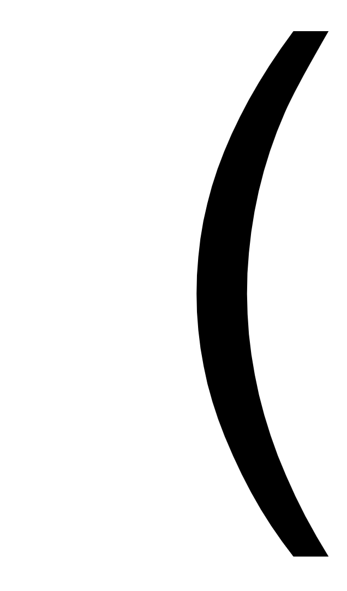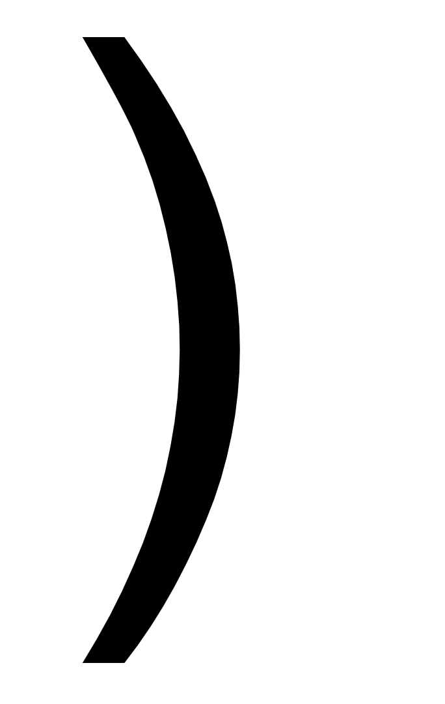

???

And by Excel, I don't just mean Microsoft Excel. Replace your preferred spreadsheet application here, be it Excel, Google Sheets, Apple Numbers, or LibreOffice Calc
---

class: title

???

Spreadsheets are extremely powerful and flexible.

They contain their own domain specific language where you can programatically affect your data input, it's has a great variety of visualistation properties in the forms of charts and graphs. Heck, it's technically turing complete -- meaning it can simulate a Turning machine, which describes the ability to be computationally universal. Meaning, you can create a computer **within** excel.

And people have.

---

class: middle, center, image
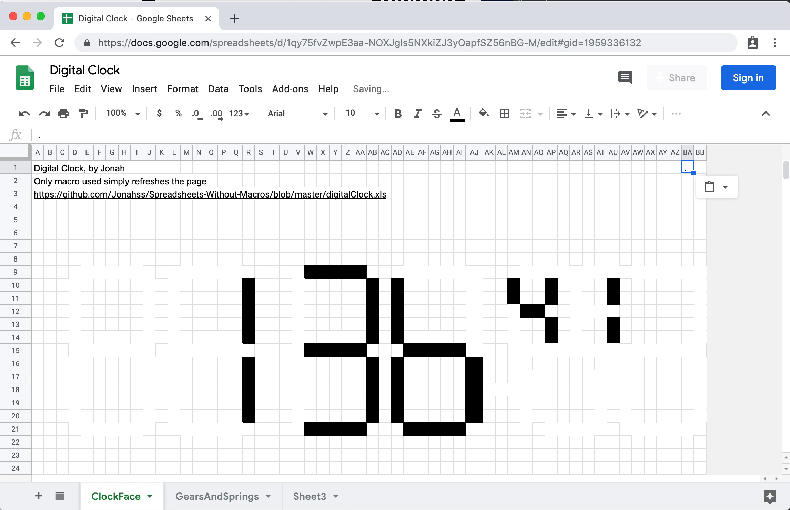
.footnotes[[jonahss/spreadsheets-without-macros](https://github.com/Jonahss/Spreadsheets-Without-Macros/blob/master/digitalClock.xls)]

???

this is an example where every time you update the spreadsheet, the clock updates to the current time.

I've imported this into google sheets, and am forcing consistent refreshes by pasting into a cell.

And if I show the progess...

---
class: middle, center, image
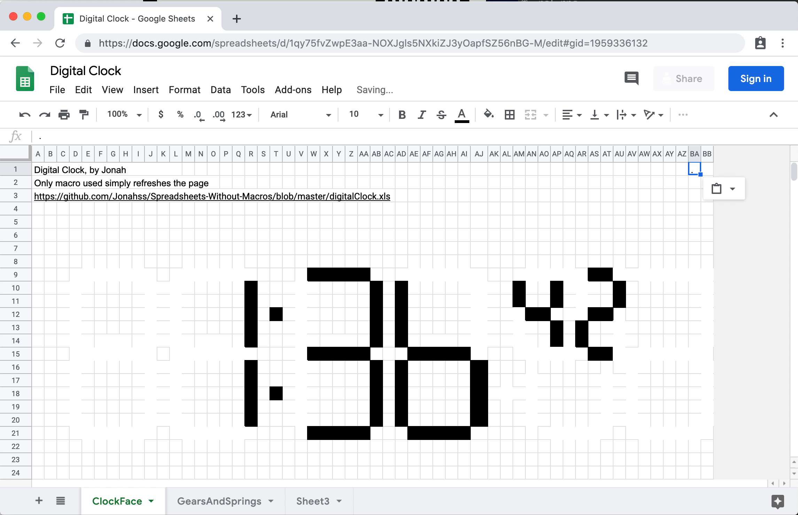
.footnotes[[jonahss/spreadsheets-without-macros](https://github.com/Jonahss/Spreadsheets-Without-Macros/blob/master/digitalClock.xls)]
---
class: middle, center, image
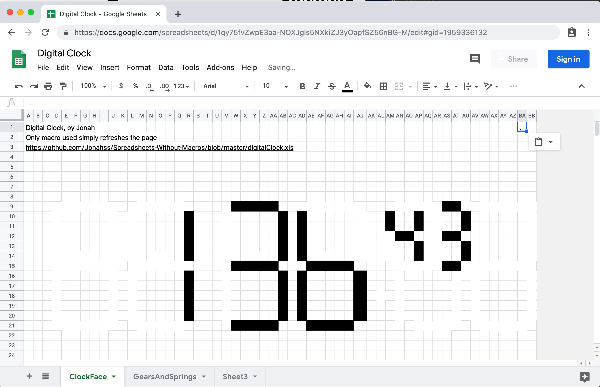
.footnotes[[jonahss/spreadsheets-without-macros](https://github.com/Jonahss/Spreadsheets-Without-Macros/blob/master/digitalClock.xls)]
---
class: middle, center, image
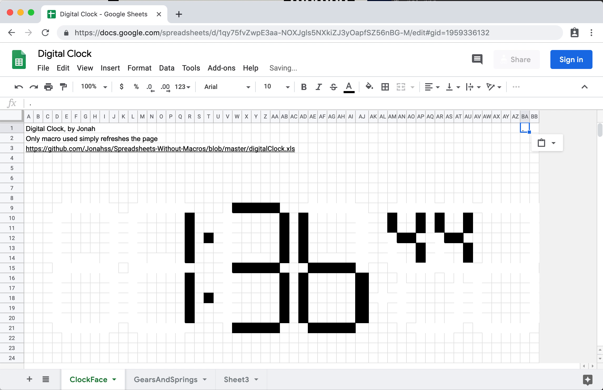
.footnotes[[jonahss/spreadsheets-without-macros](https://github.com/Jonahss/Spreadsheets-Without-Macros/blob/master/digitalClock.xls)]
---
class: middle, center, image
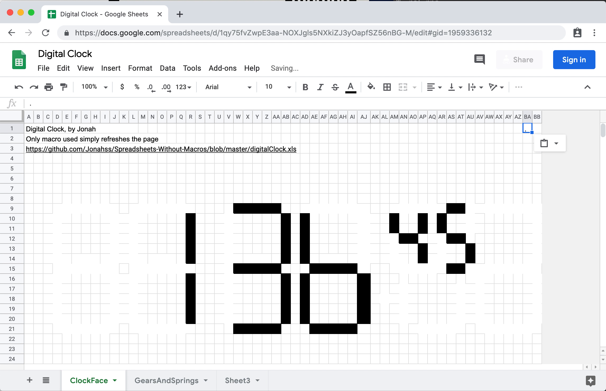
.footnotes[[jonahss/spreadsheets-without-macros](https://github.com/Jonahss/Spreadsheets-Without-Macros/blob/master/digitalClock.xls)]

???

it keeps updating.

---

class: title

???

I use spreadsheets all the time, even though I'm a Pythonista.

For example - Even though I have many purpose built systems for helping me put together the programme for PyCon Australia (it's in August in Sydney! Come along!) I still export data from these systems into a spreadsheet to be able to do complex analysis and calculated views on the data.

And spreadsheets are more popular that what you'd think.

---
class: title

.footnotes[[evansdata.com](https://evansdata.com/reports/viewRelease.php?reportID=9)]

???

Recent estimates suggest that in 2019 there are around 25 million software developers in the world.
And yet

---

class: title

.footnotes[[medium.com/grid-shreadsheets-run-the-world](https://medium.com/grid-spreadsheets-run-the-world/excel-vs-google-sheets-usage-nature-and-numbers-9dfa5d1cadbd)]

???

there are estimates that there are upwards of 800 million Microsoft Excel users alone.

There are many more people who use spreadsheets that identify as software developers.
---

class: title

???

thirty two times the amount

This really puts our work into perspective.

We are but a minority in terms of people who, basically, programme in a different language.

And this brings me to a delightful axiom that I will repeat throughout this talk:

---

class: title
## We are .p[humans] working with .p[humans] to develop software for the benefit of .p[humans].

.footnotes[[humanedevelopment.org](http://humanedevelopment.org)]

???

we are **humans**

working with **humans**

to develop software for the benefit of **humans**

and that the crux of the argument I want to make today.
---

class: title
# .e3[👩🏼‍💻👨🏽‍💻👩🏾‍💻]

???

We here in the room identify as software developers. But Python isn't just for us.

---

class: title
# .e1[👤]

???

Users *can* be anyone, and users *should* be *everyone*.

Python should be as accessible either directly or indirectly to as many people as possible.

it is the only way that python stays around.

If it has enough people who care about it's existance, it will stick around.

I want to focus on four specific groups of users, today.

---

# Scientists Educators Creators Explorers

???

I want to focus on scientsis, educators, creators, and explorers.

---

class: title
# Scientists

???

first, the scientists.
---

class: title
# .e1[👩🏾‍🔬]

???

Not just scienists in lab coats, but all kinds of scientsists.

---

class: title
# .e2[🔬💽]

???

both those that use a microscope and a minidisc.

---

class: top, image

.footnotes[[qz.com](https://qz.com/1417145/economics-nobel-laureate-paul-romer-is-a-python-programming-convert/)]

???
Last year the Nobel Prize for Economoics went to Paul Romer, who found that instead of using propetrary systems like Mathematica, he could more easily share his research with jupyter notebooks.

To quote the article

---

class: title
## *"... open-source notebooks are the way forward for sharing research."*
.footnotes[[qz.com](https://qz.com/1417145/economics-nobel-laureate-paul-romer-is-a-python-programming-convert/)]

---

class: title
## *"... they support integrity, while proprietary software encourage secrecy."*
.footnotes[[qz.com](https://qz.com/1417145/economics-nobel-laureate-paul-romer-is-a-python-programming-convert/)]

---

class: middle, center, image
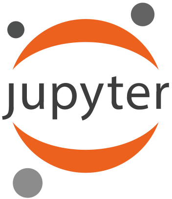
???

jupyter notebooks have been revolutionary in the data science world, but it's not just jupyter.

The notebook only gets to so far, you still need to fill it with something.

---

class: middle, center, image

???

You get so much power from things like pandas, numpy and matplotlib.

These are such powerful tools to a data scientist.

Using these tools you can make some amazing notebooks.

---

class: title
# .e[📚]

.footnotes[[Whimsical Notebooks](https://github.com/jupyter/jupyter/wiki/A-gallery-of-interesting-Jupyter-Notebooks#whimsical-notebooks)]

???

I want to show just a few of these amazing implementations I've found.

---

class: top, image
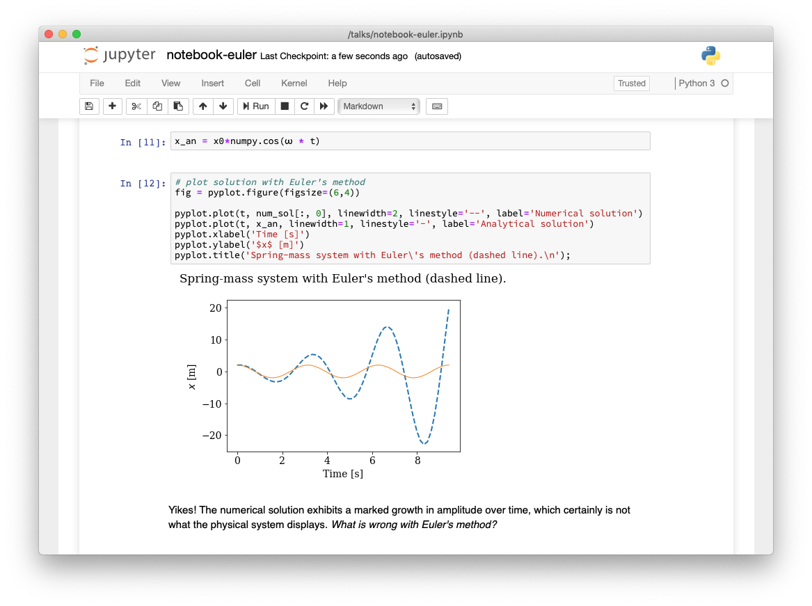
.footnotes[[Notebook](https://nbviewer.jupyter.org/github/engineersCode/EngComp3_tourdynamics/blob/master/notebooks_en/3_Get_Oscillations.ipynb), [Twitter](https://twitter.com/lorenaabarba/status/935559734970716161)]

???

you can do things as simple as creating graphs that show visualisations of arithmetic paradigms, in this case, Euler's method and oscillating systems.

Much as you would get an 'a ha!' moment if you were to enter this onto a graphics calculator, the visual representation here is so much easier to comprehend than just a forumla.

You can also do more complex graphing
---

class: top, image
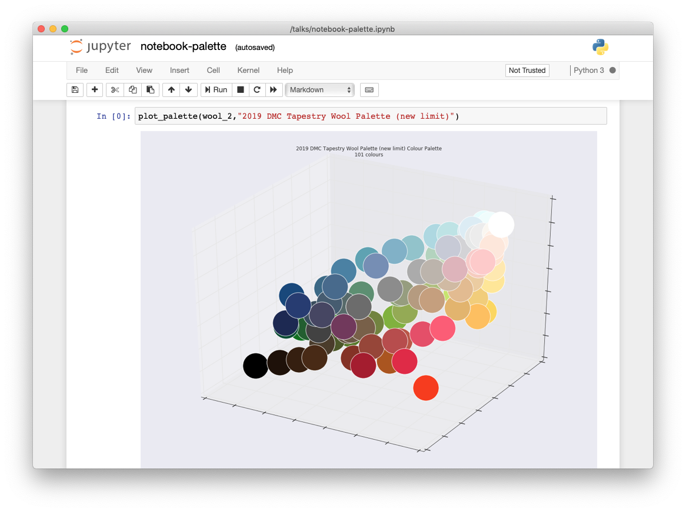

.footnotes[[Twitter](https://twitter.com/skimbrel/status/1124325732384157697), [Talk](https://www.youtube.com/watch?v=Fllch-WwzWM)]

???

Like this representation of the colour range of tapestry wool that I created as part of my PyCon talk just last month in Cleveland.

This is a visual representation of the types of wool available from a particular manufacturer, using the three axes for red, green and blue.

-

You can also do some super funky stuff in notebooks, including

---

class: top, image
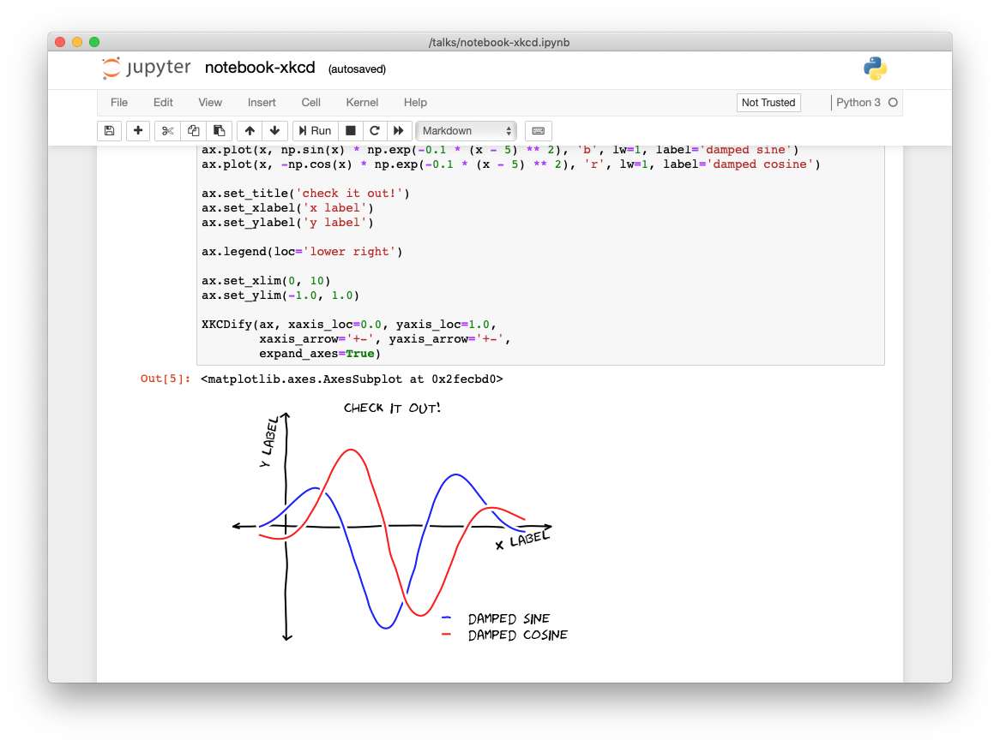

.footnotes[[Notebook](https://nbviewer.jupyter.org/url/jakevdp.github.com/downloads/notebooks/XKCD_plots.ipynb)]

???

implemeting the hand-drawn styling of XKCD graphs, and being able to generate those programatically.

Noting here that the font has been imported, but the math of the hand-drawn axes and lines is all dynamic.

The beauty of having these notebooks is that you can also pull the math out and share it around, much like Romer described earlier. I've used this math in my own graphing programs to comedic effect.

-

And you aren't just limited to graphs.

---

class: top, image
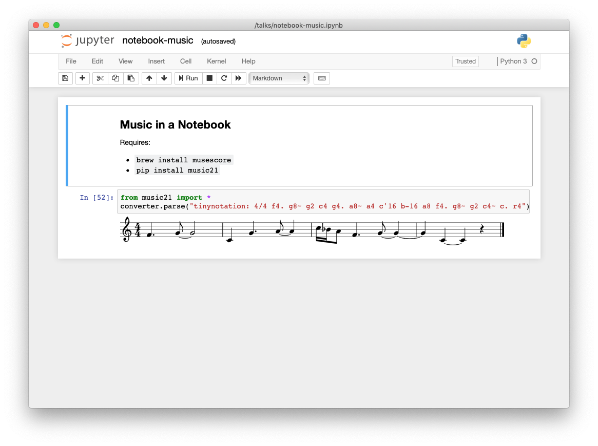

???

You can also do things like generate musical scores, right in the notebook. And with enough addons, you can convert the tinynotation there into audible music, right in the notebook.

It's literally, now, a notebook. #sorrynotsorry.

-

Notebooks give so much power, but they aren't the holy grail.

---

class: title
# .e[📦]

???

Data scientists, they aren't python packaing experts

Economists don't know pip from PEPs.

Trying to work out how to use pip and virtualenv and easy python and all that isn't interesting to them

It's an active barrier of entry.

Trying to tell a new or non programmer to just pip install something doens't make sense.

Having to dive down and explain that pip is a tool for installing packages, that they should be using virtualenv or pipenv, getting conflicting answers based on who they ask.

Trying to search for the answer themselves and finding easyinstall or other tools we know are now "deprecated", but the historical stackoverflow answers don't mention this, so blindly copying-and-pasting code ends up causing more confusion.

It's this sort of mindset that brought about

---

class: middle, center, image

.footnotes[[anaconca.com](https://www.anaconda.com/)]

???

tools like Anaconda

anaconda aims to simplify package management and deployment

It's so much easier for a data scientist to use conda than whatever the vogue is for cpython package management in order to get just their tools installed and get on with their day.

Anaconda wouldn't have had to be created if Python had a nice usable installation story.

Indeed, even just trying to get Python on Windows has been Hard.

Until in the last few months

---

class: middle, center, image
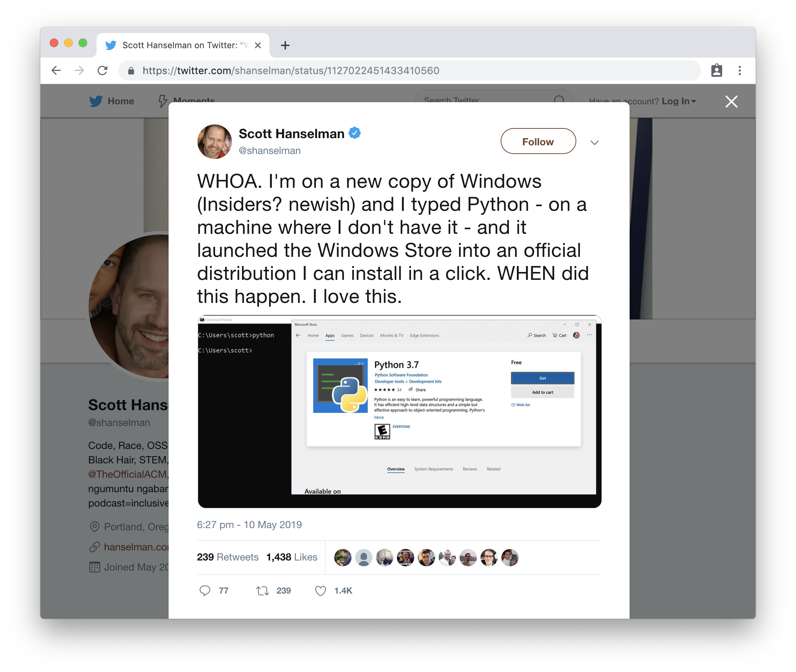
.footnotes[[twitter.com](https://twitter.com/shanselman/status/1127022451433410560)]
???

where Python 3.7 has been made available from the Windows app store

Even to the point where if you try and run python from the command line and it's *not* installed, the store pops up to suggest you install Python from the store.

---

class: middle, center, image
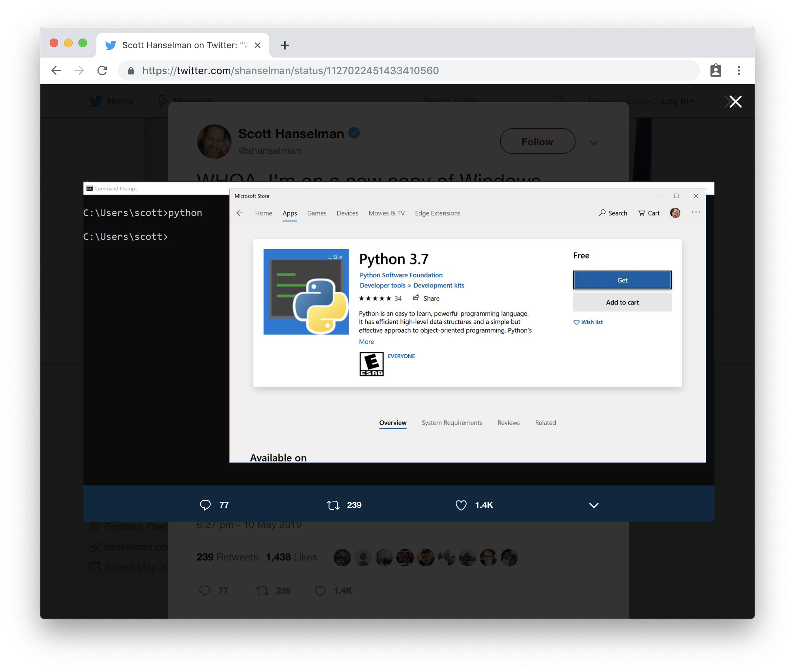
.footnotes[[twitter.com](https://twitter.com/shanselman/status/1127022451433410560)]

???

This is a workflow for those on Windows -- using the app store.

Windows users are often forgotten in the Python story.

You can't just tell someone to "Use Linux" or "Get a Mac". The financial and technological barrier to entry here is not feasible.

---

class: title
# .e3[🐍🚫]

.footnotes[[developer.apple.com](https://developer.apple.com/documentation/macos_release_notes/macos_10_15_beta_release_notes#3318257)]

???

this barrier will also be introduced to new Mac users this year, as the latest version of macos will not ship with python, ruby, or perl out of the box.

This means that you can't just run python without first installing it yourself.
Which can be a good thing. Those in linux land can attest to the fact that just because an operating system ships with *a* version of python doesn't mean it's a very recent version of python. Knowing how to install whatever version you need, and what is the version you need, is a very real barrier for the fledgeling programmer, regardless of the operating system.

And understanding that humans use Python on many operating systems is something we need to keep in our minds when we develop our applications.
---
.righthead[$ cd ~; pwd]
 
<pre><code class="bash">🐧 /home/glasnt</code></pre>
<pre><code class="bash">🍏 /Users/glasnt</code></pre>
<pre><code class="bash">📎 C:\Users\glasnt</code></pre>

???

Something as easy as remembering to not hardcode linux-style filepaths
--
 
<pre><code class="bash">$ python</code></pre>
<pre><code class="python">>>> from pathlib import Path</code></pre>
<pre><code class="python">>>> Path.home()</code></pre>
<pre><code class="bash">PosixPath('/Users/glasnt')</code></pre>

???
using pathlib means you get cross-compatible

---
class: title
## We are .p[humans] working with .p[humans] to develop software for the benefit of .p[humans].

.footnotes[[humanedevelopment.org](http://humanedevelopment.org)]

???

not just humans who use our preferred environment, but all humans.

If we ignore users outside of our native operating system, we are excluding an order of magnitude of users. Remeber, users out number is 32 times.

---
&nbsp;

???

I want to change tracks and address the second group of users
---

class: title
# Educators

???

Educators.
---

class: title
# .e1[👩🏼‍🏫]

???

Not just people who teach children in a school,
---

class: title
# .e2[🎓🔌]
.footnotes[[forbes.com](https://www.forbes.com/sites/jordanshapiro/2016/10/09/how-to-train-68-8-million-teachers-because-thats-how-many-the-world-needs/#768f86c4476e)]

???

those that educate both acedemically, but also those that teach to empower people.

You know how I said there were about 25 million software programmers in the world? There are about 70 MILLION teachers worldwide.

There are so many initiatives getting kids into coding that I can only scratch the surface
---

class: title
# .e3[🎒💻🧒🏼]

???

There are so many places that are teaching kids to code
---

class: middle, center, image
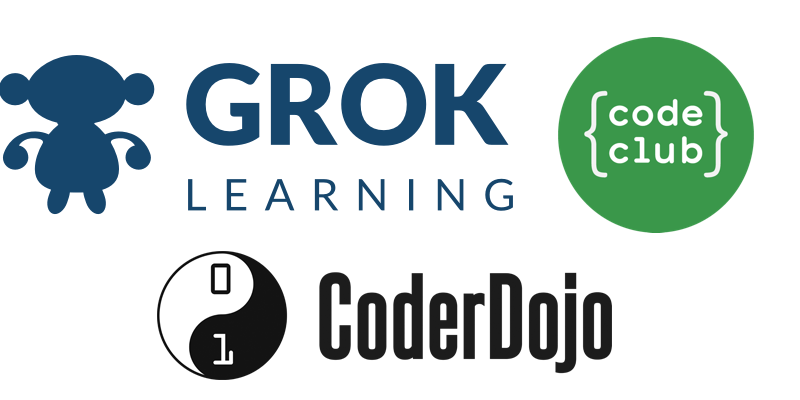
???

Grok Learning for one is a Sydney-based platform that has taught thousands of students across Australia to program.

And Code Clubs exist through out the world, giving students ages 9 to 13 the opportunity to learn to code.

There is also Coderdojo which has multiple local dojos, as we heard in the lightnig talks yesteday.

---
class: title
# .e3[🎒💻🧒🏼]
???

Programming is arguably a useful skill, but it's more than that.

Not every child is going to be a software developer, but it's highly likely they'll use tech in their daily life.

Getting kids interesting in technology, sparking their creative interest, is so much more important.

And it's not just online programming courses doing that.

---

class: top, image
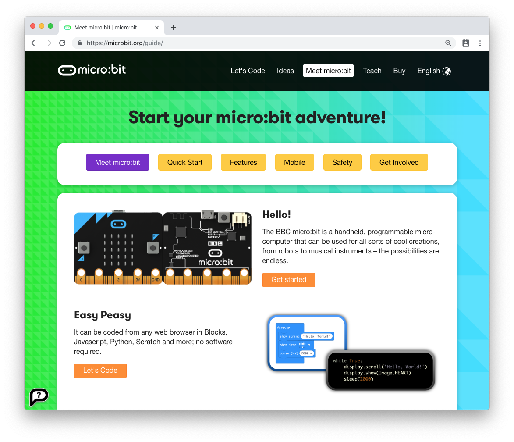

.footnotes[[microbit.org](https://microbit.org/guide/) [resources](https://www.python.org/community/microbit/)]

???

Initiatives like the BBC MicroBit are also amazing for sparking interest in hardware for kids.

The Python Software Foundation and other organisations formed a partnership with the BBC to get one million micro:bits into the hands of school children around the UK

The source code for this is all open source; which means anyone can contribute. The youngest contributor to date was only **eleven** when they contributed!

But it's not just British school children.

---

.footnotes[[circuitpython.org](https://circuitpython.org/)]

???

circuit python is a fork of micropython, a version of python so small and compact that it can fit into the tiny amount of memory on a microchip.

---

class: top, image
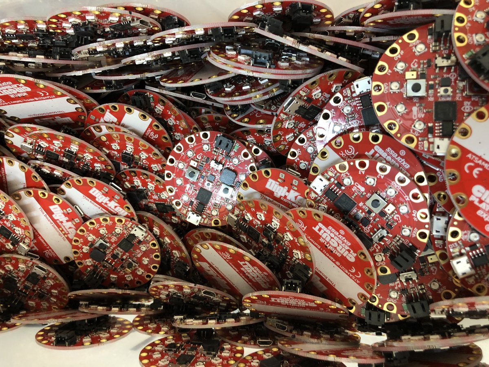
.footnotes[[Twitter](https://twitter.com/pycon/status/1124006895965097984)]

???

In fact at PyCon last month, all attendees were giving Circuit Python Playground express.

---

background-image: url("images/nina-pycon.png")
.footnotes[[YouTube](https://www.youtube.com/watch?v=35mXD40SvXM)]

???

And amazing Nina Zakharenko gave a keynote demonstrating live how to program the kits.

She did a keynote, with live hardware hacking, in front of thousands. She's amazing.

And to hack on the hardware, you need a code editor.

---

class: middle, center, image

.footnotes[[codewith.mu](https://codewith.mu/)]

???

mu is a python code editor for beginner programmers

---

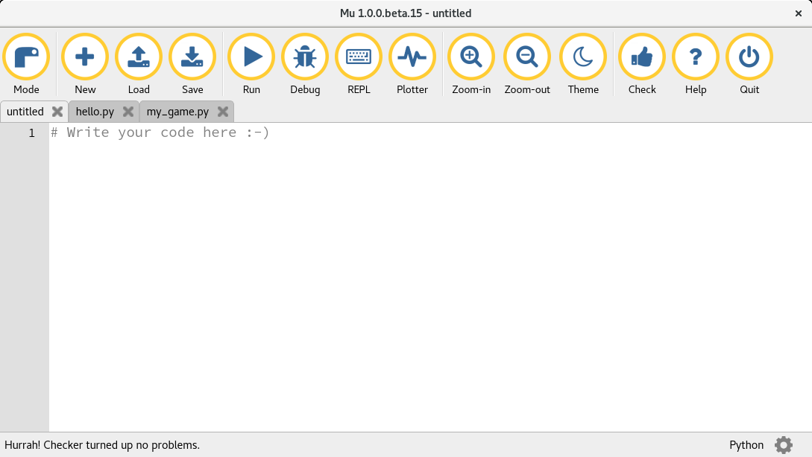

.footnotes[[codewith.mu](https://codewith.mu/en/tutorials/1.0/adafruit)]
???
it's simple to use, but it's also got some pretty neat features.

There's also this really neat feature with the press-button open repl. But that's not all

---

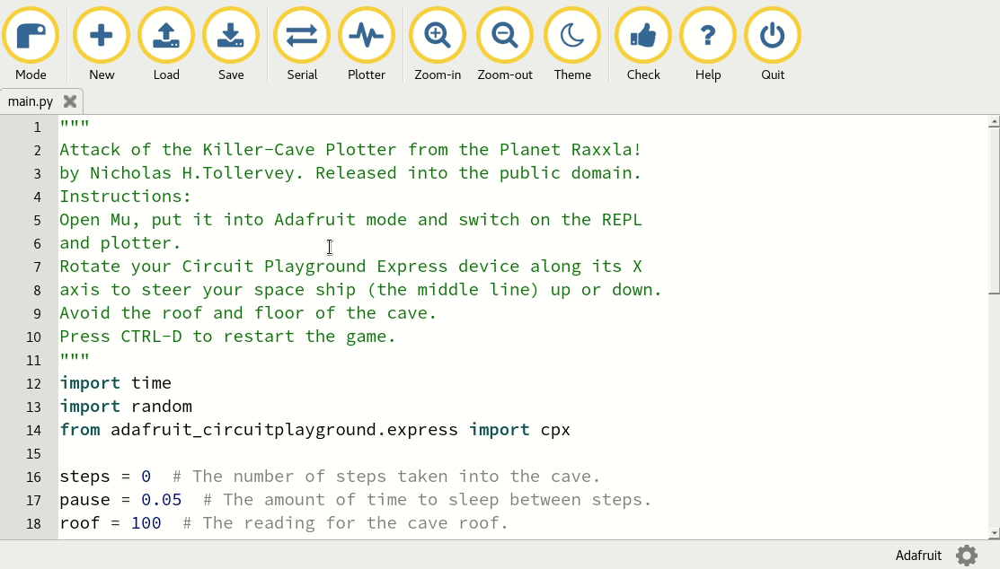

.footnotes[[codewith.mu](https://codewith.mu/en/tutorials/1.0/adafruit)]

???

If you have your program, for example, print out tuples, then click the REPL button

---

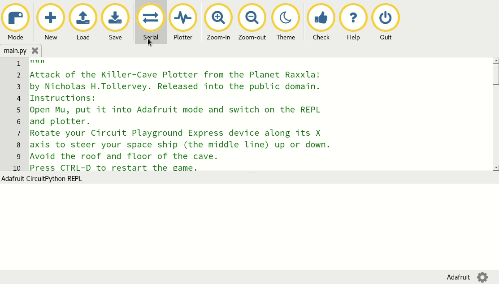

.footnotes[[codewith.mu](https://codewith.mu/en/tutorials/1.0/adafruit)]
???

you'll get your output; but then if you click the Plotter,

---

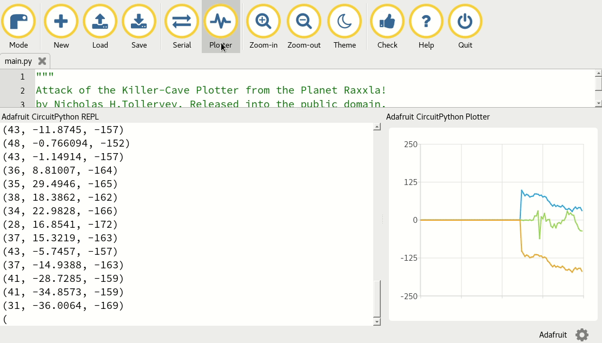
.footnotes[[codewith.mu](https://codewith.mu/en/tutorials/1.0/adafruit)]

???
it'll graph it for you.

Just think how much work it would be to not only get the configurations to attach a terminal to the serial console, but to live-intercept the output and then graph it.

Mu does it all for you.

And as a beginner, that is such an advantage.

---

class: title
# .e3[💾🤔]

???
Because as a begineer, you don't know a lot; serial consoles and terminals are unfamiliar concepts.

Especially antiquated concepts.

Most children don't even know what a floppy disk is. The joke that if a child sees one and quips: "Oh! you 3d printed a save icon!"

These objects that were once fundamental to our use of computers are so outdated that these jokes can be made.

Why are we trying to teach these new concepts when there's embeded fallacies that are going to confuse people?

Reducing those barriers of entry is so important in ensuring that children aren't left behind.

But it's not just in schools

---

class: middle, center, image

???

At PyCon, and regional PyCons UK and AU, Education tracks have been held for a number of years.

These are where education practicitioners can come together, learn, and share there experiences bringing python to the younger generation.

---

class: middle, center, image
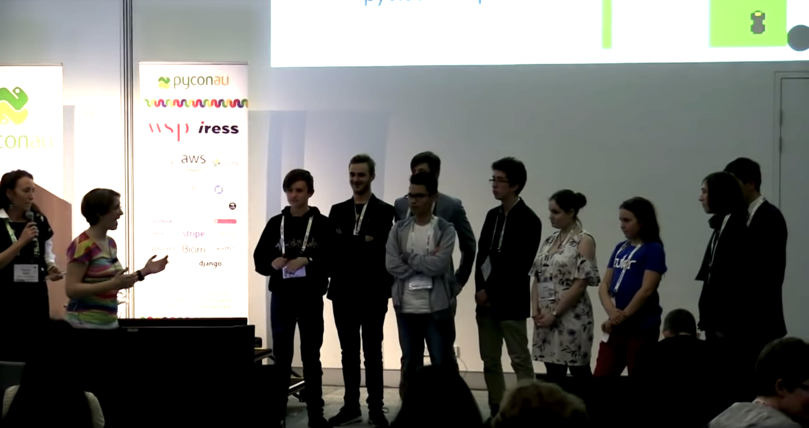
.footnotes[[2018.pycon-au.org](https://2018.pycon-au.org/education-showcase)]

???

Indeed, at PyCon AU last year, we had ten kids presenting their own work in their own short talks. They spoke about topics ranging from machine learning to neural networks to natural language processing, procedurally generated images, and more!

I'm looking forward to seeing what presentations happen this year, and how these kids grow in the Python space.

---

class: middle, center, image

???

the PSF has also recently closed applications for a grant specifically to help further Python in education. Results aren't out yet, but I'm interested in what is able to be developed with the grant.

But there are other barriers here.

---

class: title
# .e2[🔜💻]

???

The IT teams in schools work so hard to provide a network that allows children to use computers. Heck, a lot of schools now are using tablets, not desktop computers.

There's just so much work to do to keep these systems up to date that deploying something like a local programming langauge sometimes isn't feasible.

Online systems like groklearning work around this by using the browser, but systems like mu need to be deployed somehow.

And installing System Python is just asking for trouble.

They call them script kiddies for a reason.

TODO - expand on term

---

class: title
# `$ ~`

???

and without system python, there is no distribution story, let alone a deployment story.

In order for a developer to install something from PyPI, you need to pip install. Pip itself requires python. So without python, you can't install anything.

Thankfully there are solutions for this.

---

class: middle, center, image

???

Mu solves this by using Briefcase, which is part of the BeeWare suite (which we heard about earlier from Russell). Mu is able to create a distributable artifact on macos with help from briefcase.

---

class: middle, center, image

???

For windows environments, Mu uses pynsist, which allows Python itself to be bundled up with the application into one executable package, that sysadmins at schools can then deploy onto their fleet of machines.

By packaging python within the application, students can only interact with python from mu itself, thus removing the ability for a student to do any damage with the scripting language on the local network.

---
class: title
## We are .p[humans] working with .p[humans] to develop software for the benefit of .p[humans].

.footnotes[[humanedevelopment.org](http://humanedevelopment.org)]

???

not just big humans, but small humans too.

Getting the next generation interested in technology is just one part of it.

And allowing non-python developers -- the school's IT team -- to easily allow access to this sort of technology is paramount.

Onto the next group of users -
---

class: title
# Creators
???

Creators

---

class: title
# .e1[👩🏻‍🎨]

???

not just the artists, but also

---

class: title
# .e2[🎨🎮]

???

the designers and the entertainers

There is SO MUCH ART that's possible with python it's not funny; I could have filled the entire keynote with just this.

But here's the best of the best

Firstly, did you know that there's a charity auction every year specifically for pythonistas? It's true!

---

class: middle, center, image
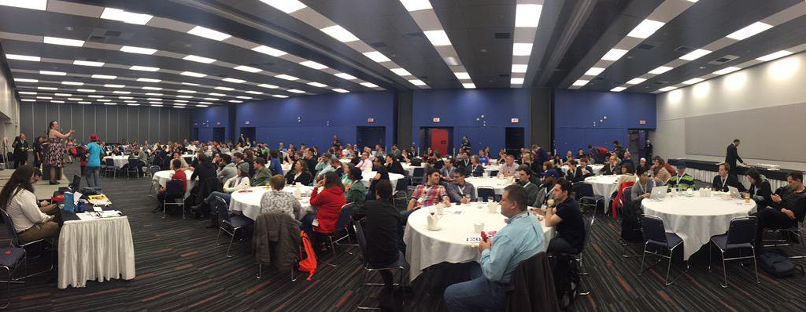

.footnotes[[Twitter](https://twitter.com/pycon/status/587032940510576640)]

???

celebrating it's eighth year this year, the pyladies charity auction is a fundraising initiative that raises money for Pyladies, the international mentorship group to help more women become active participants of the python community.

Every year, items are donated, and on the night, folks dress up and have a wonderful evening bidding on some amazing items.

---

class: middle, center, image
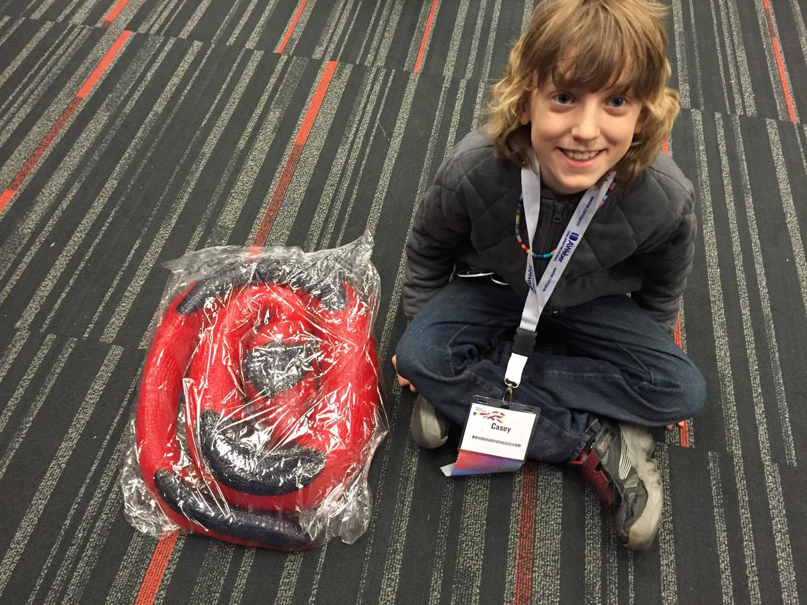

.footnotes[[Twitter](https://twitter.com/dougnap/status/585928632394244096)]

???

In 2015, a 13 kilogram gummy snake was auctioned off; child for scale.

by all accounts it tasted awful.

---

class: middle, center, image

.footnotes[[Flickr](https://www.flickr.com/photos/mikepirnat/34914367432/in/album-72157684291069175/)]

???

there's often major donations from Disney of artwork, such as this piece from 2017 of Moama artwork.

---

class: middle, center, image
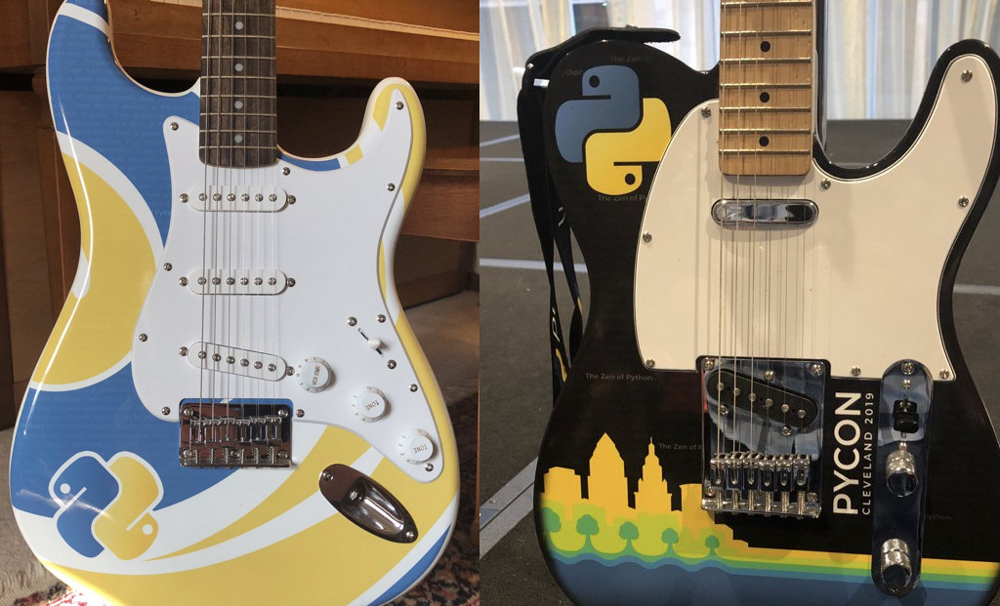

.footnotes[[Twitter](https://twitter.com/pyladies/status/995305748329631744), [Twitter](https://twitter.com/mpirnat/status/1124819641296142336)]

???

or these custom-decaled guitars from 2018 and 2019, respectively.

But it's more than just these. There's also been a surge in hand-crafted python-related artwork in the last few years.

---

class: middle, center, image
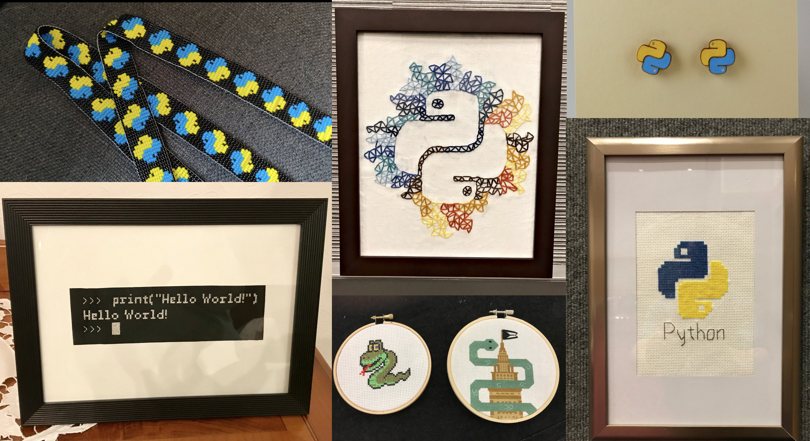

.footnotes[[1](https://twitter.com/pyladies/status/995277157449396225), [2](https://twitter.com/pyladies/status/995319436491010049), [3](https://twitter.com/pyladies/status/995422986202157062), [4](https://twitter.com/judy2k/status/1121683614918299655), [5](https://twitter.com/skeletonbuddy/status/1072353422710636546)]

???

from beaded lanyards, laser-cut earrings, cross-stitches of helloworld and various interpretations of the python logo, all these pieces have been highly sought after.

IFTRUE: I'm wearing some of these right now (earrings, bracelet)

But it's not just art that looks like Python, there's also art that looks like Python *made* with Python.

I gave a talk in Cleveland and donated my demo.

---

class: middle, center, image
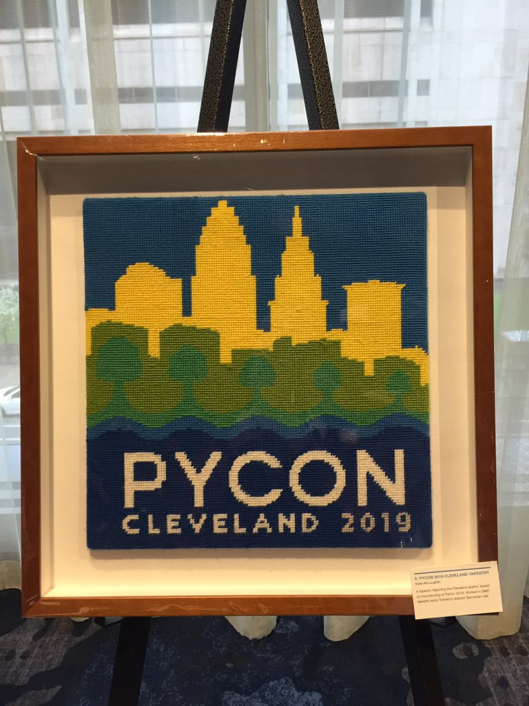

.footnotes[[Twitter](https://twitter.com/laceynwilliams/status/1124839875524612096)

???

This is a 40 by 40 centimeter, tasmanian oak framed tapsetry of the pycon us 2019 logo.

Which I created from a chart I made using a package I wrote, in Python.

But of course I can't stop talking about the pyladies auction without showing you one last image.

---

class: middle, center, image
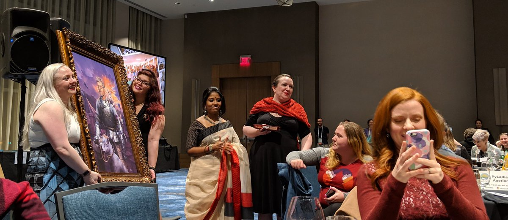

.footnotes[[Twitter](https://twitter.com/glasnt/status/1124850593057533952)]

???

The final auction of the most recent pyladies auction - an oil painting of Guido van Rossum.

---

class: middle, center, image
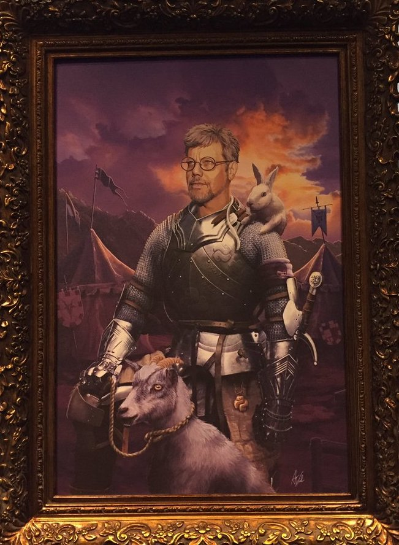

.footnotes[[Twitter](https://twitter.com/laceynwilliams/status/1124847456582344704)]

???

The piece is called Benevolence, and was donated by Captial One. It ended up going for $9,001 USD (that's nearly 300,000 Baht, for reference)

In total, over 41 thousand dollars was raised in one evening, the highest number to date.

---

class: title
# &nbsp;

???

So, back to the creators using Python to make art.

---

class: middle, center, image
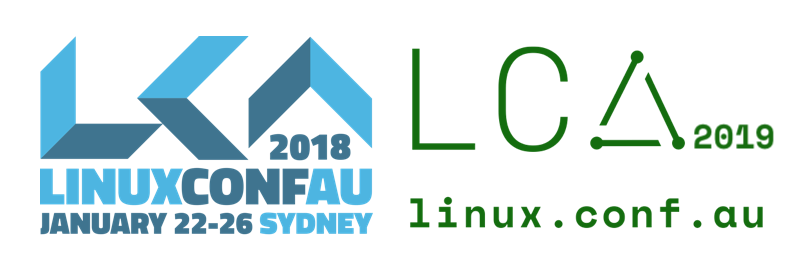

.footnotes[[linux.conf.au](https://linux.conf.au/)]

???

for the past two years linuxconfau have run miniconfs dedicated to art in tech

---

class: middle, center, image
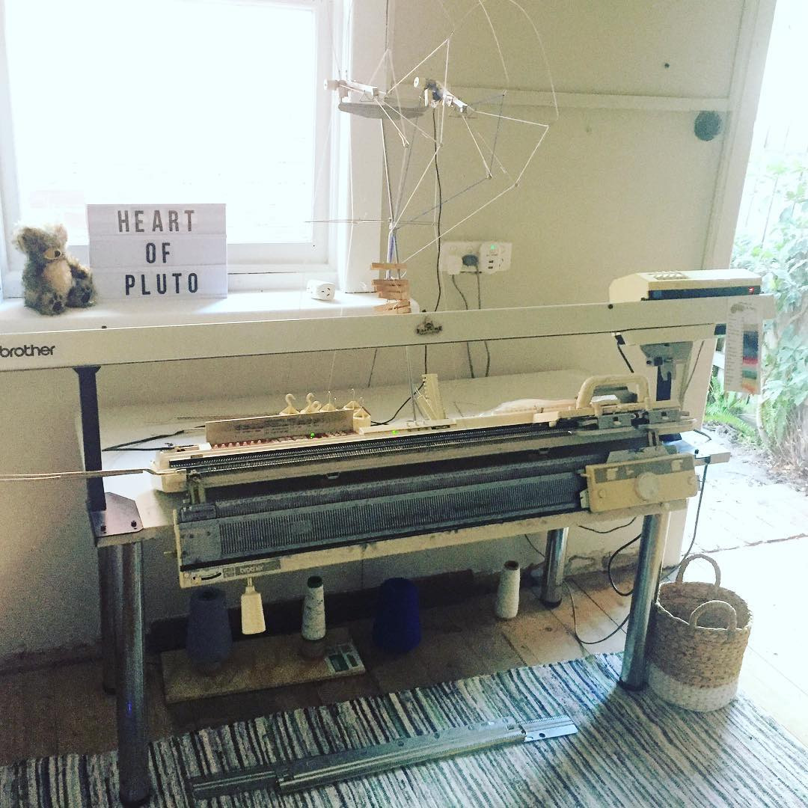

.footnotes[[Article](https://www.technology.org/2018/09/25/raspberry-pi-networked-knitting-machine-not-your-average-knit-one-purl-one/), [GitHub](https://github.com/chixor/octoknit)]

???

One of these amazing projects was the octoknit project by Sarah Spencer

She hacked a domestic knitting machine from the 1980's to be a network printer, using a raspeberry pi and a program she wrote called octoknit, which uses a lot of python.

She can then print much like you would to a 3d printer, but instead of plastic, she uses yarn.

---

class: middle, center, image
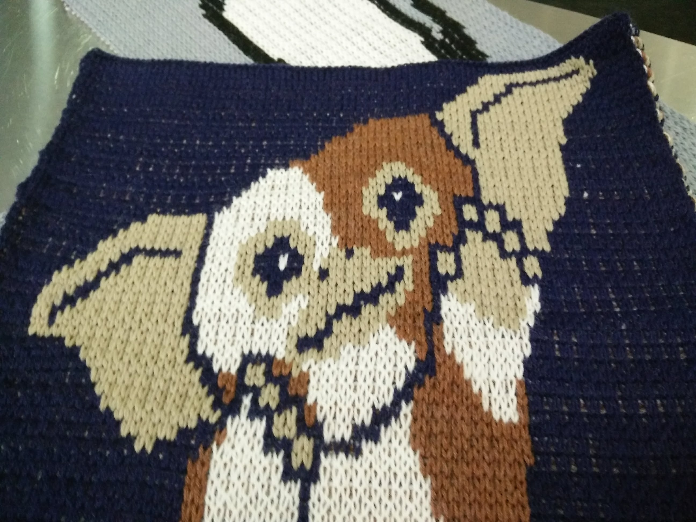

.footnotes[[Article](https://www.technology.org/2018/09/25/raspberry-pi-networked-knitting-machine-not-your-average-knit-one-purl-one/), [GitHub](https://github.com/chixor/octoknit)]
???
Being a practioner of hand-tapestry, automating the process is something I really admire.

This culminated in her magnum opus -

---

class: middle, center, image
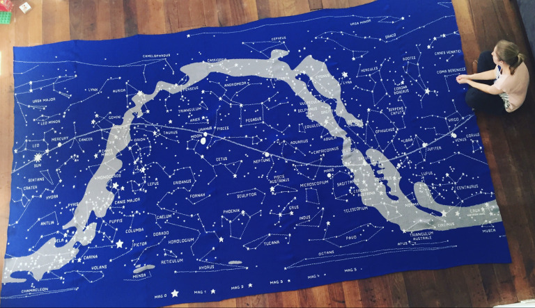

.footnotes[[Article](https://www.technology.org/2018/09/25/raspberry-pi-networked-knitting-machine-not-your-average-knit-one-purl-one/), [GitHub](https://github.com/chixor/octoknit)]

???

Stargazing.

it features all 88 constellations across both Northern and Southern hemispheres

The total piece had to be printed in 21 parts, then manually connected, and the total piece weights 15 kilos.

---

class: middle, center, image
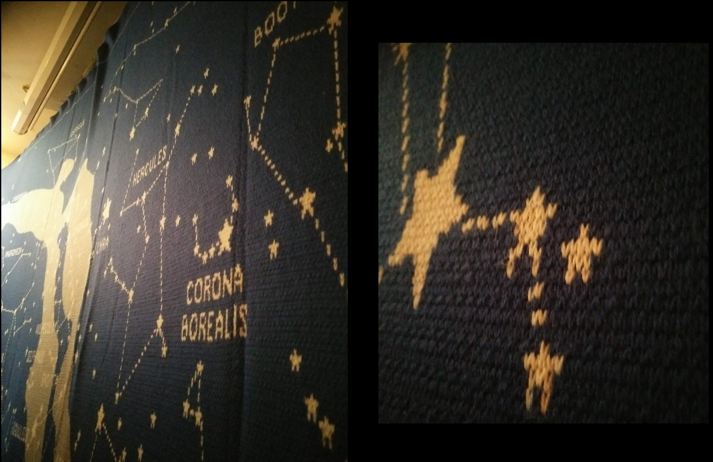

.footnotes[[Article](https://www.technology.org/2018/09/25/raspberry-pi-networked-knitting-machine-not-your-average-knit-one-purl-one/), [GitHub](https://github.com/chixor/octoknit)]

???

I had the fortune of seeing Stargazing in person at an event in Melbourne late last year, and it is art.

It is so amazing what you can do with fibre, and the scale of the piece was just.. cosy :)

???

it's not just physical art, but there are multitudes of digital creations that use python to make entertainment
---

class: middle, center, image
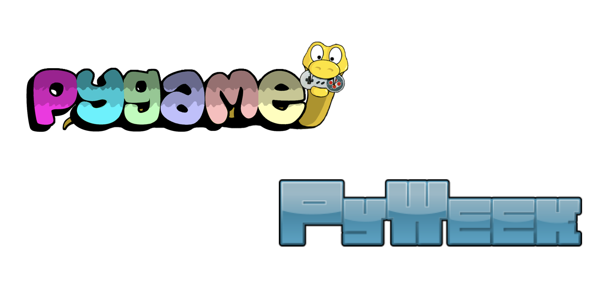

.footnotes[[pygame](https://www.pygame.org/), [pyweek](https://pyweek.org/)]

???

PyGame has been around for years, allowing people to develop video games using python.

The PyWeek python game programming challege also attracts large crowds each contest. Participants have a week to develop a game based on the theme, and it must be written in Python.

---

class: middle, center, image
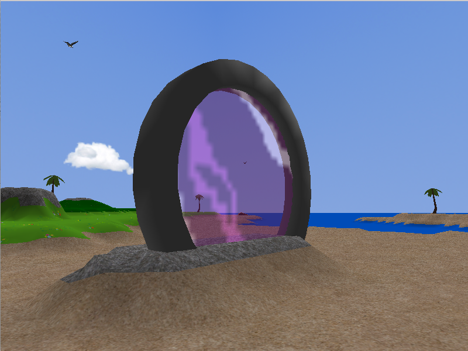

.footnotes[[pyweek.org](https://pyweek.org/e/mit-mit-25/)]

???

Some of the previous week winners look absolutely amazing. The next pyweek is set to happen in September, with the theme yet to be decided.

But when it's not humans handcrafting items, machines often get involved.

---

class: middle, center, image
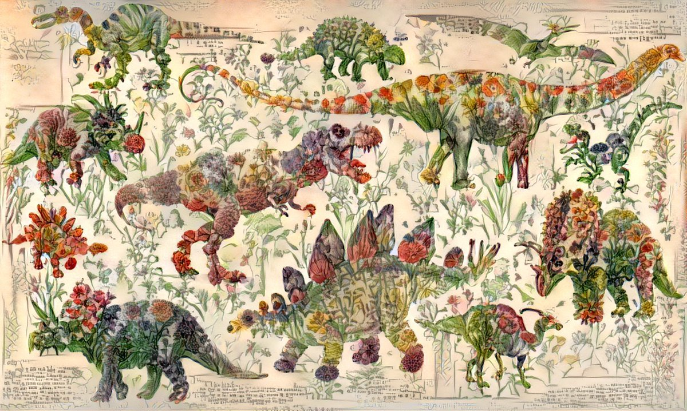

.footnotes[[ChrisRodley.com](https://chrisrodley.com/2017/06/19/dinosaur-flowers/), [notebook](https://github.com/google/deepdream/blob/master/dream.ipynb)]

???

DeepDream, the computer vision API, inspired a bunch of artists that have created a range of beautiful pieces, like this one by Chris Rodley

Some of the deepdream images aren't as pretty as this one, so I'm using this one as an example of just how pretty you can make it.

But, the go-to example on the github repo for the project is, you guessed it, all written in python.
---

class: middle, center, image

.footnotes[[deepart.io](https://deepart.io)]

???

there are also services which use the same style, if you don't want to run the notebook yourself.

In this example, the image on the left was made by mixing the pycon thailand logo and a sample piece of artwork.

The results of inputting a source image and selecting a style are pretty amazing.

But a barrier here is how can creators share their work? how can they then allowfor others to remix and work from their creations?

---

class: middle, center, image
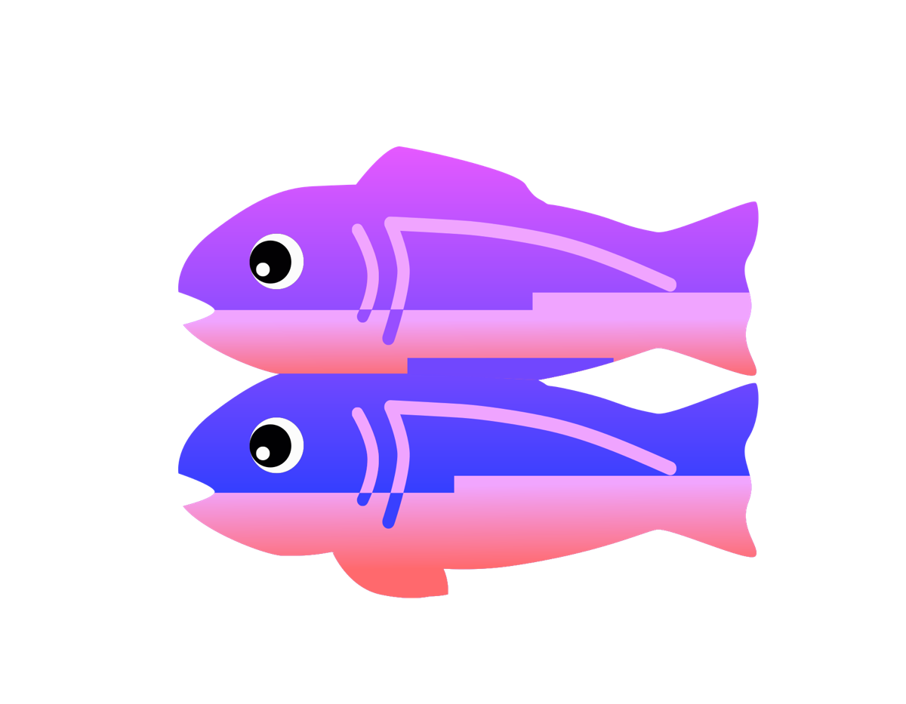

.footnotes[[glitch](https://glitch.com/)]

???

Glitch is a community were not only can you explore applications, but you an also remix them

---

class: middle, center, image
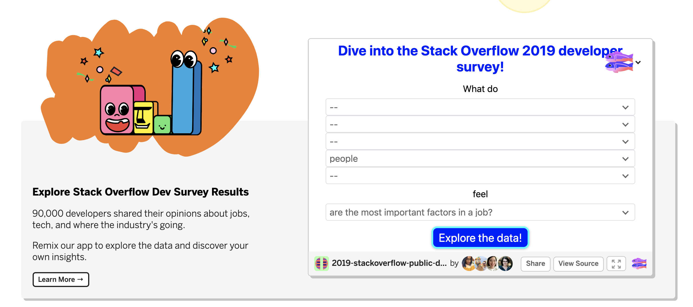
.footnotes[[glitch.com](https://glitch.com/culture/discover-insights-explore-developer-survey-results-2019/), [stackoverflow.com](https://stackoverflow.blog/2019/05/21/public-data-release-of-stack-overflows-2019-developer-survey/)]

???

On the front page now there is an example app which uses the publically release data from the most recent stackoverflow developer survey, which let's you dive into the data.

But if you read the announcement blog post, you'll see there's a second app you can use

---

class: middle, center, image
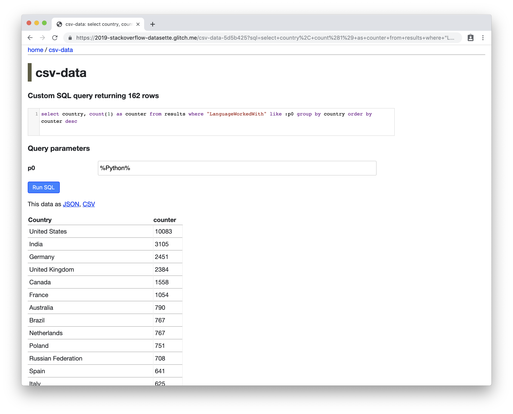

.footnotes[[datasette](https://github.com/simonw/datasette/), [glitch.me](https://2019-stackoverflow-datasette.glitch.me/csv-data-5d5b425?sql=select+country%2C+count%281%29+as+counter+from+results+where+%22LanguageWorkedWith%22+like+%3Ap0+group+by+country+order+by+counter+desc&p0=%25Python%25)]

???

Datasette, a Python-based SQLite database explorer.

With datasette, you just run a command that lists a local sqlite database file, and tada! A dynamically generatered website that lets you inspect and interact with the information in the database.

And you can run this on glitch! Yes, Glitch supports Python.
---

class: middle, center, image
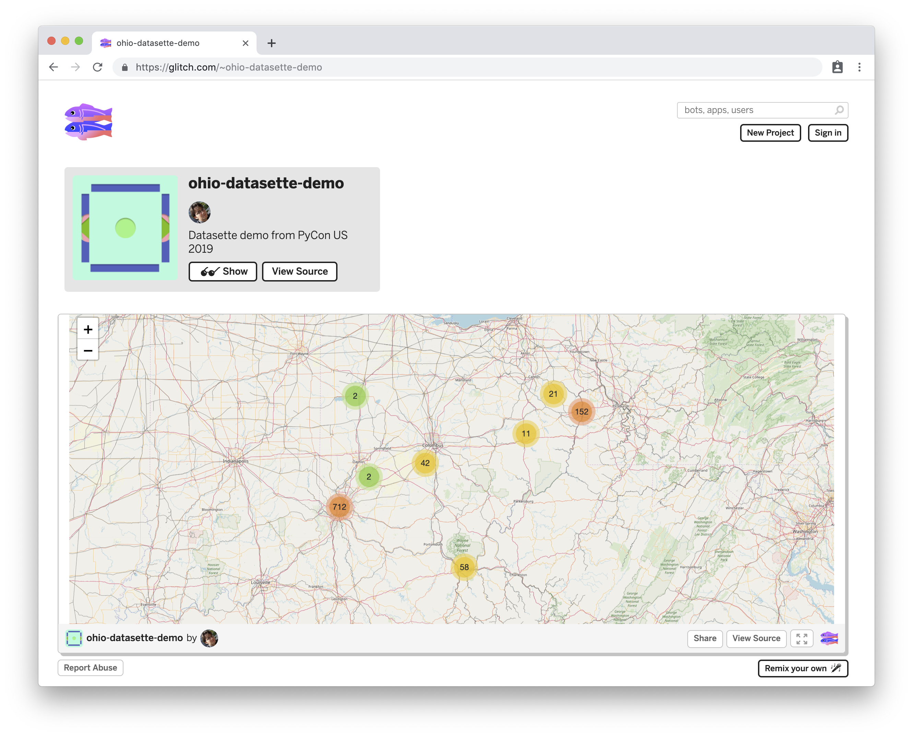

.footnotes[[glitch.com](https://glitch.com/~ohio-datasette-demo)]

???

Simon Willison demonstrated this at PyCon, sharing some visusaliation capacities of datasette and it's associated plugins, such as mapping transportation datapoints around Ohio.

Simon was one of the first people working on django back in the day, and has a history of creating interesting things like this, with his work on data journalism.
---

class: middle, center, image
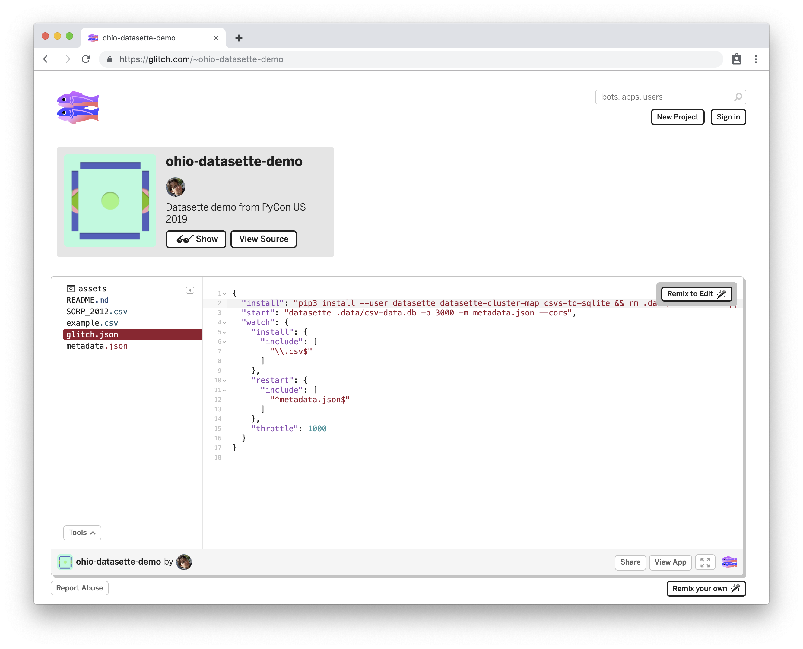

.footnotes[[simonwillison.net](https://simonwillison.net/2019/Apr/23/datasette-glitch/)]

???

simon describes that by using glitch, not only an others remix his work, but it's also an excellent way to setup a development environment that just works.

Even though the glitch documentation is all about nodejs and javascript, they do have very good python support

By altering the install value in the glitch.json file, you can pip install whatever package you need, and then change the start value to run what you want.

---
class: title
## We are .p[humans] working with .p[humans] to develop software for the benefit of .p[humans].

.footnotes[[humanedevelopment.org](http://humanedevelopment.org)]

???

giving people the space to share and create and explore their art means they have different medium to express themselves

---

class: title
# Explorers

???

and finally, the explorers.

---

class: title
# .e1[👩🏽‍🚀]

???

and this time, I literally mean, the explorers.

If you've watched the GitHub Satellite keynote from last month, you would have seen some of what I'm about to talk about, but it's too exciting not to cover again in a -- slightly smaller -- keynote
---

background-image: url("images/blackhole_169.jpg")

???

Back in april, we got our first picture of an actual black hole.

The Event Horizon Telescope was able to confirm multiple theories about blackholes. This one, for scale, is about seven *billion* times bigger than our sun.

---

class: middle, center, image

???

Around the same time, you may have also seen this picture.

This is Doctor Katie Bouman, who lead the development of the algorithm for imaging black holes.

And that code on her screen?

That's Python.

---

class: middle, center, image
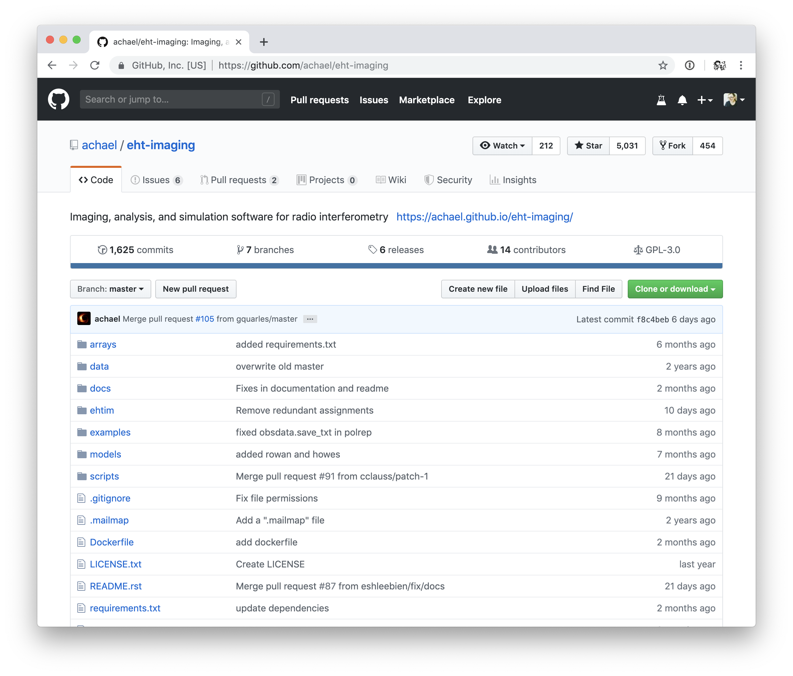

???

the code that was used to stitch the images together that was taken from the event horizon telescope? that's on github.

by the way, this whole repo

---

class: middle, center, image
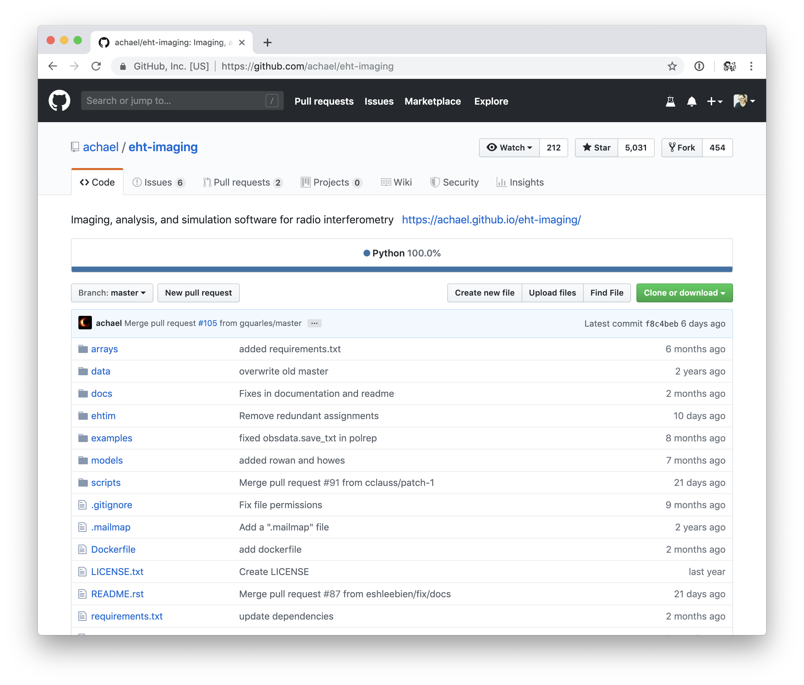

.footnotes[[Panel](https://www.youtube.com/watch?v=_RQBNCOU0RM)]

???

it's all python.

Now.

Doctor Bouman lead the development of the algorithm.

She wrote her doctoral thesis on this.

The entire project is fasinating. The team did a panel at GitHub Satelitte about the project, the video of which was just released a few days ago. I highly suggest you check it out.

When the blackhole image was released, there were 9 contributors to this repository. As of this screenshot, there are 14.

But it's so much more than just these people who contributed to this.

they could not have done the work that they did without the work from so many people.

Nat Friedman, github's ceo also called his out in the keynote.

(when to add this?) https://github.com/achael/eht-imaging/issues/101 BLESS YOUR LITTLE COTTON SOCKS

---

class: middle, center, image
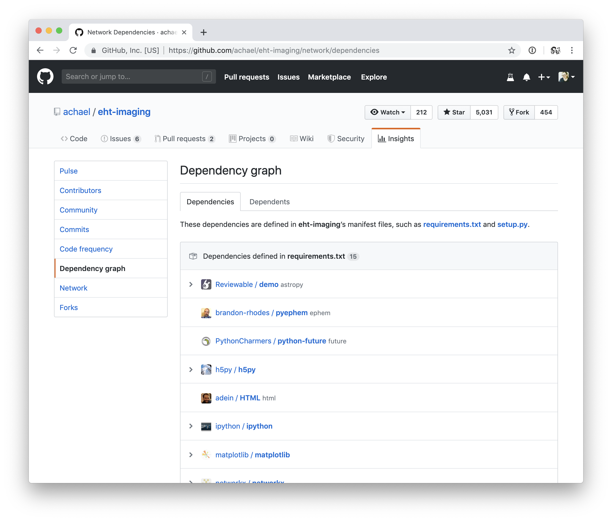

???

Github has had a dependency available for a little while now. It can show you, based on your requirements.txt and setup.py, what packages you depend on.

From there you can also see what packages *those* packages depend on, all the way down.

---
background-image: url("images/eht-deps.png")

???

This image is taken directly from the github satelitte keynote.

Nat showed this on stage during his keynote.

you may notice some familiar ones in there

---

background-image: url("images/eht-deps-noted.png")

???

Which I've mentioned earlier in this presentation

numpy, scipy, matplotlib, ipython

Not just these, but also staple python packages.

---

background-image: url("images/eht-deps-staple.png")

???

requests, urllib3, sphinx, tox, click, jinja, argparse, beautifulsoup, flask, virtualenv, pillow.

But not just these packages, but also people

---
class: full
background-image: url("images/eht-deps-people.png")

???

brandon rhodes, brett cannon, ned batchelder, thea flowers

I've probably missed a whole bunch because there are a LOT in here.

And there are a lot.

Github now shows the exact amount of contributors

---
class: middle, center, image
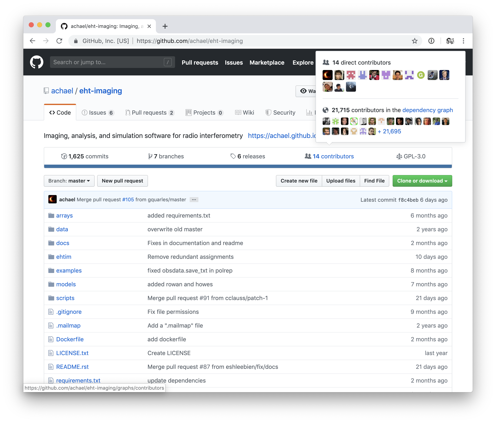

???
at least 21 thousand people contributed code to dependencies of the code that helped see a black hole from the first time.

and a whole bunch of them are from Python.

And while that number is impressive, it's not even the whole of it.

What Github classes as contributors -- now "direct contributors" -- are only those who have code in the master branch.

These new "community contributors" are also those who have only committed to master on the respective dependencies.

Heck, Dr Bouman was absolutely riddaculed on social media because she didn't have the most amount of code in the project.

---

class: middle, center, image
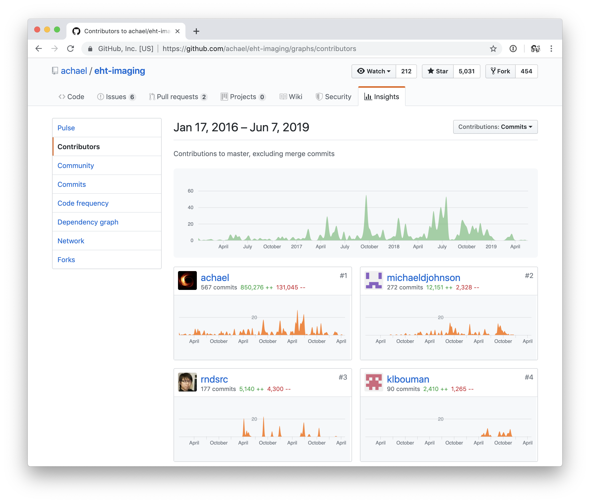

???

and technically, that's right. She doesn't.

But that doesn't mean anything.

She's the team lead. who has ever worked on a team where the lead has the most commits, the most lines of code in a project

since when does lines of code per developer matter?

since when does lines of code matter

Since when does code matter?

there are so many more people involved in a project than what github classifies as the "direct contributors"

---

class: title
# .e3[👩🏼‍💻👨🏽‍💻👩🏾‍💻]

???

it's not just the developers

It's also
---

class: title
# .e3[👩🏼‍💻👨🏽‍💻👩🏾‍💻]
# .e3[🐛]

???

the people who report bugs

---

class: title
# .e3[👩🏼‍💻👨🏽‍💻👩🏾‍💻]
# .e3[🐛📝]

???

the people who review pull requests

---

class: title
# .e3[👩🏼‍💻👨🏽‍💻👩🏾‍💻]
# .e3[🐛📝🎯]

???

the people who plan the projects

---

class: title
# .e3[👩🏼‍💻👨🏽‍💻👩🏾‍💻]
# .e3[🐛📝🎯✍️]

???

those who participate in feature discussion
---
class: title
# .e3[👩🏼‍💻👨🏽‍💻👩🏾‍💻]
# .e3[🐛📝🎯✍️📄]

???

those who keep the wiki documentation up to date.

and that's just a subset of the roles that can be captured on github.

There's so much more outside of that.
---

class: title
# .e2[🤔]

???

Think of all the people who work on your projects, in your workplaces, in your communties

your manager

your peers

your ux designers

your testers

your technical writing team

your developer relations

your product managers

your legal team

There's just so much more than the code that we really need to remember.

I've tried to bring light to that with a project I made called octohatrack
---

class: title
# .e3[🐙👒]

.footnotes[[github.com/LABHR/octohatrack](https://github.com/LABHR/octohatrack)]

???

Octohatrack shows not only the "direct contributors", but also anyone who has interacted with the repo at all.

Using octohatrack, I can see that even out of the 7 people from the team that were at Github Satelitte, while four of them are "direct contributors" according to github, I can see another contriburtor turns up in my results.

Two of those who were flown **to berlin to represent the project** don't classify as "direct contributions"; because as far as I can tell, neither have github accounts.

---

## .left[`project/` `⌞ src/` `⌞ CONTRIBUTORS` `⌞ LICENCE` `⌞ README.md`]

.footnotes[[twitter.com](https://twitter.com/shaysler/status/1136680378398171136)]

???

Projects are taking this into account with not just AUTHOR files, but CONTRIBUTORS files.

Just last week two important contributors to postgres, who have never committed code, were added to postgres' contributors file. Anastasia Lubennikova and Stacey Haysler have given countless contributions through their community work, and ensuring that work is thanked with the same enthusiasm as "technical" contributions is paramount, and to otherwise forget these people on the sidelines actively pushes them away from the project.

octohatrack specifically picks up listings in CONTRIBUTOR files that are formatted like email addresses and adds them to the list.

it's not just the developers

---

class: title
# .e3[👩🏼‍💻👨🏽‍💻👩🏾‍💻]

???

we are a foundation that so many others build on.

But we are not the entire world.

We need to develop for users. We need to stop pitching our developer tools to developers.

We need to have the landing pages on our project pages have instructions about what problem our projects solve, and example executions.

Heck, we need to have landing pages for our projects! Code isn't documentation, we need to clearly communicate with our intended audiences lest we lose them to confusion.

We need to ensure that people can find our work, use our tools, and when possible, contribute back.

---
class: title
## We are .p[humans] working with .p[humans] to develop software for the benefit of .p[humans].

.footnotes[[humanedevelopment.org](http://humanedevelopment.org)]

???

we are humans working with humans for the benefit of humans.

we are enabling scientific research

we are the spark of curiosity in children

we are the canvas for artsists

and we are helping see further into the universe than ever before.

Continuing to ensure that these tools and technologies are here for years to come to be the building blocks, the foundations of the modern age

that

is how python can excel.

---

class: title
# .e3[🙏]

## glasnt.com/talks

???
Thank you for your time!