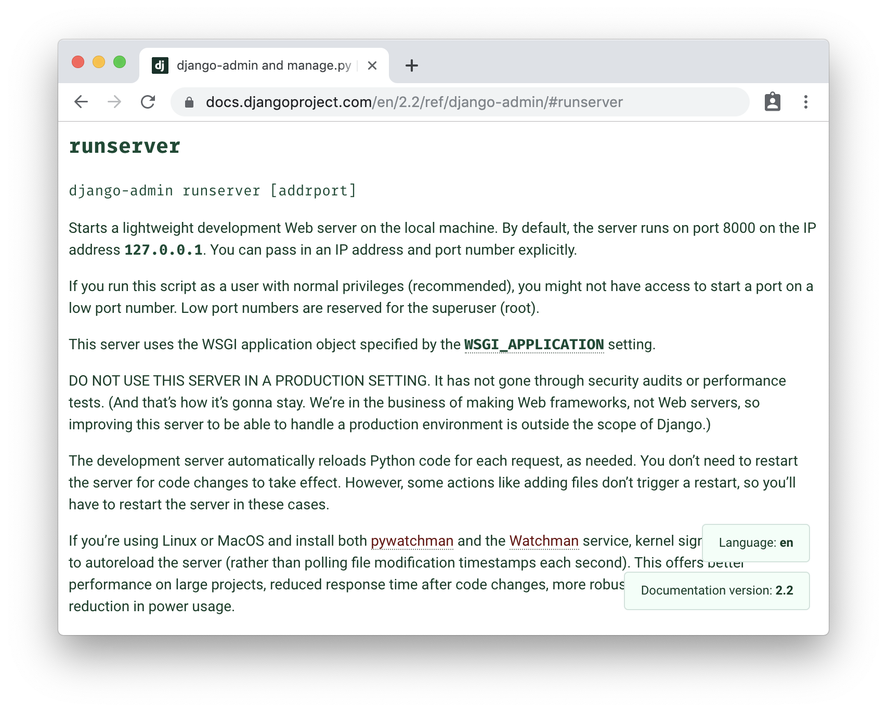
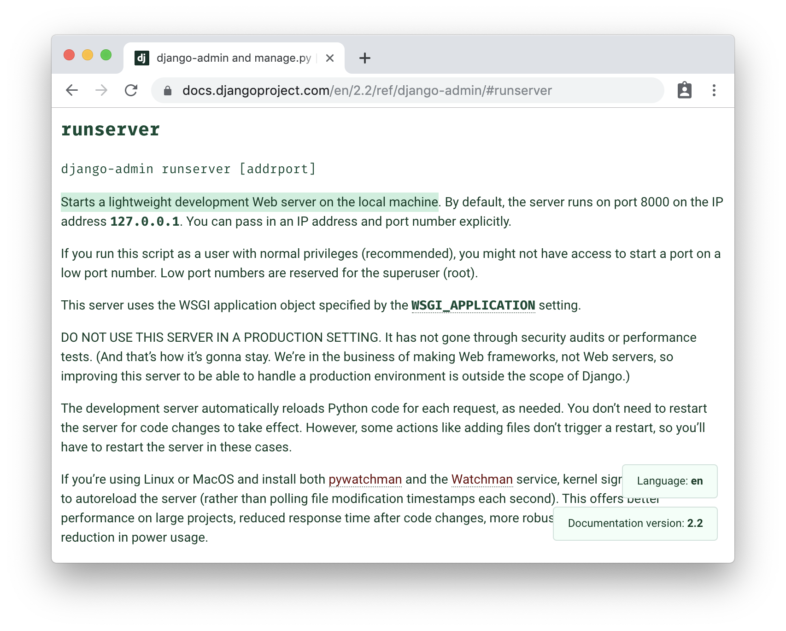
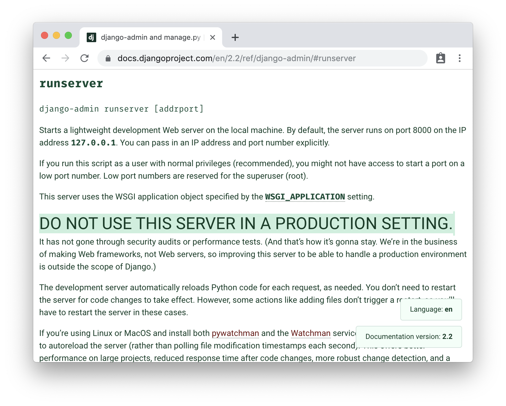
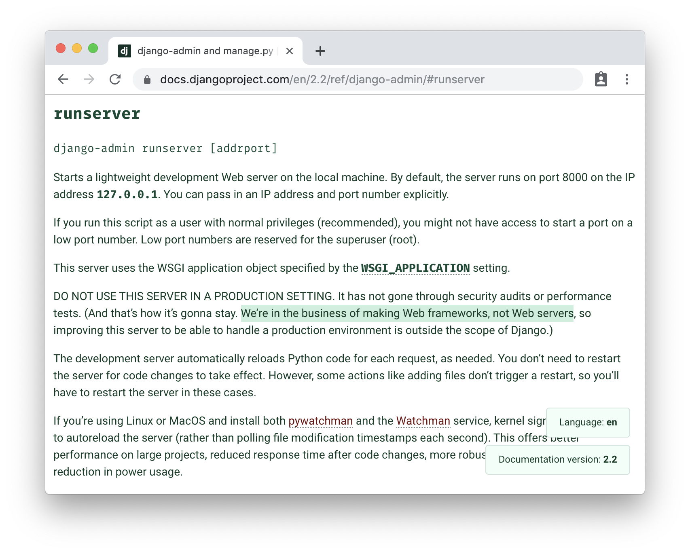
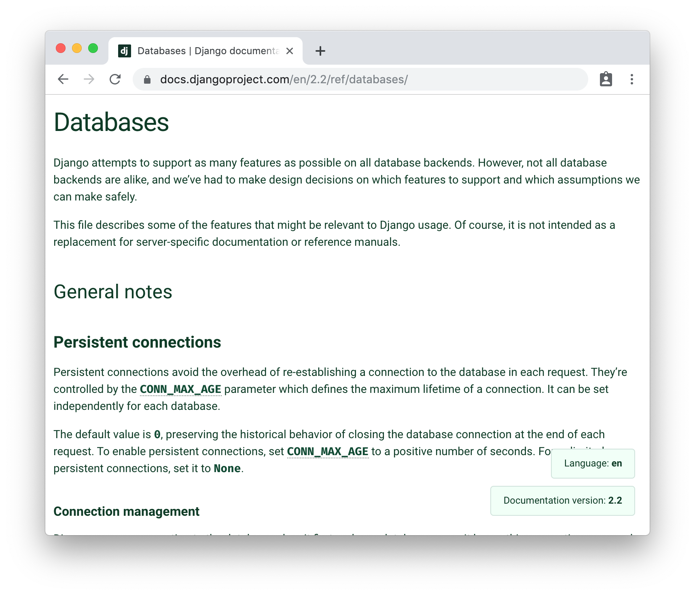
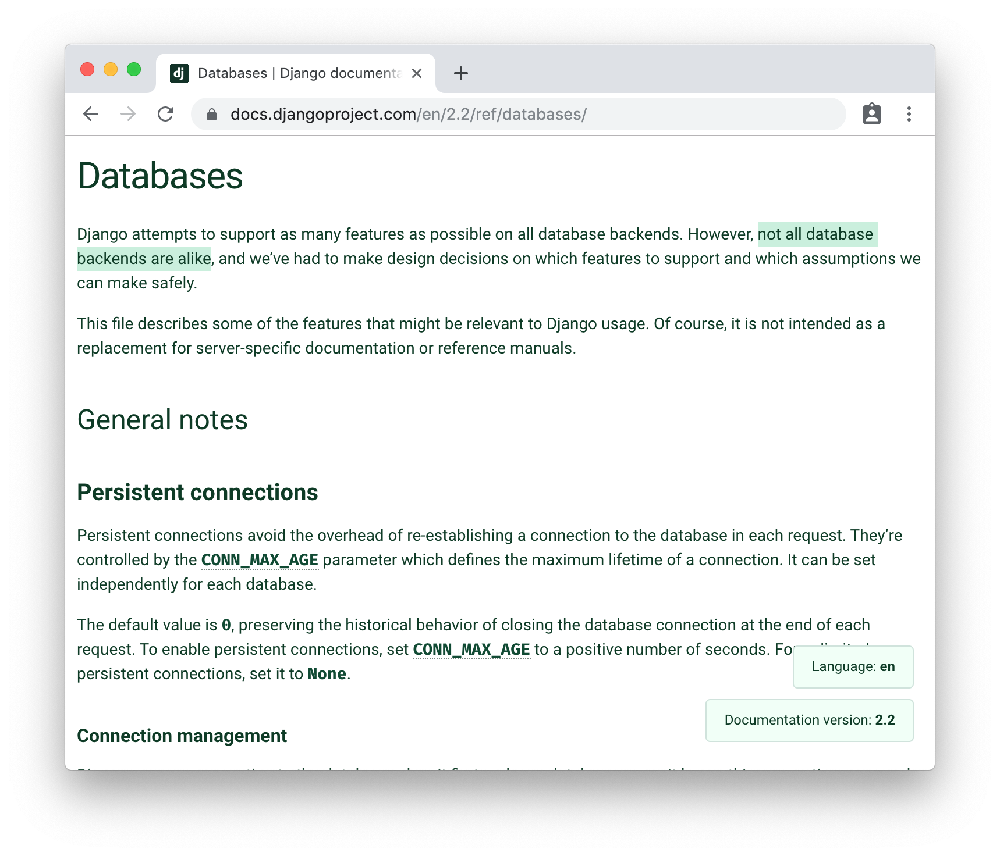
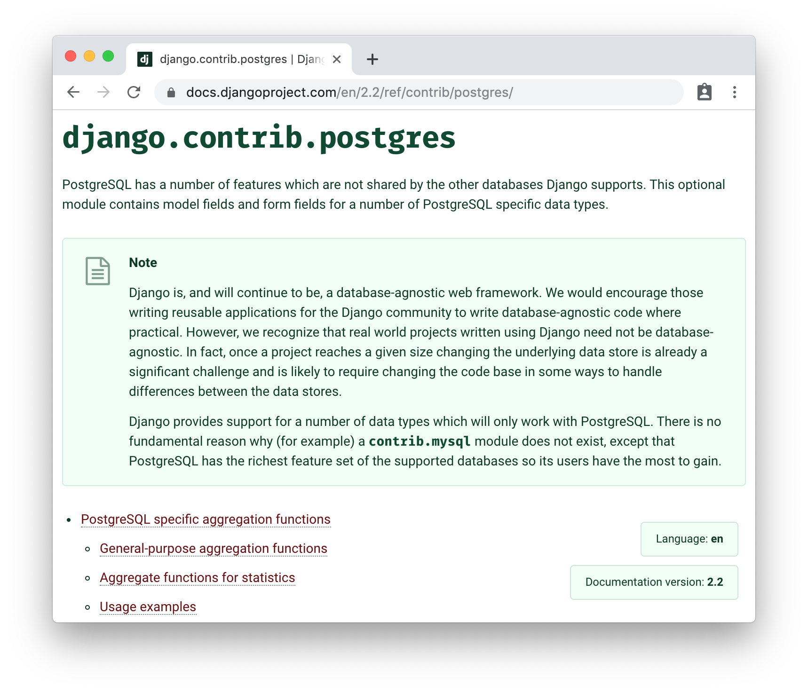

class: title
#  .thick[What is deployment, anyway?]
## .thick[PyGotham 2019]

???

breathe, Katie!

You got this

# 💪
---

???
Hi! I'm katie, and this isn't the talk you're expecting.

---

class: title
## .thin[What this talk isn't.]

???
this isn't a talk about "the one true way" to deploy your app

This talk doesn't give specific answers, mostly, but describes the ecosystem

This talk is diving into the complexities of deployment, in essense

---

class: title
# .thin[What .b[is] deployment, anyway?]

???
We'll discuss, well ,what is deployment, anyway?

---
class: title
# .thin[What is .prokyon[django] deployment, anyway?]
???

and specifically within the context of deploying a django application.

But I'm choosing django here for a reason, which will become apparaent later.
---
class: title
# Points of interest
## out of the box .prokyon[django]
## complexities
## helpers

???

we'll be taking a journey today, so instead of an agenda, here are at least a few points of interest along our trip.

We'll start by looking at exactly what comes out of the box with django

and from there discuss the complexities django has compared to other frameworks when it comes to deployment

not the complications, just the complexities.

and discuss the helpers django has to assist you.

---
class: title
# .prokyon[django] 2.2.5
# .flux[python] 3.7.4

???

the versions I'm targetting today are specifically django 2.2.5 and python 3.7.4

If you're joining me on YouTube from the year 2027, I'm sorry, things have changed since, but hopefully you find value in this talk!

---
class: title
## no extra addons

???

we're also just going to stick to base django

No additional features, no task management, no other helpers

Just whatever comes in stock standard django

This talk should be useful if you're anywhere from looking at django

to having your djangogirls tutorial project working on your laptop

to a more complex setup, but no extra complexities.

---

class: title
## Let's look at .prokyon[django]

???

so let's get started, by taking a look at django as it comes out of the box

---

bash

<ps>myrtle</ps> <dr>~/git/glasnt $</dr>
<w>&nbsp;</w>
---

bash

<ps>myrtle</ps> <dr>~/git/glasnt $</dr>
pip install django<w>&nbsp;</w>
---

bash

<ps>myrtle</ps> <dr>~/git/glasnt $</dr>
pip install django 
Collecting django 
... 
Successfully installed django-2.2.5 
<ps>myrtle</ps> <dr>~/git/glasnt $</dr>
<w>&nbsp;</w>
---

bash

<ps>myrtle</ps> <dr>~/git/glasnt $</dr>
pip install django 
Collecting django 
... 
Successfully installed django-2.2.5 
<ps>myrtle</ps> <dr>~/git/glasnt $</dr>
django-admin startproject myproject<w>&nbsp;</w>
---

bash

<ps>myrtle</ps> <dr>~/git/glasnt $</dr>
pip install django 
Collecting django 
... 
Successfully installed django-2.2.5 
<ps>myrtle</ps> <dr>~/git/glasnt $</dr>
django-admin startproject myproject 
<ps>myrtle</ps> <dr>~/git/glasnt $</dr>
<w>&nbsp;</w>
---

bash

<ps>myrtle</ps> <dr>~/git/glasnt $</dr>
pip install django 
Collecting django 
... 
Successfully installed django-2.2.5 
<ps>myrtle</ps> <dr>~/git/glasnt $</dr>
django-admin startproject myproject 
<ps>myrtle</ps> <dr>~/git/glasnt $</dr>
cd myproject<w>&nbsp;</w>
---

bash

<ps>myrtle</ps> <dr>~/git/glasnt $</dr>
pip install django 
Collecting django 
... 
Successfully installed django-2.2.5 
<ps>myrtle</ps> <dr>~/git/glasnt $</dr>
django-admin startproject myproject 
<ps>myrtle</ps> <dr>~/git/glasnt $</dr>
cd myproject 
<ps>myrtle</ps> <dr>~/git/glasnt/myproject $</dr>
<w>&nbsp;</w>
---

bash

<ps>myrtle</ps> <dr>~/git/glasnt $</dr>
pip install django 
Collecting django 
... 
Successfully installed django-2.2.5 
<ps>myrtle</ps> <dr>~/git/glasnt $</dr>
django-admin startproject myproject 
<ps>myrtle</ps> <dr>~/git/glasnt $</dr>
cd myproject 
<ps>myrtle</ps> <dr>~/git/glasnt/myproject $</dr>
ls -R<w>&nbsp;</w>
---

bash

<ps>myrtle</ps> <dr>~/git/glasnt $</dr>
pip install django 
Collecting django 
... 
Successfully installed django-2.2.5 
<ps>myrtle</ps> <dr>~/git/glasnt $</dr>
django-admin startproject myproject 
<ps>myrtle</ps> <dr>~/git/glasnt $</dr>
cd myproject 
<ps>myrtle</ps> <dr>~/git/glasnt/myproject $</dr>
ls -R 
.: 
manage.py myproject 
 
./myproject: 
⎽⎽init__.py settings.py urls.py wsgi.py 
<ps>myrtle</ps> <dr>~/git/glasnt/myproject $</dr>
<w>&nbsp;</w>
---

bash

<ps>myrtle</ps> <dr>~/git/glasnt/myproject $</dr>
<w>&nbsp;</w>
---

bash

<ps>myrtle</ps> <dr>~/git/glasnt/myproject $</dr>
python manage.py runserver<w>&nbsp;</w>

???

we can launch our app locally, using runserver
---

bash

<ps>myrtle</ps> <dr>~/git/glasnt/myproject $</dr>
.noop[p]ython manage.py runserver 
Watching for file changes with StatReloader 
Performing system checks... 
System check identified no issues (0 silenced).  
.rf[You have 17 unapplied migration(s). Your project may not work properly until you apply the migrations for app(s): admin, auth, contenttypes, sessions. Run 'python manage.py migrate' to apply them.]<br   October 04, 2019 - 17:05:24 
Django version 2.2.5, using settings 'myproject.settings' 
Starting development server at http:.noop[/]/127.0.0.1:8000/ 
Quit the server with CONTROL-C. 
<w>&nbsp;</w>
???

but we get this error

---

bash

<ps>myrtle</ps> <dr>~/git/glasnt/myproject $</dr>
.noop[p]ython manage.py runserver 
Watching for file changes with StatReloader 
Performing system checks... 
System check identified no issues (0 silenced).  
.rf[You have 17 unapplied migration(s). Your project may not work properly until you apply the migrations for app(s): admin, auth, contenttypes, sessions. Run .red['python manage.py migrate'] to apply them.]<br   October 04, 2019 - 17:05:24 
Django version 2.2.5, using settings 'myproject.settings' 
Starting development server at http:.noop[/]/127.0.0.1:8000/ 
Quit the server with CONTROL-C. 
<w>&nbsp;</w>

???

oh yay, big red error with a helpful command!

---

bash

<ps>myrtle</ps> <dr>~/git/glasnt/myproject $</dr>
.noop[p]ython manage.py runserver 
Watching for file changes with StatReloader 
Performing system checks... 
System check identified no issues (0 silenced).  
.rf[You have 17 unapplied migration(s). Your project may not work properly until you apply the migrations for app(s): admin, auth, contenttypes, sessions. Run 'python manage.py migrate' to apply them.]<br   October 04, 2019 - 17:05:24 
Django version 2.2.5, using settings 'myproject.settings' 
Starting development server at http:.noop[/]/127.0.0.1:8000/ 
Quit the server with CONTROL-C. 
<ps>myrtle</ps> <dr>~/git/glasnt/myproject $</dr>
<w>&nbsp;</w>

???

okay, cancel out of that..
---

bash

<ps>myrtle</ps> <dr>~/git/glasnt/myproject $</dr>
.noop[p]ython manage.py runserver 
Watching for file changes with StatReloader 
Performing system checks... 
System check identified no issues (0 silenced).  
.rf[You have 17 unapplied migration(s). Your project may not work properly until you apply the migrations for app(s): admin, auth, contenttypes, sessions. Run 'python manage.py migrate' to apply them.]<br   October 04, 2019 - 17:05:24 
Django version 2.2.5, using settings 'myproject.settings' 
Starting development server at http:.noop[/]/127.0.0.1:8000/ 
Quit the server with CONTROL-C. 
<ps>myrtle</ps> <dr>~/git/glasnt/myproject $</dr>
python manage.py migrate<w>&nbsp;</w>
---

bash

.cf[Operations to perform:] 
&nbsp; .tb[Apply all migrations:] admin, auth, contenttypes, sessions 
.cf[Running migrations:] 
&nbsp; Applying contenttypes.0001_initial... .gf[OK] 
&nbsp; Applying auth.0001_initial... .gf[OK] 
&nbsp; Applying admin.0001_initial... .gf[OK] 
&nbsp; Applying admin.0002_logentry_remove_auto_add... .gf[OK] 
&nbsp; Applying admin.0003_logentry_add_action_flag_choices... .gf[OK] 
&nbsp; Applying contenttypes.0002_remove_content_type_name... .gf[OK] 
... 
&nbsp; Applying auth.0009_alter_user_last_name_max_length... .gf[OK] 
&nbsp; Applying auth.0010_alter_group_name_max_length... .gf[OK] 
&nbsp; Applying auth.0011_update_proxy_permissions... .gf[OK] 
&nbsp; Applying sessions.0001_initial... .gf[OK] 
<ps>myrtle</ps> <dr>~/git/glasnt/myproject $</dr>
<w>&nbsp;</w>

---

bash

<ps>myrtle</ps> <dr>~/git/glasnt/myproject $</dr>
<w>&nbsp;</w>
---

bash

<ps>myrtle</ps> <dr>~/git/glasnt/myproject $</dr>
ls -R<w>&nbsp;</w>

---

bash

<ps>myrtle</ps> <dr>~/git/glasnt/myproject $</dr>
ls -R 
.: 
db.sqlite3 manage.py myproject 
 
./myproject: 
__init__.py settings.py urls.py wsgi.py 
<ps>myrtle</ps> <dr>~/git/glasnt/myproject $</dr>
<w>&nbsp;</w>

---

bash

<ps>myrtle</ps> <dr>~/git/glasnt/myproject $</dr>
ls -R 
.: 
.red[db.sqlite3] manage.py myproject 
 
./myproject: 
__init__.py settings.py urls.py wsgi.py 
<ps>myrtle</ps> <dr>~/git/glasnt/myproject $</dr>
<w>&nbsp;</w>

---

bash

<ps>myrtle</ps> <dr>~/git/glasnt/myproject $</dr>
<w>&nbsp;</w>

---

bash

<ps>myrtle</ps> <dr>~/git/glasnt/myproject $</dr>
python manage.py runserver<w>&nbsp;</w>

???

will my project run now?
---

bash

<ps>myrtle</ps> <dr>~/git/glasnt/myproject $</dr>
.noop[p]ython manage.py runserver 
Watching for file changes with StatReloader 
Performing system checks...  
System check identified no issues (0 silenced). 
 October 04, 2019 - 17:05:54 
Django version 2.2.5, using settings 'myproject.settings' 
Starting development server at http:.noop[/]/127.0.0.1:8000/ 
Quit the server with CONTROL-C. 
<w>&nbsp;</w>

???

Oh neat, no more error.
---

bash

<ps>myrtle</ps> <dr>~/git/glasnt/myproject $</dr>
.noop[p]ython manage.py runserver 
Watching for file changes with StatReloader 
Performing system checks...  
System check identified no issues (0 silenced). 
 October 04, 2019 - 17:05:54 
Django version 2.2.5, using settings 'myproject.settings' 
Starting development server at .red[http:.noop[/]/127.0.0.1:8000/] 
Quit the server with CONTROL-C. 
<w>&nbsp;</w>

???

and a helpful little message telling us where we're running
---
class: middle, center, image

---
class: middle, center, image

???

and we have the much loved django admin

---
class: title
# .prokyon[django]
## good local development story

???

we can get our app running locally really well.

and a lot of this boils down to
---
   
# .code[runserver]

???

runserver does everything we need to in our local system.
---
   
# .code[runserver]
### local web server
---
class: middle, center, image

.footnotes[[➚](https://docs.djangoproject.com/en/2.2/ref/django-admin/#runserver)]
---
class: middle, center, image

.footnotes[[➚](https://docs.djangoproject.com/en/2.2/ref/django-admin/#runserver)]
???

As the documentation says, runserver starts a lightweight development web server on your ocal machine.
But. And there's a big but.
---
class: middle, center, image

.footnotes[[➚](https://docs.djangoproject.com/en/2.2/ref/django-admin/#runserver)]
???

do not use this server in a production setting.

---
class: middle, center, image

.footnotes[[➚](https://docs.djangoproject.com/en/2.2/ref/django-admin/#runserver)]
---
 
# .quote["We're in the business of making Web frameworks, not Web servers"]
### - .prokyon[django] documentation
???

I want to pull this out and elaborate.

Django is an extremely stable, production ready, web framework.

Django is very good at being a web framework.

The fact that it provides any local web server functionality at all is amazing, but the fact that it calls out that it's not for production is also very very good.

We'll discuss a selection of webservers you should use in production a bit later.
---
   
# .code[runserver]
### local web server + static server
???

on top of runserver being a local web server, it also serves our static.
---
class: middle, center, image

.footnotes[[➚](https://docs.djangoproject.com/en/2.2/howto/static-files/#serving-static-files-during-development)]
???

again as per the documentation we have a local static files server
---
class: middle, center, image

.footnotes[[➚](https://docs.djangoproject.com/en/2.2/howto/static-files/#serving-static-files-during-development)]

???
it does say that this is only if we have the staticfiles app and debug set to trtrue
---

bash

<ps>myrtle</ps> <dr>~/git/glasnt/myproject $</dr>
<w>&nbsp;</w>
???

Which if we check out settings file we have both.
---

bash

<ps>myrtle</ps> <dr>~/git/glasnt/myproject $</dr>
cat myproject/settings.py |grep staticf<w>&nbsp;</w>
---

bash

<ps>myrtle</ps> <dr>~/git/glasnt/myproject $</dr>
cat myproject/settings.py |grep staticf 
&nbsp; &nbsp; 'django.contrib.staticfiles', 
<ps>myrtle</ps> <dr>~/git/glasnt/myproject $</dr>
<w>&nbsp;</w>
---

bash

<ps>myrtle</ps> <dr>~/git/glasnt/myproject $</dr>
cat myproject/settings.py |grep staticf 
&nbsp; &nbsp; 'django.contrib.staticfiles', 
<ps>myrtle</ps> <dr>~/git/glasnt/myproject $</dr>
cat myproject/settings.py | grep DEBUG<w>&nbsp;</w>
---

bash

<ps>myrtle</ps> <dr>~/git/glasnt/myproject $</dr>
cat myproject/settings.py |grep staticf 
&nbsp; &nbsp; 'django.contrib.staticfiles', 
<ps>myrtle</ps> <dr>~/git/glasnt/myproject $</dr>
cat myproject/settings.py | grep DEBUG 
DEBUG = True 
<ps>myrtle</ps> <dr>~/git/glasnt/myproject $</dr>
<w>&nbsp;</w>
---
class: middle, center, image

.footnotes[[➚](https://docs.djangoproject.com/en/2.2/howto/static-files/#serving-static-files-during-development)]
???

but, as with the runserver, there's a note telling us
---
class: middle, center, image

.footnotes[[➚](https://docs.djangoproject.com/en/2.2/howto/static-files/#serving-static-files-during-development)]
???

this is not for production use.

While we're also looking at our default settings file
---
   
# .code[DATABASES]
### default: sqlite

???

the default for our database has already been set for a local sqlite database.

---

bash

<ps>myrtle</ps> <dr>~/git/glasnt/myproject $</dr>
ls -R 
.: 
.red[db.sqlite3] manage.py myproject 
 
./myproject: 
__init__.py settings.py urls.py wsgi.py 
<ps>myrtle</ps> <dr>~/git/glasnt/myproject $</dr>
<w>&nbsp;</w>
???

We saw this earlier in our files.

---

bash

<ps>myrtle</ps> <dr>~/git/glasnt/myproject $</dr>
cat myproject/settings.py | grep sqlite -C2 
DATABASES = { 
&nbsp; &nbsp; 'default': { 
&nbsp; &nbsp; &nbsp; 'ENGINE': 'django.db.backends.sqlite3', 
&nbsp; &nbsp; &nbsp; 'NAME': os.path.join(BASE_DIR, 'db.sqlite3'), 
&nbsp; &nbsp; } 
} 
<ps>myrtle</ps> <dr>~/git/glasnt/myproject $</dr>
<w>&nbsp;</w>
???

this was created due to the default DATABASES setting where sqlite is defined as the default backend.

---

class: middle, center, image

.footnotes[[➚](https://docs.djangoproject.com/en/2.2/ref/databases/#sqlite-notes)]
???

and, again, as per the documentation, sqlite is great in a

---
class: middle, center, image

.footnotes[[➚](https://docs.djangoproject.com/en/2.2/ref/databases/#sqlite-notes)]
???

development environment.
---
class: title
# .prokyon[django]
## ease of use in development
???

django a really good development story

but all the helpers we used in development cannot and should not be used
in production.

so we can't use any of these helpers
---

class: title
# .prokyon[django]
## complex in production

???

which makes our production use.. complex.

django doesn't provide you with a webserver or database that's production ready

So you have to provide your own.

We'll get into some of the options in a moment.

But first I want to mention something important

---
   
# .poly[Flask]
## simpler in production .h3[(comparatively)]
???
Compare the out of the box functionality of django to something like flask

A lot of tutorials you see out there use flask as the target of a python web server deployment demonstration

This is because of one simple fact
---
class: title
# .b[state]

???

django is a stateful application. It has a database out of the box and static assets.

Flask by default does not. It can, but out of the box, it doesn't

---

class: title
# stateful applications
## complex in production

???

any application that has state is complex in production.

This is why I chose to use django for my context

If I'd chosen flask, the discussion of deployment could be **really easy**

buyt it's not just django; any time you care about persistence you add complexity to your deployments.

And, funnily enough, this is also mentioned in the docs

---
class: middle, center, image

.footnotes[[➚](https://docs.djangoproject.com/en/2.2/howto/static-files/deployment/#serving-static-files-in-production)]

???

This section which discusses static deployment has this wonnderful gem

---

class: middle, center, image

.footnotes[[➚](https://docs.djangoproject.com/en/2.2/howto/static-files/deployment/#serving-static-files-in-production)]

???

every production setup will be a bit different.

---

class: title
# .quote["Every production setup will be a bit different"]
### - .prokyon[django] documentation
???
I'm not sure who added this line to the documentation

which has been in the docs for a decade at this point

but whoever it was was such a smart cookie.

This is so so important.

So important it's on it's own slide.

But this statement is so so true.

---

class: title
# .quote["It depends."]
### - every deployment talk ever

???

Nearly every talk I've seen on deployment includes a line likee

it depends

When trying to tell you the "one true way" to do django deployments.

Because it's true.

But I'm not going to use that line. I'm going to use another one.

---

class: title
# .quote["I'm an operations engineer. I'm not your operations engineer."]
### - @glasnt

???

I prefer this line.

I'm an operations engineer, I'm not your operations engineer.

I've been a sysadmin, operations engineer, SRE, whatever you want to call it

on and off for nearly the last decade.

I've worked for

... web hosting providers

... platforms as a service

and now

infrastructure as a service.

And each and every deployment is different and unqiue and beautiful and complex.

---
  
# to deploy a stateful app:
???

and for any stateful application, you have at the bare minimum three major segments
---
  
# to deploy a stateful app:
## run web framework
???

you need a way to run the web framework, whatever it is

---
  
# to deploy a stateful app:
## run web framework connect to a database
???

a way to connect to your database
---
  
# to deploy a stateful app:
## run web framework connect to a database serve static files
???

and a way to serve whatever static apps you have.

this exact trifecta is the same for Django.
---
  
# to deploy .prokyon[django]:
## run django connect to a database serve static files
???

you need to run the web framework, connect to a database, and serve the static.

These are the same requirements are for any stateful application

Therefore, we can explore what a stateful application deployment means without
having to keep outselves within django itself

But, thankfully for us using django, we have some helpers.

---
  
# .prokyon[django] helpers
## WSGI .c[migrate] .c[collectstatic]

???

in order they are wsgi compatitbility, the migrate command, and the collect static command.

The rest of this talk will be describing how these helpers work.

Which will help us in exploring the options we have for deployment
---
class: title
# WSGI
## Web Server Gateway Interface
### 🔊 *ˈ(h)wiskē*

???

the web server gateway interface is a python standard for web servers
---
class: middle, center, image

???

again, as per the docs

i love the docs

django's proimary deployment platform

is wsgi

class: title

---
class: middle, center, image

???

but as noted: the start project command sets up a simple default WSGI condig for you.

Which we can see from our project earlier.

---

bash

<ps>myrtle</ps> <dr>~/git/glasnt/myproject $</dr>
<w>&nbsp;</w>
???

in our terminal, looking at the files we have
---

bash

<ps>myrtle</ps> <dr>~/git/glasnt/myproject $</dr>
ls -R<w>&nbsp;</w>
???

we can list our files
---

bash

<ps>myrtle</ps> <dr>~/git/glasnt/myproject $</dr>
ls -R 
.: 
db.sqlite3 manage.py myproject 
 
./myproject: 
⎽⎽init__.py settings.py urls.py wsgi.py 
<ps>myrtle</ps> <dr>~/git/glasnt/myproject $</dr>
<w>&nbsp;</w>

???
---

bash

<ps>myrtle</ps> <dr>~/git/glasnt/myproject $</dr>
ls -R 
.: 
db.sqlite3 manage.py myproject 
 
./myproject: 
⎽⎽init__.py settings.py urls.py .red[wsgi.py] 
<ps>myrtle</ps> <dr>~/git/glasnt/myproject $</dr>
<w>&nbsp;</w>

???

and see indeed there is a wsgi.py file
---

bash

<ps>myrtle</ps> <dr>~/git/glasnt/myproject $</dr>
ls -R 
.: 
db.sqlite3 manage.py myproject 
 
./myproject: 
⎽⎽init__.py settings.py urls.py wsgi.py 
<ps>myrtle</ps> <dr>~/git/glasnt/myproject $</dr>
cat myproject/wsgi.py<w>&nbsp;</w>

???

the contents of which...
---

bash

WSGI config for myproject project.  It exposes the WSGI callable as a module-level variable named 'application'. For more information on this file, see https:.noop[/]/docs.djangoproject.com/en/2.2/howto/deployment/wsgi/ """ import os  from django.core.wsgi import get_wsgi_application  os.environ.setdefault('DJANGO_SETTINGS_MODULE', 'myproject.settings')  application = get_wsgi_application() 
<ps>myrtle</ps> <dr>~/git/glasnt/myproject $</dr>
<w>&nbsp;</w>

---

class: title
# Deploy a .prokyon[django] app with a WSGI webserver
---

class: title
# WSGI webservers:
## .nl[[uWSGI](https://uwsgi-docs.readthedocs.io/en/latest/)]
## .nl[[gunicorn](https://gunicorn.org)]

.footnotes[[Type UWSGI, Press Enter, what happens?](https://www.youtube.com/watch?v=YoUZIzPGKT8) P. James, [Secrets of a WSGI master](https://www.youtube.com/watch?v=CPz0s1CQsTE) G. Dumpleton]
???

some of the options you have include microwshi and gunicorn

Both of these webservers have their own cache of documentation, talks, and resources, which my slides link to.

---

class: title
# How do you deploy WSGI webserver?

???

but how do you deploy a wsgi websever

There are so many options

and what you choose is going to dictate some of the options available to you later.
---
class: title
# .so[How do you deploy WSGI webserver?]
???

but I have a better question

---
  
## How much custom infrastructure do you want?
???

how much custom infrastrcutre do you want?

Because as we saw before, every production setup is a bit different

but there are plenty of options out there for you if you want to use a template that works for
80% of cases

and if you only have a standard django app, then these are going to work for you.
---

  
## .so[How much custom infrastructure do you want?]
???

and probably more importantly.
---
  
## How much infrastructure management do you want to do yourself?

???

how much infrastrcutre management do you want to do yourself?

If you are a django developer, then you probably want to develop django

you don't want to be spending your time trying to manage your infrastrcture

it's super interesting, sure, but when you want is just to get your application online, then why not pay someone who has spent the time to setup a way that works for 80% of websites

In our setup, we don't have anything custom, so why not let someone else manage tings for you?

put in more simpler terms

---
  
## What do you want to worry about?

???

what do you want to worry about
---

class: title
# Managed hosting:
## Platform as a Service
## Infrastructure as a Service
.footnotes[* non-exhaustive]

???

in the managed hosting world, for the complexity of project we're talking about, there are two major options

PaaS and IaaS
---

class: title
# Managed hosting:
## PaaS
## IaaS
.footnotes[* non-exhaustive]

???

you'll often seen these abbreviated as Paas or IaaS, because words are getting long and we're busy technologists.

And yes, this is non-exhaustive. Within the scope of deploying a django application, these are the two major options.

You could go as detailed as running your app on a server you have in your own home or business ("on-prem"), or trying to squeeze django into a function as a service, but these are the 20% of cases.

I'm going to focus on the ones that are much more suited for django

---
  
# Platform as a Service
### worry about: your .prokyon[django] app, data

.footnotes[Example providers: Heroku, Divio, Google Cloud, PythonAnywhere]

???

in general your platforms as service are going to be places where you provide your code to them, often fit to some sort of template, which normally includes the command to run to get your app working. This will often be uwsgi or guniconr

---
  
# Platform as a Service
### managed for you:  web server, operating system, hardware, storage, networking...
.footnotes[Example providers: Heroku, Divio, Google Cloud, PythonAnywhere]

???

the things that will be managed for you include the web server (often included in whatever template you have), the operating system, the physical hardware, the storage, networking, and a whole host of other things.

On the otherhand, if you have opinions about some of the earlier elements in this, you can jump down into
---
  
# Infrastructure as a Service
### worry about: your .prokyon[django] app, data web server, operating system
.footnotes[Example providers: Google Cloud, Amazon Web Services, Azure]
???

IaaS. Where you can worry about your web server and operating system.

---
  
# Infrastructure as a Service
### managed for you:  hardware, storage, networking...
.footnotes[Example providers: Google Cloud, Amazon Web Services, Azure]
???

and you pay for someone else to manage the hardware, storage, etc.

Now this is very very much an overgeneralisation, as there is an entire other talk on the complexities of infrastrcutre as a service.

but there is a reason I mentioned this

---
  
# to deploy .prokyon[django]:
## run django connect to a database serve static files
???

our list of things we need to deploy a django app

---
  
# to deploy .prokyon[django]:
## .so[run django] connect to a database serve static files
???

we've covered one

And the next one is a database.
and here's the secret
---

class: title
# .code[makemigrations migrate]

???

these two commands, in my own personal opinion, two of the greatest features of django

Oh, I mean having a dynamic web admin is pretty sweet, but these two commands are just choice.

---

class: title
# .code[migrate] created to reduce developer toil

???
TODO CITATION (DJANGO CHAT?, Andrew Godwin mentioned this **somewhere**)

The whole concept of automating the migration framework was design to reduce developer toil

Indeed django is a database agnostic web framework, so you houldn't have to worry

---

bash

.cf[Operations to perform:] 
&nbsp; .tb[Apply all migrations:] admin, auth, contenttypes, sessions 
.cf[Running migrations:] 
&nbsp; Applying contenttypes.0001_initial... .gf[OK] 
&nbsp; Applying auth.0001_initial... .gf[OK] 
&nbsp; Applying admin.0001_initial... .gf[OK] 
&nbsp; Applying admin.0002_logentry_remove_auto_add... .gf[OK] 
&nbsp; Applying admin.0003_logentry_add_action_flag_choices... .gf[OK] 
&nbsp; Applying contenttypes.0002_remove_content_type_name... .gf[OK] 
... 
&nbsp; Applying auth.0009_alter_user_last_name_max_length... .gf[OK] 
&nbsp; Applying auth.0010_alter_group_name_max_length... .gf[OK] 
&nbsp; Applying auth.0011_update_proxy_permissions... .gf[OK] 
&nbsp; Applying sessions.0001_initial... .gf[OK] 
<ps>myrtle</ps> <dr>~/git/glasnt/myproject $</dr>
<w>&nbsp;</w>
???

These are the migrations we generated earlier

these create the data strcutures required for the the django admin to work

you can see it in the filenames - admin, auth (authentication), sessions.

But to migrate data, you need a database.

and here's the secret.
---
class: title
## Managed databases are just a specialised aaS

???

managed databases are just specalised "as a service"

whatever bucket you want to put them in depends on your definition, if they IaaS or Paas or even Software as a service, but either way, they're a service.

---
  
## Managed databases
### worry about:  your data models
.footnotes[Example providers: your PaaS or IaaS provider]
???

you define your data models in your app
---

  
## Managed databases
### .prokyon[django] worries about: generating and applying migrations
.footnotes[Example providers: your PaaS or IaaS provider]
???

making the migrations and applying them to whatever database you choose is django's problem. More on that a bit later.
---
  
## Managed databases
### managed for you: storage, backups, persistence, maintenance...

.footnotes[Example providers: your PaaS or IaaS provider]

???

your database host will often handle everyhitng from backups to storage (including scaling storage, which is often very good.

These will often be available from your web server provider, which is often a very good idea because the closer your web server and database the faster you can send data between the two parts of your application.

TODO

more here something along the lines of

there is no reason not to use a managed database any more

managed databases are a solved problem, pay for one and get the benefits

a lot of people use databases, so a lot of work has gone into them

pay just a little bit and you often get:

- persistence
- backups
- maintenance windows
- more so: you don't have to manage it.

heck, some now days even automatically expand and the providers handle this without downtime for you

this and your domain name might be the only thing you end up paying for in a smaller stack, but it's worth it.

ENDTODO

---
  
# Which database?
---

class: middle, center, image

.footnotes[[➚](https://docs.djangoproject.com/en/2.2/ref/databases/)]

???

the docs are useful here, expect there's a super important note

---

class: middle, center, image

.footnotes[[➚](https://docs.djangoproject.com/en/2.2/ref/databases/)]

???

not all databases backends are alike, and there have been some design considerations.

---
 
# Supported databases
## PostgreSQL 9.4+ (psycopg2 2.5.4+) MySQL 5.6+ (InnoDB) Oracle 12.1+ SQLite 3.8.3
.footnotes[[limitations](https://docs.djangoproject.com/en/2.2/ref/databases/), [oracle + django](https://slides.com/iqbaltalaatbhatti/oracle-django)]

???

django does support a number of databases, including postgresql, mysql, oracle, and sqlite.

There is also third party support for a number of other databases, but again

---
  
## What do you want to worry about?

???

what do you want to worry about?

If you already have a database expert, choose the one they know.
If you have a preferred one, choose that.

Otherwise

---

class: title
## No opinion?
### choose PostgreSQL

???

choose postgresql

Shock I know right. I'm actually telling you something solid.

But it's not without reason.

---

class: middle, center, image

???

the docs specifically point this out.

django is a database agnostic web framework

but django provides support for a number of datatypes that only work in postgressql.
---
class: title
# to deploy .prokyon[django]:
## .so[run django connect to a database] serve static files
---

class: title
# .code[collectstatic]

???

the helper here is collectstatic

---

class: title
# static asset management
## an entire talk

.footnotes[["Assets in Django without losing your hair" by Jacob Kaplan-Moss](https://www.youtube.com/watch?v=E613X3RBegI)]

---

class: title
# asset management options:

## simple assets
## cloud storage
## media uploads
## asset compilation
.footnotes[["Assets in Django without losing your hair" by Jacob Kaplan-Moss](https://www.youtube.com/watch?v=E613X3RBegI)]

???

he details four scenarios,

simple assets

cloud storage

media uploads

and the more complex asset compilation ption

if you chose a chose a IaaS provider earlier, they probably offer some sort of cloud storage, which is super useful to have, again, to keep everything physically close.

If you went with the PaaS, perhaps the simple asset solution is for you.

TODO

more here, something long the lines of:

out of all the tech I've discussed so far, cloud storage is the oldest and most solid

AWS literally launched S3 in 20XX. That's YY years ago.

storing media objects is a foundational service provided by any cloud provider.
and it's totally okay to use

the scariest thing when I first came across s3 was the fact that I had to use a global bucket name. Like, a name that had never been used before
but that's okay

the way this works means that the name must be unique for every reference

use this foundational service of the current internet age

and make sure that when you name your bucket it's not just your app's name or your internet name because once you use that name it's gone forever and you'll probably want to change your naming scheme at once point so if it's your first one just make sure it's not a super cool name.

ENDTODO

---

  
# to deploy .prokyon[django]:
## .so[run django connect to a database serve static files]
???

so we've covered each of the three major tenants.

So

---
class: title
# actually deploying

???

actually deploying.

we're finally there.

---
class: title
## [copy code to host] .c[python manage.py migrate] .c[python manage.py collectstatic] [start web server]

???

here it is.

- copy your code to wherever you're hosting
- run your two management commands
- and start your web server, whichever that is.

I know. This doesn't seem like a lot.

But given the last XX minutes I spent describing all this, hopefully you now have a greater understanding of the complexity.
---
   
# Things I didn't mention
???

there's so much more to this topic that I just can't even hope to cover.
--

### continuous deployment, monitoring, scaling, logging, high availablilty, load balancing, secrets, orchestration, zero downtime deployments, blue/green deployments, A/B testing, containers, configuration management, automation...

???
Nearly each of these topics is their own entire *conference* worth of material.

But hopefuully I've been able to help you just see a bit behind the curtain of deployment.

---
class: title
#  Thanks!

???

I'm happy to take questions in the hallway, so we can let the next speaker get setup. Thanks!