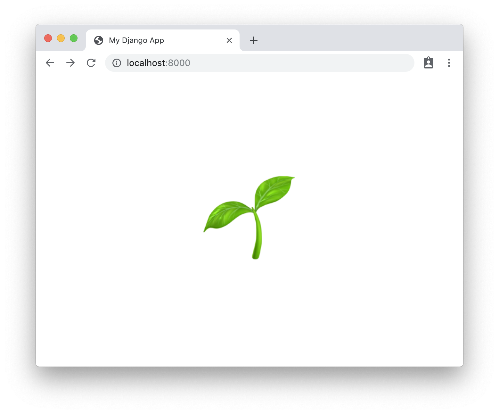
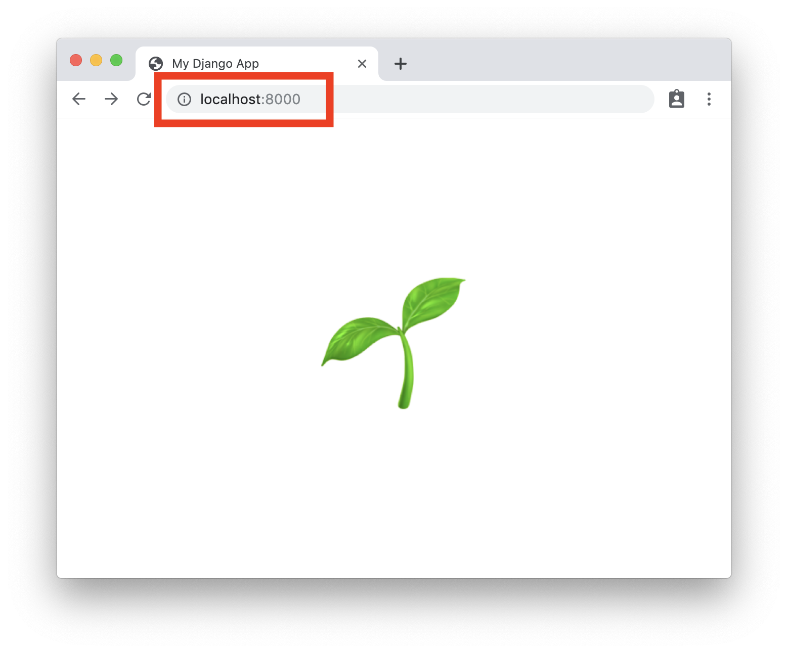

class: title
#  What is deployment, anyway?
## PyGotham 2019

???

breathe, Katie!

You got this

# 💪
---

???

on conference theme

Before I start, a bit about me.
---
class: title
# .e[👩🏻‍🔧]

???

Over the years I've had a number of different jobs titles

system adminstrator
automation engineer
operations engineer
site reliability engineer

but in all of these roles, I've had one general job requirement

---

class: title
# .e[🔧]
???

I've been the person that keeps your website up.

More importantly,

---

class: title
# .e[⏰]

???

I'm the one that got woken up in the middle of the night if your website went down.

---

class: title
# .e[👩🏼‍💻👨🏽‍💻 ➡ 👩🏻‍🔧]

???

You develop your website, I make sure it stays up.

For todays's talk.
---
class: title
# .e[👩🏼‍💻👨🏽‍💻 ➡ 👩🏻‍🔧]
# ↑ you ↑.w[...................]

???

I'm going to make the assumption that you're a developer

and given you're at PyGotham

---
class: title
# .e[👩🏼‍💻🐍 ➡ 👩🏻‍🔧]
# ↑ you ↑.w[...................]

???

I'm going to assume you're a Python developer.

And, if I make take it a step further

---

class: title
# .e[👩🏼‍💻🦄 ➡ 👩🏻‍🔧]
# ↑ you ↑.w[...................]

???

a Django developer.

---

class: title
# .e[👩🏼‍💻🦄]

???

say, you've just made your first django website.

You've spent the day at a django girls workshop, and you have yourself a really nice little application.
---

class: middle, center, image

???

and it's great! you can open it in your browser!

Problem. It's only available in your browser.

---

class: middle, center, image

???

the website your looking at is, literally, your local host.

This is your machine.

The djangogirl next to you can't open your website on her machine.
---

python3.7

<ps>myrtle</ps> <dr>~/my_project $</dr>
.noop[python] manage.py runserver 
Watching for file changes with StatReloader 
Performing system checks...  
System check identified no issues (0 silenced). 
October 5, 2019 - 13:06:37 
Django version 2.2.5, using settings 'my_project.settings' 
Starting development server at http:/.noop[/]127.0.0.1:8000/ Quit the server with CONTROL-C. 
[05/Oct/2019 13:06:42] "GET / HTTP/1.1" 200 193 
<w>&nbsp;</w>

???

that's because you're running something like this on your machine.

---

python3.7

<ps>myrtle</ps> <dr>~/my_project $</dr>
.noop[python] manage.py runserver 
Watching for file changes with StatReloader 
Performing system checks...  
System check identified no issues (0 silenced). 
October 5, 2019 - 13:06:37 
Django version 2.2.5, using settings 'my_project.settings' 
.red[Starting development server at http:/.noop[/]127.0.0.1:8000/] Quit the server with CONTROL-C. 
[05/Oct/2019 13:06:42] "GET / HTTP/1.1" 200 193 
<w>&nbsp;</w>

???

you are running a development server. On your laptop.

So of course noone else can access it!

---

class: title
# .e[🦄]

???

so you need to take your little django app, and put it somewhere that other can access it.
---

class: title
# .e[💻]
???

instead of your laptop

---

class: title
# .e[☁️]
???

it needs to be in the cloud
---

class: title
# .caps[The Cloud]
### someone else's computer

???

and by that I mean literally.
---
class: title
# .sup[🔜].e[☁️].sup[✨]

???

and to get it there, that's deployment!
---

class: title
# .caps[Deployment]
### your code on someone else's computer
---
class: title
# .e[🤭]
???

I know right. Shock. But that's the spoiler.
---

class: title
# .e[☁️]

???

while the way you used to host a website was, literally, your desktop in your house, the new vogue is using a dedicated platform designed to do such a thing.

---

class: title
# .e[🔌]

???

heck, I've worked for clients were their website was a desktop computer, plugged into dedicated redundant power in our datacentre, connected to our network.

Literally a beige box sitting in a data center, as the server.

---
class: title
# .e[☁️]

???

but that's all the cloud is. Someone else's machine.

We've just spent the last how many years abstracting that more, making your website take up less space, putting more websites onto, sometimes the same machines, and slowly making it easier for you to do so.

---

class: title
# e.[🦄☁️]

???

so while I'm going to take a bit about the things you need to think about when deploying a django-powered website, I am also going to take more about how you deploy websites in general.

---

TODO

so why can't I just copy what I have directly onto someone else's machine?

runserver bad

how to deploy in productoin

wsgi.py file!

PaaS vs IaaS

Deploying to PyThonAnywhere
Deploying to Cloud Run

---
class: title
#  Thanks!
