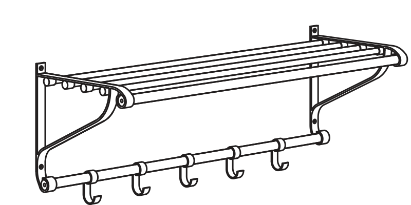

# Hat Rack <!-- .slide: class="center" -->
 
---

# DÅLIGORDLEK <!-- .slide: class="center" -->

 

Note: Don't worry about the fake Ikea name, it's a play on words.

No, seriously, it's "Word Play" in Swedish
---

 

Note: We do a lot of code stuff

How can we get the statistics to quantity ths?

---

 

Note: Github has Commit Data, Green Graphs, but it's not a lot

---

 

Note: what the other stuff we do that's not code?

---

 

Note: How can we track that

---

 

Note: let me tell you a story about Leslie and Deb

---

 

Note: Here's the five point plan

---

 

Note: Make a list

---

 

Note: Send the list

---

 

Note: Gravy - tweet about it

---

 

Note: Gravy 2 - Recommend them on linked in

NOT an endorsement

---

 

Note: All the gravy - Do it for someone not like you

---

 

Note: Share the love

---

 

Note: Not sure who to thank?

---

 

Note: There's an app for that for GitHub

---

# Octohat <!-- .slide: class="center" -->

## github.com/glasnt/octohat

Note: Non-code contributions against repos - comments, bugs, etc

---

#  <!-- .slide: class="center" -->
 

Note: Live Hat Rack Example

---

# #LABHR <!-- .slide: class="center" -->
## bit.do/LABHR

## github.com/glasnt/octohat

Note: Linkies